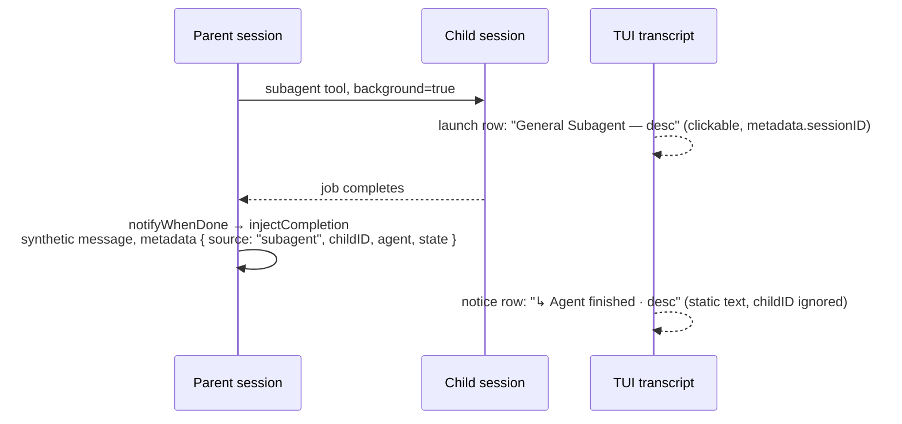

# Clickable subagent completion notices

When a background subagent finishes, the parent transcript shows a one-line
notice — `↳ <Agent> finished · <description>` — and nothing else. That notice
is inert. The only click path into the child Session is the original
`subagent` tool-launch row, which can be hundreds of lines up the transcript
(or visually collapsed away). Worse, the notice is the *only* thing the user
sees of a background child: the child's final output lives in the synthetic
message text that only the parent LLM reads, so clicking through is currently
the only way for the human to see what the child actually said — and the
affordance to do so is missing.

This patch makes the completion notice itself hover-highlight and navigate
into the child Session. It is a TUI-only, client-side change: everything
needed is already persisted in the synthetic message metadata.

## Current behavior



- **Launch row** — the `Subagent` tool-part component
  (`packages/tui/src/routes/session/index.tsx:2877`) reads
  `metadata.sessionID` and navigates on click:

  ```ts
  onClick={() => {
    const id = sessionID()
    if (id) navigate({ type: "session", sessionID: id })
  }}
  ```

  at `index.tsx:2894-2897`.

- **Completion injection** — when the subagent runs in the background (either
  `background=true` at launch or the foreground block being backgrounded
  mid-run), core arms `notifyWhenDone`
  (`packages/core/src/tool/plugin/subagent.ts:96-119`). When the child job
  settles, `injectCompletion` (`subagent.ts:80-93`) writes a synthetic parent
  message via `runtime.session.synthetic` whose text wraps the child's final
  output in `<subagent sessionID="..." state="...">...</subagent>` and whose
  metadata is `{ source: "subagent", childID, agent, state }` with `state` one
  of `completed | error | cancelled`.

- **Notice row** — `SessionNoticeMessageV2`
  (`packages/tui/src/routes/session/index.tsx:1658-1701`) renders that message
  as a static single line inside a plain `<box>`/`<text>`, two-tone heading
  (`↳ Agent finished` / `! Agent failed` / `! Agent cancelled`) plus truncated
  description suffix. It has no mouse handlers and never reads `childID`.

- **Shell notices share the renderer** — background shell completions inject
  the same message shape with `metadata: { source: "shell", state }`
  (`packages/core/src/tool/plugin/shell.ts:118`). There is no child Session
  and no `childID`; those notices must stay inert.

## Design

In `SessionNoticeMessageV2`, the `completion()` branch (`source` is
`"subagent"` or `"shell"`) becomes interactive when a `childID` is present —
which is exactly the subagent case:

- **Clickable for every terminal state.** `completed`, `error`, and
  `cancelled` notices all navigate. A failed child's transcript is the
  post-mortem; withholding navigation there would be the least useful case to
  leave broken.
- **Hover semantics mirror `InlineTool`** (`index.tsx:2383-2416`): track a
  local hover signal, brighten the heading to `theme.text.default` on hover
  while the row is clickable, restore the state color otherwise.
- **Mouse-up with selection guard**, exactly like `InlineTool` at
  `index.tsx:2409-2416`: ignore the click when
  `renderer.getSelection()?.getSelectedText()` is non-empty so drag-selecting
  the notice text never navigates.
- **Navigate like the launch row**: `useRoute().navigate({ type: "session",
  sessionID: childID })` (`index.tsx:2894-2897`).

Two rendering shapes were considered:

- **A — keep the custom markup, attach handlers** (minimal diff): add the
  hover signal and `onMouseOver`/`onMouseOut`/`onMouseUp` to the existing
  `<box marginLeft={3}>`. Preserves the exact two-tone styling.
- **B — reuse `InlineToolRow`** (recommended): render through
  `InlineToolRow` (`index.tsx:2423`), which already accepts the mouse props
  and lays out `paddingLeft={3}` plus the `INLINE_TOOL_ICON_WIDTH` icon
  column. Using icon `↳` aligns the notice's icon column with the launch
  row's `✓`, making launch and completion read as the same visual family.
  The two-tone heading/suffix survives as rich `<span>` children (the row
  applies a single `fg` only to text without its own style); hover color
  brightening is still computed at the call site since `InlineToolRow` takes
  colors, not hover logic. The existing wrap-snapshot coverage
  (`packages/tui/test/cli/tui/inline-tool-wrap-snapshot.test.tsx`) covers
  this geometry.

Either shape satisfies the requirement; B is preferred for alignment with
the launch row, A is the acceptable fallback if the span styling fights
`InlineToolRow`'s label handling.

### Explicit non-goals

- No core, protocol, or schema changes — `childID` is already in the durable
  synthetic message metadata; nothing new needs to be persisted.
- No mini-renderer work (`packages/tui/src/mini/footer.subagent.tsx` renders
  its own child rows).
- No new composer/subagents-tab behavior — "Navigate to subagent" already
  exists there (`packages/tui/src/routes/session/composer/subagents-tab.tsx`).
- No keyboard activation — transcript rows are not focusable today; see open
  questions.

## Verification

- Focused TUI test rendering `SessionNoticeMessageV2` with a synthetic
  subagent-completion message (metadata `{ source: "subagent", childID,
  agent, state }`), asserting the row is clickable and navigation fires for
  `completed`, `error`, and `cancelled`, and that a shell notice (no
  `childID`) is not clickable. Follow the harness patterns in
  `packages/tui/test/cli/tui/inline-tool-wrap-snapshot.test.tsx`.
- `bun typecheck` from `packages/tui`.
- Live pass: `bun run dev:live` from this worktree, prompt the agent to
  launch a background subagent, let it finish, and click the completion
  notice without scrolling.

## Baseline note

This workspace currently sits on the background-service reap feature line;
before implementation, rebase onto the current `v2@origin` tip per the
freshen procedure in the `working` manifest
(`~/a/doc/opencode/patches.md`). The feature itself depends on nothing but
upstream — it composes with any accepted stack.

## Open questions

- Hover affordance beyond brightening: append a `→`/`open` hint, underline
  the heading, or swap the `↳` icon on hover?
- Should the notice ever show the child's output inline (expand on click)
  instead of navigating? Navigation is the established pattern (launch row,
  subagents tab) and the immediate ask; inline expansion can come later.
- A child Session deleted after completion: `navigate` would target a missing
  session. The launch row has the same unguarded behavior today; matching it
  is acceptable, but a guard could degrade to inert.
- Keyboard path: is there a future where transcript rows (notices included)
  are keyboard-selectable, so Enter opens the child the way click does?

# Implementation — 2026-08-18 (collapsed)

Two commits on `v2@origin` `02f3f3cb`, bookmark `agent-complete`:
`e500506e` (initial extraction) and `3adc33b3` (collapse). The first
version extracted a `CompletionNoticeRow` component plus a standalone
mouse-click test; review pushed back — a carried patch gets rebased on
every `working` rebuild, and a bespoke row component with prop-threaded
`width`/`state` plus a one-off test harness (4 nested providers,
hardcoded mouse coordinates) is exactly the kind of surface that sucks
to maintain. The collapse reuses what already existed.

## Final shape

- **`SessionNoticeMessageV2` stays one function** (now exported). Its
  completion branch renders through `InlineToolRow` — the exported row
  primitive its own fallback branch and `SessionSkillMessage` already
  use, which already carries `onMouseOver`/`onMouseOut`/`onMouseUp` and
  the icon-column geometry shared with the launch row. ~10 added lines
  inside the function: a hover signal, `childID` read, and the mouse-up
  handler that mirrors the launch row (`route.navigate({ type:
  "session", sessionID })` after the text-selection guard). No new
  component, no prop threading. Total production surface vs upstream:
  46 lines in one file, including a `context` → `SessionContext`
  rename/export so the story can provide a fixture session context.
- **Existing materials reused**: the launch row already navigates at
  session create (`Subagent` tool component), the composer subagents tab
  already navigates by keyboard, and `InlineToolRow` already had the
  mouse plumbing — the patch only wires the notice into that row.
- **Verification moved to a story**: the standalone
  `completion-notice.test.tsx` is deleted.
  `packages/tui/src/feature-plugins/system/storybook/completion-notice.tsx`
  renders the real production `SessionNoticeMessageV2` under a nested
  fixture `RouteProvider` (clicks navigate the fixture route, shown in
  the footer — no real session is opened) and a fixture
  `SessionContext`. Keybinds cycle completion state (`tab`), subagent vs
  shell source (`c` — shell has no `childID` and must stay inert), and
  description length (`d`); `r` resets the route. Run with
  `OPENCODE_STORY=completion-notice bun run dev:live` and click the row.

## Verification

- `bun typecheck` clean from `packages/tui`; oxlint clean on the touched
  files (the one warning it raised was fixed).
- `inline-tool-wrap-snapshot.test.tsx` and `form.test.tsx` pass
  (31 tests) — no regression to the shared row primitive.
- Manual: exercise the story per above, plus the original live check
  (launch a background subagent in `dev:live`, click the completion
  notice without scrolling).

# Final shape — 2026-08-18

The storybook story was dropped too. It existed to cover the mouse path
after the unit test was deleted, but it forced exporting
`SessionNoticeMessageV2` and the session context — API surface added to
production purely for a fixture. The behavior (one guarded mouseUp →
navigate) is small enough that the single live `dev:live` pass covers it.

The feature is now the surgical minimum: one contiguous hunk inside the
private `SessionNoticeMessageV2` function in
`packages/tui/src/routes/session/index.tsx` (36 lines vs upstream),
plus this design README. No new API surface, no renames, no new source
files. A freshen onto a newer `v2@origin` tip (2026-08-18, `02f3f3cb` →
`56e66656`) rebased clean with zero conflicts, which is the property
that matters for a carried patch.

Verification remaining: one manual pass — `bun run dev:live`, launch a
background subagent, click the completion notice.

# Freshen — 2026-08-18

Rebased clean onto `v2@origin` `044d04df` ("fix(cli): preserve clean build
manifest", the 2026-08-18 fetch tip), 7 upstream commits past the previous
base `56e66656`. No conflicts — the gap touches no file this feature
modifies; `511b4556` ("navigate nested subagents") changed
`composer/subagents-tab.tsx` and `util/session.ts`, not the notice
rendering in `routes/session/index.tsx` (confirmed by diff inspection, and
`test/util/session.test.ts` passes on the new base).

Rebased commits, same messages, contiguous on `044d04df`:

- `8d49968c` docs(tui): design clickable subagent completion notices
- `4a95ffad` feat(tui): make subagent completion notices clickable
- `cfb6cb14` docs(tui): record agent-complete implementation results
- `89b9c5a5` refactor(tui): collapse completion notice into the existing
  row primitive
- `31f9291e` docs(tui): record agent-complete collapse rationale
- `7ed8778b` refactor(tui): drop completion notice storybook story
  — bookmarks `agent-complete` and `agent-complete-20260818` (jj forwarded
  both during the rebase; no backwards move needed)
- `e7d64e6d` docs(tui): record agent-complete final minimal shape (the
  workspace README follow-up above the bookmark, rebased along)

Net diff vs base is unchanged from the final shape above: this README plus
the ~36-line `SessionNoticeMessageV2` hunk in
`packages/tui/src/routes/session/index.tsx`.

Verification: `bun typecheck` clean from `packages/tui`; 50 tests pass
across `test/cli/tui/inline-tool-wrap-snapshot.test.tsx`,
`test/cli/tui/form.test.tsx`, `test/cli/tui/session-rows.test.ts`, and
`test/util/session.test.ts`. Still pending: the one manual `dev:live`
click-through pass.

# Rebuild — 2026-09-22

The August line could not be mechanically freshened because upstream now
implements its direct completion-notice navigation. The feature was rebuilt
from scratch on `dcfe1ec7bd49`, retaining upstream's notice behavior and adding
only the remaining gaps: a distinct open-child action on expanded failed rows
and frozen last-reported child context usage in completion metadata/TUI notices.

The maintained implementation and verification record is
[`rebuild-20260922.gpt56solxh.md`](/.design/agent-complete/rebuild-20260922.gpt56solxh.md).
The preceding current-behavior and implementation sections remain as lineage,
not as a description of the 2026-09-22 baseline.
