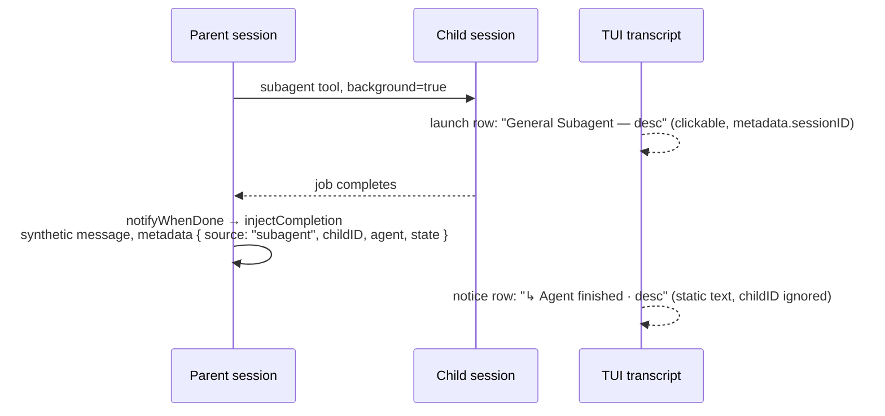

# Clickable subagent completion notices

When a background subagent finishes, the parent transcript shows a one-line
notice — `↳ <Agent> finished · <description>` — and nothing else. That notice
is inert. The only click path into the child Session is the original
`subagent` tool-launch row, which can be hundreds of lines up the transcript
(or visually collapsed away). Worse, the notice is the *only* thing the user
sees of a background child: the child's final output lives in the synthetic
message text that only the parent LLM reads, so clicking through is currently
the only way for the human to see what the child actually said — and the
affordance to do so is missing.

This patch makes the completion notice itself hover-highlight and navigate
into the child Session. It is a TUI-only, client-side change: everything
needed is already persisted in the synthetic message metadata.

## Current behavior



- **Launch row** — the `Subagent` tool-part component
  (`packages/tui/src/routes/session/index.tsx:2877`) reads
  `metadata.sessionID` and navigates on click:

  ```ts
  onClick={() => {
    const id = sessionID()
    if (id) navigate({ type: "session", sessionID: id })
  }}
  ```

  at `index.tsx:2894-2897`.

- **Completion injection** — when the subagent runs in the background (either
  `background=true` at launch or the foreground block being backgrounded
  mid-run), core arms `notifyWhenDone`
  (`packages/core/src/tool/plugin/subagent.ts:96-119`). When the child job
  settles, `injectCompletion` (`subagent.ts:80-93`) writes a synthetic parent
  message via `runtime.session.synthetic` whose text wraps the child's final
  output in `<subagent sessionID="..." state="...">...</subagent>` and whose
  metadata is `{ source: "subagent", childID, agent, state }` with `state` one
  of `completed | error | cancelled`.

- **Notice row** — `SessionNoticeMessageV2`
  (`packages/tui/src/routes/session/index.tsx:1658-1701`) renders that message
  as a static single line inside a plain `<box>`/`<text>`, two-tone heading
  (`↳ Agent finished` / `! Agent failed` / `! Agent cancelled`) plus truncated
  description suffix. It has no mouse handlers and never reads `childID`.

- **Shell notices share the renderer** — background shell completions inject
  the same message shape with `metadata: { source: "shell", state }`
  (`packages/core/src/tool/plugin/shell.ts:118`). There is no child Session
  and no `childID`; those notices must stay inert.

## Design

In `SessionNoticeMessageV2`, the `completion()` branch (`source` is
`"subagent"` or `"shell"`) becomes interactive when a `childID` is present —
which is exactly the subagent case:

- **Clickable for every terminal state.** `completed`, `error`, and
  `cancelled` notices all navigate. A failed child's transcript is the
  post-mortem; withholding navigation there would be the least useful case to
  leave broken.
- **Hover semantics mirror `InlineTool`** (`index.tsx:2383-2416`): track a
  local hover signal, brighten the heading to `theme.text.default` on hover
  while the row is clickable, restore the state color otherwise.
- **Mouse-up with selection guard**, exactly like `InlineTool` at
  `index.tsx:2409-2416`: ignore the click when
  `renderer.getSelection()?.getSelectedText()` is non-empty so drag-selecting
  the notice text never navigates.
- **Navigate like the launch row**: `useRoute().navigate({ type: "session",
  sessionID: childID })` (`index.tsx:2894-2897`).

Two rendering shapes were considered:

- **A — keep the custom markup, attach handlers** (minimal diff): add the
  hover signal and `onMouseOver`/`onMouseOut`/`onMouseUp` to the existing
  `<box marginLeft={3}>`. Preserves the exact two-tone styling.
- **B — reuse `InlineToolRow`** (recommended): render through
  `InlineToolRow` (`index.tsx:2423`), which already accepts the mouse props
  and lays out `paddingLeft={3}` plus the `INLINE_TOOL_ICON_WIDTH` icon
  column. Using icon `↳` aligns the notice's icon column with the launch
  row's `✓`, making launch and completion read as the same visual family.
  The two-tone heading/suffix survives as rich `<span>` children (the row
  applies a single `fg` only to text without its own style); hover color
  brightening is still computed at the call site since `InlineToolRow` takes
  colors, not hover logic. The existing wrap-snapshot coverage
  (`packages/tui/test/cli/tui/inline-tool-wrap-snapshot.test.tsx`) covers
  this geometry.

Either shape satisfies the requirement; B is preferred for alignment with
the launch row, A is the acceptable fallback if the span styling fights
`InlineToolRow`'s label handling.

### Explicit non-goals

- No core, protocol, or schema changes — `childID` is already in the durable
  synthetic message metadata; nothing new needs to be persisted.
- No mini-renderer work (`packages/tui/src/mini/footer.subagent.tsx` renders
  its own child rows).
- No new composer/subagents-tab behavior — "Navigate to subagent" already
  exists there (`packages/tui/src/routes/session/composer/subagents-tab.tsx`).
- No keyboard activation — transcript rows are not focusable today; see open
  questions.

## Verification

- Focused TUI test rendering `SessionNoticeMessageV2` with a synthetic
  subagent-completion message (metadata `{ source: "subagent", childID,
  agent, state }`), asserting the row is clickable and navigation fires for
  `completed`, `error`, and `cancelled`, and that a shell notice (no
  `childID`) is not clickable. Follow the harness patterns in
  `packages/tui/test/cli/tui/inline-tool-wrap-snapshot.test.tsx`.
- `bun typecheck` from `packages/tui`.
- Live pass: `bun run dev:live` from this worktree, prompt the agent to
  launch a background subagent, let it finish, and click the completion
  notice without scrolling.

## Baseline note

This workspace currently sits on the background-service reap feature line;
before implementation, rebase onto the current `v2@origin` tip per the
freshen procedure in the `working` manifest
(`~/a/doc/opencode/patches.md`). The feature itself depends on nothing but
upstream — it composes with any accepted stack.

## Open questions

- Hover affordance beyond brightening: append a `→`/`open` hint, underline
  the heading, or swap the `↳` icon on hover?
- Should the notice ever show the child's output inline (expand on click)
  instead of navigating? Navigation is the established pattern (launch row,
  subagents tab) and the immediate ask; inline expansion can come later.
- A child Session deleted after completion: `navigate` would target a missing
  session. The launch row has the same unguarded behavior today; matching it
  is acceptable, but a guard could degrade to inert.
- Keyboard path: is there a future where transcript rows (notices included)
  are keyboard-selectable, so Enter opens the child the way click does?

# Implementation — 2026-08-18

Implemented on `v2@origin` `02f3f3cb` as commit `e500506e`
(`feat(tui): make subagent completion notices clickable`), bookmark
`agent-complete`. The workspace's earlier docs commit was rebased off the
unrelated service-reap ancestry first, so the feature line is exactly
upstream + design + implementation.

## What landed

- `SessionNoticeMessageV2` keeps the message parsing (source/state/actor/
  description/childID) and delegates the interactive completion branch to a
  new exported `CompletionNoticeRow`, which takes `width` as a prop instead
  of reading the session-local context — the extraction exists so the row is
  renderable under just `RouteProvider` + `ConfigProvider` + `ThemeProvider`
  in tests.
- `CompletionNoticeRow` renders through `InlineToolRow` (design shape B): the
  `↳`/`!` marker moves from the heading text into the icon column, aligning
  completion notices with the launch row's geometry; suffix truncation
  subtracts the icon column explicitly. Hover brightens the heading to
  `theme.text.default` only when a `childID` is present; mouse-up ignores
  active text selections and navigates `route.navigate({ type: "session",
  sessionID: childID })`. `completed`, `error`, and `cancelled` all navigate;
  shell notices (no `childID`) render identically but stay inert.
- No core, protocol, or schema changes, as designed — core already persists
  `metadata: { source: "subagent", childID, agent, state }`
  (`packages/core/src/tool/plugin/subagent.ts:90`).

## Verification

- New `packages/tui/test/cli/tui/completion-notice.test.tsx` (3 tests, all
  pass): click-to-navigate for `completed`; the same for `error` and
  `cancelled`; inertness without a `childID`. Uses `testRender` +
  `mockMouse.click` with a `RouteProbe` observing route changes, following
  `session-tabs-mouse.test.tsx`'s harness.
- `packages/tui/test/cli/tui/inline-tool-wrap-snapshot.test.tsx` still passes
  (15 tests across both files), including the reminder-alignment snapshot.
- `bun typecheck` clean from `packages/tui`; oxlint reports only the 30
  pre-existing warnings in the touched files.
- Not yet done: the interactive `bun run dev:live` pass with a real
  background subagent. The mouse-path coverage is from the test harness, so
  this remains the one manual check before promoting to `working`.
