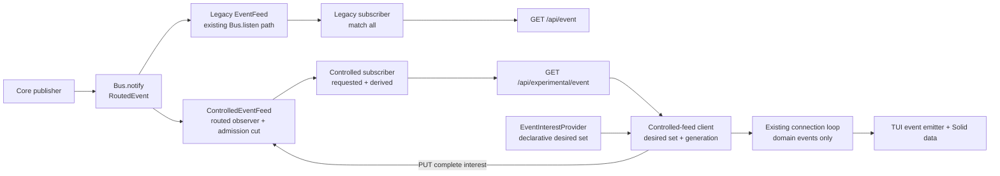
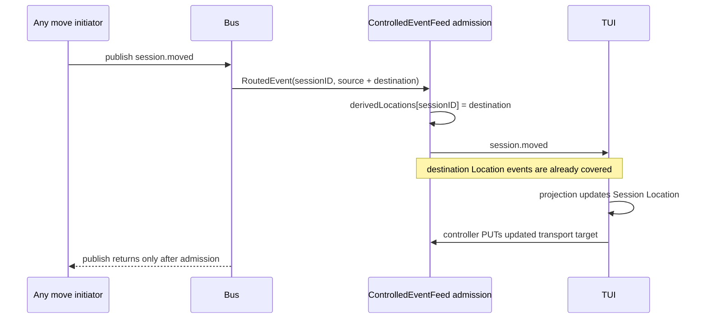

# Controlled event feed — directional draft

> Follow-up: [draft1](/.design/bus-smart/draft1.gpt6a.md) reassesses this design
> after the rebase and proposes Session-scoped streaming with broad remaining
> observation. This document remains the detailed baseline for the existing
> Location profile; [implementation1](/.design/bus-smart/implementation1.gpt6a.md)
> describes the new implementation direction and unresolved verification gates.

## Direction

Build one new experimental **controlled event feed** and make the V2 TUI its
first adopter. Keep `GET /api/event` unchanged for every existing consumer.

The controlled feed is one long-lived SSE and one bounded FIFO queue. Its
requested interest is a complete set of Locations and Session IDs. Bus supplies
the publication-time audience; ControlledEventFeed decides admission. When a
followed Session moves, ControlledEventFeed privately follows its destination
before admitting the move, so the client does not need to prepare moves or race
a control request against destination events.

This draft stakes five architectural claims:

1. **Bus gets one small routed-observation seam.** It remains the sole owner of
   Location and Session routing semantics.
2. **ControlledEventFeed is the deep module.** Registration, matching, move
   following, bounded queues, replacement, and admission ordering stay behind
   its interface.
3. **The wire uses full replacement, not a patch language.** One writer and the
   ephemeral stream lifetime provide fencing without revisions, command IDs,
   markers, or a command cache.
4. **Derived move coverage is private implementation state.** The move event is
   the client-visible explanation; there is no second effective-interest
   protocol for clients to understand.
5. **The TUI declares one desired set.** It does not imperatively add/remove at
   every route, tab, create, and move call site.

The result is still substantial work. It is, however, concentrated substantial
work: one Core seam, one Server module, one additive Protocol surface, one
Client adapter, and one TUI policy owner. That is the shape we can reasonably
carry atop upstream and also propose upstream without presenting a private
fork-specific architecture.

## Revision from the what-if

The [what-if draft](/.design/bus-smart/whatif-controlled-feed0.glm53.md) did the
hard semantic work correctly. This revision keeps its routing and ordering
conclusions while removing protocol and TUI machinery that those guarantees
make unnecessary.

| Area | Direction in this draft | Change from the what-if |
| --- | --- | --- |
| Bus audience | Inline routed observation; guard-gated Session identity; exact parity with `Bus.subscribe()` for the Location dimension | Keeps the seam, clarifies Session following as an orthogonal recipient dimension |
| Controlled feed module | New controlled sibling with one registry and queue-admission cut, guarded by one Effect semaphore | Keeps legacy EventFeed frozen rather than combining two failure contracts |
| Interest mutation | `PUT` one complete canonical transport target | Replaces patch/add/remove plus replace |
| Retry safety | Never retry an indeterminate PUT on the same subscription; reconnect and install the current transport target on a fresh ID | Removes command ID, all revisions, conflict recovery, and the 256-entry cache |
| Move coverage | Private `derivedLocations` map updated before `session.moved` admission | Removes `event-feed.effective.changed` frames |
| TUI moves | No special handling | Removes `admitMove`, `releaseMove`, pending-move persistence, timeout, and edits to both move call sites |
| TUI policy | One declarative desired-set function; Client handles coalescing and removal grace | Replaces the S1-S18 imperative patch map as implementation structure while preserving its facts |
| Client connection | A controlled stream adapter plugged into the existing reconnect loop | Avoids copying the reconnect loop into a sibling connection implementation |
| Protocol group | Additive methods in the existing `server.event` group | Removes a new group and `groupNames` touchpoint |
| Initial interest | Ready, then a body-encoded PUT atomically installs interest, queues `server.connected`, and activates publication | Removes GET query encoding and mount-order dependence without selective startup loss |
| Legacy feed | Existing module, Bus listener, path, generated method, frames, heartbeat, and overflow behavior | Frozen |

The important deletion is move preparation. The server-side follow mechanism
was introduced for moves initiated by another client. Once it exists, it covers
moves initiated by this TUI too. Keeping a second client-side correctness path
would add call sites, pending state, failure cleanup, reconnect policy, and a
timeout without strengthening the guarantee.

## Goals

- Stop events whose Bus audience lies wholly outside the TUI's requested or
  derived interest from entering its queue, parser, emitter, and projection.
- Preserve one selected-event FIFO and one logical connection boundary.
- Preserve exact Location identity, including `workspaceID`.
- Follow open or visible Sessions across moves before their destination suffix
  can be published.
- Keep non-TUI clients and `event.subscribe(requestOptions?)` unchanged.
- Make every hand-written seam independently reviewable and testable.
- Make generated churn purely additive and mechanically reproducible after an
  upstream rebase.

## Non-goals

- Durable replay, resumable offsets, or delivery across disconnection.
- Clustered subscription ownership.
- Event-type filters or authorization through interest.
- Suppressing Bus-global events or unrelated Sessions that share a retained
  Location; both remain intentionally admitted.
- Changes to public event payloads or the Session event manifest.
- Converting app, desktop, mini, CLI, ACP, SDK, or plugin consumers.
- Reworking Session movement beyond closing its one immediate publish gap, or
  adding Location to Session events.
- Solving machine-wide notification aggregation in this transport change.

## Architecture



The dependency direction remains valid: Core uses Schema; Protocol uses Schema;
Server uses Core and Protocol; Client uses Protocol and Schema; the TUI composes
Client behavior. No Core type depends on a transport type.

## 1. Bus routed observation

### Interface

Add one callback seam to `Bus.Interface`:

```ts
export type EventAudience =
  | { readonly type: "global"; readonly sessionID?: SessionID }
  | {
      readonly type: "locations"
      readonly refs: readonly Location.Ref[]
      readonly sessionID?: SessionID
    }

export type RoutedEvent = {
  readonly event: Event.Payload
  readonly audience: EventAudience
}

export type RoutedObserver = (input: RoutedEvent) => Effect.Effect<void>

export interface Interface {
  // Existing members remain unchanged.
  readonly observeRouted: (observer: RoutedObserver) => Effect.Effect<Unsubscribe>
}
```

`observeRouted` is deliberately not another stream. ControlledEventFeed must
finish queue admission before a same-Session publisher can proceed. A PubSub or
detached stream would lose that publish-return coupling.

### Audience semantics

Compute the audience in one private Bus function and use it for both
`observeRouted` and the existing `local()` filter:

| Bus routing fact | Audience |
| --- | --- |
| A route snapshot exists | `{ type: "locations", refs }` |
| No snapshot; event carries `location` | `{ type: "locations", refs: [event.location] }` |
| No snapshot and no event Location | `{ type: "global" }` |

The Location choice follows this table exactly. Session identity is an
orthogonal fact: `sessionID` is present for every payload accepted by Bus's
authoritative `SessionEvent.All` guard, including an envelope-pinned Session
event that deliberately bypasses a route snapshot. Exact Session following is a
new recipient dimension and should mean what it says; tying it to WeakMap entry
presence would leak a private implementation branch into the contract.

Permission and form events are not `SessionEvent.All`. They remain
Location-routed even though their data carries a Session ID;
ControlledEventFeed never generalizes exact following to arbitrary payload
shape.

`refs: []` means routed to no Location. It never means global. Directory and
`workspaceID` equality remain byte-for-byte the predicate at
[`bus.ts:733-739`](/packages/core/src/bus.ts#L733-L739).

This refactor prevents semantic drift in the Location dimension: the data
reported to ControlledEventFeed and the decision made by `Bus.subscribe()` come
from the same function rather than two similar predicates.

### Position in publication

Bus invokes routed observers at the top of `notify()`, after route snapshots
have been installed and before deprecated listeners and PubSub publication.
Observers are awaited.

Observer defects are logged and swallowed; interrupts propagate.
ControlledEventFeed health must not become a prerequisite for a model or
Session publish. Queue overflow and encoding failure remain explicit controlled
feed behavior rather than observer defects.

The new ControlledEventFeed is the only routed observer. The existing EventFeed
continues using `bus.listen`. Keeping the two services separate avoids changing
legacy defect/interruption behavior and makes duplicate delivery impossible by
construction. An event is encoded once per populated service, so coexistence
can encode twice; that bounded cost is preferable to rewriting the
compatibility-critical module in the first carry.

The existing single-durable-event commit-to-notify interruption window remains
out of scope generally, but one move branch currently falls into it. When the
source directory has disappeared and there are no pending cancellations,
`Session.move` uses single-event `bus.publish`; an interrupted request can commit
the move without notifying observers. Change that branch to one-element
`publishAll` (or an equivalently narrow uninterruptible publish) and pin it with
a Session move test. The runner path and the cancellation-bearing immediate
path already use fully uninterruptible `publishAll`.

## 2. ControlledEventFeed as the deep module

### Interface

Add a sibling Server module, `ControlledEventFeed`, with two operations. The
existing `EventFeed` interface and implementation remain unchanged.

```ts
export interface Interface {
  readonly subscribe: Effect.Effect<Stream.Stream<string, Error>, never, Scope.Scope>
  readonly replaceInterests: (input: {
    readonly subscriptionID: EventSubscriptionID
    readonly interest: EventInterest
  }) => Effect.Effect<void, EventSubscriptionNotFoundError | InvalidRequestError>
}
```

`subscribe` creates a pending record, enqueues only `event-feed.ready`, and
makes the record addressable to control without making it visible to event
publication. The HTTP handler returns that stream.

The first successful `replaceInterests` is the activation cut. In one admission
section it installs the complete canonical representation, enqueues
`server.connected`, marks the record active, and returns. A publisher before
that cut sees no subscriber; a publisher after it sees the installed interest
and queues behind connected. This makes pre-activation loss uniform rather than
routing-dependent.

### Subscriber state

The new service owns one registry of controlled records:

```ts
type ControlledState = {
  readonly id: EventSubscriptionID
  active: boolean
  requested: InterestSet
  readonly derivedLocations: Map<SessionID, Location.Ref>
}
```

There is no token, revision, command cache, or public effective state. Effective
Location coverage is the union of `requested.locations` and
`derivedLocations.values()`, computed for matching. Exact Session membership is
`requested.sessions`.

Use the existing client `locationKey` convention for canonical equality:

```ts
JSON.stringify([ref.directory, ref.workspaceID])
```

The wire retains full `Location.Ref` values. The scalar key is private to
normalization and matching.

### Admission predicate

An active controlled subscriber accepts a public event when any of these is
true:

1. Its audience is global.
2. Its Location audience intersects requested or derived Locations.
3. Its Bus-classified Session ID is in requested Sessions.

Global events are offered once regardless of Location count. Internal Core
events are rejected by the existing `isOpenCodeEvent` manifest check before
encoding or capacity is consumed.

### Move following

For `session.moved`, ControlledEventFeed performs one extra action for every
subscriber following that Session:

1. Set `derivedLocations[sessionID]` to the move destination.
2. Match and offer the move under the expanded predicate.
3. Let later destination events use that predicate.

Bus's classified `sessionID` decides whether this is a followed Session. The
typed `session.moved.data.location` supplies the destination. Do not infer the
destination from `audience.refs.at(-1)`; the audience is a recipient set and
does not promise ordering among refs.

The map entry remains until the Session is unfollowed, the Session is deleted,
or another move replaces it. Do not delete it merely because the destination
also appears in requested Locations. Retaining the redundant entry avoids a
future requested-Location removal accidentally dropping Location-owned events
while the Session is still followed.

No effective-change frame is emitted. The derived map is analogous to a route
cache inside the transport, not client-owned product state. `session.moved` is
already the ordered domain fact that tells the client why its Session changed
Location.

This one mechanism covers TUI-initiated moves, app/plugin-initiated moves, the
queued runner path, and the immediate missing-source path. There is no
client-side pending-move state.

### One admission cut

Retain the Effect-v4 architecture validated by the research wave:

- one `Semaphore.makeUnsafe(1)`;
- one plain mutable registry;
- encoding outside the permit;
- one non-yielding `Effect.sync` inside each permit;
- only registry mutation and `Queue.offerUnsafe` / `failCauseUnsafe` inside the
  critical section.

The semaphore protects the architectural cut and future multi-operation
sections, not JavaScript memory safety. Network, database, queue backpressure,
and JSON encoding never run while holding it.

Registration, activation, publication, replacement, removal, overflow, and move
following all use this cut. An offer failure removes and fails only that
subscriber. Publication ignores pending records. On every replacement, set
requested interest and remove every `derivedLocations` entry whose Session is
absent from the new requested Session set. Retain derived entries for Sessions
that remain followed, even when requested Locations also cover them.

On first replacement, offer `server.connected` before flipping `active` to
true. If that offer fails, remove and fail the pending subscriber without
activation. Later replacements mutate requested state and prune derived state
without queueing a marker.

When there are no active subscribers, the routed observer performs only a size
or active-count fast path. Pending registrations do not force encoding. Do not
add first/last-subscriber registration choreography to Bus to save one call and
one branch.

### Legacy preservation

Do not edit `packages/server/src/event-feed.ts` in the first carry. Its match-all
Set, encode-once fan-out, listener defect policy, overflow behavior, and tests
remain the compatibility oracle. The existing handler branch continues to
prepend `server.connected` and merge the same heartbeat.

The controlled sibling duplicates only the small queue mechanics it genuinely
needs. There is no shared abstraction yet because the two services have
different inputs, registration framing, and failure contracts. If controlled
delivery graduates and coexistence encoding measures materially, unify them in
an upstream-owned refactor with both behaviors already pinned.

## 3. Wire contract

### Endpoints

Add two methods to the existing `server.event` Protocol group:

```text
GET /api/experimental/event
PUT /api/experimental/event/subscriptions/:subscriptionID/interests
```

Suggested generated identifiers:

```text
event.controlled.subscribe
event.controlled.replaceInterests
```

Do not create a new HttpApi group. These are event-feed operations, and keeping
them in `server.event` avoids a new handler layer and `groupNames` entry. The
experimental path communicates stability without coupling the methods to the
unrelated `server.experimental` persistent-PTY group.

The resulting endpoint definitions are structurally:

```ts
HttpApiEndpoint.get("event.controlled.subscribe", "/api/experimental/event", {
  success: HttpApiSchema.StreamSse({ data: ControlledFeedItem }),
})

HttpApiEndpoint.put(
  "event.controlled.replaceInterests",
  "/api/experimental/event/subscriptions/:subscriptionID/interests",
  {
    params: { subscriptionID: EventSubscriptionID },
    payload: EventInterest,
    success: HttpApiSchema.NoContent,
    error: [EventSubscriptionNotFoundError, InvalidRequestError],
  },
)
```

`ControlledFeedItem` is built inside the existing dynamic event-group factory,
after `EventSchema` exists; its definition appears below.

```ts
export const EventSubscriptionID = Schema.String.check(
  Schema.isStartsWith("evsub_"),
).pipe(Schema.brand("EventSubscription.ID")).annotate({ identifier: "EventSubscription.ID" })
export type EventSubscriptionID = typeof EventSubscriptionID.Type

export class EventSubscriptionNotFoundError extends Schema.TaggedError<EventSubscriptionNotFoundError>()(
  "EventSubscriptionNotFoundError",
  {
    subscriptionID: EventSubscriptionID,
    message: Schema.String,
  },
  { httpApiStatus: 404 },
) {}

export interface EventInterest extends Schema.Schema.Type<typeof EventInterest> {}
export const EventInterest = Schema.Struct({
  locations: Schema.Array(Location.Ref),
  sessions: Schema.Array(Session.ID),
}).annotate({ identifier: "EventInterest" })
```

Generate IDs with the exact `evsub_` prefix and a random 128-bit-or-stronger
suffix. The ID is opaque and non-secret. Keep these endpoint-specific transport
contracts in Protocol; they do not belong in the Schema package's domain
surface.

The PUT declares `EventSubscriptionNotFoundError` and the existing
[`InvalidRequestError`](/packages/protocol/src/errors.ts#L4-L12). Missing or
closed subscription is 404. Decoded interest that exceeds byte/cardinality
bounds is `InvalidRequestError` (400) with `field: "interest"`; ordinary
HttpApi payload decoding also remains a deterministic 400. Normal API
middleware supplies authentication errors. Generated clients can therefore
distinguish a server rejection from a transport result that is genuinely
indeterminate.

Both arrays are required in the canonical wire shape. The GET has no interest
input; a new controlled subscriber remains pending and receives no Bus events.
The client sends the current transport target in the first PUT, whose admission
section activates the subscriber.

Keeping structured arrays in the JSON body avoids a real generator ambiguity:
the current Promise query encoder repeats unindexed nested keys for arrays of
objects at
[`generated/client.ts:2140-2155`](/packages/client/src/promise/generated/client.ts#L2140-L2155),
losing Location element boundaries. It also avoids placing a potentially large
tab/family set in a URL.

The server deduplicates both dimensions before storing them. Raw and normalized
counts and request bytes are bounded; exact limits are implementation constants,
not compatibility semantics. Exceeding a limit is explicit and never silently
truncates.

### Feed items

The controlled stream carries ordinary public events plus one transport-local
frame. Define it as a real Protocol schema, not only a TypeScript type:

```ts
export interface EventFeedReady extends Schema.Schema.Type<typeof EventFeedReady> {}
export const EventFeedReady = Schema.Struct({
  type: Schema.Literal("event-feed.ready"),
  data: Schema.Struct({ subscriptionID: EventSubscriptionID }),
}).annotate({ identifier: "EventFeedReady" })

// Inside make(...), so custom event manifests remain supported.
const ControlledFeedItem = Schema.Union([EventSchema, EventFeedReady]).annotate({
  identifier: "ControlledFeedItem",
})
```

The first physical frame is `event-feed.ready`. No domain frame exists yet. The
Client adapter consumes ready and PUTs the current transport target. That first
PUT atomically enqueues `server.connected` and activates publication, so
connected is the second physical frame and the first domain frame seen by the
existing connection loop, emitter, and Solid projection.

The tagged JSON in SSE `data:` is authoritative. Named SSE event fields may be
added for diagnostics but are not part of correctness.

The random subscription ID is an opaque resource locator, not a credential.
Normal server authentication authorizes the PUT. A second bearer token and
custom header do not create a meaningful boundary when the same authenticated
client can already invoke Session, shell, and filesystem methods. Interest is a
performance scope, not authorization; authenticated legacy clients already
receive the global feed.

### Full replacement semantics

The PUT body is `EventInterest`; success is `204 No Content`. Decode,
canonicalize, and bound the complete set before acquiring the admission permit.
Under the permit, ControlledEventFeed finds the live subscription, replaces
requested state, prunes derived entries for Sessions no longer followed, and
returns. If the record is pending, the same section queues `server.connected`
and activates it. Events whose admission section ran earlier used the old set
(or saw no active subscriber); events whose section runs later use the new set.
Already queued old-interest frames after a later replacement may still drain as
accepted bounded overdelivery.

There are no command IDs, revisions, conflicts, caches, or applied markers. The
official controller is the only writer and keeps exactly one PUT in flight. If
a PUT result is indeterminate, it never retries against that subscription:

1. Abort the SSE generation.
2. Let scoped cleanup remove the old subscription.
3. Reconnect and receive a new random subscription ID.
4. Install the current transport target before `server.connected` can be queued.

A late request can then affect only the abandoned subscription. The stream
generation is the fence, reusing lifecycle state the connection already owns
instead of adding a second distributed coordination protocol.

### Lifecycle failures

- Queue overflow removes the subscriber and fails its stream.
- A PUT racing stream cleanup returns not-found/closed; it never waits for a
  detached owner. If PUT wins, cleanup may immediately discard its state; both
  outcomes are safe.
- Server restart loses all subscription state and closes SSE. Reconnect creates
  a fresh pending subscription and activates it with the current transport
  target.
- A declared 400/404 is a determinate rejection and never triggers legacy
  fallback. It terminates the controlled generation with a visible error; the
  client does not claim that the transport target was installed.
- An indeterminate PUT aborts the generation and is observable in connection
  diagnostics; it is not silently retried in place.
- Control frames never enter Bus, the public Event manifest, or ordinary client
  event handlers.

### Compatibility and browser reservation

`GET /api/event` gains no input, frame, or signature change. The new methods are
additive generated-client methods, so existing Promise and Effect call sites do
not shift argument positions.

The Client tries the controlled GET for each new server connection. A 404 before
the ready frame means that server does not implement the feature; the same
connection attempt falls back once to legacy `event.subscribe`. Other failures
do not silently downgrade. On a later managed-service reconnection, try the
controlled endpoint again because the elected server may have changed.

Fallback is visible as `mode: "legacy"` in controller state and one log entry.
Desired interest remains in memory but no control requests are made. This
preserves newer-TUI/older-server operation without pretending that filtering is
active.

The shape does not block a browser client:

- the SSE GET has no structured interest query;
- updates use ordinary fetch PUTs;
- JSON PUT uses the server's normal authentication and CORS path;
- reconnect creates a fresh subscription rather than relying on
  `Last-Event-ID`.

A future browser implementation can use fetch-based SSE, as the generated
client already does. Do not add prepared-subscription tickets solely to fit the
native `EventSource` constructor.

## 4. Client controller

### Reuse the connection loop

Do not copy [`connection.ts`](/packages/client/src/solid/connection.ts). It owns
tested behavior for connection timeout, reconnect delay, managed-service
replacement, generation fencing, batching, page lifecycle, status, and history.

Add one narrow adapter option:

```ts
type EventStreamAdapter = (
  api: OpenCodeClient,
  signal: AbortSignal,
) => AsyncIterable<OpenCodeEvent>

type ClientConnectionOptions = {
  // Existing options unchanged.
  readonly subscribe?: EventStreamAdapter
}
```

The default adapter remains `api.event.subscribe({ signal })`, so app/desktop
behavior does not change. The controlled adapter consumes transport frames and
yields only `OpenCodeEvent`. Two real adapters justify this seam; the reconnect
implementation remains single-owner.

### Controlled-feed module

Add a sibling module such as
`packages/client/src/solid/controlled-event-feed.ts`. It owns:

- **desired interest**, the product set declared by EventInterestProvider;
- **transport target**, desired interest plus removals still inside their grace
  window;
- **installed interest**, the last transport target acknowledged by 204 for the
  active subscription;
- subscription ID for the active generation;
- exactly one PUT in flight;
- coalescing to the latest complete transport target;
- immediate additions and delayed removals;
- generation invalidation after an indeterminate PUT;
- ready-frame interception and initial installation before connect;
- controlled-to-legacy 404 fallback.

Its product-facing interface stays small:

```ts
export interface ControlledEventFeed {
  readonly subscribe: EventStreamAdapter
  readonly setDesired: (interest: EventInterest) => void
  readonly flush: () => Promise<void>
  readonly desired: Accessor<EventInterest>
  readonly mode: Accessor<"connecting" | "controlled" | "legacy">
}
```

`setDesired` is synchronous. The controller normalizes locally, derives the
transport target, and avoids PUTs when installed interest already equals that
target. After each ready frame it installs the current transport target before
the Server activates and queues `server.connected`; startup and reconnect
therefore use the same path. `flush()` resolves when installed interest equals
the transport target current at resolution. In legacy fallback it is an
explicit no-op. Product code never sees subscription IDs or generations.

Removal grace belongs here, not in `SessionTabsProvider`. Adds enter the next
coalesced transport target immediately. A key absent from desired interest
remains in the transport target for a short trailing grace (start with 3
seconds), then all expired removals leave in one replacement. Re-adding during
the grace cancels removal. On reconnect, initial PUT uses the current transport
target, including grace-held keys; pending grace timers may narrow it later.

## 5. TUI desired-interest policy

### One owner, one function

Add an `EventInterestProvider` immediately inside `SessionTabsProvider`. It
consumes the existing tab interface plus route, current Location, launch Ref,
and resolved Session metadata, computes one complete set, and calls
`client.interest.setDesired`. This keeps transport policy out of the tab model
and avoids edits to `session-tabs.tsx`.

The desired set contains:

| Fact | Locations | Sessions |
| --- | --- | --- |
| Full resolved launch Location | Always | None |
| Current Location context and explicit Home target | While selected | None |
| Visible Session route root and known family | Every member's known Location | Root and member Session IDs |
| Every open tab root and known family in active `cwd` or `global` scope | Every member's known Location | Root and member Session IDs |
| Newly visible optimistic Session route | Optimistic record's Location | Client-minted Session ID |

Family holds are unconditional while their root is visible or has a tab.
Root-busy is the wrong gate: a member can remain active after the root settles,
and the tab's permission/form/busy indicators explicitly read the whole family at
[`session-tabs.tsx:139-175`](/packages/tui/src/context/session-tabs.tsx#L139-L175).

Do not expose the private `sessionOutbox` merely for this policy. It is a plain
mutated `Set`, so a read accessor would not make the selector reactive. The new
Session is synchronously remembered and then becomes the visible route; the
provider sees that public state. To structurally cover automatic first execution
in a previously unrequested Location, append `client.interest.flush()` to the
existing new-Session setup gate before the prompt is admitted. This is one
targeted prompt touchpoint, not a general prepare/rollback protocol.

No other interaction mutates interest directly. Tab reorder, viewed state,
title generation, hydration, dialog browsing, prompt pulses, and theme/config
work remain interest-neutral. The open dialog continues to use authoritative
HTTP reads; it does not expand the live feed merely because the user browsed a
foreign project.

### Startup

`Tui.run` already resolves the full launch `Location.Ref` before render at
[`app.tsx:208-212`](/packages/tui/src/app.tsx#L208-L212). Pass it to
`EventInterestProvider` and hold it permanently, preserving `workspaceID`.
Do not reconstruct it from `data.location.default()`: the current data provider
is seeded with directory only and initially drops explicit workspace identity
([`data.ts:213`](/packages/client/src/solid/data.ts#L213)).

Persisted tab storage loads synchronously during `SessionTabsProvider` init.
Publish the initial desired set synchronously once, then maintain it reactively.
The GET itself carries no interest, so correctness does not depend on exact
provider/onMount ordering: when ready arrives, the source PUTs the current
transport target, and the successful PUT causes the Server to queue
`server.connected` and activate the subscription. Known tab and family Locations
join as HTTP hydration resolves them.

### Moves

Do not edit `/cd`, `usePromptMove`, or the app/plugin move surfaces. The narrow
one-element `publishAll` correction in Core is the only Session move change.

Before a move, the Session ID remains followed. During publication,
ControlledEventFeed installs its derived destination before offering
`session.moved`. After the TUI projects the move, the same desired-interest
function observes the Session's new Location and requests it. Derived coverage
remains as a redundant safety hold until unfollow.



This deletes the what-if's pending-move reconnect and timeout question rather
than answering it with more state.

### Known residual overdelivery

Controlled does not mean every payload is newly scoped. Public events that are
neither Location-routed nor `SessionEvent.All` remain Bus-global. Current
persistent-PTY add/remove events are one example: they are session-associated in
payload vocabulary but published without Location and outside the Session event
manifest
([`persistent-pty/index.ts:152-174`](/packages/core/src/persistent-pty/index.ts#L152-L174),
[`persistent-pty/index.ts:288-294`](/packages/core/src/persistent-pty/index.ts#L288-L294)).
They will continue reaching every controlled subscriber.

That is correct under this design: ControlledEventFeed consumes Bus's audience
rather than inventing ownership. Audit and reclassify such event families at
their producer/Bus boundary when their rate or semantics justify it; do not add
a ControlledEventFeed payload exception.

### Notification scope: release gate

The notifications plugin reacts to every relevant event that arrives. Natural
controlled-feed behavior is **Location/project-scoped attention**, not strictly
tab-scoped attention: holding one Location admits events for every Session Bus
routes there. This is a direct user-impact decision and remains open for product
approval.

| Policy | Meaning | Consequence |
| --- | --- | --- |
| Location/project scope | Notify for any Session in a retained launch, route, or tab Location | Natural transport result; release-note the change |
| Tracked Session/family scope | Notify only for current/open Session families | Add an explicit notification predicate, independent of transport and stable during legacy fallback |
| Server-wide scope | Preserve notifications for every Session on the server | Add a separate low-rate attention aggregate; do not broaden the main feed |

Do not smuggle one policy in as a transport invariant. In particular, do not
retain a second firehose or teach ControlledEventFeed that permission/form
payloads override Bus routing.

## Ordering guarantees

The implementation must preserve these invariants:

1. A subscriber has one bounded FIFO queue.
2. A public Bus event is admitted at most once to that subscriber.
3. Global events are admitted exactly once regardless of Location count.
4. Requested state changes only at a serialized replacement cut.
5. A followed Session's move installs destination coverage before the move
   frame and before causally later destination publication.
6. Unfollowing a Session removes its derived Location in the same replacement
   section; retained follows keep their derived Location through overlap.
7. The initial transport target is installed in the same section that queues
   `server.connected` and activates publication.
8. An indeterminate replacement invalidates that subscription generation; it is
   never retried against the same ID.
9. Exact Session admission uses only Bus's `SessionEvent.All` classification.
10. Empty Location audience never becomes global.
11. Location equality always includes optional workspace identity.
12. The ready frame never enters the domain emitter or Solid projection.
13. Reconnect creates a fresh subscription ID and installs the current transport
    target at activation; it makes no replay claim.
14. Legacy subscribers retain match-all wire behavior.

The selected FIFO is a ControlledEventFeed admission order, not a new global
domain order. Unrelated concurrent publishers may reach the admission cut in
either order. Existing per-Session locks and publisher causality provide the
order the projection actually requires.

## Carry boundary

### Hand-written production surface

| Layer | Expected files | Why the touchpoint is necessary |
| --- | --- | --- |
| Core | `packages/core/src/bus.ts`, `packages/core/src/session.ts` | One routed-observer seam plus the narrow immediate-move `publishAll` correction |
| Protocol | `packages/protocol/src/groups/event.ts` | Additive public experimental contract and transport schemas |
| Server | new `packages/server/src/controlled-event-feed.ts`, `handlers/event.ts`, `handlers.ts` | New deep controlled module plus thin methods in the existing group; legacy EventFeed stays frozen |
| Client | `packages/client/src/solid/connection.ts`, new controlled-feed module, `solid/index.ts` | One real stream-adapter seam and controlled state machine |
| TUI | `packages/tui/src/app.tsx`, `context/client.tsx`, new `context/event-interest.tsx`, one new-Session gate call in `component/prompt/index.tsx` | Opt in, declare desired interest outside the tab model, and flush before automatic first execution |

Generated Promise and Effect surfaces change after `bun run generate` from
`packages/client`. Keep generated output in the Protocol commit or an adjacent
mechanical commit so a rebase can discard and regenerate it. Do not hand-edit
generated files and do not omit one client tree merely to make the diff look
smaller. When the feature branch carries tracked OpenAPI mirrors, run the
package-local Protocol and website generation/check steps too; client generation
does not update those mirrors.

### Explicitly untouched

- Existing `event.subscribe` Protocol definition and generated method.
- `packages/protocol/src/api.ts` and the `groupNames` map; controlled methods
  remain inside the existing dynamic event group.
- Existing `packages/server/src/event-feed.ts` implementation and tests.
- CLI, ACP, mini transport, SDK, plugin adapter, app, and desktop call sites.
- Session event schemas and event payload Locations.
- Session runner, `/cd`, and the move dialog; `Session.move` changes only in the
  missing-source/no-cancellation publication branch.
- `packages/tui/src/context/session-tabs.tsx` and the private Session outbox.
- TUI notification plugin pending the product decision.
- Broad Solid event projection, unless measurement later justifies an
  independent defense-in-depth patch.
- `server.experimental` group naming and persistent-PTY handlers.

These negative boundaries matter more for carry cost than minimizing lines
inside the new controlled module. They keep coordinated behavior out of
high-churn and unrelated packages.

### Commit sequence

1. `feat(core): expose routed bus observations`
2. `fix(core): close immediate move notification gap`
3. `refactor(client): inject event connection source`
4. `feat(protocol): add controlled event feed contract`
5. `feat(server): admit controlled event subscriptions`
6. `chore(client): regenerate controlled feed client`
7. `feat(client): add controlled event feed source`
8. `feat(tui): declare controlled event interests`

Tests belong with each behavior. The Core seam can be proposed upstream on its
own. The Protocol/Server work is additive and inert until a client opts in. The
TUI commit is the only behavior flip.

## Verification

### Core oracle

- Routed audience and `Bus.subscribe()` agree for global, ordinary Location,
  workspace-distinct, and empty-route events.
- The existing Session routing matrix remains the oracle: creation, cold owner,
  fork-through-parent, move dual audience, envelope override, batch
  move/delete, rollback, slow subscriber, and published replay.
- Session ID is present for every `SessionEvent.All` payload and absent from
  permission/form payloads.
- Routed-observer defects are logged without failing durable or ephemeral
  publication; interruption still propagates.
- The runner, cancellation-bearing immediate, and no-cancellation immediate
  move paths all complete routed observation before returning from publication.

### Protocol

- `EventSubscriptionID` accepts the exact `evsub_` prefix emitted by the Server
  and rejects other prefixes.
- Interest body round-trips multiple workspace-distinct Locations without query
  encoding.
- Missing subscription decodes as `EventSubscriptionNotFoundError` with 404;
  malformed or over-limit interest decodes as `InvalidRequestError` with 400.
- Promise and Effect clients expose both additive controlled methods while the
  legacy `event.subscribe(requestOptions?)` signature is unchanged.

### ControlledEventFeed

- Existing legacy tests pass without changed expectations.
- One controlled subscriber receives global plus the union of requested
  Locations and exact Sessions, with no global duplication.
- Same-directory/different-workspace events remain isolated.
- Pending registration enqueues ready only and admits no Bus event, global or
  routed.
- First PUT installs interest, enqueues connected, and activates in one section;
  a later concurrent publication queues behind connected under that interest.
- A successful PUT is the admission cut; a causally later publish uses the new
  set while already queued old-interest tail may drain.
- PUT racing cleanup is either installed-then-discarded or not-found, never a
  hang.
- Replacing a set prunes derived entries for every unfollowed Session and keeps
  entries for retained Sessions even when requested Location coverage overlaps.
- Queue overflow removes only one subscriber.
- A followed move updates derived destination before move admission; immediate
  destination permission/form and Session suffix events arrive.
- Derived destination survives requested overlap and is released on unfollow or
  delete.
- Zero subscribers avoid encoding.

### Client

- Ready never reaches `onEvent`; `server.connected` remains first.
- Current transport target is installed by the activation PUT on startup and
  reconnect.
- One PUT is in flight; rapid changes coalesce to the latest transport target.
- Adds transmit immediately; removal grace coalesces and cancels on re-add.
- An indeterminate PUT aborts its generation; a fresh subscription receives
  exactly one current-target activation PUT.
- Late responses and frames from an obsolete generation cannot mutate current
  state.
- Declared PUT 400/404 is surfaced as a determinate rejection; transport failure
  invalidates the generation as indeterminate.
- One pre-ready 404 falls back to legacy and surfaces legacy mode; non-404
  failures do not downgrade.
- A later server generation attempts controlled mode again.

### TUI policy

- Persisted tab roots are in the first pre-connected PUT.
- Launch/current/Home, visible route, open tabs, and family members produce the
  expected union with workspace identity intact.
- Scope changes replace the tab contribution without dropping current route.
- Tab reorder, browsing, hydration, and display-only state produce no change.
- Newly visible optimistic Sessions join through route state, and automatic
  first execution waits for `flush()`.
- TUI, app, plugin, and immediate-path moves all require no initiating-TUI
  interest call and remain covered.

### Live acceptance

Use the same two-project reproduction that motivated this work. Record before
and after:

- received domain events per second;
- TUI process CPU;
- event-loop p99;
- reconnect and overflow count;
- controlled versus fallback mode.

Run `bun run dev:live` against both a matching server and an older elected
server. The matching server should show no event whose audience is solely a
foreign, unretained Location or unfollowed Session. Bus-global events and
unrelated Sessions at retained Locations remain expected. The older server
should remain functional in explicit legacy mode. A projection-only guard
remains a separate follow-up if controlled transport removes wire volume but
same-interest work is still expensive.

## Open items

Only these remain intentionally open:

1. **Notification scope.** Choose Location/project, tracked Session/family, or
   server-wide attention before default rollout; transport must not decide it
   accidentally.
2. **Bounds.** Pick raw request bytes, normalized Location count, and Session
   count from realistic tab/family measurements. Exceeding them must be visible,
   never truncating.
3. **Removal grace tuning.** Start at 3 seconds and adjust from route/tab churn
   traces; this is a performance constant, not a protocol promise.
4. **Graduation.** Keep the endpoints experimental through the first adopter.
   Stable paths can be additive later; the controller's feature negotiation
   already tolerates both.
5. **General Bus notify interruption.** Track separately if the volatile feed
   ever grows an every-committed-event guarantee.

The transport shape, routing ownership, replacement model, move guarantee,
client seam, and TUI interest owner are not open in this draft.

## Rejected directions

| Direction | Why not |
| --- | --- |
| Static launch-Location feed | The TUI intentionally spans Locations through routes and tabs |
| Reconnect SSE on every interest change | Re-emits connection boundaries and causes hydration/refetch storms |
| Per-Location streams merged in the client | Requires duplicate suppression and barriers the current projection does not have |
| Exported `Bus.deliversTo(event, ref)` predicate | Leaks event-object identity and publication timing from the route WeakMap |
| Per-subscriber `Bus.subscribe()` streams | Loses encode-once fan-out and exact-Session following; multiplies fibers |
| Patch/add/remove control language | Makes callers and protocol own diff algebra that a full desired representation eliminates |
| Command IDs, revisions, and retained command cache | One writer plus abortable subscription generations fence the only indeterminate-write case |
| Public effective-interest state | Exposes a transport cache and creates a second revision domain with no product caller |
| Client move preparation | Duplicates the stronger server guarantee and spreads failure cleanup into move call sites |
| Prepared subscription ticket | Adds expiry and attach races when ready-then-PUT can establish the same pre-connected activation cut |
| WebSocket | Bidirectionality, ticketing, and lifecycle cost are unjustified for infrequent complete replacements |
| Projection-only filtering | Leaves queue, network, parse, emitter, and overflow costs intact |
| Durable per-Session streams | Promising future architecture, but changes persistence, replay, retention, and connection topology |

## What would change this design

- A verified consumer requiring concurrent independent writers to one
  subscription would reopen authentication and revision semantics. The TUI
  controller intentionally establishes one writer today.
- Evidence that envelope-pinned `SessionEvent.All` payloads should not follow
  exact Session interest would reopen guard-gating. The default meaning remains
  all Bus-classified Session events, independent of Location routing branch.
- Evidence that retaining one derived Location per moved followed Session causes
  material overdelivery would justify pruning, but only with a replacement
  mechanism that cannot drop current Location-owned events.
- A product requirement for machine-wide attention would add a low-rate
  aggregate event, not revert controlled delivery.
- Real generated-tree rebase failures may justify a temporary downstream
  omission, but the upstream interface should continue to expose both Promise
  and Effect clients.

## Cross-references

- [What-if controlled feed](/.design/bus-smart/whatif-controlled-feed0.glm53.md)
  is the immediate source. This draft keeps its verified routing work while
  deleting dual revisions, command caching, explicit effective state, and
  client move preparation.
- [Controlled SSE draft](/.design/bus-smart/controlled-draft0.gpt56s.md)
  established the single-queue requested/derived model and remains the fuller
  record of alternatives considered before this reduction.
- [Controlled transport research](/.design/bus-smart/research-controlled-sse0.gpt56s.md)
  compares attached SSE, prepared subscriptions, and WebSocket. This draft keeps
  attached SSE plus full replacement but uses subscription generations instead
  of a revisioned command protocol.
- [Bus audience research](/.design/bus-smart/research-bus-audience0.glm53.md)
  grounds Location routing, replay, and the inherited notify window; source
  reinspection corrected its immediate no-cancellation move claim.
- [EventFeed Effect research](/.design/bus-smart/research-eventfeed-effect0.glm53.md)
  grounds the semaphore plus non-yielding critical-section implementation in
  Effect v4.
- [Client compatibility research](/.design/bus-smart/research-client-compat0.glm53.md)
  proves why an additive endpoint and adapter preserve existing consumers.
- [TUI interest research](/.design/bus-smart/research-tui-interest0.glm53.md)
  supplies the reachability and policy facts; this draft converts its trigger
  map into one declarative desired-set function and removes pending moves.
- [Event sequencing research](/.design/bus-smart/research-event-sequencing0.gpt56s.md)
  explains why one selected-event FIFO is the minimum safe contract for the
  current arrival-order projection.
- [Location stream alternatives](/.design/bus-smart/location-streams0.gpt56s.md)
  records why static and client-merged Location streams do not fit the TUI's
  multi-Location, move-sensitive projection.
- [Downstream assessment](/.design/bus-smart/review0.gpt56s.md) identifies the
  multi-Location TUI and generated-client carry constraints this design now
  treats as first-class.
- [Durable Streams note](/.design/bus-smart/research-durable-streams0.gpt56s.md)
  records the larger replay architecture intentionally left outside this fix.
