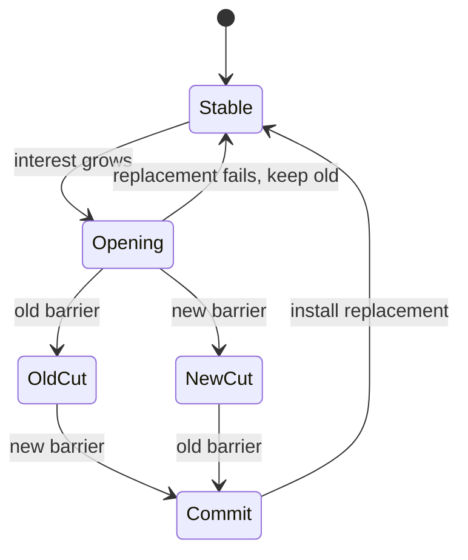

# bus-smart location streams and controlled subscriptions

## Situation

The first design correctly wants to filter events before they reach a TUI, but
one static Location is incompatible with cross-Location tabs. This design pass
compares three real transport fixes:

1. one dedicated global SSE plus one SSE per interested Location;
2. one SSE for a Location union, replaced through an overlapping barriered
   handoff whenever the union grows;
3. one long-lived SSE whose Location union is changed through a control
   request.

All three preserve the existing unscoped `/api/event` firehose for old clients.
All three require Bus, not Server, to classify an event's delivery audience.

The conclusion is:

- **Per-Location SSE is viable**, and a dedicated global SSE is preferable to
  repeating global events on every Location stream.
- Its main sequencing problem is not global traffic. It is Session movement
  between Location streams.
- **A controlled single SSE is the strongest design**. It retains one queue and
  therefore one selected-event order while allowing the TUI to replace its
  Location interest set without reconnecting.
- A **barriered union handoff** is the best downstream fallback if adding a
  control endpoint and generated client surface is too expensive to carry.

## Required ordering

The current client is an arrival-order projection. One iterator appends events
to one 10 ms batch, then calls handlers synchronously
([`connection.ts`](/packages/client/src/solid/connection.ts#L52-L103)). It has
no sequence cursor, stale-event check, reorder buffer, or general duplicate
filter.

The actual requirement is narrower than a global total order:

- Events for unrelated Sessions do not need ordering. The LLM publisher
  explicitly forbids assuming a cross-source order
  ([`publish-llm-event.ts`](/packages/core/src/session/runner/publish-llm-event.ts#L63-L75)).
- Durable events need monotonic order per Session aggregate. Their `seq` is
  authoritative but may contain public gaps because internal durable events
  share the same aggregate log.
- Ephemeral Session deltas need causal FIFO around their durable start and end
  boundaries. They have no sequence number
  ([`session-event.ts`](/packages/schema/src/session-event.ts#L369-L505)).
- Location entity lifecycles such as shell create/exit and form create/reply
  need FIFO within that Location.
- Global edge-triggered TUI commands must be delivered once. Duplicate
  `tui.prompt.append` or `tui.command.execute` performs the action twice
  ([`tui-event.ts`](/packages/schema/src/tui-event.ts#L9-L60)).
- `server.connected` must occur once per logical client generation. Every
  occurrence triggers broad hydration
  ([`data.ts`](/packages/client/src/solid/data.ts#L528-L556)).

There is no documented requirement that a global credential event retain its
relative order with an unrelated Session delta. Most global/location update
handlers refetch current server state, and their HTTP responses can already
overtake one another. A split global stream may therefore explicitly drop
cross-scope ordering while preserving order within each scope.

The difficult cross-stream dependency is `session.moved`. Bus sends the move to
both old and destination Locations, then sends later Session events only to the
destination ([`bus.ts`](/packages/core/src/bus.ts#L241-L250)). Independent TCP
streams can deliver a later destination event before an older source event.

## Shared Bus seam

Server must not inspect the route `WeakMap` after the fact. Bus should expose an
immutable publication-time audience to one server-facing observer:

```ts
export type EventAudience =
  | { readonly type: "global" }
  | {
      readonly type: "locations"
      readonly refs: readonly Location.Ref[]
    }

export type RoutedSubscriber = (
  event: Event.Payload,
  audience: EventAudience,
) => Effect.Effect<void>

export interface Interface {
  // Existing interface remains unchanged.
  readonly listenRouted: (
    subscriber: RoutedSubscriber,
  ) => Effect.Effect<Unsubscribe>
}
```

Bus computes the audience while the exact event object and route snapshot are
available:

```ts
const refs = routes.get(event)
const audience = refs
  ? { type: "locations" as const, refs }
  : event.location
    ? { type: "locations" as const, refs: [event.location] }
    : { type: "global" as const }
```

The distinction between `locations: []` and `global` is important. An
unresolved Session event with an empty route snapshot is not a global event and
must not leak to every scoped subscriber.

This is a deeper interface than `Bus.deliversTo(event, ref)`: it exposes stable
delivery behavior at notification time without exposing payload identity as a
lasting lookup contract.

## Design A: one SSE per Location

### Physical streams

One logical TUI connection owns:

- exactly one **global stream**, which receives only `EventAudience.global`;
- one **Location stream** per distinct launch, active-route, or open-tab
  `Location.Ref`, which receives only matching `EventAudience.locations`;
- no unscoped firehose after scoped capability negotiation succeeds.

Location streams deliberately exclude global events. Repeating global events
on every Location stream would duplicate edge-triggered TUI commands, repeat
credential refreshes, and multiply `server.connected` hydration. The expected
global volume is not the issue; duplicate semantics are.

The existing route stays source-compatible by using request headers:

```text
GET /api/event
x-opencode-event-scope: global
```

```text
GET /api/event
x-opencode-event-scope: location
x-opencode-directory: %2Fwork%2Fproject
x-opencode-workspace: wrk_example
```

Absent `x-opencode-event-scope` retains today's all-events feed. Explicit
`location` scope requires a directory; it must not inherit `requestRef()`'s
`process.cwd()` fallback
([`location.ts`](/packages/server/src/location.ts#L69-L78)).

The generated Promise client already supports arbitrary request headers while
retaining `event.subscribe(requestOptions?)`
([`generated/client.ts`](/packages/client/src/promise/generated/client.ts#L264-L305),
[`generated/client.ts`](/packages/client/src/promise/generated/client.ts#L1597-L1602)).

### EventFeed

```ts
export type FeedScope =
  | { readonly type: "all" }
  | { readonly type: "global" }
  | { readonly type: "location"; readonly ref: Location.Ref }

export interface Interface {
  readonly subscribe: (
    scope?: FeedScope,
  ) => Effect.Effect<Stream.Stream<string, Error>, never, Scope.Scope>
}
```

Each subscriber retains its own bounded queue. EventFeed selects matching
subscribers before encoding and queue admission, preserving the existing
encode-once and per-subscriber overflow properties
([`event-feed.ts`](/packages/server/src/event-feed.ts#L33-L80)).

### Client stream registry

```ts
export interface EventStreams {
  readonly status: Accessor<ClientConnectionStatus>
  readonly locations: {
    replace: (refs: readonly LocationRef[]) => Promise<void>
  }
}
```

`replace()` deduplicates exact directory/workspace pairs, opens additions
before closing removals, and conservatively retains recently removed streams so
tab churn does not reconnect them repeatedly.

Only the global stream's initial `server.connected` enters the domain event
emitter. Location-stream connected frames are transport readiness markers. A
global stream failure performs the existing managed-service rediscovery and
rebuilds every stream. One Location stream overflowing reconnects and
rehydrates only that Location.

### Merge rules

The merger preserves FIFO independently for the global stream and every
Location stream. It keeps a bounded Event-ID cache to suppress exact duplicate
move events, but Event ID is never used as an ordering key.

No total order is synthesized between global and Location streams. If a future
event pair requires such an order, both events must share one scope or the
consumer must become version-aware. Timestamps are not a safe substitute.

### Session move rendezvous

For a Session whose source and destination streams are already open, preserve
Session order with a per-Session ownership gate:

1. The merger knows the Session's current owner from hydrated Session info.
2. Events arriving on a non-owner Location stream are held per Session.
3. The old stream's move copy proves its old prefix has drained because that
   stream is FIFO.
4. The destination stream's move copy proves its new suffix follows the move.
5. Once both copies are observed, emit the move once, switch ownership, and
   release the destination suffix.

```mermaid
sequenceDiagram
    participant Old as Location A SSE
    participant Merge as Client merger
    participant New as Location B SSE
    Old->>Merge: old Session prefix
    New->>Merge: session.moved (buffer)
    New->>Merge: destination suffix (buffer)
    Old->>Merge: session.moved
    Merge->>Merge: emit move once; owner A -> B
    Merge->>Merge: release destination suffix
```

This handles fast consecutive moves as long as each destination stream already
exists: later moves remain buffered behind the first destination move in that
stream's FIFO.

### The unopened-destination gap

Per-Location SSE alone cannot completely handle a followed Session moving to a
Location that the TUI has never subscribed to:

1. The old stream delivers `session.moved`.
2. Bus immediately routes later events only to the destination.
3. The client opens the destination stream after seeing the move.
4. Events between steps 1 and 3 are absent from both client streams.

The runner closes model transport before publishing a move, but execution may
resume at the destination immediately afterward
([`runner/llm.ts`](/packages/core/src/session/runner/llm.ts#L67-L100)). Durable
Session state can be repaired through `session.log`; ephemeral events cannot be
recovered under the existing volatile contract.

A real per-Location design therefore needs one of:

- pre-opening every possible destination, which is impossible;
- accepting targeted hydration and transient loss;
- a server-side temporary follow for tracked Session IDs;
- a mutable interest control plane.

The last two converge toward Design C.

### Design A verdict

Dedicated global plus Location streams is materially better than the firehose
and gives useful failure isolation. Global sequencing risk is acceptable if the
contract explicitly drops global-versus-Location ordering.

The cost is a complex client merger and an incomplete unseen-destination move
story without server-side control. It is not the simplest real fix.

## Design B: barriered Location-union handoff

This design keeps one steady-state SSE containing global events plus a union of
Locations. When interest grows, the client opens a replacement stream whose
union contains the old and new Locations.

The request uses one private, versioned header so no generated signature
changes:

```json
{
  "v": 1,
  "clientID": "random-client-id",
  "subscriptionID": "new-id",
  "replaces": "old-id",
  "locations": [
    { "directory": "/a" },
    { "directory": "/b", "workspaceID": "wrk_example" }
  ],
  "followSessions": ["ses_open_tab"]
}
```

```text
x-opencode-event-interest: <percent-encoded JSON>
```

### Paired barrier

New-stream readiness alone is insufficient. It proves that the new subscriber
is registered, but it does not prove the old TCP stream has drained its queued
prefix.

EventFeed performs one serialized handoff operation:

1. register the replacement subscriber;
2. enqueue the same barrier in the old queue;
3. enqueue it in the new queue;
4. resume normal event admission.

The client keeps old authoritative until it observes the old barrier. It
buffers the new stream through its barrier. After both barriers, it closes old
and releases only the new post-barrier suffix.



This preserves the EventFeed-observed order for the old union without needing a
global sequence or replay ring. It still cannot recover events from a newly
interesting Location that happened before replacement registration.

### Move bridge

The request pins open/active Session IDs in `followSessions`. If a pinned
Session moves, EventFeed adds its destination to that subscriber's effective
Location union before enqueueing the move. Later destination events therefore
remain on the old queue while the client performs its normal union handoff.

The effective union is:

```text
requested Locations union destinations of followed Sessions
```

Pins are IDs, not caller-supplied ownership. EventFeed learns ownership changes
from routed Session events, so a stale control request cannot move a pin back to
an old Location.

### Design B verdict

This is the strongest carryable design if the patch must avoid a new public
control endpoint and generated output. It preserves one logical queue in steady
state and closes the move gap for pinned Sessions.

Its cost is a nontrivial two-stream handoff state machine in the high-churn
client connection module. Interest shrink should be conservative or deferred;
monotone growth is much simpler and can gradually broaden a very long-lived
TUI.

## Design C: one controlled SSE

This is the recommended design.

One long-lived SSE carries global events plus the union of requested Locations.
The server assigns the subscriber an opaque ID and control token. The TUI sends
revisioned full replacements of its interest set through a separate HTTP
control request. The SSE itself never reconnects merely because tabs or the
active route changed.

### Interfaces

```ts
export type EventInterest =
  | { readonly mode: "all" }
  | {
      readonly mode: "locations"
      readonly locations: readonly Location.Ref[]
      readonly followSessions: readonly SessionID[]
    }

export interface EventFeedSubscription {
  readonly id: string
  readonly controlToken: string
  readonly revision: number
  readonly stream: Stream.Stream<string, EventFeed.Error>
}

export interface EventFeedInterface {
  readonly subscribe: Effect.Effect<
    EventFeedSubscription,
    never,
    Scope.Scope
  >
  readonly replaceInterest: (input: {
    readonly id: string
    readonly controlToken: string
    readonly revision: number
    readonly interest: EventInterest
  }) => Effect.Effect<
    { readonly revision: number; readonly digest: string },
    SubscriptionNotFound | RevisionConflict | SubscriberOverflowError
  >
}
```

The client-facing connection remains small:

```ts
export interface ClientConnection {
  readonly status: Accessor<ClientConnectionStatus>
  readonly attempt: Accessor<number>
  readonly error: Accessor<string | undefined>
  readonly replaceInterest: (
    interest: EventInterest,
    prepare?: (signal: AbortSignal) => Promise<void>,
  ) => Promise<void>
}
```

`replaceInterest` is serialized. Concurrent calls coalesce to the newest full
set. Full replacement is easier to retry and reason about than separate add and
remove operations.

### Wire contract

The initial `GET /api/event` stays compatible. A capable TUI explicitly asks
for controlled mode using a request header and can include its known launch
Location. Unscoped old clients receive the legacy all feed.

The first `server.connected` frame adds capability metadata through the
existing optional metadata field:

```json
{
  "id": "evt_connected",
  "type": "server.connected",
  "metadata": {
    "eventSubscription": {
      "protocol": 1,
      "id": "sub_random",
      "controlToken": "secret_random",
      "revision": 0
    }
  },
  "data": {}
}
```

The control request is authenticated and carries the unguessable per-stream
token as well as normal server credentials:

```text
POST /api/event/subscriptions/:id/interest
x-opencode-event-control-token: <token>
```

```json
{
  "revision": 1,
  "interest": {
    "mode": "locations",
    "locations": [
      { "directory": "/a" },
      { "directory": "/b", "workspaceID": "wrk_example" }
    ],
    "followSessions": ["ses_first", "ses_second"]
  }
}
```

Scoping is a performance feature, not authorization: an authenticated client
can already request the all feed. The token prevents accidental or cross-client
mutation of an ephemeral subscription.

### Atomic interest cut

Event publication and interest replacement pass through one EventFeed
serialization point. Replacement performs this non-yielding critical section:

1. validate the next revision and normalized interest digest;
2. enqueue an in-band `interest.applied` marker under the old interest;
3. install the new requested and followed sets;
4. release the serialization point;
5. return the HTTP response.

Recipient selection and queue admission for ordinary events occur inside the
same serialization point; encoding may happen before it only if the encoded
frame cannot later overtake the selected admission.

Therefore:

- ordinary events queued before the marker were selected under old interest;
- ordinary events queued after the marker are selected under new interest;
- the HTTP response may overtake the SSE marker, but the client activates the
  revision only after seeing the marker in the SSE queue.

The marker can be encoded as a transport-only `server.connected` frame with
distinct metadata and intercepted inside `createClientConnection` before it
reaches `onEvent`. It must never trigger domain hydration. A public upstream
version should instead define an explicit control frame schema.

### Move-follow guarantee

Each controlled subscriber stores:

```ts
{
  requestedLocations: Set<LocationKey>
  followSessions: Set<SessionID>
  followedLocations: Map<SessionID, Location.Ref>
}
```

Effective interest is requested Locations plus `followedLocations.values()`.

When EventFeed admits `session.moved` because the subscriber matched the old
Location, it checks `followSessions` before queueing the event. For a followed
Session it records the destination in `followedLocations` first. Subsequent
destination events then enter the same queue with no client round-trip gap.

The next full interest replacement may remove a closed tab from
`followSessions`, which also removes its server-maintained followed Location.
Because the client transmits only the Session ID, not a claimed current owner,
a stale request cannot regress server-observed ownership.

### TUI interest owner

`SessionTabsProvider` is the natural controller. It already has client, data,
route, Location, and tab state, and resolves distinct tab Locations during
prefetch
([`session-tabs.tsx`](/packages/tui/src/context/session-tabs.tsx#L276-L320)).

The requested set contains:

- the launch/current Home Location;
- the visible Session Location;
- every open tab's resolved Session Location;
- loaded family-member Locations used for status and attention;
- optimistic creation and known move destinations before their mutation POST.

The followed set contains active and open-tab Session IDs whose live state must
survive movement.

Unknown persisted tabs keep controlled mode broad only while their metadata is
being resolved. Once every tab resolves or is confirmed deleted, the provider
replaces the set and performs targeted hydration before releasing events
buffered after the applied marker.

### Reconnect

A stream failure destroys the server registry entry. The client keeps only its
desired interest, reconnects through the existing managed-service path, obtains
a new subscription identity, and sends the complete desired set at revision 1.

This does not claim replay. Events during disconnection remain missed under the
existing volatile contract
([`event.ts`](/packages/protocol/src/groups/event.ts#L34-L42)). The current broad
reconnect hydration remains the repair path. Interest changes themselves no
longer cause reconnect or global cache invalidation.

### Control endpoint carry cost

A typed public control endpoint changes Protocol and regenerated clients, but
unlike adding query input to `event.subscribe`, it does not change the existing
subscribe method's argument positions or force CLI/ACP call-site edits.

There are two rollout shapes:

- **Upstream-quality:** add the typed control endpoint and generate clients.
  This is the clean interface and the recommended destination.
- **Downstream-first:** keep capability and initial interest in private request
  headers, inject a narrow authenticated control callback into
  `createClientConnection`, and isolate the raw control route. This avoids
  generated churn but should be treated as a carrying adaptation, not the
  canonical interface.

### Design C verdict

One controlled SSE provides the smallest client correctness model:

- one selected-event FIFO;
- global events exactly once;
- no cross-stream move reorder;
- no reconnect on interest changes;
- exact old-interest/new-interest cut through an in-band marker;
- no move gap for followed Sessions.

It moves complexity into EventFeed, where subscription filtering and queue
ordering already belong, rather than teaching every client reducer to merge
independent streams.

## Rejected WebSocket replacement

A WebSocket could carry `interest.replace` and `interest.applied` on one
bidirectional channel. It gives elegant control/event ordering but does not
reduce the EventFeed serialization or move-follow requirements.

It also requires a parallel hand-written event transport, browser connection
tickets because WebSocket upgrades cannot set Basic headers, Origin checks,
socket lifecycle, and proxy validation. The existing PTY route demonstrates
the necessary ticket and single-writer machinery
([`pty.ts`](/packages/server/src/handlers/pty.ts#L120-L220),
[`authorization.ts`](/packages/server/src/middleware/authorization.ts#L39-L59)).

Occasional interest replacement does not justify that carry cost. Keep SSE and
use HTTP as its control plane.

## Comparison

### Per-Location plus global

This gives the best failure isolation and is conceptually direct. It accepts a
weaker global-versus-Location ordering contract. Its Session move rendezvous is
correct only when the destination stream already exists; otherwise it needs a
server follow or repair path. The client merger is the largest of the three.

### Barriered union handoff

This preserves one stream in steady state and avoids a new control endpoint.
Its paired barrier gives a real old-prefix/new-suffix cut. The client handoff
state machine is substantial, and move following still requires server state.

### Controlled union

This preserves one stream and one queue continuously. A revisioned full-set
replacement plus in-band marker is easier to reason about than stream merging
or overlapping handoff. It is the recommended real fix.

## Recommended patch sequence

1. Add Bus publication-time `EventAudience` and routed-observer tests.
2. Teach EventFeed subscriber records to filter `all`, `global`, and Location
   unions while preserving encode-once, queue capacity, and overflow behavior.
3. Add followed-Session destination tracking and move tests before exposing
   dynamic control.
4. Add controlled subscription identity, revisioned full replacement, and the
   in-band applied marker.
5. Extend `createClientConnection` with marker interception, desired-interest
   persistence, coalesced replacement, and reconnect restoration.
6. Let `SessionTabsProvider` publish the union of active/open-tab Locations and
   followed Session IDs.
7. Verify a two-project foreign stream produces no TUI events, then verify two
   active tab Locations, rapid moves, stream overflow, reconnect, tab closure,
   and stale control responses.
8. Keep the tracked-Session projection guard as defense in depth. Transport
   scoping should reduce irrelevant work; reducers should still reject events
   for state they do not own.

## Test matrix

- Global events are emitted once to a controlled subscriber regardless of
  Location count.
- Location A activity never enters a subscriber interested only in B.
- A Session move reaches a subscriber interested in source, destination, or
  both, without duplicate domain projection.
- A followed Session moving to an unopened Location loses no later event.
- An unfollowed Session moving away does not permanently broaden interest.
- Events before an applied marker use old interest; events after it use new.
- Retried identical revisions are idempotent; stale and divergent revisions
  fail.
- Control response/SSE marker network reordering does not activate the wrong
  revision.
- A Location interest change does not emit domain `server.connected` or
  invalidate all data.
- Reconnect obtains a new subscription identity and restores the latest full
  interest.
- Legacy unscoped subscribers remain byte-for-byte all-event consumers.
- Queue overflow remains isolated to one logical subscriber.
- Empty routed audiences do not become global.

## Cross-references

- [Initial bus-smart design](/.design/bus-smart/bus-smart.glm53.md) establishes
  the firehose diagnosis and Bus routing source of truth.
- [Downstream-patch assessment](/.design/bus-smart/review0.gpt56s.md) identifies
  the full TUI's multi-Location requirement and generated-client carry cost.
- [Bus Session routing tests](/packages/core/test/bus-session-routing.test.ts)
  define move, fork, batch, replay, and slow-subscriber routing behavior.
- [EventFeed tests](/packages/server/test/event-feed.test.ts) define encode-once,
  bounded queue, overflow isolation, and public-event filtering behavior.
