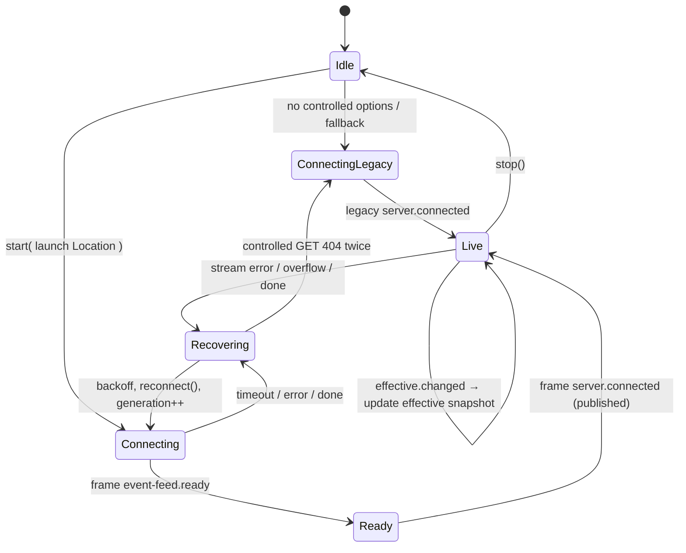

# Controlled-feed client compatibility surface

## Situation

The bus-smart wave converged on a controlled SSE design
([controlled-draft0](/.design/bus-smart/controlled-draft0.gpt56s.md)): a new
experimental `GET /api/experimental/event` plus
`PATCH /api/experimental/event/subscriptions/:subscriptionID/interests`, with
`event-feed.*` transport control frames mixed into the SSE `data:` stream. This
research covers the client half of that split: what the adoption adapter looks
like, where it lives, and whether the hard constraint holds — **CLI, ACP, mini
transport, desktop, app, SDK, plugin promise adapter, and every generated client
keep working unchanged** while only the TUI adopts the controlled feed. It also
reserves (not designs) what a future browser/web client will need.

The compat guarantee is provable structurally rather than by testing each
consumer: the experimental endpoints are additive in the protocol, the
generator only ever adds methods for new endpoints, control frames exist only on
the new stream, and the adapter is an opt-in sibling of the shared connection
loop. The census below traces each consumer through those four facts.

## Part 1: Consumer census

Method: searched `packages/` for `client.event.subscribe(`, `.event.subscribe(`,
`events.subscribe(`, `client.event`, `/api/event`, `StreamSse`, and
`text/event-stream`, then manually classified every hit as HTTP-SSE consumer,
in-process Bus consumer, thin SDK re-export, or test/metadata surface.

### Runtime consumers of the HTTP event SSE

| # | Consumer | What it consumes | Untouched? |
| --- | --- | --- | --- |
| 1 | `packages/client/src/solid/connection.ts:73` — `createClientConnection` | `api.event.subscribe({ signal })`, requires first frame `server.connected` (L82-83), batches events (L52-61), reconnect loop (L114-145) | Yes — legacy path kept verbatim; the controlled adapter is a separate opt-in factory (Part 3). Its options type only gains an optional field at most. |
| 2 | `packages/tui/src/context/client.tsx:25-39` — TUI `ClientProvider` | `createClientConnection` + Solid global emitter | Yes as-is; this is the one call site the TUI adoption will intentionally extend (opt-in controlled factory + launch-Location input). Behavior for everyone else unchanged. |
| 3 | `packages/app/src/runtime/server/client.tsx:79-92` — app server SDK | `createClientConnection` with `pageLifecycle: true`, `flushInterval: 16`, managed-service `reconnect` | Yes — calls the legacy factory with today's options; never sees control frames (they only exist on the new stream) and never calls new endpoints. |
| 4 | `packages/app/src/runtime/server/runtime.tsx:138-144` — app data projection | `createData({ event: sdk.event..., connection })` — the **same `data.ts` projection the TUI uses** | Yes — projection input contract (`on`/`listen`/`connection.status`) unchanged. See Part 4: this sharing is why the projection guard stays valuable. |
| 5 | `packages/tui/src/mini/stream-v2.transport.ts:1400-1412` | `client.event.subscribe({ signal })`, buffers until `server.connected` (L1412), single `input.location` (L44) | Yes — stays on legacy `/api/event`. Single-Location header scoping remains a possible later opt-in (review0) but is out of scope now. |
| 6 | `packages/cli/src/run/noninteractive.ts:70-74` | `input.client.event.subscribe({ signal })`, checks only `connected.done` | Yes — legacy endpoint, generated signature unchanged (Part 2). |
| 7 | `packages/cli/src/acp/event.ts:86-91` | `input.client.event.subscribe({ signal })` in `streamTurn` | Yes — same as above. |
| 8 | `packages/sdk/src/promise.ts:30-37` — SDK Promise surface | re-exports `client.event` as `opencode.events.subscribe(requestOptions?)` | Yes — the SDK wraps the generated method without modifying it; signature preserved because the legacy endpoint gains no input. |
| 9 | `packages/sdk/src/effect/opencode.ts:17,45` — SDK Effect surface | `events: client.event` from `@opencode-ai/client/effect` | Yes — Effect `event.subscribe(): Stream` has no input and no options today (`api.ts` L1576-1581), and is regenerated mechanically only with additive methods. |
| 10 | `packages/sdk/src/workerd.ts:25-41` — workerd profile | delegates to `PromiseSdk.create` | Yes — transitively covered by #8. |
| 11 | `packages/plugin/src/promise/adapter.ts:183-191` — plugin Promise adapter | `event.subscribe()` maps `host.event.subscribe()` — an **in-process Bus stream**, not HTTP | Yes — plugin hosts observe the Bus directly (`ctx.event.subscribe()`); the controlled design adds `listenRouted` and leaves `bus.listen` (bus.ts L162, L873) intact, so no plugin-visible surface moves. |
| 12 | In-process plugin consumers (`core/src/config/plugin/mcp.ts:13`, `command.ts:53`, `agent.ts:70`, `skill.ts:182`, `entry-observer.ts:17`, `plan.ts:76`, `provider/vllm.ts:127`, `ollama.ts:197`, `lmstudio.ts:141`) | `ctx.event.subscribe()` — in-process Bus | Yes — same argument as #11; no HTTP transport involved. |
| 13 | `packages/desktop/src/main/service/background-service.ts:38` — desktop main | imports `@opencode-ai/client/service` (service discovery, no SSE) | Yes — no event subscription in desktop main. |
| 14 | `packages/desktop/src/renderer/desktop-app.tsx:18` — desktop renderer | mounts `@opencode-ai/app/desktop` | Yes — consumes SSE only through the app runtime (#3, #4), which is untouched. |

### Test and metadata surfaces (expected mechanical churn, no runtime change)

| Surface | Role | Effect of adding experimental endpoints |
| --- | --- | --- |
| `packages/client/test/promise.test.ts:553-731` | SSE parser and retry tests | unchanged; new tests added beside them |
| `packages/client/test/effect.test.ts:128,151` | Effect stream tests | unchanged |
| `packages/sdk/test/promise.test.ts:68,83`, `embedded.test.ts:211-569` | SDK event tests | unchanged |
| `packages/tui/test/fixture/tui-client.ts:77`, `use-event.test.tsx:243`, `data.test.tsx:744,1161` | TUI fixtures mocking `/api/event` | unchanged — the legacy mock keeps working; controlled-mode stories add their own fixture branch |
| `packages/cli/test/acp/event.test.ts`, `event-behavior.test.ts`, `sse-fixture.ts`, `service-fixture.ts`, `subprocess.ts` | ACP fixtures | unchanged |
| `packages/app/e2e/utils/sse-transport.ts:7`, `mock-server.ts:78`, `mock-api.ts:37`, regression specs | app e2e mocks | unchanged |
| `packages/server/test/process.test.ts:93`, `persistent-pty.test.ts:460` | raw `/api/event` fetches | unchanged |
| `packages/httpapi-codegen/test/generated-consumer.ts:20` | codegen type-level consumer | unchanged for `event.subscribe()`; extended only if the codegen itself changes |
| `packages/protocol/openapi.json:8953`, `packages/www/openapi.json` + `public/openapi.json`, `packages/codemode/test/fixtures/opencode-v2-openapi.json:7186` | OpenAPI snapshots | **regenerate** — additive path entries; expected mechanical diff |
| `packages/client/src/promise/generated/*`, `src/effect/generated/*`, `src/effect/api/*` | generated trees | **regenerate** — additive methods only (Part 2) |

### The proof, in four structural facts

1. **Legacy endpoint is byte-identical.** `GET /api/event` keeps its no-input
   definition (`packages/protocol/src/groups/event.ts:34-35`) and its handler
   (`packages/server/src/handlers/event.ts:12-21`) prepending one
   `server.connected`. EventFeed's global `bus.listen` observation
   (`packages/server/src/event-feed.ts:87`) remains the legacy fan-out path.
2. **Codegen is per-endpoint.** The generator emits one method per endpoint and
   derives each signature from that endpoint's own input fields
   (`httpapi-codegen/src/index.ts:913-950`); a new endpoint cannot alter
   `event.subscribe`'s `(requestOptions?)` shape, which exists precisely because
   that endpoint has no input (`promiseInputMode`, index.ts L1256-1260).
3. **Control frames exist only on the new stream.** `event-feed.*` frames are
   emitted solely by the controlled handler; consumers of `/api/event` cannot
   receive them, so no consumer needs interception to stay correct.
4. **The shared connection loop is either untouched or extended additively.**
   The adapter is a sibling module (Part 3); the app's `createClientConnection`
   call at `client.tsx:79` compiles and behaves identically.

## Part 2: Generated client mechanics

### Argument rule and the existing signature

`renderPromiseClient` builds each method's argument list from
`promiseInputMode`: no input fields → `(requestOptions?: RequestOptions)`;
all-optional input → `(input?: XInput, requestOptions?)`; otherwise
`(input: XInput, requestOptions?)`
(`httpapi-codegen/src/index.ts:916-920`, L1256-1260). The legacy event endpoint
declares no input, so the shipped signature stays
`event.subscribe(requestOptions?): AsyncIterable<EventSubscribeOutput>`
(`promise/generated/client.ts:1597-1602`). Adding endpoints elsewhere in the
protocol does not re-enter that decision.

`RequestOptions` already carries arbitrary headers (L270-273, merged at
L295-299), which is how the PATCH's `x-opencode-event-control-token` header will
be passed without codegen changes.

### What `bun run generate` produces for the new pair

`packages/client/script/build.ts:42-119` compiles `ClientApi` three ways:

- `emitPromise` → `src/promise/generated` — new methods appear in the new
  group's namespace, e.g. `client.<namespace>.subscribeControlled(input?: {...},
  requestOptions?)` and `client.<namespace>.patchInterests(input, requestOptions?)`.
- `emitEffectImported` → `src/effect/generated` — additive adapters beside
  `EndpointEventSubscribe` (`effect/generated/client.ts:1169-1179`).
- `emitEffectShape` → `src/effect/api/api.ts` — additive `*Api` interfaces beside
  `EventApi` (L1576-1581). The build script's `outputTypes` override for
  `event.subscribe` (build.ts L108-112) is keyed by endpoint id, so a new
  endpoint gets its own type name and the override is untouched.

The exact GET-with-input SSE precedent already exists:
`session.log` (`protocol/src/groups/session.ts:645-653`) is a GET with path
param, optional query, and `StreamSse` union data, and generates
`log: (input: SessionLogInput, requestOptions?) => AsyncIterable<SessionLogOutput>`
(`promise/generated/client.ts:894-899`). The controlled GET with
`query: LocationQuery` (the shape used by `pty.list`,
`protocol/src/groups/pty.ts:23-26`) is the same generation path.

Group placement is the one real choice. `server.experimental` is already taken
by `PersistentPtyGroup` (`protocol/src/groups/persistent-pty.ts:21`), and
`groupNames` (`protocol/src/client.ts:35-67`) maps one namespace per group
identifier. Two options, both additive:

- a dedicated group (e.g. `server.experimental.event`) plus one `groupNames`
  entry — cleaner protocol/OpenAPI shape; or
- endpoints inside a new group reusing nesting via identifier prefixes, landing
  beside `client.experimental.persistentPty.*`.

Either way, `promiseOmitEndpoints`/`effectOmitEndpoints` (client.ts L69-70) can
drop the new endpoints from either tree if carrying both surfaces is unwanted;
the TUI only needs the Promise surface.

Per repo AGENTS.md, regeneration is `bun run generate` from `packages/client`;
`check:generated` (package.json L30-31) is the CI diff guard.

### Control frames through the SSE parser

The generated parser consumes only `data:` lines
(`promise/generated/client.ts:375-378`), joining multi-line data and skipping
comment-only blocks (L379) and any `event:`/`id:` fields. Consequently:

- `event-feed.*` control frames as tagged JSON in `data:` flow through the
  parser **unchanged** — the parser needs no edits;
- the server may additionally emit `event: control` names for diagnostics;
  the parser ignores them, so the JSON payload stays authoritative (matching
  controlled-draft0's wire decision);
- the controlled GET's `StreamSse` data schema is the union
  `FeedItem = OpenCodeEvent | FeedControl`; the generator requires
  `sseMode === "data"` (index.ts L942) and the union satisfies it the same way
  `session.log`'s union does;
- heartbeats remain comment frames and are skipped exactly as today
  (`handlers/event.ts:22`).

Type discrimination happens in the adapter (Part 3), not in the parser: the
iterator's element type is the declared union, and `event-feed.`-prefixed
`type` values are narrowed before `onEvent`.

## Part 3: The controlled client adapter

### Where it lives

Recommended: a **sibling module**, `packages/client/src/solid/controlled-connection.ts`,
exporting `createControlledClientConnection(api, options)`. It reuses the
reconnect/backoff skeleton of `connection.ts` (2s connect timeout, 1s
reconnect delay, attempt counting, managed-service `reconnect`, generation
guard — connection.ts L27-28, L114-145) with the controlled deltas below. The
legacy `connection.ts` is not edited at all, which is the strongest possible
guarantee for the app's call site (`app/src/runtime/server/client.tsx:79`) and
matches controlled-draft0's carry layer 4 ("a controlled connection adapter
beside the legacy path").

Alternative: extend `createClientConnection` with an optional `control` option.
One reconnect loop, but every skeleton edit must be re-validated in both modes,
and the shared file becomes a conflict surface for the app. Not recommended
while the untouchable constraint is active.

The TUI's `ClientProvider` (`tui/src/context/client.tsx:25-39`) is the only
caller that switches factories: when constructed with controlled options
(launch directory + interest producer), it builds the controlled connection;
otherwise it builds today's legacy one. Exported from `solid/index.ts` beside
`connection` (index.ts L1-3).

### Exposed interface

Per controlled-draft0's "Client ownership", the adapter owns transport state
only and never invents product interests:

```ts
export interface EventInterestControl {
  readonly snapshot: Accessor<SubscriptionSnapshot | undefined>
  readonly patch: (input: {
    readonly add?: InterestInput
    readonly remove?: InterestInput
  }) => Promise<void>
  readonly replace: (interest: InterestInput) => Promise<void>
}
```

The snapshot accessor is a Solid signal updated only from SSE frames, so TUI
diagnostics can observe requested/effective revisions and derived coverage
without any projection coupling. `SessionTabsProvider` remains the interest
producer.

### Frame interception

Interception happens **before `publish`** in the adapter's receive loop, at the
equivalent position of connection.ts L92-103. Pseudocode:

```ts
const event = await iterator.next()
if (event.done) return { error: new Error("Event stream disconnected") }
if (isFeedControl(event.value)) {
  applyControlFrame(event.value)      // update snapshot, resolve pending command
  continue                            // never reaches options.onEvent
}
publish(event.value)                  // domain events only, including server.connected
```

`isFeedControl` narrows on the `event-feed.` `type` prefix. This guarantees
invariant 1 of Part 3's state machine: control frames never enter the emitter,
`handleEvent`, or hydration. The first **domain** frame remains
`server.connected`, so the existing first-frame check (connection.ts L82-83)
translates unchanged to "second frame overall".

### Command queue: single-in-flight with coalescing

- One PATCH in flight at a time. `patch()` calls record the desired delta into
  a pending buffer and return a promise resolved when the corresponding
  `event-feed.command.applied` frame is consumed (or when a covering `replace`
  completes after a stream failure).
- At dispatch time, the buffer is flattened into one command against the
  newest known revision, with `commandID = ${generation}:${seq}` — unique per
  connection generation, so an in-subscription retry of the exact same ID hits
  the server's idempotency cache (controlled-draft0 "Revision and retry
  rules") while a post-reconnect command is always fresh.
- **Revision discipline.** The HTTP response may race ahead of the SSE frame.
  The adapter may seed the *next* command's `expectedRevision` from the
  response (the server computed it under the same serialization), but the
  **published snapshot advances only when the `command.applied` frame
  arrives**, exactly as controlled-draft0 specifies. If the stream dies between
  response and frame, the command is "resolved-unknown": the pending promise is
  settled by the reconnect `replace`, not by the lost frame.
- **Conflict recovery.** A revision-conflict response carries the server's
  current revision; recovery is exactly one `replace` with the canonical
  desired set, never a converging sequence of patches.
- **Generation guard.** The existing `generation` counter (connection.ts L45,
  L116, L150, L165) extends naturally: any PATCH response or frame whose
  subscriptionID does not match the live generation's subscription is dropped.
  This covers stale responses after reconnect.

### Startup and reconnect

- **Startup with launch Location.** `ClientProvider` mounts outside
  `DataProvider`/`LocationProvider` (`tui/src/app.tsx:376-380`), and
  `LocationProvider` itself depends on client and data
  (`tui/src/context/location.tsx:14-18`) — so initial interest must be the
  launch directory, which is available at `app.tsx` mount time (it is already
  threaded to `DataProvider` as `directory`, app.tsx L378). The controlled GET
  takes it as `LocationQuery`, mirroring `pty.list`.
- **Persisted tabs before Location resolution.** `SessionTabsProvider` mounts
  inside the tree and reads persisted tab IDs from storage
  (`session-tabs.tsx:70`, store key `"tabs"`). As soon as tabs mount it issues
  one `patch({ add: { sessions } })` — exact Session interest needs no Location
  metadata — then resolves each Session, patches in its Location, and lets the
  existing tab prefetch (`session-tabs.tsx:285-320`) hydrate. No `mode: "all"`
  bootstrap, matching controlled-draft0's recommendation.
- **Reconnect restore.** Stream failure destroys the server-side subscription.
  The adapter keeps only the desired set, goes through the existing
  managed-service `reconnect` (the TUI's `service.reconnect`,
  tui client.tsx L26-34), opens a new controlled stream (new
  subscriptionID/token, revision 0, initial interest = launch Location again),
  and issues **one `replace`** with the full desired set if it differs from the
  initial interest. Missed events remain repaired by the domain
  `server.connected` hydration (`data.ts:528-557`) under the volatile contract.
- **Server-version fallback.** If the controlled GET returns 404/400 (an older
  elected server, as in the `dev:live` workflow), the adapter falls back to the
  legacy `api.event.subscribe` and disables control, keeping a newer TUI usable
  against an older server. This fallback is detection, not negotiation: no
  headers required.

### State machine



Invariants:

1. `event-feed.*` frames never reach `options.onEvent`.
2. The published snapshot's revisions advance only on SSE frames, never on
   HTTP responses.
3. At most one PATCH is in flight; dispatches always carry the newest desired
   delta (coalesced), never a queued stale delta.
4. `commandID`s are unique per connection generation; in-generation retries
   are byte-identical.
5. Frames or responses referencing a non-live subscriptionID/generation are
   dropped.
6. Revision-conflict recovery is exactly one `replace` with the desired set.
7. After a reconnect `ready`, at most one `replace` restores interest; no
   replay is attempted.
8. The first domain frame delivered to `onEvent` is `server.connected`, once
   per connection generation.

### What-if walkthroughs

- **HTTP response overtakes frame:** response arrives → next command may be
  dispatched with the response revision; snapshot waits for the frame; frame
  arrives (queue FIFO guarantees it was enqueued before the response) →
  snapshot advances, queue head resolves.
- **Response lost in transit:** retry same `commandID` → server returns cached
  result idempotently; frame eventually arrives.
- **Stream dies between response and frame:** command marked resolved-unknown;
  reconnect + `replace` settles the pending promise and restores desired
  state; no double-application is possible because the new subscription starts
  from server-side launch interest.
- **Move while disconnected:** restored Session follow covers a still-pending
  move; an executed move is repaired by reconnect hydration (existing volatile
  contract), as in controlled-draft0's verification list.

## Part 4: The tracked-session projection guard

Review0's recommended first patch is defense-in-depth that remains valuable
after transport scoping — more than expected, because **the app and desktop
share the TUI's projection**: `packages/app/src/runtime/server/runtime.tsx:138-144`
calls the same `createData` from `client/solid`. The app stays on the firehose
under the untouchable constraint, so the guard is the app's and desktop
renderer's *only* mitigation for foreign-stream projection cost.

Where the predicate lives: a small helper near `handleEvent` in
`data.ts`, consulting state that already exists:

- `sessionID in store.session.info` (hydrated or live-known Session);
- `sessionOutbox.has(sessionID)` (optimistic creation, `data.ts:299`,
  populated at L1347, consumed at L562);
- `store.session.message[sessionID]` or `pending/permission/form` state
  materialized by an explicit tab/route sync (`session-tabs.tsx:285-320`).

Applied at:

- `session.created` HTTP revalidation (L561-570) and `session.renamed`
  (L620-626);
- the transcript families before `message.update` — `session.text.*`,
  `session.tool.*`, reasoning/progress blocks (`data.ts:851-909`), whose
  `setStore(...produce(...))` materializes an empty per-Session array for
  unknown Sessions (L390-399, specifically `draft[sessionID] ??= []` at L396).

Global lifecycle, permission, and form events stay unguarded initially, per
review0's caution about attention semantics.

Residual value once the TUI is transport-scoped: (a) app/desktop continue on
the unscoped feed through the same `data.ts`; (b) bounded overdelivery from
removed-interest FIFO tails is allowed by design; (c) derived-interest edges
and any server bug degrade to cheap no-ops instead of projection storms. The
guard is complementary, not redundant.

## Part 5: Auth and transport details

- **Control token.** `controlToken` arrives only in the `event-feed.ready`
  frame and is sent back exclusively in the `x-opencode-event-control-token`
  header on PATCH. Normal server authentication still applies to both new
  endpoints through the API-wide `Authorization` middleware
  (`protocol/src/api.ts:190`, wired in `server/src/middleware/authorization.ts:43-60`).
  The header-input precedent exists: `persistentPty.connectToken` generates
  `headers: { "x-opencode-ticket": input[...] }`
  (`promise/generated/client.ts:1680`).
- **Ticket precedent.** The PTY connect flow is the codebase's model for
  browser-exempt credentials: browsers cannot set WebSocket-upgrade headers, so
  a ticketed connect URL skips credential checks in the middleware
  (authorization.ts L50-55), and ticket minting requires a custom header that
  forces a CORS preflight, deliberately binding ticket issuance to the origin
  policy (`server/src/handlers/pty.ts:123-129`). The controlled feed needs none
  of this machinery — the token rides the PATCH header — but the pattern is the
  reference if browser constraints ever tighten.
- **Query auth precedent.** `authorization.ts` already accepts Basic
  credentials via the `auth_token` query parameter (L10, L30-37). This is what
  makes the future browser story cheap (Part 6).
- **Where the group mounts.** Protocol groups compose in
  `makeApiFromGroup` (`protocol/src/api.ts:151-191`); the server's `Api` comes
  from `makeDefaultApi` (`server/src/api.ts:6-12`). A new experimental group is
  one `.add(...)` plus the generated-client plumbing of Part 2. The handler
  stays thin: decode command, verify token, call `EventFeed.control`, return
  the revision result (controlled-draft0 "Effect v4 module shape").
- **No middleware inheritance.** The group should not take Location middleware:
  interest Locations are payload data, not request context, and must not pass
  through `requestRef()`'s cwd fallback (review0 finding 3).

## Part 6: Web-client reservation analysis

Browser `EventSource` cannot set request headers, cannot PATCH, and cannot send
anything after connect. Reserved decisions, from most to least consequential:

**Expensive to reverse later — keep as decided:**

- Control commands over HTTP PATCH, not in-stream (EventSource is receive-only;
  in-stream commands would lock browsers out entirely). The chosen design is
  the safe one.
- Control token delivered in the ready frame and returned via PATCH header —
  never as a query parameter. A token in the GET URL would persist in server
  logs, proxy logs, and browser history; header-on-PATCH leaks nowhere and
  browsers use `fetch` (which sets headers) for the PATCH anyway.
- The ready frame as first data frame: EventSource delivers it like any event;
  nothing header-dependent is required before interest can be patched.

**Cheap now, worth stating:**

- **GET authentication for EventSource:** the existing `auth_token` query
  parameter (Part 5) already covers browsers; no new mechanism needed. The
  initial Location interest is a query parameter — EventSource-compatible by
  construction.
- **CORS:** PATCH + a custom header is a non-simple request forcing a
  preflight OPTIONS. The PTY ticket flow already relies on exactly this
  property to enforce origin policy (`pty.ts:123-125`), so the server's CORS
  configuration must cover the new group's path before any browser client — a
  verification item, not a redesign.
- **`mode: "all"` vs per-view interest:** the app's event source already does
  client-side per-directory filtering on the firehose
  (`app/src/runtime/server/client.tsx:26-40`), so a web client will want
  per-view/per-server interest sets, not `mode: "all"`. Keep `InterestInput`
  an open object schema (`locations?`, `sessions?`) so a future `mode`
  discriminator or field is an additive schema change rather than a rename.

**Open for the web client, unaffected by current choices:** reconnect strategy
(EventSource auto-reconnects and would need `Last-Event-ID` semantics or a
switch to `fetch`-based SSE — the adapter's generation guard works either way),
and multi-tab interest coordination.

## Findings summary

1. The untouchable constraint holds structurally: legacy endpoint untouched,
   codegen strictly additive, control frames confined to the new stream,
   adapter is an opt-in sibling. Fourteen runtime consumer rows, all "yes".
2. The only intentionally modified call sites are TUI-internal
   (`ClientProvider` factory selection) — squarely inside the sanctioned
   adopter.
3. The generated trees and OpenAPI snapshots change mechanically; the
   `session.log` endpoint proves the exact GET-with-input SSE generation path,
   and `connectToken` proves header inputs.
4. The projection guard stays valuable specifically because the app and
   desktop share `data.ts` while remaining on the firehose.
5. The browser reservation is already favorable: query-param auth exists, the
   token never rides a URL, and control stays on `fetch`-able HTTP.

## Open questions

- Should the controlled endpoints be omitted from the Effect generated tree
  (`effectOmitEndpoints`) while only the TUI's Promise path consumes them, or
  carried for symmetry?
- Does the 404-fallback-to-legacy belong in the adapter permanently (a
  long-lived compat mode), or should version skew instead be handled by the
  managed-service election always matching the TUI?
- Is one `replace` per revision conflict sufficient when multiple UI actors
  race (tab open + route change in one tick), or should the coalescer expose a
  conflict-count signal for diagnostics?

## Cross-references

- [Controlled SSE draft](/.design/bus-smart/controlled-draft0.gpt56s.md) — the
  transport contract, command semantics, and carry layers this research
  implements the client half of.
- [Downstream-patch assessment](/.design/bus-smart/review0.gpt56s.md) — the
  generated-churn finding (2) and client-work finding (5) verified here against
  current line numbers; the recommended projection guard is assessed in Part 4.
- [Controlled-SSE research](/.design/bus-smart/research-controlled-sse0.gpt56s.md)
  — Variant A's metadata-in-`server.connected` alternative and the security
  table; Part 6 extends its browser constraints.
- [Location-stream alternatives](/.design/bus-smart/location-streams0.gpt56s.md)
  — Design C's client interfaces, which this adapter concretizes.
- [Bus routing tests](/packages/core/test/bus-session-routing.test.ts) and
  [EventFeed tests](/packages/server/test/event-feed.test.ts) — behavioral
  oracles for the server half; the adapter's verification list should mirror
  controlled-draft0's.
