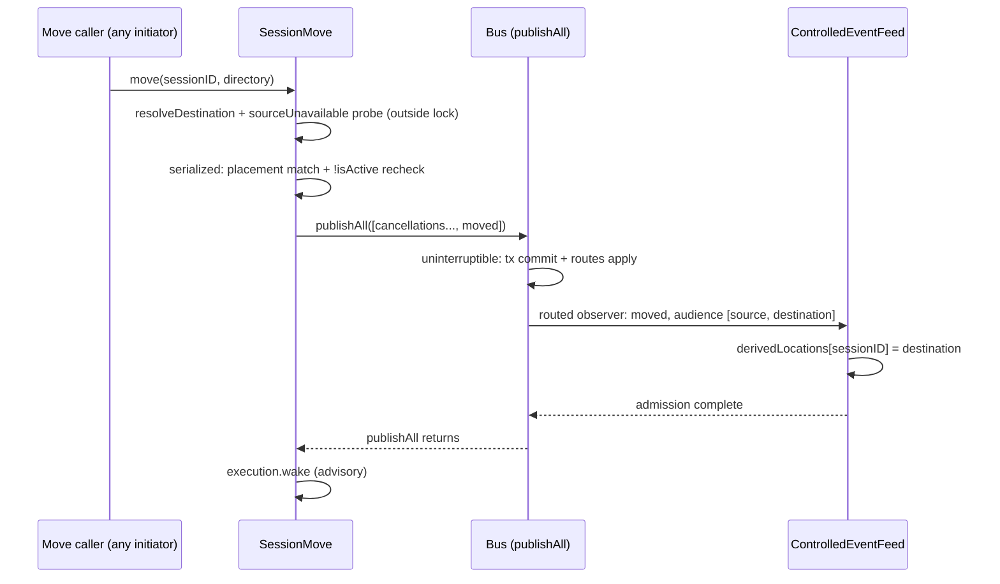

# Move guarantees after the v2@origin rebase

## Situation

[Draft0](/.design/bus-smart/draft0.gpt56s.md) rests its move safety on one Core
correction: when `Session.move` takes the idle immediate path with no pending
cancellations, it must publish through `publishAll` so an interrupted caller
cannot commit the move without completing routed observation
([draft0 L243-249](/.design/bus-smart/draft0.gpt56s.md#L243-L249)). The rebase
onto `v2@origin` (376 commits, tip `2960c61f9c` / #47464) landed two upstream
changes directly on that seam:

- **#46442** `feat(core): add session-aware instance selection` (`3e9b009642`)
- **#46955** `fix(core): recover idle moves through the selected instance` (`ac874a6e90`)

Together they extracted `Session.move` into
[`session/move.ts`](/packages/core/src/session/move.ts), rebuilt the
idle-recovery condition around a source probe, and introduced an explicit
active/deferred split. This note re-derives the complete move path matrix from
the rebased source, states the exact guarantee the scoped feed needs, and
confirms whether the ported one-line fix survives.

Sources traced in this repo: `move.ts`, `bus.ts`, `inbox.ts`, `execution.ts`,
`runner/llm.ts`, `run-coordinator.ts`, `execution/restart.ts`,
`controlled-event-feed.ts`, plus the focused tests. Upstream comparison used
`~/archive/anomalyco/opencode` `origin/v2` and the two commit diffs.

## Facts: what upstream changed on the move seam

### #46442 — session-aware instance selection

Added `Instance.Service` with `provide(session)` (acquire the session's
placement services, initializing when absent) and `provideIfLoaded(session)`
(borrow without initializing). All execution routing — `SessionExecution`
drains, the move source probe, form/permission handlers — now selects
capabilities through this seam instead of `LocationServiceMap` directly.

### #46955 — recover idle moves through the selected instance

Extracted the move implementation into `SessionMove.Service`
([`move.ts`](/packages/core/src/session/move.ts)) with a rebuilt immediate
condition:

1. **Source probe, outside the inbox lock**
   ([`move.ts:103-111`](/packages/core/src/session/move.ts#L103-L111),
   called at [`L118`](/packages/core/src/session/move.ts#L118)):
   - `execution.isActive` → not unavailable (active sessions defer);
   - source directory missing → unavailable, **without initializing the source
     instance** (pinned by *"recovers a missing source without initializing its
     instance"*);
   - otherwise, constructing `SessionRunner.Service` through
     `instances.provide(session)` decides: success → available, non-interrupt
     failure (broken config) → unavailable; interrupts propagate. The probe
     runs outside the lock specifically so `cancelInbox` stays available while
     instance initialization blocks
     ([`move.ts:117`](/packages/core/src/session/move.ts#L117)).
2. **In-lock revalidation** under `SessionInbox.serialized`
   ([`move.ts:124-142`](/packages/core/src/session/move.ts#L124-L142)): the
   immediate path requires `unavailable` **and** placement still matches the
   probed snapshot — `latest.location.directory` and
   `latest.location.workspaceID` both equal
   ([`L131-132`](/packages/core/src/session/move.ts#L131-L132)) — **and** the
   session is still not active ([`L133`](/packages/core/src/session/move.ts#L133)).
   This rejects recovery when a foreign move changed either placement
   coordinate or execution started during the probe.
3. **Immediate batch**: pending `move`-type inbox rows produce
   `session.inbox.cancelled` events (non-move items are retained), followed by
   `session.moved`, all in one `publishAll`
   ([`move.ts:135-141`](/packages/core/src/session/move.ts#L135-L141)).
4. Otherwise: durable inbox admission + advisory wake
   ([`L143-152`](/packages/core/src/session/move.ts#L143-L152)).

Upstream's accompanying tests cover: broken/healthy source configuration,
unreadable (mode-000) source, selected-instance vs default-Location behavior,
probe interrupts (source and caller), execution starting during the probe,
missing-source recovery retaining destination workspace identity, stale
directory/workspace recovery rejection, and active deferral — all present in
our tree at
[`session-move.test.ts:202-448`](/packages/core/test/session-move.test.ts#L202-L448)
and
[`L514-547`](/packages/core/test/session-move.test.ts#L514-L547).

**Upstream still uses single `bus.publish` for the no-cancellation immediate
branch.** The commit→notify interruption window that draft0 identified is
still open on the upstream tip.

### Our delta after the rebase (verified by byte diff vs `origin/v2`)

1. One line:
   [`move.ts:140`](/packages/core/src/session/move.ts#L140) reads
   `bus.publishAll([moved])` where upstream reads `bus.publish(...moved)`.
   Everything else in `move.ts` and `session-move.test.ts` is byte-identical
   to upstream.
2. Two tests upstream does not have:
   - *"completes routed observation when an immediate move is interrupted after
     commit"* ([`session-move.test.ts:549-583`](/packages/core/test/session-move.test.ts#L549-L583))
     — no-cancellation immediate path, observer gated on a Deferred, caller
     fiber interrupted mid-observation; asserts the observer completes and the
     session is moved.
   - *"completes routed observation for an interrupted immediate move
     cancellation batch"*
     ([`session-move.test.ts:585-622`](/packages/core/test/session-move.test.ts#L585-L622))
     — same pin for the cancellation-bearing branch.

## Facts: publication mechanics the feed depends on

- **Single `publish` has a commit→notify window.** `commitDurableEvent` wraps
  transaction + route application + durable wakes in `Effect.uninterruptible`
  ([`bus.ts:345-476`](/packages/core/src/bus.ts#L345-L476)), but `publishEvent`
  calls `notify` **outside** that uninterruptible section
  ([`bus.ts:499-507`](/packages/core/src/bus.ts#L499-L507)). An interrupted
  caller can leave a durably committed event (projection applied inside the
  transaction) that observers and listeners never receive.
- **`publishAll` spans commit and notification uninterruptibly.** Same-aggregate
  enforcement at [`bus.ts:611-619`](/packages/core/src/bus.ts#L611-L619), then
  `durableLocks.withLock(aggregateID)(Effect.uninterruptible(...))` covering
  the transaction, `route()` application, wakes, and the per-event `notify`
  loop ([`bus.ts:620-711`](/packages/core/src/bus.ts#L620-L711), notify at
  [`L708`](/packages/core/src/bus.ts#L708)). The aggregate mutex is held across
  notification, so a concurrent same-aggregate publisher cannot interleave its
  notify inside a paused batch — pinned by *"does not interleave a concurrent
  publish with batch notifications"*
  ([`bus.test.ts:582-614`](/packages/core/test/bus.test.ts#L582-L614)).
- **Routed observers run first and are awaited** inside `notify`
  ([`bus.ts:537-550`](/packages/core/src/bus.ts#L537-L550)); defects are logged
  and swallowed, interrupts propagate
  ([`bus.ts:524-535`](/packages/core/src/bus.ts#L524-L535)).
- **`session.moved` gets a dual audience.** `prepareRoutes` resolves the move
  to `[source ref, destination]` (destination only when no owner ref exists)
  and updates the owner map to the destination
  ([`bus.ts:271-276`](/packages/core/src/bus.ts#L271-L276)); both apply only
  after the projection transaction commits
  ([`bus.ts:282-290`](/packages/core/src/bus.ts#L282-L290)). Later events for
  the session route destination-only. Route snapshots are retained in a
  WeakMap while slow subscribers drain
  ([`bus.ts:223-225`](/packages/core/src/bus.ts#L223-L225)).
- **Audience parity is by construction**: `routed()`
  ([`bus.ts:230-240`](/packages/core/src/bus.ts#L230-L240)) feeds both routed
  observers and the `Bus.subscribe()` Location filter
  ([`bus.ts:771-791`](/packages/core/src/bus.ts#L771-L791)). `sessionID` is
  attached to every `SessionEvent.All` payload regardless of routing branch.

## Facts: move path matrix

| # | Path | Trigger | Mechanics | Publication | Interruption / restart | Feed coverage |
| --- | --- | --- | --- | --- | --- | --- |
| 1 | Immediate idle, no pending moves | Source gone/broken, placement matches, not active | Probe outside lock ([`move.ts:118`](/packages/core/src/session/move.ts#L118)); in-lock revalidate ([`L129-134`](/packages/core/src/session/move.ts#L129-L134)) | One-element `publishAll([moved])` ([`L140`](/packages/core/src/session/move.ts#L140)) — **our fix** | Uninterruptible commit+notify; caller interrupt cannot separate them (pinned) | Dual audience `[source, destination]`; derived map installed before move admission |
| 2 | Immediate idle, pending move rows | Same, with earlier queued/steered moves | `moveIDs` cancellations ([`L135-137`](/packages/core/src/session/move.ts#L135-L137)) | `publishAll([cancel₁…cancelₙ, moved])` ([`L141`](/packages/core/src/session/move.ts#L141)) | Same uninterruptible batch (pinned) | Same; cancels and move ordered in one queue |
| 3 | Deferred admission | Active session, placement changed during probe, or healthy source | `admission.admit` → durable `session_inbox` row ([`L143-149`](/packages/core/src/session/move.ts#L143-L149)); `execution.wake` advisory ([`L152`](/packages/core/src/session/move.ts#L152)) | `session.inbox.enqueued` via single `publish` ([`inbox.ts:176-181`](/packages/core/src/session/inbox.ts#L176-L181)) | Row is durable; wake coalesces into the busy period or starts one ([`run-coordinator.ts:131-140`](/packages/core/src/session/run-coordinator.ts#L131-L140)) | Enqueued event routed via owner snapshot; single-publish window applies (residual, below) |
| 4 | Runner applies a steer at a safe step boundary | Steered move reaches `advanceToStep` while active or on wake-drain | Inside `uninterruptibleMask` + `SessionInbox.serialized` ([`llm.ts:72-97`](/packages/core/src/session/runner/llm.ts#L72-L97)): close transport, then `publishAll([inbox.delivered, moved])` under `restore` ([`L85-94`](/packages/core/src/session/runner/llm.ts#L85-L94)) | Two-event `publishAll`, internally uninterruptible as a whole | Interrupt during `close` aborts before any commit (move stays pending); interrupt after commit cannot stop notify (pinned by *"completes routed observation when a runner move batch is interrupted"*, [`session-runner.test.ts:1361-1397`](/packages/core/test/session-runner.test.ts#L1361-L1397)) | Same dual audience; delivered+move ordered |
| 5 | Post-move continuation | `DrainResult.Moved` | `SessionExecution.drain` re-reads the session and re-provides placement from the store ([`execution.ts:88-103`](/packages/core/src/session/execution.ts#L88-L103)) — destination instance selected through `Instance.provide`; continuation step preserved mid-turn, reset at entry ([`llm.ts:98-103`](/packages/core/src/session/runner/llm.ts#L98-L103)) | n/a | Same busy period; doorbell survives ([`run-coordinator.ts:109-115`](/packages/core/src/session/run-coordinator.ts#L109-L115)) | Suffix events published from destination context, causally after the move batch |
| 6 | Restart with a live claim | Process died / shutdown-interrupted mid-busy-period | Sweep resumes claimed sessions ([`restart.ts:190-229`](/packages/core/src/session/execution/restart.ts#L190-L229)); drain applies any pending move via path 4 | Path 4 | Shutdown interruption preserves the claim; user interruption releases it ([`execution.ts:113-131`](/packages/core/src/session/execution.ts#L113-L131)) | Same as path 4 after replayed history |
| 7 | Unclaimed idle session with pending move at boot | Move admitted, wake never became a claim (crash between admit and claim) | No boot-time inbox scan; `listSuspended` covers claims only | Path 3 durability keeps the row | Applies on the next wake (prompt, another move, interrupt-continue) — **inferred from code, no test pins this** | Client sees the pending item via HTTP reads; no live move until woken |
| 8 | Client reconnect during/after a move | SSE drop / server restart | Fresh subscription, empty derived map ([`controlled-event-feed.ts:165-197`](/packages/server/src/controlled-event-feed.ts#L165-L197)); activation PUT installs current transport target | n/a | No replay claim (draft0 invariant 13) | Exact-session dimension still admits all `SessionEvent.All` payloads anywhere; destination Location-owned events covered once hydration puts the new Location in the desired set |
| 9 | Destination suffix events | Any same-session event after the move commits | Owner map = destination from move commit ([`bus.ts:271-290`](/packages/core/src/bus.ts#L271-L290)) | Durable same-aggregate publishers serialize behind the lock that spans notify; runner suffix follows program order after `publishAll` returns | n/a | Derived map already set when the move was admitted, so suffix matches through `covers` ([`controlled-event-feed.ts:275-282`](/packages/server/src/controlled-event-feed.ts#L275-L282)) |

Feed-side consumption facts
([`controlled-event-feed.ts:126-160`](/packages/server/src/controlled-event-feed.ts#L126-L160)):
move following fires only for subscribers whose `requested.sessions` contains
the Bus-classified `sessionID`; `derivedLocations[sessionID]` is set from
`event.data.location` **before** the `matches` check that admits the move;
`session.deleted` clears the entry; unfollow prunes it at replacement
([`L217-219`](/packages/server/src/controlled-event-feed.ts#L217-L219)).
Pinned by *"follows a requested Session move until that Session is
unfollowed"* and *"releases derived move coverage when the Session is
deleted"* ([`controlled-event-feed.test.ts:315-364`](/packages/server/test/controlled-event-feed.test.ts#L315-L364)).

## The exact guarantee the scoped feed needs

**G1 — move observation atomicity.** Once a `session.moved` publication
begins, interruption of the publishing caller cannot separate the durable
commit from routed observation: observers either see nothing and nothing
committed, or see the committed move with its full audience. Required of every
Core path that publishes a move.

**G2 — suffix ordering.** Every causally later event for the same Session is
observed after `session.moved`: same-aggregate durable publishers queue behind
the aggregate mutex which spans notification, and runner-produced suffix
events follow program order after `publishAll` returns.

**G3 — audience shape.** `session.moved`'s audience is exactly
`[source, destination]` (or `[destination]` with no owner ref), with
directory+`workspaceID` equality; the feed takes the destination from
`event.data.location`, never from audience-ref ordering.

### Verdict: the publishAll fix is still sound

1. The rebased branch is byte-identical to upstream except the one line at
   [`move.ts:140`](/packages/core/src/session/move.ts#L140); #46955 changed
   *when* the immediate path is taken (probe + placement match + active
   recheck), not the publication semantics of the branch itself.
2. `publishAll` still wraps commit, route application, wakes, and notification
   in `Effect.uninterruptible` under the aggregate lock, so the no-cancellation
   immediate branch now carries the same guarantee as the cancellation-bearing
   branch and the runner branch — G1 holds on all three Core paths.
3. The two ported tests exercise exactly the new condition path (idle session,
   removed source) and pin observer completion under caller interruption.
4. The upstream gap is real and unchanged: upstream `origin/v2` retains
   `bus.publish(...moved)` there, so the fix remains a legitimate upstream
   proposal (draft0's *"close immediate move notification gap"* commit).

## Recommendations

- **Keep the one-line fix and its two tests as the entire Core move delta.**
  Do not fold #46955's mechanics into our commits; they are upstream-owned and
  merged cleanly.
- **Propose the one-liner upstream** on its own, with the interruption test as
  the motivation: an HTTP caller disconnect is an interruption, and without
  `publishAll` it can commit a move that no scoped subscriber ever observes.
- **Suggested draft1 wording** for the guarantee section:
  > Every Core path that publishes `session.moved` uses an aggregate-locked,
  > uninterruptible `publishAll` whose notification phase completes routed
  > observation before the publisher proceeds. An interrupted initiator
  > therefore cannot commit a move without its audience being observed, and
  > causally later same-Session events are observed after the move. The feed
  > installs the destination from `session.moved.data.location` before
  > admitting the move frame.

### Concrete missing tests (small, non-speculative)

1. **Observer-flavored non-interleave oracle.** The existing non-interleave
   test pins the lock-spanning-notify property through `bus.listen`
   ([`bus.test.ts:582-614`](/packages/core/test/bus.test.ts#L582-L614)); an
   `observeRouted` variant with a gated observer and a concurrent
   same-aggregate single publish would pin the seam the feed actually uses.
2. **Restart sweep applies a pending move for a claimed session** (matrix row
   6): claim → kill → sweep → drain publishes `[inbox.delivered, moved]` and
   re-drains at the destination. Not verified to exist anywhere; add if
   absent.
3. **Unclaimed pending move requires a next wake** (matrix row 7): pin with a
   boot-with-pending-move assertion, or accept and document the behavior.
4. **Location-only subscriber boundary** (feed): a subscriber holding only the
   source Location receives `session.moved` via the source ref and then
   receives nothing destination-routed — the documented follow-Sessions-not-
   Locations boundary; one test would prevent an accidental generalization to
   location-following.

### Residuals accepted, not bugs

- The single-publish commit→notify window still applies to
  `session.inbox.enqueued` and the cancel/steer/queue mutations
  ([`inbox.ts:230-260`](/packages/core/src/session/inbox.ts#L230-L260)) —
  draft0 open item 5 keeps this out of scope; do not expand the fix there
  without a consumer that needs it.
- Concurrent (not causally later) ephemeral publishers remain unordered,
  matching draft0's admission-order stance.
- `execution.isActive` is process-local by design; clustered ownership is
  future work.

## Not re-verified this round

- TUI move call sites (`/cd`, `usePromptMove`, app/plugin surfaces) — carried
  from draft0's claim that server-side following covers all initiators; not
  re-traced.
- `~/src/opencode-bus-smart-old` was not consulted; the post-rebase tree plus
  the upstream byte diff is the authoritative comparison.
- No tests were executed (documentation-only task); counts cited in
  [port0](/.design/bus-smart/port0.glm53h.md) and
  [verification0](/.design/bus-smart/verification0.gpt56s.md) are taken as
  reported.

## Cross-references

- [Directional draft](/.design/bus-smart/draft0.gpt56s.md) — normative
  ordering invariants 5-8 and the carry boundary this matrix validates;
  specifically the immediate-move correction at
  [L243-249](/.design/bus-smart/draft0.gpt56s.md#L243-L249) and the Core
  oracle line at [L886-888](/.design/bus-smart/draft0.gpt56s.md#L886-L888).
- [Event sequencing research](/.design/bus-smart/research-event-sequencing0.gpt56s.md)
  — derives the per-Session causal FIFO and server-side move-follow
  requirement (its "Move initiation and sequencing" section) that G1-G3
  satisfy.
- [Port report](/.design/bus-smart/port0.glm53h.md) — records the
  `session.move` extraction merge ([L32](/.design/bus-smart/port0.glm53h.md#L32))
  and the re-verification matrix this note re-checks at the source level.
- [Verification report](/.design/bus-smart/verification0.gpt56s.md) —
  interruption-test coverage statement ([L28](/.design/bus-smart/verification0.gpt56s.md#L28))
  confirmed against the current test files.
- [Bus Session routing tests](/packages/core/test/bus-session-routing.test.ts)
  — dual-audience, batch move/delete, rollback, and slow-subscriber oracles
  for G3.
