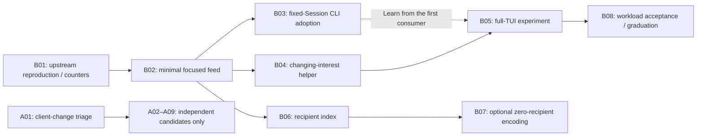

# Upstreaming bus-smart without the client rewrite

## Recommendation

Propose **two separate epics**, not two large implementation PRs:

1. **Disentangle the client changes; extract only independently justified fixes.**
   This is an accounting and triage effort, not a requirement to upstream the
   new read/cache subsystem. Much of it should stay out of the upstream series.
2. **Reduce redundant streaming traffic in independently useful increments.**
   Start with evidence and a fixed-Session consumer. Add changing interests and
   full-TUI adoption later. Do not make the first epic a blanket prerequisite.

The user reports that upstream has already rejected large patches for this work.
Those rejection discussions were not supplied here, so this proposal does not
invent the maintainers' specific objections. Their published
[contribution guide](/CONTRIBUTING.md#pull-requests) does require focused changes
and prior feature/design approval. The plan below makes each request narrower
and gives maintainers opportunities to accept useful pieces without accepting
the whole branch.

**This pass is documentation only.** It does not remove code, rewrite commits,
file issues, or open PRs. Ticket IDs below are local proposal labels.

## What went wrong with the previous decomposition

The original request was to reduce CPU caused by server events reaching too
many clients. I expanded that into stronger transcript-state requirements,
implemented a new read owner, and then treated failures in that new machinery
and adjacent existing paths as additional blockers. Packaging all of it as
“client correctness first” repeated the scope error.

OpenCode working well in normal use is compatible with a constructed test
exposing a particular response ordering. A failing fixture does not establish
frequency, user impact, urgency, or the need for a replacement cache subsystem.
Nor does fixing bugs introduced by our subsystem provide independent upstream
value. Final review closure showed the reviewed implementation met its chosen
tests; it did not establish that upstream should want the chosen scope.

The initiating SharedEvents concern also narrowed under inspection: it did
**not** contain a competing reconnect loop. That finding supports retaining
upstream sharing, not using this effort to rebuild general connection lifecycle.

**In particular, useful partial text after a failed model call is not inherently
incorrect because the durable snapshot contains less text.** The
[implementation record](/.design/bus-smart/implementation-report1.gpt6a.md)
explicitly treats replacing a live suffix with canonical empty text as the
desired result in a failure fixture. That is a selected UI/data policy, not a
demonstrated requirement of the event-fanout problem. It should not have become
a reason to impose broad automatic repair on ordinary clients.

### The actual path of expansion

| Stage                         | What drove it                                                                                   | What we added                                                                     | What that does **not** establish                                                                             |
| ----------------------------- | ----------------------------------------------------------------------------------------------- | --------------------------------------------------------------------------------- | ------------------------------------------------------------------------------------------------------------ |
| Global feed diagnosis         | Many clients receiving other Sessions' streaming traffic                                        | Location-scoped controlled feed, routing observation and mutable interest         | That all Location/move machinery is needed for Session-only filtering                                        |
| Same-Location gap             | Location selection still admits every co-located Session                                        | Five-type Session-streaming profile, with other public events broad               | That unrelated client reads need rewriting                                                                   |
| Stronger adoption requirement | Concern about missed prefixes and late HTTP responses                                           | Explicit transcript observation, versions and canonical rereads                   | That current upstream is generally broken, or that live/durable equality is the right failure display policy |
| First repair review           | The replacement cache owner bypassed creation guards, reread too much, and lost historical rows | Creation integration, mutation classification, pagination probes and scan budgets | That these are all independent upstream defects rather than consequences of our implementation               |
| Further repair review         | Bounded scans lost an outstanding canonical-repair requirement; classifier omitted an event     | Persistent repair state, exhaustive event classification, timer/backoff           | That a streaming optimization should acquire a permanent read-repair scheduler                               |
| Adjacent review               | New retries hit deleted Sessions; other retained read paths had acknowledgment/lifetime gaps    | Error policy and additional point-read/outbox fixes                               | That every adjacent pre-existing issue should block the performance feature                                  |

### Carry cost is real

Against the historical port base `2960c61f9c5c86f23059d9da73e632951650edc7`,
the current `packages/client/src/solid/data.ts` grew from **1,858 to 2,143 lines**:
339 additions and 54 deletions. More important than net size, its transcript
cache owner and read behavior changed. The feature also carries a 437-line
controlled Client source and a 357-line controlled Server feed; both contain
behavior inherited from the broader downstream design.

These are source measurements of this branch, not estimates for proposed PRs.
The main extraction job is separating semantics, not making the same patch look
smaller by rearranging commits.

The client read changes also run with the streaming experiment **off**. That
flag does not contain their behavior or carry cost. Separating them is more
than a matter of presentation.

## How priorities and estimates work

- **P1:** do first for this upstream effort; not a claim of an urgent production bug.
- **P2:** a useful candidate, conditional on a current-upstream reproduction,
  demonstrated benefit, and maintainer interest.
- **P3:** park; no upstream submission in the initial series.
- **Complexity S/M/L:** small local change / several interacting paths / state
  model or product-policy change. Estimates include extraction and testing,
  not merely the size of a hunk in the current branch. No delivery-time estimate.
- **Impact:** expected benefit and who receives it. Test counts are not impact.

“Pre-existing” below means the research identified an inherited path or behavior.
It does not substitute for reproducing the problem on the actual upstream base
chosen for submission. None of these client issues has a demonstrated frequency
in the user's normal workload in the recorded evidence.

# Epic A — Disentangle client/state work and extract small proven fixes

**Purpose:** reduce the carry burden and stop coupling optional client changes
to event filtering. Completion may mean deciding **not** to upstream most of
this subsystem. This epic is not “make all client state canonically correct.”

Track this epic locally. Upstream should receive only individually justified
issues describing a reproduced symptom—not a claim that its client needs our
general repair program.

## A.1 Accounting and independent candidates

| ID  | Concern / driver                                                                                                                                  | Priority | Complexity  | Impact                                                                                        | Risks and proposed disposition                                                                                                                                                                              |
| --- | ------------------------------------------------------------------------------------------------------------------------------------------------- | -------- | ----------- | --------------------------------------------------------------------------------------------- | ----------------------------------------------------------------------------------------------------------------------------------------------------------------------------------------------------------- |
| A01 | Classify every client hunk against current upstream: inherited issue, intentional behavior change, feature integration, or repair of our own code | P1       | M           | High reduction in accidental carry and misleading issue claims                                | Documentation/extraction work, not a runtime feature. Produce the inventory before assembling client PRs.                                                                                                   |
| A02 | Avoid `produce` and index allocation when an assistant-edit target is absent                                                                      | P2       | S           | Small local allocation saving for missing/evicted targets; **not** the same-Location wire fix | Candidate standalone optimization with a microbenchmark and unchanged existing-row edits. Foreign `step.started` can create real targets, limiting benefit.                                                 |
| A03 | Fence the existing model-selection point GET after eviction, deletion or disposal                                                                 | P2       | S–M         | Prevents a late response recreating or modifying a no-longer-owned row                        | Reported pre-existing. Reproduce upstream; retain healthy load-more behavior. Extract the row-identity check, not a request registry.                                                                       |
| A04 | Acknowledge canonically fetched input before a late optimistic POST failure can retract it                                                        | P2       | M           | Protects an already-confirmed input in a specific lost-event/late-response sequence           | Reported pre-existing. Confirm semantics upstream; preserve unconfirmed rollback and cross-Session isolation. No repair scheduler prerequisite.                                                             |
| A05 | Prevent a captured pending-inbox response restoring input removed by committed revert                                                             | P2       | M           | Prevents a stale pending/message row in a specific revert race                                | Reported pre-existing. Try a narrow invalidation/lifetime check; do not import generic pending-read retry loops.                                                                                            |
| A06 | Reject a stale transcript response that overwrites a newer completed row                                                                          | P2       | M–L         | Potentially protects visible state under overlapping HTTP/event delivery                      | Source/fixture evidence exists, but user prevalence and the smallest upstream fix are unestablished. Reproduce on upstream and define expected UI behavior first. **Not a prerequisite for all filtering.** |
| A07 | Mirror omitted direct event fields: text provider state, Step snapshot files, compaction metadata                                                 | P3       | S per field | Low or unproven user-visible impact; may improve fidelity for actual consumers                | Separate only when a consumer needs the field and the omission is demonstrated upstream. Do not submit a general canonical-equality sweep.                                                                  |
| A08 | Handle Skill activation without relying on a later execution event                                                                                | P3       | S–M         | Could make a newly activated Skill visible sooner; impact needs a concrete UI expectation     | The missing classifier entry was a defect in **our** repair mechanism. A direct upstream handler, if wanted, is a different, smaller proposal.                                                              |
| A09 | Protect the no-cancellation immediate move's commit-through-notification path                                                                     | P2       | S           | Narrow interruption behavior improvement for unavailable-source recovery                      | Original independent Core fix. Confirm it still applies upstream; keep it separate from streaming unless a demonstrated dependency remains. No move/restart redesign.                                       |

Each accepted A02–A09 item is its **own issue and small PR**, unless maintainers
identify an actual shared implementation. A01 may conclude an item already
works upstream, is intended behavior, or is not worth pursuing. That is a useful
result. Do not turn this table into a mandatory eight-fix merge train.

## A.2 Machinery we should not pitch as independent upstream value

| ID  | Concern / driver                                                                                      | Priority | Complexity                 | Impact                                                                        | Risks and proposed disposition                                                                                                                                      |
| --- | ----------------------------------------------------------------------------------------------------- | -------- | -------------------------- | ----------------------------------------------------------------------------- | ------------------------------------------------------------------------------------------------------------------------------------------------------------------- |
| A10 | Replace transcript `createSync` ownership with an explicit observation map                            | P3       | L                          | No demonstrated standalone benefit to the original CPU problem                | Changed a mature read/cache seam and made old completion guards ineffective. **Leave out of the initial upstream series.**                                          |
| A11 | Require failure-time local text to equal the durable snapshot; automatically reread terminal outcomes | P3       | L                          | Product value unestablished; may discard useful partial output and adds reads | This was an expanded requirement, not a proven defect. Discuss the failure-display policy separately before proposing code.                                         |
| A12 | Preserve the whole previously loaded historical boundary on every repair/reconnect                    | P3       | L                          | Potential scroll/history benefit, but beyond reducing event fanout            | Existing latest-page refresh may be intentional. New code probes anchors and fetches additional pages, sometimes to exhaustion. Separate product request if wanted. |
| A13 | Classify all 43 durable transcript events for read invalidation/repair                                | P3       | L to maintain              | Makes the new repair subsystem more complete; no direct wire-volume benefit   | Ties downstream code to every upstream event change. Do not confuse compile-time exhaustiveness with a reason to introduce the subsystem.                           |
| A14 | Two-scan jobs, persistent repair duty, trailing timer/backoff and automatic observer coalescing       | P3       | L                          | Satisfies the stronger repair policy after adverse interleavings              | A dependency of A10/A11, not of Session selection. Adds autonomous HTTP work and lifecycle/error cases. Leave out, not an upstream performance prerequisite.        |
| A15 | Restore optimistic creation guards after migrating cache ownership                                    | P3       | M                          | Repairs a regression we introduced; preserves previously working behavior     | Upstream already had the guard. Keep with our local subsystem while it exists; do not pitch as an upstream fix in isolation.                                        |
| A16 | Stop automatic repair on declared Session absence                                                     | P3       | S within the new subsystem | Removes a retry loop introduced by our new automatic retries                  | Necessary if A14 remains; absent A14, no such feature needs shipping. Not a separate upstream win.                                                                  |
| A17 | General pending-read versioning/budgets beyond the targeted revert case                               | P3       | M–L                        | Conditional race protection with new read/lifetime semantics                  | Evaluate A05 locally before adopting the entire pending-read mechanism. Keep the narrower concern separate.                                                         |

The [first correction report](/.design/bus-smart/implementation-review-fixes1.gpt6a.md)
records the cache-migration regression and pagination expansion. The
[second](/.design/bus-smart/implementation-review-fixes2.gpt6a.md) records how
bounded scans led to persistent duty and backoff. The
[third](/.design/bus-smart/implementation-review-fixes3.gpt6a.md) explicitly
distinguishes the newly introduced absence-retry loop from adjacent inherited
acknowledgment and point-read defects.

**What would unblock an A06 proposal?** A small reproduction on the chosen
upstream base, a stated visible failure, agreement about the intended result,
and a narrow fix that preserves normal cache behavior. A comparison against
the new repair implementation alone is insufficient. We do not need a blanket
promise that all visible state eventually equals all durable state to submit
an event-volume optimization.

# Epic B — Deliver less irrelevant Session streaming

**Purpose:** reduce server-to-client fragment traffic in useful, reviewable
increments. Preserve the working upstream client unless a particular consumer
change demonstrates a new regression that needs a local fix.

## The smaller feature we should actually propose

One optional Session-focused feed: exact Session interests for the five named
live fragment/progress types; all other public events retain broad delivery.
Legacy subscriptions stay unchanged. This preserves notification eligibility
without introducing an attention aggregate or general filter language.

Do not bring the old `location` profile merely to preserve an earlier downstream
experiment upstream never shipped. The reduced proposal has:

- No Location interest set, derived move holds or profile switching.
- No new Location audience contract as a prerequisite. The five native event
  definitions already have typed Session IDs; use canonical type guards rather
  than guessing arbitrary payload shape.
- The existing legacy feed's Bus observation path as the starting integration
  point. A new routed-observer API is not justified just by Session filtering.
  Verify publication/queue order at that seam before finalizing the patch.
- One bounded selected stream and complete replacement of Session interests;
  no command IDs, patch language, replay offsets or per-tab stream merger.
- Existing client connection sharing/retry behavior preserved. No new generic
  pause/wake framework unless a specific integration actually requires it.

The existing [legacy EventFeed](/packages/server/src/event-feed.ts) already
observes `bus.listen`. The current focused rule does not need movement's source
or destination Location to identify a Session. This is a **proposed smaller
extraction**, not an instruction to change the working branch in this pass.

## Ticket plan

| ID  | Deliverable                                                                        | Priority | Complexity | Impact                                                                                  | Driver / risks                                                                                                                                               |
| --- | ---------------------------------------------------------------------------------- | -------- | ---------- | --------------------------------------------------------------------------------------- | ------------------------------------------------------------------------------------------------------------------------------------------------------------ |
| B01 | Portable fanout benchmark and small sampled event counters                         | P1       | S–M        | Gives maintainers a reproduction and separates wire, parsing, projection and HTTP costs | Needed because previous synthetic numbers are not a pristine-upstream or repair-heavy comparison. Avoid per-event logging or a new metrics subsystem.        |
| B02 | Minimal opt-in Session-focused Server feed, typed contract and generated accessors | P1       | M          | Removes foreign fragment delivery for callers that opt in; legacy callers unchanged     | First backend value. This is still a real API review, not “just five lines.” Keep one behavior and a small registration/replacement lifecycle.               |
| B03 | Adopt it in the fixed-Session noninteractive CLI path                              | P1       | S–M        | First complete user-visible transport saving for concurrent command-line runs           | The Session ID is known before subscription. No Solid transcript cache or tab/family policy is involved. Preserve output, permission and form behavior.      |
| B04 | Small client helper for changing the complete Session-interest set                 | P2       | M          | Lets persistent clients change interests without reconnecting for each change           | One writer, one update in flight, generation-local identity. Do not turn it into a general shared-interest manager.                                          |
| B05 | Default-off full-TUI adoption for route, open tabs and known families              | P2       | M–L        | Brings the reduction to the user's primary many-terminal workload                       | Multi-Session interest and real reader timing are the difficult parts. No automatic transcript-cache replacement as a bundled prerequisite.                  |
| B06 | Index interested recipients after the correct scan is established                  | P2       | M          | Reduces per-event matching work for many clients with disjoint interests                | Must preserve cleanup and at-most-once admission. Value depends on actual client count; no benefit claim from an all-match workload.                         |
| B07 | Skip controlled-feed encoding when the entire recipient set is empty               | P3       | S–M        | Saves server encoding only when nobody needs that stream event                          | Depends on B06 or an equally cheap complete recipient check. Per-client disinterest does not imply zero recipients across the server.                        |
| B08 | Representative workload evidence and a separate graduation decision                | P2       | M          | Establishes whether the opt-in should become ordinary product behavior                  | Include chatty RPC, large final payloads, metadata fetches, tab churn and mixed clients. No default flip based solely on the original delta-heavy benchmark. |

### B01 — Measure the actual amplification

**Ship:** a package-owned reproducible fixture with multiple client processes,
one/multiple Locations, foreign/owned Session event counts, wire bytes, CPU and
HTTP request counts. A minimal sampled received-event counter can be its own
small diagnostic change if upstream lacks one.

**Done:** it runs against a specified unmodified upstream V2 base and reports
the workload honestly. The existing branch can be the comparison, but not the
baseline. Promote a minimal runner from ignored scratch; do not submit the
entire exploratory directory. No production filtering is required for this
ticket to be useful.

### B02 — One narrow server capability

**Ship:** an additive opt-in feed selecting five native streaming types by a
finite Session-ID set, with broad remaining public events, bounded queue,
cleanup, and typed generated methods. Reuse the current pending registration
and complete-interest replacement idea if maintainers accept that interface.
The same replacement operation can handle initial activation and later updates;
do not invent a disposable “static API” only to replace it next ticket.

Start with correct scanning. Include a minimal fixed-set SDK example/test that
opens, installs interest and consumes events. It is usable without B04's
stateful helper or the TUI. Generate Promise/Effect surfaces in this ticket,
not as a separately marketed feature.

**Done:** own five-type events arrive intact; foreign ones do not; non-streaming
public events, including RPC, remain broad; legacy is unchanged; registration,
update ordering, overflow and cleanup have focused tests.

**Explicit exclusions:** `packages/client/src/solid/data.ts`, historical
pagination, canonical repair, notification policy changes, old Location profile,
new Core routing abstractions, index optimization. If even this boundary is too
large for maintainers, agree the endpoint contract before opening implementation;
do not disguise preparatory refactors as independently useful features.

### B03 — First consumer: noninteractive runs

[`runNonInteractivePrompt`](/packages/cli/src/run/noninteractive.ts#L27-L74)
already receives a Session ID, creates its event iterator, and awaits connection
before prompt admission. It uses its own run/output state rather than Solid's
full-TUI transcript cache. This is a concrete smaller integration than starting
with multi-tab hydration.

**Ship:** request that Session's focused feed when supported; fall back to the
existing legacy subscription on unsupported servers. Keep legacy public
`event.subscribe` and SharedEvents unchanged. The consumer can perform one
initial interest installation; it does not need B04's changing-interest policy.

**Done:** concurrent runs produce the same text/JSON/tool results, permission
and form handling remain intact, and each process receives fewer foreign
fragments. Include child activity as a control: do not silently change what this
specific run renderer is expected to display. No replay promise or V1 behavior
change is added. A source census establishes the promising seam; implementation
still needs these actual consumer tests.

This delivers useful behavior before full-TUI work, and the epic can stop here
with a working optimization if maintainers are not ready for the next step.

### B04 — Changing interests without a new connection framework

**Ship:** a small helper over B02's existing full replacement operation. Retain
the latest desired Session set, coalesce changes, serialize updates, and discard
late replies from old attachments. Restore desired interest on the owner's next
connection attempt. Preserve upstream's existing retry owner; a helper does not
get another autonomous reconnect loop.

**Done:** add/remove/replace/reconnect interleavings and SharedEvents coexistence
pass without dropped selected events or stale updates. Surface failed updates;
do not silently claim interest is installed. Profile negotiation for our older
downstream Location experiment, per-Location timers and generic retry suspension
are not requirements of this ticket. Removal grace is optional, not a reason
to build another timer subsystem before measurement.

### B05 — Full-TUI experiment, not a data-layer overhaul

**Ship:** one declarative Session set from the visible route, every open tab and
known family. Install additions before consumer actions depend on them. Keep
direct selected IDs even while family metadata is incomplete. Use a small shared
adoption operation where actual visible/hidden reads need the same sequence.
Switch the event attachment through the existing lifecycle; do not restart the
service or remount the data provider.

**Done:** default-off behavior is unchanged; enabled mode covers hidden tabs and
known subagents, moving Sessions, restored tabs and legacy fallback. Tests focus
on behavior **introduced by filtering**: which events are selected after
installation, the observation start for a newly followed Session, and correct
consumer setup. Existing hydration semantics remain the baseline.

Hot toggling is not a prerequisite for the first opt-in. A clearly labeled
startup-only experiment is an acceptable smaller first delivery if live toggles
would require new connection-control machinery. Do not make a generic pause/wake
API its own mandatory feature merely because this branch built one.

Opening a Session mid-stream cannot recover fragments deliberately not delivered
before subscription. State that limitation plainly. Do not silently upgrade it
into “every failed transcript must equal the durable database” and then import
Epic A's entire repair system. If filtering produces a new visible regression,
block that affected path and propose the smallest specific fix; an actual
dependency must name a failing consumer case. It does not create a dependency
on all client-state work.

### B06–B08 — Optimize and graduate only what measurements justify

B06 can follow B02 independently of TUI adoption: compare scan and index with
disjoint follows and with all clients interested. Keep the output oracle the
same. B07 is a separate follow-up only if empty-recipient traffic is material;
one client ignoring an event does not let the server skip encoding for another.

B08 assesses the actual combined workload. The old result—1/32 of gated events
per focused client—is strong evidence for selection, not for every client-cache
change that accompanied it. The CPU table predates later read repairs and must
not be presented as validation of their cost or necessity.

## Dependencies and possible PR packaging

**There is deliberately no blanket Epic A → Epic B dependency.** If one
specific upstream reproduction proves a dependency for B05, add that individual
edge with its evidence. The CLI milestone does not need the TUI read/cache work.

Suggested submissions are **B01, B02, B03, B04, B05**, with B06/B07 optional
follow-ups and B08 a later decision—not a mandatory fixed number of PRs.
B02/B03 may be a small paired vertical slice if maintainers do not want a new
API without an in-tree caller. That is a packaging choice for those two tickets,
not permission to fold the full TUI and client rewrite into them.

Ticket boundaries are review boundaries, not claims that every internal helper
deserves a PR. A generated-code-only PR, a five-string-list-only PR, or a Bus
abstraction with no independent need would mostly shift review cost around.
Each submitted change should have one clear value or a named, agreed dependency.

## How to extract it without dragging the branch along

1. Preserve this branch and its reports as the investigation record. No rollback
   or pruning is authorized by writing this document.
2. When implementation is requested, begin the upstream series from a verified
   current V2 base—not from the end of our corrective stack. Obtain design
   agreement before exposing a new API.
3. Transfer minimal behavior and its tests, not commit ranges wholesale. The
   current profile/classifier/admission tests are source material for B02; the
   full Location compatibility and data-repair subsystem are not.
4. For each A candidate, first prove the inherited failure on that base, then
   extract a small fix independently. Repairs of our own introduced machinery
   stay with that machinery if retained; they are not upstream feature tickets.
5. Keep normal full-TUI data behavior in the first streaming series. Record any
   actual new filtering regression with a small reproduction before proposing
   a new state mechanism.
6. Review diff size **and semantic footprint** after each ticket. More tests,
   more closed findings, or impressive synthetic results do not excuse unrelated
   default-on changes.

### Short upstream pitch

> Concurrent clients currently receive live fragments for unrelated Sessions,
> including Sessions in the same project. We propose an opt-in Session-focused
> feed that preserves other public events and existing subscriptions. First
> demonstrate the cost, then add the small server capability and adopt it for
> fixed-Session command-line runs. Mutable full-TUI interest can follow in a
> separate experiment. This proposal does not require a client cache rewrite.

## Cross-references and supersession

- [draft1](/.design/bus-smart/draft1.gpt6a.md) and
  [implementation1](/.design/bus-smart/implementation1.gpt6a.md) explain what drove
  the implemented branch. **Their broad canonical-repair prerequisite is not
  the recommended upstream plan.** This document supersedes that packaging.
- [Client implementation research](/.design/bus-smart/implementation-research1-client.gpt6a.md)
  records real read paths and corrects earlier overclaims, but still recommends
  broader repair than the CPU feature itself establishes as necessary.
- [Execution report](/.design/bus-smart/implementation-report1.gpt6a.md) records
  the transport benchmark and the canonical-empty failure oracle whose product
  necessity is questioned here.
- [Corrections 1](/.design/bus-smart/implementation-review-fixes1.gpt6a.md),
  [2](/.design/bus-smart/implementation-review-fixes2.gpt6a.md), and
  [3](/.design/bus-smart/implementation-review-fixes3.gpt6a.md) preserve the causal
  chain from new machinery to corrective work. They are not an upstream backlog
  to submit in full.
- [Final closeout](/.design/bus-smart/closeout1.gpt6a.md) records test/review
  closure of the implemented branch. It does not establish adoption, user-impact
  priority, or that the carry cost was proportionate to the original request.
- [Full index](/.design/bus-smart/index.md) preserves the history. This proposal
  is the current entry point for **upstream decomposition**, not a revision of
  recorded test outcomes.
