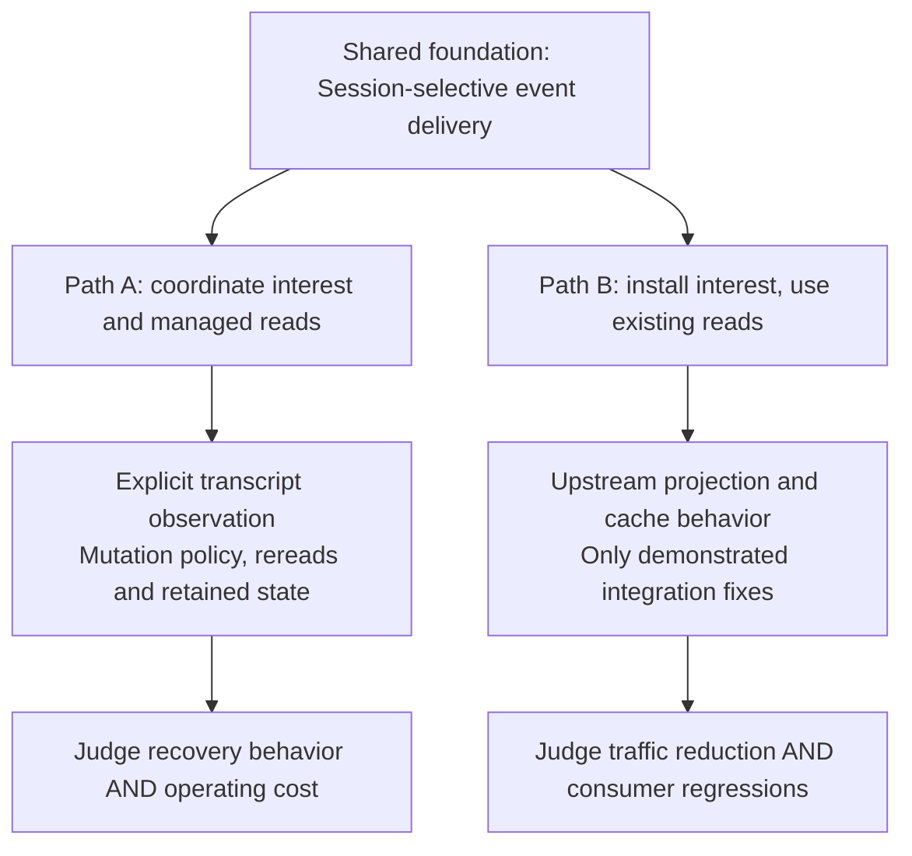

# Two paths for bus-smart

> Delivery revision: [upstream plan 3](/.design/bus-smart/upstream-plan3.gpt6a.md)
> retains the architectural distinction but replaces this revision's test/CLI-first
> sequence with the built indexed feed and full-TUI product. It makes each path's
> read-policy commitments and actual integration dependencies explicit. This
> earlier argument is preserved as history.

## The distinction this revision makes

We have **one implemented downstream system** and **one proposed leaner
extraction**. We have not implemented and benchmarked two independent versions.

The last proposal correctly separated the client expansion from the streaming
goal, but described one side mostly as work to discard. That is insufficient
for deciding what the machinery is worth. This revision describes two coherent
paths, each composed of smaller epics:

- **Path A — Selective streaming with a managed transcript cache.** Make live
  interest, explicitly observed transcript reads, and selected authoritative
  refresh behavior a deliberate client architecture. This explains the larger
  system we actually built, without claiming that all its choices were necessary.
- **Path B — Selective streaming over the existing client.** Reduce irrelevant
  network events while retaining upstream's existing projection, read and cache
  behavior. This is the smaller upstream proposal, not yet a separate implementation.

**They are close in transport logic and farther apart in client policy.** Both
can share Session selection, a controlled stream, typed operations and consumer
interest. Path A additionally owns when a transcript needs a new authoritative
read, how that work continues, what history is retained, and which representation
wins after failures. Path B does not acquire those responsibilities globally.

This is a work-plan revision, not authorization to rewrite history or change
runtime code. Ticket labels are proposed planning IDs, not filed issues.

## At a glance

|                           | Path A: managed transcripts                                                                                 | Path B: selective transport                                                                            |
| ------------------------- | ----------------------------------------------------------------------------------------------------------- | ------------------------------------------------------------------------------------------------------ |
| Main proposition          | Follow live work and manage explicitly observed transcript state across read/event gaps                     | Stop sending irrelevant fragments; otherwise leave the client familiar                                 |
| Status                    | Substantial implementation exists in this branch; product necessity and some policy choices remain disputed | Extraction plan and reusable code exist; no clean implementation or equivalent benchmark yet           |
| New responsibilities      | Event selection **and** observation-owned rereading/reconciliation                                          | Event selection and interest installation                                                              |
| Default-path effect today | Client read changes also run when the streaming experiment is off                                           | Aim for unchanged normal client behavior outside the opt-in, except independently accepted small fixes |
| Primary cost              | More state, HTTP work, mutation-policy maintenance and cache coupling                                       | Protocol/transport integration and changed live-observation start points                               |
| Primary uncertainty       | Do users want the chosen authority/retention behavior enough to justify its cost?                           | Can the intended consumers adopt the smaller feed without new visible regressions?                     |
| Upstream shape            | Several separately justified client and transport epics                                                     | Small transport/consumer epics; no blanket client-repair prerequisite                                  |

The paths need not become competing forks. The shared feed can land first, the
lean consumer can provide value, and individual managed-read features can be
considered later if their behavior is independently wanted. That is an option,
not a plan to gradually smuggle the larger subsystem into the smaller feature.

# 1. The soul of the machinery we built

“Make asynchronous transcript reads safe” names a desirable property. It does
not name the architecture and makes the change sound smaller and more universally
necessary than it is.

A more accurate description is:

> **An explicitly observed transcript cache, updated by live events and refreshed
> from the server when the client decides its displayed state needs reconciliation.**

That cache sits beside a Session-selective event subscription. They cooperate,
but they are different mechanisms.

## Four responsibilities, not one bug fix

| Responsibility                        | What the branch does                                                                                                                                     | What it changes                                                                       |
| ------------------------------------- | -------------------------------------------------------------------------------------------------------------------------------------------------------- | ------------------------------------------------------------------------------------- |
| **Live delivery selection**           | The TUI declares route/open-tab/known-family Sessions; Server gates five live event types                                                                | Which intermediate events reach this client                                           |
| **Transcript adoption**               | Refresh desired interest, wait for installation, then invalidate/read the relevant transcript in focused mode                                            | The sequence by which a reader begins relying on a Session                            |
| **Managed transcript refresh**        | Explicit reads enroll a transcript; relevant durable events invalidate a local version or request repair; a read job and trailing timer pursue that work | Who owns freshness, when HTTP reads occur, and what happens when reads are superseded |
| **Retained state and acknowledgment** | Read through retained history, reconcile accepted canonical rows, acknowledge confirmed optimistic input, reject expired point-read results              | Which rows survive refresh and which source may replace or remove displayed state     |

The [current read owner](/packages/client/src/solid/data.ts#L232-L255) stores
`version`, `complete`, `loaded`, `repair`, `pending`, `timer` and `delay` per
explicitly read transcript. The
[mutation classifier](/packages/client/src/solid/data.ts#L2085-L2143) distinguishes
direct updates, settlement, authoritative repair and metadata. A local version
is not a server offset, and repair is not event replay. It is additional HTTP
work against the server's existing read model.

The [adoption binding](/packages/tui/src/context/event-interest-binding.ts#L41-L53)
joins these responsibilities: subscription installation determines whether the
TUI forces a transcript invalidation before reading. That is a genuine coupling,
not merely two unrelated files that happened to change together.

## Two different meanings of “interested”

The branch has two sets:

1. **Streaming interests:** Session IDs supplied by route, tabs and known families.
2. **Observed transcripts:** Sessions registered by explicit transcript reads,
   retained until the relevant observation lifetime is revoked.

They are not identical. A tab family can be followed before its messages are
read. A recently viewed transcript can remain cached after streaming interest
changes. Session metadata does not establish explicit transcript observation.

Also, this is **not an observed-only projection cache**. Broad durable events
still create and update foreign transcript rows. Observation controls the new
repair work, not every allocation in the data store. Calling the implementation
“only keep data for interested Sessions” would overstate what we built.

## Which parts are policy, rather than mechanical safety?

- Rejecting a response whose target row was evicted is a narrow lifetime rule.
- Replacing displayed failed text with the persisted representation is an
  **authority policy**. Persisted state can contain less text than the live UI.
- Keeping all previously loaded history after reconnect is a **retention policy**,
  with extra page/probe requests, not just avoiding a stale response.
- Continuing a read after transient failure is an **operating policy**: it needs
  request-rate limits, termination rules and a lifetime owner.

Path A can be a legitimate feature if these policies are wanted. It should be
pitched and reviewed as such—not as an unquestionable prerequisite called
“correctness.” Nor is the exact policy currently coded the only possible version
of Path A. For example, a deliberate design could preserve useful failure-time
partial output separately from the persisted representation. That would be a
new policy choice and potentially new implementation work, not a property this
branch already provides.

# 2. What the leaner world would keep and leave alone

Path B keeps the answer to **“which live events should this client receive?”**
without adopting a new global answer to **“when should every observed transcript
be reconstructed from the server?”**

Its contract is intentionally narrower:

> An opted-in client receives the selected Sessions' live fragment/progress
> events from its installed observation point. Remaining public events and
> legacy subscriptions keep their existing behavior. Existing client read and
> display semantics are the baseline, not a subsystem this feature replaces.

This is not a claim that upstream has no races. It is a choice not to undertake
a client synchronization redesign as part of a transport optimization. A new
visible regression caused by filtering still needs a specific fix or blocks
that affected consumer path.

In particular, start with a fixed-Session consumer. The
[noninteractive CLI](/packages/cli/src/run/noninteractive.ts#L27-L74) already knows
its Session ID before subscribing and waits for connection before prompt
admission. It does not use the full TUI's Solid transcript cache. It can establish
a useful first delivery without resolving the whole UI observation question.

For later full-TUI adoption, retain the useful installation barrier. **A barrier
does not imply an automatic repair subsystem.** The lean form can establish
interest before invoking the existing reader, with any necessary cache
invalidation justified by a concrete filtering/adoption case. It need not
replace `createSync`, introduce an observation registry, or establish global
failure-time equality with durable storage.

# 3. How much distance is there, really?

There are three distances: **code extraction**, **behavioral commitment**, and
**evidence still needed**. A small diff can change a large policy; a large test
file can be mostly reusable evidence.

| Piece                                                         | Reuse from the branch                                     | Distance to the lean path                                                 | Implementation direction                                                                                                                  |
| ------------------------------------------------------------- | --------------------------------------------------------- | ------------------------------------------------------------------------- | ----------------------------------------------------------------------------------------------------------------------------------------- |
| Five-type classification and exact Session selection          | High                                                      | Low                                                                       | Keep canonical typed identities; no payload guessing or filter DSL                                                                        |
| Bounded feed, registration and complete interest replacement  | High in behavior/tests                                    | Moderate API review and extraction                                        | Keep one small contract; decide it with upstream rather than exporting every existing option                                              |
| Location profile, derived move holds and routed-audience seam | Historical behavior is implemented                        | Can be excluded from **either** upstream path unless independently wanted | Session-focused selection does not require placement audiences; inspect the existing legacy observation path                              |
| Session recipient index and no-recipient precheck             | High                                                      | Low–moderate, after simpler matching                                      | Separate optimization commits and retain cleanup/output tests                                                                             |
| Controlled Client source                                      | Partial                                                   | Moderate                                                                  | Reuse serialization and generation rules; remove unneeded profile/Location state; avoid importing Solid lifecycle into a fixed CLI helper |
| SharedEvents                                                  | Existing upstream mechanism                               | None intended                                                             | Keep it; sharing and scoping solve different problems                                                                                     |
| TUI Session selector                                          | High                                                      | Low–moderate                                                              | Keep direct IDs, tabs and known families; drop Location computation if the upstream contract does not use it                              |
| TUI adoption binding                                          | Useful ordering idea                                      | Moderate                                                                  | Separate “install interest” from “invalidate/read with a new cache policy”                                                                |
| Transcript observation map/classifier/read jobs/backoff       | A substantial implemented subsystem                       | **High semantic difference**, not needed by definition in Path B          | Treat as a separate Path A product proposal; do not partially delete it in place and assume existing reads work                           |
| Historical pagination and terminal authority                  | Tests and implementation exist                            | **Product-policy difference**                                             | Choose behavior explicitly; retaining upstream's current policy is not automatically a bug                                                |
| Narrow point-read/acknowledgment fixes                        | Some useful isolated candidates                           | Low–moderate if reproduced upstream                                       | Extract independently; do not take their surrounding new scheduler as a dependency                                                        |
| Performance evidence                                          | Demonstrates filtering in an earlier branch configuration | Lean and final mixed-workload comparisons missing                         | Reuse the harness, not a conclusion about which cache implementation is required                                                          |

**The practical answer:** getting the same server selection into a smaller
upstream patch looks substantially closer than rebuilding an entirely different
system. Getting a lean **full TUI** with verified behavior is real integration
work, not a trivial deletion exercise. We have not yet demonstrated how much
of that integration actually needs changes beyond the transport barrier.

The existing client read/cache changes are unconditional. Turning off the
streaming experiment does not produce a Path B implementation. Conversely,
keeping the new observation map but deleting its classifier or timer does not
restore upstream ownership. Compare from a clean upstream base when extraction
is authorized; do not create a half-removed state machine in this workspace.

# 4. Planning conventions

The following are composite epics and constituent tickets, not one PR per epic.

- **P1:** foundational or required **within the selected path**; not a production
  emergency and not a reason the other path must depend on it.
- **P2:** useful next work after the named need/dependency is established.
- **P3:** conditional follow-up or parked until evidence justifies it.
- **Complexity S/M/L:** local change / interacting paths / state or product-policy
  change, including extraction and tests. No timeframe is implied.
- **Impact:** expected user or maintenance value, distinct from test counts.

The previous [revision's concern ledger](/.design/bus-smart/upstream-plan1.gpt6a.md#epic-a--disentangle-clientstate-work-and-extract-small-proven-fixes)
remains the detailed accounting of inherited issues, intentional expansions and
repairs of our own machinery. This revision organizes possible destinations; it
does not turn every ledger item into required work.

# 5. Shared epic — Session-selective transport

This is the common implementation foundation of both paths. Build it once,
without depending on the managed transcript cache.

| Ticket | Deliverable                                                                         | Priority | Complexity | Impact                                                             | Direction / boundary                                                                                                  |
| ------ | ----------------------------------------------------------------------------------- | -------- | ---------- | ------------------------------------------------------------------ | --------------------------------------------------------------------------------------------------------------------- |
| T1     | Portable upstream-baseline fanout reproduction and sampled counters                 | P1       | S–M        | Establishes which events and processes consume work                | Package-owned small harness; separate stream, broad event and HTTP costs; no general metrics platform                 |
| T2     | One opt-in Session-focused feed, complete interest replacement, generated accessors | P1       | M          | Removes foreign fragment delivery for explicit consumers           | Correct scan first; broad remaining events; existing legacy signature unchanged; no old Location profile prerequisite |
| T3     | Fixed-Session noninteractive CLI adoption                                           | P1       | S–M        | First end-to-end useful reduction for concurrent command-line runs | One initial installation; preserve text/JSON/tool/permission/form behavior; no Solid read-owner dependency            |
| T4     | Headless changing-interest helper over the same operation                           | P2       | M          | Supports persistent consumers without a socket per interest change | One writer/update in flight and attachment identity; existing reconnect owner; no interest-contribution registry      |
| T5     | Focused recipient index                                                             | P2       | M          | Reduces matching overhead for many disjoint followers              | Follow T2's correct scan; prove cleanup and output parity; actual receiving clients still cost work                   |
| T6     | Conservative zero-recipient encoding skip                                           | P3       | S–M        | Saves encoding only for events no client needs                     | Depends on cheap complete recipient knowledge; measure the union of all interests, not one client's disinterest       |

**First useful milestone:** T1 → T2 → T3. Maintainers can stop here with a real
consumer and a measurable optimization. T2/T3 can be a small paired submission
if an API without an in-tree consumer is unwelcome; that does not justify
folding the full TUI or cache work into them.

T4 should be justified by the actual second consumer. A minimal fixed-Session
caller need not adopt all 437 lines of the current Solid-controlled source.
Reuse its important rules, not necessarily its factory, stores and hooks.

# 6. Path A work plan — a deliberate managed-transcript client

Path A includes the shared transport epic plus the following three composite
epics. The point is to make the larger feature understandable and optional,
not to relabel the full corrective stack as a small bug fix.

## Epic A1 — Explicit transcript observation and refresh policy

**Value:** readers can establish a transcript observation whose refresh behavior
is owned and predictable, rather than incidental to individual event handlers.

| Ticket | Deliverable                                                                     | Priority | Complexity | Impact                                                                  | Driver / risk                                                                                                        |
| ------ | ------------------------------------------------------------------------------- | -------- | ---------- | ----------------------------------------------------------------------- | -------------------------------------------------------------------------------------------------------------------- |
| A1.1   | Decide displayed-state authority at adoption, successful completion and failure | P1       | M          | Establishes the actual product benefit before imposing a cache policy   | Specify partial-output behavior with examples; durable equality is not intrinsically preferable                      |
| A1.2   | One explicit transcript read owner, preserving creation and eviction lifetimes  | P1       | L          | Gives selected readers a place to own pending reads and freshness       | Cache migration affects legacy operation; move existing completion/creation semantics coherently, not piece by piece |
| A1.3   | Reject superseded snapshot publication without automatic read pursuit           | P1       | M          | Prevents old HTTP responses overriding newer owned state                | Independently testable capability; do not claim eventual repair from rejection alone                                 |
| A1.4   | Selected mutation-triggered refresh with a bounded outstanding repair episode   | P2       | L          | Provides the chosen A1.1 recovery behavior after observed gaps/failures | New HTTP work, classifier maintenance, backoff and terminal-error policy; requires explicit value and cost evidence  |

**Implementation coaching:** begin with the authority examples, not with a new
map or exhaustive event taxonomy. Define what a reader needs to see after a
late snapshot or failed model call. Then introduce the smallest state needed
to own those decisions. Keep read ownership and its cleanup together. A
separate module is useful only if it owns a real operation/lifetime, not if it
becomes a bag of callbacks into `data.ts`.

A1.3 can be delivered before A1.4 if it offers a wanted local improvement.
Automatic persistence of a repair request, retry backoff, and declared-absence
handling belong together when A1.4 is chosen. Repairs of that new machinery
are part of making A1.4 work—not independent upstream features.

The current 43-event classifier is one implementation of A1.4. Keep an explicit
maintenance check if retaining it, but first narrow the policy to events that
really require another read. Metadata freshness, direct live projection and
transcript rereading must not become the same operation.

## Epic A2 — Retained history and confirmed-input ownership

**Value:** make clear what a managed refresh is allowed to replace, retain or
retract. This is more than making an HTTP callback safe.

| Ticket | Deliverable                                                                        | Priority | Complexity          | Impact                                                  | Driver / risk                                                                                                 |
| ------ | ---------------------------------------------------------------------------------- | -------- | ------------------- | ------------------------------------------------------- | ------------------------------------------------------------------------------------------------------------- |
| A2.1   | Choose reconnect retention: latest window or previously loaded historical boundary | P1       | M                   | Defines what users keep while browsing older history    | Previous behavior may be intentional; wider retention increases page/probe work                               |
| A2.2   | Implement historical-boundary preservation if selected                             | P2       | L                   | Preserves a user's loaded history across offline growth | Deleted anchors, opaque cursors and exhausted history can multiply HTTP reads; independent of event filtering |
| A2.3   | Canonical confirmation prevents rollback of already-confirmed optimistic input     | P2       | M                   | Protects a confirmed message during a late POST failure | Can be extracted independently if reproduced upstream; must retain unconfirmed rollback                       |
| A2.4   | Lifetime checks for pending and point reads                                        | P2       | S–M per read family | Prevents an old read recreating expired state           | Prefer existing row/request ownership; do not turn a few read paths into a new global request framework       |

**Implementation coaching:** keep A2.2 out if users do not want its retention
policy. Do not fetch history to prove a stronger invariant nobody selected.
A2.3/A2.4 may be useful small fixes under either path; their value does not
depend on accepting A1's scheduler. Preserve that independence in PRs.

## Epic A3 — Coordinate UI interest and observed reads; prove operating cost

**Value:** connect the richer client architecture to actual readers and make
the ongoing cost visible.

| Ticket | Deliverable                                                                                   | Priority | Complexity | Impact                                                             | Driver / risk                                                                                      |
| ------ | --------------------------------------------------------------------------------------------- | -------- | ---------- | ------------------------------------------------------------------ | -------------------------------------------------------------------------------------------------- |
| A3.1   | Define the relationship between streaming interests, explicit reads and retained rows         | P1       | M          | Prevents conflicting ownership and accidental enrollment           | Do not force three different concepts into one “tracked Session” boolean                           |
| A3.2   | Shared adoption operation for visible/hidden readers using the selected cache policy          | P1       | M          | Establishes interest before a managed reader relies on the stream  | Requires T4 and the chosen read owner; avoid reliance on reactive-effect ordering                  |
| A3.3   | Explicit activation/rollout scope for the read subsystem, separate from the transport toggle  | P1       | M          | Makes default-path behavior and rollback boundaries understandable | Current experiment flag does not gate Client repair; do not present it as containment              |
| A3.4   | Mixed workload comparison including metadata, failed reads, retained pages and repair traffic | P1       | M          | Shows whether the added recovery behavior earns its cost           | Delta-only CPU results cannot justify A1/A2; normal interaction and partial-output behavior matter |

**High-level delivery order:** agree A1.1/A2.1 → deliver observation and local
snapshot ownership → add only the selected refresh/retention behaviors → integrate
actual readers → assess mixed-workload cost and default behavior. Shared T1–T3
can deliver value independently while these policy decisions are discussed.

**Stop point:** if the authority or retention policy is not wanted, do not keep
building Path A merely because code exists. Keep useful isolated fixes and
continue with the shared transport work.

# 7. Path B work plan — smaller changes with an early useful consumer

Path B is the shared transport work arranged into an incremental delivery route,
plus a narrower TUI adoption epic. It does not need a preliminary client-cache PR.

## Epic B1 — Fixed-Session streaming as the first product slice

**Constituent tickets:** T1, T2, T3, with their priorities/complexity/impact above.

**Value:** fewer unrelated fragments for real concurrent command-line runs,
without tab state, transcript cache migration, history retention or new failure
display rules. This gives upstream a concrete consumer and a clean before/after
story before asking it to accept the full TUI integration.

**Coaching:** resist adding mutable local policy, grace timers or a UI-facing
control abstraction to the fixed caller. It needs a correct initial subscription
and existing teardown. Keep the server replacement operation future-capable
without implementing an unused client manager around it.

## Epic B2 — Changing-interest TUI over existing read semantics

**Value:** bring the same network reduction to open tabs and known Session
families while keeping normal upstream client behavior as the starting point.

| Ticket | Deliverable                                                                           | Priority     | Complexity | Impact                                                                              | Driver / risk                                                                                                              |
| ------ | ------------------------------------------------------------------------------------- | ------------ | ---------- | ----------------------------------------------------------------------------------- | -------------------------------------------------------------------------------------------------------------------------- |
| B2.1   | T4's headless interest helper adapted to the existing TUI connection                  | P1 within B2 | M          | Installs changing interest without a new socket for every tab change                | Reuse one retry owner and upstream sharing; do not import Path A's read scheduler                                          |
| B2.2   | Pure desired-Session selection for route, tabs and known families                     | P1 within B2 | S–M        | Follows the work a user actually has open, including hidden family members          | Direct IDs must survive incomplete family metadata; notification events remain broad                                       |
| B2.3   | Interest-installation barrier at actual reader/prompt use sites                       | P1 within B2 | M          | Prevents actions relying on interest that has not yet applied                       | Barrier and cache replacement are separable; preserve existing reads unless a specific new gap requires local invalidation |
| B2.4   | Small default-off experiment and delivery/fallback visibility                         | P1 within B2 | S–M        | Allows intentional evaluation without default behavior change                       | Startup-only enablement is acceptable first; hot toggling and generic pause/wake APIs are not prerequisites                |
| B2.5   | Consumer comparison against upstream for navigation, late join, children and failures | P1 within B2 | M          | Finds actual filtering-induced regressions and establishes the observation contract | Do not choose a new canonical-equality oracle merely to make a test precise; expected UI behavior needs justification      |

**Implementation coaching:** initially allow `data.ts` to remain upstream's
implementation. Compose the selected stream with its existing emitter and reader.
If a regression appears, identify whether the cause is an incorrectly installed
interest, newly missed pre-observation data, or an inherited snapshot issue.
Those have different fixes. Name a specific A candidate only when its independent
reproduction and the affected consumer demonstrate the dependency.

Do not solve an adoption problem by automatically enrolling every transcript
in persistent repair. A narrow invalidation or a small lifetime guard may be
sufficient. Equally, do not assume no changes will be needed: the lean full-TUI
configuration has not yet been tested on a clean upstream client.

## Epic B3 — Matching efficiency and evidence-based graduation

**Constituent work:** T5 and optionally T6, plus the following ticket.

| Ticket | Deliverable                                                  | Priority | Complexity | Impact                                                              | Driver / risk                                                                                                 |
| ------ | ------------------------------------------------------------ | -------- | ---------- | ------------------------------------------------------------------- | ------------------------------------------------------------------------------------------------------------- |
| B3.1   | Representative acceptance and a separate default-on decision | P2       | M          | Establishes whether the smaller feature helps real multi-client use | Include broad RPC/terminal bytes, metadata/HTTP load and foreground latency; preserve working legacy fallback |

**High-level delivery order:** upstream baseline → focused Server capability →
fixed CLI consumer → changing-interest helper → small TUI experiment → measured
matching optimizations and graduation. T5 can proceed after the correct Server
scan without waiting for full-TUI adoption; T6 should not block anything.

**Stop points:** B1 is useful on its own. B2 can remain experimental if late-join
semantics or user acceptance are unresolved. Neither forces a move into Path A.

# 8. Making the choice with evidence, not the size of the existing investment

The most useful comparison separates **transport selection** from **client
refresh policy**. For the full-TUI workload, use a small four-case experiment:

| Case | Client read behavior                                  | Feed             | What the comparison answers                              |
| ---- | ----------------------------------------------------- | ---------------- | -------------------------------------------------------- |
| U/G  | Current chosen upstream base                          | Global           | Normal baseline                                          |
| U/S  | Same upstream reads plus minimal adoption integration | Session-selected | The value and regressions of Path B                      |
| R/G  | Chosen managed-read implementation                    | Global           | The independent behavior/cost of Path A's read subsystem |
| R/S  | Same managed reads                                    | Session-selected | Combined behavior, including interactions                |

These are comparison configurations, not four new product modes. The existing
benchmark compared transport modes using an earlier common branch client; it
does **not** supply this full matrix or measure all final repair costs.

Test the cases that distinguish policies, not just token-heavy steady state:

- Same-Location foreign streaming, with one/all Sessions followed.
- Open a running Session midway through a part, then let it complete or fail.
- A captured HTTP response arriving before and after a terminal event.
- Reconnect after offline growth while older history is visible.
- Child creation, optimistic input confirmation, and a chatty public RPC emitter.

Count received events/bytes, total and per-process CPU, metadata/repair requests,
and foreground response. Also record **what the user sees**: retained partial
text, historical rows and pending state. A lower CPU number obtained by changing
the display contract is not automatically the same feature delivered faster.

The questions to answer are:

1. Does U/S deliver most of the desired CPU improvement without new visible
   regressions? If yes, Path B is a strong upstream starting point.
2. Does R/G offer an independently wanted interaction/recovery improvement?
   If not, do not justify the read subsystem with R/S's filtering result.
3. Where U/S has a failure, is a narrow fix enough, or is managed reconciliation
   genuinely needed for that use case? Do not assume the answer in advance.
4. Does the chosen Path A policy preserve useful transient information, or
   intentionally replace it? Agreement on that behavior precedes graduation.

# 9. Recommended direction and practical extraction rules

**For the upstream performance effort, start with Path B's shared transport and
fixed consumer. Treat Path A as a separate possible client product improvement,
not either mandatory infrastructure or worthless code.** Its usefulness depends
on chosen behavior and measured cost, not the number of counterexamples repaired.

Implementation direction:

1. **Reuse the important semantics and tests.** Keep exact Session selection,
   complete replacement, bounded queue behavior and attachment identity. Do not
   copy the whole branch merely because these pieces coexist there.
2. **Remove historical options from the initial API proposal.** Neither path's
   essential idea requires downstream Location-profile compatibility. A smaller
   contract reduces Server, Client, generation and review surface together.
3. **Keep transport and read ownership separable.** Even under Path A, callers
   should not need the managed transcript cache to use the focused feed. Under
   Path B, interest installation should not silently select a new cache policy.
4. **Make the first client integration independent of Solid.** Fixed CLI usage
   is a reason to keep transport setup headless. A TUI adapter can expose reactive
   state later; do not make the CLI construct a UI provider to filter events.
5. **Use one policy owner per concern, not one owner for everything.** Streaming
   interest, explicit transcript observation and retained-history preference are
   related but not interchangeable. Document the transitions between them.
6. **Bundle necessary internal fixes with the feature that created their need.**
   Backoff termination fixes belong with automatic repair if adopted. A confirmed
   inherited point-read bug can be independent. Do not pitch every corrective
   commit as a new upstream feature.
7. **Build an extraction on a verified upstream base when authorized.** This
   avoids inheriting unconditional cache changes through the current branch's
   ancestry. Preserve the branch as source/evidence; no in-place rollback is
   implied by this planning document.

### Upstream pitches should name the different value

**Path B:**

> Reduce live fragments delivered to clients following other Sessions. Keep
> existing subscriptions and client read semantics. Start with concurrent
> command-line runs, then add opt-in multi-Session TUI interest.

**Path A's additional client work:**

> Introduce explicit transcript observation and a selected refresh policy for
> readers crossing asynchronous event/read gaps. Agree how partial output and
> loaded history should behave, then deliver the cache ownership, refresh and
> lifecycle pieces separately with their HTTP costs visible.

The second pitch is larger because the feature is larger. Calling it “make
async reads safe” does not remove that size; it only obscures the decision.

# 10. Relationship to earlier documents

- [Revision 1](/.design/bus-smart/upstream-plan1.gpt6a.md) remains the detailed
  concern ledger, provenance accounting and initial lean ticket sequence. Its
  argument rejects a blanket client-repair prerequisite; this revision adds a positive description
  and composite work plan for the managed-client path as well.
- [draft1 architecture](/.design/bus-smart/draft1.gpt6a.md) and
  [implementation1](/.design/bus-smart/implementation1.gpt6a.md) describe the
  larger branch's intended mechanisms. They are source material for Path A,
  not proof that Path B requires all of them.
- [Implementation and measurements](/.design/bus-smart/implementation-report1.gpt6a.md)
  establish what was exercised, including the canonical-empty failure fixture.
  This revision distinguishes a test's chosen oracle from an agreed product policy.
- [Corrections 1](/.design/bus-smart/implementation-review-fixes1.gpt6a.md),
  [2](/.design/bus-smart/implementation-review-fixes2.gpt6a.md), and
  [3](/.design/bus-smart/implementation-review-fixes3.gpt6a.md) trace the actual
  ownership/scheduling/retention changes. They are useful for extraction and
  risk analysis, not a sequence of mandatory upstream PRs.
- [Closeout](/.design/bus-smart/closeout1.gpt6a.md) records review closure of the
  implemented system. [Index](/.design/bus-smart/index.md) navigates the full
  history. No lean extraction, new benchmark result or upstream acceptance is
  claimed by this revision.
