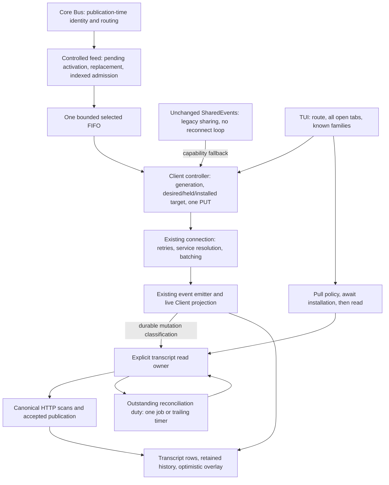
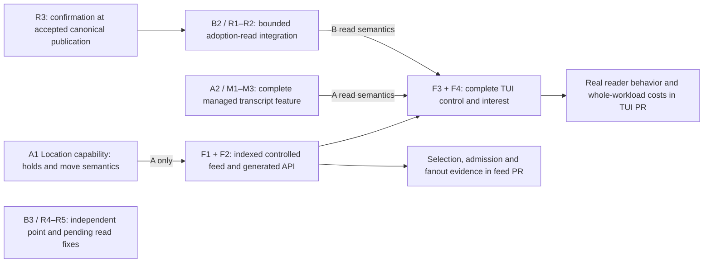

# Ship the architecture, separate the commitments

## 1. Direction

**Deliver Session-selective streaming to the full TUI. Package the managed
transcript subsystem as a substantive client capability, not as a universal
prerequisite for reducing event fanout.** The server, controller, indexed
admission, route/tab/family policy and real-reader integration already exist.
They are the starting assets, not an eventual destination after a smaller toy.

This revision is by a **fresh Astra session**, using the prior Astra assessment,
implementation record and current source. It does not claim authorship of those
earlier documents. Runtime implementation and review corrections are committed;
this pass changes documentation only.

The user has rejected test-only-first delivery, a forced CLI-first route, and
decomposition that postpones the actual architecture while shipping temporary
scaffolding. The original problem remains many-client event-fanout CPU, not a
mandate to replace ordinary Client caching. Upstream has already rejected large
patches, according to the user; no linked rejection discussions were supplied,
so no maintainer motives are inferred here.

There are two real paths:

| Path | Chosen destination | Priority | Complexity | Impact |
| --- | --- | --- | --- | --- |
| **A — Integrated observation** | Deliver the built dual-profile feed and full-TUI interest together with explicitly managed, canonically reconciled transcript views. Keep its selected history and failure policies. | P1 when choosing this client product | L: extraction and cross-package review; runtime already exists | Streaming savings plus automatic recovery and retained browsing history |
| **B — Full-TUI streaming extraction** | Deliver the same full-TUI interest/control architecture with Session-streaming scope, existing cache/display policy, and bounded read-publication protection at adoption. No persistent transcript repair service. | **P1 recommendation for the original upstream CPU effort** | M–L: substantial reuse, but the read integration is a real extraction | The intended many-terminal streaming reduction without the unconditional reconciliation commitment |

**Choose B for the performance submission; retain A as the coherent integrated
design and a separately deliverable client proposal.** B is not “A, eventually.”
A is not a collection of embarrassing fixes to dismantle. The difference is
which responsibilities the product takes on, not whether it gets a real TUI.

These are **extraction variants of one architecture, not rival systems**. The
axes are independent: delivery scope (Session-streaming versus also Location
observation) and read policy (bounded requested reads versus persistent managed
reconciliation). A and B choose concrete combinations; accepting managed reads
does not technically require Location mode, and retaining Location mode does
not require managed reads. Those independent seams are the useful decomposition.

Both paths include composite epics below. Tests, workload evidence, generated
clients and real callers travel with features. No first PR is merely a benchmark,
an empty read owner, a classifier list, or a future-consumer abstraction.

## 2. The architecture that is actually built

### Transport: intentional selection, not a second event platform

- The [Protocol contract](/packages/protocol/src/groups/event.ts) negotiates
  `location` and `session-streaming`. The latter gates exactly text delta,
  reasoning delta, tool-input delta, tool progress and compaction delta by the
  **Bus-classified Session ID**. Every other public type, including public RPC,
  remains broad. Internal events remain excluded. This is not authorization.
- The [Server owner](/packages/server/src/controlled-event-feed.ts) registers a
  ready-only pending subscription. First complete-interest PUT activates it and
  queues `server.connected`; subsequent PUTs replace interest without a new
  connection boundary. One admission cut owns membership and queue offers.
- Indexed followers and the conservative zero-recipient encoder precheck are
  **implemented optimizations with recorded measurements**. Do not remove them
  to recreate a scan-first milestone. Review their commits separately inside
  the functional delivery if that helps explain the invariant.
- The [Client controller](/packages/client/src/solid/controlled-event-feed.ts)
  owns one generation, one serial PUT drain, desired/held/installed sets and
  cancellable installation waiters. The
  [connection](/packages/client/src/solid/connection.ts) remains the sole retry
  owner, including invalid-target pause and event-only restart. SharedEvents
  continues to own shared legacy readers, not reconnection.
- `flush()` acknowledges the current installed target. It does not drain old
  queued events, recover missed fragments or fence an HTTP snapshot. Failed
  indeterminate control abandons the attachment identity; it is not retried as
  a command against an ambiguously updated subscription.

### Client: the soul is an observed view with an outstanding duty

The important new Client abstraction is **not an HTTP race guard**. It is a
transcript view whose owner remembers that canonical reconciliation is still
owed after an individual read has ended.

The [entry in `data.ts`](/packages/client/src/solid/data.ts#L232-L254) owns local
version, completion/load state, repair duty, pending job, timer and backoff.
Explicit `message.sync` enrolls the transcript. Its owner survives individual
reads; eviction, deletion or disposal revokes it. The
[43-event classification](/packages/client/src/solid/data.ts#L2085-L2143)
distinguishes ordinary direct mutation, direct settlement, authoritative repair
and no transcript change. A GET beginning is not fulfillment: only an accepted,
unchanged-version scan clears duty.

That yields four concrete product behaviors:

1. **Owned snapshot publication.** Obsolete reads cannot replace newer durable
   state or resurrect a revoked observation. Creation and load-more share the
   actual owner rather than retaining ineffective old cache-completion guards.
2. **Automatic reconciliation.** Qualifying events can require a fresh canonical
   view even when no GET was pending. Two scans bound one caller job; an unfulfilled
   duty survives it and continues through one trailing timer with capped backoff.
3. **Retained browsing extent.** Refresh reconstructs through the oldest surviving
   retained canonical row, or to exhaustion for a previously exhausted history.
   It does not simply replace the display with another latest page.
4. **Confirmed local state.** Accepted canonical input acknowledges matching
   optimistic admission; a late failed POST cannot retract that confirmed row.
   Separate pending and point reads retain their own publication-lifetime rules.

This is a coherent read model, and an additional operating responsibility.
It runs **unconditionally with either transport**, not just when
`experimental.session_streaming` is enabled. The stream flag does not provide
rollback or containment for the read subsystem.

Three sets must remain distinct: **streamed Sessions**, **explicitly observed
transcripts**, and **materialized rows**. A followed child need not have an
explicit read; an observed cached transcript can outlive its streaming interest;
broad `step.started` can still create foreign rows. Observation controls repair,
not all cache residency. Retention includes all open-tab roots/families plus
recent non-tab roots and the current root—not a four-transcript ceiling.

## 3. Product commitments, real dependencies, and optional scope

### Where the paths intentionally differ

| Concern | A: integrated observation | B: full-TUI streaming extraction |
| --- | --- | --- |
| Streaming consumer | Current route, all open tabs and known families; direct IDs survive incomplete metadata | **The same consumer and fidelity policy**, not visible-only or CLI-only |
| Subscription lifecycle | Current negotiated control/retry/installation machinery | Reuse it, including hot toggles and rejection recovery; no headless rewrite prerequisite |
| Read ownership | Explicit observation replaces transcript `createSync` ownership | `createSync` continues to own cache completion; request-scoped publication fences protect active reads |
| Refresh extent | Retain previously loaded canonical history | Preserve upstream latest-window refresh and existing load-more behavior |
| Failed live partial text | Accepted reconciliation uses canonical persisted content, which may be shorter or empty | No terminal-triggered read solely to erase a live suffix; ordinary explicit refresh can still replace it |
| Continuing repair | Persist duty across stale/failed scans; bounded-rate automatic work | Bounded work for a requested read; incomplete work stays retryable, with no event-independent pursuit |
| Durable mutation taxonomy | Maintain the audited exhaustive policy because A makes canonical-refresh commitments | Fence active reads without importing A's authoritative-refresh taxonomy or enrolling complete caches |
| Location-profile API | Retain its complete implemented placement-observation capability | Exclude it from the performance extraction; Session placement is not its observation scope |

The failure-text distinction is deliberate. A's canonical-empty fixture proves
that its implementation follows its chosen authority policy. It does not prove
that preserving useful partial output in B is “upstream unsafe.” Neither path
can reconstruct an ephemeral prefix that was never delivered or persisted.

### Dependencies that cannot be wished away

| Dependency | Why it is real | What it does **not** require |
| --- | --- | --- |
| Full TUI → synchronous policy pull and installation barrier | Reactive effect ordering does not establish the newly requested route/tab set before a reader or first prompt relies on it | A transcript registry or canonical failure policy |
| Filtered adoption → fresh read eligibility | Upstream's completion key may describe a cache assembled while that Session's fragments were deliberately absent | Refreshing every complete observed cache on every terminal event |
| Fresh read → publication ownership | A running snapshot can return after `text.ended`/`step.ended`, overwriting the completed row with no later event | Persistent retry duty, retained-history scans or an exact SSE/snapshot watermark |
| Snapshot replacement → creation/outbox/load-more coordination | Forced reads can bypass optimistic-create completion; accepted input and pagination share the rows being replaced | A general request framework or migration of metadata/permission/form reads |
| A's canonical guarantee → classifier, duty and scheduler together | A terminal-triggered repair can be invalidated by a later ordinary admission; two discarded scans do not fulfill it | A global lifetime GET bound, replay, or guaranteed success during permanent failure |
| A's retained extent → point probes and opaque-cursor pages | Public IDs are not Server sequence order; deleted anchors must be handled without splicing stale history | A new pagination protocol or retained-history policy in B |

The [actual adoption operation](/packages/tui/src/context/event-interest-binding.ts#L41-L53)
already separates the installation barrier from the `invalidate`/`sync` calls.
It depends on the **meaning of those calls**, not specifically on the current
`transcripts` map. Conversely, the current
[load-more fence](/packages/client/src/solid/data.ts#L1746-L1827) really does
reference that map. Copying it after removing the owner would be a broken
extraction. B must adapt ownership at the read boundary, not pretend `data.ts`
is untouched or partially delete A in place.

### Location observation and the routed Bus seam are different decisions

**Location profile:** its use case is an API consumer intentionally observing a
workspace/project's public activity, including non-Session permission/form/RPC
events, while following selected Sessions across moves. That is a different
product from the TUI's server-wide notification eligibility. A keeps it as a
complete API capability, with requested Locations, exact Session additions and
derived destination holds. B excludes that capability, so it also excludes its
Location selection state, grace-held Location membership, profile switching and
move-hold maintenance. It does not pretend to offer project-scoped observation
through an exact-Session set. No in-tree Location-only consumer is invented to
justify it. Keep the existing wire shape for interoperability, including sending
`locations: []` in B; an empty compatibility field is not a Location-routing owner.

**Routed observation:** retain the existing `Bus.observeRouted` integration in
both paths. The historical upstream base `2960c61f` already had publication-time
route preparation and a route snapshot for local subscriptions; this branch
exposes an awaited observer with authoritative native Session identity. It is
not necessary to rebuild that owner as a new Core routing project. Nor does
removing Location-profile delivery require removing the useful observation seam.
The [current notification order](/packages/core/src/bus.ts#L537-L549) admits routed
observation before the ordinary listeners/pubsub publication completes.

B **could** derive the five native IDs in an ordinary listener, but that is a
different integration with duplicated classification and a different failure
boundary. It is not a required simplification. Keep the existing narrow seam
and its focused evidence with the feed PR; do not market an unused observer API
as its own preparatory PR. A's protected move notification/derived-hold behavior
stays with A's Location capability; B makes no Location-handoff promise.

## 4. Delivery units and shared implementation

**P1** means required in the selected path; **P2** is independently useful but
does not block the streaming delivery. **S/M/L** estimates extraction and review
complexity, not elapsed time. These are local work labels, not filed tickets.

The following feature commits are reusable in both paths. An epic can have more
than one commit; a commit is not automatically a separate upstream PR.

| Unit | Substantive feature commit | Priority | Complexity | Impact | Motivation / risk |
| --- | --- | --- | --- | --- | --- |
| **F1** | Controlled Session-streaming feed: Bus integration, complete replacement/activation, Protocol, handlers and generated Promise/Effect clients | P1 | M–L | Usable selected delivery for API clients, with broad residual events and unchanged legacy subscription | One coherent public capability; contract and implementation must land together |
| **F2** | Indexed focused admission and conservative no-recipient encoding | P1 | M | Avoid visits to unrelated followers; avoid encoding when the controlled feed has no eligible arm | Transfer the final implemented algorithm, including removal/overflow/failure cleanup; no stale recipient list across an await |
| **F3** | Controlled source and connection-owned recovery | P1 | M | Changing interests, safe fallback, rejected-target pause and explicit retry without reconnect storms | Keep generation/error identity, serialized PUTs and existing SharedEvents composition together |
| **F4** | Full-TUI policy and real-use integration: route/tabs/known families, prompt gate, visible/hidden adoption, experiment and diagnostics | P1 | M–L | Delivers the optimization to the user's actual many-terminal workflow | Requires the chosen A or B read semantics; metadata-only gating is insufficient |

**PR boundary 1: F1 + F2 — indexed controlled delivery.** This is a functional
server/API product, not a future-use scaffold. Include exact selection, activation,
cleanup, mixed legacy behavior and the existing performance harness/result
provenance. Protocol-only and generated-only commits may aid review but are not
independent releases. There is no reason to submit a new unindexed implementation
and make upstream wait for the algorithm already built.

**PR boundary 2: F3 + F4 + the selected read integration — full-TUI adoption.**
Keep controller/connection and TUI changes as readable commits in one consumer
series, not a new headless manager PR waiting for a future caller. The current
Solid adapter is already the appropriate consumer seam. Hot toggling is small,
implemented event-owner integration; discarding it for a temporary startup-only
switch buys little and creates another behavior to replace.

These two review boundaries can be presented together as one end-to-end program.
Neither requires a preliminary CLI implementation or a measurement-only merge.
Noninteractive CLI adoption is a valid separate consumer expansion, **not on the
critical path** and not part of the requested performance delivery plan.

## 5. Path A — deliver the integrated observation architecture

A chooses the built Client's canonical authority, retained-history and retry
policies as product behavior. It does not reopen them as an interview. Its
meaningful extra upstream request is an explicitly managed transcript view.

### Composite epics

| Epic | Constituents / deliverable | Priority | Complexity | Impact | Motivation / risk |
| --- | --- | --- | --- | --- | --- |
| **A1 — Controlled live observation** | F1 + F2, including both profiles and the existing routed/move-hold semantics | P1 | M–L | Indexed Session streaming and intentionally Location-scoped API observation | Carry both actual contracts; Location mode is not a notification-safe substitute for focused mode |
| **A2 — Managed transcript views** | M1 + M2 + M3 below; complete read-owner replacement and canonical recovery through existing `message.sync` callers | P1 | L | Recover explicitly read views across stale reads/failures without losing their retained extent or confirmed input | Largest semantic/carry change; unconditional on transport, with autonomous HTTP costs |
| **A3 — TUI observation coordination** | F3 + F4 using A2's existing invalidation/read semantics | P1 | M–L | One policy/adoption operation for foreground, hidden tabs and first execution | Keep transport interest distinct from repair ownership; do not remount data to toggle the stream |

### A2's substantive feature commits

| Unit | Deliverable | Priority | Complexity | Impact | Required implementation discipline |
| --- | --- | --- | --- | --- | --- |
| **M1 — Owned canonical reads and retained history** | Transfer explicit read identity/version, creation gate, accepted publication, retained-boundary scan and coordinated load-more | P1 | L | Requested refresh cannot overwrite newer durable state or discard previously loaded canonical history | This is a working read operation, not a map-only refactor. Include probe/page identity checks and opaque-cursor handling |
| **M2 — Event-driven canonical recovery** | Transfer the exhaustive mutation policy, persistent repair duty, two-scan jobs, automatic coalescing, backoff, disconnect and declared-absence policy | P1 | L | Reconciliation remains owed after stale or failed attempts, including when no later event arrives | Duty, scheduling and termination ship together; the review corrections are part of this feature, not follow-up bug PRs |
| **M3 — Confirmed input and adjacent read ownership** | Accepted-scan canonical acknowledgment, pending-read/revert fencing, model-selection row-lifetime checks and the corrected direct fields | P1 for the integrated reader | M | Canonical refresh cannot retract confirmed input, restore reverted pending rows or enrich a revoked model row | Preserve unconfirmed rollback and first-admission payloads; no new outbox, tombstone or request registry |

**Package A2 as one coherent client feature with these review commits.** Its
existing callers already obtain the new behavior on the legacy feed, so it has
independent value before A3. Do not ship an intermediate reader that temporarily
loses history, bypasses creation or drops unfinished repair duty. Commit order
explains internal concerns; it does not impose such an intermediate product.

M3 contains some independently extractable inherited fixes. Under A they remain
present at the final accepted-scan/lifetime cuts; under B they can be submitted
separately as described below. A timer's absence-termination fix is **not** an
independent benefit to a client that has no timer.

**Implementation coaching:** transplant the final corrected subsystem, not the
early `be3c593a` cache migration plus a long rediscovery of its fixes. Keep the
read operation local to the message domain in `data.ts`; extracting a callback bag
into another file is not architectural improvement. Preserve the 43-event audit
because A deliberately owns those semantics. Do not conflate metadata freshness
with transcript reconstruction, or change the successful known-input delivery
fast path back into an unconditional GET.

A's operational contract remains qualified: two scans per job, not two GETs;
one job or timer per observation, not a global constant workload; convergence
after relevant durable activity settles and a fresh accepted read succeeds.
Declared Session absence ends an episode without deleting user-visible state.
This does not guarantee an atomic snapshot across pages or recover live prefixes.

## 6. Path B — deliver full-TUI streaming without managed transcript policy

B keeps the transport architecture and the complete TUI consumer. It changes
the read implementation boundary, not the ambition of the streaming feature.
The extraction starts from the chosen V2 upstream base; disabling this branch's
experiment does **not** produce B because A's Client changes remain active.

### Composite epics

| Epic | Constituents / deliverable | Priority | Complexity | Impact | Motivation / risk |
| --- | --- | --- | --- | --- | --- |
| **B1 — Indexed Session-streaming delivery** | F1 + F2, retaining routed Session identity but excluding the Location-profile capability | P1 | M–L | Same-Location and cross-Location foreign fragment reduction with broad public lifecycle/attention | A deliberate API extraction, not a boolean disabling Location matching inside a half-retained server |
| **B2 — Full-TUI interest and bounded adoption reads** | F3 + F4 + R1/R2/R3 below | P1 | M–L | Real route/tab/family streaming with a fresh, owned read at adoption | Most new work in B; request protection is necessary, persistent reconciliation is not part of the chosen contract |
| **B3 — Adjacent read ownership** | R4/R5 below, as separate justified default-path fixes | P2 | S–M each | Prevent specific stale point-read and pending-read publication | Not a streaming dependency; use the inherited symptom and its focused regression, not A's existence, as the rationale |

### B2/B3's substantive feature commits

| Unit | Deliverable | Priority | Complexity | Impact | Required implementation discipline |
| --- | --- | --- | --- | --- | --- |
| **R1 — Bounded transcript publication** | Request-scoped identity/mutation protection around the existing transcript load and its overlap with load-more | P1 in B2 | M | Prevent the adoption GET from undoing a newer durable projection or a revoked read lifetime | Keep `createSync` completion and existing latest-page/overlay behavior; no persistent observed-cache map |
| **R2 — Installed-interest adoption** | Pull/flush → stale-membership check → eligible invalidation → existing reader at the actual visible/hidden sites; preserve creation and first-prompt sequencing | P1 in B2 | M | Follows before relying on live delivery and refreshes a cache that crossed an interest gap | Include R1 and F4's real callers in the same TUI submission; do not offer a barrier-only “finished” integration |
| **R3 — Canonical input confirmation** | Acknowledge matching accepted canonical input so a later POST failure cannot retract it | P1 at B2's changed publication cut | S–M | Protects a positive server fact while retaining genuinely unconfirmed rollback | Reuse the final acknowledgment logic with R1's accepted read; it adds no request and needs no scheduler |
| **R4 — Model-selection read lifetime** | Existing point GET requires the same live row and a live data owner | P2 | S | Avoid stale enrichment after eviction/deletion/recreation while preserving healthy load-more | Reuse the corrected object-identity cut, not a new epoch map |
| **R5 — Pending-read revert fencing** | Reject the reproduced pending response captured before committed revert | P2 | M | Prevent reverted input from returning through pending hydration | Keep the read-family fix cohesive; do not import persistent transcript observation or expand into a general read audit |

### The concrete R1 extraction

Do not write “leave `data.ts` alone and see what breaks.” The known capture →
terminal event → stale response ordering already identifies the publication
seam. Also do not copy all of M1/M2 under the name “minimal safety.”

1. **Retain the upstream owner.** `createSync` keeps completed and pending cache
   state. Add request-scoped state only for an active transcript load, carrying
   identity and a mutation generation. The corrected branch already supplies
   the identity checks, local overlay merge and bounded two-attempt pattern.
2. **Fence, do not enroll.** While a transcript read is active, durable Session
   activity can supersede its result; eviction/deletion/disposal revoke identity.
   A conservative durable-Session invalidation rule is sufficient here: metadata
   may waste one bounded attempt, but it does not trigger idle GETs. Do not bring
   the 43-way *refresh policy* merely to avoid that occasional discarded attempt.
   Ephemeral fragments do not restart reads.
3. **Keep the job bounded.** Allow one serial replacement after a superseded
   response. If both are superseded, leave the cache incomplete and make the
   caller's incomplete/error outcome distinguishable from successful hydration;
   do not mark `createSync` complete or fire a success callback for a discarded
   result. No timer pursues that read after its job. A later explicit read or
   reconnect can retry. HTTP failures retain the ordinary caller failure path.
4. **Coordinate other writers.** Preserve the existing optimistic-create gate
   when R2 invalidates a completion key. Invalidate an active snapshot when
   load-more publishes; fence an older page against replacement/revocation using
   its request and cache/cursor ownership. Do not import the current
   `transcripts.get(...)` checks without replacing their ownership meaning.
5. **Publish existing policy.** Accept one latest page plus the existing
   optimistic/admitted overlay, acknowledge canonical confirmation at that cut,
   and retain upstream's normal refresh/load-more extent. No anchor probes,
   whole-history reconstruction or automatic failure-time canonical replacement.

This is an opinionated implementation direction, **not a claim that B has been
implemented or verified**. It shares the learned mechanisms but has a smaller
contract: an explicit load may remain incomplete during sustained mutation.
That is an exposed bounded-read outcome, not a hidden assertion of terminal
convergence. The original full canonical guarantee belongs to A; B must not
advertise it or use A's canonical-empty failure oracle as its success criterion.

**B1 contract coaching:** preserve the controlled GET/PUT paths, ready/activation
handshake, complete replacement and wire shape. Advertise only `session-streaming`
in B; its TUI explicitly requests that profile and sends `locations: []`, which
also works with A's existing server. Remove Location matching and local control
state, not wire fields whose absence would break the reused negotiated contract.
A server extracting only B's capability rejects an unsupported `location` request
with the declared control error; it never silently reinterprets it as focused
streaming. Keep the schema's omitted-profile meaning intact, even when that
profile is unsupported. Capability declarations and API descriptions must make
the distinction visible. A's complete Location contract stays intact here.

Keep direct route IDs and known families even when metadata is incomplete.
No retention-derived fidelity tiers, per-tab subscriptions, contribution registry,
replay buffer or new attention aggregate is needed. Newly discovered children's
pre-interest fragments remain unavailable; broad lifecycle events still provide
discovery and notification eligibility, not guaranteed notification replay.

## 7. Dependency graph and decisive submission order

The two read arrows are **alternative implementations**, not cumulative blockers.
There is no edge from managed transcripts to B, from Location mode to focused
Session identity, from CLI adoption to TUI adoption, or from an evidence-only
project to implementation.

- **A:** present A1's complete live-observation API and A2's complete managed
  client as parallel reviewable capabilities; A3 composes them. Its client PR
  must plainly disclose unconditional behavior and HTTP costs. No new framework
  or policy-switch matrix is needed to make the two PRs conceptually separate.
- **B, recommended:** submit B1's production feed with its indexed implementation
  and evidence, then B2's complete TUI feature with bounded read integration.
  Prepare that real consumer as part of the same program, not after a fixed-CLI
  experiment has earned permission to start it. Canonical acknowledgment is a
  small part of B2's changed publication cut; the independent B3 read-family
  fixes do not hold up either epic.

This is concern-based review, not line-count theater. Feed selection/admission,
UI attachment/adoption and managed canonical refresh are intelligible requests
with different value. Generation, ownership fixes and regression evidence belong
inside the request they make viable. If upstream wants fewer submissions, pair
the feed and TUI PRs; do not respond by manufacturing featureless prerequisites.

## 8. Actual distance and simplification ledger

| Piece | Reuse / distance | Removal or change in B | Why the chosen capability survives |
| --- | --- | --- | --- |
| Five-type gate, selected FIFO, replacement, index and precheck | High reuse; localized capability/profile edits | Remove the Location recipient arm and its active count; retain final indexed Session algorithm | Exact Session membership selects every event B promises; broad public types still broadcast |
| Bus routed identity/observer | Retain narrow integration and source evidence | **Do not remove it** merely because Location delivery is omitted | Avoids re-owning native identity and changing the awaited admission seam |
| Location request/derived holds | Implemented independent capability, excluded from B | Remove Location matching maps, desired/held membership and move holds; retain the wire field, request bounds and unsupported-profile checks | B does not promise project-scoped observation; exact Session following works across placement changes, and the shared request remains interoperable |
| Controller and connection | High behavioral reuse | Reduce target shape; retain generation, one PUT, fallback, pause/wake, removal grace and live toggle | These mechanisms serve the actual persistent TUI, not a hypothetical future client |
| TUI policy and binding | High reuse, real adaptation at read semantics | Remove irrelevant Location computation; keep route/tabs/family and pull/install/adopt operation | B keeps the same intended Session fidelity and reader ordering |
| Transcript owner and scheduler | Largest semantic difference; no deletion-only port | Keep upstream completion ownership; active-read fences replace persistent observation/duty/timer/classifier policy | B promises owned bounded reads, not automatic canonical recovery of all explicitly observed caches |
| Retained-boundary scans | Omitted policy, not “optimized away” equivalent behavior | Remove anchor probes and reconstruction through retained extent | B deliberately keeps upstream latest-window refresh; it does **not** claim A's stronger history retention |
| Canonical acknowledgment / point lifetime | Small, genuinely reusable cuts | Adapt to the selected read owner, not the surrounding scheduler | Positive confirmation and row identity need neither a terminal duty nor a history scanner |

There is no honest line-count estimate for B before extraction. The server and
TUI interest logic are close; the complete Client implementation is not just a
flag flip. A has less behavioral implementation distance because it is already
tested. B has less ongoing policy surface but requires deliberate adaptation of
the read owner. That is a concrete tradeoff, not a reason to restart research.

For A, the useful carry simplification is **packaging**, not removing selected
behavior: preserve final corrections with their owning features and avoid carrying
obsolete intermediate implementations or their speculative claims. For both paths,
do not unify legacy/controlled encoding, redesign Bus routing, or move the Client
data module wholesale merely to make this series look architecturally tidier.

## 9. Evidence accompanies delivery

The [closeout](/.design/bus-smart/closeout1.gpt6a.md) records implementation and
independent finding closure, not merely design confidence. Its reported runtime
tip is `e497e886`; the final narrow spec recheck executed 109 tests without
failure or skip. That establishes useful reuse and regression evidence, not the
necessity of every adopted product policy.

The [measured workload](/.design/bus-smart/implementation-report1.gpt6a.md#isolated-many-process-measurement-indexed-before-encode-precheck)
already showed exactly 1/32 of each gated type per focused client and roughly
12.19–12.86 versus 2.70–2.93 aggregate CPU seconds in its eight-process/32-Session
fixture. The same report records separate index and encoder-precheck results.
Those are real results, not a reason to redo scan-first implementation. They used
the then-current branch Client, omitted measured creation/execution-failure repair
traffic, and predate later repair corrections. They do not measure clean B or the
final A repair workload, nor the user's live CPU.

Each submission carries the evidence that distinguishes its capability:

- **Feed:** post-install publication cohorts, exact own/foreign type counts,
  broad RPC/terminal bytes, overflow isolation, cleanup, index/precheck controls
  and all-followed behavior. Old queued tails are not removal failures.
- **TUI:** actual [visible rows](/packages/tui/src/routes/session/rows.ts#L89-L114),
  [hidden-tab prefetch](/packages/tui/src/context/session-tabs.tsx#L268-L322),
  prompt, direct-child, late-join, reconnect and toggle behavior—not just policy
  set tests. Confirm installation before the actual message GET.
- **A client:** preserve the canonical-authority and history-extent examples,
  repair duty after stale/failing scans, optimistic creation/confirmation and
  declared absence. Report point probes, pages, jobs and retained observers.
- **B client:** verify the bounded active-read contract and ordinary partial-output
  behavior, including budget exhaustion remaining retryable rather than falsely
  complete. Do not reuse A's stronger convergence assertion without its owner.
- **Combined workload:** attach actual received bytes, client/server CPU,
  foreground behavior and HTTP counts, including chatty RPC and metadata. Keep
  the current default-off experiment until the representative acceptance decision;
  opt-in shipping is a substantive feature, not default-on graduation.

When extraction is authorized, work from the selected current `v2`/`origin/v2`
base and transfer final behavior by these concerns, preserving this branch.
Run package-local tests and `bun typecheck` for affected packages; regenerate
Client from `packages/client` after public Protocol/HttpApi changes. No runtime
tests, generation, live-service work, history rewrite or publication were done
for this documentation revision.

## 10. Cross-references and what supersedes revision 2

- [Upstream plan 2](/.design/bus-smart/upstream-plan2.gpt6a.md) correctly identified
  separate transport and refresh commitments. This revision replaces its
  baseline → small feed → fixed CLI → eventual TUI sequence with **the existing
  indexed delivery and full-TUI product**, and replaces policy-decision placeholder
  tickets with concrete destinations and feature-owning commits.
- [Upstream plan 1](/.design/bus-smart/upstream-plan1.gpt6a.md) remains the concern
  and provenance ledger. Its rejection of a blanket client-repair prerequisite
  stands; its presumption that most implemented architecture should be parked is
  not this delivery recommendation.
- [Prior Astra Client assessment](/.design/bus-smart/implementation-research1-client.gpt6a.md)
  provides the actual ownership seams, reader census and stale-response example.
  Its corrections to four-transcript and unconditional-convergence claims remain
  essential; its stronger canonical policy is A's choice, not B's dependency.
- [draft1](/.design/bus-smart/draft1.gpt6a.md) and
  [implementation1](/.design/bus-smart/implementation1.gpt6a.md) explain the control
  architecture being reused. Their implementation proposals are now historical;
  do not treat completed work as a new discovery backlog.
- [Corrections 1](/.design/bus-smart/implementation-review-fixes1.gpt6a.md),
  [2](/.design/bus-smart/implementation-review-fixes2.gpt6a.md) and
  [3](/.design/bus-smart/implementation-review-fixes3.gpt6a.md) explain why the final
  read owner has its present creation, retained-history, duty and acknowledgment
  boundaries. They guide a coherent A transfer and a deliberate B extraction;
  fixing introduced machinery is not a separate upstream benefit.
- [Closeout](/.design/bus-smart/closeout1.gpt6a.md) remains authoritative for
  recorded verification status and limits. [Index](/.design/bus-smart/index.md)
  preserves earlier arguments and links this delivery revision as the current
  upstream-plan entry point. No accepted-tip symlink or upstream acceptance is
  claimed.
