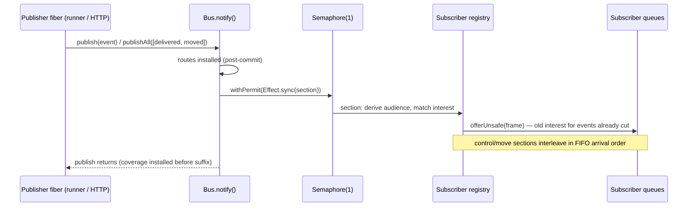
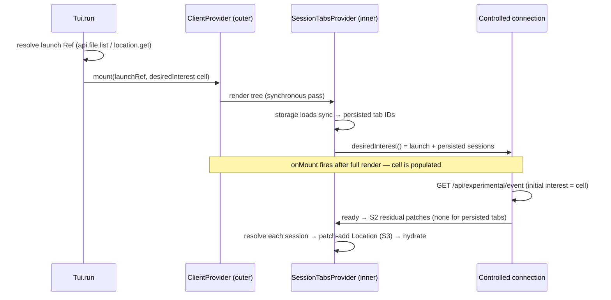

# Controlled event feed — what-if draft

## Situation

The V2 TUI burns CPU whenever anything runs anywhere on the machine because
`GET /api/event` is a global firehose: EventFeed observes the deliberately
global, deprecated `bus.listen` callback
([`event-feed.ts:83-88`](/packages/server/src/event-feed.ts#L83-L88),
[`bus.ts:162`](/packages/core/src/bus.ts#L162)) and every public event enters
every subscriber queue. Earlier waves in this directory diagnosed that,
rejected single-Location scoping (the TUI legitimately spans Locations via
routes, tabs, and moves — review0 finding 1), compared transports, and
converged on a **controlled SSE**: one long-lived SSE stream with a mutable
revisioned interest set, server-derived move coverage for followed sessions,
and transport-local control frames
([`controlled-draft0.gpt56s.md`](/.design/bus-smart/controlled-draft0.gpt56s.md)).

That draft was then split into four subproblems and researched. The research
wave is complete:

1. [Bus audience seam](/.design/bus-smart/research-bus-audience0.glm53.md) —
   how Bus exposes publication-time routing without leaking semantics.
2. [EventFeed Effect v4 architecture](/.design/bus-smart/research-eventfeed-effect0.glm53.md)
   — the admission-point implementation against real effect-smol v4 source.
3. [Client compatibility surface](/.design/bus-smart/research-client-compat0.glm53.md)
   — the adoption adapter and the proof that everyone else keeps working.
4. [TUI interest policy](/.design/bus-smart/research-tui-interest0.glm53.md)
   — the per-trigger map of what the TUI must want, when.

This document is the **what-if elaboration**: a fresh, integrated,
explicitly **non-authoritative** design that supposes, weighs alternatives,
and takes reasoned positions. Where the research verified facts, this builds
on them; where it left open questions, this decides them (or gates them); and
where it — or the prior draft — seems wrong or incomplete, this says so.

### Hard constraints (restated; never violated below)

- Non-TUI clients — CLI, ACP, mini transport, desktop, app, SDK, plugin
  adapter, generated clients — keep working as-is, byte-for-byte. The
  client-compat census (14 runtime consumer rows, all "yes") is the proof
  baseline; the four structural facts (legacy endpoint byte-identical,
  codegen per-endpoint, control frames confined to the new stream, adapter
  is an opt-in sibling) are accepted as verified.
- A web client is **future** work. Not designed here. But every contract
  decision below flags browser-reversal cost where one exists
  (EventSource cannot set headers).
- The **TUI is the first and only adopter** for now.
- **Bus remains the sole owner of routing semantics.** The server matches on
  audiences Bus computed; it never re-derives routing from payloads.

## How this draft uses the research

| Research doc | Status of its claims here | What this draft adds |
| --- | --- | --- |
| bus-audience | Facts accepted (all anchors spot-verified: `notify`/`observe` at [`bus.ts:486-505`](/packages/core/src/bus.ts#L486-L505), move paths at [`session.ts:461-515`](/packages/core/src/session.ts#L461-L515)) | Decides snapshot- vs guard-gated `sessionID`; pins the defect asymmetry with a new test; scopes the commit→notify gap |
| eventfeed-effect | Architecture endorsed with its three refinements | Decides zero-subscriber skip placement, registry shape, command-cache retention |
| client-compat | Proof baseline accepted | Decides generated-tree symmetry, fallback permanence, conflict observability; generalizes the initial-interest accessor to reconnect |
| tui-interest | Policy map accepted (S1–S18) | Decides the accessor, family holds, pending-move lifetime; sharpens the busy-gating critique; accepts the notification-scope change as product behavior |

Every position below states the alternatives weighed, the position taken,
and a confidence. Decision-gated items are named as such.

## Layer 0 — Bus audience seam

### What is settled

The seam is an inline routed observer, called from a single choke point at
the top of `notify()`, ahead of legacy listeners and PubSub publication
(bus-audience §4a; `notify` at [`bus.ts:494-505`](/packages/core/src/bus.ts#L494-L505)).
The audience is `local()`'s filter logic reified as data, so parity with
`Bus.subscribe()` is by construction: snapshot first, envelope fallback,
`refs: []` stays routed-but-no-location, never global. The move-ordering
claim (derived coverage installed before `bus.publish(session.moved)`
completes, on both the immediate path
([`session.ts:491-504`](/packages/core/src/session.ts#L491-L504)) and the
runner's fully-uninterruptible `publishAll` path) was traced and holds.
Rejected alternatives stay rejected: `deliversTo` (identity-sensitive,
clone-unsafe), per-subscriber scoped `bus.subscribe()` (K streams, no
exact-Session, encode-per-subscriber), audience-in-PubSub (loses
publish-return coupling; held as fallback).

The interface sketch, unchanged from the draft plus the two decisions below:

```ts
export type EventAudience =
  | { readonly type: "global" }
  | {
      readonly type: "locations"
      readonly refs: readonly Location.Ref[]
      // present only when Bus session-routed this event — see D1
      readonly sessionID?: SessionID
    }

export type RoutedSubscriber = (
  event: Event.Payload,
  audience: EventAudience,
) => Effect.Effect<void>

// Bus.Interface addition; every existing member unchanged
readonly listenRouted: (subscriber: RoutedSubscriber) => Effect.Effect<Unsubscribe>
```

### D1 — `sessionID` is snapshot-gated · confidence: high

**Alternatives.** Snapshot-gated: `sessionID` present only when a route
snapshot exists (precisely the events Bus session-routes). Guard-gated:
present for every `SessionEvent.All` payload, including envelope-pinned ones
that Bus routes by envelope location instead.

**Position: snapshot-gated.** Three arguments:

1. **Parity is the invariant.** The audience must be exactly "what
   `local()` would deliver, plus the session ID for the session-routed
   subset". Guard-gating admits events to exact-Session followers that no
   `Bus.subscribe()` consumer can receive today — a recipient set Bus would
   be silently inventing. That is a routing-semantics change smuggled into
   a reporting seam, and it violates the sole-owner constraint in spirit.
2. **The practical delta is tiny.** In production, session events other than
   `created`/`moved`/`forked` are published without envelope locations (the
   sequencing research verified `renamed`/`text.delta` carry no location on
   the wire or in log history), so they get snapshots and are covered either
   way. The delta is envelope-*pinned* session events — an override
   mechanism exercised by the oracle tests, not a production path.
3. **The TUI doesn't need it.** The interest policy holds every open tab's
   resolved Location (S3/S5) and server-derived move coverage carries the
   move window, so a session event pinned to the session's own Location is
   covered through Location interest anyway. One pinned to a *foreign*
   location has been deliberately re-scoped by its publisher; honoring that
   is Bus semantics, not ours to override.

**Escape hatch.** If a real case emerges where an envelope-pinned session
event matters to an open tab, the fix belongs in Bus's `prepareRoutes` (make
the override also install a snapshot), keeping the invariant intact — not in
the audience rule.

This decision also *settles* the draft's open question "should exact Session
interest admit permission/form events carrying that sessionID?": **no, and
not only as a preference.** Permission/form events are Location-owned
ephemerals outside `SessionEvent.All` (bus-audience §3, verified against
[`permission.ts`](/packages/schema/src/permission.ts#L44-L52) and
[`form.ts`](/packages/schema/src/form.ts#L160-L162)); they never have a
snapshot, so under D1 they carry no `sessionID` in the audience. Exact-Session
admission of them would require Bus to publish audience facts it does not
believe. Derived Location coverage is not merely the chosen mechanism; it is
the only one the seam can express. (The projection keys them session-side
while routing is location-side — that mismatch is exactly why the derived
destination matters during moves.)

### D2 — The routed observer swallows defects; accept the asymmetry and pin it · confidence: high

**Alternatives.** Mirror `observe()`'s contract (catch non-interrupt causes,
log, propagate interrupts) — the feed can never fail a domain publish. Or be
fail-fast like ephemeral legacy listeners, for symmetry.

**Position: swallow, as the research recommends — but pin it with a test,
not prose.** The reasoning is right: overflow policy lives inside EventFeed
(per-subscriber failure, [`event-feed.ts:64-68`](/packages/server/src/event-feed.ts#L64-L68)),
and an admission defect failing a session-runner publish inverts the
dependency (domain execution would depend on SSE health). Interrupts still
propagate, matching the pinned durable behavior.

The asymmetry is real but bounded: EventFeed itself also registers the
*legacy* `bus.listen` observer for legacy subscribers, and that path stays
fail-fast for ephemeral publishes exactly as today
([`bus.test.ts`](/packages/core/test/bus.test.ts#L426-L434)). So one module
hosts both contracts. That is acceptable **only if** the two contracts are
each pinned by explicit tests: "routed-observer defect never fails a publish"
and "legacy listener defect still fails an ephemeral publish". Without the
first test, a future "unify the listener loops" refactor would silently make
feed defects fail publishes — the kind of drift reviews never catch.

### D3 — The commit→notify interruption gap: document, defer, and bound the blast radius · confidence: high (on deferring)

A single durable publish commits its transaction inside
`Effect.uninterruptible` ([`bus.ts:315`](/packages/core/src/bus.ts#L315)) but
runs `notify` afterwards, inside the aggregate lock yet interruptible
([`bus.ts:469-477`](/packages/core/src/bus.ts#L469-L477)). An interrupted
publisher in that window commits and installs routes with **no observer or
listener running**. The seam inherits this.

**Position: document it; do not fix it in this work.** Reasons:

- The move-critical paths are not exposed: the runner move uses
  `publishAll` (whole lock+notify section uninterruptible) and the immediate
  path publishes synchronously inside the HTTP request — both verified. So
  the controlled feed's headline guarantee (move coverage before the suffix)
  never rests on the gap.
- Every other durable event that skips notify is already missed by *today's*
  legacy listeners under the same window. The controlled feed inherits an
  existing wart; it does not create one. Under the volatile SSE contract,
  misses are repaired by reconnect hydration.
- Fixing it (wrapping notify in the uninterruptible section) changes
  interruption semantics for every durable publisher in the codebase — a
  Bus-wide behavioral change that deserves its own wave, not a rider on an
  events transport.

**Bounded claim to write into the seam docs and tests:** "derived coverage is
installed before `session.moved` is observable" holds for both real move
paths; single-event durable publishes carry the pre-existing
commit-without-notify window, unchanged from legacy behavior.

### Minor seam decisions (folded in, low controversy)

- **Internal events** (`session.usage.recorded` etc.) reach the observer and
  are filtered by EventFeed's existing `isOpenCodeEvent` check
  ([`event-feed.ts:49`](/packages/server/src/event-feed.ts#L49)). Filtering
  is the feed's business; Bus does not learn about the public manifest.
- **Replay with `publish: true`** reaches the observer identically to live
  publication (same `notify` choke point). Pin with an oracle test — the
  routing oracle already treats published replay as routed delivery.

## Layer 1 — EventFeed Effect v4 architecture

### What is settled

The eventfeed-effect research read the actual effect-smol v4 source and
confirmed the draft's pick: **one `Semaphore.makeUnsafe(1)` guarding a plain
mutable `Map` of subscriber records, every ordering operation exactly one
non-yielding `Effect.sync`** — with three refinements this draft adopts
verbatim:

1. encode domain events *before* the critical section (a throwing `sync`
   becomes a defect; encoding is per-publication anyway, so encode-once is
   preserved and admission order is decided at offer time);
2. `Semaphore.makeUnsafe(1)` (repo idiom: `state.ts`, `keyed-mutex.ts`,
   `model-transport.ts`);
3. state the invariant the semaphore protects — not memory safety (a single
   `Effect.sync` is already atomic in v4) but multi-op-section tolerance,
   FIFO arrival ordering, and a greppable cut.

RcMap (get-or-create semantics, refcount churn), STM (unsafe offers replay
on retry), and a single-fiber actor (hop + hang-on-death replies) are all
rejected on source-verified grounds. The current module's contract
properties — capacity 4096 dropping queues, encode-once fan-out
([`event-feed.ts:51-68`](/packages/server/src/event-feed.ts#L51-L68)),
per-subscriber overflow isolation, public-event pre-filtering, scoped
lifetime — are preserved. The eventfeed research also improved on the draft
by moving ready-frame + `server.connected` admission **into** the
registration critical section (today the handler prepends them via
`Stream.concat`, [`handlers/event.ts`](/packages/server/src/handlers/event.ts#L14-L24));
this draft adopts that as the design.

### D4 — Zero-subscriber fast path lives inside EventFeed.publish · confidence: high

**Alternatives.** (A) EventFeed registers its routed observer once at layer
init (mirroring today's single `bus.listen` registration) and its `publish`
checks `subscribers.size === 0` first
([`event-feed.ts:50`](/packages/server/src/event-feed.ts#L50) today). (B)
The seam gains a no-subscribers feedback channel: EventFeed
registers/unregisters the observer on first/last controlled subscriber, so
Bus pays zero when idle.

**Position: (A).** The cost of (A) is one function call plus one size check
per publish when idle — the research measured the inline await itself as
microseconds and "orders of magnitude below the per-event `PubSub.publish`
that already happens". (B) saves that and buys: a mutable
registration-count invariant split across two modules, re-registration churn
on subscriber flapping, and a seam contract that now has observable state
transitions. The existing fast-path read is already proven safe outside the
lock (a stale zero linearizes before an in-flight registration — a legal
cut). Keep the seam a dumb, stateless observer contract.

### D5 — One registry collection; legacy entries are match-all records · confidence: medium

**Alternatives.** (A) One `Map<SubscriptionID, Subscriber>`; legacy
subscribers are records with a match-all interest and an unexposed id/token,
so the legacy `subscribe` becomes a two-line variation of controlled
registration. (B) Two collections — keep today's `Set<Queue>` byte-identical
for legacy and add the `Map` for controlled — iterated in the same critical
sections.

**Position: (A), for the end state.** Every ordering section (publish,
register, unregister, control, move coverage) automatically covers both
populations; "who is affected by X" is a one-place audit forever; the branch
cost is one interest-kind check. (B)'s only real advantage is patch
ergonomics — a visibly-untouched legacy diff reads faster in review — and it
is a legitimate staging choice for the downstream branch if upstream asks
for it. But (B) permanently duplicates the fan-out loops and invites
divergence (a future section that forgets one collection). Note the
"byte-for-byte" hard constraint is about *wire behavior*, which (A) preserves
exactly (existing EventFeed tests pass unchanged); internal registry shape
is not a compatibility surface. This is the one position here I would
happily lose in review.

### D6 — Command cache is bounded: FIFO window, 256 entries, checked in-section · confidence: high

**Alternatives.** Subscription-lifetime retention (unbounded) vs a bounded
window.

**Position: bounded FIFO of 256.** A TUI connection lives for days; every
tab open/close is a command; unbounded retention is a slow leak an idle
server accumulates per subscriber. Bounding is safe here for a structural
reason: client `commandID`s are generation-sequenced
(`${generation}:${seq}`), so a FIFO evicts only *ancient* IDs, and realistic
retries (a lost HTTP response) occur within milliseconds — the retry horizon
is three orders of magnitude inside the window. Even a pathological replay
of an evicted ID degrades gracefully: an add of still-present interest is a
semantic no-op (no revision bump); anything else is almost certainly stale
and fails `expectedRevision`, converging via one `replace`. Semantic no-ops
never increment revisions, so eviction cannot corrupt revision logic. The
cap check runs inside the same critical section (one `if`), preserving the
ordering point.

## Layer 2 — Wire contract and protocol surface

Settled by the draft, verified by client-compat: legacy `GET /api/event`
untouched; a new experimental pair:

```text
GET   /api/experimental/event
PATCH /api/experimental/event/subscriptions/:subscriptionID/interests
```

- First two frames: `event-feed.ready` (subscription identity, controlToken,
  requested/effective interest and revisions), then the ordinary
  `server.connected` — both admitted inside the registration section.
- Control frames are tagged JSON in `data:`; named SSE `event:` fields are
  diagnostic only (the generated parser consumes `data:` alone — verified
  against `promise/generated/client.ts` by client-compat).
- `controlToken` returns only in the ready frame and rides the
  `x-opencode-event-control-token` PATCH header; header-input precedent
  exists (`persistentPty.connectToken`).
- `FeedItem = OpenCodeEvent | FeedControl`; revision/retry/idempotency rules
  exactly as the draft specifies (command-ID lookup first; same-ID retry
  returns the cached result; no-ops acknowledged without revision
  increments).

One addition this draft makes: **the GET's initial-interest query must carry
both dimensions** — repeated `location` params *and* repeated `session`
params — because D12 puts persisted tab Session IDs into the initial
interest. Additive query params stay EventSource-compatible.

### D7 — Dedicated protocol group for the controlled endpoints · confidence: medium (naming is a decision-gate)

**Alternatives.** A dedicated group (e.g. `server.experimental.event`) with
its own `groupNames` entry, or endpoints nested by identifier prefix inside
the existing experimental group.

**Position: dedicated group.** `groupNames` maps one namespace per group
identifier; a dedicated group gives a clean protocol/OpenAPI surface and a
single place for the eventual graduation decision. Prefix-nesting beside
`experimental.persistentPty.*` couples two unrelated features' naming. Exact
identifier and namespace strings are a decision-gate for implementation —
not worth a design fight.

### D8 — Stay experimental until the control vocabulary stabilizes · confidence: high

Graduation is a new-endpoint decision later (path rename = new endpoints,
which is fine since clients negotiate by 404-fallback anyway — D10). Do not
bake version assumptions in now.

### Browser reservations (flags only, not design)

- **Safe already:** control over HTTP PATCH, not in-stream (EventSource is
  receive-only); token in ready frame + PATCH header, never in a URL; ready
  frame as first data frame; GET auth via the existing `auth_token` query
  param; initial interest via query params.
- **Verification item, cheap:** PATCH + custom header forces CORS preflight;
  the server's CORS config must cover the new path before any browser
  client (the PTY ticket flow already relies on exactly this property).
- **Keep `InterestInput` an open object schema** (`locations?`, `sessions?`)
  so a future `mode` discriminator is additive.
- **Do not rely on `Last-Event-ID`** or SSE `event:` names; our reconnect
  model is a fresh GET (new subscription), which EventSource auto-reconnect
  cannot express — a browser client will use `fetch`-based SSE for the GET
  anyway. Nothing designed here forecloses that.

### Admission ordering (one ordering point for everything)



The section is a single total op: encode happened before the permit; inside
it only `offerUnsafe`, `failCauseUnsafe`, and Map/Set mutation. A failed
offer removes and fails only that subscriber; state installation and command
caching happen only after successful offers.

## Layer 3 — Client adapter

Settled by client-compat and endorsed here: a **sibling module**
(`packages/client/src/solid/controlled-connection.ts`) reusing the reconnect
skeleton (2s connect timeout, 1s delay, generation guard — verified at
[`connection.ts:40-119`](/packages/client/src/solid/connection.ts#L40-L119))
with the legacy `connection.ts` untouched. Frame interception before
`publish`; control frames never reach the emitter or Solid data; the first
*domain* frame remains `server.connected` so the existing first-frame check
translates unchanged. The TUI's `ClientProvider` is the only factory-switch
call site.

### D9 — Carry both generated trees (symmetry); keep the omit lever unused · confidence: medium-high

**Alternatives.** Regenerate both the Promise and Effect trees with the new
endpoints, or `effectOmitEndpoints` the new pair since only the TUI's
Promise path consumes them.

**Position: carry both.** The churn is mechanical, CI-guarded
(`check:generated`), and additive-only (the `session.log` GET-with-input SSE
path proves generation works). Omission creates an asymmetry — endpoints
present in protocol/OpenAPI but absent from the Effect SDK — that the *next*
adopter (app? desktop?) trips over, plus a config line someone must
remember to delete. The omission lever stays available if rebases of the
downstream branch turn the generated diff into a real burden; that is a
measured retreat, not an opening position.

### D10 — 404→legacy fallback is permanent, observable, and never silent · confidence: high

**Alternatives.** Keep the adapter fallback forever (newer TUI, older
elected server → degrade to firehose), or drop it and rely on managed-service
election always matching the client version.

**Position: keep the fallback.** Version skew is a real, supported
combination — `dev:live` against an installed older server is a documented
workflow in this repo, and election does not gate on feature presence.
Dropping the fallback hard-breaks the TUI against older servers, which the
compat census treats as supported. But make the degraded mode **explicit**:
`control: "unavailable"` on the connection state, one log line, interest
`patch()` calls become typed no-ops the provider must tolerate. The TUI then
behaves exactly like today's client on that server — which is the
compatibility guarantee restated. Relying on election instead moves a
client-local concern into global service state it doesn't control.

### D11 — The coalescer exposes a conflict count; recovery stays one `replace` · confidence: high

**Alternatives.** Silent replace on revision conflict, or surface a
conflict-count signal.

**Position: surface it.** With a single coalescer as the only command
source, revision conflicts *should be impossible* in steady state (requested
revisions move only via this client's own commands). A conflict therefore
means a bug — a missed applied frame, a generation race, a stale response
accepted. Silent replace converges state but destroys the only evidence.
The signal costs one counter plus a timestamp on the snapshot accessor;
recovery remains exactly one `replace` with the canonical desired set, never
a converging patch sequence. The state machine's invariants (revisions
advance only on SSE frames; one PATCH in flight; generation guard) are
adopted as specified, with one explicit addition from client-compat that the
draft under-specified: the adapter **may seed the next command's
`expectedRevision` from the HTTP response** (the server computed it under
the same serialization) while the *published snapshot* advances only on the
frame. Read strictly, the draft's "advances its applied revision only when
it consumes the control frame" would forbid seeding; this draft reads the
two as compatible and makes that reading normative.

## Layer 4 — TUI interest policy

The S1–S18 trigger map, the awaited-adds rule (await the PATCH HTTP
response, which is when the server installs state — not the SSE frame), the
asymmetric hysteresis (adds immediate, removes debounced 2–5s trailing), the
`desiredInterest` predicate, the `admitMove`/`releaseMove` hook, and the
"what must NOT change interest" list are all adopted from the tui-interest
research. Four of its open questions are decided here.

### D12 — The initial GET reads a desired-interest accessor (and so does every reconnect) · confidence: high

**Alternatives.** Accept the `[ready, patch-applied]` window for restored
tabs (HTTP prefetch repairs them anyway), or give the connection a
`desiredInterest: () => InterestInput` accessor that `ClientProvider`
creates, `SessionTabsProvider` populates during init (storage loads
synchronously, before `onMount` opens the stream), and the GET reads at
connect time.

**Position: the accessor.** It converts a timing property into a structural
one: persisted tab Session IDs are *inside* the initial interest, so there
is no window at all. The mount-order fact it rests on is verified (provider
init runs outer→inner in one synchronous pass; the stream opens in
`onMount`, after the whole tree rendered). It degrades gracefully — if the
mount-order assumption ever breaks, the accessor reads empty and the design
falls back to exactly the alternative (queued patch after ready). Cost: one
option, one cell.

**This draft generalizes it beyond the research:** the accessor is read on
*every* connect, not just startup. On reconnect, the GET then carries the
current desired set — launch Location plus every open tab's sessions and
resolved Locations plus pending-move holds — and the post-ready `replace`
that both the draft and client-compat specified becomes unnecessary in the
common case. `replace` remains for revision-conflict recovery (D11) and
tests. The reconnect contract simplifies to: fresh subscription with
desired-as-initial interest; anything that changed mid-flight is a patch
after ready. This is strictly less chatty and removes a class of
"replace-races-with-patch" orderings.

### D13 — Family-member holds are unconditional while the tab exists · confidence: medium

**Alternatives.** Hold resolved Locations of every family member of every
followed root unconditionally (while the tab exists), or only while the root
tab is busy.

**Position: unconditional, with an honest cost statement and a measurement
gate.** The unconditional predicate is simpler and does not couple transport
interest to derived UI state. Two things the research left implicit:

1. **A Location hold admits everything at that Location**, not just family
   events. After a root moves A→B, holding A for a still-running member
   also admits other sessions' events at A. In practice A is the project
   the user just left, its volume is dominated by the member itself, and
   the hold is temporary — but this is the real cost, and it is the basis
   of the measurement gate below.
2. **Root-busy gating is the wrong signal even if gating were wanted.**
   Member events matter when the *member* is running, and a member can
   plausibly outlive the root's busy window (or arrive via fork before the
   root's status settles). Busy-gating on the root drops coverage in
   exactly the windows the hold exists for. If gating ever returns, it must
   be member-activity-gated — at which point the complexity has already
   bought most of the unconditional hold's cost.

Also note the precise complement: family member **Session IDs** belong in
the sessions dimension of the predicate regardless (exact, zero
overdelivery, covers their SessionEvents), while the member **Locations**
are what covers their permission/form events. Both are unconditional here.

**What would change this:** measurement showing sustained post-move
delivery from old-project Locations that users have navigated away from —
then member-activity gating, not root-busy gating.

### D14 — Pending-move holds survive reconnect, with a generous timeout and authoritative clears · confidence: medium

**Alternatives.** Keep `pendingMoves` entries across reconnect when
`session.moved` never arrives (server restart between admission and the
safe boundary), or clear them on reconnect hydration.

**Position: keep, with a timeout.** The move inbox item is durable and
startup recovery resumes claimed sessions, so an admitted move will almost
always eventually publish; clearing the hold on reconnect would drop the
destination from requested while the move is still pending. Correctness
never depends on the hold — the session is followed, so server-derived
coverage re-covers it on `session.moved` whenever it lands — meaning the
hold is an optimization that keeps destination events requested-covered
rather than derived-covered. That also means a timeout is safe: clear on
`session.moved`, on session info showing the destination, on
`session.deleted`/not-found, or after a generous timeout (suggest ~10
minutes, comfortably spanning restart-plus-recovery). The failure mode of
the timeout firing early is a briefly derived-covered move; the failure
mode of no timeout is an immortal hold for a session that will never drain.
The first is tolerable; the second is a leak.

### D15 — Interest scope is notification scope: accepted as product behavior · confidence: medium-high

**Alternatives.** Accept that the notifications plugin fires only for
in-interest-set sessions (the TUI's interest becomes its attention scope),
or preserve cross-project notifications via some broader signal.

**Position: accept, and say so out loud.** The notification-for-every-
session-on-the-machine behavior is a symptom of the same attention leak that
causes the CPU burn; scoping it is the fix, not a regression. But this is a
user-visible behavior change and must be decided consciously (release-note
worthy), not discovered. If cross-project attention must survive later, the
answer is a separate low-rate server-side attention aggregate event —
explicitly out of scope here and cheap to add later precisely because it
would be a *new* global event type, not an interest-model change.

### D16 — A move waits for patch-ack only, not destination hydration · confidence: medium-high

The draft's last open question: delay `session.move` until destination
interest is applied, or also until destination Location metadata hydration
completes? **Patch-ack only.** The awaited add (S8–S10) needs the PATCH
response because that is when the server installs state. Destination
metadata hydration (project/catalog sync) is display repair the projection
performs continuously; coupling move admission to it adds an ordering
dependency on read caches for zero correctness gain — the server
re-validates the destination authoritatively inside `Session.move`
([`session.ts:461-485`](/packages/core/src/session.ts#L461-L485)).

### Foreign-initiator move coverage (the case that justifies all of this)

```mermaid
sequenceDiagram
    participant App as Foreign client (app menu / plugin / other TUI)
    participant Core as Session runner (publishAll, uninterruptible)
    participant B as Bus.notify()
    participant EF as EventFeed section
    participant TUI as Observing TUI

    App->>Core: POST session.move (admits durable inbox item)
    Core->>Core: safe boundary: [InboxDelivered, Moved]
    Core->>B: publishAll — commit, install routes [old, new]
    B->>EF: routed observer(session.moved, audience)
    EF->>EF: derivedLocations[sid] = destination
    EF->>TUI: enqueue event-feed.effective.changed (if coverage changed)
    EF->>TUI: enqueue session.moved
    Note over EF,TUI: destination-suffix events (permission, steps) admitted under expanded effective set
    TUI->>TUI: S14: promote destination to requested; source removal via predicate only
    B-->>Core: publishAll returns — before post-move recursion can publish
```

### Startup with the accessor



## Invariants

Revised from the draft in light of the research (numbering preserved where
unchanged; additions marked):

1. One controlled subscriber has one bounded FIFO queue.
2. Every admitted domain event is delivered at most once to that subscriber.
3. Global events are admitted exactly once regardless of Location count.
4. Requested interest changes only through acknowledged client commands.
5. Derived interest changes only through server-observed routing transitions.
6. Every effective-interest change is announced in the queue before events
   that depend on it.
7. A followed Session remains covered across a move before destination
   execution can publish its suffix — on both the immediate and runner move
   paths (bus-audience §5, traced).
8. Workspace identity participates in every Location equality check.
9. An empty routed audience never becomes global.
10. No interest change emits a domain connection boundary.
11. *(new)* The audience is exactly `local()`'s delivery decision plus a
    snapshot-gated `sessionID`; Bus changes recipient semantics, nobody
    else (D1).
12. *(new)* An admission defect in the routed observer never fails a domain
    publish; interrupts propagate (D2).
13. *(new)* Ordering sections contain only `offerUnsafe`, `failCauseUnsafe`,
    and Map/Set mutation — never awaits, never encoding (Layer 1).
14. *(new)* The client's published snapshot advances only on SSE frames;
    HTTP responses may seed `expectedRevision` only (D11).
15. *(new)* Initial interest (startup and reconnect) is the desired set at
    connect time; patches carry only deltas afterwards (D12).

## Verification focus

The draft's list, carried forward and extended (research-derived items
marked ◆):

- Patch add/remove and replace produce the same canonical requested set.
- Repeated command IDs are idempotent; stale revisions fail without
  mutation; same ID with different content fails.
- Semantic no-op commands are acknowledged without incrementing revisions.
- ◆ An evicted-then-retried command ID degrades to no-op or revision
  conflict — never a silent second application (D6).
- The HTTP response overtaking its applied SSE frame does not advance the
  published snapshot; the next command may use the response revision.
- A TUI-prepared move has destination interest before admission; a foreign
  move installs derived coverage before the observing TUI receives
  `session.moved` (oracle re-pin: dual-owner audience, fork-through-parent,
  envelope override, cold-owner, batch move-then-delete, rollback,
  published-replay — every case in
  [`bus-session-routing.test.ts`](/packages/core/test/bus-session-routing.test.ts)).
- A move still pending after reconnect is covered by restored follow
  (D14); a move executed during disconnection is repaired by reconnect
  hydration under the existing volatile contract.
- Permission/form events immediately after a move remain covered through
  the derived destination Location; they are never matched by exact-Session
  interest (D1).
- Removing the last Session follow releases derived coverage without
  removing independently requested Location coverage.
- Directory-equal but workspace-distinct events remain isolated.
- Queue overflow fails one subscriber; subsequent control returns
  not-found/closed — ◆ distinguishing "queue no longer Open" from
  "queue full" on the control path.
- ◆ Disconnect-mid-control yields applied-then-drained or not-found — never
  a hang; overflow-during-control never installs interest or caches a
  command result.
- Ready and `server.connected` are enqueued during serialized registration
  (moved from the handler's `Stream.concat` prepend).
- ◆ A routed-observer defect is logged and does not fail the publish; the
  same defect in the legacy listener path still fails an ephemeral publish
  (D2's paired tests).
- ◆ With zero controlled subscribers, publications cost one size check; the
  stale-zero read linearizes before an in-flight registration (D4).
- ◆ Controlled GET against an older server falls back to legacy within the
  retry threshold, surfaces `control: unavailable`, and patches become
  typed no-ops (D10).
- ◆ Revision conflicts are counted and logged; recovery is exactly one
  `replace` (D11).
- ◆ Persisted tab Session IDs appear inside the initial GET interest, with
  no `[ready, patch-applied]` gap (D12) — including when events publish
  concurrently with registration.
- Legacy unscoped behavior and wire frames are unchanged (the full
  client-compat census remains the regression baseline).

## What would change our minds

- **D1 (snapshot-gated):** a verified production case where an
  envelope-pinned Session event is load-bearing for an open tab, and Bus
  declines to snapshot it. Then the fix still goes to `prepareRoutes`
  first; guard-gating is the last resort.
- **D2 (swallow defects):** evidence that a swallowed feed defect produces
  subscriber-state corruption rather than a dropped admission — then the
  observer should fail loudly per-subscriber, not per-publish.
- **D3 (defer the commit→notify fix):** a controlled-feed guarantee that
  genuinely needs every durable publish to notify — e.g. if effective-
  interest accounting ever had to be exact rather than eventually-
  consistent-per-subscriber.
- **D4 (fast path in EventFeed):** profiling showing the idle-observer call
  is measurable at realistic event rates — then on-demand observer
  registration, not a seam feedback channel.
- **D5 (one collection):** upstream review explicitly preferring a visibly
  untouched legacy diff — a staging preference, not a correctness argument.
- **D6 (bounded cache):** a client protocol that legitimately retries
  commands outside a 256-command horizon — then generation-negotiated
  dedup windows instead of unbounded retention.
- **D9 (carry both trees):** downstream rebase pain measured in real
  conflicts on the Effect tree — then omit until a second adopter.
- **D10 (permanent fallback):** service election growing feature
  negotiation, making client-side fallback dead code.
- **D12 (accessor):** the TUI moving ClientProvider mounting after inner
  providers (breaking the mount-order fact) without preserving a
  synchronous read before connect.
- **D13 (unconditional family holds):** measurement of sustained old-
  Location delivery after moves — then member-activity gating.
- **D15 (scoped notifications):** user demand for cross-project attention —
  then a dedicated low-rate aggregate event, not broader interest.

## Remaining open questions

Genuinely open; everything else above is decided or gated:

1. **Debounce window for removal hysteresis** (2–5s suggested) — pick with
   measurement during implementation; not a design question.
2. **Command-cache window size and interest-set size cap constants** — 256
   and "small" are reasoned defaults, tunable.
3. **Group identifier/namespace strings** (D7 decision-gate) and the
   eventual graduation path/naming from `/api/experimental/` (D8).
4. **The attention aggregate**, if D15 is ever revisited — a future event
   type, out of scope here.
5. **The commit→notify interruption gap's own fix** (D3) — a separate Bus
   wave if ever.

## Cross-references

- [Controlled SSE draft](/.design/bus-smart/controlled-draft0.gpt56s.md) —
  the focused design this doc elaborates; its transport contract, interest
  model, and carry layers survive essentially intact, with its open
  questions resolved here.
- [Bus audience research](/.design/bus-smart/research-bus-audience0.glm53.md)
  — verified the seam's routing internals and move-ordering trace; this doc
  decided its snapshot-gating, defect-asymmetry, and interruption-gap
  questions.
- [EventFeed Effect research](/.design/bus-smart/research-eventfeed-effect0.glm53.md)
  — grounded the semaphore architecture in effect-smol v4 source; its three
  refinements are adopted; its registry and cache questions decided here.
- [Client compat research](/.design/bus-smart/research-client-compat0.glm53.md)
  — the byte-for-byte proof baseline and adapter design; its tree-symmetry,
  fallback, and conflict-signal questions decided here.
- [TUI interest research](/.design/bus-smart/research-tui-interest0.glm53.md)
  — the S1–S18 policy map and predicate adopted wholesale; its accessor,
  family-hold, pending-move, and notification-scope questions decided here.
- [Downstream-patch assessment](/.design/bus-smart/review0.gpt56s.md) —
  finding 1 (multi-Location TUI) is the constraint that shaped everything;
  its projection-guard recommendation stays endorsed as defense-in-depth,
  especially since app/desktop share `data.ts` while remaining on the
  firehose.
- [Event sequencing research](/.design/bus-smart/research-event-sequencing0.gpt56s.md)
  — the one-logical-FIFO contract that rejected per-Location stream unions
  and motivates the single ordering point.
- [Controlled-SSE transport research](/.design/bus-smart/research-controlled-sse0.gpt56s.md)
  — the transport comparison and revision/marker ordering rules this design
  inherits.
- [Location-stream alternatives](/.design/bus-smart/location-streams0.gpt56s.md)
  and [union handoff](/.design/bus-smart/research-union-handoff0.gpt56s.md)
  — the rejected alternatives whose failure modes (merge barriers, handoff
  races) this design avoids by construction.
- [Durable Streams research](/.design/bus-smart/research-durable-streams0.gpt56s.md)
  — the larger replay architecture this admission point deliberately does
  not preclude.
- [Original bus-smart design](/.design/bus-smart/bus-smart.glm53.md) — the
  motivating diagnosis.

## Appendix — cross-comparison of the research wave

| Doc | Strengths | Notable features | Weaknesses | Weight here |
| --- | --- | --- | --- | --- |
| bus-audience | Every claim anchored to verified source; the publish-path matrix and semantics-matrix-vs-oracle mapping are implementation-ready; honest about the seam's inherited warts | The four-candidate comparison with a rejected-but-kept-fallback (d); the forked `sessionID`-vs-`refs` asymmetry catch; the §6 framing that isolated the sharpest decision | Leaves the two headline decisions genuinely open (fair for research, but the doc could not conclude); light on failure-injection beyond the pinned tests | **Heaviest on semantics** — D1–D3 and the audience invariant are direct resolutions of its questions |
| eventfeed-effect | The only doc that read the actual v4 run loop, Semaphore, Queue, RcMap, and STM sources; killed three plausible architectures with specific line-level reasons rather than taste | The "is the semaphore even necessary" analysis (single-op atomicity vs op-budget preemption); `failCauseUnsafe` Closing-state drain semantics matching the overflow contract exactly; `offerUnsafe` false-ambiguity catch on the control path | Its module sketch leaves `register` elided where several ordering properties actually live; arguably over-verifies primitives (RcMap/STM) the design never seriously considered | **Heaviest on implementation** — adopted wholesale with refinements; D4–D6 resolve its open questions |
| client-compat | The census is the hard-constraint proof the user demanded, argued structurally (four facts) rather than by enumeration; the browser reservation section is disciplined about what is expensive vs cheap to reverse | The 404-fallback and generation-guard state machine; the `session.log`/`connectToken` precedents that de-risk codegen; the observation that the projection guard stays valuable *because* app/desktop share `data.ts` | Its reconnect contract (launch-then-replace) is more conservative than the accessor allows — D12b generalizes past it; "404 twice" threshold is asserted, not derived | **Heaviest on constraints** — the compat baseline is treated as immutable input; D9–D11 resolve its questions |
| tui-interest | Exhaustive per-trigger policy map with ordering relative to API calls; turned prose rules into a checkable predicate; surfaced real gaps the draft missed (outbox privacy, family members, notification scope) | Facts 3–4 (mount order) making the accessor race-free; the awaited-adds clarification (PATCH response, not SSE frame); the "what must NOT change interest" list — negative-space design that prevents bugs | The busy-gating option it floats is under-analyzed (root-busy vs member-activity — D13's critique); the predicate's cost model (Location holds admit whole directories) is implicit rather than stated | **Heaviest on policy** — S1–S18 and the predicate are adopted as the TUI layer; D12–D16 resolve its questions |

How this draft used them: bus-audience and eventfeed-effect grounded the two
server layers (their verified facts became invariants 11–13); client-compat
supplied the untouchability proof and the adapter skeleton (invariants 14,
D9–D11); tui-interest supplied the client policy (D12–D16). The four docs
were mutually consistent — no fact in one contradicted another — which is
itself evidence the wave decomposed the draft along real seams. The one
place this draft goes beyond all four is D12's generalization of the
initial-interest accessor to reconnect, which collapses the
launch-then-replace protocol both the draft and client-compat specified.
