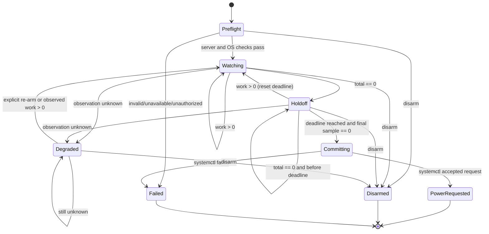

# OpenCode all-clear poweroff: independent v0 product assessment

## Situation

The requested product is a TypeScript CLI started before the user goes to bed. It observes OpenCode until all sessions, child sessions/subagents, and admitted work are complete, emits timestamped JSON count records for diagnosis, waits through a default ten-minute all-clear period, and then asks the operating system to power off. The user must be able to disarm it before the power request.

The safety asymmetry dominates the design: a false **busy** result only leaves a machine on, while a false **clear** result can terminate valuable work. Every unknown or partially observed condition must therefore be treated as not clear.

Research prompt for a follow-up implementation: _What smallest V2 server snapshot can authoritatively report all process-owned execution and durable/blocking work, and how can a Linux CLI preserve fail-closed behavior from observation through an inhibitor-aware `systemctl poweroff` request?_

## Product verdict

This is a useful and tractable Linux v0, but the honest product boundary is:

> Power off after one explicitly selected OpenCode V2 server reports no running drains, durable pending work, permission requests, or question requests continuously for the holdoff interval.

It must not claim to detect every OpenCode process on the host. The current active-session API reports only foreground drains owned by the server process serving the request; its own description says sessions absent from the response are inactive **for that process** ([`packages/protocol/src/groups/session.ts:198-206`](/packages/protocol/src/groups/session.ts#L198-L206)). Standalone servers, another release channel, remote servers, and jobs outside OpenCode are distinct observation domains.

The current repository is close but does not expose one sufficient all-clear observation. A correct implementation should first add a small aggregate read endpoint rather than making the CLI crawl all sessions.

## What “work” means in v0

Count these classes in one server snapshot:

| Count | Meaning | Why it gates poweroff |
| --- | --- | --- |
| `running` | Session drains in the process-local execution coordinator | This is actual model/tool execution. Child sessions are ordinary sessions with `parentID`, so active subagents are included without separately traversing the tree ([`packages/schema/src/session.ts:27-47`](/packages/schema/src/session.ts#L27-L47)). |
| `pending` | Durable unconsumed rows in `session_pending` | The endpoint contract calls these admitted inputs and unhandled compaction barriers; zero running does not prove zero pending ([`packages/protocol/src/groups/session.ts:509-519`](/packages/protocol/src/groups/session.ts#L509-L519)). |
| `permissions` | Unanswered permission requests | Human-blocked work is not complete merely because it is waiting ([`packages/protocol/src/groups/permission.ts:23-34`](/packages/protocol/src/groups/permission.ts#L23-L34)). |
| `questions` | Unanswered question requests | Same reasoning; these are explicitly pending requests ([`packages/protocol/src/groups/question.ts:20-30`](/packages/protocol/src/groups/question.ts#L20-L30)). |

`total = running + pending + permissions + questions`. All four must be zero.

Do not count historical session records. `session.list` is history, defaults to a newest-50 page in the HTTP handler, and supports parent filtering and cursor pagination ([`packages/protocol/src/groups/session.ts:45-55`](/packages/protocol/src/groups/session.ts#L45-L55), [`packages/server/src/handlers/session.ts:23-88`](/packages/server/src/handlers/session.ts#L23-L88)). Crawling every historical session and then requesting each pending list is slow, non-atomic, and race-prone.

### Required V2 read model

Add an endpoint conceptually equivalent to:

```ts
type WorkSnapshot = {
  serverInstance: string
  sequence: number
  observedAt: string
  counts: {
    running: number
    pending: number
    permissions: number
    questions: number
    total: number
  }
}
```

The server should assemble this snapshot, not the CLI. `running` comes from `SessionExecution.active`, whose interface explicitly says it snapshots execution owned by this process ([`packages/core/src/session/execution.ts:15-25`](/packages/core/src/session/execution.ts#L15-L25)); durable pending counts come from the database rather than one request per session. The existing `/api/session/active` handler merely converts that process-local set to a record ([`packages/server/src/handlers/session.ts:157-164`](/packages/server/src/handlers/session.ts#L157-L164)).

`serverInstance` must change on server process start. `sequence` must be monotonic within that instance. They let the CLI distinguish a repeated sample from a restarted server. Perfect atomicity between the in-memory coordinator and database is not required for v0 if the ten-minute interval is continuously resampled, but the endpoint should read all sources in one server operation and document its ordering.

If adding the endpoint is out of scope, relabel the experimental product “power off after no active drains” and do not present it as waiting for all work.

## Minimal state machine



Rules:

1. Use a monotonic clock for poll intervals and the holdoff deadline. Wall-clock timestamps are only for logs.
2. Enter `Holdoff` on the first complete zero snapshot. Poll throughout the holdoff.
3. Any nonzero snapshot cancels the old deadline and returns to `Watching`.
4. Any timeout, malformed response, authentication failure, server instance change, or sequence regression enters `Degraded`; it never advances the deadline.
5. Do not silently recover from `Degraded` on a zero snapshot. A server restart can lose process-local provider execution, and V2 explicitly says post-crash continuation requires a separate design ([`AGENTS.md:168`](/AGENTS.md#L168)). Recovery requires an explicit user re-arm, or observation of nonzero work followed by a fresh zero transition.
6. At holdoff expiry, fetch one final snapshot. Only a complete zero snapshot from the same server instance can enter `Committing`.
7. A final-sample race remains: new work can be admitted immediately after the sample. A strict guarantee eventually requires a server-side quiescence lease/admission gate. For a v0 intended for one sleeping user, the continuously sampled ten-minute quiet interval plus final check is a reasonable, explicitly documented compromise.
8. Disarm is accepted in every state before the power request is handed to systemd. Once `systemctl` has enqueued poweroff, cancellation is outside the v0 guarantee.

## CLI surface

Use a conspicuously destructive command rather than hiding poweroff behind a generic wait verb:

```text
opencode poweroff [--server URL] [--holdoff 10m] [--poll 5s] [--dry-run]
opencode poweroff status
opencode poweroff disarm
```

Behavior:

- Default to the already-running managed V2 service, but discover it without starting or replacing it. Existing `ServerConnection.resolve` calls `Service.ensure` when no explicit server is supplied, which can start a new empty server and create a false-clear domain ([`packages/cli/src/services/server-connection.ts:45-74`](/packages/cli/src/services/server-connection.ts#L45-L74)). The poweroff command needs discover-only behavior.
- Support `--server` using the established connection/auth pattern, but reject `--standalone`: a fresh private server cannot observe work in another process. Existing server arguments are defined centrally ([`packages/cli/src/commands/commands.ts:6-15`](/packages/cli/src/commands/commands.ts#L6-L15)).
- `--holdoff` defaults to `10m`; require a nonnegative bounded duration. If zero is allowed, print a prominent warning but still perform the final sample.
- `--poll` defaults to `5s`; require a sensible positive lower bound to avoid accidental server load.
- `--dry-run` executes the complete state machine and final check, emits `would_poweroff`, and exits without invoking systemd. It should still be disarmable.
- Permit only one armed watcher per user and observation domain. Store a mode-0600 control record below `$XDG_RUNTIME_DIR/opencode/` containing PID, process start identity, server URL hash, and random nonce. Create/lock it atomically and remove it on normal exit. Never put a server password in this file or logs.
- `status` reads the control record, verifies that the PID/start identity is live, and prints the latest safe status. `disarm` authenticates by same-user runtime-directory ownership and signals the watcher; stale files are reported and cleaned.
- `Ctrl-C` disarms interactively. `SIGTERM` also disarms, allowing `opencode poweroff disarm` and service managers to stop it.

### Sleep inhibition

By default, run the watcher under:

```text
systemd-inhibit --what=sleep:idle --mode=block \
  --who=OpenCode --why="Waiting for OpenCode work before poweroff" COMMAND
```

This prevents automatic idle/sleep from pausing the work overnight but deliberately does **not** inhibit shutdown, so the user can still power off and the watcher does not block its own final request. `systemd-inhibit` acquires its lock before launching the command and releases it afterward; `block` lasts until release, while `delay` is time-limited ([`systemd-inhibit(1)`](https://man7.org/linux/man-pages/man1/systemd-inhibit.1.html)). The systemd inhibitor design confirms that locks are represented by file descriptors and automatically release if the client dies ([systemd Inhibitor Locks](https://systemd.io/INHIBITOR_LOCKS/)).

If inhibition is unavailable or denied, emit `inhibitor_unavailable` and continue: upstream guidance says applications should not treat lock denial as fatal. This means the machine may suspend and resume before eventually reaching poweroff; document that degraded guarantee. An opt-out such as `--no-inhibit-sleep` is useful for systems where suspend is desired.

### Power request

Invoke exactly:

```text
systemctl poweroff --check-inhibitors=yes
```

Do not use `--force`, `-i`, or `--check-inhibitors=no`. The systemctl manual states that shutdown requests normally fail when inhibitor locks exist, that `--force` overrides them, and that `--check-inhibitors=yes` makes checking explicit ([`systemctl(1)`, `--check-inhibitors`](https://man7.org/linux/man-pages/man1/systemctl.1.html)). The command is asynchronous and returns after poweroff is enqueued, not after hardware power loss; `power_requested` therefore means “systemd accepted/enqueued the request,” not “machine powered off.”

Perform an early `systemctl poweroff --dry-run --check-inhibitors=yes` preflight to catch a missing executable and obvious authorization/configuration failures. It cannot promise that authorization or inhibitors will be unchanged ten minutes later. Do not open an unattended password prompt at commit time; inherit normal polkit behavior and fail safely if the command returns nonzero.

## Exit and error behavior

| Condition | Watcher exit | Poweroff? |
| --- | ---: | --- |
| Power request accepted/enqueued | `0` | Requested |
| `--dry-run` reaches would-poweroff | `0` | No |
| Remote `disarm` accepted | `0`; watcher exits `0` | No |
| Interactive `SIGINT` | `130` | No |
| `SIGTERM` | `143` | No |
| Usage/configuration/preflight error | `2` | No |
| Runtime invariant or `systemctl` failure | `1` | No |
| Observation failure after arming | Remain `Degraded` until disarmed/re-armed | No |

Initial server absence, wrong credentials, incompatible schema, unsupported OS, missing `systemd-inhibit` when explicitly required, or failed poweroff preflight must fail before arming. After arming, observation errors are not zero counts and must never start or complete holdoff.

The separate `disarm` command exits `0` only when it signals a verified live watcher (or the watcher is already observably disarmed); it exits `1` for stale/unreachable state and `2` for malformed usage.

## NDJSON observability contract

Write one JSON object per line to stdout. Human diagnostics and child-process stderr may go to stderr, but stdout must remain parseable NDJSON. Emit a sample on each poll and an event for each state transition.

```json
{
  "schema": 1,
  "ts": "2026-08-11T23:42:17.184Z",
  "elapsed_ms": 12531,
  "event": "sample",
  "state": "holdoff",
  "server_instance": "srv_01...",
  "sequence": 418,
  "counts": {
    "running": 0,
    "pending": 0,
    "permissions": 0,
    "questions": 0,
    "total": 0
  },
  "holdoff": {
    "duration_ms": 600000,
    "remaining_ms": 587469
  }
}
```

Required fields on every record: `schema`, RFC 3339 UTC `ts`, monotonic `elapsed_ms`, `event`, and `state`. Event-specific fields:

| Event | Additional fields |
| --- | --- |
| `armed` | sanitized server origin, `poll_ms`, `holdoff_ms`, `dry_run`, inhibitor status |
| `sample` | server instance, sequence, all counts, holdoff remaining when applicable |
| `state_changed` | `from`, `to`, `reason` |
| `observation_error` | stable error `code`, attempt, retry delay; no credentials or response bodies |
| `disarmed` | source: `sigint`, `sigterm`, or `command` |
| `inhibitor_unavailable` | stable error code and executable status |
| `would_poweroff` | final snapshot identity and counts |
| `power_request` | argv without environment/secrets |
| `power_requested` | child exit status and elapsed duration |
| `power_request_failed` | exit status/signal and bounded stderr |

Do not emit session IDs by default; counts satisfy the requested debug surface with less transcript metadata leakage. A future explicit verbose mode can add bounded IDs.

## Correctness hazards

1. **Active is narrower than all work.** The coordinator map contains executions only; `awaitIdle` returns immediately when no process-local execution exists ([`packages/core/src/session/run-coordinator.ts:137-146`](/packages/core/src/session/run-coordinator.ts#L137-L146)). Durable admitted rows can still exist and are independently listed from `session_pending` ([`packages/core/src/session/pending.ts:377-385`](/packages/core/src/session/pending.ts#L377-L385)).
2. **Multi-process false clear.** One server cannot report another standalone, remote, or channel-specific server. Scope selection must be explicit and logged.
3. **Auto-start false clear.** Reusing normal CLI connection resolution can create an empty managed server. Use discovery, never ensure/start/replace.
4. **Pagination/non-atomic crawl.** Listing historical sessions and querying each can omit sessions created between pages and imposes unbounded work. Add the aggregate endpoint.
5. **Server restart and lost execution.** Process-local drains disappear on crash. A fresh server returning zero is not proof of completion; instance changes enter `Degraded`.
6. **Zero-to-power race.** New admission can occur after the final sample. Holdoff reduces but cannot eliminate it; strict semantics need a quiescence lease or admission gate.
7. **Wall-clock changes.** NTP or manual clock changes must not shorten holdoff. Use monotonic time for decisions.
8. **Suspend before completion.** Take `sleep:idle`, not `shutdown`, inhibition. If unavailable, report the weaker guarantee.
9. **Self-inhibition.** Inhibiting `shutdown` and then invoking ordinary `systemctl poweroff` can make the final action fail. Never take that lock.
10. **Inhibitor override.** `--force` and `-i` defeat other applications' safety locks. Do not expose them in v0.
11. **Asynchronous success semantics.** Exit zero from `systemctl poweroff` means enqueued, not physically off.
12. **Disarm PID reuse.** A PID-only control file can signal an unrelated process. Verify process start identity plus nonce and runtime-file ownership.
13. **Stale control state.** Crash cleanup is not guaranteed. `status` and `disarm` must detect stale records; startup may replace only a verified stale record.
14. **Signal race at commit.** Block/serialize disarm handling around the single transition that spawns `systemctl`; log whether disarm won. Never spawn twice.
15. **Output corruption/secrets.** Serialize writes through one logger and sanitize URLs, headers, passwords, child stderr, and server payloads.

## Test strategy

### Pure state-machine tests

Inject a monotonic fake clock, snapshot stream, disarm signal, logger, inhibitor adapter, and power adapter. Table-test:

- busy, then zero for less than holdoff: no power request;
- zero for exactly the holdoff plus final zero: one request;
- work reappears one tick before expiry: deadline resets;
- work appears during the final fetch: return to watching;
- each individual count being nonzero blocks clear;
- malformed/missing count is unknown, never coerced to zero;
- observation error during holdoff enters degraded and cannot preserve the old deadline;
- server instance change and sequence regression enter degraded;
- monotonic time advances while wall time jumps backward/forward;
- disarm wins in every pre-commit state;
- simultaneous disarm/commit has one deterministic winner and at most one spawn;
- dry run emits `would_poweroff` and never calls the power adapter.

Property tests are worthwhile for the central invariant: for every generated trace, `power_request` implies a same-instance uninterrupted zero interval at least `holdoff_ms` long and an immediately preceding complete zero snapshot.

### CLI and transport tests

- Run the TypeScript entrypoint directly with a fake HTTP server implementing the snapshot route.
- Verify discover-only mode does not start a service when registration is absent.
- Verify `--standalone` rejection, duration parsing, non-TTY operation, auth failure, timeout, incompatible schema, and bounded retries.
- Parse every stdout line as JSON and validate schema/order; assert no configured password or Authorization value appears.
- Spawn the watcher as a child, send `SIGINT`/`SIGTERM`, and exercise `status`/`disarm` through a temporary `XDG_RUNTIME_DIR`.
- Test stale files, wrong owner/mode where feasible, PID reuse metadata mismatch, duplicate watcher rejection, and atomic cleanup.

### V2 integration tests

Against the real core/server layers, create root and child sessions and independently establish running drains, durable pending rows, permission requests, and question requests. Assert the aggregate snapshot counts each exactly once and transitions only after the real subsystem settles. Include concurrent admission while snapshots are read and a coalesced wake; coordinator wakeups deliberately coalesce and active execution spans successor work ([`packages/core/src/session/run-coordinator.ts:117-125`](/packages/core/src/session/run-coordinator.ts#L117-L125)).

Run tests from their package directories, not the repository root, per repository policy ([`AGENTS.md:150-158`](/AGENTS.md#L150-L158)).

### Systemd boundary tests

- Never execute a real poweroff in automated tests. Put a recording fake `systemctl` and `systemd-inhibit` first on `PATH`, or inject absolute executable adapters.
- Assert exact safe argv: `poweroff --check-inhibitors=yes`; reject force/ignore-inhibitor arguments.
- Test zero/nonzero exit, signal termination, bounded stderr capture, missing executable, and asynchronous accepted semantics.
- On a disposable systemd VM/container, manually verify the watcher appears in `systemd-inhibit --list`, inhibits only `sleep:idle`, releases on disarm/crash, respects a separate shutdown inhibitor, and reaches a mocked power target.

## Minimal delivery order

1. Add and test the aggregate V2 work snapshot, including server instance identity and sequence.
2. Implement the pure observer/holdoff state machine and NDJSON records with fake adapters.
3. Add the CLI command, discover-only connection, runtime control file, status, and disarm.
4. Add best-effort `sleep:idle` inhibition and safe `systemctl` poweroff adapter.
5. Run package-level typecheck/tests and disposable-host systemd verification.

## References

- V2 active-session API: [`packages/protocol/src/groups/session.ts:198-206`](/packages/protocol/src/groups/session.ts#L198-L206)
- V2 process-local execution contract: [`packages/core/src/session/execution.ts:15-25`](/packages/core/src/session/execution.ts#L15-L25)
- V2 coordinator active/idle behavior: [`packages/core/src/session/run-coordinator.ts:117-146`](/packages/core/src/session/run-coordinator.ts#L117-L146)
- V2 durable pending-work API: [`packages/protocol/src/groups/session.ts:509-519`](/packages/protocol/src/groups/session.ts#L509-L519)
- V2 permission and question requests: [`packages/protocol/src/groups/permission.ts:23-34`](/packages/protocol/src/groups/permission.ts#L23-L34), [`packages/protocol/src/groups/question.ts:20-30`](/packages/protocol/src/groups/question.ts#L20-L30)
- V2 service discovery/auto-start behavior: [`packages/cli/src/services/server-connection.ts:45-74`](/packages/cli/src/services/server-connection.ts#L45-L74)
- Primary systemd inhibitor design: [systemd Inhibitor Locks](https://systemd.io/INHIBITOR_LOCKS/)
- Upstream manual source: [`systemd/systemd` `systemd-inhibit.xml`](https://github.com/systemd/systemd/blob/main/man/systemd-inhibit.xml)
- Rendered upstream manual: [`systemd-inhibit(1)`](https://man7.org/linux/man-pages/man1/systemd-inhibit.1.html)
- Upstream manual source: [`systemd/systemd` `systemctl.xml`](https://github.com/systemd/systemd/blob/main/man/systemctl.xml)
- Rendered upstream manual: [`systemctl(1)`](https://man7.org/linux/man-pages/man1/systemctl.1.html)
