# OpenCode All-Clear Poweroff Initial Synthesis

## Executive Verdict

The Linux shutdown side is already well designed by systemd. On this host
(systemd 261), `systemctl poweroff --when=+10min` schedules a logind-managed
poweroff; `--when=show` inspects it and `--when=cancel` disarms it. The older
`shutdown +10`, `shutdown --show`, and `shutdown -c` commands operate on the same
logind schedule. A custom timer unit would discard useful built-in behavior and
should not be the v0 default.

The OpenCode side cannot currently satisfy the requested certainty. The best
public snapshot, `GET /api/session/active`, covers process-owned foreground
Session drains and therefore active child subagents, but not durable inboxes,
background Jobs, all Location shells and PTYs, completion handoffs, other
OpenCode server processes, or new admissions after the final read.

The right project split is:

1. Build an explicitly **best-effort, fail-closed observer** as the external
   TypeScript v0.
2. Add a bounded aggregate activity snapshot to V2 before calling the result
   broadly reliable.
3. Add a server-side quiescence lease/admission fence before using the word
   **certain**.

## What v0 Can Promise

Recommended wording:

> Power off after one selected OpenCode V2 server has remained observably clear
> under the public API for the holdoff interval.

It cannot promise that every OpenCode process on the host is clear. Managed
stable/preview channels, standalone servers, explicit remote servers, and
unregistered plugin fibers are separate observation domains.

Unknown always means busy. Transport failure, malformed data, event-stream
loss, server replacement, authorization failure, or inability to cancel a
scheduled shutdown must never be converted to a zero count.

## Recommended State Machine

```mermaid
stateDiagram-v2
  [*] --> Preflight
  Preflight --> Watching: server and logind checks pass
  Preflight --> Failed: unavailable or unauthorized
  Watching --> Watching: blockers > 0
  Watching --> Holdoff: complete snapshot is zero
  Holdoff --> Watching: work resumes; cancel schedule
  Holdoff --> Watching: observation unknown; cancel schedule
  Holdoff --> Committing: deadline and final zero snapshot
  Committing --> Requested: logind owns poweroff
  Watching --> Disarmed: SIGINT, SIGTERM, or disarm command
  Holdoff --> Disarmed: cancel schedule, then exit
  Failed --> [*]
  Disarmed --> [*]
  Requested --> [*]
```



Rules:

1. Subscribe first, then take authoritative snapshots. SSE is a low-latency
   invalidation signal, never the source of truth.
2. Use a monotonic clock for holdoff decisions and UTC wall time only for logs.
3. Reset the full holdoff whenever any blocker appears.
4. While a native shutdown is scheduled, keep observing. Work or uncertainty
   must synchronously cancel the logind schedule before state returns to
   `Watching`.
5. At expiry, require a final same-instance zero snapshot.
6. Serialize signal handling, schedule, and cancel operations so disarm and
   commit have one deterministic winner.
7. Refuse to overwrite a pre-existing logind shutdown schedule. Before
   cancelling, verify the current type and deadline still match the schedule
   this process armed.

## Holdoff Ownership Tradeoff

There are two valid v0 choices. They have different crash semantics.

| Choice | Behavior | Advantage | Failure mode |
| --- | --- | --- | --- |
| CLI-owned holdoff | Observe zero for 10 minutes, then request immediate poweroff | Fail-closed if the CLI crashes; no shutdown remains armed | No native countdown, scheduled-state D-Bus, or standard advance wall warnings |
| logind-owned holdoff | At zero, schedule `poweroff --when=+10min`; monitor and cancel on resumed work | Standard schedule, wall warnings, `/run/nologin`, query/cancel interoperability | If the watcher crashes after arming, logind still powers off |

The safety asymmetry favors **CLI-owned holdoff as the default first release**:
a crash leaves the computer on. The user explicitly expressed interest in
systemd scheduling, so logind-owned holdoff is a valuable opt-in once watcher
supervision and crash recovery are tested. If the initial implementation uses
native scheduling anyway, document the fail-open crash behavior prominently
and keep `systemctl poweroff --when=cancel` as the universal escape hatch.

This is the main tension between the independent product and systemd studies:
the systemd mechanism is excellent at reliably executing a schedule, while the
product's most important invariant is avoiding shutdown when observation is no
longer reliable.

## systemd Integration

For native scheduling on this host:

```sh
systemctl poweroff \
  --when=+10min \
  --check-inhibitors=yes \
  --message="OpenCode is all clear; cancel with systemctl poweroff --when=cancel"

systemctl poweroff --when=show
systemctl poweroff --when=cancel
```

Use `shutdown +10`, `shutdown --show`, and `shutdown -c` as the compatibility
frontend on systemd versions older than 254. Do not use `--force`, `-i`, or
`--check-inhibitors=no`.

Native scheduling provides:

- one system-global logind schedule;
- standard cancellation and inspection;
- periodic wall messages to terminal users;
- a custom shutdown reason;
- `/run/nologin` beginning five minutes before shutdown;
- normal inhibitor enforcement;
- the D-Bus `ScheduledShutdown` property and
  `CancelScheduledShutdown()` method.

It does not guarantee a graphical desktop notification. `notify-send` can be a
best-effort addition from the user's session. `PrepareForShutdown(true)` is an
imminent-shutdown hook, not a substitute for the ten-minute disarm window.

Do not create a timer unit merely to call `systemctl poweroff`. A transient
timer is useful only if custom wake-from-suspend or service orchestration is a
real requirement. It does not automatically inherit logind's scheduled
shutdown warning behavior.

### Running Before Bed

The smallest v0 is a foreground process in the invoking terminal. `Ctrl-C` is
then the clearest disarm path, and the process retains the user's active-session
polkit context.

An optional transient user service can detach it from the terminal:

```sh
systemd-run --user --unit=openallclear --collect --same-dir \
  node src/cli.ts --holdoff 10m
```

This needs explicit testing. A user unit normally ends after the last logout
unless lingering is enabled, and a user-service process may receive different
polkit treatment from a process in an active desktop session. Do not install a
permanent system unit for v0 until those authorization and cancellation paths
are proven on the target machine.

To prevent automatic suspend from pausing OpenCode work overnight, optionally
run under a `sleep:idle` inhibitor. Never inhibit `shutdown`, because that can
block the final action:

```sh
systemd-inhibit --what=sleep:idle --mode=block \
  --who=OpenCode --why="Waiting for OpenCode work" \
  node src/cli.ts
```

## Observation Model

Until V2 gains an aggregate endpoint, report separate blocker counts rather
than one unexplained number:

```json
{
  "ts": "2026-08-11T23:42:17.184Z",
  "event": "sample",
  "state": "holdoff",
  "counts": {
    "session_executions": 0,
    "pending_inputs": 0,
    "running_shells": 0,
    "running_ptys": 0,
    "permissions": 0,
    "questions": 0,
    "forms": 0,
    "unobservable_jobs": null,
    "total_observed": 0
  },
  "holdoff_remaining_ms": 587469
}
```

`unobservable_jobs: null` is important: writing zero would claim knowledge the
public API does not provide. In normal mode, concise human status can go to the
terminal. Under `--debug`, emit NDJSON with an RFC 3339 timestamp, monotonic
elapsed time, state, event, all counts, selected server instance, and holdoff
remaining. Never log credentials, prompts, command output, or Session IDs by
default.

## Required V2 Work

The first upstream change should be an aggregate activity endpoint with one
server instance ID, monotonic generation, and counts for Session execution,
durable inboxes, Jobs, shells, PTYs, request waits, and completion-notification
fibers. This removes the unbounded cross-product crawl and makes debug output
meaningful.

The certainty feature is a second, stronger operation: acquire an
instance-bound quiescence lease that atomically closes admission, waits for all
registered blockers to drain, and remains held until released. A final `GET`
snapshot cannot provide this property, regardless of polling frequency.

The lease must either include every plugin-owned fiber that can mutate Session
state or require plugins to register such work. Server replacement invalidates
the lease and must abort poweroff.

## Minimal Delivery Sequence

1. Define the exact blocker policy, especially durable `resume:false` inputs
   and PTYs.
2. Prototype the external observer using discover-only service access,
   `session.active`, subscribe-before-snapshot SSE, and conservative
   reconciliation.
3. Implement the pure state machine and NDJSON contract with fake clocks,
   server snapshots, signals, and power adapters.
4. Ship CLI-owned holdoff first; add native scheduled holdoff as an explicit
   mode after crash/disarm tests.
5. Add the V2 aggregate activity endpoint.
6. Add the admission-fencing quiescence lease if certainty remains the goal.

## Open Decisions

- Do durable admitted inputs with `resume: false` block shutdown, even though
  they are intentionally not executing?
- Do interactive PTYs block shutdown?
- Is one managed service channel sufficient, or must the product discover
  multiple local server profiles?
- Should native scheduled holdoff be the initial default despite its watcher
  crash behavior?
- Is a graphical notification required, or are terminal wall warnings and a
  visible foreground countdown sufficient?

## Source Documents

- [`/.design/init/init0-opencode.explore.md`](/.design/init/init0-opencode.explore.md)
- [`/.design/init/init0-systemd.glm52.md`](/.design/init/init0-systemd.glm52.md)
- [`/.design/init/init0-product.general.md`](/.design/init/init0-product.general.md)

## Cross-References

- [`/docs/design/service-lifecycle.md`](/docs/design/service-lifecycle.md)
  explicitly leaves provider attempts, shells, subagents, and background-job
  continuity outside the current lifecycle design.
- [`/AGENTS.md`](/AGENTS.md) describes process-local Session drains and the
  absence of automatic post-crash continuation, which is why a server restart
  invalidates an all-clear attempt.
