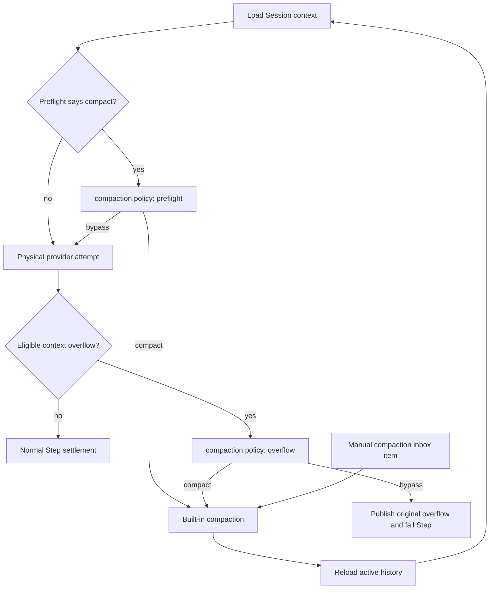

# Session-scoped automatic compaction control for OpenQuarter

## What Is Up

The first OpenQuarter investigation targeted `Agent.Info.steps`. That is the
wrong control. Agent Step ceilings stop an execution loop; they do not control
when OpenCode replaces active model context with a lossy checkpoint.

The desired behavior is narrower:

> Let one Session continue with its full active history after OpenCode's
> proactive compaction heuristic fires, while preserving an explicit choice
> about what happens if the provider later rejects the request as too large.

The new [`opencode-openquarter`](file:///home/rektide/src/opencode-openquarter)
workspace is therefore a Core-seam investigation. Nothing from the proxy-Agent
design should be carried over.

Research prompt:

> Where should OpenCode V2 expose automatic compaction policy so an Effect
> plugin can veto preflight compaction for one Session, optionally veto
> overflow recovery, leave manual compaction intact, and avoid mutating shared
> Agent or model definitions?

## Decision

Add one narrow, effectful Session hook at the two automatic compaction action
points:

```ts
ctx.session.hook("compaction.policy", (event) =>
  Effect.sync(() => {
    if (shouldBypass(event.sessionID, event.trigger)) {
      event.decision = { compact: false }
    }
  }),
)
```

The hook receives the Session, Agent, selected model, automatic trigger, and a
mutable default decision:

```ts
export type SessionCompactionDecision =
  | { readonly compact: true }
  | { readonly compact: false }

export interface SessionCompactionPolicy {
  readonly sessionID: Session.ID
  readonly agent: Agent.ID
  readonly model: Model.Ref
  readonly trigger: "preflight" | "overflow"
  decision: SessionCompactionDecision
}

export interface SessionHooks {
  // Existing hooks omitted.
  readonly "compaction.policy": SessionCompactionPolicy
}
```

This is a veto seam, not a replacement compaction engine. Core asks only when
it already has an eligible automatic compaction proposal, with
`decision: { compact: true }`. Hooks run in plugin order and the final decision
wins, matching the existing mutable [`session.retry`
hook](/packages/plugin/src/effect/session.ts#L56-L74).

This proposal deliberately does not run a policy hook on every ordinary Step
and does not let a plugin force compaction when Core did not propose it. That
keeps plugin work off the normal model-call path and avoids publishing the
unstable threshold calculation. A plugin that wants earlier compaction should
request manual compaction through the existing Session operation. If a second
real use case later needs custom thresholds, the richer assessment interface
described below can extend this seam.

A monotonic `disarm()` callback is a viable alternative decision shape. The
mutable decision is preferred here because it follows current hook composition:
later hooks see and may intentionally override earlier policy. Changing to a
monotonic veto would not change the seam placement or trigger contract.

Core asks separately for each eligible proposal. A preflight veto is not
reused as the overflow decision for that Physical Attempt; this separation is
what lets `defer` bypass the heuristic while retaining reactive recovery.

OpenQuarter should expose three plugin-owned modes:

| Mode | Preflight proposal | Eligible provider overflow | Result |
| --- | --- | --- | --- |
| `normal` | Allow | Allow | Current OpenCode behavior |
| `defer` | Veto | Allow | Keep full context until the provider proves it does not fit, then use built-in recovery |
| `off` | Veto | Veto | Never compact automatically; a real overflow becomes the original terminal provider error |

`defer` should be OpenQuarter's primary mode. It extends useful Session life
without throwing away the existing overflow safety net. `off` is an explicit
expert choice, not a promise that an oversized request can succeed.

## Current Control Map

V2 has three separate routes into compaction:

| Route | Current gate | Action | Desired hook behavior |
| --- | --- | --- | --- |
| Preflight | `compaction.required(...)` before a Physical Attempt | Generate checkpoint, reload active history, retry the same logical Step | Hook before the first compaction event or summary request |
| Overflow recovery | First eligible provider `context-overflow`, before durable assistant output | Generate checkpoint and retry the same logical Step once | Hook before invoking the recovery compaction |
| Manual | Durable compaction inbox control | Compact at a safe drain boundary | Never invoke the automatic-policy hook |

The call sites are adjacent in the runner, not hidden in providers:

- preflight: [`runner/llm.ts:182-193`](/packages/core/src/session/runner/llm.ts#L182-L193);
- overflow recovery closure: [`runner/llm.ts:214-235`](/packages/core/src/session/runner/llm.ts#L214-L235);
- manual control: [`runner/llm.ts:76-127`](/packages/core/src/session/runner/llm.ts#L76-L127).



### What Works Today

Static configuration can already disable automatic compaction for an entire
Location:

```jsonc
{
  "compaction": {
    "auto": false,
  },
}
```

In the reviewed source, `auto: false` makes
[`SessionCompaction.required`](/packages/core/src/session/compaction.ts#L364-L388)
return false and makes
[`SessionCompaction.enabled`](/packages/core/src/session/compaction.ts#L420-L427)
false. The overflow closure checks `compaction.enabled()` before recovery, so
this disables both automatic routes. Manual compaction still works, as covered
by [`config/compaction.test.ts:54-103`](/packages/core/test/config/compaction.test.ts#L54-L103).

This is the immediate workaround when Location-wide policy is acceptable. It
does not require a plugin or a Core patch.

Omitting custom model limits is not another way to disable preflight. Valid
models always have context and output limits, and upserted models default to
`context: 200000` and `output: 32000`
([`schema/model.ts:99-139`](/packages/schema/src/model.ts#L99-L139)). Only the
optional input limit can be absent.

### What Plugins Cannot Do Today

The public Effect Context exposes Session prompt, request, response, context,
and retry hooks, but no compaction policy hook and no compaction domain
([`effect/session.ts:67-93`](/packages/plugin/src/effect/session.ts#L67-L93),
[`effect/plugin.ts:24-49`](/packages/plugin/src/effect/plugin.ts#L24-L49)).

Every existing interception point is misplaced for this job:

| Existing surface | Why it is insufficient |
| --- | --- |
| `session.prompt` | Runs at admission, before the eventual model and context pressure are known |
| `session.context` | Runs in `context.prepare(...)`, after the runner has already chosen preflight compaction |
| `session.model.request` | Mutates a request only after preflight compaction has been bypassed or completed |
| `session.http.response` | Sees a physical response; replacing an overflow response cannot make an invalid oversized request succeed |
| `session.retry` | Overflow has its own recovery branch and is excluded from generic retry policy |
| public events | `session.compaction.started` is an observation after the decision and cannot cancel it |
| `catalog.transform` | Can lie about a model's context limit, but is Location-wide and does not independently disable overflow recovery |

The ordering is explicit: preflight occurs at runner line 188, while request
preparation and Session context hooks begin at line 202
([`runner/llm.ts:178-213`](/packages/core/src/session/runner/llm.ts#L178-L213)).

## Primary Suggestion: One Policy Hook

### Place The Seam In SessionRunner

Keep threshold calculation and checkpoint generation inside the existing deep
`SessionCompaction` module. Put the new seam in `SessionRunner`, which already
owns orchestration between compaction, provider attempts, retries, and durable
settlement.

Do not inject plugin policy into `SessionCompaction.required()`. That method is
currently synchronous and reusable in configuration tests. The runner has all
of the public identity required by a Session policy and already owns both
automatic action points.

Conceptual runner helper:

```ts
const allowsAutomaticCompaction = Effect.fnUntraced(function* (
  loaded: SessionContext.Loaded,
  trigger: "preflight" | "overflow",
) {
  const event = yield* hooks.trigger("session", "compaction.policy", {
    sessionID: loaded.session.id,
    agent: loaded.agent.id,
    model: loaded.model.ref,
    trigger,
    decision: { compact: true },
  })
  return event.decision.compact
})
```

Preflight becomes conceptually:

```ts
if (
  compaction.required(compactionInput) &&
  (yield* allowsAutomaticCompaction(loaded, "preflight"))
) {
  const compacted = yield* compaction.compact(compactionInput)
  // Existing outcome handling remains unchanged.
}
```

Overflow recovery becomes conceptually:

```ts
recoverOverflow: Effect.suspend(() =>
  recoverOverflow && compaction.enabled()
    ? allowsAutomaticCompaction(loaded, "overflow").pipe(
        Effect.flatMap((allowed) =>
          allowed
            ? compaction.compact(compactionInput).pipe(
                Effect.map((result) => result.status === "completed"),
              )
            : Effect.succeed(false),
        ),
      )
    : Effect.succeed(false),
)
```

Returning `false` from the existing recovery Effect already has the correct
meaning: [`SessionStep`](/packages/core/src/session/runner/step.ts#L145-L153)
publishes and settles the original overflow instead of reporting a synthetic
success.

### Hook Invariants

The public contract should state all of these explicitly:

1. The hook is called only for automatic proposals that Core would otherwise execute.
2. `preflight + compact:false` proceeds to the unchanged provider request.
3. `overflow + compact:false` preserves the original provider failure; it does not retry unchanged context.
4. Manual compaction never calls this hook.
5. The hook runs before `session.compaction.started` and before any compaction summary request.
6. A hook may run repeatedly across Steps or retries; callbacks must be idempotent.
7. Hooks run sequentially in plugin order, and the last mutation wins.
8. Provider-scoped registration is supported because the event includes `model`.
9. Disabling or unloading the plugin restores Core's default decision without rewriting Session state.
10. Core configuration remains an outer gate: this veto cannot override `compaction.auto:false` to force compaction.

The runner already waits for Location plugin readiness before loading the first
Step ([`runner/llm.ts:47-61`](/packages/core/src/session/runner/llm.ts#L47-L61)),
so a normally loaded policy hook is present before any proposal can fire.

### OpenQuarter Becomes Small

With this seam, OpenQuarter needs no Agent proxies, model-limit mutation, or
request forgery. Its implementation can be one command/state module and one
hook:

```ts
type Mode = "normal" | "defer" | "off"

yield* ctx.session.hook("compaction.policy", (event) =>
  ctx.storage.get(`session/${event.sessionID}`).pipe(
    Effect.flatMap((value) =>
      Effect.sync(() => {
        const mode: Mode = decodeMode(value)
        if (mode === "off" || (mode === "defer" && event.trigger === "preflight")) {
          event.decision = { compact: false }
        }
      }),
    ),
  ),
)
```

The sketch intentionally reads durable plugin storage at the rare proposal
boundary instead of trusting a Location-local cache. Server plugin storage is
namespaced by plugin ID but shared across Location instances; a Session ID in
the key preserves behavior if that Session moves. Commands can set `defer`,
set `off`, inspect the mode, or remove the key to restore `normal`.

This is a deep module split:

- Core owns trigger calculation, provider classification, compaction execution,
  retry limits, event ordering, and fallback semantics.
- The plugin owns only user policy: which Session may bypass which automatic
  proposal.
- The interface carries five facts and one mutable decision. Deleting the hook
  would force every plugin back into unsafe shared-state or transport hacks.

### Core Change Surface

| File | Change |
| --- | --- |
| [`packages/plugin/src/effect/session.ts`](/packages/plugin/src/effect/session.ts) | Add `SessionCompactionPolicy`, decision type, and the hook key |
| [`packages/plugin/src/promise/session.ts`](/packages/plugin/src/promise/session.ts) | Mirror the public type exactly |
| [`packages/core/src/session/runner/llm.ts`](/packages/core/src/session/runner/llm.ts) | Acquire `PluginHooks.Service`; ask the hook at both automatic action points |
| [`packages/core/src/session/runner/llm.ts`](/packages/core/src/session/runner/llm.ts#L294-L310) | Add `PluginHooks.node` to runner dependencies |
| [`packages/core/test/session-runner.test.ts`](/packages/core/test/session-runner.test.ts) | Cover preflight and overflow decisions plus manual non-interference |
| [`packages/core/test/plugin-session.types.ts`](/packages/core/test/plugin-session.types.ts) | Compile-check Effect and Promise registration and provider scoping |
| [`packages/plugin/src/README.md`](/packages/plugin/src/README.md#L80-L108) | Add the compact hook example to the package-level runtime-hook contract |
| [`packages/www/src/docs/content/build/plugins/index.mdx`](/packages/www/src/docs/content/build/plugins/index.mdx#L1002-L1062) | Document timing, repeated invocation, and veto outcomes |

No Schema, Protocol, Server `HttpApi`, database, durable event, or generated
client change is needed. The generic hook registry, PluginHost adapter, and
Promise adapter already forward new `SessionHooks` keys.

Do not add a durable event for a veto in the first patch. The plugin's durable
mode is the source of policy, while existing Session events remain facts about
compactions that actually started. Annotate the runner span with the trigger
and final decision if Core-level diagnostics are needed.

### Acceptance Tests

1. A preflight proposal without a hook still compacts exactly as today.
2. A preflight veto sends the original request, creates no compaction record, and does not emit `session.compaction.started`.
3. Session A can veto while concurrent Session B follows default policy.
4. `defer` vetoes preflight, then permits one overflow compaction and same-Step rebuild.
5. An overflow veto makes exactly one provider attempt, creates no compaction record, and surfaces the original overflow.
6. A second overflow remains terminal without another policy proposal after the one recovery allowance is consumed.
7. Manual compaction succeeds while the Session's automatic policy is vetoed and never invokes the hook.
8. Two registered policy hooks observe prior mutations and the final decision wins.
9. Provider-scoped hooks run only for the selected provider in both Effect and Promise plugin flavors.
10. Existing automatic-compaction, overflow-recovery, retry, and manual-inbox tests remain unchanged and green.
11. `compaction.auto:false` invokes no automatic-policy hook because Core has no eligible proposal.

The strongest existing fixtures are the automatic and overflow scenarios near
[`session-runner.test.ts:2310-2600`](/packages/core/test/session-runner.test.ts#L2310-L2600)
and the disabled-overflow case at
[`session-runner.test.ts:2483-2507`](/packages/core/test/session-runner.test.ts#L2483-L2507).

## Secondary Ideas

### 1. Expose `ctx.session.compact`

The generated Session client already has a typed `compact` operation
([`client/effect/api/api.ts:300-306`](/packages/client/src/effect/api/api.ts#L300-L306)),
but the plugin Session domain omits it. Exposing that existing operation would
let OpenQuarter offer a deliberate "compact now" command after a long deferred
run instead of telling users to invoke the built-in UI action.

This is a useful companion capability, not a substitute for the policy hook.
It requires plumbing through PluginRuntime, PluginHost, the Effect/Promise
Session domain picks, and the Promise adapter, but no new Protocol operation.

### 2. Add A Native Durable Session Policy

If per-Session compaction becomes a first-party OpenCode feature, persist a
native policy such as `normal | defer | off` through a Session operation and a
minimal durable event. Core could then apply it without a plugin being loaded,
and every client could display the active policy.

This is a stronger product interface but a much larger first seam: Schema,
projection, Protocol, Server, generated clients, migration semantics, fork
inheritance, and UI all become contract. Plugin storage is sufficient to prove
the behavior before promoting it into Session state.

### 3. Split Static Preflight And Overflow Configuration

The current `compaction.auto` boolean controls both automatic paths in source.
A static configuration split would permit Location-wide policies such as:

```jsonc
{
  "compaction": {
    "preflight": false,
    "overflow": true,
  },
}
```

This would make `defer` available without a plugin, but it remains
Location-wide and cannot express temporary or Session-specific intent. Existing
`auto` configuration would need an explicit compatibility mapping.

### 4. Expose A Rich Compaction Assessment Later

A future hook could expose preflight usage, calculated ceiling, model limits,
and overflow classification. That would support custom thresholds and explain
why Core proposed compaction.

Do not freeze that interface in the first patch. The current heuristic and its
documentation disagree, so publishing its intermediate fields now would turn
an unstable implementation into a compatibility obligation. Begin with the
binary veto; add assessment data only after Core names and tests the metric. A
general `compaction.decide` hook invoked on every Step could then support both
earlier forced compaction and veto, but that larger hot-path contract is not
needed for OpenQuarter.

### 5. Restore Summary Customization Separately

V1 had `experimental.session.compacting`, which could replace the summary
prompt or append context. The historical implementation called it inside
compaction processing, after the trigger had already fired
([`guided-compactor.ts`](file:///home/rektide/src/opencode/.opencode/plugin/guided-compactor.ts),
[`V1 compaction hook`](file:///home/rektide/src/opencode/packages/opencode/src/session/compaction.ts#L129-L144)).

A V2 summary-preparation hook may still be useful, but it solves checkpoint
quality rather than trigger policy. Keep it separate from
`compaction.policy` so a veto does not require constructing summary inputs.

### 6. Expose The Internal Compaction Transform Only For Broad Policy

`SessionCompaction` already has a Location-scoped `State.Transformable` with
`auto`, `buffer`, and retained-token settings
([`compaction.ts:57-65,237-253`](/packages/core/src/session/compaction.ts#L57-L65)).
It could be surfaced as `ctx.compaction.transform` with little Core logic.

That interface is shallow for OpenQuarter. Static config already controls the
same values, and transform mutation would affect every concurrent Session in
the Location. It is reasonable only if another real adapter needs dynamic
Location-wide policy.

## Rejected Approaches

### Agent Proxies

Agent proxies alter identity to smuggle unrelated policy through
`Agent.Info`. Compaction does not read an Agent compaction field, so this would
still require falsifying model limits or changing shared configuration. It also
creates persistence, fork, reload, and permission-ordering problems with no
leverage at the actual trigger. Reject it completely.

### Falsifying Catalog Context Limits

A catalog transform can raise `Model.Info.limit.context` enough to suppress
preflight. It changes all Sessions using that model in the Location, makes
telemetry and other context decisions dishonest, and leaves provider-overflow
recovery enabled. Setting context to `0` produces a particularly tempting
Location-wide approximation of `defer`: preflight treats the limit as unknown,
while classified overflow recovery remains armed when `auto` is true. It also
removes truthful context sizing from every Session, the TUI, and ACP consumers.
These are diagnostic experiments, not a plugin design.

### Moving Or Reusing `session.context`

Moving context hooks ahead of preflight would run request-mutating callbacks
for requests that may never dispatch and may run them again after compaction.
It also overloads a transcript/request interface with execution policy. A
dedicated proposal hook is smaller and has clearer timing.

### Cancelling From Events

Compaction events are published from `SessionCompaction.execute`; by then Core
has committed to summary generation. Event subscribers are observers and can
miss volatile events. They are not a cancellation seam.

### Importing Core Internals From A Plugin

An external plugin should not import `SessionCompaction.Service` and reach into
the host Effect graph. The service is not in the plugin effect environment,
the dependency direction is wrong, and package identity can differ from the
host's loaded module. Expose one supported hook instead.

### Rewriting Overflow Responses

An HTTP response hook can alter bytes, but it cannot make an over-limit prompt
valid or manufacture trustworthy assistant output. It also cannot affect the
preflight branch. Preserve the provider's real error when recovery is vetoed.

## Hard Limit: What "Keep Going" Means

OpenQuarter can bypass a conservative OpenCode trigger. It cannot exceed the
provider's actual context capacity with the same model-visible request.

After preflight is vetoed, one of three things happens:

1. The provider accepts the request, proving the catalog/headroom heuristic was conservative for this call.
2. `defer` mode receives an eligible overflow, permits built-in compaction, and retries once.
3. `off` mode, an ineligible overflow, or a second overflow surfaces a terminal error.

"Eligible" matters. Recovery requires an error that OpenCode classifies as
`context-overflow` before text, reasoning, or tool input starts. Payload-size
errors and unrecognized provider failures bypass recovery. Some provider
protocols can normalize a context-related condition to an ordinary `length`
finish instead; for example, Anthropic currently maps
`model_context_window_exceeded` that way
([`anthropic-messages.ts:1063-1068`](/packages/ai/src/protocols/anthropic-messages.ts#L1063-L1068)).
OpenQuarter must describe overflow recovery as a best available safety net, not
as a universal provider guarantee.

Continuing beyond a real limit requires changing the request: manual or
automatic compaction, deterministic history trimming, a larger-context model,
or a future provider-native continuation mechanism. A policy hook must not
pretend otherwise.

## Source And Documentation Corrections

The reviewed V2 tree contains three material documentation mismatches. The Core
source and tests should be treated as current ground truth for this design:

1. [`compaction.mdx:28-32`](/packages/www/src/docs/content/compaction.mdx#L28-L32)
   says overflow recovery is attempted even when `auto` is false. The runner's
   `compaction.enabled()` gate, the disabled-overflow test, the V2 Session spec,
   and the configuration table all say the opposite.
2. [`compaction.mdx:16-25`](/packages/www/src/docs/content/compaction.mdx#L16-L25)
   says preflight estimates the final serialized request. The current
   [`required()` implementation](/packages/core/src/session/compaction.ts#L364-L388)
   instead sums the latest assistant's recorded input, output, reasoning, and
   cache token usage and compares it with a model-derived ceiling using `>=`.
3. [`compaction.mdx:111-119`](/packages/www/src/docs/content/compaction.mdx#L111-L119)
   says compaction requires a positive context limit. Manual compaction and
   classified overflow recovery can both run with context `0`; only preflight
   requires a positive limit.

The hook proposal does not depend on either heuristic. It wraps Core's eventual
yes/no proposal. The implementation patch should still reconcile the guide and
Core so plugin authors understand what they are deferring. If final-request
estimation is the intended contract, fix Core and its tests rather than
rewriting that part of the guide to describe the older heuristic.

## Acceptance Decision

The Core change is ready to implement when these points are accepted:

- Hook key: `session.hook("compaction.policy", ...)`.
- Scope: automatic proposals only; manual compaction bypasses it.
- Default: `{ compact: true }`, preserving all existing behavior.
- Trigger distinction: `preflight | overflow`.
- Veto fallback: dispatch unchanged at preflight, preserve the original error at overflow.
- State ownership: plugins own Session policy in `ctx.storage`; Core adds no persistence for the first version.
- OpenQuarter default: `defer`, with explicit `normal` and `off` modes.

## Cross-References

- [`~/ado/plugins.md`](file:///home/rektide/ado/plugins.md) documents current
  Effect hook ordering, plugin-global durable storage, Location scope, and why
  observed events are not policy levers.
- [`packages/www/src/docs/content/compaction.mdx`](/packages/www/src/docs/content/compaction.mdx)
  describes checkpoint contents, manual admission, and user-facing settings;
  its two contradictory trigger claims are called out above.
- [`specs/v2/session.md`](/specs/v2/session.md#L98-L105) defines compaction as a
  rebuild of active history and says disabled automatic compaction makes an
  overflow terminal.
- [`IDEA-COMPACTOR.md`](file:///home/rektide/src/opencode-compact-maker/IDEA-COMPACTOR.md)
  is prior exploration of richer summary selection and the historical V1
  prompt-customization hook. Those ideas are downstream of trigger policy.
- [`guided-compactor.ts`](file:///home/rektide/src/opencode/.opencode/plugin/guided-compactor.ts)
  is the old plugin experiment. It confirms that summary customization is too
  late to cancel compaction and should not be revived as the control seam.
