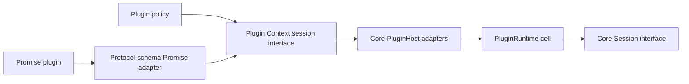

# Upstream-aligned session reads for subagent control

## What is up

[`opencode-subagent-control`](file:///home/rektide/src/opencode-subagent-control)
registers a durable `subagent_list` tool but cannot yet read the public plugin
context facts it needs: direct child Sessions, retained message history,
undelivered inbox work, and current execution membership. The preliminary
research recommended exposing those generic reads through `ctx.session` while
keeping fork filtering, prompt reconstruction, status derivation, and
continuation guidance in the plugin.

Review found that the architecture was sound but its cursor shortcut was not.
The proposed types were the generated client operations, while the proposed
host adapters honored `limit` but returned empty cursors. That would expose a
contract which looked paginated while silently truncating data.

The same review discovered two open upstream proposals. The newer
[`#43556`](https://github.com/anomalyco/opencode/pull/43556), authored by Aiden
Cline (`rekram1-node`) and committed by `opencode-agent[bot]`, independently
converges on almost the same public interface:

- `ctx.session.list`, using the generated `SessionApi.list` operation;
- `ctx.session.messages`, using `MessageApi.list` under the session domain;
- a plugin-only `ctx.session.children` convenience operation;
- faithful opaque cursor pagination in both Effect and Promise flavors;
- no protocol or generated-client change.

The older [`#39939`](https://github.com/anomalyco/opencode/pull/39939), authored
by Kit Langton, establishes the same list/message contract but moves shared
cursor codecs into Schema and refactors Protocol and Server to use them. Both
PRs remain open and conflicted with current `v2`; neither is active enough to
wait for, but both are strong prior art.

This draft synthesizes `#43556`'s history-read shape with the two additional
read-only operations required by subagent control: `inbox.list` and `active()`.

## Decision

> Expose `list`, `children`, retained `messages`, read-only `inbox.list`, and
> `active()` on both plugin flavors. `list`, `messages`, `inbox.list`, and
> `active()` preserve their generated client inputs, outputs, pagination, and
> defaults exactly. `children` is the one plugin-only convenience operation and
> is a paginated direct-child view over `list`. Core remains a generic data
> plane; all subagent interpretation remains in the standalone plugin.

Client-shaped means semantically client-shaped, not merely assignable to the
same TypeScript type.

## Goals

- Let a plugin recover direct child Sessions from durable storage across
  compaction, plugin reload, and server restart.
- Expose generic Session reads useful beyond one subagent tool.
- Match existing generated operations and the newer upstream proposal closely
  enough that an upstream landing can replace a carried commit.
- Keep Effect and Promise plugin contexts behaviorally and structurally aligned.
- Keep the patch additive, focused, testable, and free of protocol/codegen
  churn.
- Keep inbox mutations, process-local Job state, and subagent-specific status
  policy out of the public addition.

## Non-goals

- No `ctx.subagent` domain or host-side enriched child read model.
- No public `job` domain or `job.get` status refinement.
- No inbox `cancel`, `steer`, or `queue` exposure as part of this work.
- No guarantee that list, history, inbox, and active reads form one
  transactional snapshot.
- No protocol, `HttpApi`, OpenAPI, or generated-client changes.
- No cursor-codec extraction into Schema in the carried patch.
- No expansion to `session.log`, statistics, removal, or other adjacent reads.

## Shape convergence

| Concern | Existing plugin capability probe | Preliminary recommendation | `#43556` | This draft |
| --- | --- | --- | --- | --- |
| list | core-shaped `list({parentID}) -> {data}` | `SessionApi.list` type, incomplete cursors | faithful `SessionApi.list` | faithful `SessionApi.list` |
| direct children | none | call `list({parentID})` | paginated `session.children` | paginated `session.children` |
| retained messages | core-shaped array | `MessageApi.list` type, incomplete cursors | faithful `MessageApi.list` under `session` | same as `#43556` |
| inbox | direct `inbox(sessionID)` | read-only `inbox.list` | absent | read-only `inbox.list` |
| active | Effect property returning a Set | generated `active()` record | absent | generated `active()` record |
| subagent policy | plugin | plugin | not applicable | plugin |

The synthesis is therefore not a new fourth history interface. It is
`#43556`'s public history interface plus two generated read operations.

## Public interface

The Effect domain shape is equivalent to the following sketch; the Promise
domain mirrors it with Promise client types:

```ts
type SessionListInput = Exclude<Parameters<SessionApi<unknown>["list"]>[0], undefined>

export type SessionChildrenInput = Pick<SessionListInput, "cursor" | "limit"> & {
  readonly sessionID: Session.ID
}

export type SessionDomain = Pick<
  SessionApi<unknown>,
  | ExistingSessionMembers
  | "list"
  | "active"
> & {
  readonly children: (input: SessionChildrenInput) => ReturnType<SessionApi<unknown>["list"]>
  readonly messages: MessageApi<unknown>["list"]
  readonly inbox: Pick<SessionApi<unknown>["inbox"], "list">
  readonly hook: ModelHooks<SessionHooks>
}
```

`ExistingSessionMembers` is explanatory shorthand, not an implementation type.
The implementation appends `"list"` and `"active"` to the existing `Pick`
union without reorganizing it.

The Promise client currently exports `SessionApi` but not `MessageApi`.
`packages/client/src/promise/api.ts` gains the same hand-written alias already
used by `#43556`:

```ts
export type MessageApi = Client["message"]
```

This is not generated code and does not require `bun run generate`.

### Operation semantics

| Operation | Contract |
| --- | --- |
| `session.list(input?)` | Exactly the generated session-list operation. A bare call ranges over all Sessions rather than defaulting to the plugin Location. The first page defaults to 50 rows. Query filters and opaque cursors retain server semantics. |
| `session.children({sessionID, limit?, cursor?})` | Plugin-only convenience over `session.list` with `parentID` fixed to `sessionID`. Returns the same `{data, cursor}` page shape. It returns all direct child Sessions, including forks; callers apply domain-specific filtering. |
| `session.messages({sessionID, limit?, order?, cursor?})` | Exactly `MessageApi.list`, but grouped under the plugin session domain as in `#43556`. It reads retained projected history across compaction boundaries and defaults to 50 rows. A cursor cannot be combined with `order`. |
| `session.inbox.list({sessionID})` | Exactly the generated inbox-list operation. Returns durable admitted work not yet delivered, ordered by admission. No inbox mutations accompany it. |
| `session.active()` | Exactly the generated active-session operation. Converts Core's process-local `ReadonlySet<Session.ID>` into the `{[id]: {type: "running"}}` record. |

`session.messages` and the existing `session.context` are intentionally
different. `context` returns active model context after the last completed
compaction. `messages` returns paginated retained projected history and is the
operation needed to reconstruct earlier subagent prompts.

### Scope and trust

The plugin context is an in-process extension interface, not a security
sandbox. Enumeration does add discovery relative to knowing a Session ID, but
it does not establish a new privilege boundary. Bare `session.list()` follows
the server-client contract rather than silently scoping itself to
`ctx.location`; callers can use the normal directory, project, workspace,
search, and parent filters.

## Host architecture



The seam is `Plugin.Context["session"]`. It is a worthwhile translation module:
it hides Core's storage-oriented inputs and outputs behind the stable client
contract used by plugin authors. The standalone plugin then interprets those
generic facts as subagent children, prompts, and conservative statuses.

### PluginRuntime

`PluginRuntime.session` already contains `messages`. Add only:

- `list`;
- `inbox`;
- `active`.

Each receives the ordinary replaceable-cell forwarding used by existing
members. `job.get` remains absent.

### Effect host

The host implements:

- `list`: client query/cursor to Core list input/anchor, then Core page to
  client cursors;
- `children`: the same list adapter with `parentID` fixed to the requested
  Session ID;
- `messages`: message cursor/order translation and `{data, cursor}` wrapping;
- `inbox.list`: `{sessionID}` to Core's direct `inbox(sessionID)`;
- `active`: Core's Set to the generated running-status record.

`create` remains the only Session member which defaults a missing Location.

### Promise adapter

Promise methods reuse existing endpoint schemas:

- `SessionEndpoints["session.list"]`;
- `MessageEndpoints["session.messages"]`;
- `SessionEndpoints["session.inbox.list"]`;
- `SessionEndpoints["session.active"]`.

`children` delegates to the already-adapted Promise `session.list` with
`parentID: input.sessionID`; it needs no protocol endpoint of its own.

## Cursor design

### Required behavior

- First pages apply the same default limit of 50 as Server.
- `limit`, `order`, filters, and direction survive pagination.
- Returned `previous` and `next` cursors identify the first and last row.
- A supplied list cursor restores its encoded query and anchor.
- A supplied message cursor restores its order, message anchor, and direction.
- `messages({cursor, order})` fails rather than choosing one silently.
- Malformed or schema-invalid cursors fail as invalid cursors.
- No implementation returns placeholder empty cursors for a limited result.

### Codec placement

Core cannot import Protocol, so the host cannot reuse the current protocol
`SessionsCursor` directly. This carried patch follows the newer and narrower
`#43556` approach: private cursor encode/decode support stays beside the host
adapter. It mirrors the server wire semantics without changing Protocol or
moving codecs across packages.

The older `#39939` Schema extraction is cleaner if upstream chooses to make
cursor construction a shared public module, but carrying that refactor would
triple the package surface of this feature. Do not reproduce it locally unless
upstream adopts that seam or another concrete consumer needs it.

Opaque cursors preserve query continuity; they are not signatures or security
tokens. Plugins are trusted in-process code. Message anchors are still checked
against the requested Session by `SessionStore.messages`; a cursor from another
Session produces an empty page rather than crossing Session history.

## Standalone plugin companion

The host patch and plugin update remain separate repositories and commits. Once
the host surface exists, `opencode-subagent-control` changes its structural
capability probe and read interface to the public shapes:

- probe `session.children`, `session.messages`, `session.inbox.list`, and
  function-valued `session.active`;
- page through all direct children before filtering `fork === undefined`;
- page retained messages in ascending order for each child;
- unwrap `{data, cursor}` from list and message pages;
- call `active()` once and inspect record membership;
- call `inbox.list({sessionID})` for pending prompts;
- retain the probe as an old-host version guard.

The server emits a `next` cursor for every non-empty page, including a final
short page, so complete traversal ends after the following empty page. Collect
children by Session ID so movement in the mutable `time_updated` ordering does
not duplicate output. Pagination is not a transaction: a concurrently updated
child can still move across an anchor and be missed during one scan. That is an
existing server-list property, not a stronger guarantee introduced here.

Retained message ordering is sequence-based and append-only for ordinary
execution, so ascending traversal gives the plugin chronological prompt
history. Full history can be large, but silently truncating it would violate
the tool's output contract. Optimization should follow measurement rather than
weakening the read interface.

Status remains conservative and eventually consistent. `active`, retained
messages, and inbox are separate reads; a Session can start or settle between
them. `running` is a current host-process hint, while completed/error/idle are
derived from durable facts. Job-cancelled-without-history remains `idle` because
the public patch deliberately does not expose process-local Job state.

## Implementation surface

### History-read commit

- `packages/core/src/plugin/runtime.ts`
- `packages/core/src/plugin/host.ts`
- `packages/plugin/src/effect/session.ts`
- `packages/plugin/src/promise/session.ts`
- `packages/plugin/src/promise/adapter.ts`
- `packages/client/src/promise/api.ts`
- `packages/core/test/plugin/host.ts`
- new focused Core behavior/type tests
- `packages/www/src/docs/content/build/plugins/index.mdx`

### Inbox/active commit

- `packages/core/src/plugin/runtime.ts`
- `packages/core/src/plugin/host.ts`
- `packages/plugin/src/effect/session.ts`
- `packages/plugin/src/promise/session.ts`
- `packages/plugin/src/promise/adapter.ts`
- the new focused Core behavior/type tests
- `packages/www/src/docs/content/build/plugins/index.mdx`

There are no changes under `packages/protocol` and no generated client edits.

## Commit sequence

Commits are split by independently replaceable capability, not by package
layer or plugin flavor:

1. `feat(plugin): expose paginated session history reads`
   - port the current-base equivalent of `#43556`;
   - add `list`, `children`, and retained `messages` to both flavors;
   - add faithful host cursors, Promise adaptation, fixture support, tests, and
     documentation in the same green commit.
2. `feat(plugin): expose session inbox and active reads`
   - add read-only `inbox.list` and `active()` through Runtime, both domains,
     host, Promise adapter, tests, and documentation.
3. In `opencode-subagent-control`, commit the client-shaped capability probe,
   complete pagination, and result adaptation separately.

The first commit can be dropped if `#43556` lands. The second remains a small
addition atop either upstream or carried history reads. If `#39939` lands
instead, adapt the first commit to its shared codecs or drop the equivalent
hunks rather than preserving a competing private implementation.

## Test design

Use new focused test files rather than growing churning general plugin tests.
The existing `packages/core/test/plugin/host.ts` fixture must still be widened
because it manually constructs `Plugin.Context` and is included by Core's test
typecheck.

Behavior coverage:

- Effect `session.list` first/next/previous page translation;
- `children` forces the requested parent across cursor traversal;
- retained `messages` first/next/previous pages and ascending order;
- malformed cursors and `cursor + order` rejection;
- Promise list/children/messages endpoint decoding and encoding;
- `inbox.list` forwards only the Session ID and exposes no mutations;
- `active()` converts Set membership to generated record values;
- bare list does not acquire the plugin Location implicitly.

Type coverage:

- both flavors expose the five reads with matching client types;
- `children` has only `sessionID`, `limit`, and `cursor`;
- `inbox.list` exists while `cancel`, `steer`, and `queue` do not;
- old core-shaped `inbox(sessionID)` and Effect-property `active` uses fail;
- unrelated existing Session members remain unchanged.

Do not lock `Object.keys(ctx.session)` or member ordering.

## Verification

From package directories:

```sh
(cd packages/client && bun typecheck)
(cd packages/plugin && bun typecheck)
(cd packages/core && bun test test/plugin-session-reads.test.ts && bun typecheck)
(cd packages/www && bun typecheck && bun run check:generated && bun run build)
```

Companion repository:

```sh
pnpm run typecheck
pnpm test
```

Live acceptance uses the patched host and installed plugin:

- plugin load reports the read surface available;
- `subagent_list` returns more than one page of direct children without forks;
- prompt history includes messages before a completed compaction;
- pending inbox prompts are marked pending;
- active children report running;
- children created before plugin load or server restart remain discoverable;
- an unpatched host still fails with the precise capability message.

## Carryability

The patch touches unavoidable high-churn plugin seams, but its architecture
helps maintenance rather than merely minimizing lines:

- public history shape matches a recent upstream-authored proposal;
- protocol and generated surfaces stay untouched;
- additions are contiguous and avoid adjacent refactors;
- tests live primarily in new files;
- commits map to capabilities which can be dropped independently;
- subagent policy does not leak into Core;
- no speculative Job or event-log surface comes along.

At drafting time the workspace's research commits sit on `e70d667a`, while the
fetched `v2@origin` is `4afd8e81`. The 17 intervening upstream commits touch
none of the implementation files above, so the immediate freshen is
mechanical. Historical churn and the two open conflicting PRs mean every later
freshen must still check for semantic adoption before resolving text conflicts.

The honest cursor adapter is larger than the preliminary empty-cursor version.
That is worthwhile complexity: it lives behind one stable interface and avoids
making every plugin learn that an apparently generated operation only partly
works. A specialized unpaginated subagent interface would reduce the host diff
but create a third public contract and move in the wrong upstream direction.

## Acceptance criteria

- Effect and Promise plugin contexts expose `list`, `children`, `messages`,
  `inbox.list`, and `active()`.
- Generated-operation members preserve their client semantics, including
  limits, defaults, errors, and cursor traversal.
- `children` is generic direct-child enumeration and does not classify forks or
  subagents.
- The public inbox addition is read-only.
- No protocol or generated-client file changes.
- Focused behavior and type tests pass in Core; Client, Plugin, Core, and docs
  package checks pass.
- The standalone plugin paginates complete history and works across restart.
- The carried history commit is recognizable as replaceable by `#43556` or
  `#39939` if either lands.

## Cross-references

- [`subagent.gpt56s.md`](/.design/subagent/subagent.gpt56s.md) provides the
  verified layer-by-layer inventory and records the preliminary alternatives;
  this draft supersedes its empty-cursor and no-children recommendations.
- [`anomalyco/opencode#43556`](https://github.com/anomalyco/opencode/pull/43556)
  is the primary interface prior art: same plugin grouping, both flavors,
  plugin-only `children`, and no wire change.
- [`anomalyco/opencode#39939`](https://github.com/anomalyco/opencode/pull/39939)
  is the shared-codec alternative and evidence that list/message cursor parity
  has been independently designed twice.
- [`port0.glm53.md`](file:///home/rektide/src/opencode-subagent-control/.design/port0.glm53.md)
  records the standalone plugin extraction, capability probe, and original
  core-shaped read assumptions which the companion commit will replace.
- [`patches.md`](file:///home/rektide/archive/doc/opencode/patches.md) defines
  the duplicate-then-rebase freshening procedure, semantic-collision bail-outs,
  and accepted-stack composition rules this commit sequence is designed for.
- [`plugins.md`](file:///home/rektide/archive/doc/opencode/plugins.md) is the
  local plugin inventory and records `opencode-subagent-control` as implemented
  but blocked on this host read surface.
- [`subagents.md`](file:///home/rektide/archive/doc/opencode/subagents.md)
  distinguishes durable child Sessions from invocation-scoped Jobs and explains
  why durable Session reads, rather than Job enumeration, are the recovery
  source of truth.
- [OpenCode V2 plugin context](https://opencode.ai/v2/docs/build/plugins#context)
  defines the governing convention: ordinary plugin methods use the same
  inputs and responses as the server client, while plugin-only operations may
  extend that surface.
