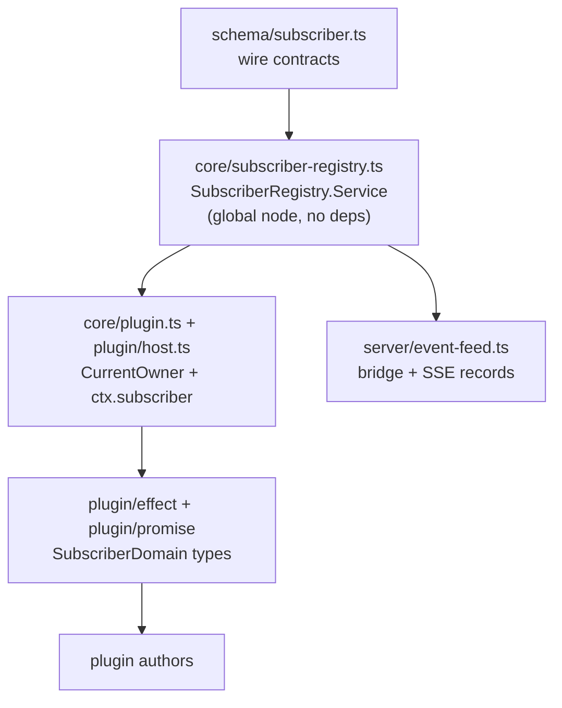
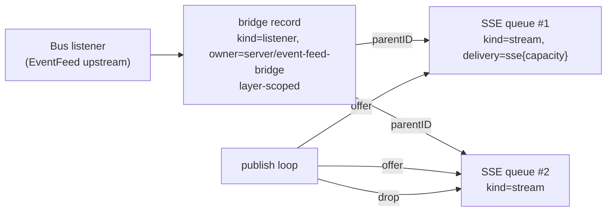

# Subscriber observability — implementation

## Entry points

Read in this order, depending on what brought you here:

- **Why does this exist?** [`draft0.gpt56t.md`](./draft0.gpt56t.md) is the
  design: motivation, the survey of existing subscriber systems, the domain
  model, and the full nine-step incremental plan.
- **What was built and how is it shaped?** This document. It covers the
  architecture, the Effect design and its precedents in this codebase, the
  layering, and the commit-by-commit surface.
- **Refreshing this workspace onto a new `v2@origin`?** Read
  [Commits](#commits), [Verification](#verification), and
  [Divergences from draft0](#divergences-from-draft0); the tests listed there
  are the focused suites to re-run after a rebase.
- **Just want the answer to the motivating question?** "Does the public
  EventFeed have zero subscribers?" is
  `SubscriberRegistry.count({ target: { namespace: "event", name: "public-feed" } })`
  (streams only — exclude the bridge listener with `kind: "stream"`), or
  internally `EventFeed.Interface.count`. See
  [Instrumentation](#instrumentation-eventfeed).

Scope reminder: this slice is design steps 1–4 (schema, Core registry, plugin
domains, EventFeed + plugin event-stream instrumentation). Steps 5–9 (PTY,
Watcher, hooks inventory, HTTP API, metrics) are deliberately deferred — the
goal was a solid, low-friction core that is easy to maintain against upstream.

## The systems we're coming from

OpenCode already had several rich subscriber systems, each with correct local
lifecycle behavior and **no shared way to ask who is listening**:

| System | Relationship it owns | Registry-relevant shape |
| --- | --- | --- |
| [`EventFeed`](/packages/server/src/event-feed.ts) | one bounded queue per SSE client | `Set<Queue>`; capacity 4096; overflow fails exactly that queue; encode-once publish loop |
| [`Bus`](/packages/core/src/bus.ts) | live PubSub, typed per-event PubSubs, durable per-aggregate wake PubSubs, inline `listen` callbacks, projectors | subscribe-before-replay ordering in `log()`; listeners are a plain array |
| `Pty` | output attachments per PTY | explicit attach/detach lifecycle, transport metadata in the server handler |
| `Watcher` | logical consumer streams over shared physical watches | two-level logical/physical structure (future step 6) |
| [`Plugin`](/packages/core/src/plugin.ts) | replaceable generations of hooks, transforms, streams | child `Scope` per plugin; activation swaps generations under a semaphore |

The gap was an **observability plane**: one place that records active
subscriptions as first-class facts. The registry does not replace any of these
systems — it mirrors their acquisition/release into a shared model that
plugins, core code, and (later) HTTP diagnostics can query.

Two facts about the incumbent systems shaped the design more than anything
else:

1. **They already own correct lifecycle.** `Effect.acquireRelease` and scoped
   resources are doing the real work everywhere. The registry must ride those
   existing scopes, never fight them.
2. **Their state is plain mutable closure state, not `Ref`s** — guarded by
   synchronous sections rather than locks. The registry follows suit (see
   [The house concurrency model](#the-house-concurrency-model)).

## Architecture

### One sentence

A process-global Effect service records *live subscription relationships* as
scoped leases — each with a separate owner, target, and delivery dimension —
and serves atomic snapshots, snapshot-first bounded change streams, and
low-cardinality summaries, without ever becoming a load-bearing part of event
delivery.

### The three dimensions

Every registration answers three independent questions. Keeping them separate
prevents ambiguous records like "SSE subscribed to TUI":

- **Owner** — who is responsible for consuming: `{ type: "core" | "server",
  component }`, `{ type: "plugin", pluginID, generation }`, or
  `{ type: "client", client, instanceID? }`.
- **Target** — what receives the attention: `{ namespace, name, instance?,
  location? }`. `name` is a stable low-cardinality class (`public-feed`,
  `output`, `tree`); `instance` is high-cardinality diagnostic identity (a
  Session or PTY ID) that must never become a metric label.
- **Delivery** — how updates cross the relationship: `effect-stream`,
  `callback`, `sse` (+capacity), or `websocket`.

Records also carry `kind` (`stream` / `listener` / `attachment` / `hook` /
`projector` / `physical`) so a mandatory projector is never confused with a
discretionary observer, and `parentID` for layered relationships (SSE queue →
bridge listener; later: logical watch → physical watch).

### Layering



- **Schema** owns the wire-safe model once, so a future HTTP API and the plugin
  views cannot drift (`packages/schema/AGENTS.md` boundary).
- **Core** owns identity, lifecycle, queries, projections, and the change
  stream. `makeGlobalNode` with `deps: []` — the registry must not depend on
  Bus (Bus may depend on it later; never the reverse).
- **Plugin host** binds the ambient owner and exposes read-only views; plugins
  never receive queue/callback/scope objects.
- **Server** contributes transport metadata (SSE capacity, overflow reason) at
  the point where it actually knows it.

### The house concurrency model

This is the load-bearing architectural decision, so it is worth spelling out.

**Effect owns lifecycle and concurrency; the data lives in plain mutable
closure state whose atomicity comes from being a synchronous section.**

Concretely, inside the registry's `Layer.effect`:

- `records: Map<ID, Entry>`, `observers: Set<Observer>`, and the revision
  counter are ordinary closures — no `Ref`, no `SynchronizedRef`, no lock.
- Every mutation — insert+emit, remove+emit, snapshot+observer-enqueue,
  counter bump — is one `Effect.sync` block with **no yield inside**.
  JavaScript's single thread *is* the critical section; a mutation either
  fully precedes or fully follows any observation.

This is not an invention of this feature. It is the codebase's dominant
pattern for exactly this class of state:

| Pattern in the registry | In-repo precedent |
| --- | --- |
| Plain closure `Map`/`Set`/counter inside `Layer.effect` | `Bus`'s `listeners` array and `pubsub.typed`/`durable` maps; `EventFeed`'s subscriber set; `State.create`'s `let state` / `generation` / `waiters` |
| Subscribe-before-snapshot ordering (no-miss handoff) | `Bus.log`'s subscribe-before-replay with the same rationale comment |
| Per-observer bounded queue; overflow fails only that observer | `EventFeed.subscribe`'s independent-lag-budget law |
| `Effect.acquireRelease` leases released by scope | `EventFeed.subscribe`, plugin child scopes |
| `Context.Reference` ambient context inherited by child fibers | `State.CurrentBatch`, `App.Metadata` |
| Sync void callbacks on the hot path | `EventFeed.publish`'s in-loop counting |

The counter-example that proves the rule is
[`Job`](/packages/core/src/job.ts): it wraps its jobs map in a
`SynchronizedRef` with copy-on-write updates **because its read-modify-write
spans async work** (scope creation, fiber forks, `Deferred` awaits). `Ref`
appears in this codebase when a critical section must span a yield — not as
default decoration.

**Why the registry does not use `Ref`/`SynchronizedRef`** (documented so it
does not get re-litigated during a refresh):

1. No mutation ever awaits. The precondition for `SynchronizedRef` is absent.
2. Registration/removal are O(1) by invariant; Job-style copy-on-write would
   make them O(n) in subscriber count.
3. The `delivered()`/`dropped()`/`lag()` counters fire on the event-delivery
   hot path — once per event per subscriber. Copy-on-write there means either
   an O(n) allocation per delivery or mutating the entry inside `Ref.update`,
   which is a `Ref` that lies. The two-speed design below depends on mutating
   the `Entry` in place, synchronously, with zero allocation.
4. `State.create` — the codebase's flagship state machine — skips the `Ref`
   for the identical reason and reaches for `Semaphore.makeUnsafe(1)` only
   around its *async* materialization.

**The trigger that would flip this decision:** if a future step needs to await
inside a mutation (durable-log followers reading a DB cursor while
registering; watcher lease negotiation), the house fix is `State`/`Plugin`'s —
a semaphore (or `SynchronizedRef`) around that specific async section, added
then, with the reason recorded here.

**Why not `SubscriptionRef`** (from draft0, kept because it is the other
obvious Effect answer): its PubSub is unbounded and emits the full value on
every change. A registry observer would allocate a complete snapshot copy per
lifecycle event, and a slow observer would accumulate unbounded state — the
exact failure mode `EventFeed`'s bounded per-client queues exist to prevent.
Independent bounded `Queue.dropping` instances per observer give the same
reactivity with backpressure and isolation.

### Lifecycle: scoped leases

`register` is `Effect.acquireRelease`: the acquisition inserts the record and
returns a `Registration` handle; scope release removes it exactly once.
Explicit `close(reason)` is idempotent — the scope release after a manual
close is a no-op. This matches EventFeed queues, Bus streams, plugin
generations, and (later) watcher subscriptions: **the registry never invents
lifecycle, it attaches to scopes that already exist.**

The EventFeed integration demonstrates the idiom for systems that predate the
registry: the optional `registry` parameter. Standalone `EventFeed.make`
behavior is byte-for-byte unchanged when no registry is passed (the upstream
suite runs green), while the server layer passes one and gets mirroring.

### Owner attribution: `CurrentOwner`

Callbacks and streams do not carry identity, so the registry gets it from the
Effect context:

```ts
export const CurrentOwner = Context.Reference<Subscriber.Owner>(
  "@opencode/SubscriberRegistry/CurrentOwner",
  { defaultValue: () => ({ type: "core", component: "unknown" }) },
)
```

`Plugin.load` rebuilds each plugin's context with its child `Scope`, loggers —
and now `CurrentOwner = { type: "plugin", pluginID, generation }`. Child
fibers inherit it, so a stream consumed inside a plugin generation is
attributable after reload. `generation` increments once per `activate` batch;
co-activated plugins share a generation number, while owner records still
distinguish plugin IDs. Core components override the default with explicit
named owners at important sites rather than spraying `core/unknown` records —
`EventFeed` registers its bridge as `{ type: "server", component:
"event-feed-bridge" }` directly.

### Two-speed data

Lifecycle changes and delivery telemetry are deliberately different kinds of
facts:

| Speed | What | Mechanism | Cost model |
| --- | --- | --- | --- |
| Slow | add / remove / state transition | increments the revision, emits one delta to each matching observer | O(observers), schema-shaped |
| Fast | `delivered` / `dropped` / `lag` / `lastAt` | synchronous in-place mutation of the `Entry`, no delta | zero allocation, no observers touched |

Fast counters are visible in `snapshot()`/`summary()` on demand. Observers
never receive a change per delivered event — this preserves EventFeed's
encode-once architecture and keeps the observability plane from multiplying
work by observer count.

### Snapshot-first watch

A watcher must get a race-free answer to "what exists now, then what
changes?" `watch()` acquires its observer queue and projects the current state
**in the same synchronous section**, then streams
`snapshot → deltas`:

```ts
const acquired = yield* Effect.acquireRelease(
  Effect.sync(() => {
    observers.add(observer)        // deltas start landing in my queue
    return { observer, snapshot: project() }  // ...and the snapshot already
  })                               //     includes everything before me
  ...
)
return Stream.concat(Stream.make(snapshotChange), Stream.fromQueue(queue))
```

Because no other fiber can run between the `observers.add` and the projection,
every subsequent mutation is either in the snapshot or after it — never lost
between them. Observer queues are bounded and dropping; on overflow the
registry fails **only that observer** with `WatchOverflowError` and
disconnects it from the observer set. Reacquiring yields a fresh snapshot.
The registry's own shutdown ends every observer stream; observers are never
registered as subscribers (no recursive observation — observing subscriber
addition would itself be an addition).

### The `track` combinator

```ts
export const track =
  (registry: Interface, input: RegisterInput) =>
  <A, E, R>(stream: Stream.Stream<A, E, R>): Stream.Stream<A, E, R> =>
    Stream.unwrap(
      Effect.gen(function* () {
        const owner = yield* CurrentOwner
        const registration = yield* registry.register({ ...input, owner })
        return stream.pipe(Stream.tap(() => Effect.sync(() => registration.delivered())))
      }),
    )
```

`Stream.unwrap` makes the relationship begin **when the stream is acquired**,
not when `track` is called, and end when the stream's scope closes. The
plugin host wraps `ctx.event.subscribe()` in exactly this combinator, which
is how step 4 (plugin event tracking) came almost for free with step 3.

### Views and privacy

`snapshot(principal?, query?)` filters through two layers:

1. **Query matching** — structured selectors only (`owner`, `target`, `kind`,
   `state`); no arbitrary predicates cross a package boundary.
2. **Principal visibility** — a location-scoped principal sees un-located
   records plus records in its own location, but not other plugins'
   cross-location records; a plugin always sees its own records regardless of
   location. Redaction happens in Core, before anything reaches the plugin
   host or (later) HTTP.

Queues, callbacks, scopes, fibers, headers, and raw paths never leave the
registry. Client identity is normalized to a bounded class (`tui`, `desktop`,
`web`, `cli`, `acp`, `unknown`) — honest `unknown` beats inferred wrong.

## Instrumentation: EventFeed

The server's EventFeed is the first instrumented system and the proof the
model fits:



- **Bridge**: one layer-scoped `listener` record for the feed's upstream Bus
  subscription — the topology fact that would otherwise be invisible.
- **Per-queue**: one request-scoped `stream` record per SSE queue,
  `parentID`-linked to the bridge, with `{ type: "sse", capacity }` delivery.
- **Counters**: the publish loop calls `delivered()` on success and
  `dropped()` on a full queue — same tick as the existing offer, no extra
  fiber.
- **Removals**: queue overflow closes its record with reason `overflow`;
  encoding failure closes every record with `failed`; scope release closes
  with `scope-closed`.
- **`Interface.count`**: the authoritative live-queue count, for retention
  consumers that want the signal without touching the registry.

`SubscriberRegistry.node` was added to `applicationServiceNodes` in
`server/routes.ts`, so every server runtime gets the registry; `EventFeed.make`
keeps the registry parameter optional so standalone behavior (and the
upstream test suite) is unchanged.

## Commits

| Commit | Scope |
| --- | --- |
| `docs(design): subscriber observability draft0` | The design document itself (`.design/subscribers/draft0.gpt56t.md`). |
| `feat(schema): subscriber observability contracts` | `packages/schema/src/subscriber.ts` — the `Subscriber` namespace: `ID`/`ProcessID` (prefixed, descending-order creation), `Kind`/`State`/`Namespace`/`RemovalReason`, `Owner`, `Target`, `Delivery`, `Activity`, `Info`, `Update`, `Query`, `Snapshot`, `Summary`, snapshot-first `Change`, `WatchOverflowError`. Root-barrel export. |
| `feat(core): subscriber registry with scoped leases and snapshot-first watch` | `packages/core/src/subscriber-registry.ts` — everything in [Architecture](#architecture) above, plus the focused test suite. |
| `feat(plugin): read-only subscriber domain with owner attribution` | `packages/plugin/src/{effect,promise}/subscriber.ts` domains; `Context.subscriber` on both plugin shapes; `Plugin.load` installs `CurrentOwner`; `host.ts` exposes `ctx.subscriber.{snapshot,watch,count}` with principal binding and tracks `ctx.event.subscribe()`; promise adapter encodes Snapshot/Change to wire JSON. |
| `feat(server): instrument EventFeed subscribers in the registry` | `packages/server/src/event-feed.ts` + `routes.ts` — [Instrumentation](#instrumentation-eventfeed). |
| `docs(design): subscriber observability implementation notes` | This README. |

The stack sits directly on the current `v2@origin` tip, per the workspace
conventions in the `patches.md` manifest (`~/a/doc/opencode/patches.md`).

## Divergences from draft0

- Draft's `Registration.update` returned an Effect; the implementation is a
  synchronous void — state transitions are pure in-memory mutations and
  callers never await them (same reasoning as
  [the house concurrency model](#the-house-concurrency-model)).
- Draft's `watch()` sketched a semaphore-guarded acquisition; the
  implementation relies on the synchronous-section guarantee for the same
  snapshot-then-delta ordering, with no semaphore.
- Draft proposed `registerManual` for legacy callback APIs; EventFeed instead
  registers inside `Effect.acquireRelease` at both of its lifecycles, so
  manual registration was not needed in this slice.
- `update({ state })` only transitions when the state actually changes;
  same-state updates are no-ops (counters are not state transitions).
- Draft left "plain Map vs Ref" implicit; this README pins it as an explicit
  decision with precedents.

## Verification

- Schema typecheck clean.
- Core: `test/subscriber-registry.test.ts` 9 pass × 5 runs — scoped
  once-removal, structured queries, parent linkage, two-speed counter/state
  semantics, atomic snapshot-first handoff under concurrent mutation,
  per-observer overflow isolation, principal filtering, summary grouping,
  no-recursive-observation.
- Core: `test/plugin-subscriber.test.ts` 2 pass × 3 runs — owner+generation
  attribution including replacement cleanup; Effect and Promise domains
  agree on the same facts.
- Core focused run (plugin, plugin/*, bus, subscriber suites): 317 pass
  across 39 files; typecheck clean.
- Plugin package typecheck clean (domains satisfy both Context shapes; test
  host fixture gained a default `subscriber` domain).
- Server: `test/event-feed.test.ts` 7 pass × 3 runs — the original 5 behaviors
  unchanged plus registry mirroring and overflow-reason removal; full server
  suite 24 pass; typecheck clean.

Testing notes worth keeping: the watch tests use `it.live` (TestClock freezes
the pacing sleeps); watcher fibers are forked then given a start-up sleep
before mutations, otherwise the first mutation can land in the snapshot rather
than the deltas — that is correct registry behavior, not a race in it.

## Deployment notes

- `SubscriberRegistry.node` is a global node with no dependencies; any runtime
  that builds the server routes gets it automatically, and other entrypoints
  opt in by depending on the node.
- `EventFeed.make` keeps `registry` optional — standalone behavior and the
  upstream suite are preserved when it is absent.
- Nothing here is durable. A registry (and its records) live and die with the
  process; `ProcessID` marks the incarnation.

## Open questions / next steps

1. Instrument `Bus.log({ follow: true })` durable followers — the first step
   that makes Bus depend on the registry; watch the [mutation-section
   invariant](#the-house-concurrency-model) if registration must await a
   cursor read.
2. PTY attachments in the Server WebSocket handler (design step 5).
3. Watcher logical/physical parent linkage (design step 6; pairs with the
   watchman/grace work — the `parentID` dimension exists for this).
4. Promote the snapshot/watch schemas to a Protocol HTTP API + generated
   clients (design step 8); the Effect plugin domain should then extend the
   generated client API per `packages/plugin/AGENTS.md`. Keep the future
   `/api/subscriber/watch` out of the registry itself.
5. Client classification (`tui`/`desktop`/`web`) reports `unknown` until a
   client identity header/handshake exists (draft0 open question 3).
6. A small bounded ring of recently-removed records for flap diagnosis
   (draft0 open question 4).
7. Should `count`/`summary` match on entries directly instead of projecting
   full `Info` objects first? (Micro-efficiency; only worth it if snapshots
   show up in a hot path.)

## Cross-references

- [`draft0.gpt56t.md`](./draft0.gpt56t.md) — the design this implements;
  full motivation, existing-surfaces survey, and the nine-step plan.
- [`/packages/server/src/event-feed.ts`](/packages/server/src/event-feed.ts) —
  the first instrumented system; its bounded-queue and encode-once laws are
  the registry's load-bearing precedents.
- [`/packages/core/src/bus.ts`](/packages/core/src/bus.ts) —
  subscribe-before-replay ordering precedent; next instrumentation target.
- [`/packages/core/src/state.ts`](/packages/core/src/state.ts) — plain-state
  + semaphore-around-async precedent.
- [`/packages/core/src/job.ts`](/packages/core/src/job.ts) — the deliberate
  counter-example: `SynchronizedRef` where read-modify-write spans awaits.
- [`/packages/core/src/plugin.ts`](/packages/core/src/plugin.ts) — generation
  scopes and `CurrentOwner` installation.
- `patches.md` manifest (`~/a/doc/opencode/patches.md`) — workspace and
  refresh conventions; this feature's manifest entry.
