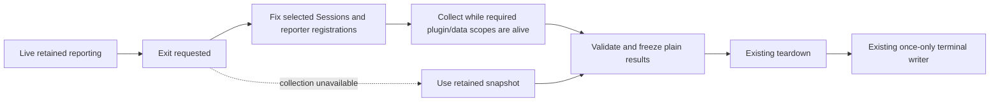

<a id="epilogue-callbacks"></a>
# What is deferred, and why

The human wants plugins to support **global and per-session reporting**, either
by publishing retained key/value data or by receiving a callback that generates
values for that scope. Computing everything continually can waste work; computing
at exit can delay exit and encounter already-disposed data or services.

The explicit next instruction was: **defer the callback system, implement the
per-session work with Sol, then write this document**. The retained implementation
is now complete and reviewed through `5298a9554629`; its final TUI suite reported
**1,302 passed, 4 skipped, 0 failed**, with real exit/signal/width/expiry coverage.
The TUI typecheck still reports the unchanged Core FFI diagnostic, not a new
reporting error. See the [implementation receipt](/.design/term-v2/multi-session-implementation0.gpt56sx.md).

**No exit-time collection callback, deadline, fallback collector or new shutdown
phase is implemented by this document.** `rekon-session-mementos-display-callbacks`
tracks delivery of this deferred design note, not delivery of callback runtime.

## The concrete baseline

There are two reporting scopes. Both already support retained values and cheap
live projections:

| Scope | Event-driven retained publication | Live cached projection | Exit-time collection |
|---|---|---|---|
| Global | `epilogue.retain(key, initial?)` | Existing `epilogue.register(project)` | Deferred |
| Per Session | `epilogue.retainSession(sessionID, key, initial?)` | `epilogue.registerSession(project)` | Deferred |

The retained handles expose `set(row | undefined)` and `dispose()`. Their values
are validated/copied at publication, including when the Session is not selected.
Live projections run under keyed reactive ownership; they are **not exit callbacks**.
The legacy global projection remains tied to the hydrated current route and is
not multiplied across Sessions. Global retained data does not require a current
Session. A Session-specific value never admits its Session into the inventory.

Existing values are semantic `text` or `relative-time` rows. This is not an
arbitrary JSON bookmark store: caller keys identify owned reporting entries,
while display labels may legitimately repeat across plugins and Sessions.
Cotail continues to own durable bookmark/link data.

The separate `epilogue.selection.transform(edit)` edits the live ordered rule
program. It is configuration-time policy, not reporting or exit-time collection.
Registration/enable order controls transform replay; explicit stage grants control
termination. Callback work must not quietly turn that rule set into an output-slot
registry or change which Sessions were selected midway through collection.

## The lifecycle constraint is real

Currently, [`app.tsx`](/packages/tui/src/app.tsx) handles explicit exit and supported
signals by destroying the renderer. Its first destroy handler calls `freeze`, and
the outer Effect finalization writes `take()` only after scoped cleanup.

[`createEpilogue`](/packages/tui/src/context/epilogue.tsx) owns:

```text
live publication → immutable retained batch → freeze → teardown → print once
```

At freeze there is no plugin execution, cache access or I/O. Printing is even
later. Adding `await reporter()` to the writer—or an asynchronous renderer-destroy
listener—does not preserve the reporter's dependencies and is not a valid shortcut.

## Proposed future collection phase

If callbacks are authorized later, introduce an explicit controlled phase:



This reopens **when values are produced**, not whether output may invoke plugins
after disposal. Retention stays useful as an independently supported mode and as
fallback evidence. The ordinary immediate-destruction path must remain capable of
freezing what is already retained when controlled collection cannot run.

### Scope and ownership

- A global collector runs once for the collection attempt. A per-session collector
  runs separately for each selected Session, or a future explicitly batched adapter
  may gather shared source data without changing output identity/order.
- Fix membership and active registration generations when collection starts.
  Do not let a late tab change, new registration or discovered relationship create
  an unbounded second traversal.
- Associate collected and retained values through an explicit reporter/entry
  identity within its global or Session scope. Display labels are not merge keys.
- Do not silently reinterpret `register` or `registerSession` as deferred APIs.
  An explicit collector registration or an explicit collector attached to a retained
  handle are candidates; exact names and row-versus-multi-field shape remain open.

### Results and fallback

Proposed outcome distinctions:

| Outcome | Intended treatment |
|---|---|
| Collected values | Replace that collector's owned contribution for this attempt after validation. |
| Explicit empty success | Clear that owned contribution; do not resurrect an old retained value. |
| Unavailable, failed or timed out | Use its retained snapshot if available; otherwise omit its contribution. |
| Result arriving after freeze/cancellation | Ignore for this epilogue; never mutate frozen output. |

Fallback must not imply fresh successful collection. The eventual UI policy should
decide how retained/stale or unavailable results are disclosed without making the
terminal output noisy. A failure in one collector must not suppress other Sessions
or their host-owned identity/Continue envelopes.

Reporting is not bookmark mutation, prompt admission, or Session completion. A
collector may read Cotail metadata, but persisting a mark or steering a Session is
another action requiring its own explicit authorization.

### Time, cancellation and ordering

Use an overall collection budget rather than multiplying a full deadline by every
Session and reporter. Give cooperative asynchronous work cancellation and preserve
deterministic output order independently of completion order. Concurrency and the
budget are future policy choices, not hidden defaults introduced here.

**A timeout cannot preempt synchronous JavaScript or SQLite.** The
[bookmark writer probe](file:///home/rektide/src/cotail/.design/bookmarks/foundation0.gpt6a.md#5-demonstrated-writer-constraint-and-choice)
demonstrated a synchronous busy wait delaying the same event loop's release timer.
Callback signatures returning Promises do not remove that constraint. Prefer bounded
operations; require evidence before adding a worker/process solely for isolation.

One freeze clock keeps relative-time formatting coherent. It does **not** prove
that all collected values came from one database snapshot or observation instant.
Retain source/observation distinctions where the underlying operation exposes them.

### Exit modes need an explicit contract

The current `SIGHUP`/`SIGINT`/`SIGTERM` handlers and main Effect interruption can
bypass an ordinary awaited exit path. A future design must either coordinate those
paths before teardown or explicitly promise retained-only fallback for them.
Do not claim every exit invokes collectors merely because normal quit does.

Unexpected renderer destruction needs immediate retained fallback. Uncatchable
termination such as `SIGKILL` cannot guarantee collection, cleanup or printing.
A broken reporter must not make ordinary terminal restoration depend indefinitely
on its cooperation.

## Decision and verification gate for future implementation

Before coding, settle:

1. Which exit modes attempt collection, and which use retained fallback?
2. Does a collector own one row or a keyed multi-field result, and how is it paired
   with retained values without disturbing existing registrations?
3. What budget/concurrency/cancellation policy is honest about synchronous work?
4. What dependencies are available during collection, and how are plugin reload,
   unregister and late results isolated from the fixed attempt?
5. How are fallback freshness and partial failure represented to the user?

Prove the answer with the real isolated lifecycle/process harness: global exactly
once, per-selected-session identity, empty versus failed outcomes, deterministic
order, slow/rejected/hostile thenables, cancellation, forced destruction, supported
signals, and complete output only after cleanup. Assert no callback or source read
occurs after freeze. Preserve narrow/wide output and terminal-safe value handling.

The user has **not** authorized that implementation. Retained per-session reporting
is useful now; callback collection remains a separately chosen future extension.

## Cross-references

- [Retained implementation](/.design/term-v2/multi-session-implementation0.gpt56sx.md)
  — actual interfaces, fixes and verification that this note follows.
- [Original retained registry rationale](/.design/term-v2/epilogue-registry-implementation0.gpt56s.md)
  — the preserved ownership/freeze/cleanup guarantees; collection would precede,
  not erase, those guarantees.
- [Rekon session-mementos overview](file:///home/rektide/src/rekon/design/session-mementos/README.md)
  — separate owners for selection, reporters, visits, bookmarks and marking.
- [Ordered-pipeline memento](file:///home/rektide/src/rekon/design/ordered-pipelines/memento0.gpt6a.md)
  — why selection, accumulating reports and effectful collection have different
  composition rules despite their similar registration shapes.
