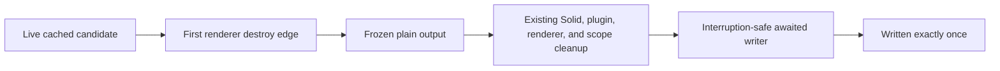

# Epilogue implementation primer

Date: 2026-08-30

Model: OpenAI GPT-5.6 Sol max (`gpt56s`)

Status: accepted direction; ready for a fresh implementation session

Accepted direction:

1. Repair production graceful-shutdown output before extending the plugin API.
2. Keep `Active` as a fixed private Session row while its snapshot and semantics are hardened.
3. Prototype a private structured epilogue registry backed by one host-owned retained Solid computation.
4. Propose `context.ui.epilogue.register(...)` publicly only if the private prototype passes and has at least two independently useful adapters.

This document is the implementation entry point. It deliberately references, rather than repeats, the full research corpus.

## Read first

1. [Research wave synthesis](/.design/term-v2/epilogue-plugins1-syn0.gpt56s.md): accepted architecture, lifecycle, carryability analysis, and option comparison.
2. [Shutdown carry audit](/.design/term-v2/research/shutdown-carry-audit0.gpt56s.md): production `NodeRuntime` blocker, exact state machine, signal matrix, and process-level experiments.
3. [Structured registry research](/.design/term-v2/research/structured-registry0.gpt56s.md): recommended public interface shape and aggregate retained implementation.
4. [Retained cells implementability addendum](/.design/term-v2/research/retained-cells0.gpt56s.md#addendum-implementability-and-mechanical-sympathy): native Solid and plugin machinery reuse, null-slot and `visible=false` experiments, and minimal touch points.
5. [Research index](/.design/term-v2/research/index.md): all independent reports.

## Repository state

Workspace: `/home/rektide/src/opencode-term-v2`

Rolling bookmark: `term-v2`

Relevant carried commits before this primer:

```text
e3b101dc fix(tui): gracefully handle termination signals
59f70da7 feat(tui): show session activity on exit
c009d583 docs(tui): explore pluggable epilogues
f269cdaf docs(tui): expand epilogue plugin research
```

The Git-facing `term-v2@git` ref may still point to the older refresh commit. Do not assume the local bookmark and Git-facing ref match. Do not push; the human controls publication.

At the end of the research wave, `v2@origin` had advanced beyond the carry base and had begun changing plugin-facing files. Re-read the current refs before editing. Refresh the two functional commits before opening a generic plugin surface.

## Capability objective

A loaded full-TUI Session should emit this envelope exactly once on every promised graceful exit:

```text
<logo>

Session    <title>
Active     <running or relative age>
<supplemental plugin rows, when the generic seam exists>
Continue   opencode2 -s <session-id>
```

The terminal must be restored before output. Plugin and scoped cleanup must complete before output. Epilogue composition must not fetch, access the database or filesystem, invoke plugin code, or retain live Solid state after freeze.

The guarantee applies to normal TUI exit and the explicitly supported graceful signals. It does not apply to `SIGKILL`, `SIGSTOP`, or forced synchronous process termination.

## Current blocker

The current in-process lifecycle test does not represent production signal behavior.

Production runs under `NodeRuntime.runMain`, which installs `SIGINT` and `SIGTERM` listeners that interrupt the main Effect fiber. The TUI's local and scoped finalizers still run, but the normal continuation after the inner `Effect.scoped` does not. The current epilogue write sits in that skipped continuation.

Observed production-shaped behavior:

| Signal | Cleanup | Epilogue | Current exit |
| --- | --- | --- | --- |
| `SIGHUP` | runs | prints | 0 |
| `SIGINT` | runs | missing | 130 |
| `SIGTERM` | runs | missing | 130 |

Do not start the public registry until real child-process tests prove one complete epilogue for all promised paths.

## Accepted lifecycle

The private epilogue module owns a three-state lifecycle:

```ts
type State =
  | { readonly status: "live"; readonly candidate?: Candidate }
  | { readonly status: "frozen"; readonly output?: string }
  | { readonly status: "written" }
```

The state names are illustrative. Preserve the transitions and invariants even if implementation names differ.



Required ordering:

```text
copy live facts < freeze output < dispose Solid/plugins/renderer < write and flush stdout < process exit
```

Implementation constraints:

- Freeze synchronously at the earliest TUI-owned renderer destroy edge, before Solid root disposal.
- Freeze idempotently because several paths may attempt renderer destruction.
- Store only copied primitives, normalized rows, or a final immutable string.
- Run the writer from an Effect finalization path that executes on success, failure, and interruption.
- Place the writer outside the inner local TUI scope so inner cleanup completes first.
- Await stdout completion before `NodeRuntime` can call `process.exit`.
- Preserve the original success, failure, or interruption cause if output fails.
- Keep title clearing idempotent and avoid calling renderer methods after native destruction.

Do not change plugin cleanup signatures, ordering, or shutdown ownership to solve this.

## Fixed Active snapshot

The current callback is request-free but captures a Session store object and dereferences fields later. Replace it with an explicit primitive snapshot while the Session is live.

Recommended private shape:

```ts
type SessionEpilogueCandidate = {
  readonly title: string
  readonly sessionID: string
  readonly activity: {
    readonly status: "idle" | "running"
    readonly updated: number
    readonly idle?: number
  }
}
```

Rules:

- Install no Session epilogue until a hydrated Session with a real ID exists.
- Route changes replace the candidate atomically and cannot leak the previous Session.
- Leaving the Session route clears only the matching candidate epoch.
- Running activity renders `running`.
- Idle activity renders the age of `max(updated, idle ?? updated)`.
- Use one explicit freeze clock so tests and all rows agree.
- Calculate relative text from copied timestamps, never from a Session accessor after freeze.
- Make no shutdown-time Session request.

Provisional carry policy: preserve existing `NodeRuntime` signal exit outcomes during the first lifecycle repair. A separate decision may change `SIGTERM` from 130 to conventional 143; do not couple that policy change to restoring output.

## Generic seam target

The preferred public interface is structured registration:

```ts
export type EpilogueValue =
  | { readonly type: "text"; readonly text: string }
  | { readonly type: "relative-time"; readonly timestamp: number }

export type EpilogueRow = {
  readonly label: string
  readonly value: EpilogueValue
}

export interface Epilogue {
  register(
    project: (scope: { readonly sessionID: string }) => EpilogueRow | undefined,
  ): () => void
}

export interface UI {
  readonly epilogue: Epilogue
}
```

This is a target for the private prototype and later upstream discussion, not permission to edit the public plugin package immediately.

Interface policy:

- Additive supplemental rows only.
- Core logo, Session, Active, and Continue remain host-owned initially.
- One registration returns one row in the narrow first shape.
- Plugin order and within-plugin registration order determine row order.
- Values are structured and unstyled; the host owns ANSI and width policy.
- Promise, JSX, renderer objects, controls, multiline text, and unbounded values are invalid.
- One projection failure omits only that registration.

## Retained implementation

The public registry and the retained mechanism are separate decisions.

Use one host-owned tracked computation while the TUI is live:

1. Read the current hydrated Session route.
2. Traverse active epilogue projections in existing plugin order.
3. Invoke projections while Solid, plugin contexts, and cached state are healthy.
4. Track the reactive fields each projection reads.
5. Normalize and copy successful rows into one immutable retained array.
6. Let shutdown freeze that retained array without invoking plugin code.

Native machinery to reuse:

- `PluginProvider` is already a Solid owner.
- Its registration store already tracks active plugins and deterministic order.
- Reconciliation is already serialized.
- Setup rollback and last-good restoration already exist.
- Activation-owned cleanup already removes registrations.
- The internal epilogue context is the natural deep module seam.

Do not initially add:

- one Solid root per row;
- a public mutable `cell.set` handle;
- a second plugin generation manager;
- path-dependent non-JSX Slot output;
- renderer-backed hidden storage;
- changes to visual Slot resolution or `PluginBoundary`;
- public plugin types before the private prototype passes.

A null-returning existing `app` slot component is acceptable as a private prototype adapter because it supplies a Solid owner without creating a visible renderable. It is not the accepted public semantic seam because visual replacement can suppress it.

`visible=false` OpenTUI text is an experiment, not the final storage mechanism. It works, but allocates native text state, requests frames on updates, requires pre-destroy reads, and adds serialization without capability.

## Deep module

Concentrate implementation in the epilogue domain and keep high-churn files thin.

The deep module owns:

- live core candidate state;
- retained normalized supplemental rows;
- Session epoch protection;
- validation and budgets;
- immutable copies;
- explicit freeze clock;
- `live -> frozen -> written` transitions;
- final presentation inputs;
- per-row failure isolation.

The deep module owns no renderer traversal, client, plugin loader, filesystem access, database access, or plugin cleanup.

Thin adapters:

| Adapter | Responsibility |
| --- | --- |
| Session route | Copy hydrated Session facts and clear by matching epoch. |
| Plugin API | Register and dispose one projection. |
| Plugin provider | Publish active ordered projections through one tracked computation. |
| `Tui.run` | Freeze at destroy and install the interruption-safe writer. |
| Presentation | Render core and normalized rows from an explicit clock. |
| CLI entrypoint | Process-level verification; avoid production changes unless signal policy requires them. |

## Implementation sequence

Keep each capability independently reviewable and carryable.

### 1. Refresh the functional carry

- Re-read `v2@origin` and local/Git-facing bookmarks.
- Preserve dated bookmarks and old commits.
- Duplicate the graceful-signal and Active commits onto the current upstream base using the established refresh workflow.
- Do not fold research documentation into functional commits.
- Run commit-local diffs; do not judge the carry from an old-base-to-tip diff containing unrelated upstream movement.

### 2. Add production characterization tests

- Spawn the actual CLI path under `NodeRuntime.runMain`.
- Deliver OS `SIGHUP`, `SIGINT`, and `SIGTERM` in separate tests.
- Gate plugin cleanup and record ordering.
- Use delayed or backpressured stdout.
- Assert title restoration, exactly one complete epilogue, completion after cleanup, and explicit exit status.
- Keep the existing direct `Tui.run` tests as inner-lifecycle coverage.

The expected first process tests should expose missing INT/TERM output before the fix.

### 3. Repair shutdown state and output placement

- Introduce private primitive candidate/frozen/written state.
- Freeze before Solid disposal from one idempotent destroy path.
- Move output from the normal post-scope continuation to interruption-safe finalization.
- Await stdout completion.
- Preserve the original Effect outcome.
- Make title clearing safe after repeated destroy attempts.

Commit this independently of Active semantics and plugin extensibility.

### 4. Harden fixed Active

- Require hydrated Session identity.
- Copy title, ID, running status, updated, and idle while live.
- Use the accepted cached activity rule.
- Add explicit-clock presentation tests.
- Assert no post-trigger Session request.
- Test route switch, route exit, deletion, late old-Session update, and long cleanup.

### 5. Build a private retained-registry prototype

- Do not edit `packages/plugin` yet.
- Add synthetic ordered projections inside TUI-owned code.
- Use one aggregate tracked computation.
- Feed one adapter from cached Session state and one genuinely independent adapter.
- Measure recomputation count and renderer allocation/frame requests.
- Gate hot reload boundaries and document the transient missing-row behavior.
- Delete the prototype if two adapters remain simpler as fixed fields.

### 6. Propose the public registry upstream

Proceed only when:

- process-level shutdown tests pass;
- stdout is awaited;
- the private retained registry survives cleanup and route epochs;
- two independently useful adapters share the row model;
- projection failures are isolated;
- upstream interest is real.

Then add the narrow public contract, plugin adapter, lifecycle tests, and CLI plugin documentation as a separate reviewable change. Keep Active core-owned during this first public-interface review.

### 7. Migrate one producer

After the public seam lands, decide whether Active is mandatory core output or a disableable built-in plugin. If migrated, remove the fixed row in the same direction of travel. Never emit duplicate Active rows.

## Expected touch points

Immediate shutdown and fixed-row work:

- `packages/tui/src/app.tsx`
- `packages/tui/src/context/epilogue.tsx`
- `packages/tui/src/routes/session/index.tsx`
- `packages/tui/src/util/presentation.ts`
- `packages/tui/test/app-lifecycle.test.tsx`
- `packages/tui/test/util/presentation.test.ts`
- a process-level CLI/TUI signal test or fixture

Private retained prototype:

- prefer a new epilogue domain module or a coherent expansion under `packages/tui/src/context`;
- thin additions to `packages/tui/src/plugin/api.tsx` or a private fixture adapter only if needed;
- focused new tests rather than broad edits to visual Slot machinery.

Public registry, only after its gate:

- `packages/plugin/src/tui/context.ts`
- `packages/tui/src/plugin/api.tsx`
- `packages/tui/src/plugin/context.tsx`
- plugin hot-reload tests
- `packages/www/src/docs/content/build/plugins/cli.mdx`

Avoid changes to Protocol, Server `HttpApi`, Core, Schema, generated clients, persistent storage, `plugin/render.tsx`, and `plugin/structure.ts` unless a failing experiment demonstrates a real need.

## Verification gates

### Shutdown capability

- Normal `app.exit` writes once after cleanup.
- Real `SIGHUP`, `SIGINT`, and `SIGTERM` write once after cleanup under production `NodeRuntime`.
- Exit statuses match the provisional policy.
- Repeated destroy attempts do not duplicate output or throw.
- Delayed stdout finishes before process exit.
- Output failure does not replace the original process outcome.

### Snapshot integrity

- No Session request begins after shutdown trigger.
- Clearing Solid stores after freeze cannot change output.
- Plugin cleanup mutation cannot change frozen output.
- Unhydrated Session prints no invalid Session epilogue.
- Session A cannot leak after routing to Session B.

### Active semantics

- Running renders `running`.
- Idle uses `max(updated, idle ?? updated)`.
- Minute, hour, day, clock-skew, and long-cleanup cases are deterministic.

### Private registry

- Renderer frames alone do not rerun projections.
- Cached dependencies and route changes do rerun projections.
- Row-only updates allocate no OpenTUI renderable and request no frame.
- Plugin and registration order are stable.
- One malformed or throwing projection cannot suppress core or later rows.
- Hot reload, disablement, setup failure, and shutdown-at-transition behavior are explicit.

## Package commands

Run TUI tests and type checking from `packages/tui`, never the repository root:

```sh
bun test test/app-lifecycle.test.tsx test/util/presentation.test.ts
bun typecheck
```

Use focused new process and registry tests while iterating. Run targeted lint on touched files from the repository root when needed. Use `bun run dev:live` from the development worktree for manual TUI verification against the elected service.

## Carry rules

- Keep the shutdown repair, fixed Active semantics, private prototype, and public interface in separate commits.
- Use conventional commit titles.
- Keep lifecycle wiring in `app.tsx` thin.
- Keep the Session-route change in its existing epilogue effect.
- Concentrate policy in the epilogue module and pure presentation.
- Do not add compatibility scaffolding for an interface that has not shipped.
- Do not carry a downstream public generic API unless several local plugins justify it.
- Prefer upstreaming the generic registry before moving Active onto it.
- Preserve historical and dated bookmarks during refresh.
- Never push from the agent session.

## Suggested starting prompt

> Implement the accepted epilogue direction in `/home/rektide/src/opencode-term-v2`, beginning with production shutdown characterization and repair only. Read `.design/term-v2/epilogue-implementation.md`, then the linked shutdown audit and synthesis. Refresh the two functional commits onto current `v2@origin` before editing. Preserve the existing plugin lifecycle. Make Session epilogue state primitive and hydrated, freeze it before Solid disposal, emit it from interruption-safe awaited finalization after cleanup, and prove real SIGHUP/SIGINT/SIGTERM behavior under `NodeRuntime`. Keep Active and any generic registry work in later independent commits. Use TDD, commit logical changes with jj, and do not push.

## Cross-references

- [Accepted research synthesis](/.design/term-v2/epilogue-plugins1-syn0.gpt56s.md): complete rationale and staged direction.
- [Shutdown carry audit](/.design/term-v2/research/shutdown-carry-audit0.gpt56s.md): release blocker and process-level evidence.
- [Fixed carry research](/.design/term-v2/research/fixed-carry0.gpt56s.md): minimal snapshot, semantics, refresh discipline, and decision threshold.
- [Structured registry research](/.design/term-v2/research/structured-registry0.gpt56s.md): preferred interface and retained aggregate computation.
- [Retained cells research](/.design/term-v2/research/retained-cells0.gpt56s.md): native machinery inventory and measured prototype alternatives.
- [Plugin surface audit](/.design/term-v2/research/plugin-surface-audit0.gpt56s.md): current supported plugin capabilities and missing epilogue seam.
- [Headless slot research](/.design/term-v2/research/headless-slot0.gpt56s.md): viable alternative and slot-system reuse if the registry direction fails upstream review.
