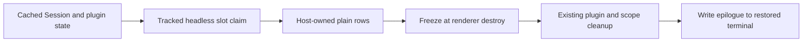

# Pluggable TUI epilogues: possibility space

Date: 2026-08-30

Model: OpenAI GPT-5.6 Sol max (`gpt56s`)

Status: exploratory design note; no interface has been accepted or implemented

## Situation

The carried `term-v2` work currently does two related things:

1. It routes `SIGHUP`, `SIGINT`, and `SIGTERM` through graceful renderer teardown.
2. It adds an `Active` row to the full TUI's post-shutdown Session epilogue.

The epilogue is valuable specifically because it is written after the renderer
has restored the terminal and after scoped cleanup has completed. The Active
row must not introduce a shutdown-time server, database, or filesystem lookup.

The broader opportunity is to let CLI plugins contribute supplemental epilogue
information. This could move the Active row, and future rows such as cost,
agent, branch, or accounting information, out of a fixed-purpose downstream
presentation patch.

The tentative idea motivating this note is a non-drawn, headless slot. Plugins
would contribute while the TUI is alive; the host would preserve the latest
plain value and print it after teardown. Reusing `context.ui.slot` would provide
a familiar interface and reuse plugin ordering, registration, hot reload, and
cleanup ownership. The central questions are whether a slot can be headless
without creating renderer objects, when its contribution recomputes, and how
its final value survives normal plugin cleanup without changing plugin
lifecycle semantics.

Research prompt:

> Design and prototype a plugin contribution seam for supplemental OpenCode V2
> TUI epilogue rows. Preserve synchronous lookup-free shutdown, existing plugin
> cleanup ordering, deterministic composition, and the built-in Session and
> Continue rows. Compare a headless slot, a dedicated registry, retained cells,
> and the current fixed-purpose carry.

## Established facts

### Session timestamps are upstream and public

`Session.Info.time.updated` is an upstream field, not part of the carried
patch. It is part of the public Session schema alongside `created`, `idle`,
`viewed`, and `archived`:

- [`Session.Info`](/packages/schema/src/session.ts#L31-L58)
- [Generated `SessionInfo`](/packages/client/src/promise/generated/types.ts#L1644-L1660)

A CLI plugin can read an already-cached Session synchronously with
`context.data.session.get(sessionID)`. That method is part of the documented
plugin interface and reads the Solid store without issuing a request:

- [Public plugin `Data.session`](/packages/plugin/src/tui/context.ts#L61-L99)
- [Solid data lookup implementation](/packages/client/src/solid/data.ts#L1244-L1261)
- [CLI plugin Session documentation](/packages/www/src/docs/content/build/plugins/cli.mdx#L74-L103)

The currently displayed Session ID is also public through
`context.ui.router.current()`. Slots that are Session-scoped already receive a
`sessionID` because slot inputs carry host-local identity while plugins read
ordinary Session data from the cache.

### Timestamp semantics need a decision

`time.updated` is Session recency. It is not necessarily the end of the latest
model execution. A terminal execution advances `time.idle` while deliberately
preserving `time.updated`:

- [Terminal projection](/packages/core/src/session/projector.ts#L402-L429)
- [Session timestamp contract](/packages/schema/src/session.ts#L44-L52)

If the label remains `Active`, a better cached interpretation is:

```text
running ? now : max(time.updated, time.idle)
```

If only `time.updated` is used, `Updated` is a more exact label. This semantic
choice is independent of the plugin seam.

The cache can also briefly trail server projection. For example, inbox
admission advances `time_updated` server-side, while the local
`session.inbox.enqueued` handler currently updates pending input but not the
cached Session timestamp. Execution completion schedules an asynchronous
Session synchronization:

- [Inbox admission projection](/packages/core/src/session/projector.ts#L623-L638)
- [Local inbox event handling](/packages/client/src/solid/data.ts#L700-L714)
- [Local execution terminal handling](/packages/client/src/solid/data.ts#L1015-L1028)

An epilogue seam can guarantee lookup-free shutdown, but it cannot make a stale
cache authoritative. A generic cache-projection improvement should be a
separate upstream change if tests demonstrate that the race matters.

### There is no public epilogue plugin interface today

The public CLI plugin UI includes dialogs, toasts, formatting, routes, tabs,
and visual slots. It has no exit, shutdown, or epilogue contribution method:

- [Public plugin `UI`](/packages/plugin/src/tui/context.ts#L436-L486)
- [Documented CLI plugin interface](https://opencode.ai/v2/docs/build/plugins/cli)

The built-in epilogue is a singleton internal setter. The Session route owns
it, and `Tui.run` writes its value after the Effect scope closes:

- [Internal epilogue context](/packages/tui/src/context/epilogue.tsx)
- [Session epilogue preparation](/packages/tui/src/routes/session/index.tsx#L198-L205)
- [Post-cleanup output](/packages/tui/src/app.tsx#L449-L457)

Visual slots cannot currently contribute to this output. Plugin cleanup,
including hot reload and manual deactivation, uses one existing serialized
lifecycle and is awaited during TUI teardown:

- [Plugin deactivation](/packages/tui/src/plugin/context.tsx#L193-L224)
- [TUI shutdown registration](/packages/tui/src/plugin/context.tsx#L503-L525)
- [Cleanup execution](/packages/tui/src/plugin/context.tsx#L552-L565)

Changing that lifecycle to keep plugins alive after renderer teardown would be
a large and risky design change. None of the viable designs below require it.

### Slot callbacks do not run on every terminal frame

The existing visual slot implementation is Solid-based. A contribution is
created as a component and its setup body runs once. Reactive expressions
inside it rerun only when the signals or store fields they read change.
OpenTUI may paint the retained render tree at many frames per second, but that
does not rerun component setup at the frame rate:

- [Slot component semantics](/packages/tui/src/plugin/render.tsx#L80-L121)
- [Stable claim resolution](/packages/tui/src/plugin/context.tsx#L430-L467)

A contribution is recreated when its slot instance mounts again, its claim is
added or replaced, or its plugin generation changes. A properly designed
headless contribution can therefore recompute only on relevant cached Session
changes. Repeated terminal drawing is not itself a performance blocker.

## Required invariants

Any accepted design should preserve these invariants:

1. Shutdown performs no asynchronous plugin call and no server, database, or
   filesystem lookup for the epilogue.
2. Plugin cleanup ordering, hot reload behavior, manual deactivation, and
   keep-last-good generation behavior remain unchanged.
3. The host freezes plain data before Solid and plugin cleanup can erase it,
   then prints only after renderer and scoped cleanup complete.
4. Plugins add supplemental rows. They cannot accidentally suppress the logo,
   Session identity, or Continue command.
5. The host owns alignment, colors, ANSI, truncation, and terminal safety.
6. Contributions are synchronous, cheap, side-effect free projections of
   already-available state.
7. One failing plugin cannot suppress the core epilogue or another plugin.
8. Plugin and within-plugin registration order are deterministic.
9. Home, plugin-route, loading, and missing-Session behavior is explicit.
10. Abrupt termination such as `SIGKILL` remains outside the guarantee.

## Possibility A: keep the fixed-purpose carry

The smallest option is to keep Active in core presentation as a downstream
patch. The current shape uses four production files and two tests:

- [`app.tsx`](/packages/tui/src/app.tsx)
- [`context/epilogue.tsx`](/packages/tui/src/context/epilogue.tsx)
- [`routes/session/index.tsx`](/packages/tui/src/routes/session/index.tsx)
- [`util/presentation.ts`](/packages/tui/src/util/presentation.ts)
- [`app-lifecycle.test.tsx`](/packages/tui/test/app-lifecycle.test.tsx)
- [`presentation.test.ts`](/packages/tui/test/util/presentation.test.ts)

This is the best near-term option if Active is the only desired extension or a
generic plugin seam cannot be upstreamed. It has precise behavior, few moving
parts, and no public compatibility commitment.

The fixed patch should still be tightened:

```ts
type ActiveSnapshot = {
  status: "idle" | "running"
  updated: number
  idle?: number
}
```

The Session route should install no epilogue until it has a real Session ID,
and the presentation function should accept an explicit clock for deterministic
tests. The callback should close over copied primitives only.

Strengths:

- Smallest implementation and carry surface.
- Strongest control over shutdown ordering.
- No new public interface to stabilize.

Weaknesses:

- Every new supplemental field remains a core patch.
- External plugins cannot participate.
- The feature remains downstream unless accepted as fixed core behavior.

## Possibility B: a dedicated structured registry

A narrow new interface can expose additive rows directly:

```ts
type EpilogueRow = {
  label: string
  value: string
}

context.ui.epilogue.register(({ sessionID, now }) => {
  const session = context.data.session.get(sessionID)
  if (!session) return
  return { label: "Active", value: activeAgo(session.time.updated, now) }
})
```

The host invokes registered projections synchronously when shutdown begins,
copies valid rows, formats one final string, allows ordinary plugin cleanup to
run, and writes the frozen string afterward.

This is the deepest interface: plugins learn one small operation while the
implementation hides ordering, error isolation, freeze timing, ANSI, and
cleanup. It does not reuse the slot vocabulary, however, and it invokes plugin
code on the shutdown path. A trusted plugin can still block shutdown with
synchronous work even though a Promise is rejected.

Strengths:

- Small, explicit, difficult to misuse.
- Plain structured data, not renderer output.
- No background recomputation.

Weaknesses:

- New parallel registration vocabulary and registry machinery.
- Plugin callbacks execute at the most timing-sensitive moment.
- Cached reactive state may no longer be safely readable if teardown ordering
  changes before the snapshot hook.

## Possibility C: a headless logical slot

This option retains the familiar `context.ui.slot` operation but adds a
path-specific, non-JSX output:

```ts
context.ui.slot({
  append: "session.epilogue",
  render: ({ sessionID }) => {
    const session = context.data.session.get(sessionID)
    if (!session) return
    return { label: "Active", value: activeAgo(session.time.updated) }
  },
})
```

Conceptually, `session.epilogue` is a slot because it provides:

- a named host seam;
- Session-local input;
- additive plugin claims;
- plugin enable ordering;
- registration ownership;
- hot reload and deactivation behavior.

It is not an invisible OpenTUI box. It creates no `<text>`, `<box>`, or other
renderable and never enters terminal layout. A special headless slot adapter
runs each claim as a tracked Solid projection, validates and copies its plain
rows into a host collector, and returns no visual node.

The public type should make the path distinction explicit. One possible shape
is:

```ts
type SlotOutput<Path extends SlotPath> =
  Path extends "session.epilogue" ? EpilogueRow | EpilogueRow[] | undefined : JSX.Element
```

`session.epilogue` should initially allow only `append`. Supporting replace,
before, or after would expose core layout and conflict semantics that are not
needed for supplemental information.

The host collector retains copied strings, never plugin callbacks or Solid
proxies. At shutdown it freezes the current core and plugin rows before root
disposal. Plugin cleanup then proceeds unchanged.

Strengths:

- Reuses the common `ui.slot` operation and claim-order machinery.
- Plugin code runs while its normal reactive environment is healthy.
- Shutdown reads retained plain values and invokes no plugin code.
- Recomputes only when read reactive dependencies change, not per frame.

Weaknesses:

- A slot path whose `render` returns data rather than JSX is conceptually
  surprising and complicates TypeScript internals.
- Existing slot storage erases path-specific output to one JSX render type and
  must be generalized or split.
- Error containment for a data projection cannot blindly reuse a JSX
  `ErrorBoundary`.
- Reuse may become cosmetic if most slot implementation has to fork.

This is the most promising expression of the invisible-slot idea, provided a
prototype demonstrates real reuse of registration, ordering, and resolution.

## Possibility D: retained reactive cells

A dedicated cell interface lets plugins continuously publish host-owned plain
rows while alive:

```ts
context.ui.epilogue.cell("activity", ({ session }) => {
  if (!session) return
  return [{ label: "Active", value: activeAgo(session.time.updated) }]
})
```

The host owns an explicit Solid root for each cell, copies output immediately,
and freezes the last valid values at shutdown. Plugin generation leases fence
old hot-reloaded code from mutating retained values.

This gives the strongest lifecycle isolation and can atomically retain the
previous generation when a replacement plugin fails. It also adds the most
new machinery: cell identity, staged generations, reactive ownership, error
reporting, ordering, and retention policy.

Strengths:

- No plugin callback or cache access during shutdown.
- Clear retained-data model.
- Can make hot reload and failed-generation behavior precise.

Weaknesses:

- Largest implementation and conceptual surface.
- Duplicates much of the existing plugin generation and slot machinery.
- Likely too deep an investment for supplemental text rows alone.

This becomes attractive only if retained headless projections are useful for
several non-epilogue features.

## Rejected shortcuts

### An invisible or offscreen OpenTUI renderable

Mounting a hidden `<box>` and later reading its rendered cells couples semantic
data to terminal width, clipping, ANSI, Unicode cells, and renderer lifetime.
It allocates renderer objects merely to recover strings and risks output or
layout leakage. A headless logical slot should retain structured rows before
rendering instead.

### Writing stdout from plugin cleanup

Cleanup also runs for hot reload and manual disable. It runs before the normal
post-renderer epilogue and cannot compose into that epilogue safely. Output can
be lost, duplicated, or written while terminal state is still transitioning.

### Importing internal TUI contexts

A plugin could attempt to import the private epilogue or exit context from
`@opencode-ai/tui`, but that package is private and the epilogue is a singleton,
not a registry. Session effects and plugins would overwrite one another. The
upstream string setter and downstream callback setter already demonstrate how
quickly such a plugin would break.

### Overriding `app.exit` and destroying the renderer

A keymap plugin could intercept some normal exits through the exposed renderer,
but it would not cover every signal path or reliably emit after cleanup. Signal
and terminal lifecycle ownership belongs in the host.

## Tentative synthesis

The best experiment combines the headless-slot interface with retained-cell
implementation discipline:

1. Add an append-only `session.epilogue` path to the slot map.
2. Let its `render` projection return plain `EpilogueRow` data rather than JSX.
3. Reuse normal slot registration, plugin ownership, ordering, hot reload, and
   claim resolution.
4. Mount a special headless slot for the active, hydrated Session.
5. Run each claim in a tracked Solid computation while the TUI is alive.
6. Validate, normalize, and copy every successful row into a host-owned cell.
7. Do not create an OpenTUI renderable and do not request a terminal frame.
8. Freeze the final plain epilogue synchronously at renderer destruction,
   before Solid root disposal.
9. Run plugin and resource cleanup through the existing lifecycle unchanged.
10. Print the already-frozen string after scoped cleanup.



The critical distinction is that the slot is logical, not invisible visual
content. It reuses the slot seam without asking the terminal renderer to draw
or preserve anything.

If the prototype requires duplicating most of the slot resolver, registration,
or lifecycle implementation, use a dedicated `ui.epilogue.register` interface
instead. If neither generic interface is likely to be upstreamed, retain the
fixed-purpose patch rather than carrying a broad plugin framework downstream.

## Experiments

### 1. Establish the recomputation baseline

Instrument one existing visual slot claim and count:

- component setup calls;
- tracked effect calls;
- `renderer.requestRender()` and ordinary frame activity;
- cached Session mutations;
- plugin hot reload and route changes.

Acceptance: terminal frames alone do not rerun setup or the tracked projection.

### 2. Build a private headless slot prototype

Without changing the public plugin interface, feed synthetic claims through
`resolveSlots`, run their projections in a Solid root, and retain copied rows.

Acceptance: no OpenTUI renderable is constructed and no render is requested.

### 3. Freeze before cleanup

Gate plugin cleanup with a promise. Trigger renderer destruction, mutate or
unregister the live contribution during cleanup, then release cleanup.

Acceptance: stdout remains empty until cleanup finishes, then contains the
pre-cleanup frozen row exactly once.

### 4. Exercise hot reload and ordering

Register plugins A and B, reload A, fail one replacement setup, disable B, and
switch Sessions.

Acceptance: ordering remains deterministic, failed setup retains last-good
output, disabled plugins disappear, and the old Session never leaks.

### 5. Contain malformed contributions

Try a throw, Promise, JSX node, newline, control sequence, duplicate label, and
oversized value.

Acceptance: each bad contribution is omitted or normalized without suppressing
core or later plugin rows.

### 6. Prove shutdown has no lookup

Record all Session requests, trigger normal exit and each graceful signal, and
fail the test on any post-trigger request.

Acceptance: Session, Active, plugin rows, and Continue print after cleanup with
zero shutdown-time Session requests.

### 7. Test real process signal behavior

Spawn the CLI rather than invoking `Tui.run` directly, send `SIGINT`, `SIGTERM`,
and `SIGHUP`, and capture stdout plus exit status.

Acceptance: promised epilogue paths work under production `NodeRuntime`, and
the chosen signal exit-code policy is explicit.

## Carryability

The current fixed-purpose carry is healthy. Its code changes touch four
production files and two tests. Seventeen upstream commits have landed since
the last refresh without touching those files, so a current refresh should be
low-conflict.

A public epilogue slot or registry would initially touch more packages:

- `packages/plugin` for the public interface;
- `packages/tui/src/plugin` for registration and projection;
- TUI epilogue, Session, and shutdown code for snapshot composition;
- plugin and lifecycle tests;
- CLI plugin documentation.

That larger seam improves long-term carryability only if it lands upstream.
Carrying the generic framework downstream would be harder than carrying the
fixed Active row. The preferred strategy is therefore:

1. Keep graceful signal handling as an independent upstreamable fix.
2. Keep the current Active patch small while experiments run.
3. Propose a generic headless epilogue seam upstream only after a prototype
   proves lifecycle preservation and meaningful slot-system reuse.
4. Move Active to an ordinary CLI plugin after that seam lands.
5. Retain the fixed-purpose implementation as the fallback, not as a second
   simultaneous source of output.

The rolling `term-v2` bookmark currently stops before the Active commit. Any
refresh or publication must first ensure the intended code and design commits
are included in the carried stack.

## Open questions

1. Is `Active` based on `updated`, `max(updated, idle)`, or an explicit running
   state plus the maximum timestamp?
2. Should an epilogue contribution be one row per claim or several rows?
3. Are labels unique, duplicated, or namespaced? Which labels are host-reserved?
4. What normalization applies to newlines, control sequences, width, and empty
   strings?
5. Does a contribution disappear immediately on manual plugin disable but
   remain frozen during shutdown cleanup?
6. At what exact event should the host freeze: before `renderer.destroy()`, in
   a prepended `destroy` listener, or through a dedicated shutdown function?
7. Can all external renderer-destruction paths be guaranteed to pass through
   that freeze point?
8. Should Mini eventually consume the same structured epilogue rows, despite
   using a scrollback splash rather than the full TUI's stdout epilogue?
9. Should signal exits preserve conventional codes such as 130 and 143?
10. Is a path-specific non-JSX slot output still recognizably one common slot
    interface, or would a dedicated epilogue registry be more honest?

## Cross-references

- [Term-v2 refresh record](/.design/term-v2/refresh-20260829.model-unspecified.md): records the current downstream carry and its last upstream base.
- [CLI plugin guide](https://opencode.ai/v2/docs/build/plugins/cli): documents cached Session data, routes, slots, and current public plugin lifecycle.
- [General plugin guide](https://opencode.ai/v2/docs/build/plugins): establishes setup cleanup and server-client plugin capabilities.
- [Catalog/config/plugin lifecycle options](/specs/v2/catalog-config-plugin-lifecycle.md): prior design work on ordered plugin contributions, replay, disablement, and rematerializing visible state; the domain differs, but its lifecycle questions recur here.
- [Public slot interface](/packages/plugin/src/tui/context.ts#L157-L239): the interface a headless slot would extend.
- [Slot resolver](/packages/tui/src/plugin/structure.ts): reusable ordering and placement implementation.
- [Slot renderer](/packages/tui/src/plugin/render.tsx#L73-L144): evidence that component setup is not tied to terminal frame rate.
- [Plugin generation lifecycle](/packages/tui/src/plugin/context.tsx#L137-L224): activation, deactivation, and cleanup behavior that must remain unchanged.
- [Current epilogue presentation](/packages/tui/src/util/presentation.ts#L26-L48): fixed Session, Active, and Continue formatting in the carried patch.
