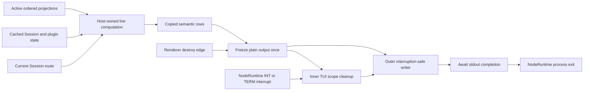

# Pluggable TUI epilogues: research wave synthesis

Date: 2026-08-30

Model: OpenAI GPT-5.6 Sol max (`gpt56s`)

Status: synthesis and staged recommendation; no interface is accepted and no
implementation is proposed by this document

## Decision

The most reachable direction has two tracks, not one generalized patch:

1. Repair the full TUI's production shutdown capability and keep `Active` as a
   fixed, private, primitive-snapshot carry. This is required now.
2. If a generic seam is headed upstream, prototype a dedicated structured
   registry whose projections run while the TUI is live and whose normalized
   output is retained by the host. This is the preferred generic direction,
   but it is not yet justified as a permanent downstream carry.

The first track is blocked by a verified production failure. Direct `Tui.run`
tests print the epilogue for synthetic `SIGINT`, but the actual CLI runs under
`NodeRuntime.runMain`. Its earlier `SIGINT` and `SIGTERM` handlers interrupt the
whole main Effect fiber. Local finalizers run, but the normal continuation after
the inner `Effect.scoped` does not, so the current epilogue write is skipped.
The observed production-shaped result is `SIGHUP` prints and exits 0, while
`SIGINT` and `SIGTERM` omit the epilogue and exit 130.

That failure is a capability blocker for both fixed and plugin epilogues. A
generic contribution API must not be used to conceal it.

For the eventual generic seam, the research now favors this separation:

- Interface shape: `context.ui.epilogue.register(projection)` returns a normal
  plugin-owned disposer and accepts additive structured rows.
- Implementation mechanism: one host-owned tracked computation evaluates the
  active ordered projections while Solid and plugin state are healthy, copies
  semantic values, and retains them as plain data.
- Shutdown mechanism: the host freezes a string before Solid disposal, performs
  ordinary cleanup, then writes from an interruption-safe outer finalizer.

This combines the best part of the structured-registry and retained-cell
reports without exposing a mutable cell handle, creating one Solid root per
row, or changing the JSX slot algebra. A null-returning slot remains a valuable
private prototype technique. It is not the preferred public vocabulary.

## What changed after the first synthesis

The initial synthesis favored a headless `session.epilogue` slot implemented
with retained-cell discipline. The six follow-up reports materially changed
the evidence and ranking.

| Earlier position | New evidence | Revised conclusion |
| --- | --- | --- |
| Retained cells appeared to have the largest implementation and conceptual surface. | The retained-cells addendum separates a one-operation public API, a medium-sized minimal adapter using existing Solid ownership, and an optional full atomic generation transaction. | A minimal retained computation is implementable with existing primitives. Only the fully transactional reload model is the largest variant. |
| An invisible OpenTUI node was dismissed mostly on conceptual grounds. | A `visible=false` text experiment proved display-none behavior and readable live storage, but also measured renderer allocation, a render request on update, and destruction of the text buffer. | Invisible OpenTUI storage is reachable, genuinely hidden, and still the wrong data mechanism. The rejection is now empirical rather than speculative. |
| A headless slot was assumed to need a parallel renderer path. | The headless-slot report found a registration-time adapter that can wrap a data projection in a null-returning capture component and reuse normal claim keys, ordering, `resolveSlots`, `Slot`, `PluginBoundary`, cleanup, and hot reload. | Slot reuse is real, but it comes with path-specific `render` semantics and possible display-none marker objects. It remains an alternative, not the default recommendation. |
| A dedicated registry meant either callback-at-shutdown or substantial parallel machinery. | The structured-registry report showed that `PluginProvider` already supplies a Solid owner, active registrations, order, and generation fencing. One aggregate `createComputed` can retain all current rows. | A dedicated public registry can use a compact retained implementation. Registry is an interface choice; retained computation is an implementation choice. |
| Imperative push looked like the smallest retained model. | Plugin-surface and registry audits showed that route changes are reactive local state, plugin setup has no guaranteed long-lived owner, and event-only push can miss navigation to cached Sessions. | Push remains a useful low-level prototype or source-specific option, but it pushes route and reactivity policy into every plugin. |
| The carried three-signal handler appeared to route all graceful signals through the successful epilogue path. | A child-process experiment and installed Effect source verified that production `NodeRuntime` interrupts on `SIGINT` and `SIGTERM`, skipping the normal post-scope write. | Production signal behavior must be fixed before judging any epilogue seam complete. |
| The current delayed callback was described in one report as primitive-only. | Current source copies `title`, but the delayed closure still dereferences `current?.id` and `current?.time.updated` from the captured Session store value. | The carry is request-free at output, but not lifecycle-free. Replace the broad thunk with an explicit primitive snapshot. |
| The local rolling bookmark was said to stop before `Active`. | The later carry audit found local `term-v2` at `c009d583b7d9`, including signal, `Active`, and the first synthesis; `term-v2@git` remained behind. | The earlier local-bookmark warning is stale, but Git-facing publication still risks omitting the newer work. |

At the audited upstream tip there were 18 commits since the carry base. The
fixed carry still had low hunk-level conflict risk. The broader candidate
surface had upstream movement in `app.tsx`, the public plugin context,
`PluginProvider`, and CLI plugin documentation. That movement strengthens the
case for refreshing before a generic prototype and against publishing a
downstream-only public API.

## Verified current behavior

### The current callback is request-free, not primitive-only

The Session route currently does this:

```ts
const current = session()
const title = Locale.truncate(current?.title ?? "", 50)
setEpilogue(() =>
  sessionEpilogue({
    title,
    sessionID: current?.id,
    updated: current?.time.updated,
  }),
)
```

The source is [`routes/session/index.tsx`](/packages/tui/src/routes/session/index.tsx#L200-L205).
`title` is copied immediately, but `id` and `time.updated` are read when the
delayed callback executes. There is no `data.session.get`, HTTP request,
database read, or filesystem read at that point, so the current carry is
lookup-free in the narrow request sense. It still retains a reactive store
object beyond the live route lifecycle. The fixed-carry report is correct that
this should become a primitive-only private snapshot.

The same effect runs before Session hydration and can install an epilogue with
an empty title and `opencode2 -s undefined`. A valid Session ID must be required
before any candidate exists.

### Direct `Tui.run` tests do not exercise the production runner

The current lifecycle test:

1. invokes `Tui.run` with `Effect.runPromise`;
2. installs a test renderer;
3. calls `process.emit("SIGINT")`;
4. observes the local TUI listener destroying the renderer;
5. lets the inner scope complete successfully; and
6. reaches the normal epilogue write.

See [`app-lifecycle.test.tsx`](/packages/tui/test/app-lifecycle.test.tsx#L264-L349).
This is useful evidence for renderer and local-scope behavior. It deliberately
does not include `NodeRuntime.runMain`, actual OS signal delivery, process exit,
or stdout flushing.

The production CLI ends in `NodeRuntime.runMain` after an `Effect.scoped` and a
successful-completion `process.exit` tap:

- [`packages/cli/src/index.ts`](/packages/cli/src/index.ts#L117-L120)
- [`Tui.run` post-scope write](/packages/tui/src/app.tsx#L449-L457)

Installed Effect `4.0.0-rc.112` registers `SIGINT` and `SIGTERM`, marks that a
signal was received, and calls `fiber.interruptUnsafe`. Its default teardown
maps interruption-only failure to exit code 130. The source and the reported
child-process experiment agree.

| Signal | `NodeRuntime` owns it | Local and scoped cleanup | Current epilogue | Observed exit |
| --- | --- | --- | --- | --- |
| `SIGHUP` | No | Runs | Printed | 0 |
| `SIGINT` | Yes | Runs | Skipped | 130 |
| `SIGTERM` | Yes | Runs | Skipped | 130 |

The causal distinction is normal continuation versus finalization. Interrupting
the main fiber does not prevent local finalizers. It prevents the lines after
the interrupted `Effect.scoped` from running as a normal success path.

### State and output must move to different lifecycle positions

The durable shape is:

```ts
type InternalEpilogueState =
  | { readonly status: "live"; readonly candidate?: EpilogueCandidate }
  | { readonly status: "frozen"; readonly output?: string }
  | { readonly status: "written" }
```

This is a private state sketch, not a public plugin type. Its placement rules
are the important part:

1. `live` candidate data must be host-owned and reachable outside the Solid
   render root and the inner local `Effect.scoped`.
2. The first TUI-owned renderer `destroy` listener must synchronously freeze a
   plain string before Solid disposal and before opening the shutdown latch.
3. The renderer then completes native terminal restoration and the inner scope
   awaits plugin, clipboard, and renderer cleanup.
4. The write must occur in an interruption-safe finalizer outside that inner
   scope, not in the normal continuation after `yield* Effect.scoped(...)`.
5. The finalizer must await stdout write completion before the main fiber
   completes and `NodeRuntime` calls `process.exit`.
6. Output failure must not replace the original success, failure, or
   interruption cause.

OpenTUI emits `destroy` before destroying the render tree and native renderer.
OpenTUI Solid registers another listener that disposes the Solid root. This
makes the early event suitable for copying state, not for writing terminal
output. Output remains after inner-scope cleanup.

The current `process.stdout.write` is fire-and-forget while the top-level CLI
can call `process.exit`. A delayed or backpressured stdout test is therefore a
second production prerequisite, not optional polish.

## Reconciled invariants

All six reports converge on the following contract:

1. No plugin callback, Session lookup, server request, database access, or
   filesystem access participates in final epilogue production after shutdown
   begins.
2. Live plugin projections may read only already-available cached and reactive
   state. Async refreshes complete before shutdown or miss the snapshot.
3. The host retains copied strings and semantic scalar values, never Solid
   proxies, JSX, renderables, plugin contexts, Promises, or mutable plugin row
   objects.
4. Freeze happens before Session cleanup, plugin deactivation, and Solid root
   disposal. Write happens after plugin and renderer cleanup.
5. Existing plugin setup, hot reload, disablement, last-good recovery, and
   cleanup ordering remain the lifecycle authority.
6. Core logo, Session identity, `Active` while core-owned, and `Continue` are
   not replaceable or suppressible by a plugin.
7. Plugins contribute bounded, single-line, unstyled semantic rows. The host
   owns ANSI, display width, alignment, truncation, control stripping, and the
   trailing newline.
8. Ordering is plugin enable order, registration order within a plugin, and
   row order within a registration if arrays are eventually allowed.
9. Leaving the Session route, switching Sessions, deletion, and unhydrated
   Sessions cannot leak an old Session or create an invalid Continue command.
10. One failure omits only its contribution. It cannot suppress core output or
    later plugins.
11. Real `NodeRuntime` signal behavior and stdout completion are part of the
    capability test matrix.
12. `SIGKILL`, `SIGSTOP`, and direct forced process termination remain outside
    the guarantee.

The stronger phrase "shutdown performs no I/O" is not correct. Existing plugin
cleanup may perform asynchronous I/O. The enforceable boundary is that epilogue
composition itself performs no lookup or plugin execution after freeze.

## Common themes and tensions

### Common themes

- Public Session timestamps and synchronous cached Session lookup already
  exist. No Schema, Protocol, Server, Core, or generated client change is
  needed for a plugin to derive a row.
- `context.ui.router.current()` is the authoritative displayed-Session source.
  Events and tabs are useful inputs, not route selection substitutes.
- Solid computations rerun from dependencies, not terminal frame rate.
- Plugin cleanup is unload behavior shared by shutdown, reload, and manual
  disable. It is not an exit-output hook.
- A freeze-before-cleanup and write-after-cleanup split is unavoidable for any
  sound design.
- The current fixed patch is cheaper to carry than every public generic seam.
- A generic seam improves carryability only if it lands upstream or gains
  several real downstream consumers.

### Tensions

| Tension | Reconciliation |
| --- | --- |
| Slot reuse versus interface honesty | A slot adapter can reuse real machinery, but a data projection is not JSX rendering and does not need replacement or hierarchy policy. Prefer a dedicated public registry unless upstream explicitly values one slot vocabulary. |
| Per-cell ownership versus one aggregate owner | Solid already owns `PluginProvider`. Start with one aggregate computation and retained array. Split per registration only after measured recomputation or isolation problems. |
| Imperative simplicity versus caller burden | Push handles make the host small but make every plugin track routes, hydration, events, and stale generations. Keep push as a source-specific fallback, not the first general API. |
| Exact last-good output versus minimal lifecycle change | Existing replacement has a transient inactive interval. Document and test it first. Add a transition-aware retained generation only if shutdown in that interval is both reachable and unacceptable. |
| Fresh relative time versus copied strings | Retaining `"4m ago"` can become stale. Keep `Active` core-owned initially or retain a semantic timestamp that the host formats at freeze. Never invoke a plugin formatter during shutdown. |
| Cached correctness versus lookup-free shutdown | Cached `updated`, `idle`, and running state can lag server projection. Improve live cache projection separately if reproduced; do not add a final fetch. |
| Signal identity versus current runtime behavior | `NodeRuntime` currently gives both INT and TERM exit 130. Conventional TERM is 143. The project must choose explicitly in process-level tests. |

## Interface shape versus implementation mechanism

Several reports used the word "cell" or "slot" for both the plugin API and the
host internals. Separating those decisions removes much of the disagreement.

| Option | Interface shape | Implementation mechanism | Shutdown plugin call | Carry and upstream assessment | Synthesis verdict |
| --- | --- | --- | --- | --- | --- |
| Fixed core patch | Private Session snapshot, no plugin API | Session route copies facts; host freezes and formats | No | Smallest: four production files and two tests for `Active`; easiest downstream carry | Immediate direction after lifecycle repair |
| Structured registry | Dedicated additive `ui.epilogue.register(projection)` | Can be shutdown pull or live retained computation | Pull: yes; retained: no | Medium public/runtime surface; clearest upstream contract | Preferred generic interface, retained implementation only |
| Host-owned computed cells | Usually an internal mechanism, not necessarily a public cell API | One aggregate `createComputed`, or later one memo per registration, copies rows while live | No | Medium and localizable; reuses Provider owner and registration state | Preferred generic mechanism |
| Imperative push cells | Mutable registration handle with `set` or `update` | Plugin decides update triggers; host copies latest value | No | Small host diff but repeated caller policy and stale-generation fencing | Useful fallback for event-native producers, not first general API |
| Headless logical slot | Path-specific `ui.slot({ append: "session.epilogue", render })` returning data | Registration-time wrapper mounts a tracked null capture through normal Slot, or a parallel pure-Solid manager | No with retained capture | Largest generic touch surface; real reuse but altered `render` meaning | Viable alternative only if type and conceptual gates pass upstream review |
| Null app-slot component | Existing visual `app` slot whose component creates an effect and returns `null` | Existing Slot supplies a Solid owner; effect publishes to a private collector | No | Available now for a private prototype; depends on visual slot mount and suppression policy | Strong experiment, weak permanent semantic dependency |
| `visible=false` OpenTUI storage | Hidden JSX convention, not a semantic row API | Store serialized rows in a real hidden text renderable and read `plainText` before destruction | No callback, but renderer read at freeze | Allocates renderer/native state, requests frames, dies with renderer | Reject as final design |

### Structured registry

The dedicated registry is the most honest public model. It exposes one new
operation for one new output domain. It does not teach `SlotClaim.render` two
different meanings or inherit visual replacement, degradation, ancestor
suppression, and before/after policy for an append-only text lane.

The shutdown-callback version remains rejected for production. A synchronous
callback can block OpenTUI's destroy stack, start I/O, mutate state, or throw
when diagnostics and cache lifetime are least reliable. Rejecting a returned
Promise does not undo async work already started.

### Host-owned computed cells

The strongest simplification from this wave is that retained behavior does not
require a public `cell` object or one root per contribution. `PluginProvider`
is already a Solid component and already owns:

- the reactive registration store;
- active flags;
- plugin enable order;
- within-plugin record insertion order;
- serialized reconciliation;
- setup rollback and last-good restoration; and
- activation-owned cleanup.

One host computation can traverse active epilogue projections in that order,
call each while live, normalize independently, and publish one immutable array
to the epilogue module. A dependency read by any projection reruns the aggregate
computation and therefore all projections. Epilogue counts are expected to be
small; instrument this before introducing per-row roots.

This mechanism still has a hot-reload interval where the old registration is
inactive before the replacement publishes. It is not a reason to pre-build a
parallel generation manager. It is a falsifying experiment and an explicit
first-version guarantee.

### Imperative push cells

Push is the smallest complete data path when a plugin already owns an event or
timer. It is less suitable as the common interface because route changes are
Solid state, not guaranteed server events, and setup is not documented as a
long-lived Solid owner. A general push plugin must duplicate initial hydration,
Session switching, cache updates, cleanup, and disposed-write handling.

Generation-owned leases are also mandatory if async work can push after hot
reload. The host-computed registry centralizes those concerns instead.

### Headless logical slot and null capture

The headless-slot report demonstrated more reuse than the initial synthesis
credited. At registration time, while the path-specific callback type is still
known, the host can wrap the projection in a null-returning capture component.
The stored claim remains JSX-shaped, so existing claim identity, resolver,
normal Slot mount, error boundary, cleanup, and reload behavior can remain.

The cost is semantic: visual `render` functions are component setup and run
once, while the epilogue projection body is itself a tracked read and may run
many times. The public conditional output type and append-only special case
must explain that distinction.

The null-component and marker findings are compatible:

- A focused null-returning app-slot experiment updated a plain cell from
  `alpha` to `beta` with no plugin text or box renderable, no root child, and no
  render request. The measured allocation was the test renderer root.
- The complete current `Slot` implementation uses `For`, `Show`, and dynamic
  insertion. OpenTUI Solid can create display-none slot marker objects for
  those regions even when every contribution returns `null`.

Therefore a null capture is a low-cost private prototype, but a full headless
slot must still measure marker allocation and mount-time frame requests. A
strict pure-Solid slot manager should not be built unless those measurements
fail, because it would duplicate reconciliation and boundary behavior.

### `visible=false` OpenTUI storage

The hidden-text experiment established all of the following:

- it does not paint or consume a visible line;
- OpenTUI maps visibility false to Yoga display none;
- the hidden text remains a real child with a renderable and native text buffer;
- updating its content requests a renderer frame;
- `plainText` is readable while live; and
- reading it after renderer destruction fails because the text buffer is
  destroyed.

It adds serialization and parsing without adding a capability. A direct Solid
computation or null capture retains the same semantic value without renderer
allocation, frame requests, or renderer-lifetime coupling.

## Proposed generic interface

This is a concise target for an upstream discussion, not an accepted contract:

```ts
export type EpilogueValue =
  | { readonly type: "text"; readonly text: string }
  | { readonly type: "relative-time"; readonly timestamp: number }

export type EpilogueRow = {
  readonly label: string
  readonly value: EpilogueValue
}

export interface Epilogue {
  /**
   * Registers a cheap synchronous projection of live cached state.
   * The host tracks and copies its result before shutdown.
   */
  register(
    project: (scope: { readonly sessionID: string }) => EpilogueRow | undefined,
  ): () => void
}

export interface UI {
  // Existing members...
  readonly epilogue: Epilogue
}
```

One registration yielding one row is the narrowest initial shape. A plugin can
register several rows in declaration order. Allowing an array may prove more
ergonomic, but it should be chosen explicitly rather than making error and
ordering granularity accidental.

`relative-time` is included to show how exit-time freshness can remain
host-owned. It is not automatically required in the first upstream slice. If
the first two independent adapters need only stable text, start text-only and
keep `Active` core-owned. A running Active producer can return text `running`;
an idle producer can return a semantic timestamp based on the chosen
`max(updated, idle)` rule.

## Deep module and thin adapters

Carryability favors concentrating policy in one deep epilogue module and
keeping high-churn files as adapters.

The deep module should own:

- the live core Session candidate;
- the latest normalized ordered supplemental rows;
- Session epoch protection;
- row validation, control stripping, and budgets;
- immutable copying;
- the idempotent `live -> frozen -> written` state machine;
- host formatting inputs and explicit freeze clock; and
- per-row error isolation policy that cannot suppress the core envelope.

It should own no renderer traversal, server client, plugin loader, filesystem
access, or plugin cleanup.

The existing [`context/epilogue.tsx`](/packages/tui/src/context/epilogue.tsx)
is the natural starting boundary. If it grows beyond one coherent file, its
helpers can be grouped under an epilogue domain directory rather than spread
through plugin and route modules.

Thin adapters should do only this:

| Adapter | Responsibility |
| --- | --- |
| Session route | Copy one hydrated Session's required facts while live; clear by matching Session epoch. |
| Plugin API | Turn `ui.epilogue.register` into an activation-owned registration and disposer. |
| Plugin provider | Preserve projection records in existing plugin order and establish one tracked aggregate publication into the deep module. |
| `Tui.run` | Freeze from the early destroy edge, open the latch, and invoke the outer interruption-safe awaited writer. |
| Presentation | Purely render core and normalized supplemental values with an explicit clock. |
| CLI entrypoint | Ideally no production change; it remains the process-level verification boundary. Change it only if the project chooses custom signal or exit-code ownership. |

The recommended registry should leave the visual Slot resolver and renderer
untouched. That is a carry advantage, not merely an aesthetic preference.

## Lifecycle diagram



Normal app exit reaches `destroy` directly. Production `SIGINT` and `SIGTERM`
first interrupt the main fiber; scope release and OpenTUI signal ownership still
converge on renderer destruction. The writer must be a finalizer that runs for
that interruption, not a success continuation.

## Carryability

### Immediate fixed carry

The current signal plus `Active` code is 52 insertions and 18 deletions across
six files in two independent commits. `Active` itself touches four production
files and two tests:

- [`packages/tui/src/app.tsx`](/packages/tui/src/app.tsx)
- [`packages/tui/src/context/epilogue.tsx`](/packages/tui/src/context/epilogue.tsx)
- [`packages/tui/src/routes/session/index.tsx`](/packages/tui/src/routes/session/index.tsx)
- [`packages/tui/src/util/presentation.ts`](/packages/tui/src/util/presentation.ts)
- [`packages/tui/test/app-lifecycle.test.tsx`](/packages/tui/test/app-lifecycle.test.tsx)
- [`packages/tui/test/util/presentation.test.ts`](/packages/tui/test/util/presentation.test.ts)

This remains the best immediate carry even after lifecycle repair. It creates
no public compatibility promise and can be deleted independently if upstream
lands equivalent behavior.

The private snapshot should include copied `title`, required `sessionID`,
cached running status, `updated`, and optional `idle`. If the label remains
`Active`, the recommended cached policy is:

```text
running -> "running"
idle    -> age(max(updated, idle ?? updated), explicitClock)
```

Renaming the row to `Updated` and using only `time.updated` is the narrower
alternative. Cache freshness is a separate client concern.

### Generic downstream risk

A generic seam crosses public plugin types, plugin registration, reactive host
state, shutdown, Session composition, presentation, tests, and documentation.
It is more expensive to carry than one fixed row even in its simplified form.
Publishing it only downstream also creates an API that upstream OpenCode and
ordinary external plugins do not recognize.

The generic framework pays for itself only when at least one of these is true:

- upstream accepts and maintains it;
- several independently owned downstream plugins use it; or
- repeated fixed patches have become more expensive than the framework.

None is established yet. Two fields in one built-in formatter do not count as
two independent adapters.

### Exact hot files and touchpoint classes

| Path | Touchpoint class | Fixed carry | Generic registry | Carry risk and rule |
| --- | --- | --- | --- | --- |
| `packages/cli/src/index.ts` | Process runner and exit | Verification only | Verification or optional runner policy | High semantic risk. Avoid editing unless exit-code ownership changes. |
| `packages/tui/src/app.tsx` | Renderer, Effect scope, signals, freeze, output | Required | Required | High lifecycle heat. Keep only thin state-machine wiring here. |
| `packages/tui/src/context/epilogue.tsx` | Deep retained-data module | Required | Primary implementation home | Low to medium churn. Concentrate normalization, snapshots, and freeze policy here. |
| `packages/tui/src/routes/session/index.tsx` | Live Session producer | Required | Required core adapter | Large hot file. Keep one narrow existing effect and copy facts immediately. |
| `packages/tui/src/util/presentation.ts` | Pure terminal policy | Required | Required | Low churn. Keep explicit clock, ANSI, ordering, and core labels here. |
| `packages/plugin/src/tui/context.ts` | Public plugin contract | None | Required | Medium textual, high compatibility risk. Add one narrow API only for upstream-bound work. |
| `packages/tui/src/plugin/api.tsx` | Public-to-host adapter | None | Required | Medium. Register and dispose only; do not implement lifecycle policy here. |
| `packages/tui/src/plugin/context.tsx` | Generation, activation, order | None | Required but thin | High semantic heat and recently moved upstream. Add one record kind and aggregate tracking; avoid a parallel lifecycle. |
| `packages/tui/src/plugin/render.tsx` | JSX slot rendering | None | None for registry | High if touched. Leaving it unchanged is a reason to prefer registry. |
| `packages/tui/src/plugin/structure.ts` | Visual placement algebra | None | None for registry | High conceptual risk. Epilogue needs no replacement or degradation rules. |
| `packages/tui/test/app-lifecycle.test.tsx` | Inner lifecycle integration | Required | Required | High fixture heat. Add gated cleanup semantics, but do not mistake it for process coverage. |
| `packages/tui/test/plugin-hot-reload.test.tsx` | Generation behavior | None | Required | Medium to high. Reuse existing watcher fixtures and test the transient interval explicitly. |
| `packages/www/src/docs/content/build/plugins/cli.mdx` | Public contract documentation | None | Required | Active upstream surface. Update only with an accepted public API. |

No Protocol, Server `HttpApi`, Core, Schema, generated client, or persistent
storage change is required.

### Upstreamability

The work should remain split by independently reviewable capability:

1. Host-owned graceful shutdown and process-level signal correctness.
2. Fixed Session activity presentation and private primitive snapshot.
3. Private retained-registry experiment with no public API.
4. Upstream public structured registry, only after experiments and demand.
5. Optional migration of `Active` to a built-in plugin after acceptance.

Signal handling has the strongest immediate upstream case. Fixed `Active` is a
small product proposal with a separate semantic review. The generic registry is
the most upstreamable extensibility design because it is additive, structured,
renderer-independent, and reuses existing plugin ownership and order.

If upstream declines the registry, delete the private prototype and retain the
fixed carry. Do not maintain a public downstream headless slot or registry in
parallel with an upstream-incompatible API.

## Recommended staged direction

### Stage 1: refresh and establish the actual carry

Refresh the two code commits onto the current `v2@origin` before editing plugin
internals. Keep graceful signal handling and fixed `Active` adjacent but
independent. Verify both local and Git-facing bookmark tips so review does not
silently omit `Active`.

Prerequisite: inspect each commit-local diff rather than one old-base-to-tip
diff, because the latter includes unrelated upstream changes.

### Stage 2: repair the shutdown capability

Replace the escaped arbitrary thunk with plain private candidate state, freeze
once in the early destroy listener, move final output to an interruption-safe
outer finalizer, and await stdout completion. Require hydration before creating
the candidate. Make title clearing idempotent before calling renderer methods
on an already destroyed renderer.

Prerequisite: decide and test signal exit codes, second-signal behavior during
gated cleanup, and stdout failure policy.

This stage must pass actual child-process `SIGHUP`, `SIGINT`, and `SIGTERM`
tests under the production CLI runner. In-process `process.emit` tests are not
sufficient.

### Stage 3: tighten fixed `Active`

Copy status, updated, and idle while live; use an explicit clock in pure
presentation; reject unhydrated Sessions; and assert no post-trigger Session
request. Keep `Active` core-owned through the generic-interface review.

Prerequisite: choose `Active` versus `Updated`, and state-at-destroy versus
age-at-write semantics.

### Stage 4: private retained-registry prototype

Do not edit `packages/plugin` yet. Build a disposable internal collector with
synthetic ordered projections and one host-owned computation. Feed it from a
fixture plugin or a private null app-slot tracker only as needed to exercise
real reactive data. Keep all final composition in the host.

Prerequisite: at least two meaningfully different candidate adapters, one of
which benefits from independent plugin ownership, enablement, or reload.

### Stage 5: upstream public registry proposal

If the private prototype passes and upstream interest is real, add the narrow
dedicated registry, tests, and documentation. Leave `Active` fixed for the
first reviewable slice so API review is not coupled to timestamp semantics.

Prerequisite: explicit decisions on row cardinality, semantic values, limits,
errors, duplicates, route scope, and the hot-reload transient interval.

### Stage 6: migrate one producer, never duplicate it

After the public seam lands, move `Active` only if its mandatory versus
disableable status is resolved and semantic relative time is supported. Remove
the fixed implementation in the same direction of travel. Never emit both a
core and plugin `Active` row.

## Falsifying experiments

These experiments should stop or redirect the design, not merely add coverage.

| Experiment | Required result | Falsifier and consequence |
| --- | --- | --- |
| Production runner signals | Actual CLI child processes print one frozen epilogue after cleanup for HUP, INT, and TERM, with explicit codes. | Missing INT or TERM output means the lifecycle capability remains blocked. Do not proceed to public API work. |
| Awaited stdout | A deliberately delayed or backpressured writable completes before process exit. | Truncation or early exit requires moving/strengthening the outer writer before any seam is sound. |
| Gated plugin cleanup | Freeze occurs before cleanup mutation; stdout stays empty until cleanup ends; the pre-cleanup row prints once. | Early output or mutable frozen data reveals a general lifecycle bug. Fix it separately from plugin API design. |
| Primitive boundary | After freeze, clearing stores, unregistering plugins, and disposing Solid cannot alter output or trigger any request. | Any changed output means the snapshot retained a proxy, callback, accessor, or mutable map. |
| Aggregate retained computation | Route, hydration, and cache changes recompute rows while repeated renderer frames do not; row updates allocate no renderables or request frames. | Frame coupling or missing route reactivity invalidates the simple host-computed mechanism. |
| Aggregate cost | Instrument projection counts with realistic plugin counts and high-frequency cache changes. | Material all-projection rerun cost earns per-registration memos without changing the public API. It does not justify shutdown pull. |
| Projection containment | Initial and later throws, thenables, malformed values, controls, and oversized rows omit only one registration and produce bounded diagnostics while live. | A projection can crash the Provider or core epilogue; factor non-JSX per-projection containment before continuing. |
| Replacement boundary | Gate old cleanup, new setup, failure, and fallback, then destroy at each boundary. | If the transient missing row is product-unacceptable, add one transition-aware retained-generation hook. If that requires a parallel loader, reconsider the seam. |
| Session epoch | Switch A to B before B hydrates and inject late A updates. | Any mixed or stale Session output requires an epoch guard in the deep module. |
| Public type spike | Existing visual slots compile unchanged; registry projections reject Promise and JSX; declaration output remains readable. | Brittle inference or a broad type union requires simplifying the API before upstream review. |
| Two-adapter threshold | Two independently owned adapters use the same row model without arbitrary renderer access. | If both remain simpler as fixed fields, the generic seam is still hypothetical. |
| Headless-slot fallback | If upstream prefers slot vocabulary, measure the complete null-capture adapter, marker allocation, error-boundary behavior, and type inference. | Any broad Slot renderer/resolver change or surprising `render` semantics selects the dedicated registry instead. |

## Unresolved decisions

1. Should the public operation live at `context.ui.epilogue` or top-level
   `context.epilogue`? This synthesis recommends `ui` because it is terminal UI
   presentation, while keeping renderer machinery out of the contract.
2. Does one registration return one row or an ordered row array?
3. Is text the only initial value, or is `relative-time` justified by a real
   adapter?
4. Is `Active` mandatory core output or a disableable built-in plugin?
5. Is activity shown at destroy time or adjusted to write time after a long
   cleanup?
6. Does a runtime projection error clear its row or retain the previous valid
   value? Cross-Session retention must never occur.
7. Is a transiently absent row during hot reload acceptable at shutdown?
8. Which labels are host-reserved, and are duplicate plugin labels legal?
9. What are the row-count, byte, grapheme, and display-width budgets?
10. Should Session deletion suppress the epilogue or preserve the last valid
    identity snapshot?
11. Should `SIGTERM` retain current exit 130 behavior or use conventional 143?
12. What happens on a second signal while plugin cleanup is blocked?
13. Is a closed or failed stdout best-effort, logged, or process-failing?
14. Should Mini ever consume the same structured rows despite its different
    scrollback lifecycle?

## Cross-references

- [First epilogue synthesis](/.design/term-v2/epilogue-plugins0.gpt56s.md): establishes the original invariants and headless-slot plus retained-cell hypothesis that this wave revises.
- [Shutdown carry audit](/.design/term-v2/research/shutdown-carry-audit0.gpt56s.md): supplies the process-level state machine, `NodeRuntime` reproduction, stdout risk, upstream overlap scan, and release blocker.
- [Plugin surface audit](/.design/term-v2/research/plugin-surface-audit0.gpt56s.md): distinguishes supported live plugin capabilities from dependency-exposed experiments and unsupported shutdown hacks.
- [Retained-cells research](/.design/term-v2/research/retained-cells0.gpt56s.md): supplies the implementability addendum, exact touch points, minimal versus transactional distinction, and measured null/hidden experiments.
- [Headless-slot research](/.design/term-v2/research/headless-slot0.gpt56s.md): supplies the strongest concrete Slot reuse design, path-specific type sketch, normal-Slot capture adapter, and falsifying gates.
- [Structured-registry research](/.design/term-v2/research/structured-registry0.gpt56s.md): supplies the aggregate host computation simplification and the dedicated retained-registry recommendation.
- [Fixed-carry research](/.design/term-v2/research/fixed-carry0.gpt56s.md): supplies the immediate carry inventory, primitive Session snapshot, Active semantics, refresh mechanics, and generic-seam threshold.
- [Term-v2 refresh record](/.design/term-v2/refresh-20260829.model-unspecified.md): records the prior carry base and duplicate-then-rebase practice needed to interpret current carryability.
- [Current TUI runner](/packages/tui/src/app.tsx#L200-L457): verifies inner scope ownership, signal listeners, early destroy latch, and the current normal-only post-scope write.
- [Current plugin lifecycle](/packages/tui/src/plugin/context.tsx#L95-L224): verifies the existing Solid owner, active registrations, serialized mutations, cleanup ownership, and last-good machinery reused by the registry mechanism.
- [Current public slot contract](/packages/plugin/src/tui/context.ts#L157-L239): shows the JSX and visual-placement semantics a headless logical slot would broaden.
- [`NodeRuntime` signal source](https://github.com/Effect-TS/effect-smol/blob/3a1128c7684e04d34d9f541f77adaac38a513056/packages/platform-node-shared/src/NodeRuntime.ts#L36-L59): confirms process-level INT and TERM interruption.
- [OpenTUI renderer destruction](https://github.com/anomalyco/opentui/blob/ae272000a5d12425c253c4537eb5e9e57df9265a/packages/core/src/renderer.ts#L4262-L4489): explains why destroy is a pre-disposal freeze edge rather than a post-terminal output hook.

## Source cross-comparison

| Source | Particular strengths and notable ideas | Relative weaknesses |
| --- | --- | --- |
| [`epilogue-plugins0.gpt56s.md`](/.design/term-v2/epilogue-plugins0.gpt56s.md) | Best broad problem framing; states durable invariants; distinguishes logical headless content from invisible rendered content; proposes freeze-before-cleanup; makes carryability and upstream acceptance explicit. | Predates measured null/hidden behavior and the production `NodeRuntime` failure; overstates retained-cell size; tentatively favors Slot before the dedicated aggregate registry is known. |
| [`shutdown-carry-audit0.gpt56s.md`](/.design/term-v2/research/shutdown-carry-audit0.gpt56s.md) | Strongest process-level audit; reconstructs listener/finalizer order; verifies INT/TERM omission and exit 130; identifies stdout flushing, title idempotency, hydration, and real-signal test gaps; gives the clearest capability state machine. | Its generic comparison does not incorporate the later aggregate-registry simplification; it incorrectly characterizes the current delayed callback as fully primitive-only, while source shows deferred proxy field reads; its child reproduction isolates Effect without full OpenTUI, though source establishes the causal result. |
| [`plugin-surface-audit0.gpt56s.md`](/.design/term-v2/research/plugin-surface-audit0.gpt56s.md) | Best supported-capability map; proves route, cache, events, memory, cleanup, and null component can do all live work; clearly separates supported API, dependency-exposed experiments, and hacks; identifies the host seam as the only missing capability. | Favors push retention before fully considering one aggregate host computation; treats the current post-scope writer as reusable without resolving production interruption; cannot by itself establish final output ordering. |
| [`retained-cells0.gpt56s.md`](/.design/term-v2/research/retained-cells0.gpt56s.md) | Most useful implementability correction; separates minimal and transactional cells; inventories native Solid and PluginProvider reuse; gives exact touch points and carry heat; experimentally validates null components and `visible=false` storage; argues for a deep epilogue module with thin adapters. | The main design initially over-builds generation leases, per-cell roots, and full Session cloning; the addendum is stronger and simpler than its opening recommendation; its original post-scope output placement predates the `NodeRuntime` blocker. |
| [`headless-slot0.gpt56s.md`](/.design/term-v2/research/headless-slot0.gpt56s.md) | Strongest case for real Slot reuse; finds the registration-time JSX adapter that avoids widening internal erased storage; distinguishes invisible JSX, null capture, and pure-Solid manager; provides precise type, ordering, epoch, error, and falsification plans. | Public `render` changes meaning on one path; visual replacement and degradation policy remain semantically irrelevant; exact marker/error behavior still needs measurement; it has the widest generic touch surface and does not resolve production interruption-safe output. |
| [`structured-registry0.gpt56s.md`](/.design/term-v2/research/structured-registry0.gpt56s.md) | Best interface/mechanism separation; reduces retained implementation to one aggregate computation under the existing Provider owner; reuses active registration order without roots, leases, timers, or slot changes; semantic `relative-time` avoids stale strings and shutdown callbacks. | One aggregate computation reruns every projection on any tracked dependency; non-JSX containment and diagnostics remain new work; the transient reload gap is accepted rather than solved; its normal post-scope write must be replaced after the signal audit. |
| [`fixed-carry0.gpt56s.md`](/.design/term-v2/research/fixed-carry0.gpt56s.md) | Best immediate carry discipline; quantifies exact hunks and hot files; proposes the narrow primitive snapshot; sharpens `Active` using running/updated/idle; gives useful refresh, conflict, and generic-threshold rubrics. | Its real process signal test is still listed as a future experiment and its recommendation assumes post-scope output is reachable; some upstream-overlap observations were superseded by the later audit; it does not provide extensibility if independent adapters become real. |
