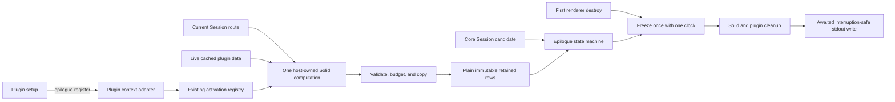

# Generic TUI epilogue registry implementation

Date: 2026-08-31

Model: OpenAI GPT-5.6 Sol high (`gpt56s`)

Status: implemented on the `term-v2` lineage atop `v2@origin` at `9553187b`; focused acceptance gates are green

## Outcome

OpenCode plugins can now leave useful Session context after the TUI exits without
participating in shutdown output composition. A plugin registers a cheap structured projection;
the live host tracks its cached dependencies, validates and copies the result,
freezes plain data before teardown, and prints it only after terminal and plugin
cleanup. The first production adapter adds Session cost while the mandatory
`Active` row remains core-owned.

This is a retained-data capability, not a rendering slot. It gives plugins one
small semantic API while preserving the existing renderer, activation manager,
shutdown state machine, signal policy, and awaited stdout writer.

## Architecture



The ownership split is deliberate:

| Boundary                                                                                                        | Responsibility                                                                                                |
| --------------------------------------------------------------------------------------------------------------- | ------------------------------------------------------------------------------------------------------------- |
| [`packages/plugin/src/tui/context.ts`](/packages/plugin/src/tui/context.ts)                                     | Public structured row and synchronous projection types.                                                       |
| [`packages/tui/src/plugin/api.tsx`](/packages/tui/src/plugin/api.tsx)                                           | Adapts `register` to the standard activation-owned registration disposer.                                     |
| [`packages/tui/src/plugin/context.tsx`](/packages/tui/src/plugin/context.tsx)                                   | Reuses plugin ordering, activation, deactivation, and hot-reload ownership; runs one aggregate computation.   |
| [`packages/tui/src/context/epilogue.tsx`](/packages/tui/src/context/epilogue.tsx)                               | Validates and copies projected rows, retains the current Session epoch, and owns `live -> frozen -> written`. |
| [`packages/tui/src/util/presentation.ts`](/packages/tui/src/util/presentation.ts)                               | Formats host-owned labels, values, and relative time against the explicit freeze clock.                       |
| [`packages/tui/src/feature-plugins/sidebar/context.tsx`](/packages/tui/src/feature-plugins/sidebar/context.tsx) | Projects cached Session cost as the first real adapter.                                                       |

The implementation does not modify `app.tsx`, the Session route, the visual Slot
algebra, `plugin/render.tsx`, `plugin/structure.ts`, or the shutdown writer.

## Contract

```ts
context.ui.epilogue.register(({ sessionID }) => {
  const session = context.data.session.get(sessionID)
  if (!session) return
  return {
    label: "Updated",
    value: { type: "relative-time", timestamp: session.time.updated },
  }
})
```

One registration contributes zero or one row. Values are either host-formatted
text or a semantic timestamp. Projection order is plugin enable order followed
by registration order within that plugin; duplicate labels remain legal.

## Invariants

1. Projections run only in the live Solid tree. Freeze and output invoke no plugin projection or formatter.
2. Retained values are fresh frozen objects and one frozen array, never plugin-owned JSX, callbacks, or mutable cells.
3. A retained row is used only when its Session ID matches the core candidate's Session ID.
4. `Session`, `Active`, and `Continue` remain an unsuppressible host envelope. Plugin rows occupy one additive lane before `Continue`.
5. `Active` stays core-owned and its label is reserved, so the final output contains exactly one mandatory activity row.
6. Each projection fails independently. Throws, thenables, malformed values, terminal controls, newlines, and oversize values cannot suppress later or core rows.
7. Labels are limited to 24 display columns, text values to 48, and only the first eight registrations per plugin are evaluated.
8. Deactivation removes rows before asynchronous cleanup. A destroy during hot replacement may therefore freeze the documented missing-row interval.
9. Row-only updates create no OpenTUI renderable and request no frame. Renderer frames are not projection dependencies.
10. The first destroy event freezes once; later unregister, store clearing, route movement, Solid disposal, and plugin cleanup cannot alter output.

## Carryability

The registry is split into independently reviewable commits:

1. `feat(tui): retain supplemental epilogue rows`
2. `feat(plugin): expose TUI epilogue rows`
3. `feat(tui): show session cost on exit`
4. `docs: document TUI epilogue rows`
5. `test(tui): verify epilogue render isolation`

The high-churn plugin host receives one record kind and one aggregate publisher.
All policy stays in the epilogue domain, and the public adapter uses the existing
registration counter, store, disposer, and serialized generation lifecycle.
That keeps future upstream refreshes local and makes the public seam removable
without unwinding shutdown repair.

## Verification

Green focused evidence on the final stack:

- Process matrix: fixture `app.exit`, `SIGHUP`, `SIGINT`, and `SIGTERM`, plus actual CLI `SIGHUP`, `SIGINT`, and `SIGTERM`; all seven retain core, Cost, and external rows after gated cleanup and delayed stdout.
- In-process lifecycle and presentation: 36 passing tests.
- Registry, renderer-isolation, validation, epoch, freeze, and Cost adapter: 8 passing tests.
- Existing plugin hot-reload suite: 10 passing tests.
- Plugin package suite: 10 passing tests.
- TUI and plugin typechecks: green.
- Website typecheck, generated-content check, and production build: green.

The rebased upstream full TUI suite is not currently deterministic in this
environment. On the preceding `49dd2cea` base, a clean pre-registry workspace
produced 1,194 passes and seven failures, including four process-ready timeouts
and unrelated mini/dialog failures. The final stack produced 1,202 passes and
four failures in untouched history, mini, and diff-viewer tests; those failures
reproduce or pass nondeterministically in focused baseline runs. After the
refresh to `9553187b`, another full run reported no assertion failure before Bun
1.3.14 segfaulted after roughly 179 seconds. The epilogue acceptance suites
remain green, and the process timeout was widened to accommodate the slower
rebased tree.

## Cross-references

- [Implementation primer](/.design/term-v2/epilogue-implementation.md): staged plan, lifecycle constraints, and original acceptance gates.
- [Structured registry research](/.design/term-v2/research/structured-registry0.gpt56s.md): public interface rationale, retained aggregate design, validation policy, and output lane.
- [Shutdown carry audit](/.design/term-v2/research/shutdown-carry-audit0.gpt56s.md): freeze-before-disposal and interruption-safe output invariants preserved by this implementation.
- [Retained-cell implementability addendum](/.design/term-v2/research/retained-cells0.gpt56s.md#addendum-implementability-and-mechanical-sympathy): native Solid and plugin-lifecycle reuse that made the narrow implementation possible.
- [CLI plugin documentation](/packages/www/src/docs/content/build/plugins/cli.mdx#exit-epilogue): public usage, ordering, limits, errors, and reload behavior.
