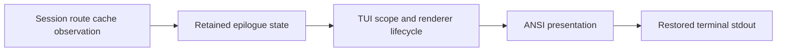
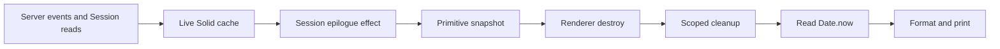

# Fixed-purpose Active epilogue carry

Date: 2026-08-30

Model: OpenAI GPT-5.6 Sol max (`gpt56s`)

Status: research and carry recommendation; no implementation changes made by
this note

## Decision

Keep graceful termination and the Active epilogue as a small, fixed-purpose
TUI carry for now. Do not carry a generic plugin framework downstream merely
to move one row out of core.

The current two code commits are already close to the smallest healthy patch:

- `e3b101dc` changes two files, with 15 insertions and 11 deletions.
- `59f70da7` changes four production files and two tests, with 37 insertions
  and 7 deletions.
- The six relevant files are unchanged between the last base, `e70d667a`, and
  the inspected `v2@origin`; `jj diff --stat --from e70d667a --to v2@origin`
  over those paths is empty.

The main correction is not another public seam. Replace the current broad
`() => string` shutdown thunk with a private, structured, primitive-only
Session epilogue snapshot. The Session route updates that snapshot while the
cache is alive. `Tui.run` formats it after scoped teardown using only the
snapshot and the current clock.

This gives the fixed carry a small and enforceable interface:

```ts
type SessionEpilogueSnapshot = {
  title: string
  sessionID: string
  activity: {
    status: "idle" | "running"
    updated: number
    idle?: number
  }
}
```

It preserves the requirement that shutdown performs no Session lookup while
avoiding arbitrary callback behavior after Solid, plugins, and the renderer
have begun disposal.

## Scope

The carried behavior consists of two separable facts:

1. `SIGHUP`, `SIGINT`, and `SIGTERM` all enter the normal renderer destruction
   path instead of bypassing terminal restoration.
2. A hydrated Session leaves a post-cleanup epilogue with Session, Active, and
   Continue rows, where Active is derived from already-cached state.

Signal handling is a host lifecycle invariant. It remains host-owned even if
epilogue rows eventually become pluggable. A plugin must not be required to
load successfully for Ctrl-C or a supervisor's termination signal to restore
the terminal.

The Active row is presentation policy. It can remain fixed while it has one
consumer and one universally useful meaning. A generic seam becomes real only
when there are multiple independent adapters, especially adapters owned by
external plugins.

## Current patch inventory

### Commit `e3b101dc`: graceful signals

| Path | Exact change | Semantic role | Carry heat |
| --- | --- | --- | --- |
| [`packages/tui/src/app.tsx`](/packages/tui/src/app.tsx#L277-L284) | Replaces one `SIGHUP` listener with one shared handler registered for `SIGHUP`, `SIGINT`, and `SIGTERM`; release removes all three. | Owns process signal to renderer teardown transition. | Medium to high. Renderer acquisition and shutdown orchestration attract upstream lifecycle changes. |
| [`packages/tui/test/app-lifecycle.test.tsx`](/packages/tui/test/app-lifecycle.test.tsx#L218-L349) | Generalizes the SIGHUP lifecycle test, exercises SIGTERM, makes the epilogue test exit through SIGINT, and verifies listener cleanup. | Anchors signal coverage, terminal title reset, scope disposal, and epilogue survival. | High textual heat. The file is 1,249 lines and contains broad integration fixtures. |

The production hunk is seven changed lines. Its semantic dependency is the
existing `renderer.once("destroy", ...)` latch directly below it. The previous
refresh conflict was mechanical: upstream changed `Deferred` to `Latch`, while
the signal policy remained valid. That conflict is documented in the
[2026-08-29 refresh record](/.design/term-v2/refresh-20260829.model-unspecified.md#L24-L43).

The signal commit should remain independent. It is a coherent upstream bug fix
without any dependency on Active, plugin design, or timestamp semantics.

### Commit `59f70da7`: Active epilogue

| Path | Exact change | Semantic role | Carry heat |
| --- | --- | --- | --- |
| [`packages/tui/src/app.tsx`](/packages/tui/src/app.tsx#L226-L227) | Changes retained epilogue state from an eager string to a delayed value. | Lets age be evaluated at actual exit. | Medium. The hunk is isolated but sits in the central runner. |
| [`packages/tui/src/app.tsx`](/packages/tui/src/app.tsx#L449-L457) | Invokes the delayed value only after `Effect.scoped` has returned. | Guarantees output follows renderer and scope cleanup. | Medium to high semantic importance, low textual size. |
| [`packages/tui/src/context/epilogue.tsx`](/packages/tui/src/context/epilogue.tsx) | Changes the internal setter value type from `string` to `() => string`. | Carries retained epilogue state from the Session route to `Tui.run`. | Low churn but all-or-nothing conflict risk because the file is six lines. |
| [`packages/tui/src/routes/session/index.tsx`](/packages/tui/src/routes/session/index.tsx#L198-L205) | Captures the current Session and installs a delayed formatter. | Chooses the displayed Session and obtains cache-backed facts. | High textual heat. The file is 3,963 lines, but the hunk is at the pre-existing epilogue effect. |
| [`packages/tui/src/util/presentation.ts`](/packages/tui/src/util/presentation.ts#L26-L48) | Adds the Active row and relative-age formatting. | Owns ANSI-safe fixed epilogue presentation. | Low. The whole file is 48 lines, so conflicts should indicate real presentation changes. |
| [`packages/tui/test/app-lifecycle.test.tsx`](/packages/tui/test/app-lifecycle.test.tsx#L337-L343) | Adds one Active assertion to the SIGINT integration test. | Connects live Session cache, graceful teardown, and final stdout. | High file heat, tiny hunk. |
| [`packages/tui/test/util/presentation.test.ts`](/packages/tui/test/util/presentation.test.ts) | Adds relative-age examples. | Anchors pure presentation behavior. | Low. The whole test file is 23 lines. |

The production patch is spread across four files because the upstream design
already separates four responsibilities:



Collapsing those responsibilities into fewer files either freezes age too
early, adds a timer, couples Session cache access to the top-level runner, or
duplicates presentation logic. Four production touch points are therefore a
reasonable minimum under the current upstream architecture.

## Hot spots and rebase behavior

### `app.tsx`: lifecycle hot spot

[`Tui.run`](/packages/tui/src/app.tsx#L226-L457) owns renderer acquisition,
clipboard disposal, plugin finalizers, process signal listeners, the destroy
latch, Solid rendering, error output, and epilogue output. Upstream lifecycle
work can legitimately change this area.

The carried changes should remain three small, independent hunks:

1. The retained epilogue value shape near the start of `run`.
2. The three-signal acquire/release block beside the destroy latch.
3. Formatting and writing the retained epilogue after `Effect.scoped`.

Do not extract a downstream shutdown module. Extraction would turn a local
three-hunk carry into imports, a new file, and a larger move-sensitive diff.
The current locality is more rebaseable than a nominal abstraction.

The semantic conflict rule is simple: preserve upstream's current renderer
and latch mechanics, then route all three signals through the same idempotent
renderer destruction helper. [`destroyRenderer`](/packages/tui/src/util/renderer.ts)
already clears the title before destroying the renderer.

### `app-lifecycle.test.tsx`: textual hot spot and semantic anchor

This is the likeliest conflict file because it is large and actively used for
unrelated startup, route, renderer, and prompt lifecycle tests. The fixed carry
reuses two existing tests instead of adding another large fixture. That is a
good implementation trade, but it means refresh conflicts must be resolved by
assertion meaning rather than by choosing one side wholesale.

Preserve these facts through every refresh:

- Every required signal reaches renderer destruction.
- The terminal title ends as an empty string.
- Scoped listener cleanup restores the pre-test listener sets.
- SIGINT reaches the same post-cleanup epilogue path as ordinary exit.
- The final output includes a real Session ID and does not submit a prompt.

The current test emits SIGTERM in the general signal test and SIGINT in the
epilogue test. It verifies SIGHUP registration cleanup but does not execute the
SIGHUP handler. A table-driven test for all three signals would make the
contract stronger, at the cost of constructing the integration fixture three
times. A small child-process signal test may provide better production fidelity
without tripling the in-process fixture.

### `routes/session/index.tsx`: large file, narrow seam

The Session route is a large hot file, but the hunk sits on an upstream-owned
seam: the existing epilogue effect. Keep all carried logic inside that effect.
Do not add a Session activity hook, provider, or helper file solely for one
snapshot.

The current delayed callback captures `current`, which can be a Solid store
proxy, and reads `current.id` and `current.time.updated` later during shutdown.
That is lookup-free in the network sense but not lifecycle-free. The callback
still dereferences reactive state after the live owner starts disposal.

The fixed patch should copy primitives immediately:

```ts
createEffect(() => {
  const current = session()
  if (!current) return setEpilogue()

  setEpilogue({
    title: Locale.truncate(displayLabel(current), 50),
    sessionID: current.id,
    activity: {
      status: data.session.status(current.id),
      updated: current.time.updated,
      idle: current.time.idle,
    },
  })
})
```

This also prevents the current loading-state output of
`opencode2 -s undefined`. No Session means no Session epilogue.

### `presentation.ts`: stable policy hot spot

This file should own:

- row labels and alignment;
- ANSI styling;
- relative-age formatting;
- the choice between `running` and an elapsed age;
- the `max(updated, idle)` policy;
- clock-skew clamping.

The Session route should supply facts, not a preformatted Active string. That
keeps semantic tests pure and prevents the route from learning presentation
policy.

If upstream changes the epilogue layout, a conflict here is useful. It signals
that the product presentation changed and should be consciously reconciled,
not mechanically replayed.

## The narrowest safe private interface

The current thunk is minimal in line count but broad in capability:

```ts
set(value?: () => string): void
```

Nothing in that type prevents the callback from reading the Session cache,
calling a client, touching the filesystem, throwing, or retaining Solid
proxies after cleanup. The fixed carry does not need that generality.

A structured snapshot is a deeper private module interface:

```ts
export type SessionEpilogueSnapshot = {
  title: string
  sessionID: string
  activity: {
    status: "idle" | "running"
    updated: number
    idle?: number
  }
}

export function sessionEpilogue(snapshot: SessionEpilogueSnapshot, now: number) {
  // Pure formatting only.
}
```

The internal epilogue context retains `SessionEpilogueSnapshot | undefined`.
After the Effect scope closes, `Tui.run` calls
`sessionEpilogue(snapshot, Date.now())` and writes the returned string. The
only operation deferred until after cleanup is reading the process clock and
formatting copied primitives.

This shape has several advantages over the thunk:

- It enforces lookup-free shutdown by interface rather than comment.
- It cannot retain a Session proxy accidentally.
- It makes a real Session ID required.
- It centralizes updated/idle/running policy in a pure function.
- It gives tests an explicit clock.
- It keeps the same four production file touch points.

The type is intentionally fixed-purpose. It should not contain arbitrary rows,
plugin IDs, ordering, replacement, or cleanup leases. Those concepts belong
only in a future generic seam.

## How far simplification can go

| Shape | Production touch points | Benefit | Cost | Decision |
| --- | ---: | --- | --- | --- |
| Current eager upstream string plus `updated` | 2 | Smallest textual diff. | Age is frozen when the Session effect last runs, not at exit. | Reject. |
| Eager string refreshed by a minute timer | 2 | Avoids changing `app.tsx` and the context type. | Adds timer ownership, one-minute staleness, wakeups, and harder tests. | Reject. |
| Current delayed `() => string` thunk | 4 | Small current diff and exact exit-time age. | Permits shutdown lookup and retains proxies unless callers are disciplined. | Improve. |
| Structured private snapshot plus explicit clock | 4 | Enforces lookup-free teardown and pure policy. | Adds one internal snapshot type and an app import. | Preferred. |
| Move Session lookup into `Tui.run` | 3 or more | Centralizes final output. | Couples top-level lifecycle to route/cache ownership and still needs retained identity. | Reject. |
| Add a downstream generic row registry | At least plugin contract, host registry, lifecycle, presentation, tests, and docs | Supports future rows. | Larger carry before a second adapter exists. | Reject for now. |
| Combine both code commits | Same files, one commit | One revision to refresh. | Loses independent upstreamability and obscures signal versus presentation failures. | Reject. |

The structured snapshot is slightly more explicit than the current thunk, but
it is simpler operationally. It removes an entire class of shutdown-time
behavior from the interface.

## Lookup-free activity semantics

### Source facts

`Session.Info` exposes both `time.updated` and optional `time.idle`.
`time.idle` is documented as the terminal execution time associated with the
last completed outcome:

- [`Session.Info`](/packages/schema/src/session.ts#L31-L58)
- [Terminal execution projection](/packages/core/src/session/projector.ts#L402-L429)

Terminal projection deliberately preserves `time_updated` while advancing
`time_idle`. Conversely, Session mutations such as rename, movement, model or
agent selection, and inbox admission advance `time_updated`:

- [Rename and selection projection](/packages/core/src/session/projector.ts#L544-L573)
- [Inbox admission projection](/packages/core/src/session/projector.ts#L623-L638)

The client also has a synchronous cached running state. Execution start sets it
to running; terminal events set it to idle and then normally schedule a Session
refresh:

- [Cached active hydration](/packages/client/src/solid/data.ts#L526-L546)
- [Execution status event handling](/packages/client/src/solid/data.ts#L997-L1028)
- [Synchronous status lookup](/packages/client/src/solid/data.ts#L1280-L1282)

### Recommended rule

```text
if cached status is running:
  Active = "running"
else:
  activity time = max(updated, idle if present)
  Active = age(activity time, now)
```

The rule gives each fact one role:

- `running` is current cached execution state, not a timestamp guess.
- `idle` captures execution completion that `updated` intentionally omits.
- `updated` captures later Session mutations and is the pre-first-run fallback.
- `now` is read only after teardown so the displayed age is not frozen during
  a long TUI session.

The row should say `running`, not merely `now`, because a running server-owned
Session can continue after its TUI disconnects. The Continue command then has
clear operational meaning.

### Cache freshness limit

Lookup-free does not mean authoritative. The local cache can trail the server:

- `session.inbox.enqueued` materializes pending work but does not update cached
  `Session.Info.time.updated` in the event handler
  ([client event handling](/packages/client/src/solid/data.ts#L700-L714)).
- A terminal event changes cached status immediately, but the new `time.idle`
  arrives through an asynchronous Session sync
  ([terminal handling](/packages/client/src/solid/data.ts#L1015-L1028)).
- An interruption with reason `shutdown` sets status idle and intentionally
  skips that refresh.
- Initial active-state hydration can still be in flight when the user exits.
- A disconnected event stream can leave either timestamp or status stale.

These are acceptable best-effort limits for the epilogue. Do not add a
shutdown lookup to hide them. If a concrete stale-cache failure matters, fix
live cache projection upstream and test it independently. Pulling client cache
projection into this carry would add a new package and make a tiny TUI feature
substantially harder to refresh.

### Freeze point

The snapshot should update reactively while the Session route is mounted. At
exit, the existing retained value is enough. The host does not need a new
"shutdown beginning" callback because fixed Session facts are already copied.



No edge returns from cleanup or print to the cache.

## Tests as semantic anchors

The tests are part of the carried interface. They should explain what must
survive a rebase, not merely cover changed lines.

### Pure presentation contract

[`presentation.test.ts`](/packages/tui/test/util/presentation.test.ts) should
use a fixed `now`, not two nearby calls to `Date.now()`. The current tests can
cross a minute threshold between fixture construction and formatting.

The preferred matrix is:

| Cached facts | Expected Active value |
| --- | --- |
| `status = running`, old timestamps | `running` |
| `status = idle`, no `idle`, `updated = now` | `now` |
| `status = idle`, `idle > updated` | age from `idle` |
| `status = idle`, `updated > idle` | age from `updated` |
| Timestamp in the future | `now` through zero clamp |
| Minute, hour plus minute, and day plus hour boundaries | Existing compact age vocabulary |

The test should assert the complete ANSI-stripped Session, Active, and Continue
rows rather than independent `contains` fragments where practical. Exact row
labels and alignment are product behavior.

### Lifecycle contract

[`app-lifecycle.test.tsx`](/packages/tui/test/app-lifecycle.test.tsx#L218-L349)
should anchor:

- renderer destruction;
- terminal title clearing;
- listener restoration for all three signals;
- epilogue output after cleanup;
- a hydrated, required Session ID;
- cached running state;
- no post-trigger Session read.

`promptRequests === 0` protects startup prompt behavior, but it does not prove
lookup-free shutdown. Count Session GET/list requests, record the count before
emitting the signal, and require the count to remain unchanged after `run`
settles.

To prove output ordering, record title-clear and stdout-write markers and
require title clearing to precede the epilogue. The outer placement of the
write after `Effect.scoped` is the stronger implementation fact, but the test
prevents a future refactor from moving output into renderer destruction or
plugin cleanup.

### Real signal contract

`process.emit("SIGTERM")` proves listener wiring inside one process. It does not
prove operating-system delivery, runtime exit status, or stdout behavior under
the production Node runtime. A small spawned CLI harness should send each real
signal and capture:

- restored terminal bytes or a test renderer sentinel;
- exactly one epilogue;
- process exit status;
- absence of post-signal Session requests.

This can begin as a narrow experiment rather than a permanent cross-platform
test. It is especially useful for deciding whether graceful signal exits should
return naturally or preserve conventional codes such as 130 and 143.

## Refresh mechanics

### Keep code commits contiguous

At inspection time the local ancestry is:

```text
e70d667a  upstream base used by the carry
e3b101dc  fix(tui): gracefully handle termination signals
a5bdb5b1  docs(term-v2): record refresh onto e70d667a
59f70da7  feat(tui): show session activity on exit
c009d583  docs(tui): explore pluggable epilogues
```

The rolling `term-v2` bookmark now reaches `c009d583`, so it includes Active
and the plugin design note. The colocated Git bookmark was still at
`a5bdb5b1`, and `term-v2-20260829` also remains at `a5bdb5b1`. That split is a
publication hazard: Jujutsu users see the full stack while a Git-facing view
can omit Active.

The next refresh should create this order:

```text
new v2@origin
new signal duplicate
new Active duplicate
new refresh/design documentation
```

Keeping the two code commits adjacent makes the carry selectable without
historical documentation between them. Keep old dated bookmarks immutable and
write a new additive refresh record instead of rewriting the old one.

### Duplicate onto the new base

The existing project convention is duplicate-then-rebase, preserving old
changes and dated bookmarks. With current Jujutsu, the two selected code
commits can be duplicated directly onto the new base while preserving their
dependency:

```sh
jj duplicate --onto v2@origin e3b101dc 59f70da7
```

Inspect the command's old-to-new mapping before moving any bookmark. If the
non-contiguous historical ancestry produces an unexpected parent, rebase only
the new duplicate revisions and preserve their internal order. Do not rewrite
the original commits.

The expected duplicate stack has these commit-local diffs:

- Signal commit: only `packages/tui/src/app.tsx` and
  `packages/tui/test/app-lifecycle.test.tsx`.
- Active commit: only the four production files and two tests listed above.

Do not evaluate the carry with one broad `v2@origin..old-tip` diff. The old tip
is based on `e70d667a`, so such a diff includes unrelated upstream changes and
hides the actual carry. Inspect each duplicated commit with `jj show --git`,
then inspect the new base-to-tip diff.

### Conflict policy

Resolve conflicts by role:

| Conflict | Preserve from upstream | Preserve from carry |
| --- | --- | --- |
| Renderer/latch refactor | Current acquisition, destruction, and Effect primitives. | All three signals use the normal destroy path and listeners are released. |
| Epilogue state refactor | Current output ownership and cleanup order. | Primitive snapshot survives cleanup; formatting occurs afterward. |
| Session route refactor | Current Session identity and cache access pattern. | No snapshot until a real Session exists; copy status and timestamps while live. |
| Presentation redesign | Current logo, spacing, colors, and command spelling. | A semantically equivalent Active row. |
| Test fixture churn | Current fixture and synchronization techniques. | Signal, ordering, lookup-free, and activity assertions. |

If upstream introduces an equivalent behavior, drop the downstream hunk rather
than preserving two implementations. If upstream introduces only part of the
behavior, shrink the commit so it carries only the remaining delta.

### Verification gate

From `packages/tui`:

```sh
bun test test/util/presentation.test.ts
bun test test/app-lifecycle.test.tsx
bun typecheck
```

Also verify:

```sh
jj show --git <new-signal-change>
jj show --git <new-active-change>
jj diff --stat --from v2@origin --to <new-active-tip>
```

Before moving the rolling bookmark, create a new dated bookmark for the old
full tip. After verification, move `term-v2` to the new documentation tip.
Update the Git-facing bookmark only through the project's normal publication
workflow; do not let its lag obscure what the local carry contains.

## Downstream-only seam versus upstream proposal

### Fixed private downstream seam

The structured snapshot is a private seam between the live Session route and
post-cleanup presentation. It varies no plugin behavior and has one adapter.
Its purpose is enforcement and testability, not extensibility.

Advantages:

- Same four production files as the current patch.
- No public compatibility promise.
- No plugin activation, ordering, hot reload, or malformed-row policy.
- Exact control over renderer and output ordering.
- Easy deletion if upstream adopts Active.

Costs:

- Active remains downstream until accepted upstream.
- Every additional fixed row requires a small core presentation change.
- The carry must be refreshed when the four upstream touch points change.

This is the right downstream seam while Active is the only adapter.

### Downstream generic plugin seam

A downstream-only generic registry or headless slot would touch the public
plugin types, TUI plugin host, registration lifecycle, Session snapshot
composition, presentation, plugin tests, lifecycle tests, and documentation.
It would carry substantially more interface than implementation value for one
row.

Its long-term rebase advantage appears only if downstream actually has several
independently shipped epilogue producers. Otherwise the generic framework is
harder to refresh than the feature it replaces. It also risks diverging from
whatever interface upstream eventually chooses.

Do not build a downstream generic seam speculatively. If experiments need one,
prototype it privately without changing `packages/plugin`, and delete it after
answering the design question.

### Upstream fixed-purpose proposal

There are two small upstream proposals available now:

1. Graceful SIGINT/SIGTERM handling as an independent bug fix.
2. Active as a built-in Session epilogue row with cached semantics.

The first has a stronger case because terminal restoration is universally
host-owned. The second is still smaller than a generic plugin interface and
may be accepted as ordinary TUI presentation. If both land, the downstream
carry disappears without creating a public extension contract.

The structured snapshot can be proposed as implementation discipline, but it
need not be advertised as a user-facing interface.

### Upstream generic plugin proposal

A public generic seam is worth proposing only after a prototype and at least
two real adapters establish that the seam is not hypothetical. The proposal
must include lifecycle and composition semantics, not just a method type.

The companion [pluggable epilogue analysis](/.design/term-v2/epilogue-plugins0.gpt56s.md)
compares a structured registry, headless slot, and retained cells. Any upstream
proposal must preserve these non-negotiable properties:

- host-owned signal handling;
- no plugin callback or lookup during final teardown;
- host-owned ANSI, labels, alignment, and core rows;
- deterministic ordering and error isolation;
- ordinary hot reload and deactivation cleanup;
- a frozen plain value that survives plugin disposal;
- explicit loading, home, plugin-route, and missing-Session behavior.

Upstream acceptance changes the economics. A larger initial patch can remove
the permanent downstream carry and give multiple plugins one stable seam.
Without acceptance, the same larger patch becomes the carry and loses most of
its benefit.

## Threshold for a generic seam

The fixed carry should remain preferred until all of these are true:

1. There are at least two independent epilogue adapters, not two fields owned
   by the same built-in Session presentation.
2. At least one adapter needs plugin ownership, independent enablement, or hot
   reload; otherwise fixed core rows remain simpler.
3. The adapters share a stable structured row model and do not need arbitrary
   terminal rendering.
4. A prototype freezes plain values before cleanup and performs no plugin call
   or lookup during shutdown.
5. Ordering, duplicate labels, malformed output, deactivation, failed reload,
   and Session switching have explicit tests.
6. Upstream maintainers show willingness to accept and maintain the interface,
   or the downstream distribution has enough real plugin consumers to justify
   permanently carrying it.
7. The generic implementation reuses meaningful plugin lifecycle machinery;
   if reuse is cosmetic, a dedicated registry is more honest than a headless
   slot.

One adapter means a hypothetical seam. Two adapters make the comparison real.
Even then, a second built-in row such as Agent or Cost does not automatically
justify plugins; several fixed rows can remain one deep `sessionEpilogue`
formatter with no new interface.

## Decision rubric

| Question | Yes | No |
| --- | --- | --- |
| Is the behavior required even when plugins fail or are disabled? | Keep it host-owned. | Plugin ownership remains possible. |
| Is there only one producer of epilogue data? | Keep the fixed snapshot. | Continue the rubric. |
| Are all desired rows universal Session facts? | Add fixed structured fields or rows. | Continue the rubric. |
| Do producers need independent package ownership, enablement, or hot reload? | A plugin seam may have leverage. | Keep core presentation. |
| Are there at least two implemented adapters? | Prototype a shared seam. | Do not generalize. |
| Can shutdown use only retained plain data? | Continue. | Reject the seam design. |
| Can the seam preserve existing plugin cleanup unchanged? | Continue. | Reject or redesign. |
| Is upstream adoption plausible? | Prepare an upstream generic proposal. | Prefer the small downstream carry unless downstream demand is already substantial. |
| Does the generic patch remain smaller to maintain than repeated fixed patches? | Migrate Active after the seam lands. | Keep Active fixed. |

The current answers select the fixed private snapshot. There is one real row,
no accepted public seam, and the existing carry is 52 insertions and 18
deletions across two commits.

## Failure modes

| Failure | Effect | Fixed-carry response |
| --- | --- | --- |
| SIGINT or SIGTERM bypasses renderer destruction | Raw mode, title, mouse, or screen state can leak. | Keep signal handling in `Tui.run`, covered independently of plugins. |
| Listener release is lost during refactor | Tests and repeated TUI runs accumulate handlers. | Preserve acquire/release symmetry and listener-baseline assertions. |
| A second signal arrives during cleanup | Cleanup may continue without a hard escape, or repeated title clearing may occur. | Document current idempotent behavior; add forced-abort policy only as a separate requirement. |
| Signal handling changes natural exit status | Supervisors may see 0 instead of 130 or 143. | Decide with a real spawned-process experiment before adding exit-code policy. |
| Session has not hydrated | Blank title or `-s undefined` output. | Retain no epilogue until a required Session ID exists. |
| Delayed thunk retains a Solid proxy | Shutdown dereferences state after owner disposal. | Retain copied primitives in a structured snapshot. |
| Cached status hydration is incomplete | A running Session may be reported idle. | Accept best-effort cache semantics; do not look up during shutdown. |
| Terminal event beats Session refresh | Status is idle but `time.idle` is stale. | Use the last cached max; consider separate upstream cache projection only if reproduced. |
| Inbox admission does not advance local Session info | `updated` can lag pending work. | Keep the carry small; test and fix the client cache separately if needed. |
| Clock moves backwards | Negative age. | Clamp elapsed minutes at zero. |
| Age test crosses a real-time threshold | Flaky expected minute/hour. | Inject an explicit `now` into pure formatting. |
| Shutdown triggers a Session request | Exit can block, fail offline, or race service teardown. | Fence request counts before the signal and assert no later Session request. |
| Epilogue prints before terminal restoration | ANSI and cursor output can be corrupted or hidden. | Format and write only after `Effect.scoped` returns. |
| Upstream adds equivalent signal or Active behavior | Duplicate handlers or rows. | Drop the matching downstream hunk during refresh. |
| Test conflict is resolved textually | Important semantics silently disappear. | Resolve against the semantic anchor list, then run focused tests. |
| Rolling and Git bookmarks point at different tips | Reviewers or builds inspect different carries. | Check both views before publication; preserve dated snapshots. |
| Generic downstream seam diverges from upstream | Long-lived compatibility burden and harder rebases. | Do not publish a generic seam downstream before real demand. |

## Tiny next experiments

### 1. Replace the thunk with a structured snapshot in scratch

Change only the same four production files. Confirm the callback disappears,
the Session route copies primitives, and `Tui.run` performs only
`Date.now()`, pure formatting, and stdout after teardown.

Success: no additional production path and no cache object survives in the
retained value.

### 2. Add a deterministic activity matrix

Pass a fixed clock to `sessionEpilogue` and cover running, missing idle,
idle-later, updated-later, future timestamps, and threshold formatting.

Success: no `Date.now()` appears in test fixture arithmetic.

### 3. Fence shutdown requests

Record Session endpoint calls in the lifecycle fixture, snapshot the count
immediately before SIGINT, and assert equality after `run` settles.

Success: Active and Continue print with zero post-trigger Session calls.

### 4. Spawn one real signal harness

Run a minimal TUI process with a deterministic Session fixture, send SIGINT,
then SIGTERM and SIGHUP in separate cases, and capture stdout plus status.

Success: terminal cleanup precedes one epilogue and the chosen exit-code policy
is visible.

### 5. Rehearse one duplicate refresh without moving bookmarks

Duplicate only `e3b101dc` and `59f70da7` onto the latest `v2@origin` in a
disposable change, inspect both commit-local diffs, run focused tests, then
abandon the rehearsal.

Success: the stack is contiguous and conflicts, if any, are limited to the
documented hot spots.

### 6. Test the seam threshold with a second fake producer

Sketch one additional row, first as a fixed field in `sessionEpilogue`, then as
a private retained contribution. Do not change the public plugin package.

Success: the experiment reveals concrete duplicated ownership or lifecycle
needs. If the fixed formatter remains simpler, the generic seam threshold has
not been met.

## Recommendation

Carry two code commits and keep them adjacent on the next refresh:

1. Host-owned graceful signal handling.
2. Fixed Session Active epilogue using a structured primitive snapshot.

Propose signal handling upstream immediately as an independent lifecycle fix.
Consider proposing Active upstream as fixed TUI presentation after tightening
its semantics and tests. Continue generic epilogue seam experiments only in
scratch until a second independent adapter and plausible upstream acceptance
exist.

The generic seam should win later only if its larger initial patch buys real
leverage: several adapters, independent plugin ownership, one tested lifecycle,
and removal of the downstream carry. Until then, the small fixed patch is more
local, more enforceable, and easier to delete.

## References

- [`e3b101dc` production signal block](/packages/tui/src/app.tsx#L277-L284)
- [`e3b101dc` lifecycle tests](/packages/tui/test/app-lifecycle.test.tsx#L218-L349)
- [Retained epilogue and post-scope output](/packages/tui/src/app.tsx#L226-L227)
- [Post-scope epilogue write](/packages/tui/src/app.tsx#L449-L457)
- [Internal epilogue context](/packages/tui/src/context/epilogue.tsx)
- [Session epilogue effect](/packages/tui/src/routes/session/index.tsx#L198-L205)
- [Current epilogue presentation](/packages/tui/src/util/presentation.ts#L26-L48)
- [Session timestamp contract](/packages/schema/src/session.ts#L31-L58)
- [Terminal idle projection](/packages/core/src/session/projector.ts#L402-L429)
- [Inbox updated-time projection](/packages/core/src/session/projector.ts#L623-L638)
- [Cached Session event handling](/packages/client/src/solid/data.ts#L997-L1028)
- [Cached Session status lookup](/packages/client/src/solid/data.ts#L1280-L1282)
- [Public CLI plugin context](/packages/plugin/src/tui/context.ts#L470-L486)
- [CLI plugin Session documentation](/packages/www/src/docs/content/build/plugins/cli.mdx#L74-L103)

## Cross-references

- [Pluggable TUI epilogues](/.design/term-v2/epilogue-plugins0.gpt56s.md): explores the larger public-interface possibility space. This note chooses the fixed carry until that design has multiple real adapters and an upstream path.
- [Term-v2 refresh record](/.design/term-v2/refresh-20260829.model-unspecified.md): records the prior duplicate-and-rebase mechanics, the `Latch` conflict, and the focused verification baseline.
- [CLI plugin guide](https://opencode.ai/v2/docs/build/plugins/cli): documents the current cached Session, renderer, routes, slots, and cleanup surface; it does not provide a post-cleanup epilogue interface.
- [General plugin guide](https://opencode.ai/v2/docs/build/plugins): establishes plugin setup and cleanup behavior that a future generic seam must preserve.
- [Public slot interface](/packages/plugin/src/tui/context.ts#L157-L239): the existing visual seam whose ordering and lifecycle may inform, but should not automatically dictate, a future headless design.
- [Plugin generation lifecycle](/packages/tui/src/plugin/context.tsx#L137-L224): activation, deactivation, and serialized cleanup behavior that makes a downstream generic carry substantially larger than the fixed patch.
