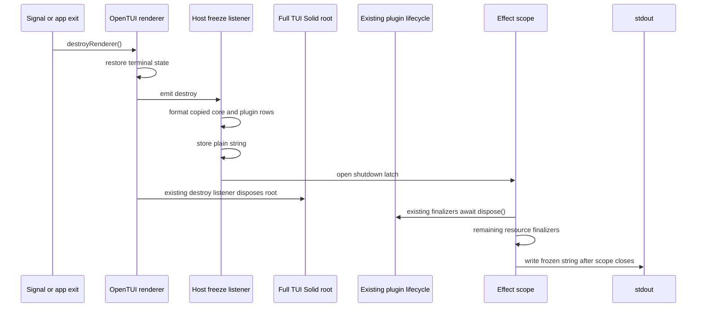

# Headless epilogue slot: implementation research

Date: 2026-08-30

Model: OpenAI GPT-5.6 Sol max (`gpt56s`)

Status: independent implementation research; no interface has been accepted or implemented

## Executive conclusion

A plugin-contributed epilogue can reuse substantially more of the current slot
system than the phrase "headless slot" initially suggests. The best first
prototype is not a separate registry and not a second slot renderer. It is a
path-specific adapter at the existing `ui.slot` registration boundary:

1. Add an append-only `session.epilogue` path whose public `render` callback
   returns structured rows rather than JSX.
2. In `createPluginContext`, adapt that callback into an ordinary JSX slot
   render function containing a host-owned capture component.
3. Let the existing `PluginProvider`, claim identity cache, `resolveSlots`,
   `Slot`, `For`, and `PluginBoundary` mount and reconcile that component.
4. Have the capture component run the plugin projection in a tracked Solid
   computation, copy valid strings into a host-owned collector, and return
   `null`.
5. Freeze a complete plain string at the renderer's `destroy` event before the
   full TUI Solid root is disposed.
6. Keep plugin deactivation, cleanup order, hot reload, and last-good restore
   exactly as they are. Print only after the existing Effect scope closes.

This design is headless in the important sense: plugin row updates do not
create or mutate OpenTUI text or box renderables and do not request terminal
frames. It is not literally zero-renderable if it uses the current `Slot`
component. Solid's dynamic regions use display-none OpenTUI slot-marker nodes.
Those markers are created at mount and claim-list changes, but row value
updates remain plain Solid and JavaScript work.

That distinction matters. A strict zero-renderable implementation is possible,
but it must independently reconcile claim roots, provide plugin context, catch
errors, and preserve ordering. That begins to duplicate `Slot` and
`PluginBoundary`. The marker cost should be measured before paying that design
cost.

The first implementation should retain the current `Active` formatting in the
host. A continuously pushed string is not automatically fresh at shutdown when
it contains relative time. Generic plugin rows work well for cached snapshots
such as cost, agent, branch, accounting state, or an absolute timestamp. Moving
`Active` into a plugin later requires either a live minute ticker or a
structured host-formatted relative-time value.

## Scope and required properties

The target is the full TUI's stdout epilogue, not Mini's scrollback splash and
not arbitrary plugin cleanup output. The seam must satisfy all of the following:

1. `Session` and `Continue` remain host-owned and always render when a valid
   Session epilogue exists.
2. Plugins can add rows but cannot replace the logo, core rows, or another
   output channel.
3. A contribution reads cached `SessionInfo` while the TUI is alive.
4. Shutdown performs no asynchronous Session lookup and no asynchronous plugin
   callback.
5. Preferably, shutdown invokes no plugin callback at all.
6. The latest accepted plain values survive Solid disposal and normal plugin
   cleanup.
7. Renderer teardown still occurs before stdout output.
8. Existing plugin cleanup registration, ordering, and error handling are not
   modified for this feature.
9. Terminal frames do not reevaluate plugin projections.
10. Cached-state changes reevaluate only projections that read the changed
    reactive fields.
11. Plugin enable order and within-plugin registration order remain stable
    across unrelated hot reloads.
12. A malformed or throwing contribution cannot suppress the core epilogue or
    later plugin rows.

Abrupt process death, including `SIGKILL`, cannot produce an epilogue and is not
part of this contract.

## Current architecture

### Public slot contract

The public slot API is already close to the desired vocabulary. `SlotMap`
defines stable, absolute host seams and associates each path with reactive
input. Its design explicitly says inputs should carry identity and client-local
state, while ordinary SDK-answerable data should be read through the plugin
context ([`packages/plugin/src/tui/context.ts` lines 159-179](/packages/plugin/src/tui/context.ts#L159-L179)).

That makes this the appropriate input:

```ts
readonly "session.epilogue": { readonly sessionID: string }
```

It should not pass `SessionInfo` itself. A plugin can already synchronously read
the cached value:

```ts
const session = context.data.session.get(sessionID)
```

The public accessor is declared at
[`packages/plugin/src/tui/context.ts` lines 61-80](/packages/plugin/src/tui/context.ts#L61-L80).
The implementation is a direct reactive store lookup at
[`packages/client/src/solid/data.ts` lines 1244-1259](/packages/client/src/solid/data.ts#L1244-L1259),
not an HTTP request.

The existing `SlotClaim` is a distributive union keyed by path. This gives a
natural place to make only `session.epilogue` return data and accept only
`append`, while every current visual path keeps the exact JSX and placement
contract ([`packages/plugin/src/tui/context.ts` lines 182-239](/packages/plugin/src/tui/context.ts#L182-L239)).

### Registration and ownership

`createPluginContext` gives every slot registration a monotonically numbered
key within one plugin activation. It validates that exactly one placement key
was supplied, writes the normalized claim into the plugin's existing registry,
and adds an idempotent unregister function to the activation's owned cleanups
([`packages/tui/src/plugin/api.tsx` lines 98-109](/packages/tui/src/plugin/api.tsx#L98-L109),
[`packages/tui/src/plugin/api.tsx` lines 208-221](/packages/tui/src/plugin/api.tsx#L208-L221)).

This is all directly reusable. The epilogue design does not need:

- a new plugin setup hook;
- a new cleanup registration;
- a second ownership list;
- a generation token exposed to plugins;
- a shutdown callback on the plugin interface.

The only registration-specific addition is an adapter selected when the
normalized target is `session.epilogue`.

### Plugin generations and hot reload

One `Registration` owns routes, slots, Markdown renderers, and cleanups
([`packages/tui/src/plugin/context.tsx` lines 65-79](/packages/tui/src/plugin/context.tsx#L65-L79)).
Activation creates the context and owned list, runs setup, records setup's own
cleanup last, and marks the registration active
([`packages/tui/src/plugin/context.tsx` lines 137-190](/packages/tui/src/plugin/context.tsx#L137-L190)).

Deactivation marks the registration inactive before running its reverse-ordered
cleanups, then clears the contribution maps
([`packages/tui/src/plugin/context.tsx` lines 193-213](/packages/tui/src/plugin/context.tsx#L193-L213),
[`packages/tui/src/plugin/context.tsx` lines 552-555](/packages/tui/src/plugin/context.tsx#L552-L555)).
Because claim enumeration includes slots only while a registration is active,
the visible or headless claim unmounts before plugin cleanup completes.

This behavior is correct for manual disable and ordinary hot reload. It also
explains why shutdown must freeze first: waiting until plugin cleanup to collect
rows is too late.

The provider constructs claims in plugin enable order, then in registration
order within each plugin. A `WeakMap` gives each stable render function a stable
claim object so unrelated plugin changes do not remount it
([`packages/tui/src/plugin/context.tsx` lines 430-464](/packages/tui/src/plugin/context.tsx#L430-L464)).
The epilogue adapter must therefore be created once during registration and
stored like any other render function. It must not allocate a new wrapper from
a reactive getter.

### Pure slot resolution

`resolveSlots` is generic over the render payload. It knows only a claim key,
plugin ID, normalized placement, and opaque render value
([`packages/tui/src/plugin/structure.ts` lines 1-20](/packages/tui/src/plugin/structure.ts#L1-L20)).
It has no dependency on JSX, Solid, OpenTUI, or epilogue formatting.

That means `resolveSlots` should not change. The existing mounted-path set and
claim list can resolve `session.epilogue` exactly like any other leaf. For an
append-only path, the useful result is simply:

```ts
resolved.slotted.get("session.epilogue")?.append ?? []
```

The path should remain `session.epilogue`, not `app.epilogue`. When no Session
slot is mounted, `session.epilogue` has no surviving ancestor and is
suppressed. An `app.epilogue` claim could degrade to the always-mounted `app`
slot and instantiate on Home or plugin routes because missing additive claims
append to their nearest surviving ancestor
([`packages/tui/src/plugin/structure.ts` lines 100-141](/packages/tui/src/plugin/structure.ts#L100-L141)).

### Visual slot mounting

The current `Slot` component does four important things:

1. It reference-counts the mounted public path.
2. It reads the resolved buckets with a shallow equality function that ignores
   unrelated claim changes.
3. It wraps each contribution in `PluginBoundary`.
4. It invokes the contribution with `createComponent` and a merged reactive
   input getter.

See [`packages/tui/src/plugin/render.tsx` lines 73-144](/packages/tui/src/plugin/render.tsx#L73-L144).

The source comment at lines 114-116 is precise: the component body runs once,
while reactive expressions created by it remain live. A terminal renderer frame
does not rerun a Solid component body. Mounting a Session, enabling a plugin,
or replacing a plugin generation can create a new component; painting retained
OpenTUI state cannot.

### Core epilogue and shutdown

The current epilogue context is only a singleton setter
([`packages/tui/src/context/epilogue.tsx`](/packages/tui/src/context/epilogue.tsx)).
The Session route publishes a closure over the latest Session title, ID, and
updated timestamp, then clears the singleton on unmount
([`packages/tui/src/routes/session/index.tsx` lines 156-205](/packages/tui/src/routes/session/index.tsx#L156-L205)).

`Tui.run` owns the closure outside the Effect scope. The renderer's `destroy`
event opens the shutdown latch; after the scope closes, the closure is invoked
and written to stdout
([`packages/tui/src/app.tsx` lines 226-301](/packages/tui/src/app.tsx#L226-L301),
[`packages/tui/src/app.tsx` lines 449-457](/packages/tui/src/app.tsx#L449-L457)).

The renderer event ordering gives a clean freeze point. In the installed
OpenTUI version, `finalizeDestroy` emits `destroy` before recursively destroying
the renderer root
([installed OpenTUI renderer lines 9734-9757](/packages/tui/node_modules/@opentui/core/chunk-node-dcyj0dm5.js#L9734-L9757)).
OpenTUI Solid installs a `destroy` listener that disposes its Solid root
([installed OpenTUI Solid lines 1489-1534](/packages/tui/node_modules/@opentui/solid/index.js#L1489-L1534)).
The app installs its listener before mounting the full TUI root, so it can
freeze before that root's cleanup.

The preflight handoff renderer may already have a different Solid root and an
earlier destroy listener. That root is the update preflight UI, not the full TUI
plugin tree. For a future-proof ordering guarantee, the freeze listener can use
`prependOnceListener("destroy", ...)`; this changes no plugin lifecycle order.

## Proposed public interface

The minimal structured output is deliberately narrow:

```ts
export interface EpilogueRow {
  /** Plain, single-line label. The host owns padding and styling. */
  readonly label: string
  /** Plain, single-line value. */
  readonly value: string
}

export type EpilogueRows = EpilogueRow | readonly EpilogueRow[] | null | undefined
```

Add the path to `SlotMap`:

```ts
export interface SlotMap {
  // Existing paths remain unchanged.
  readonly "session.epilogue": { readonly sessionID: string }
}
```

Make output and placement path-specific:

```ts
type SlotOutput<Path extends SlotPath> = Path extends "session.epilogue" ? EpilogueRows : JSX.Element

type PlacementKind = "prepend" | "append" | "before" | "after" | "replace"

type Placement<Kind extends PlacementKind, Path extends SlotPath> = {
  readonly [Key in Kind]: Path
} & {
  readonly [Key in Exclude<PlacementKind, Kind>]?: never
}

type SlotPlacement<Path extends SlotPath> = Path extends "session.epilogue"
  ? Placement<"append", Path>
  : {
      [Kind in PlacementKind]: Placement<Kind, Path>
    }[PlacementKind]

export type SlotClaim<Path extends SlotPath = SlotPath> = Path extends SlotPath
  ? {
      readonly render: (input: SlotMap[Path]) => SlotOutput<Path>
    } & SlotPlacement<Path>
  : never
```

The actual source can retain the current explicit placement union rather than
introducing a mapped helper if that produces better declaration output. The
semantic requirement is what matters: `session.epilogue` accepts `append` and
no replacement-style operation.

Example:

```ts
import { Plugin } from "@opencode-ai/plugin/tui"

export default Plugin.define({
  id: "acme.session-summary",
  setup(context) {
    return context.ui.slot({
      append: "session.epilogue",
      render: ({ sessionID }) => {
        const session = context.data.session.get(sessionID)
        if (!session) return

        return [
          { label: "Cost", value: `$${session.cost.toFixed(2)}` },
          ...(session.agent ? [{ label: "Agent", value: session.agent }] : []),
        ]
      },
    })
  },
})
```

The epilogue callback is a synchronous tracked projection, not a visual Solid
component. Documentation must say this directly. It must not:

- return a Promise;
- call `session.sync`;
- read the filesystem or network;
- mutate plugin state;
- create Solid resources on each invocation;
- call renderer methods.

If the cached Session is unavailable, it returns no rows. The host mounts the
path only for a hydrated active Session, so missing data should be transient.

## Three interpretations of invisible or headless

The word "invisible" covers three materially different implementations. They
should not be collapsed into one argument.

### 1. An invisible OpenTUI subtree containing ordinary text

This is the most literal version:

```tsx
<box visible={false} width={0} height={0}>
  <Slot path="session.epilogue" input={{ sessionID }} />
</box>
```

Plugins would render `<text>` rows and the host would somehow recover their
content later.

This is more viable than a casual dismissal suggests. In the installed
OpenTUI implementation, `visible={false}` maps the Yoga node to display-none,
so the box has no layout footprint
([installed `Renderable` lines 239-267](/packages/tui/node_modules/@opentui/core/chunk-node-dcyj0dm5.js#L239-L267)).
It should not paint terminal cells. It also preserves ordinary JSX component
semantics, the exact current `Slot`, and the exact current `PluginBoundary`.

Its costs and ambiguities remain significant:

- Every `<box>` and `<text>` allocates a Renderable and usually a Yoga node.
- Insertion into a parent updates Yoga and requests a renderer frame
  ([installed `Renderable.add` lines 1000-1017](/packages/tui/node_modules/@opentui/core/chunk-node-dcyj0dm5.js#L1000-L1017)).
- A child renderable's `requestRender` calls the renderer context directly. It
  does not stop at an invisible ancestor
  ([installed `Renderable` lines 422-425](/packages/tui/node_modules/@opentui/core/chunk-node-dcyj0dm5.js#L422-L425)).
- Many reactive property setters request frames, including dimensions and
  layout properties
  ([installed `Renderable` lines 515-550](/packages/tui/node_modules/@opentui/core/chunk-node-dcyj0dm5.js#L515-L550)).
- Text can be wrapped, clipped, decoded, styled, or represented by child text
  nodes. Recovering semantic label/value pairs from cells or renderables is
  coupled to OpenTUI internals.
- Reading final text after renderer destruction is too late; reading before
  destruction still requires a host snapshot protocol.

An offscreen absolute box is worse than `visible={false}` for this purpose. It
still participates in Yoga and render-list maintenance before culling. Opacity
zero is also worse because it remains a visible layout node and can traverse
the draw path.

Conclusion: a display-none box is a reasonable containment experiment, but
ordinary rendered text is a poor data transport. It is acceptable only if the
prototype proves extraction trivial and no hidden child updates schedule
frames. Current OpenTUI behavior makes that result unlikely.

### 2. A null-returning capture component mounted through normal `Slot`

This is the recommended first prototype. Public epilogue callbacks return row
data. `createPluginContext` wraps that callback in a host capture component
whose own JSX output is `null`. The normal slot renderer mounts the wrapper.

There are no plugin `<text>` or `<box>` nodes and no semantic extraction. Row
changes update a JavaScript map and the retained epilogue closure only.

It is not literally free of OpenTUI objects. Solid's universal renderer uses
special display-none slot marker nodes for dynamic regions. The installed
implementation creates `LayoutSlotRenderable` with Yoga display-none
([installed OpenTUI Solid lines 931-980](/packages/tui/node_modules/@opentui/solid/index.js#L931-L980))
and inserts slot children through the normal parent path
([installed OpenTUI Solid lines 520-548](/packages/tui/node_modules/@opentui/solid/index.js#L520-L548)).
`For`, `Show`, and dynamic insertion can therefore leave a small number of
marker objects even when all contribution components return `null`.

That cost is bounded by mounted slot structure and active claims. It changes on
mount, unmount, enable, disable, and hot reload. It does not change on terminal
frames, and row-value effects do not mutate marker props. This is likely the
best reuse/performance tradeoff.

### 3. A strict pure-Solid headless projection manager

A strict version never renders `<Slot>` into the OpenTUI root. It calls
`plugins.slots.register("session.epilogue")`, reads the resolved append claims,
and creates one pure Solid owner per claim. Each owner runs the projection,
copies rows, and disposes when its claim leaves the resolved list.

This eliminates OpenTUI marker objects and initial marker-related frame
requests. It does not eliminate work. The manager must now implement or factor
out:

- keyed claim reconciliation;
- stable owner retention for untouched claims;
- plugin-context provision;
- input prop merging;
- error boundary reset behavior;
- error toast labeling;
- claim cleanup;
- append order publication.

Those are exactly the responsibilities already concentrated in `Slot` and
`PluginBoundary`. A pure manager can reuse `resolveSlots`, but it duplicates
the render half of the slot system. Unless a prototype measures a meaningful
frame or allocation regression from null-returning normal slots, this is the
wrong first implementation.

### Comparison

| Property | Invisible ordinary JSX | Normal Slot plus capture | Pure Solid manager |
| --- | --- | --- | --- |
| Reuses `ui.slot` registration | Yes | Yes | Yes |
| Reuses `resolveSlots` | Yes | Yes | Yes |
| Reuses `Slot` exactly | Yes | Yes | No |
| Reuses `PluginBoundary` exactly | Yes | Yes | Requires factoring |
| Creates plugin text/box renderables | Yes | No | No |
| Creates OpenTUI slot markers | Yes | Yes | No |
| Hidden value updates can request frames | Often | No, if capture stays plain | No |
| Needs semantic extraction | Yes | No | No |
| Needs independent claim reconciliation | No | No | Yes |
| Best use | Falsification baseline | First implementation | Measured optimization |

## Registration-time adaptation

The existing registry stores one erased JSX render type:

```ts
export type SlotRender = (input: SlotMap[SlotPath]) => JSX.Element
```

See [`packages/tui/src/plugin/api.tsx` lines 25-35](/packages/tui/src/plugin/api.tsx#L25-L35).
Changing the entire registry to a union of JSX and data renderers would spread
path discrimination through `PluginProvider`, `Claim`, and `Slot`. It is not
necessary.

Instead, adapt at the only point that still knows the public path and callback
type:

```tsx
const target = value[kind] as SlotPath
const id = `${input.id}/${key}`

if (target === "session.epilogue") {
  if (kind !== "append") throw new Error("session.epilogue supports append only")
  const read = value.render as (input: SlotMap["session.epilogue"]) => EpilogueRows

  input.registry.set("slots", key, {
    placement: { kind, target },
    render: (slotInput) =>
      provide(() => (
        <EpilogueCapture
          id={id}
          read={() => read(slotInput as SlotMap["session.epilogue"])}
        />
      )),
  })

  return registration("slots", key)
}

// Existing visual registration remains unchanged.
```

This preserves all of the following without alteration:

- `RegisteredSlot`;
- `Registration.slots`;
- stable wrapper-function identity;
- the `slotItems` WeakMap;
- claim keys;
- mounted-path reference counts;
- `resolveSlots`;
- `Slot` bucket rendering;
- `PluginBoundary`;
- owned unregister cleanup;
- generation replacement;
- keep-last-good setup restore.

The adapter also stays under `PluginContextProvider`, so `usePlugin()` remains
available if a projection calls it. The recommended usage still closes over
the setup `context`, because that is simpler and avoids treating a tracked
projection like a component setup body.

## Headless capture and ordering

An internal capture component can be small:

```tsx
function EpilogueCapture(props: {
  readonly id: string
  readonly read: () => EpilogueRows
}) {
  const epilogue = useEpilogue()
  const rows = createMemo(
    () => normalizeRows(props.read()),
    [],
    { equals: equalRows },
  )

  createEffect(() => epilogue.rows.set(props.id, rows()))
  onCleanup(() => epilogue.rows.remove(props.id))
  return null
}
```

The exact API can avoid nested objects if that better fits local style. The
important properties are:

- `read` executes in a tracked computation;
- normalization copies primitive strings immediately;
- equal output does not republish the epilogue;
- cleanup removes the live contribution;
- the component returns `null`;
- errors propagate to the surrounding existing `PluginBoundary`.

Collector insertion order is not sufficient. Suppose A and B are mounted in
that order. Hot reloading A removes its map entry and later adds it again. A
plain `Map` then iterates B before A even though the resolver still places A
first.

The host must flatten rows using resolved claim order. A narrow wrapper around
the normal `Slot` can publish that order:

```tsx
export function EpilogueSlot(props: { readonly sessionID: string }) {
  const plugins = usePlugin()
  const epilogue = useEpilogue()

  createEffect(() => {
    const keys =
      plugins.slots.resolved().slotted.get("session.epilogue")?.append.map((claim) => claim.key) ?? []
    epilogue.rows.order(keys)
  })
  onCleanup(() => epilogue.rows.order([]))

  return <Slot path="session.epilogue" input={{ sessionID: props.sessionID }} />
}
```

The capture ID must exactly match `Claim.key`, currently `${pluginID}/${slotKey}`
at [`packages/tui/src/plugin/context.tsx` lines 449-461](/packages/tui/src/plugin/context.tsx#L449-L461).

Only a hydrated active Session should mount this component. `App` already has
the route and cached data at
[`packages/tui/src/app.tsx` lines 460-494](/packages/tui/src/app.tsx#L460-L494).
A keyed condition can require both a Session route and a cached Session with a
real ID. Home, startup `dummy`, missing Session, and plugin routes then mount no
epilogue slot.

## Collector and immutable snapshots

The current six-line epilogue context needs to become a small aggregation
module. It should own no renderer and perform no I/O.

One workable internal shape is:

```ts
type CoreEpilogue = (
  rows: readonly EpilogueRow[],
  now: number,
) => string

type EpilogueState = {
  core?: CoreEpilogue
  order: readonly string[]
  rows: Map<string, readonly EpilogueRow[]>
}
```

The context exposes three internal operations:

```ts
core.set(render?: CoreEpilogue): void
rows.set(id: string, rows: readonly EpilogueRow[]): void
rows.remove(id: string): void
rows.order(ids: readonly string[]): void
```

Every mutation calls `publish()`. `publish` must build a fresh immutable value:

```ts
function publish() {
  const core = state.core
  if (!core) return props.set()

  const rows = state.order.flatMap((id) => state.rows.get(id) ?? []).map((row) => ({
    label: row.label,
    value: row.value,
  }))

  props.set((now) => core(rows, now))
}
```

The outer setter can store `(now: number) => string` rather than `() => string`.
That makes the shutdown clock explicit and makes presentation tests
deterministic.

The published closure captures only:

- the current host core formatter;
- a fresh array;
- fresh `{ label, value }` objects;
- primitive strings.

It must not close over:

- the mutable map;
- Solid store proxies;
- plugin callback functions;
- plugin context;
- renderer objects;
- SessionInfo objects.

At the freeze event, the host invokes this host-owned closure once with a
numeric clock and stores the resulting string. All plugin ownership can then be
destroyed without affecting output.

## Presentation ownership

`sessionEpilogue` currently owns the logo and the `Session`, `Active`, and
`Continue` rows
([`packages/tui/src/util/presentation.ts` lines 26-48](/packages/tui/src/util/presentation.ts#L26-L48)).
It should accept `supplemental` and an explicit `now`:

```ts
sessionEpilogue({
  title,
  sessionID,
  updated,
  now,
  supplemental,
})
```

The output order should initially be:

```text
Session
Active
<supplemental rows in resolved order>
Continue
```

The host, not plugins, owns:

- ANSI escapes;
- label padding;
- color and emphasis;
- newline policy;
- width and truncation policy;
- reserved core labels;
- the final trailing newline convention.

Rows should be plain, single-line strings. Runtime normalization should reject
or normalize carriage returns, line feeds, C0 controls, and escape sequences.
Because plugins are trusted code that can already write to stdout, this is
primarily output integrity rather than a security boundary.

The MVP should reserve at least `Session`, `Active`, and `Continue`. Duplicate
non-core labels can remain legal and render in order. Enforcing global unique
labels would create cross-plugin conflict semantics that the append-only slot
does not otherwise need.

### Relative-time freshness

Push retention freezes whatever strings were most recently computed. If a
plugin computes `"4m ago"` and no reactive dependency changes for an hour, the
shutdown epilogue still says `"4m ago"`.

The current `Active` implementation avoids this because its retained closure
stores a timestamp and computes `activeAgo` only when the epilogue is invoked.
That is host code, not plugin code.

There are four ways to move relative time into the generic seam:

1. Require the plugin to maintain a timer signal.
2. Give the host collector a minute ticker and rerun all projections.
3. Let a row retain a plugin formatter callback invoked at freeze.
4. Add a structured value such as `{ type: "relative-time", at: number }` that
   the host formats.

Options 1 and 2 add continuous work. Option 3 puts plugin code back on the
shutdown path. Option 4 broadens the public presentation model. None is needed
for additive snapshot rows. Therefore the first seam should keep `Active` in
host core and revisit structured values only if a real external plugin needs
shutdown-relative formatting.

## Solid recomputation mechanics

### What runs once

For a normal visual slot, `createComponent(claim.render, mergeProps(input))`
invokes the component setup body once per mount. State and effects created by
that component remain owned until the claim unmounts
([`packages/tui/src/plugin/render.tsx` lines 114-120](/packages/tui/src/plugin/render.tsx#L114-L120)).

The proposed registration adapter is itself the normal render component. It
runs once and mounts `EpilogueCapture`. `EpilogueCapture` creates one memo and
one effect. Those Solid owners persist while the claim remains resolved.

### What reruns

The plugin's epilogue projection runs inside the capture memo. It reruns when a
signal or store property read during the previous invocation changes. For the
example above, relevant reads include:

- `store.session.info[sessionID]` through `data.session.get`;
- `session.cost`;
- `session.agent`.

It does not rerun merely because:

- OpenTUI paints another frame;
- the cursor blinks;
- another visual component changes;
- an unrelated plugin reloads and stable claim objects remain equal;
- a second instance increments an already-mounted slot path's refcount.

The provider intentionally tracks only mounted path keys when resolving slots,
so duplicate-instance refcount changes do not re-resolve claims
([`packages/tui/src/plugin/context.tsx` lines 465-467](/packages/tui/src/plugin/context.tsx#L465-L467)).

### How this differs from visual slot semantics

There is one unavoidable conceptual difference: the public epilogue `render`
callback is the tracked projection itself, so its body may run more than once.
A visual slot's public render function is a component setup body and normally
runs once.

That difference is the strongest argument against overloading `ui.slot`. It
must be documented and tested. Plugin authors must not create signals,
resources, subscriptions, or cleanup handlers inside the epilogue projection.
Those belong in plugin setup or in a separately owned component.

An alternative signature can preserve setup-once semantics:

```ts
render: ({ sessionID }) => () => {
  const session = context.data.session.get(sessionID)
  return session ? { label: "Cost", value: String(session.cost) } : undefined
}
```

The outer function runs once and returns a reactive accessor. This is more
semantically exact but substantially less ergonomic. A JSX-only
`<Epilogue.Row>` component also preserves normal component semantics, but it
introduces a public component/provider bridge and makes ordering multiple rows
within one claim more complicated. The direct projection is the better MVP if
documentation can tolerate the path-specific rule.

### Preventing unnecessary work

Normalize output inside a memo with structural equality over the copied
`label` and `value` strings. If a Session update changes a field the plugin read
but produces identical rows, the collector should not publish a new closure.

Do not debounce projection effects. Solid already batches synchronous store
updates, and shutdown must not depend on a pending timer. If profiling later
finds a high-frequency source, the plugin should retain a cheaper derived
signal or stop reading fields it does not use.

## Push while alive versus pull at shutdown

The same `ui.slot` registration can support either evaluation policy. They have
different failure modes.

### Push while alive

The capture memo runs while the plugin, cache, Solid owner, toast system, and
renderer contexts are healthy. It copies each successful result to a host cell.
Shutdown reads only the cell.

Advantages:

- No plugin code runs on the shutdown path.
- Async APIs are naturally absent from freeze.
- Errors occur while `PluginBoundary` can show a toast.
- Values survive plugin cleanup by construction.
- Cache reads are tracked and incremental.
- Freeze is constant-time over already-copied rows.

Costs:

- Projections run whenever their reactive dependencies change.
- A badly written projection can perform repeated expensive synchronous work.
- Relative strings can age without a clock signal.
- The collector needs explicit row removal and resolved ordering.

### Pull at shutdown

The registry stores plugin callbacks. The first destroy listener synchronously
iterates currently resolved append claims, invokes each callback with the
Session ID, validates output, freezes the string, and then opens the latch.

Advantages:

- No background projection work.
- Values reflect the latest cache at the exact freeze instant.
- No retained row map is needed.
- Relative strings can use a supplied `now` without a timer.

Costs:

- Plugin code runs in the most timing-sensitive path.
- One synchronous infinite loop or expensive calculation blocks terminal
  destruction.
- A plugin can initiate I/O even if the return type rejects a Promise.
- Existing JSX `PluginBoundary` is not naturally in the call path.
- A toast is not useful while the renderer is being destroyed.
- Solid context and cache lifetime become coupled to destroy listener order.
- The host must add separate try/catch and per-claim failure isolation.

### Recommendation

Use push retention. Shutdown-pull satisfies the literal "no async lookup"
requirement if plugins behave, but it does not satisfy the stronger operational
goal of a bounded host-only shutdown path. Push turns shutdown into a plain
snapshot operation and contains plugin failures during normal runtime.

If measurements show projection overhead is nontrivial, optimize dependency
selection or add a dedicated registry. Do not move arbitrary plugin execution
into renderer destruction merely to avoid a small retained map.

## Exact freeze sequence

The current code retains a closure in `exit.epilogue` and copies that closure
into `result` after the latch opens. This works in the current tests, but a
plugin collector should make the freeze explicit rather than rely on Effect
resumption racing Solid cleanup.

Use two fields:

```ts
const exit = {
  current: undefined as ((now: number) => string) | undefined,
  frozen: undefined as string | undefined,
  reason: undefined as unknown,
}
```

Install the freeze listener before mounting the full TUI:

```ts
renderer.prependOnceListener("destroy", () => {
  exit.frozen = exit.current?.(Date.now())
  shutdown.openUnsafe()
})
```

Then return and print only the string:

```ts
yield* shutdown.await
return { epilogue: exit.frozen, reason: exit.reason }

// Outside Effect.scoped
if (result.epilogue) process.stdout.write(result.epilogue + "\n")
```

The sequence is:



No contribution callback, cache lookup, renderer traversal, or async operation
occurs in `Freeze`.

### Plugin finalizer scheduling caveat

`PluginProvider` registers its memoized `dispose` with `TuiLifecycle`. Its Solid
cleanup unregisters that finalizer and also starts `void dispose()`
([`packages/tui/src/plugin/context.tsx` lines 503-524](/packages/tui/src/plugin/context.tsx#L503-L524)).
The outer Effect finalizer invokes registered TUI finalizers and awaits all
settlements
([`packages/tui/src/app.tsx` lines 268-275](/packages/tui/src/app.tsx#L268-L275)).

Correct post-cleanup output therefore depends on the existing scheduler and
listener sequence starting the registered finalizer before Solid cleanup removes
it, or on both paths sharing the same memoized `dispose` promise. The present
integration test verifies core epilogue output but does not gate an asynchronous
plugin cleanup.

The epilogue feature must not change this lifecycle ordering. Instead, its
first lifecycle prototype must gate plugin cleanup and prove that `Tui.run`
does not resolve or write stdout before that gate is released. If this fails,
the repository has a general TUI lifecycle-await bug that should be fixed
separately before adding plugin epilogues. Hiding such a fix in the epilogue
feature would violate the requirement to preserve plugin lifecycle.

## Hot reload, deactivation, and generation edges

### Ordinary deactivation

When a plugin is manually disabled, `active` becomes false before cleanup. The
claim leaves `claims()`, the capture unmounts, and its row is removed. A later
shutdown correctly omits it.

### Shutdown cleanup

Freeze occurs first. Solid and plugin cleanup can remove every live row after
that point; the plain string remains unchanged. Cleanup-side mutations must not
be reflected in output because the plugin no longer owns epilogue state after
freeze.

### Unrelated hot reload

The existing stable claim cache means reloading plugin B should not remount
plugin A. A's capture memo and retained row remain live. This is direct reuse of
the behavior described at
[`packages/tui/src/plugin/context.tsx` lines 446-461](/packages/tui/src/plugin/context.tsx#L446-L461).

### Reloading the contributing plugin

The old claim unmounts and removes its row. The new generation registers a new
stable adapter and publishes a new row. Resolved key order, not collector map
order, keeps its relative position.

### Failed replacement setup

The provider restores the previous generation after a new setup throws. The
existing tests demonstrate eventual last-good restoration
([`packages/tui/test/plugin-hot-reload.test.tsx` lines 325-370](/packages/tui/test/plugin-hot-reload.test.tsx#L325-L370)).

There is a narrow transient gap: the old generation is inactive before the new
setup completes, and fallback activation happens only after failure. If the
renderer is destroyed in that gap, a push collector may freeze no row for that
plugin. Existing visual slots have the same transient disappearance, but a
retained epilogue makes the gap observable after exit.

Eliminating that race requires staged generation cells or retaining old values
until reconciliation commits. That is retained-cell machinery and changes more
than the current slot lifecycle. It should not be silently added for a rare
shutdown-during-reload edge. The prototype should expose the behavior and the
upstream proposal should state it explicitly.

### Session switches

The headless slot must be keyed by the hydrated active Session ID. Switching
Sessions unmounts old captures before mounting new ones. Collector order and
rows should clear atomically enough that a shutdown cannot combine old rows
with a new core Session.

The strongest implementation gives the collector an epoch equal to the active
Session ID. `core.set`, `rows.set`, and `rows.order` include that epoch; updates
from a disposing old owner are ignored after the epoch changes. This is a small
host guard, not a plugin lifecycle change.

## Error containment and malformed output

The registration adapter places `EpilogueCapture` underneath the existing
`PluginBoundary`. Errors thrown during initial or later memo evaluation should
therefore reach the same Solid `ErrorBoundary`, produce one plugin toast, and
replace that claim with `null`
([`packages/tui/src/plugin/render.tsx` lines 24-45](/packages/tui/src/plugin/render.tsx#L24-L45)).

This must be proven for errors thrown on a later reactive update, not assumed
from initial-render behavior. If Solid does not route effect or memo errors to
the ancestor boundary in this arrangement, `EpilogueCapture` needs a local
error channel that calls the same toast helper. It should not add a broad
try/catch around all slot rendering.

Runtime normalization is still required for untyped plugins:

| Input | Behavior |
| --- | --- |
| `undefined` or `null` | Publish no rows |
| One valid row | Normalize to a one-item array |
| Valid readonly array | Copy in array order |
| Promise or thenable | Reject contribution and report plugin error |
| JSX or Renderable | Reject and report plugin error |
| Empty label | Reject that row |
| Reserved core label | Reject that row |
| Newline or carriage return | Normalize to a space or reject |
| Escape or C0 control | Strip or reject |
| Excessive row count or bytes | Truncate or reject by documented budget |

A malformed return must never be passed through the OpenTUI insertion path. A
JSX expression can construct an unattached Renderable before normalization
sees it, so a malicious untyped plugin can still allocate or request work. This
is not a sandbox boundary. Correct typed plugins never construct that object.

When a previously valid projection later throws, clearing its rows matches the
existing visual slot fallback of rendering `null`. Retaining the last valid row
would be a new last-good-at-render-time policy absent from visual slots.

## Exact reuse versus new machinery

### Reused without semantic change

| Existing mechanism | Reuse |
| --- | --- |
| `Context.ui.slot` operation | Same public operation and returned disposer |
| Per-plugin `slot#N` keys | Same keys |
| Owned cleanup registration | Same `registration()` path |
| Registration active state | Same |
| Serialized reconcile chain | Same |
| Plugin enable order | Same |
| Within-plugin registration order | Same |
| Stable wrapper identity | Same WeakMap behavior |
| Mounted path reference count | Same `<Slot>` registration |
| `resolveSlots` | Exact function, no epilogue branch |
| Additive append bucket | Exact resolver output |
| `Slot` reconciliation | Exact component |
| `PluginBoundary` | Exact boundary and toast behavior, subject to prototype |
| Hot reload and manual disable | Same generation lifecycle |
| Plugin cleanup order | Unchanged |
| Post-scope stdout write | Same location |

### New but domain-specific

| New mechanism | Purpose |
| --- | --- |
| `EpilogueRow` and conditional slot output | Public structured contract |
| Append-only runtime check | Protect core output semantics |
| Registration adapter | Convert data projection to null JSX capture |
| `EpilogueCapture` | Track and copy live rows |
| Resolved key-order publication | Preserve ordering across remounts |
| Epilogue collector | Compose core and supplemental snapshots |
| Session epoch guard | Reject late old-Session updates |
| Explicit freeze string | Survive Solid and plugin cleanup |
| Normalization and budgets | Protect terminal output integrity |

### Intentionally not duplicated

The implementation should not introduce:

- `resolveEpilogueClaims`;
- a second plugin registration map;
- a second source watcher;
- a second hot-reload reconcile loop;
- a second cleanup stack;
- epilogue-specific plugin generations;
- a shutdown plugin hook;
- a renderer-tree-to-text serializer.

If a prototype cannot avoid those, a dedicated `ui.epilogue.register` API is
more honest than calling the result a slot.

## Exact touched files and hunks

This is the expected upstream-quality implementation surface, not a request to
edit these files in this research wave.

### Production files

1. [`packages/plugin/src/tui/context.ts`](/packages/plugin/src/tui/context.ts)

   Add `EpilogueRow` and `EpilogueRows`; add `session.epilogue` to `SlotMap`;
   make render output and placement path-specific; document that this path is
   a cheap synchronous projection rather than JSX.

2. [`packages/tui/src/context/epilogue.tsx`](/packages/tui/src/context/epilogue.tsx)

   Replace the simple setter context with core, ordered-row, epoch, and publish
   operations. Add `EpilogueCapture` here if doing so does not create an import
   cycle. Keep all retained values host-owned and plain.

3. [`packages/tui/src/plugin/api.tsx`](/packages/tui/src/plugin/api.tsx)

   Preserve `SlotRender` and `RegisteredSlot`. In `ui.slot`, branch only while
   the target path and public callback type are still known. Enforce append-only
   at runtime and wrap the projection in `EpilogueCapture` under the existing
   plugin context provider.

4. [`packages/tui/src/plugin/render.tsx`](/packages/tui/src/plugin/render.tsx)

   Leave `Slot` and `PluginBoundary` unchanged. Add a small `EpilogueSlot`
   wrapper that publishes resolved append-key order and returns the normal
   `Slot`. If this requires modifying normal contribution rendering, the reuse
   claim should be reconsidered.

5. [`packages/tui/src/app.tsx`](/packages/tui/src/app.tsx)

   Split current versus frozen epilogue state; freeze a string in a prepended
   destroy listener before opening the latch; pass the current setter into the
   provider; mount `EpilogueSlot` only for a hydrated active Session; print the
   frozen string after `Effect.scoped` exactly where output already occurs.

6. [`packages/tui/src/routes/session/index.tsx`](/packages/tui/src/routes/session/index.tsx)

   Publish a core formatter accepting supplemental rows and an explicit clock.
   Continue copying title, Session ID, and timestamps into the closure. Clear
   only the matching Session epoch on unmount.

7. [`packages/tui/src/util/presentation.ts`](/packages/tui/src/util/presentation.ts)

   Accept an explicit `now` and supplemental rows. Insert normalized rows before
   `Continue`. Keep logo, core row labels, ANSI, and alignment internal.

8. [`packages/www/src/docs/content/build/plugins/cli.mdx`](/packages/www/src/docs/content/build/plugins/cli.mdx)

   Add `session.epilogue` to the slot list and give it a separate non-JSX
   example. State cached-only, synchronous, cheap, append-only semantics. The
   current slot section is at lines 386-405.

No Protocol or Server `HttpApi` changes are involved, so client generation is
not required.

### Optional dogfood files

If the public seam should immediately prove an internal use, add:

1. `packages/tui/src/feature-plugins/session/epilogue.ts`
2. [`packages/tui/src/plugin/builtins.ts`](/packages/tui/src/plugin/builtins.ts)

That plugin could contribute cost, agent, or an absolute timestamp. It should
not move the current relative `Active` string until the freshness question is
resolved.

### Tests

1. [`packages/tui/test/plugin-structure.test.ts`](/packages/tui/test/plugin-structure.test.ts)

   Add type canaries for accepted epilogue rows, rejected JSX, and rejected
   non-append placements. The pure resolver needs no epilogue-specific behavior
   test beyond proving ordinary append ordering for the new path.

2. New `packages/tui/test/plugin-epilogue.test.tsx`

   Cover capture recomputation, equality suppression, resolved ordering,
   Session epochs, malformed values, later reactive throws, and frame counts.

3. [`packages/tui/test/plugin-hot-reload.test.tsx`](/packages/tui/test/plugin-hot-reload.test.tsx)

   Add A/B row-order and last-good restore scenarios using real plugin source
   reloads. Existing tests already provide the file-watcher harness.

4. [`packages/tui/test/app-lifecycle.test.tsx`](/packages/tui/test/app-lifecycle.test.tsx)

   Extend the signal epilogue test with a real CLI plugin and a gated async
   cleanup. Assert freeze-before-cleanup value retention and output-after-cleanup.

5. [`packages/tui/test/util/presentation.test.ts`](/packages/tui/test/util/presentation.test.ts)

   Cover explicit clock, supplemental ordering, core rows, normalization, and
   empty supplemental output.

6. Public plugin type checking from `packages/plugin`

   Ensure declaration output preserves path inference and does not widen visual
   slots to row output.

## Tiny falsifying prototypes

The design should advance through small experiments. Each prototype has a
specific result that can stop or redirect the work.

### Prototype 0: prove current cleanup/output ordering

Use the existing app lifecycle harness. Load a CLI plugin whose cleanup records
`cleanup-start`, awaits a deferred gate, then records `cleanup-end`. Capture
stdout and trigger `SIGINT`.

Acceptance:

- renderer destruction begins;
- stdout remains empty while cleanup is gated;
- releasing the gate records `cleanup-end` before stdout;
- the task resolves once;
- no extra Session request occurs.

Falsifier: stdout or task completion precedes `cleanup-end`. Stop epilogue work
and file a separate TUI lifecycle-await fix. Do not patch plugin cleanup ordering
inside the epilogue feature.

### Prototype 1: measure literal invisible JSX

Mount a `visible={false}` box containing reactive text. Count:

- `Renderable.renderablesByNumber.size` delta;
- renderer root child count;
- `renderer.requestRender` calls;
- frame events;
- output cells;
- updates after changing the hidden text signal.

Acceptance for ordinary hidden JSX: no output cells and no layout displacement.

Falsifier for using it as the final design: reactive text changes schedule
frames or extraction depends on private renderable traversal. Expected result
is that it remains useful only as a comparison baseline.

### Prototype 2: registration adapter with one static row

Do not change the public type yet. Hand-cast one synthetic `session.epilogue`
claim at `createPluginContext`, wrap it in a null capture, and mount it through
the existing `Slot`.

Acceptance:

- existing claim key reaches the collector;
- existing `PluginBoundary` remains outside capture;
- no text or box renderable is created for the row;
- one plain row appears in collector state;
- the slot unregister disposer removes it.

Falsifier: row data escapes into OpenTUI insertion, or a second registry is
needed to identify the plugin and claim.

### Prototype 3: distinguish frames from reactive projections

The synthetic projection reads one signal and increments a counter. Repeatedly
call `renderer.requestRender`, then change the signal once.

Acceptance:

- terminal frame requests do not increment the projection counter;
- one signal change increments it once after Solid batching;
- equal normalized rows do not republish the epilogue closure;
- row changes themselves request no renderer frame.

Falsifier: normal frame activity reevaluates projection or collector updates
touch the renderer.

### Prototype 4: prove boundary behavior on later errors

Return a valid row initially, then change a signal so the memo throws.

Acceptance:

- the existing `PluginBoundary` catches the later error;
- exactly one toast is attempted while the renderer is live;
- the failed claim's rows disappear;
- another plugin row and core epilogue remain;
- a remounted new plugin generation resets the boundary.

Falsifier: effect errors bypass the boundary or tear down the app. Factor the
boundary's reporting behavior for headless use before continuing.

### Prototype 5: preserve resolved order across remounts

Register A then B, publish multiple rows from A, reload A, and toggle one A row
through an empty state.

Acceptance:

- output order remains A rows then B rows;
- local array order remains stable;
- unrelated B capture never remounts;
- collector map insertion order cannot affect output.

Falsifier: the design has no stable way to flatten by resolved claim keys.

### Prototype 6: freeze before cleanup

Publish row value `before`, trigger destroy, and have plugin cleanup change its
source signal to `during-cleanup` before awaiting a gate.

Acceptance:

- frozen output contains `before` exactly once;
- it never contains `during-cleanup`;
- no output is written until cleanup gate release;
- collector and Solid roots may become empty without changing frozen output.

Falsifier: the frozen representation closes over a mutable map, accessor, or
plugin object.

### Prototype 7: exercise handoff and destroy-during-frame

Run once with a fresh renderer and once with update-preflight handoff. Trigger
destroy from outside the app while a frame is active.

Acceptance:

- freeze runs exactly once in both modes;
- it runs before disposal of the full TUI root;
- deferred renderer finalization still emits the event after the frame;
- preflight root disposal does not erase current epilogue state;
- signal listeners and title cleanup remain correct.

Falsifier: listener ordering differs under handoff or deferred destroy. Move to
a dedicated host-owned `freezeAndDestroy` path only if every destruction source
can be routed through it; otherwise retain a prepended destroy listener.

### Prototype 8: interrupt hot reload at every boundary

Gate old cleanup, new setup, setup failure, and fallback setup separately.
Trigger shutdown at each boundary.

Acceptance for the minimal reuse design:

- no crash or stale cross-Session row;
- eventual last-good behavior remains unchanged when shutdown is not triggered;
- documented transient gaps are observable but bounded.

Falsifier for stronger guarantees: any requirement that old output survive the
entire swap. Meeting that requirement needs staged retained generations and is
outside the minimal slot reuse design.

### Prototype 9: public type and documentation spike

Implement only the `SlotMap` and `SlotClaim` type change in a temporary branch.
Compile representative visual and epilogue claims, including untyped runtime
misuse.

Acceptance:

- existing visual code compiles unchanged;
- `sessionID` inference works;
- epilogue row output compiles;
- JSX and Promise output fail for epilogue;
- row output fails for visual slots;
- prepend, before, after, and replace fail for epilogue;
- generated declaration output is readable.

Falsifier: TypeScript inference becomes brittle enough that plugin authors need
manual generic arguments or casts. In that case, prefer a dedicated
`ui.epilogue.register` operation.

## Carryability

### Downstream-only carry

The current fixed `Active` carry is substantially cheaper than the generic
seam. It touches four production files and two tests and makes no public plugin
commitment. If the only desired row is Active, carrying the headless framework
downstream is not justified.

A downstream headless seam would repeatedly intersect upstream work in the
most active plugin files:

- public `SlotMap` and `SlotClaim` types;
- `createPluginContext` registration adaptation;
- plugin hot reload and claim stabilization;
- root TUI mounting;
- shutdown lifecycle;
- CLI plugin documentation.

Even if merge conflicts remain small, semantic drift is the larger cost. A
downstream plugin package would expose a public path and row type that upstream
does not recognize. External plugins would need to target the downstream build
specifically.

Recommended downstream policy:

1. Keep graceful signal handling independent.
2. Keep the fixed Active implementation while prototypes run.
3. Do not publish the headless path as downstream-only public API.
4. If a private experiment is needed, keep it behind a built-in plugin and do
   not document it for external packages.
5. Drop the experiment if upstream declines the interface.

### Upstream feature

The generic seam is reasonable upstream because the increased surface is paid
once and external CLI plugins can rely on it. An upstream proposal should lead
with measured slot-system reuse, bounded shutdown behavior, and the absence of
plugin lifecycle changes.

The proposal should be split into reviewable conceptual changes:

1. Prove cleanup/output ordering and freeze sequencing.
2. Add internal structured supplemental rows and explicit clock formatting.
3. Add the append-only public headless slot and registration adapter.
4. Add reactive, error, ordering, and hot-reload tests.
5. Document cached-only projection semantics.
6. Optionally dogfood with a non-relative built-in row.

Do not combine a general plugin lifecycle refactor, Session cache projection
changes, or Mini epilogue support into the same proposal.

### If upstream rejects non-JSX slots

The likely objection is conceptual rather than technical: `render` means a
Solid component everywhere else, while this one path means a tracked data
projection.

If that objection holds, the fallback should be a narrow dedicated interface:

```ts
context.ui.epilogue.register(({ sessionID }) => EpilogueRows)
```

It can still reuse plugin ownership and generation ordering by storing its
registration alongside slots, but it should not claim full slot semantics. A
dedicated interface may be deeper and easier to document even though it
duplicates one registration verb.

For downstream carry, rejection means retain the fixed-purpose patch rather
than building either generic framework privately.

## Decision gates

Proceed with the normal-Slot capture design only if all of these are true:

1. Gated plugin cleanup proves output is written afterward with no lifecycle
   changes.
2. Later reactive errors are contained by the existing `PluginBoundary`.
3. Row updates schedule no OpenTUI frames.
4. Marker allocation and mount-time frame cost are negligible.
5. Resolved claim order can drive collector flattening without modifying
   `resolveSlots`.
6. Session epoch guards prevent old rows leaking across route changes.
7. Type inference remains ergonomic.
8. The upstream maintainers accept one path-specific non-JSX `render` contract.

Move to a pure Solid manager only if gates 1 through 3 pass but marker
measurements fail. Move to a dedicated registry if type or conceptual gates
fail. Keep the fixed Active carry if upstream scope or demand fails.

## Open questions

1. Should invalid row output clear the claim immediately or retain its previous
   valid rows until the next valid projection?
2. What row-count and byte budgets are appropriate for post-TUI stdout?
3. Should values be truncated by bytes, Unicode graphemes, or terminal display
   width?
4. Should the collector accept only strings, or eventually a host-formatted
   relative-time value?
5. Is one transiently missing row during shutdown-in-the-middle-of-hot-reload
   acceptable?
6. Does Solid's `ErrorBoundary` catch errors from the exact memo/effect nesting
   used by `EpilogueCapture`?
7. Does a null-returning ordinary `Slot` allocate enough display-none marker
   nodes to matter in real terminals?
8. Can `prependOnceListener` be used on every supported renderer without
   changing handoff assumptions?
9. Should an active subagent Session receive its own epilogue rows, or should
   plugins be passed the root Session ID?
10. Should a Session deleted immediately before exit suppress the epilogue or
    preserve the last valid frozen core?

## Cross-references

- [Pluggable TUI epilogues synthesis](/.design/term-v2/epilogue-plugins0.gpt56s.md): shared situation, invariant survey, and broad comparison of fixed, registry, headless-slot, and retained-cell options. This document narrows and tests the headless-slot implementation.
- [Term-v2 refresh record](/.design/term-v2/refresh-20260829.model-unspecified.md): identifies the carried signal and Active commits whose downstream size is the baseline for carryability.
- [Public CLI plugin slot interface](/packages/plugin/src/tui/context.ts#L157-L239): the public type surface extended by `session.epilogue`.
- [CLI plugin documentation](/packages/www/src/docs/content/build/plugins/cli.mdx#L74-L87): establishes synchronous cached Session lookup as existing public behavior.
- [CLI plugin slot documentation](/packages/www/src/docs/content/build/plugins/cli.mdx#L386-L405): current JSX-only user model that a path-specific headless projection would need to explain carefully.
- [Plugin registration adapter](/packages/tui/src/plugin/api.tsx#L74-L109): existing ownership and plugin-context wrapping reused by the proposed adapter.
- [Plugin slot registration](/packages/tui/src/plugin/api.tsx#L208-L221): exact narrow branch point where the target path is still known.
- [Plugin generation lifecycle](/packages/tui/src/plugin/context.tsx#L137-L224): activation and deactivation semantics that the feature must not change.
- [Stable claim construction](/packages/tui/src/plugin/context.tsx#L430-L467): source of deterministic ordering and retained claim identity.
- [Pure slot resolver](/packages/tui/src/plugin/structure.ts): ordering and mounted-path behavior that should remain completely generic.
- [Visual Slot and PluginBoundary](/packages/tui/src/plugin/render.tsx#L24-L144): implementation whose exact reuse distinguishes the recommended capture adapter from a duplicate pure headless manager.
- [Current TUI shutdown and output](/packages/tui/src/app.tsx#L226-L301): listener and retained-state setup where an explicit freeze belongs.
- [Current post-scope epilogue write](/packages/tui/src/app.tsx#L449-L457): output location that already satisfies renderer-and-resource cleanup ordering.
- [Current Session epilogue producer](/packages/tui/src/routes/session/index.tsx#L156-L205): host core snapshot source that should compose supplemental rows rather than be replaced.
- [Current epilogue formatting](/packages/tui/src/util/presentation.ts#L26-L48): host-owned logo, Session, Active, and Continue rendering.
- [Plugin lifecycle design](/specs/v2/catalog-config-plugin-lifecycle.md): related prior work on ordered plugin contributions, disablement, replay, and generation replacement; useful when evaluating whether stronger retained-generation guarantees are worth their complexity.
- [Installed OpenTUI Solid slot markers](/packages/tui/node_modules/@opentui/solid/index.js#L900-L1149): evidence that normal null-returning Solid slot regions are display-none but not literally allocation-free.
- [Installed OpenTUI renderer destruction](/packages/tui/node_modules/@opentui/core/chunk-node-dcyj0dm5.js#L9638-L9757): observed event ordering used by the freeze proposal and an explicit dependency to verify when OpenTUI changes.
