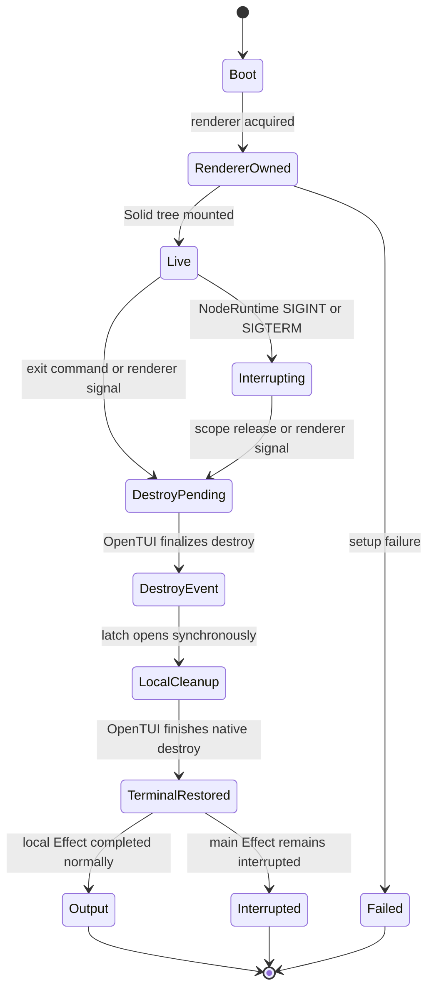
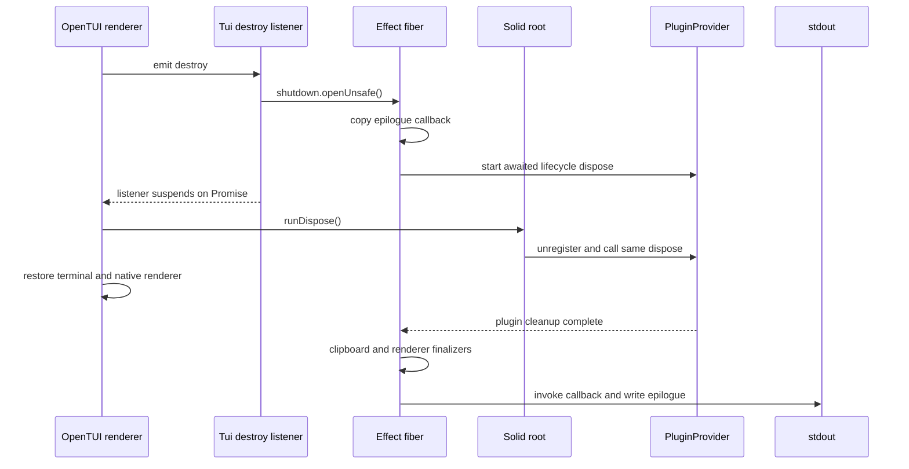
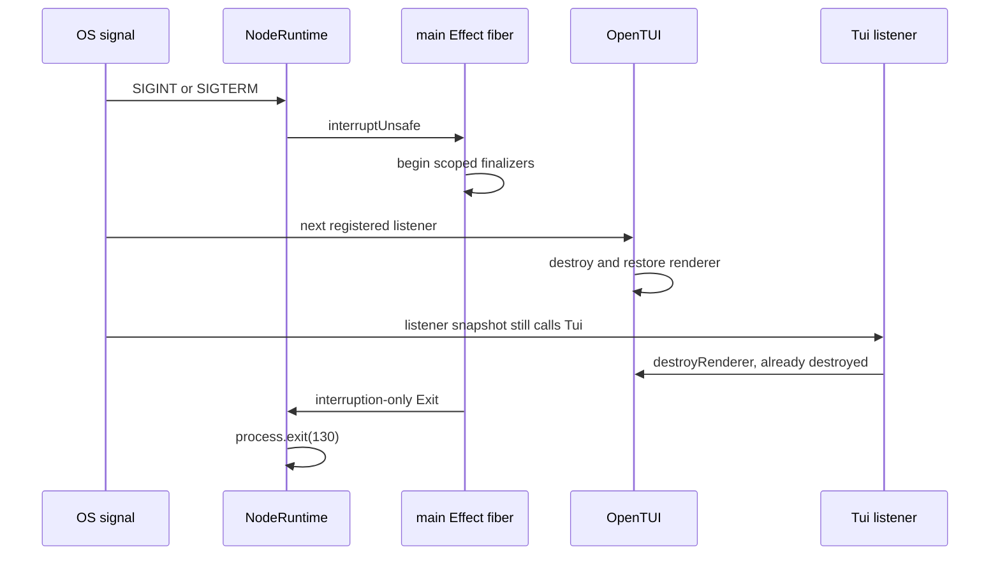
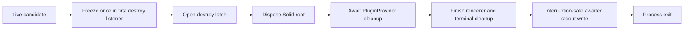

# Shutdown carry audit: epilogue durability and plugin seams

Date: 2026-08-30

Model: OpenAI GPT-5.6 Sol max (`gpt56s`)

Status: independent code audit; no implementation is accepted by this document

## Executive finding

The current carry is not yet a durable graceful-shutdown capability.

The normal in-process path is carefully ordered and presently works: renderer
destruction wakes `Tui.run`, the TUI snapshots its epilogue callback, scoped
cleanup waits for `PluginProvider`, OpenTUI restores the terminal, and the
epilogue is then written to stdout. The current Active callback also performs no
Session lookup when it is finally invoked because it closes over copied
primitives.

Production `SIGINT` and `SIGTERM` do not take that successful path. The CLI is
run by `NodeRuntime.runMain`, whose earlier signal listener interrupts the
entire main Effect fiber. The local TUI scope and plugin finalizers still run,
but interruption skips the code after `Effect.scoped`, including the epilogue
write. An exact child-process experiment against the installed Effect
`4.0.0-rc.112` produced:

| Signal | TUI listener | TUI finalizer | Epilogue | Exit |
| --- | --- | --- | --- | --- |
| `SIGHUP` | ran | ran | printed | 0 |
| `SIGINT` | ran | ran | absent | 130 |
| `SIGTERM` | ran | ran | absent | 130 |

This is the release blocker. The existing lifecycle test uses
`Effect.runPromise` plus `process.emit`, so it has no production
`NodeRuntime` listener and cannot expose the failure.

Other findings that should be resolved before making plugin rows public:

1. The carried callback is copied before cleanup, but it is invoked after
   cleanup. That is safe only because this callback closes over copied Session
   primitives. A registry callback, Solid accessor, plugin closure, or retained
   map read would execute too late.
2. OpenTUI already owns a wider set of process signals and registers those
   listeners before the carried handlers. Signal ownership is currently
   duplicated rather than centralized.
3. `destroyRenderer` calls `setTerminalTitle("")` before checking
   `isDestroyed`. OpenTUI's earlier signal handler can therefore destroy the
   native renderer before the carried signal handler calls `setTerminalTitle`.
4. An unhydrated Session route installs `Session` and `Continue` rows with an
   empty title and `undefined` ID. Early exit can print
   `opencode2 -s undefined`.
5. `Active` currently means age of cached `time.updated`. It ignores running
   state and `time.idle`, and several live events advance the server projection
   without advancing the cached Session timestamp.
6. `process.stdout.write` is not awaited. The top-level CLI immediately calls
   `process.exit` after successful scoped completion, so a piped stdout write is
   not guaranteed to flush.

The smallest sound carry is therefore: fix the shutdown/output state machine,
keep the fixed Active row while its semantics are tightened, and defer a public
plugin seam until the same process-level tests pass. Of the generic seams,
retained push has the smallest shutdown attack surface; a headless slot has the
largest carry surface.

## Audit boundary

The audit compares:

- current local code at parent `c009d583b7d9` (`term-v2`), including
  `e3b101dcad1b` for graceful signal handling and `59f70da76569` for Active;
- upstream `v2@origin` at `6a2c3e91c780`;
- Bun `1.3.14`;
- Effect and `@effect/platform-node` `4.0.0-rc.112`;
- OpenTUI core and Solid `0.5.9`.

The design baseline was [Pluggable TUI epilogues: possibility
space](/.design/term-v2/epilogue-plugins0.gpt56s.md). No other file in the
research wave was read.

The full TUI is the subject. Mini has a separate lifecycle in
[`mini/runtime.lifecycle.ts`](/packages/tui/src/mini/runtime.lifecycle.ts) and
does not use this stdout epilogue.

## Current ownership map

Five systems participate in one exit:

| Owner | Responsibility | Current reference |
| --- | --- | --- |
| CLI `NodeRuntime` | Runs and interrupts the process-wide Effect fiber | [`packages/cli/src/index.ts:65-120`](/packages/cli/src/index.ts#L65-L120) |
| OpenTUI renderer | Owns raw mode, signal listeners, render tree, and native terminal restoration | Installed `@opentui/core` `0.5.9`, `chunk-bun-jxfx3h5k.js:7384-7394,7511-7536,9655-9825` |
| `Tui.run` | Owns local signals, destroy latch, TUI finalizers, and stdout epilogue | [`packages/tui/src/app.tsx:200-457`](/packages/tui/src/app.tsx#L200-L457) |
| Solid root | Disposes components when OpenTUI emits `destroy` | Installed `@opentui/solid` `0.5.9`, `index.bun.js:1515-1571` |
| `PluginProvider` | Serializes activation and awaits plugin cleanup | [`packages/tui/src/plugin/context.tsx:137-233`](/packages/tui/src/plugin/context.tsx#L137-L233), [`:503-565`](/packages/tui/src/plugin/context.tsx#L503-L565) |

No one owner currently defines the complete process-level state machine. The
normal path emerges from listener registration order, synchronous Effect latch
wakeup, and LIFO finalizers.

## Exact current state machine

### States

The implementation has these effective states even though they are not named:



`Output` is reachable only when the local `Effect.scoped` expression succeeds.
That condition, not renderer restoration or successful cleanup, is why
production `SIGINT` and `SIGTERM` lose the epilogue.

### Boot and acquisition

Before a renderer exists, `Tui.run` reads config, resolves the launch Location,
discovers plugin directories, and optionally accepts a handed-off renderer.
Failures here have no epilogue candidate and no terminal teardown obligation:
[`app.tsx:200-225`](/packages/tui/src/app.tsx#L200-L225).

Inside one local `Effect.scoped` region, acquisition order is:

1. Renderer, with a release that calls `destroyRenderer`.
2. Clipboard, with an asynchronous dispose release.
3. The TUI lifecycle finalizer set.
4. Carried process signal listeners.

See [`app.tsx:227-284`](/packages/tui/src/app.tsx#L227-L284). Effect closes
these in reverse order:

```text
remove carried signal listeners
run and await TUI lifecycle finalizers
dispose clipboard
release renderer
```

An inline experiment against the installed Effect version returned exactly:

```json
["acquire:renderer","acquire:clipboard","acquire:signals","body:return","release:signals","release:tui-lifecycle","release:clipboard","release:renderer"]
```

The TUI lifecycle finalizer invokes registered finalizers in reverse insertion
order but starts them through one `Promise.allSettled`; several registered TUI
resources would therefore clean up concurrently, not serially
([`app.tsx:268-275`](/packages/tui/src/app.tsx#L268-L275)). At present,
`PluginProvider` is the sole caller of `lifecycle.add`.

### Live epilogue candidate

The Session component owns the singleton epilogue setter. Every reactive
Session change copies `title`, `id`, and `time.updated` into constants and
installs a new closure:

[`routes/session/index.tsx:181-205`](/packages/tui/src/routes/session/index.tsx#L181-L205)

```ts
const current = session()
const title = Locale.truncate(current?.title ?? "", 50)
setEpilogue(() =>
  sessionEpilogue({
    title,
    sessionID: current?.id,
    updated: current?.time.updated,
  }),
)
```

The closure does not retain the Solid Session proxy. Its only dynamic operation
is `Date.now()` inside `activeAgo` when the closure is eventually invoked:
[`util/presentation.ts:26-48`](/packages/tui/src/util/presentation.ts#L26-L48).

This establishes a narrow current no-lookup property, but the type does not
encode it. `EpilogueProvider` accepts any `() => string`, including a callback
that reads a disposed store, invokes a plugin, starts a fetch, or throws:
[`context/epilogue.tsx:3-6`](/packages/tui/src/context/epilogue.tsx#L3-L6).

The Session effect also runs before Session hydration is guaranteed. With
`current === undefined`, it installs a callback that prints an empty Session
and `Continue opencode2 -s undefined`. The durable contract must either install
no candidate until hydration or deliberately use the routed ID with an
explicit missing-Session presentation.

### Normal exit triggers

All normal full-TUI exits converge on renderer destruction:

| Trigger | Route to destroy |
| --- | --- |
| `app.exit` keybindings (`Ctrl+C`, `Ctrl+D`, leader `q`) | Keymap command calls `exit()` in [`app.tsx:1022-1028`](/packages/tui/src/app.tsx#L1022-L1028) |
| `/exit`, `/quit`, `/q` | Same command |
| Literal prompt `exit`, `quit`, or `:q` | Prompt calls `exit()` in [`prompt/index.tsx:1125-1135`](/packages/tui/src/component/prompt/index.tsx#L1125-L1135) |
| Error screen `q` or `Ctrl+C` | Error component calls `exit()` in [`error-component.tsx:55-100`](/packages/tui/src/component/error-component.tsx#L55-L100) |
| Remote `tui.command.execute` for `app.exit` | Dispatches the same keymap command in [`app.tsx:1192-1195`](/packages/tui/src/app.tsx#L1192-L1195) |
| External renderer destruction | Renderer `destroy` event opens the same latch |
| External Effect interruption or failure | Scope release destroys the renderer, but post-scope output is skipped |

`ExitProvider` stores an optional reason, clears the title through
`destroyRenderer`, and destroys once
([`app.tsx:293-301`](/packages/tui/src/app.tsx#L293-L301)). A second call after
`renderer.isDestroyed` does not change the first reason.

Interactive `Ctrl+C` is normally a key event rather than `SIGINT` because the
terminal is in raw mode. The prompt and dialog key layers may consume the first
press before `app.exit`. This explains why ordinary interactive exit can work
while an OS-delivered `kill -INT` does not print the epilogue.

### Renderer destroy event and Solid disposal

OpenTUI's exact installed destroy order is:

1. Mark `_isDestroyed` and prepare cleanup.
2. Remove OpenTUI signal listeners and disable raw input.
3. Emit `destroy`.
4. Destroy the renderable tree.
5. Restore stdout and invoke native `destroyRenderer` terminal cleanup.
6. Run the optional `onDestroy` callback.

The installed evidence is `@opentui/core` `0.5.9`
`chunk-bun-jxfx3h5k.js:9655-9825`. The upstream source has the same central
ordering at [`anomalyco/opentui` `renderer.ts`](https://github.com/anomalyco/opentui/blob/ae272000a5d12425c253c4537eb5e9e57df9265a/packages/core/src/renderer.ts#L4262-L4489).

`Tui.run` registers its `destroy` listener before `render(...)`. OpenTUI Solid
then registers the listener that disposes the Solid root. Node `EventEmitter`
invokes them synchronously in registration order. The observed order is:



`Latch.openUnsafe()` resumes its waiter synchronously. A focused experiment
returned:

```json
["await","first:before","resumed","first:after","second","after:emit"]
```

That synchronous resume is load-bearing in two ways:

1. `result` copies `exit.epilogue` before Session `onCleanup` clears the
   singleton.
2. The TUI lifecycle finalizer snapshots and starts `PluginProvider.dispose`
   before Solid `onCleanup` unregisters it.

`PluginProvider.dispose` is idempotent, so its Solid cleanup joins the already
awaited Promise. If either listener registration order or latch scheduling
changes, Solid can unregister the lifecycle finalizer first; cleanup would then
continue via `void dispose()` but stdout would no longer wait for it. This is an
implicit implementation dependency, not a tested TUI contract.

The right freeze point is the first TUI-owned `destroy` listener, before it opens
the latch. The event is early enough to read live state, and rendering/output
must still wait until OpenTUI finishes native terminal restoration.

### Plugin cleanup

Shutdown plugin cleanup is:

1. Stop source watching.
2. Wait for the serialized `loading` chain, so an in-progress reconcile cannot
   interleave with shutdown.
3. Deactivate all active plugins concurrently.
4. For each plugin, mark it inactive, run owned cleanups sequentially in reverse
   registration order, then clear routes, slots, and Markdown contributions.
5. Clear all registrations.

See [`plugin/context.tsx:193-233`](/packages/tui/src/plugin/context.tsx#L193-L233),
[`503-525`](/packages/tui/src/plugin/context.tsx#L503-L525), and
[`552-565`](/packages/tui/src/plugin/context.tsx#L552-L565).

This lifecycle is suitable for epilogue composition only if the host freezes
rows before step 3. Keeping plugins alive until after output is unnecessary and
would weaken unload semantics. Writing rows from plugin cleanup is also wrong:
cleanup runs on hot reload and manual disable, can start before terminal
restoration, and is not ordered as an output registry.

Plugin cleanup is arbitrary asynchronous plugin code. Therefore the enforceable
invariant is:

> Epilogue composition performs no server, database, filesystem, or plugin
> lookup after shutdown begins.

The stronger statement "shutdown performs no I/O" is false by design. Plugin
cleanup may perform I/O, and current lifecycle tests use filesystem writes to
observe it.

### Current stdout order

On the successful normal path, [`app.tsx:448-457`](/packages/tui/src/app.tsx#L448-L457)
does the following:

1. The destroy latch opens.
2. The local Effect scope closes and awaits TUI/plugin cleanup.
3. Clipboard cleanup completes.
4. Renderer release calls `destroyRenderer` again.
5. A stored error reason is written to stderr.
6. The stored epilogue callback is invoked.
7. Its returned string is written to stdout.

The TUI lifecycle finalizer always crosses a Promise continuation, even with an
empty set, so OpenTUI normally finishes the synchronous destroy stack and
restores stdout before step 7.

Two caveats remain:

- `process.stdout.write` completion/backpressure is ignored.
- The top-level CLI calls `process.exit(process.exitCode ?? 0)` in a successful
  `Effect.tap` after its outer scope closes
  ([`packages/cli/src/index.ts:117-120`](/packages/cli/src/index.ts#L117-L120)).
  Node documents that `process.exit()` can terminate before pending stdout
  writes complete. See [Node `process.exit`](https://nodejs.org/docs/latest-v24.x/api/process.html#processexitcode).

For a durable capability, stdout completion must be part of the Effect, not a
fire-and-forget synchronous callback. A test should use a delayed/backpressured
Writable and prove that process exit happens only after its write callback.

## Signal paths

### OpenTUI signal ownership

OpenTUI 0.5.9 defaults `exitSignals` to:

```text
SIGINT SIGTERM SIGQUIT SIGABRT SIGHUP SIGPIPE SIGBREAK SIGBUS
```

It registers one handler in the renderer constructor, before `Tui.run` adds its
carried handler. The exact installed references are
`chunk-bun-jxfx3h5k.js:7384-7394,7439-7446,7511-7536`; equivalent upstream
source is [`renderer.ts:1153-1163`](https://github.com/anomalyco/opentui/blob/ae272000a5d12425c253c4537eb5e9e57df9265a/packages/core/src/renderer.ts#L1153-L1163)
and [`:1304-1331`](https://github.com/anomalyco/opentui/blob/ae272000a5d12425c253c4537eb5e9e57df9265a/packages/core/src/renderer.ts#L1304-L1331).

The carry adds `SIGHUP`, `SIGINT`, and `SIGTERM` handlers at
[`app.tsx:277-284`](/packages/tui/src/app.tsx#L277-L284). Those handlers do not
normally initiate renderer destruction: OpenTUI's earlier handler already did.
Their observable extra behavior is clearing the terminal title.

Because Node snapshots listeners for an in-progress `emit`, removing the carried
listener during Effect finalization does not prevent that already-selected
listener from running. See [Node `EventEmitter.removeListener`](https://nodejs.org/docs/latest-v24.x/api/events.html#emitterremovelistenereventname-listener).

`destroyRenderer` currently clears title before checking destruction:

[`packages/tui/src/util/renderer.ts:3-7`](/packages/tui/src/util/renderer.ts#L3-L7)

```ts
renderer.setTerminalTitle("")
if (renderer.isDestroyed) return
renderer.destroy()
```

After an OpenTUI-owned signal, this calls `setTerminalTitle` on an already
destroyed renderer. The renderer's Effect release repeats the call. The guard
does not guard the native title operation. A TUI-owned first `destroy` listener
can clear the title before OpenTUI's native destroy and make the helper itself
properly idempotent.

### `NodeRuntime` production conflict

The CLI ends with `NodeRuntime.runMain`
([`packages/cli/src/index.ts:117-120`](/packages/cli/src/index.ts#L117-L120)).
The installed Node runtime:

1. Registers `SIGINT` and `SIGTERM` listeners.
2. Marks that a signal was received.
3. Interrupts the main fiber with `fiber.interruptUnsafe`.
4. Waits for the fiber and its finalizers.
5. Maps an interruption-only exit to 130.
6. Calls `process.exit(code)` whenever a signal was received.

See the exact installed
`@effect/platform-node-shared@4.0.0-rc.112/dist/NodeRuntime.js:10-30`, the
corresponding [`Effect-TS/effect-smol` source](https://github.com/Effect-TS/effect-smol/blob/3a1128c7684e04d34d9f541f77adaac38a513056/packages/platform-node-shared/src/NodeRuntime.ts#L36-L59),
and [`Runtime.defaultTeardown`](https://github.com/Effect-TS/effect-smol/blob/3a1128c7684e04d34d9f541f77adaac38a513056/packages/effect/src/Runtime.ts#L117-L124).

Registration order in production is normally:

```text
1. NodeRuntime SIGINT/SIGTERM listener
2. OpenTUI renderer listener
3. carried TUI listener
```

The resulting process sequence is:



Opening the TUI latch cannot turn an already interrupted Effect into a success.
The line after local `Effect.scoped` is skipped. Prepending the carried listener
would not solve this because Node invokes every listener selected for the signal.

The shutdown output must instead live in an interruption-safe finalizer outside
the local TUI scope, or the CLI must replace `NodeRuntime` signal ownership with
one explicit application runner. The first option is the smaller change:

```text
renderer destroy listener:
  freeze plain epilogue data once
  open shutdown latch

Effect ensuring/finalizer outside local TUI scope:
  wait for local scope cleanup
  render only frozen data
  await stdout write completion
```

That finalizer runs on normal success, failure, and interruption. It should emit
only when a valid frozen snapshot exists and must contain its own presentation
failure so a supplemental row cannot replace the original exit cause.

### Complete signal matrix

| Trigger | Owners | Current production outcome |
| --- | --- | --- |
| Interactive raw-mode `Ctrl+C` | TUI keymap | Normal destroy; epilogue; exit 0 |
| `SIGHUP` | OpenTUI, carried TUI | Normal destroy; epilogue; exit 0 on Unix; Windows may force termination later |
| `SIGINT` | NodeRuntime, OpenTUI, carried TUI | Cleanup runs; epilogue skipped; exit 130 |
| `SIGTERM` | NodeRuntime, OpenTUI, carried TUI | Cleanup runs; epilogue skipped; exit 130, not conventional 143 |
| `SIGQUIT`, `SIGABRT`, `SIGPIPE`, `SIGBREAK`, `SIGBUS` | OpenTUI | Renderer-driven normal completion; Session epilogue can print; CLI exits 0 |
| `SIGTSTP` then `SIGCONT` | TUI suspend command | Suspend/resume, not shutdown; no epilogue |
| `SIGKILL`, `SIGSTOP` | Kernel | No cleanup or epilogue possible |
| Direct `process.exit` while live | Process | No asynchronous cleanup guarantee; no epilogue contract |
| External Effect interruption | Effect caller | Renderer cleanup runs; post-scope epilogue skipped |
| TUI Effect failure | Effect failure path | Renderer cleanup runs; post-scope epilogue skipped |

Node's signal contract confirms that listeners suppress the default
`128 + signal` behavior and that raw-mode `Ctrl+C` does not generate `SIGINT`:
[Node signal events](https://nodejs.org/docs/latest-v24.x/api/process.html#signal-events).

The exit-code policy needs an explicit decision. Preserving current
`NodeRuntime` behavior means 130 for both INT and TERM. Conventional POSIX
status would use 130, 143, and 129 for INT, TERM, and HUP. OpenTUI's other
signals currently collapse to successful exit 0.

A hanging plugin cleanup can also hang graceful INT/TERM indefinitely. Repeated
signals only interrupt the already interrupted fiber again; `NodeRuntime` has no
second-signal escalation. This is a concrete lifecycle property, but adding a
timeout or force-exit policy should be a separate explicit decision because it
changes plugin cleanup guarantees.

## No-lookup guarantee and timestamp freshness

### What is guaranteed now

For the fixed Active carry only, final invocation performs:

```text
copied title, Session ID, and updated millis
  -> Date.now()
  -> pure formatting and static logo lookup
  -> stdout string
```

It does not call `data.session.get`, `session.sync`, the generated client, a
database, or the filesystem. The cache read occurred earlier in the live Solid
effect. `Data.session.get` itself is a synchronous store read at
[`packages/client/src/solid/data.ts:1244-1261`](/packages/client/src/solid/data.ts#L1244-L1261).

The current test does not prove this. It counts only requests to
`/api/session/dummy/prompt`
([`app-lifecycle.test.tsx:280-343`](/packages/tui/test/app-lifecycle.test.tsx#L280-L343)).
A Session GET, plugin API call, or filesystem read would not fail that assertion.

The callback type also makes the guarantee conventional rather than structural.
For a durable guarantee, freeze a host-owned record containing only copied
strings, finite numbers, enums, and arrays. Do not retain plugin callbacks,
accessors, JSX, Solid proxies, or arbitrary objects in the frozen snapshot.

### `Active` is not currently fresh activity

The public Session contract separates:

- `time.updated`: Session recency;
- `time.idle`: the last terminal execution transition;
- client-local `session.status`: running or idle.

See [`packages/schema/src/session.ts:31-58`](/packages/schema/src/session.ts#L31-L58)
and [`packages/client/src/solid/data.ts:1247-1282`](/packages/client/src/solid/data.ts#L1247-L1282).

The server deliberately advances `time.idle` while preserving `time.updated`
at execution completion
([`projector.ts:402-429`](/packages/core/src/session/projector.ts#L402-L429)).
The carried row ignores `idle` and status. A long-running Session can therefore
say `Active 17m ago` while it is running, and a just-completed run can retain an
older value.

The cache can also lag the server projection:

| Event | Server projection | Client cache |
| --- | --- | --- |
| `session.inbox.enqueued` | Sets `time_updated = event.created` in [`projector.ts:623-638`](/packages/core/src/session/projector.ts#L623-L638) | Updates pending input but not Session time in [`data.ts:700-714`](/packages/client/src/solid/data.ts#L700-L714) |
| `session.agent.selected` | Advances `time_updated` | Changes cached agent only in [`data.ts:582-595`](/packages/client/src/solid/data.ts#L582-L595) |
| `session.model.selected` | Advances `time_updated` | Changes cached model only in [`data.ts:597-619`](/packages/client/src/solid/data.ts#L597-L619) |
| `session.moved` | Advances `time_updated` | Changes cached Location fields only in [`data.ts:627-650`](/packages/client/src/solid/data.ts#L627-L650) |
| execution terminal | Advances `time_idle`, preserves `time_updated` | Marks idle and starts asynchronous Session sync in [`data.ts:1015-1028`](/packages/client/src/solid/data.ts#L1015-L1028) |
| `session.renamed` | Advances `time_updated` | Starts Session sync, then applies title in [`data.ts:620-626`](/packages/client/src/solid/data.ts#L620-L626) |

The presentation's `Date.now()` runs after plugin and scoped cleanup. That makes
the age fresh to write time, but the source timestamp may be stale. It also
means the epilogue is not a fully frozen string. A long plugin cleanup can move
the displayed value across minute/hour boundaries after renderer destruction.

There are two defensible contracts:

1. `Updated`: render cached `time.updated`; the label states exactly what is
   known.
2. `Active`: copy `{ status, updated, idle }` and render
   `status === "running" ? "now" : ago(max(updated, idle ?? updated))`.

Option 2 is better user language, but cache projection gaps remain. Fixing those
gaps or retaining the latest relevant event timestamp is a separate client
freshness change. Shutdown must not compensate with a final Session request.

The clock should be explicit. Freeze `capturedAt` with the snapshot if the row
means "state at exit"; use a separately injected `printedAt` only if age after
cleanup is intentional. Presentation tests should never take two uncontrolled
`Date.now()` readings near a unit boundary.

## A durable epilogue capability

### Required state model

```ts
type EpilogueCandidate = {
  readonly session: {
    readonly id: string
    readonly title: string
    readonly activity?: {
      readonly status: "idle" | "running"
      readonly updated: number
      readonly idle?: number
    }
  }
  readonly rows: readonly {
    readonly owner: string
    readonly label: string
    readonly value: string
  }[]
}

type EpilogueState =
  | { readonly status: "live"; readonly candidate?: EpilogueCandidate }
  | { readonly status: "frozen"; readonly output?: string }
  | { readonly status: "written" }
```

This is illustrative, not an accepted public interface. Its important property
is the ownership boundary: all plugin values are normalized to host-owned plain
strings before `frozen`.

### Required transition



The implementation details may differ, but these partial-order edges are the
capability:

1. `freeze < Session onCleanup`.
2. `freeze < plugin deactivate/clear`.
3. `renderer native cleanup < stdout epilogue`.
4. `plugin cleanup complete < stdout epilogue`.
5. `stdout completion < process.exit`.
6. The output step runs on normal success and graceful Effect interruption.

### Core-row rules

`Session`, `Active`, and `Continue` should be host-owned and reserved:

- no snapshot until the current routed Session is hydrated and has a valid ID;
- `Session` title and `Continue` ID come from the same atomic candidate;
- `Continue` is never suppressible or replaceable by a plugin;
- `Active` uses one documented timestamp contract;
- plugin rows are supplemental and cannot supply ANSI or newlines;
- home and plugin routes either have no epilogue or an explicitly defined
  non-Session epilogue, never a stale previous Session;
- one destroy produces at most one write.

### Output placement under interruption

Moving only the freeze point is insufficient. `SIGINT` and `SIGTERM` will still
skip lines after `Effect.scoped`. The output must be an `Effect.ensuring` or
equivalent finalizer outside the local TUI scope. It should:

1. read only the frozen host value;
2. format without plugin execution or I/O;
3. contain failures per supplemental row and preserve core rows;
4. await the stdout write callback;
5. mark the snapshot written before returning;
6. preserve the original success, failure, or interruption Exit.

This keeps `NodeRuntime` exit 130 behavior unless the project separately adopts
a signal-aware custom runner.

## Seam-specific carry risk

### Comparison

| Seam | Shutdown execution | Main new touch points | Carry risk | Audit assessment |
| --- | --- | --- | --- | --- |
| Fixed core row | Host freezes current Session candidate | `app`, epilogue context, Session route, presentation | Low | Best immediate carry after state-machine fixes |
| Structured registry | Host invokes plugin projections at destroy | Public plugin context, TUI plugin API/context, epilogue host, docs/tests | Medium-high | Honest API, but plugin code runs in the most sensitive synchronous path |
| Headless slot | Reactive plugin projection publishes retained rows while live | Slot public types, API erasure, resolver/mount adapter, provider, epilogue host, docs/tests | High | Reuses ordering but crosses JSX/data and visual/headless boundaries |
| Retained push | Plugin pushes copied rows while live; host only freezes map | Public plugin context, generation-fenced publisher, provider, epilogue host, docs/tests | Medium | Smallest shutdown attack surface of generic seams; plugin owns update triggers |

### Fixed

Fixed is the only seam whose current producer is already lookup-free at output.
Its carry is six files and 52 added/changed lines across the two code commits.
It should still replace the arbitrary closure with plain candidate data, reject
an unhydrated Session, copy status/idle if the label remains Active, and use the
interruption-safe output finalizer.

Every future fixed row remains a downstream code patch. That is preferable to
carrying a public framework downstream if upstream acceptance is uncertain.

### Structured registry

A dedicated registry can preserve deterministic plugin and registration order,
but a pull callback invoked in the first `destroy` listener has unavoidable
properties:

- plugin JavaScript executes inside OpenTUI's synchronous native destroy stack;
- a callback can block, throw, mutate host state, or start a client request;
- a `Promise` return can be rejected by validation, but its asynchronous work
  may already have started;
- a callback observes whichever generation is active during an in-progress
  reconcile, without waiting for the serialized loading chain.

Per-callback exception containment and strict synchronous normalization are
mandatory. Even then, this seam can promise "host performs no lookup" but cannot
strictly promise "plugin performs no lookup".

### Headless slot

The existing slot stack is visual all the way down:

- public `SlotClaim.render` returns `JSX.Element` in
  [`packages/plugin/src/tui/context.ts:157-239`](/packages/plugin/src/tui/context.ts#L157-L239);
- internal `SlotRender` erases all paths to one JSX function in
  [`packages/tui/src/plugin/api.tsx:25-49`](/packages/tui/src/plugin/api.tsx#L25-L49);
- `<Slot>` mounts `PluginBoundary` and `createComponent` in
  [`packages/tui/src/plugin/render.tsx:73-144`](/packages/tui/src/plugin/render.tsx#L73-L144);
- resolution is pure and generic, so ordering can be reused in
  [`packages/tui/src/plugin/structure.ts:57-146`](/packages/tui/src/plugin/structure.ts#L57-L146).

A genuine headless slot should create no OpenTUI renderable, but it still needs a
Solid owner for reactive tracking, error containment, route/session identity,
and cleanup. It must copy output into a host cell while live. On ordinary route
unmount or plugin disable the row should disappear; on shutdown, freeze must win
the race with that same cleanup.

The resolver and generation order are reusable. The JSX output type, renderer,
error boundary, and mounted-path bookkeeping need a parallel adapter. If that
adapter duplicates most of the slot stack, calling it a slot no longer reduces
carry.

### Retained push

Retained push gives a plugin a generation-owned publisher rather than a
shutdown callback:

```text
plugin event or reactive computation
  -> validate and copy label/value
  -> replace host-owned row for generation lease
  -> shutdown freezes current host map
```

No plugin code runs during freeze. Its main lifecycle risk is stale async work:
an old generation can resolve after hot reload and push over the replacement.
Every publisher therefore needs a generation lease checked on each push, and
deactivation must invalidate the lease before cleanup starts. Failed replacement
setup should retain the old generation's row exactly when it retains the old
plugin.

Unlike a headless Solid projection, retained push does not automatically track
cache reads. A plugin must subscribe to data events, use a component-owned
reactive computation, or publish from another existing update source. That is a
reasonable trade if epilogue rows are infrequent and shutdown simplicity is the
priority.

## Current patch and `v2@origin`

### Carried touch points

| Commit | Production files | Tests |
| --- | --- | --- |
| `e3b101dcad1b` graceful signals | `packages/tui/src/app.tsx` | `packages/tui/test/app-lifecycle.test.tsx` |
| `59f70da76569` Active | `app.tsx`, `context/epilogue.tsx`, `routes/session/index.tsx`, `util/presentation.ts` | `app-lifecycle.test.tsx`, `test/util/presentation.test.ts` |

Combined code diff from refresh base `e70d667a9fe3` is 52 insertions and 18
deletions across those six files.

The local bookmark state is important:

- local `term-v2` is `c009d583b7d9` and includes signal, Active, and the design
  note;
- `term-v2@git` is `a5bdb5b1609b` and is two local commits behind, so it does
  not include Active or the design note;
- `term-v2@rektide` points at an older signal-only version.

Thus the baseline note's statement that the rolling local bookmark stops before
Active is no longer true; it remains true of the Git remote bookmark.

### Upstream movement

There are 18 upstream commits from `e70d667a9fe3` through current
`v2@origin` `6a2c3e91c780`. Only the final commit,
`feat(plugin): add typed rpc and custom events (#46105)`, touches files relevant
to this seam.

A path summary over the complete candidate surface reports upstream changes in
only:

```text
packages/plugin/src/tui/context.ts
packages/tui/src/app.tsx
packages/tui/src/plugin/context.tsx
packages/www/src/docs/content/build/plugins/cli.mdx
```

There are no upstream changes in the epilogue context, Session route,
presentation, lifecycle test, presentation test, plugin API adapter, slot
renderer, or slot resolver.

The `app.tsx` overlap is file-only, not hunk-level: upstream renames
`tuiPluginDirectories` to `localPluginDirectories` at imports and startup. It
does not change lines 226-300 or 448-456 of upstream shutdown. Upstream still
has a string epilogue and only the carried-independent SIGHUP helper. See
[`app.tsx` at `6a2c3e91`](https://github.com/anomalyco/opencode/blob/6a2c3e91c780/packages/tui/src/app.tsx#L200-L456).

The material semantic overlap is `PluginProvider`: upstream changes server
plugin shape from `status/tui` to `state/features`, admits local server-advertised
sources, and changes plugin directory entrypoint resolution. Cleanup,
registration ordering, and the lifecycle finalizer remain structurally the
same. Any generic seam should be built after refreshing onto `v2@origin`, or it
will edit a stale `Registration`/registry switch and stale plugin fixtures.

Carry implications:

- fixed: expected low textual conflict;
- registry or retained push: moderate semantic rebase in `plugin/context.tsx`
  and public context;
- headless slot: largest surface, though its slot-type hunks do not currently
  overlap the upstream event-map hunk;
- any public seam also requires CLI plugin documentation and therefore shares a
  file with the upstream package-layout update.

## Tests required for a durable capability

The capability should be tested as one matrix rather than as isolated string
formatting.

### 1. Pure core presentation

File: `packages/tui/test/util/presentation.test.ts`.

Cover:

- explicit `capturedAt` or `printedAt`, with no ambient `Date.now`;
- running -> `now`;
- idle -> max of updated and idle;
- future timestamp clamp;
- minute, hour, and day boundaries;
- labels/values with control characters cannot inject ANSI or newlines;
- Session and Continue remain present when supplemental rows are malformed.

### 2. Hydration and route ownership

File: `packages/tui/test/app-lifecycle.test.tsx`.

Cover:

- exit before Session GET resolves prints no invalid epilogue;
- hydrated Session prints one matching Session title and Continue ID;
- switching A -> B and exiting prints only B;
- navigating Session -> home/plugin clears the candidate;
- deletion of the current Session cannot leave a stale Continue command;
- a late event from A cannot overwrite B after route switch.

### 3. Freeze before cleanup

Add a TUI lifecycle fixture that gates cleanup on a Promise.

Sequence:

1. Publish Session, Active, plugin A, plugin B, and Continue.
2. Trigger normal exit.
3. In cleanup, deactivate plugins and mutate the live cache/candidate.
4. Assert stdout remains empty while cleanup is gated.
5. Release cleanup.
6. Assert the pre-cleanup frozen rows print exactly once.

Also record renderer `destroy`, Solid `onCleanup`, plugin cleanup start/end,
clipboard disposal, terminal `onDestroy`, stdout start/completion, and process
exit in one ordered event array. This turns the currently implicit latch/listener
behavior into a tested host contract.

### 4. No epilogue lookup

Instrument every candidate boundary, not only `/prompt`:

- all generated-client requests;
- `data.session.sync`;
- package resolution/import;
- filesystem APIs used by the epilogue implementation;
- plugin projection invocation count.

After the freeze marker, formatting and output must increment none of them.
Plugin cleanup I/O should be tracked separately and allowed, because it is not
epilogue composition.

For retained/headless designs, mutate or clear the live contribution after
freeze and prove output uses copied strings. For a pull registry, make a
callback try to return a Promise or start a request and verify the documented
containment policy.

### 5. Plugin ordering and generation lifecycle

Files: `plugin-hot-reload.test.tsx` plus a focused epilogue registry/cell test.

Cover:

- plugin enable order, then within-plugin registration order;
- manual disable removes a live row before shutdown;
- hot reload replaces a row without changing plugin position;
- import failure retains last-good row;
- setup failure restores last-good row;
- old-generation delayed push is fenced;
- cleanup failure cannot remove the frozen row or suppress another row;
- duplicate labels and host-reserved labels follow explicit policy;
- plugin throw, Promise, JSX, newline, ANSI, empty, and oversized outputs are
  contained.

The existing hot-reload test awaits `app.task` after SIGHUP but does not assert
that the final plugin cleanup marker was written. Add that assertion before
using it as shutdown evidence.

### 6. Real process signals under production runtime

Add a child-process fixture that launches the actual CLI entrypoint under
`NodeRuntime`, not `Tui.run` under `Effect.runPromise`. Use an isolated fake
server and an actual OS `kill`, capture stdout/stderr, and test:

| Trigger | Required assertion |
| --- | --- |
| normal `app.exit` | rows once, cleanup first, exit 0 |
| `SIGHUP` | rows once, chosen code explicit |
| `SIGINT` | rows once after cleanup, chosen code explicit |
| `SIGTERM` | rows once after cleanup, chosen code explicit |
| second signal during gated cleanup | chosen wait/escalation policy explicit |

This test would fail the current carry for INT and TERM.

### 7. Stdout completion

Run the process with stdout piped through a deliberately delayed or
backpressured Writable. Assert the complete ANSI epilogue, final newline, and
exit event arrive only after the write callback. Test a closed pipe separately;
its error policy must not replace the original signal/failure Exit.

### 8. Idempotence and failures

Cover:

- two exit commands;
- renderer destroy plus a signal in the same tick;
- repeated graceful signals during cleanup;
- presentation throw;
- renderer failure before Session hydration;
- external Effect interruption;
- plugin cleanup rejection;
- no listener leaks after every path.

## Experiments performed

### Focused current tests

Run from `packages/tui`:

```sh
bun test test/util/presentation.test.ts
bun test test/app-lifecycle.test.tsx -t 'termination signals clear title and dispose scoped resources once'
bun test test/app-lifecycle.test.tsx -t 'SIGINT prints the session epilogue after cleanup'
bun test test/plugin-hot-reload.test.tsx -t 'loads an advertised package TUI entrypoint only from the local cache'
```

Results:

```text
presentation: 5 pass, 0 fail
termination listener lifecycle: 1 pass, 0 fail
SIGINT in-process epilogue: 1 pass, 0 fail
plugin load/shutdown smoke: 1 pass, 0 fail
```

These validate the current test harness, not production `NodeRuntime` signal
behavior.

### Production runtime signal reproduction

A Bun child process ran a TUI-shaped Effect under the installed
`NodeRuntime.runMain`. It delayed once before registering the local listener so
`NodeRuntime` owned listener order as in production, gated an asynchronous
finalizer, sent a real signal with `process.kill`, and wrote `EPILOGUE` only in
the post-scope path.

Observed output:

```json
{"signal":"SIGHUP","code":0,"stdout":"EPILOGUE\n","stderr":"tui:signal\ntui:captured\nfinalizer:start\nfinalizer:end\ntui:listener-off\n"}
{"signal":"SIGINT","code":130,"stdout":"","stderr":"finalizer:start\ntui:signal\nfinalizer:end\ntui:listener-off\n"}
{"signal":"SIGTERM","code":130,"stdout":"","stderr":"finalizer:start\ntui:signal\nfinalizer:end\ntui:listener-off\n"}
```

This reproduces the missing production epilogue without OpenTUI; adding
OpenTUI can restore the terminal but cannot make an interrupted Effect execute
its normal continuation.

### Ordering probes

Two in-memory probes established:

- `Latch.openUnsafe` resumes the waiting fiber inside the first event listener,
  before the next listener;
- local Effect finalizers close in reverse acquisition order.

These explain why the current normal path works and identify what it relies on.

### Upstream overlap scan

Commands:

```sh
jj log --no-graph -r 'e70d667a9fe3..v2@origin'
jj diff --summary --from e70d667a9fe3 --to v2@origin -- <candidate paths>
jj diff --stat --from e70d667a9fe3 --to c009d583b7d9 -- <carry paths>
```

Results: 18 upstream commits, four candidate files touched upstream, six carry
code/test files, and no upstream shutdown-equivalent change.

## Recommended carry sequence

1. Refresh the current carry onto `v2@origin` before editing plugin internals.
2. Make epilogue state plain and reject unhydrated Session candidates.
3. Freeze once in the first TUI-owned renderer `destroy` listener before opening
   the latch.
4. Move output to an interruption-safe finalizer outside the local TUI scope.
5. Await stdout completion before top-level `process.exit` can run.
6. Add the real `NodeRuntime` process-signal test and lock down exit-code policy.
7. Define Active from status/updated/idle or rename it Updated; add cache
   freshness work separately if required.
8. Keep Active fixed until a generic seam proves hot reload, cleanup, no-lookup,
   and malformed-plugin containment.
9. If a public seam is pursued, prototype retained push and headless slot on the
   refreshed plugin architecture; choose headless slot only if it reuses most of
   the real resolver/lifecycle implementation.

## Open decisions

1. Should SIGTERM exit 130 to preserve `NodeRuntime`, or 143 to preserve signal
   identity?
2. Should SIGHUP and OpenTUI's additional exit signals print an epilogue and
   exit 0, or preserve conventional signal status?
3. Is Active state-at-destroy or age-at-write?
4. Is the correct label Active or Updated?
5. What happens when the Session route is valid but hydration never completed?
6. Are plugin labels unique, duplicated, namespaced, or host-reserved?
7. What is the policy for a second signal while plugin cleanup is blocked?
8. Is stdout failure best-effort, logged, or part of process failure?

## Cross-references

- [Pluggable TUI epilogues: possibility space](/.design/term-v2/epilogue-plugins0.gpt56s.md): design options and invariants that this audit tests against the concrete runtime.
- [Current `Tui.run`](/packages/tui/src/app.tsx#L200-L457): local renderer scope, signal listener, destroy latch, epilogue capture, and post-scope output.
- [Current Session epilogue producer](/packages/tui/src/routes/session/index.tsx#L181-L205): copied primitive closure and the unhydrated-Session edge.
- [Current plugin generation lifecycle](/packages/tui/src/plugin/context.tsx#L137-L233): activation, deactivation, serialization, and last-good restoration.
- [Current plugin shutdown integration](/packages/tui/src/plugin/context.tsx#L503-L565): lifecycle registration, Solid cleanup, and reverse per-plugin disposal.
- [CLI plugin guide](https://opencode.ai/v2/docs/build/plugins/cli): public cached Session APIs, visual slots, setup cleanup, and the absence of an epilogue interface.
- [General plugin guide](https://opencode.ai/v2/docs/build/plugins): public setup/unload semantics and ordered registration precedent.
- [Catalog/config/plugin lifecycle record](/specs/v2/catalog-config-plugin-lifecycle.md): prior art for ordered contributions, disablement, last-visible state, and replay ownership.
- [`NodeRuntime` signal implementation](https://github.com/Effect-TS/effect-smol/blob/3a1128c7684e04d34d9f541f77adaac38a513056/packages/platform-node-shared/src/NodeRuntime.ts#L36-L59): process-level interruption that the in-process TUI tests omit.
- [`Runtime.defaultTeardown`](https://github.com/Effect-TS/effect-smol/blob/3a1128c7684e04d34d9f541f77adaac38a513056/packages/effect/src/Runtime.ts#L117-L124): interruption-only exit code 130.
- [`anomalyco/opentui` renderer lifecycle](https://github.com/anomalyco/opentui/blob/ae272000a5d12425c253c4537eb5e9e57df9265a/packages/core/src/renderer.ts#L4262-L4489): destroy event before render-tree and native terminal teardown.
- [`anomalyco/opentui` Solid root mounting](https://github.com/anomalyco/opentui/blob/ae272000a5d12425c253c4537eb5e9e57df9265a/packages/solid/index.ts#L9-L68): Solid disposal registered as a renderer destroy listener.
- [Node signal events](https://nodejs.org/docs/latest-v24.x/api/process.html#signal-events): raw-mode, default-handler, and uncatchable-signal behavior.
- [Node EventEmitter ordering](https://nodejs.org/docs/latest-v24.x/api/events.html#asynchronous-vs-synchronous): synchronous registration-order listener execution relied on by the current normal path.
- [Node `process.exit`](https://nodejs.org/docs/latest-v24.x/api/process.html#processexitcode): pending stdout truncation caveat relevant to the top-level CLI tap.
