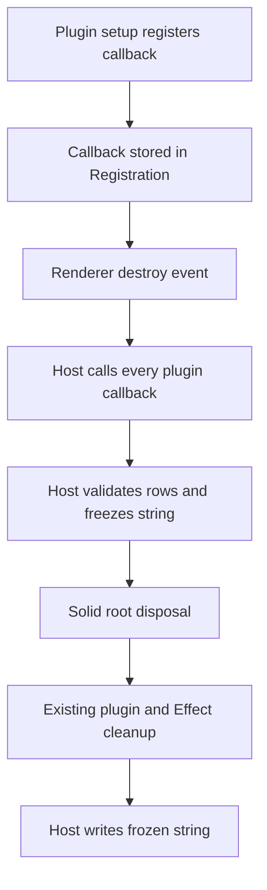
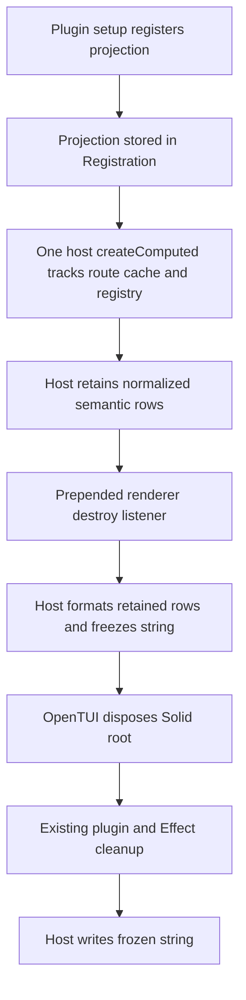

# Structured epilogue registry research

Date: 2026-08-30

Model: OpenAI GPT-5.6 Sol max (`gpt56s`)

Status: independent research follow-up; no interface has been accepted or implemented

## Question and conclusion

The immediate question is whether plugin-contributed full-TUI epilogue rows
should be read by calling plugins at renderer destruction, or retained as plain
host-owned data before shutdown.

The narrow public interface should be a dedicated structured registry, not a
JSX slot. The production implementation should be a retained reactive
projection, not a callback first invoked during shutdown and not an imperative
push handle owned by each plugin.

The key implementation simplification is that retained projections do not need
one Solid root or generation lease per contribution. `PluginProvider` is
already a Solid-owned component around the application. One host-owned
`createComputed` can:

1. Read the current Session route.
2. Traverse active plugin registrations in their established order.
3. Invoke every registered projection while Solid and plugin state are live.
4. Track the cache fields those projections read.
5. Validate and copy plain semantic rows into one retained array.

At renderer destruction, the host only formats that retained array, captures a
string, and opens the shutdown latch. It invokes no plugin code and performs no
lookup. Existing Solid disposal, plugin cleanup, and Effect finalization then
run unchanged. The frozen string is printed outside the Effect scope.

This is more machinery than the current fixed Active carry, but much less than
a headless slot or per-contribution retained-cell system. It is worth carrying
only if the interface is intended for upstream acceptance. If upstream does
not want a public epilogue seam, the current fixed carry remains the correct
downstream design.

## Current mechanical boundaries

### Registration is already the lifecycle boundary

Each plugin has one `Registration` containing its definition, source,
generation data, active flag, contribution records, and owned cleanup stack.
The current contribution records are `routes`, `slots`, and `markdown`:

- [Registration shape](/packages/tui/src/plugin/context.tsx#L65-L76)
- [Context registry adapter](/packages/tui/src/plugin/context.tsx#L145-L168)
- [Plugin-facing registration ownership](/packages/tui/src/plugin/api.tsx#L74-L109)

The registry adapter pushes every unregister operation into the same `owned`
array as plugin cleanup. Deactivation marks a plugin inactive before awaiting
cleanup, then clears its contribution records after cleanup:

- [Activation](/packages/tui/src/plugin/context.tsx#L137-L191)
- [Deactivation](/packages/tui/src/plugin/context.tsx#L193-L214)
- [Cleanup execution](/packages/tui/src/plugin/context.tsx#L552-L565)

An epilogue record fits this boundary directly:

```ts
type Registration = {
  // existing fields
  epilogue: Record<string, EpilogueProjection>
}
```

It does not need a second lifecycle, a shutdown lease, or a cleanup exception.
`clearContributions`, `toRegistration`, setup rollback, manual deactivation,
hot reload, and TUI shutdown can treat `epilogue` exactly like the three
existing contribution records.

### Plugin order already has one source of truth

The desired generation is a `Map` built from built-ins, discovered plugins,
server-advertised packages, and CLI configuration. Structural membership or
order changes rebuild the generation; in-place replacement preserves key
position:

- [Desired generation construction](/packages/tui/src/plugin/context.tsx#L253-L340)
- [Structural comparison and rebuild](/packages/tui/src/plugin/context.tsx#L342-L365)
- [In-place replacement](/packages/tui/src/plugin/context.tsx#L367-L399)

Slot claims then use registration-store key order across plugins and record
insertion order within each plugin:

- [Existing claim order](/packages/tui/src/plugin/context.tsx#L446-L464)

Epilogue rows should use exactly that traversal. Adding priorities, label
conflict resolution, sorting, or a second ordered registry would create a new
order that can drift from the rest of the plugin system. Duplicate labels are
therefore legal. Rows are additive and ordered, not keyed overrides.

### The cache and route are already reactive

The public plugin API exposes a synchronous cached Session read:

```ts
context.data.session.get(sessionID)
```

The implementation reads the Solid store directly at
[client `data.ts` lines 1244-1261](/packages/client/src/solid/data.ts#L1244-L1261).
The current route is also a Solid store, exposed through a getter and mutated
with `reconcile`:

- [Route context](/packages/tui/src/context/route.tsx#L29-L44)
- [Public route shape](/packages/plugin/src/tui/context.ts#L140-L155)

When an epilogue projection runs inside a host `createComputed`, its call to
`context.data.session.get(sessionID)` tracks the relevant store entry. A route
switch, Session hydration, or cached Session mutation can recompute retained
rows without plugin-owned subscriptions.

This is mechanically preferable to asking setup code to create its own Solid
effect. Plugin setup is reached through asynchronous reconciliation and is not
documented as running under a stable Solid owner. Existing plugin JSX receives
an owner only when a route, dialog, or slot render is mounted. The host should
own epilogue reactivity rather than making every plugin rediscover that rule.

`createComputed` is already used where state must update before render effects;
the TUI explicitly documents that scheduling property at
[session-tabs lines 1192-1208](/packages/tui/src/component/session-tabs.tsx#L1192-L1208).

### Renderer destruction is also Solid disposal

The current host registers a renderer destroy listener before calling Solid
`render`:

- [Shutdown listener and render call](/packages/tui/src/app.tsx#L277-L291)

OpenTUI's Solid adapter registers its own destroy listener which synchronously
disposes the Solid root:

- [OpenTUI Solid root disposal](https://github.com/anomalyco/opentui/blob/main/packages/solid/index.ts#L9-L32)

Waiting for `shutdown.await` and then reading plugin state is not a sufficient
ordering guarantee. Solid disposal can start from the same destroy event before
the waiting Effect resumes. The host must freeze the epilogue from a listener
that is explicitly ordered before Solid's listener, preferably with
`prependOnceListener`.

This requirement applies to both callback-at-shutdown and retained-row models.
The retained model makes that listener much safer because it only reads plain
host-owned data and formats text.

## Model A: callback first invoked at shutdown

### Interface

The smallest dedicated API is:

```ts
export interface EpilogueSnapshot {
  readonly sessionID: string
  readonly now: number
}

export interface EpilogueRow {
  readonly label: string
  readonly value: string
}

export type EpilogueContribution = (snapshot: EpilogueSnapshot) => EpilogueRow | undefined

export interface Epilogue {
  register(contribution: EpilogueContribution): () => void
}
```

The Active plugin would read the cache only when the renderer is destroyed:

```ts
context.ui.epilogue.register(({ sessionID, now }) => {
  const session = context.data.session.get(sessionID)
  if (!session) return
  return {
    label: "Active",
    value: activeAgo(session.time.updated, now),
  }
})
```

### Lifecycle



### Exact new machinery

The callback model requires:

| Mechanism | Count |
|---|---:|
| Public registry methods | 1 (`register`) |
| Public row/snapshot/contribution types | 3 |
| New `Registration` records | 1 (`epilogue`) |
| New internal registry kinds | 1 |
| Per-plugin registration counters | 1 |
| Ordered aggregation functions | 1 |
| Reactive computations | 0 |
| New Solid roots | 0 |
| New timers | 0 |
| New async finalizers | 0 |
| Pre-cleanup destroy listeners | 1 |

### Strengths

- It is the smallest honest public interface.
- It fits `Registration`, `owned`, and existing order directly.
- It computes exactly once and always uses the shutdown clock.
- Plain `{ label, value }` is easy to document and version.

### Problems

- Plugin code runs inside the renderer destroy event, the most sensitive point
  in terminal restoration.
- An `async` callback can be rejected, but a trusted plugin can still call
  `readFileSync`, perform CPU-heavy work, mutate stores, or throw repeatedly.
- A blocking callback delays OpenTUI's own Solid disposal and terminal
  restoration because event listeners run synchronously.
- The callback reads Solid state at the edge of disposal. A prepended listener
  makes this mechanically correct today, but it remains coupled to renderer
  event ordering.
- Errors can be isolated per row, but diagnostics cannot safely use a toast
  once destruction has begun.

This model is a good minimal implementation probe. It is not the preferred
production behavior when a small retained implementation can avoid all plugin
execution during destruction.

## Model B: explicit plugin push

### Interface

An imperative push API might look like this:

```ts
export interface EpilogueRegistration {
  update(row: EpilogueRow | undefined): void
  dispose(): void
}

export interface Epilogue {
  register(initial?: EpilogueRow): EpilogueRegistration
}
```

The host would retain each latest row. Shutdown would only copy and format
those rows.

### Mechanical mismatch

The interface moves the hard problem into every plugin: deciding when to call
`update`.

The Active plugin needs to react to all of these:

- Initial Session hydration.
- Current route changes from one Session to another.
- Cached timestamp or execution-status changes.
- Manual plugin disablement and hot reload.

The public data API offers event subscriptions, but the router offers a
reactive `current()` read rather than an event subscription. Plugin setup has
no guaranteed Solid owner in which it can safely create a long-lived effect.
An event-only implementation can miss a route switch to an already-cached
Session because no Session event is required to accompany that switch.

The API also differs from existing registration conventions. Routes, slots,
and Markdown return a disposer; they do not return a mutable registration
object. Adding `update` creates another lifecycle concept that must be fenced
against stale hot-reloaded generations.

Explicit push is attractive only for plugins that already own a suitable event
source. It is a poor general epilogue contract and a poor implementation of the
Active row.

## Model C: host-retained reactive projection

### Recommended public interface

The production interface can stay almost as narrow as Model A while moving
execution out of shutdown:

```ts
export interface EpilogueScope {
  readonly sessionID: string
}

export type EpilogueValue =
  | {
      readonly type: "text"
      readonly text: string
    }
  | {
      readonly type: "relative-time"
      readonly timestamp: number
    }

export interface EpilogueRow {
  readonly label: string
  readonly value: EpilogueValue
}

export type EpilogueProjection = (scope: EpilogueScope) => EpilogueRow | undefined

export interface Epilogue {
  /**
   * Registers one synchronous, side-effect-free projection of live cached
   * state. The host tracks and retains its normalized output while mounted.
   */
  register(projection: EpilogueProjection): () => void
}

export interface UI {
  // Existing fields.
  readonly epilogue: Epilogue
}
```

One registration produces at most one row. A plugin registers several
projections when it needs several rows. This gives each row its own error
boundary and preserves within-plugin call order without adding row IDs to the
public API.

`relative-time` is semantic rather than preformatted so the host can use the
actual freeze clock without a minute timer or a shutdown callback. It is also
general enough for Updated, Active, synchronized, cached, or accounting
timestamps. Plugins that want complete control use `text`.

The Active plugin becomes:

```ts
import { Plugin } from "@opencode-ai/plugin/tui"

export default Plugin.define({
  id: "opencode.epilogue.activity",
  setup(context) {
    return context.ui.epilogue.register(({ sessionID }) => {
      const session = context.data.session.get(sessionID)
      if (!session) return
      return {
        label: "Active",
        value: {
          type: "relative-time",
          timestamp: session.time.updated,
        },
      }
    })
  },
})
```

The plugin reads a cached `SessionInfo` while the normal TUI is live. It does
not subscribe to events, create a Solid root, start a timer, or run at
shutdown.

### Internal collector

The existing `PluginProvider` can retain rows with one computation:

```ts
let retained: readonly EpilogueRow[] = []

createComputed(() => {
  const route = host.route.data
  if (route.type !== "session") {
    retained = []
    return
  }

  retained = Object.entries(store.registrations).flatMap(([plugin, registration]) =>
    Object.entries(registration.active ? registration.epilogue : {}).flatMap(([key, project]) => {
      try {
        const row = project({ sessionID: route.sessionID })
        return row ? [normalizeEpilogueRow(row)] : []
      } catch (error) {
        reportEpilogueError({ plugin, key, error })
        return []
      }
    }),
  )
})
```

This sketch omits thenable detection, diagnostic deduplication, and validation,
but shows the ownership boundary. The computation belongs to
`PluginProvider`, not to any plugin. Reading the registration store, route
store, and Session cache establishes all required dependencies.

The retained array contains only newly copied primitives and discriminated
values. It must not retain a Solid proxy, JSX node, renderer object, plugin
context, or callback result object.

### Lifecycle



### Exact new machinery

The retained production model requires:

| Mechanism | Count |
|---|---:|
| Public registry methods | 1 (`register`) |
| Public scope/value/row/projection/registry types | 5 |
| New `Registration` records | 1 (`epilogue`) |
| New internal registry kinds | 1 |
| Per-plugin registration counters | 1 |
| Host-owned tracked computations | 1 |
| Host-owned retained arrays | 1 |
| Pure row normalizers | 1 |
| New Solid roots | 0 |
| Generation leases or tokens | 0 |
| New timers | 0 |
| New event subscriptions | 0 |
| New async finalizers | 0 |
| Pre-cleanup destroy listeners | 1 |
| New placement or conflict algorithms | 0 |

This is materially smaller than the retained-cell model considered in the
parent design. Existing active flags and registration replacement already
fence generations. Existing Solid ownership already supplies a safe tracking
root. Existing registration-store order already supplies deterministic order.

### Deactivation and reload behavior

The retained collector naturally follows current lifecycle state:

| Event | Retained-row behavior |
|---|---|
| Plugin activates | Its projections become visible only after `active` becomes true. |
| Plugin manually deactivates | `active` becomes false before cleanup, so its rows disappear immediately. |
| Plugin hot reload begins | Old rows disappear when the old registration deactivates. |
| Replacement setup succeeds | New rows appear in the same plugin key position. |
| Replacement import or setup fails | Existing fallback machinery restores and reactivates the last-good plugin. |
| Plugin projection throws | That row is omitted; core and later rows remain. |
| Route leaves Session | Retained rows reset to empty, preventing Session leakage. |
| Route enters an unhydrated Session | Projections run with the ID, cache reads return missing, and rows remain empty until hydration. |
| Renderer destruction begins | Current retained rows are frozen before deactivation or Solid disposal. |

No special last-good row cache should survive a projection error. Retaining a
row from the previous Session would be worse than omission. Last-good plugin
generation behavior remains the responsibility of the existing activation
fallback, not the epilogue collector.

### Error and normalization policy

Production behavior should be explicit:

1. Invoke each projection independently.
2. Reject Promises and other thenables without awaiting them.
3. Require a non-empty plain label and a valid discriminated value.
4. Strip ANSI and terminal controls from plugin text.
5. Collapse newlines to spaces or reject the row; do not permit multiline
   plugin output in the initial API.
6. Apply host-defined display-width limits to labels and values.
7. Copy accepted fields into a fresh frozen object.
8. Omit only the failing row.
9. Deduplicate diagnostics by plugin, registration key, and error text.
10. Do not use a shutdown toast. Runtime projection errors may be logged or
    toasted once while the renderer is healthy.

The host continues to own ANSI, alignment, label padding, the logo, Session
identity, Continue command, and blank-line envelope. Plugins never return
pre-rendered terminal content.

## Host freeze and epilogue envelope

The internal epilogue context is currently only a singleton source setter:

- [Epilogue context](/packages/tui/src/context/epilogue.tsx)
- [Session source installation](/packages/tui/src/routes/session/index.tsx#L198-L205)

It does not need to become a plugin registry. Keeping it narrow separates two
roles:

- `PluginProvider` owns live ordered retained plugin rows.
- The Session route owns the current core epilogue source.

The Session route can close over copied title and ID primitives plus the
retained-row accessor:

```ts
setEpilogue(() =>
  sessionEpilogue({
    title,
    sessionID: current.id,
    now: Date.now(),
    rows: plugins.epilogue(),
  }),
)
```

The formatter inserts plugin rows at one fixed additive lane between Session
and Continue:

```text
[wordmark]

Session   A session
Active    3d 4hr ago
Cost      $1.23
Continue  opencode2 -s ses_123
```

The default Active plugin is ordered before external plugins because built-ins
enter the desired generation first at
[plugin context lines 270-275](/packages/tui/src/plugin/context.tsx#L270-L275).
The resulting default output remains the current Session, Active, Continue
epilogue. No plugin can suppress those core envelope elements or reorder itself
through a priority.

An ordinary built-in remains subject to the existing negative plugin selector
at [plugin context lines 276-287](/packages/tui/src/plugin/context.tsx#L276-L287).
Therefore "the current epilogue remains" means the default remains exact. If
Active must be non-disableable, it should remain core-owned; special-casing one
built-in would change plugin semantics and violate the requirement to preserve
lifecycle and ordering rules.

The host should replace the current live callback carried past scope cleanup
with two fields:

```ts
const exit = {
  source: undefined as (() => string) | undefined,
  snapshot: undefined as string | undefined,
  reason: undefined as unknown,
}
```

The destroy listener freezes before Solid disposal and always opens the latch:

```ts
renderer.prependOnceListener("destroy", () => {
  try {
    exit.snapshot = exit.source?.()
  } finally {
    shutdown.openUnsafe()
  }
})
```

After `shutdown.await`, the Effect scope runs existing finalizers. The host then
writes `snapshot` as a string rather than invoking `source`:

- [Current scope boundary and output](/packages/tui/src/app.tsx#L449-L457)
- [Renderer destruction is idempotent](/packages/tui/src/util/renderer.ts#L3-L7)

This handles signal exits, `ExitProvider`, direct renderer destruction, and
scope release through one renderer event. `SIGKILL`, process abort, and kernel
termination remain outside the guarantee.

## Honest comparison with a headless slot

A headless `session.epilogue` slot appears to reuse more machinery, but the
current slot contract is specifically JSX-shaped:

- `SlotMap` maps paths to input values, while every `SlotClaim.render` returns
  `JSX.Element` at [public context lines 157-239](/packages/plugin/src/tui/context.ts#L157-L239).
- `SlotRender` erases all paths to a function returning `JSX.Element` at
  [plugin API lines 27-35](/packages/tui/src/plugin/api.tsx#L27-L35).
- The host wraps slot renders in `PluginContextProvider` JSX at
  [plugin API lines 87-91](/packages/tui/src/plugin/api.tsx#L87-L91).
- The mounted `Slot` invokes claims through `createComponent` and a JSX
  `PluginBoundary` at [plugin render lines 80-121](/packages/tui/src/plugin/render.tsx#L80-L121).

Only two slot properties are genuinely reusable for epilogues: ordered
registration and owned cleanup. Those properties already live one layer lower
in `Registration`; a dedicated registry can reuse them without pretending a
plain data projection is a render.

The generic `resolveSlots` algorithm adds little value to an append-only fixed
lane. It resolves before, after, prepend, append, replace, missing-path
degradation, and hierarchy suppression. A production epilogue API needs none
of those. Either the headless path runs through irrelevant policy, or it forks
before resolution and the reuse becomes mostly naming.

Headless slots also broaden a mature public type from one output domain to two:

```ts
type SlotOutput<Path extends SlotPath> =
  Path extends "session.epilogue" ? EpilogueRow | undefined : JSX.Element
```

That conditional propagates through `SlotClaim`, erased `SlotRender`, context
wrapping, runtime validation, error containment, and documentation. A headless
collector still needs the same `createComputed`, retained rows, normalization,
and destroy freeze as the dedicated registry.

The dedicated registry is therefore more mechanically honest and more likely
to be accepted upstream. It says that epilogue rows are structured output with
one additive ordering rule. The slot interface remains a visual composition
system.

## Honest comparison with the fixed carry

The current Active commit is exceptionally small:

```text
6 files changed
37 insertions
7 deletions
4 production files
2 test files
0 public API files
0 documentation files
```

The exact changed files are reported by change `smsmuzstqsvm` and listed in the
parent design. It adds no compatibility commitment and has a narrow conflict
surface.

The generic registry cannot beat that carry size. Its value is avoiding one
new core patch for every future row and enabling external plugins. If only
Active is required, the fixed carry is superior.

## Quantified comparison

The production file counts below are minimum expected touch counts, not diff
line estimates. A separate pure normalizer module adds one production file to
the retained and shutdown-callback designs.

| Property | Fixed carry | Shutdown callback registry | Retained registry | Headless slot |
|---|---:|---:|---:|---:|
| Production TS/TSX files | 4 | 8 | 8 or 9 | At least 10 |
| Public plugin contract files | 0 | 1 | 1 | 1 |
| CLI documentation files | 0 | 1 | 1 | 1 |
| Dedicated reactive computations | 0 | 0 | 1 | At least 1 |
| New Solid roots | 0 | 0 | 0 | 0 or more |
| Plugin code invoked during destroy | No | Yes | No | No |
| New placement semantics | No | No | No | Conditional or forked |
| Reuses `Registration` and `owned` | N/A | Yes | Yes | Yes |
| Reuses existing plugin order | N/A | Yes | Yes | Yes |
| Alters JSX slot typing | No | No | No | Yes |
| Default Active output possible | Yes | Yes | Yes | Yes |
| Downstream carry quality | Excellent | Poor unless upstream-bound | Poor unless upstream-bound | Poor |
| Upstream interface clarity | N/A | Good | Best safety/clarity balance | Weakest |

Expected production touch points for the retained registry are:

| File | Change |
|---|---|
| [`packages/plugin/src/tui/context.ts`](/packages/plugin/src/tui/context.ts#L436-L486) | Add public epilogue types and `UI.epilogue`. |
| [`packages/tui/src/plugin/api.tsx`](/packages/tui/src/plugin/api.tsx#L39-L109) | Add registry kind, counter, and `register` adapter. |
| [`packages/tui/src/plugin/context.tsx`](/packages/tui/src/plugin/context.tsx#L50-L135) | Add Registration record, retained computation, accessor, clearing, and initialization. |
| [`packages/tui/src/app.tsx`](/packages/tui/src/app.tsx#L226-L301) | Freeze from a prepended destroy listener and carry a string. |
| [`packages/tui/src/routes/session/index.tsx`](/packages/tui/src/routes/session/index.tsx#L156-L205) | Compose retained plugin rows into the Session source. |
| [`packages/tui/src/util/presentation.ts`](/packages/tui/src/util/presentation.ts#L26-L48) | Format semantic rows with an explicit clock and fixed insertion lane. |
| [`packages/tui/src/plugin/builtins.ts`](/packages/tui/src/plugin/builtins.ts#L1-L27) | Register the built-in Active plugin. |
| `packages/tui/src/feature-plugins/system/epilogue-activity.ts` | Read cached SessionInfo and contribute Active. |
| [`packages/www/src/docs/content/build/plugins/cli.mdx`](/packages/www/src/docs/content/build/plugins/cli.mdx#L386-L408) | Document structured epilogue projections separately from slots. |

The existing internal epilogue context can remain unchanged. Protocol, Server
`HttpApi`, Schema, and generated clients are not touched.

## Minimal prototype versus production design

### Minimal research prototype

The first prototype should not change `@opencode-ai/plugin` or move Active. Its
purpose is to disprove hidden runtime assumptions before creating a public API.

It needs exactly this experimental machinery:

| Prototype item | Count |
|---|---:|
| New private collector modules | 1 |
| Host-owned `createComputed` instances | 1 |
| Synthetic ordered registration stores | 1 test fixture |
| Renderer objects created by collector | 0 |
| Renderer frames requested by collector | 0 |
| Public API changes | 0 |
| Production Active behavior changes | 0 |

The private collector should accept accessors for current route and ordered
synthetic projections, retain normalized rows, and expose a synchronous
`snapshot()` accessor. Tests should mutate a Solid Session store, route, active
flags, and registration order.

A second integration experiment should replace the app's destroy listener with
a pre-cleanup freeze callback and gate cleanup. It should prove the ordering:

```text
projection recompute
renderer destroy starts
host freezes retained rows
Solid cleanup starts
plugin cleanup completes
Effect scope closes
stdout receives frozen epilogue
```

This prototype can be discarded without creating a downstream public API.

### Minimum upstreamable slice

An upstreamable first slice should add the public registry, retained collector,
normalization, lifecycle freeze, tests, and docs, but can leave the core Active
row in place. A fixture plugin can prove the public API. This avoids making the
API review depend on the semantic question of what Active means.

The slice is complete only when external plugin rows survive teardown without
shutdown plugin calls or HTTP requests.

### Production completion

After the interface is accepted, move Active into a built-in plugin, remove its
fixed formatter input, and preserve the exact default output. Do not retain
both implementations. The built-in must read cached `SessionInfo` through
`context.data.session.get` and emit a semantic relative-time value.

Production also needs documented limits, diagnostic deduplication, malformed
JavaScript-plugin validation, hot reload coverage, and process-level signal
tests. Those are not optional polish because this API runs in the terminal exit
path even though its projections do not.

## Test plan

### Pure retained collector

Add a focused `plugin-epilogue.test.ts` or equivalent pure module test:

1. Built-in A, external B, and external C appear in registration-store order.
2. Two rows from A preserve registration call order.
3. An inactive registration contributes nothing.
4. A route switch from Session A to Session B removes A before B hydrates.
5. Updating the cached Session timestamp reruns only through Solid dependency
   propagation, with no explicit event subscription.
6. A projection throw omits one row and later rows remain.
7. A Promise, JSX-looking object, invalid discriminant, empty label, newline,
   ANSI sequence, and oversized value are rejected or normalized as specified.
8. The retained result contains copied primitives rather than the source row
   object or a Solid proxy.
9. No OpenTUI renderable is constructed and `renderer.requestRender` is never
   called.

### Registration lifecycle

Extend the existing hot-reload coverage around
[`plugin-hot-reload.test.tsx` lines 180-304](/packages/tui/test/plugin-hot-reload.test.tsx#L180-L304):

1. Editing B leaves A's retained row and callback instance untouched.
2. Replacing A keeps its plugin order position.
3. Failed import keeps the last-good running generation and row.
4. Failed setup rolls back new registrations and restores the fallback row.
5. Manual deactivation removes rows before cleanup resolves.
6. Cleanup unregister calls are idempotent after wholesale contribution clear.

### Freeze and output lifecycle

Extend
[`app-lifecycle.test.tsx` lines 218-349](/packages/tui/test/app-lifecycle.test.tsx#L218-L349):

1. Record in-memory milestones for projection, freeze, plugin cleanup, renderer
   destruction, and stdout write.
2. Gate plugin cleanup with a Promise.
3. Assert stdout remains empty while cleanup is gated.
4. Assert freeze occurred before cleanup began.
5. Mutate or unregister the live row during cleanup.
6. Release cleanup and assert the pre-cleanup row prints exactly once.
7. Assert `renderer.isDestroyed` when stdout is written.
8. Exercise SIGHUP, SIGINT, SIGTERM, `ExitProvider`, and direct renderer
   destruction.

### No shutdown lookup

Record every request after the exit trigger. Fail on any Session, project,
plugin, storage, or filesystem lookup caused by epilogue production. The
existing test only counts prompt requests at
[`app-lifecycle.test.tsx` lines 280-343](/packages/tui/test/app-lifecycle.test.tsx#L280-L343);
the new assertion should cover all requests after the trigger.

### Presentation

Update
[`presentation.test.ts` lines 1-23](/packages/tui/test/util/presentation.test.ts#L1-L23)
to use an explicit clock and assert the complete stripped order:

```text
Session
Active
additional plugin rows
Continue
```

Test relative-time boundaries without reading `Date.now()` inside the
formatter.

### Public type contract

Add type canaries following
[`plugin-structure.test.ts` lines 5-19](/packages/tui/test/plugin-structure.test.ts#L5-L19):

1. A valid text row compiles.
2. A valid relative-time row compiles.
3. An async projection is rejected.
4. JSX is rejected.
5. Invalid value discriminants are rejected.

The plugin package's existing TUI contract smoke test at
[`contract-identity.test.ts` lines 66-69](/packages/plugin/test/contract-identity.test.ts#L66-L69)
can remain a basic entrypoint check.

## Risks and limits

### Cached recency is not authoritative

The registry can guarantee lookup-free shutdown, not a perfectly current
cache. Execution terminal events schedule asynchronous Session
resynchronization at
[client data lines 1015-1028](/packages/client/src/solid/data.ts#L1015-L1028).
A signal can arrive before that request completes. The retained row then
correctly reflects the latest local fact, not necessarily the latest server
projection.

This should not be solved by a shutdown fetch. Improve cache event projection
separately if measurements show a material race.

### Active semantics remain separate

`SessionInfo` exposes `time.updated` and optional `time.idle` at
[Session schema lines 31-58](/packages/schema/src/session.ts#L31-L58).
The seam does not decide whether Active means `updated`, `max(updated, idle)`,
or status-sensitive recency. The built-in plugin and its tests must make that
choice explicitly.

### One computed tracks all projections

Any dependency change used by one projection reruns the aggregate computation
and therefore all active projections. Epilogue rows are expected to be few and
cheap, so this is preferable to per-row roots and disposal. Instrument before
splitting it. If real plugin counts make aggregate recomputation expensive,
per-registration memos can be added later without changing the public API.

### Plugin projections are trusted code

A projection can perform side effects, synchronously block, mutate a tracked
store, or create a reactive loop. Running it while the renderer is healthy is
safer than running it during destruction but cannot sandbox it. Documentation,
error containment, and diagnostics are the available controls in the current
trusted plugin model.

### Reactive ownership can be abused

Because projections execute under the host computation, a plugin that creates
Solid primitives inside its projection may attach work to the host owner and
recreate it on every run. The contract must say projections only read state and
return data. Supporting arbitrary plugin-owned reactive setup would require a
different cell API and explicit roots.

### Freeze ordering depends on one renderer event

`prependOnceListener` is mechanically stronger than relying on registration
order, but tests must cover every host exit path. If OpenTUI changes destroy
event timing, the host integration may need a dedicated pre-destroy hook.

### Text safety is a host responsibility

Plugins already run trusted code, but accepting raw controls in a post-renderer
stdout epilogue is still unnecessary. Normalize output even though this is not
a security sandbox. The initial API should remain single-line and bounded.

## Carryability and upstreamability

Carryability should decide whether this work ships, not merely influence its
implementation.

The fixed Active carry is one small commit touching four production files and
two tests. It can be rebased, reviewed, and dropped independently. The generic
registry crosses the public plugin package, TUI plugin runtime, shutdown path,
Session route, formatter, built-ins, tests, and documentation. Carrying that
framework downstream would expose a downstream-only public API and create
conflicts in some of the most active V2 plugin files.

The retained dedicated registry is nevertheless the most upstreamable generic
design because:

- Its public surface is one operation with one additive policy.
- It does not overload JSX slot vocabulary.
- It reuses existing Registration ownership and order rather than introducing
  another loader.
- It executes no plugin code after renderer destruction begins.
- It needs no Protocol, Server, Schema, or generated-client changes.
- It can be reviewed independently from Active timestamp semantics.

The shutdown callback registry is slightly smaller, but its upstream story is
weaker: it deliberately invokes third-party code while terminal destruction is
blocked. The headless slot is larger and changes a general visual composition
contract for one nonvisual use case. Explicit push burdens every plugin with
reactive lifecycle work the host can already centralize.

Recommended carry strategy:

1. Keep graceful signal handling independently carryable and upstreamable.
2. Keep the current fixed Active commit as the downstream behavior while the
   generic seam is only research.
3. Prototype retained collection without a public API or Active migration.
4. Propose the dedicated retained registry upstream in reviewable slices.
5. Move Active to the built-in plugin only after the interface is accepted.
6. Drop the fixed Active implementation when the plugin implementation lands.
7. If upstream declines the seam, abandon the generic prototype and continue
   carrying the 37-line fixed change.

Do not maintain both a core Active row and plugin Active row. Do not publish a
downstream-only `@opencode-ai/plugin` contract unless there is an explicit
commitment to carry and support it across upstream plugin API evolution.

## Recommendation

Use a dedicated structured registry with host-retained reactive projections as
the production target.

The decisive shape is:

```text
public plugin callback runs while live
-> host copies semantic row
-> prepended destroy listener formats retained data
-> Solid and plugin cleanup run unchanged
-> host prints frozen string after scope teardown
```

Use callback-at-shutdown only as a minimal experiment if necessary to validate
registration and freeze plumbing. Do not make it the final execution model.

Reject explicit plugin push for the first API because route and Solid ownership
make it harder for plugins than for the host. Reject a headless slot because it
reuses only registration and order while complicating the JSX slot contract.

Keep the fixed carry unless this generic interface is actively headed
upstream. The generic registry improves long-term carryability only by landing
upstream; as a permanent downstream framework it is a regression from the
small fixed patch.

## Cross-references

- [Pluggable TUI epilogues possibility space](/.design/term-v2/epilogue-plugins0.gpt56s.md): parent exploration covering fixed carry, dedicated registry, headless slot, retained cells, invariants, and the Active timestamp question.
- [Term-v2 refresh record](/.design/term-v2/refresh-20260829.model-unspecified.md): records the downstream carry base and refresh history relevant to conflict risk.
- [Public CLI plugin context](/packages/plugin/src/tui/context.ts#L436-L486): current public UI surface where a dedicated registry would live.
- [Plugin registration lifecycle](/packages/tui/src/plugin/context.tsx#L137-L224): existing activation, ownership, deactivation, and cleanup semantics reused by the proposal.
- [Plugin generation ordering](/packages/tui/src/plugin/context.tsx#L253-L399): source of deterministic plugin order and last-good generation recovery.
- [Visual slot implementation](/packages/tui/src/plugin/render.tsx#L73-L144): demonstrates why current slots are renderer and JSX composition rather than generic data contributions.
- [Current epilogue source and output](/packages/tui/src/app.tsx#L226-L301): host source storage, renderer lifecycle setup, and provider placement.
- [Current Session epilogue](/packages/tui/src/routes/session/index.tsx#L198-L205): route-owned Session source that would compose retained plugin rows.
- [Current epilogue formatter](/packages/tui/src/util/presentation.ts#L26-L48): fixed Session, Active, and Continue presentation retained as the default envelope.
- [CLI plugin guide](/packages/www/src/docs/content/build/plugins/cli.mdx#L360-L418): current route, tab, slot, formatting, and publishing documentation adjacent to the proposed API.
- [OpenTUI Solid root disposal](https://github.com/anomalyco/opentui/blob/main/packages/solid/index.ts#L9-L32): external lifecycle fact requiring the host to freeze before Solid's destroy listener.
