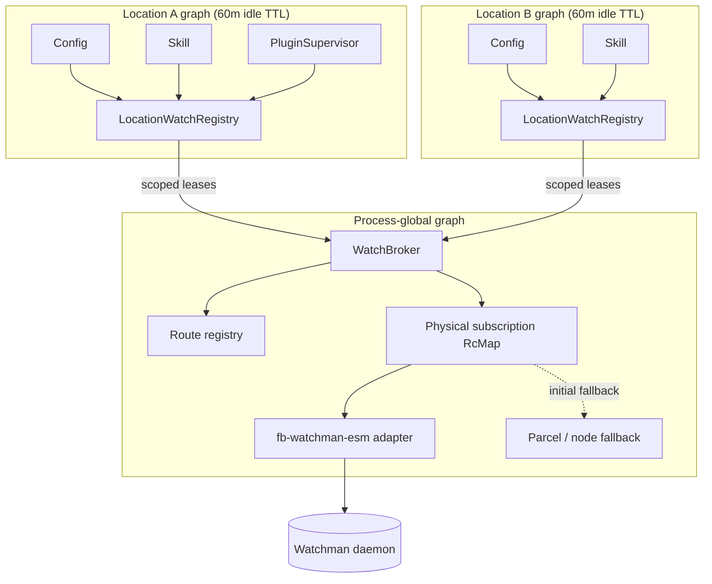
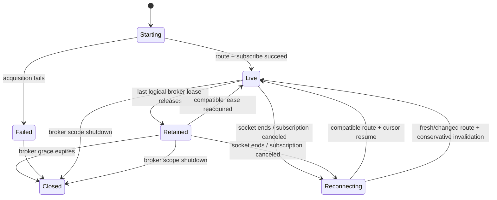

# OpenCode V2 filesystem watch registry

## Summary

OpenCode V2 should replace independently acquired recursive Parcel/inotify watches with a first-class registry that routes project-local interests through shared Watchman project roots.

The registry has two ownership tiers:

1. **Location watch registries** own logical interests for Config, Skill, PluginSupervisor, and LocationWatcher. They reconcile changing watch sets and retain leases according to Location activity.
2. A **process-global watch broker** owns backend connections and physical subscriptions. It deduplicates compatible subscriptions across Locations and retains them briefly after the final logical lease disappears.

The Watchman backend uses [`@superbfowle/fb-watchman-esm`](/home/rektide/src/watchman-esm/watchman/node) — an ESM-only fork of the official Watchman node client (v3.0.0, unpublished at time of writing) — behind a narrow Effect adapter. No CommonJS, no `node-int64`; BSER framing via `@superbfowle/bser-esm` (BigInt-based).

Project-local paths use `watch-project` and `relative_root`. Global and home-scoped paths use bounded exact watches unless an already-existing covering root can be adopted safely. Normal teardown sends `unsubscribe`, never `watch-del`, because Watchman roots are daemon-global and may be shared with editors and other tools.

The first rollout is opt-in. Initial Watchman failure falls back to the existing Parcel backend. Mid-stream failure reconnects and restores cursors or emits conservative invalidations; it never silently changes backend while continuity is uncertain.

## Scope

This design targets **OpenCode V2 only**:

- `packages/core`
- `packages/server`
- `packages/schema`
- `packages/cli`
- generated client surfaces only if a public diagnostic API is added later

`packages/opencode` is V1 reference material and is not changed.

### Goals

1. Consolidate recursive kernel watches through Watchman roots shared across OpenCode processes, editors, and build tools.
2. Stop Skill invalidation from repeatedly tearing down and recrawling unchanged trees.
3. Model global, Location, logical-interest, physical-subscription, and daemon-root lifetimes explicitly.
4. Preserve current `Watcher.Update` behavior and consumer correctness.
5. Recover from Watchman disconnect, restart, recrawl, cancellation, and route changes without silently going stale.
6. Keep Watchman optional and provide clear fallback and diagnostic behavior.
7. Accept richer retention hints over time without coupling Core filesystem services to Server transports or TUI state.

### Non-goals

- Replacing every exact `node:fs.watch` file watch in the first implementation.
- Making Watchman a required installed dependency.
- Persisting watch registry state across OpenCode process restarts.
- Treating a Watchman root as exclusively owned by OpenCode.
- Designing the future per-session TUI presence API.

## Current system and measured problem

### Existing seam

[`packages/core/src/filesystem/watcher.ts`](/packages/core/src/filesystem/watcher.ts) already provides the correct low-level seam:

```ts
interface NativeInterface {
  readonly subscribe: (input: {
    readonly type: "file" | "directory"
    readonly target: string
    readonly ignore: readonly string[]
    readonly publish: (update: Update) => void
  }) => Effect.Effect<Subscription | undefined>
}
```

`Watcher.Service` is process-global. Its `RcMap` canonicalizes exact `(type, target, ignore)` keys, acquires one native subscription, and fans updates out through PubSub. Consumers receive streams whose scopes are the logical leases.

Today:

- file watches use `node:fs.watch` on the parent directory;
- recursive directory watches use `@parcel/watcher`;
- Linux explicitly selects Parcel's `inotify` backend, bypassing Parcel's Watchman backend;
- the `RcMap` has zero idle TTL, so the last stream release immediately destroys the physical subscription.

### Consumers

| Consumer | Current interests | Current behavior |
| --- | --- | --- |
| Config | global and project config roots, standalone config files | Directory roots use `.git`/`node_modules` ignores; roots only grow during the Location lifetime. |
| Skill | source roots, missing/symlink sentinels, external SKILL.md parents | Recursive watches have no ignores; all watches are cleared on invalidation and recreated on reload. |
| PluginSupervisor | configured plugin entry files outside config roots | File watches only grow during the Location lifetime. |
| LocationWatcher | `.git/HEAD`, `.hg/branch` | Exact file watches publish filesystem change events. |

### Effect lifetimes already present

V2's process-global `LocationServiceMap` builds one service graph per canonical `Location.Ref`. [`location-services.ts`](/packages/core/src/location-services.ts) retains idle Location graphs for 60 minutes. Multiple Location graphs can coexist in one server and can resolve to the same Project.

This establishes two different resource lifetimes:

- **Location graph lifetime**: semantic owners such as Config and Skill remain alive after a request.
- **Physical subscription lifetime**: a watch may be released and recreated inside a still-live Location graph, especially when Skill clears its FiberMap.

The registry must represent both. Project ID is too coarse for logical ownership because worktrees, subdirectories, workspaces, and non-repository Locations can share one Project ID.

### Measured behavior

One local server log contained:

- 83 `watcher subscribe` records;
- 62 `watcher started` records;
- 61 `watcher stopped` records;
- overlapping global and nested skill directories;
- individual recursive watches for external SKILL.md parent directories;
- `ignores=0` on Skill tree watches.

Four concurrent OpenCode service processes multiplied those operations. Steady-state inotify counts in an individual process were small; the larger problem was repeated recursive acquisition, overlapping roots, and duplicated work across processes.

## Design vocabulary

| Term | Definition |
| --- | --- |
| **Interest** | One domain request for file or tree changes, independent of backend. |
| **Watch set** | Related interests reconciled as one semantic unit. |
| **Logical lease** | A scoped claim by a domain owner or retained Location entry. |
| **Routing intent** | Whether a target should share a project root or remain bounded. |
| **Route** | Backend result mapping requested target to physical root and relative root. |
| **Physical subscription** | One backend subscription and its event hub/cursor. |
| **Daemon root** | Watchman's recursive filesystem crawl, shared by all clients. |
| **Connection generation** | One lifetime of the process's Watchman socket connection. |
| **Retention hint** | Activity/presence-derived reason to hold a logical lease longer. |

## Architecture



### Dependency direction

- The physical broker is a global AppNode and may depend only on global services.
- The logical registry is a Location AppNode and may depend on both global and Location services.
- The global broker cannot read `Location`, `Environment`, Session, or EventFeed directly.
- The Location registry passes canonical Location identity, backend identity, routing intent, and owner metadata with registrations.
- Activity/client signals arrive through a neutral retention-hint interface or scoped pins. Core never imports Server EventFeed.

## Logical interests and watch sets

### Interest model

```ts
type RoutingIntent = "project" | "exact"

type Interest =
  | {
      readonly type: "file"
      readonly path: string
      readonly routing: "exact"
    }
  | {
      readonly type: "tree"
      readonly path: string
      readonly routing: RoutingIntent
      readonly include?: readonly string[]
      readonly ignore?: readonly string[]
    }

type WatchSet = {
  readonly owner: "config" | "skill" | "plugin" | "location-vcs"
  readonly interests: readonly Interest[]
}
```

Routing intent is explicit because path containment alone does not express user intent. Symlinks, a `$HOME` dotfiles repository, nested repositories, externally configured skill sources, and hosted workspaces make inference unreliable.

### Routing policy by producer

| Interest source | Default intent | Reason |
| --- | --- | --- |
| project `.opencode`, project config, project skills | `project` | Share the Location's VCS/project root. |
| global XDG config and global skill directories | `exact` | Avoid accidentally watching an entire home/dotfiles repository. |
| external configured skill repository | explicit from discovery | Use `project` only when repository discovery identifies a safe non-home repository root; otherwise exact. |
| missing path/symlink sentinel | `exact` file | Preserve current parent-directory semantics. |
| `.git/HEAD`, `.hg/branch` | `exact` file initially | Watchman may treat VCS metadata specially; migrate only after compatibility tests. |

### LocationWatchRegistry

One logical registry exists in each Location graph.

Responsibilities:

- capture canonical `Location.Ref` and backend identity;
- normalize interests and watch sets;
- remove duplicate or contained targets within one set;
- reconcile old and new sets without clearing unchanged interests;
- hold broker leases through domain churn and activity-aware grace;
- fan updates back to each domain owner;
- expose logical diagnostics by owner and Location;
- preserve producer-specific lifecycle policy.

Proposed API:

```ts
interface LocationWatchRegistry {
  readonly subscribe: (interest: Interest) => Effect.Effect<Stream.Stream<Update>>
  readonly subscribeSet: (set: WatchSet) => Effect.Effect<Stream.Stream<Update>>
}
```

The stream scope remains the consumer lease. Internally, the logical registry may retain its broker lease after the consumer stream closes.

### Skill as the first WatchSet

Skill is the highest-value migration:

1. Resolve all source roots and external SKILL.md parents.
2. Preserve exact file interests for missing paths and symlink topology.
3. Remove a directory target contained by another directory in the same set.
4. Route remaining project targets through Watchman.
5. Group compatible targets by `(backend, root)` only inside the explicit Skill set.
6. Build safe `anyof` prefix/file expressions for discovery-relevant files.
7. Apply `.git` and `node_modules` reduction server-side and again in the local matcher.
8. Reconcile the previous and next WatchSet rather than calling `FiberMap.clear`.

Expected result: approximately one Skill subscription per distinct Watchman project root, not one recursive subscription per discovered external skill directory.

## Root routing

### Project routing

For `routing: "project"`, send:

```text
["watch-project", requestedTarget]
```

Watchman atomically:

1. reuses an existing covering daemon root when available;
2. searches for `.watchmanconfig` and configured VCS root markers;
3. establishes the selected root if needed;
4. returns `{watch, relative_path?}`.

The route is:

```ts
type Route = {
  readonly requested: string
  readonly root: string
  readonly relativeRoot: string
}
```

The physical subscription uses `root` as the command root and `relativeRoot` as `relative_root`. Project-local Config and Skill subtrees therefore share the daemon's project crawl while receiving independently filtered updates.

Do not pre-scan `watch-list` for project routing. It duplicates an atomic daemon operation with a stale client snapshot.

### Exact/global routing

`watch-project` can select an undesirably broad ancestor when a global target is inside a home directory that itself contains `.watchmanconfig` or a VCS marker. That decision is too late to undo safely after `watch-project` creates or adopts the root.

For `routing: "exact"`:

1. Optionally consult a short-lived `watch-list` snapshot for an already-existing covering root.
2. If a covering root exists, adopt it with `relative_root`.
3. Otherwise send `["watch", requestedTarget]` and use the exact target as root.

This `watch-list` use is only an optimization for bounded routing. A race can miss an adoption opportunity and create an overlapping exact root, but cannot make the target broader or break correctness. Diagnostics should count these cases.

### Route registry

Concurrent route requests coalesce through an awaitable entry keyed by:

```text
(connection generation, backend identity, routing intent, canonical requested target)
```

```text
resolve(target)
  first caller creates Deferred<Route>
  first caller sends watch-project/watch
  concurrent callers await the Deferred
  completion is cached for the connection generation
```

Routes are not durable. On reconnect, retained subscriptions rerun routing because repositories, mounts, `.watchmanconfig`, root configuration, and daemon state may have changed.

## Physical subscription broker

### Key

```text
(backend identity,
 root,
 relative root,
 canonical server expression,
 local matcher fingerprint,
 event-policy version)
```

Location, owner, callback identity, generated subscription name, cursor, lease count, and connection generation are runtime metadata, not semantic key material.

### Managed subscription

```text
ManagedSubscription
  key
  generated name
  requested targets / logical owners
  connection generation
  last clock
  state
  event PubSub
  logical reference count
  broker expiry
```

### State machine



`Retained` keeps the actual subscription, cursor, PubSub, and local matcher alive. This is essential:

- reacquisition is immediate;
- no change gap opens during grace;
- Parcel fallback avoids recursive re-acquisition too;
- reconnect has a current cursor;
- Skill's clear/reload cycle becomes a map/lease operation.

When retained subscriptions have no downstream PubSub subscribers, updates are filtered and discarded rather than buffered indefinitely.

## Retention and activity

### Two retention layers

1. **Logical retention** is Location-aware and activity-aware. A Location registry may keep its broker lease after a domain consumer releases it.
2. **Broker retention** is a short static safety TTL after the final Location/global lease disappears.

Separating them preserves physical sharing. Activity does not become part of the physical subscription key.

### Initial policy

For the first activity-aware implementation:

| Situation at logical release | Behavior |
| --- | --- |
| relevant Session is in `Session.active` | pin while active; after completion apply long grace |
| no relevant active Session | short grace |
| global Config/Skill interest | long floor |
| Location graph or process scope closes explicitly | close logical leases immediately; broker safety TTL may still apply unless process shuts down |

Suggested defaults for dogfood, configurable later:

- short: 60 seconds;
- long: 15 minutes;
- process shutdown: immediate;
- broker safety TTL: 60 seconds.

The initial static-only cut may use a 15-minute broker `RcMap.idleTimeToLive` before the logical policy exists. Once logical retention lands, reduce broker TTL to the short safety value.

### Why dynamic policy is not the RcMap TTL callback

Effect computes an `RcMap` entry's `idleTimeToLive(key)` when the entry is created and stores that duration. It does not resample Session/client state when the reference count later reaches zero. Adding activity to the key would fragment sharing and retain stale activity values.

Dynamic logical retention therefore needs an explicit release timer or scoped pin in `LocationWatchRegistry`.

### Retention hint seam

Core filesystem code must not depend directly on Session or Server EventFeed. Use a neutral push/pin service at composition boundaries:

```ts
type RetentionClass = "short" | "long" | "pinned"

interface WatchRetentionHints {
  readonly classify: (location: Location.Ref) => Effect.Effect<RetentionClass>
}
```

The exact API may become scoped pins rather than a query if that avoids dependency cycles. Required behavior is more important than the final method shape:

- Session execution marks its Location active without WatchRegistry importing Session.
- Server client attachment can raise the server-wide floor later.
- future `opencode-session-active` presence can raise a specific Location/session floor.

### Client signals

`EventFeed` already maintains the authoritative private Set of live SSE subscriber queues. Exposing `subscriberCount` or `hasSubscribers` on the Server-only service is small and requires no public Protocol change.

- subscriber count zero is a strong signal that no OpenCode UI is connected to that server;
- subscriber count greater than zero is global, not per-Location or per-Session;
- no-client + no-active-Session should select short grace;
- attached clients should select long grace;
- future per-session TUI presence may pin or greatly extend relevant Location retention.

See [`sessions.md`](/home/rektide/a/doc/opencode/sessions.md) for the future presence work.

## Watchman transport

### Primary transport: the ESM fork

The transport is [`@superbfowle/fb-watchman-esm`](/home/rektide/src/watchman-esm/watchman/node) 3.0.0, the user's ESM-only fork of the official `facebook/watchman` node client:

- ESM-only (`"type": "module"`, `export {Client}`), Node >= 20.19;
- BSER framing via `@superbfowle/bser-esm`, which replaces the abandoned `node-int64` with `BigInt`;
- keeps the callback/EventEmitter `Client` API (command FIFO, unilateral `subscription`/`log` events, `WATCHMAN_SOCK` + `get-sockname` discovery, `capabilityCheck`).

Not yet published to npm. Until it is, depend on it via git/file dependency and pin the commit; swap to the registry version on publish. Publishing is a prerequisite for flipping the watcher default, not for opt-in dogfood.

Because the fork retains the callback API, it still needs the same narrow Effect adapter as originally designed — that boundary work was never wasted:

- one client per connection generation;
- `error`/`end`/`connect`/`subscription`/`log` listeners installed before any command;
- callbacks wrapped in interruptible, timed Effects;
- Effect Schema decoders for every command response and PDU;
- adapter replaces a dead client instead of trusting implicit reconnect;
- listeners removed and client ended in a finalizer;
- the registry, not the transport, owns route/subscription restoration.

### JSON protocol: verified fallback

Watchman's socket protocol also accepts newline-delimited JSON in both directions (documented in [socket-interface](https://facebook.github.io/watchman/docs/socket-interface); the server auto-detects request encoding, verified in `PDU.cpp`). A live Bun prototype (`~/tmp-opencode/watchman-json-test/test.ts`) confirmed discovery, `watch-project`, `clock`, `subscribe` with `relative_root`, unilateral events, and `unsubscribe` all work over plain JSON with zero dependencies.

This stays in the design as a documented escape hatch: if the fork path is ever blocked (unpublishable, unmaintained, or protocol-divergent), the JSON client is a small, verified, dependency-free alternative. It is not the primary path.

### Command behavior

Commands are serialized because non-unilateral responses are ordered but do not carry request IDs. Subscription and log PDUs may interleave with command responses.

The client must recognize:

- response `error`: typed command failure;
- response `warning`: log prominently because it can indicate watch resource overflow;
- unilateral `subscription`: route by generated subscription name;
- unilateral `log`: structured Watchman log;
- socket end/error: fail outstanding commands and start a new connection generation.

Do not rely on capability names observed in one Watchman version. Schema-decode command responses, use a minimum supported version only where protocol history requires it, and convert unsupported commands/options into typed acquisition failure and fallback.

## Expressions and local correctness

Watchman expressions reduce daemon-to-client traffic. They are not the only correctness boundary.

Each logical interest has:

1. a safely translated server expression;
2. a local matcher implementing OpenCode semantics.

The local matcher is required because:

- Parcel globs and Watchman match semantics differ;
- braces must be expanded explicitly;
- dotfile matching requires deliberate options;
- `dirname` and `match` cover different directory cases;
- directory creation can pass an ignore expression even when descendants are filtered;
- unsupported patterns still need correct fallback behavior.

A normal subscription resembles:

```json
{
  "relative_root": ".opencode/skills",
  "since": "c:...",
  "fields": ["name", "exists", "new", "type"],
  "empty_on_fresh_instance": true,
  "expression": ["safe traffic-reduction expression"]
}
```

Preserve the current public event vocabulary:

| Watchman result | `Watcher.Update` |
| --- | --- |
| `new && exists` | `create` |
| `exists && type != "d"` | `update` |
| `!new && !exists` | `delete` |
| otherwise | ignore |

Directory creation currently produces `create` and must not be silently removed.

## Reconnect, recrawl, and cancellation

Each subscription PDU advances `last clock`.

On socket loss:

1. mark the connection generation unavailable;
2. fail or interrupt outstanding commands;
3. reconnect with bounded backoff;
4. rerun routing for every live/retained subscription;
5. compare new root and relative root with the prior route;
6. resubscribe with the previous clock only when the route is compatible;
7. process `is_fresh_instance`, warnings, and cancellation explicitly.

### Continuity rules

| Condition | Action |
| --- | --- |
| same route, cursor accepted, non-fresh | resume normally |
| daemon reports fresh instance | emit one conservative invalidation for each logical target |
| route changed | emit conservative invalidation; continue on new route |
| cursor rejected | retry without cursor/with current clock and emit conservative invalidation |
| subscription canceled | reroute/reconnect; invalidate if continuity cannot be proven |
| recovery deadline exceeded | fail stream visibly; do not pretend watch remains healthy |

`empty_on_fresh_instance: true` prevents a full snapshot flood, but a fresh result is never ignored. Ignoring it can leave Config or Skill permanently stale.

### Fallback boundary

- If Watchman is unavailable before a subscription becomes live, use the existing Parcel/native backend.
- Once a Watchman subscription is live, reconnect it within the Watchman backend.
- Do not silently switch a live stream to Parcel without a deliberate handoff and conservative invalidation.
- Repeated recovery failure ends the stream with a typed/logged failure; the owning domain can reload or reacquire according to policy.

## Daemon root ownership

Watchman roots are daemon-global. They can be shared by:

- multiple OpenCode processes;
- editors;
- build systems;
- triggers;
- other Watchman clients.

`watch-project` returns no exclusive ownership token. `watch-list` before/after cannot establish exclusive ownership because another client can adopt the root concurrently.

Normal lifecycle policy:

- grace expiry sends `unsubscribe` for OpenCode's subscription;
- closing the socket implicitly removes all connection subscriptions;
- OpenCode never sends `watch-del` during routine teardown;
- `watch-del` is reserved for explicit administrative tools;
- Watchman's `idle_reap_age_seconds` removes inactive roots with no triggers/subscriptions (documented default: five days).

This means a daemon root can outlive OpenCode, which is intentional. Root reuse avoids repeated crawls across tools.

## Parcel and file fallback

### Why Parcel's Watchman backend is insufficient

Parcel 2.5.1 includes a Watchman backend, but it:

- sends exact `["watch", dir]`, not `watch-project`;
- creates one daemon root per requested directory;
- does not use `relative_root` because each target became a root;
- cannot consolidate project-local subtrees with existing project roots;
- has no subscription restoration/cursor recovery after socket failure;
- exposes string-like native failures through the binding boundary.

Its lack of routine `watch-del` is correct, not a defect. The decisive limitation is exact-root routing.

### File watches

Keep exact file watches on `node:fs.watch(parent)` initially:

- there are few;
- VCS metadata behavior under project Watchman roots needs explicit tests;
- directory/Skill churn is the measured priority;
- the logical Interest model permits later migration without changing consumers.

Parcel remains the directory fallback and receives the same logical/broker retention benefits.

## Configuration and bootstrap

Initial opt-in must be available before project Config has loaded. Therefore backend selection belongs in server/CLI startup configuration, not only in a watched project config file.

Proposed initial control:

```text
OPENCODE_WATCHER_BACKEND=watchman
```

or an equivalent server option passed into `Watcher.configured`.

Values:

- `default`: current platform backend;
- `watchman`: prefer Watchman, initial acquisition fallback to current backend;
- optional `parcel`: force existing behavior for diagnosis.

Do not make Watchman the default until recovery tests and dogfood metrics demonstrate correctness.

## Module layout

```text
packages/core/src/filesystem/
  watcher.ts                         compatibility facade / existing exports
  watch/
    interest.ts                      Interest, WatchSet, canonical keys, local matcher
    location-registry.ts             Location-owned reconciliation and logical grace
    broker.ts                        process-global physical subscriptions
    retention.ts                     neutral hint/pin interface
    backend.ts                       backend-neutral contracts
    watchman/
      client.ts                      Effect adapter over @superbfowle/fb-watchman-esm
      schema.ts                      command/PDU Effect Schemas
      route.ts                       project/exact route resolution
      backend.ts                     subscribe, cursor, reconnect state machine
    parcel/
      backend.ts                     current Parcel/node fallback
```

The compatibility facade allows consumers to migrate incrementally. New project-local TypeScript imports use explicit `.ts` extensions.

## Diagnostics and operational support

### Registry snapshot

Expose an internal diagnostic snapshot containing:

- logical interests by owner and Location;
- routing intent, requested target, root, and relative root;
- backend identity and selected backend;
- physical subscription key/name/state;
- logical lease counts and retention deadline;
- connection generation;
- last clock presence (not necessarily full value in logs);
- fallback/recovery reason.

A public debug endpoint can be added later. Initial logs and tests should consume the service directly.

### Metrics/log fields

- route resolution latency;
- subscription acquisition latency;
- logical interests / physical subscriptions / daemon roots;
- route-sharing ratio;
- retained subscription reuse count;
- events received, locally filtered, delivered;
- reconnect attempts and generation;
- cursor-resumed, fresh-instance, route-changed, canceled counts;
- conservative invalidation count;
- fallback reason and duration;
- command timeout and Watchman warnings.

### Health states

```text
disabled | probing | live | degraded-reconnecting | fallback | failed
```

One startup log line records backend choice. State transitions log only when changed, avoiding event noise.

### Troubleshooting support

- forced Parcel mode isolates Watchman problems;
- Watchman version and socket discovery errors are classified;
- warnings from Watchman are preserved verbatim with context;
- registry snapshots show accidental broad roots immediately;
- no command should hang startup beyond a configured probe timeout;
- closing the process scope deterministically closes sockets, timers, subscriptions, and PubSubs.

## Testing strategy

### Pure/unit tests

- Interest normalization and structural keys.
- routing-intent assignment by domain producer.
- contained-target reduction and WatchSet reconciliation.
- expression translation plus local matching for dotfiles, nested ignores, braces, directory creation, and symlinks.
- event mapping using `create/update/delete`.
- logical retention state machine under Effect TestClock.
- physical broker deduplication across Locations.
- reacquisition during retention without native resubscribe.
- process scope shutdown bypassing timers.
- route cache coalescing and connection-generation invalidation.
- reconnect compatibility and conservative invalidation.
- backend identity preventing cross-workspace path collisions.

### Transport adapter tests

Inject a fake client (or a fake BSER socket server for the fork transport) to cover:

- fragmented/multiple PDUs per chunk;
- unilateral PDU interleaving with command responses;
- ordered command dispatch;
- malformed JSON and schema failures;
- command timeout and interruption;
- warning/error responses;
- socket end with queued/current commands;
- finalizer/listener cleanup.

### Live Watchman tests

Gate on a reachable daemon:

- JSON discovery/handshake;
- nested project routing and `relative_root`;
- exact routing for global-like paths;
- adoption of an existing covering root for exact routing;
- event/ignore/local-filter behavior;
- unsubscribe leaves root intact;
- cursor reconnect after client socket close;
- daemon restart/fresh-instance conservative invalidation;
- cancellation handling;
- `.git/HEAD` compatibility before migrating file watches.

### Consumer integration tests

- two Locations share one compatible physical subscription but receive independent logical streams;
- Config global roots share physical resources across Locations;
- Skill invalidation/reload keeps unchanged physical subscriptions;
- removed Skill targets expire after retention;
- fallback preserves current consumer behavior;
- active Session pins relevant Location interests; inactivity selects short grace.

## Rollout and implementation plan

### 1. Baseline and retention

- Add diagnostics to the current Watcher.
- Add static physical retention using the existing `RcMap` and TestClock coverage.
- Measure churn reduction on Parcel before Watchman changes.

### 2. Transport

- Publish or pin `@superbfowle/fb-watchman-esm` (git/file dependency until published).
- Implement the Effect adapter, schemas, and fake-socket + gated live tests.
- No consumer changes.

### 3. Opt-in Watchman backend

- Add project/exact routing.
- Route current singleton directory interests.
- Preserve Parcel fallback for initial acquisition.
- Add reconnect/fresh/cancellation correctness before broad dogfood.

### 4. Location logical registry

- Add Location-owned interest/reconciliation facade.
- Migrate Config and PluginSupervisor.
- Add owner/Location diagnostics.

### 5. Skill WatchSet

- Replace clear/recreate with set reconciliation.
- Collapse contained/external targets by safe root.
- Add server expression reduction and local filtering.

### 6. Activity-aware retention

- Feed `Session.active` through the neutral retention seam.
- Use short/long logical grace.
- Later consume EventFeed subscriber count and `opencode-session-active` presence.

### 7. Default evaluation

- Dogfood opt-in across Linux project/global/external skill layouts.
- Compare event latency, root count, physical subscriptions, churn, CPU, and recovery.
- Enable prefer-when-reachable only after acceptance gates pass.

## Acceptance gates

The design is ready to become default only when:

1. Skill reload does not reacquire unchanged physical subscriptions.
2. Project-local interests share Watchman roots rather than creating overlapping roots.
3. Global/home interests never create an unexpectedly broad new root.
4. Daemon disconnect/restart tests cannot leave Config or Skill silently stale.
5. Fresh-instance and route-change paths produce conservative invalidation.
6. Fallback behavior matches current V2 behavior.
7. No routine lifecycle path sends `watch-del`.
8. All sockets, timers, PubSubs, and subscriptions close on process scope shutdown.
9. Dogfood diagnostics show lower native churn without unacceptable event/CPU overhead.
10. Watchman remains optional and startup remains bounded when it is absent or broken.

## Open design decisions

1. Final names: `Watcher` facade + `WatchBroker` + `LocationWatchRegistry`, or expose only `Watcher` publicly.
2. Exact-routing adoption: whether a cached `watch-list` optimization is worthwhile initially or should wait for diagnostics.
3. External skill routing policy: which discovered repository roots are safe enough for project routing.
4. Retention API: sampled classification vs scoped activity pins.
5. Short/long default durations after dogfood.
6. Whether Config roots benefit from explicit WatchSets or only singleton logical interests.
7. Whether any exact file classes can safely move to Watchman.

## History, synthesis, and provenance

This document is standalone; this section records how its decisions were obtained.

### Design lineage

| Source | Contributions integrated | Ideas corrected or rejected |
| --- | --- | --- |
| [`watchman/draft0.glm52.md`](/.design/watchman/draft0.glm52.md) | Initial watcher inventory, Native seam, Parcel backend discovery, opt-in posture. | Initial `watch-del` ownership, event vocabulary, and fresh-instance handling were corrected by source review and live tests. |
| [`watch/init0.glm52.md`](/.design/watch/init0.glm52.md) | Explicit live/releasing/purged lifecycle, short/long activity policy, TestClock emphasis, conservative unknown-client handling. | Client-side `watch-list` as primary project router, normal `watch-del`, immediate Location teardown assumptions, and one-Location-per-server claim were rejected. |
| [`watchman/init0.glm52.md`](/.design/watchman/init0.glm52.md) | Live protocol observations, broad-home-root warning, context lease framing, Bun/CJS packaging discovery, expression edge cases. | Post-`watch-project` broad-root rejection is too late; root ownership and `watch-del`, immediate unsubscribe during grace, fresh-result dropping, and `created/updated/deleted` vocabulary were rejected. |
| [`watch/init0.gpt56t.md`](/.design/watch/init0.gpt56t.md) | Two-tier Effect ownership, route Deferreds, WatchSets, retained physical subscription, reconnect continuity, local matcher, diagnostics, staged rollout. | Universal `watch-project` routing was narrowed with explicit project/exact intent. The transport was later revised to the user's `@superbfowle/fb-watchman-esm` fork once it existed. |

### Implementation sources

| Source | Used for |
| --- | --- |
| [`watcher.ts`](/packages/core/src/filesystem/watcher.ts) | Existing global RcMap, Native seam, event stream leases, fallback lifecycle. |
| [`skill.ts`](/packages/core/src/skill.ts) | Watch fan-out, missing/symlink behavior, cache invalidation, WatchSet requirements. |
| [`location-services.ts`](/packages/core/src/location-services.ts) | Multiple Location graphs, canonical Location keys, 60-minute idle TTL. |
| [`event-feed.ts`](/packages/server/src/event-feed.ts) | Existing private subscriber Set and zero-client signal. |
| [Watchman socket interface](https://facebook.github.io/watchman/docs/socket-interface) | JSON line protocol, unilateral PDU requirement, warnings/errors. |
| [Watchman `watch-project`](https://facebook.github.io/watchman/docs/cmd/watch-project) | Atomic project root selection and `relative_path`. |
| [Watchman `subscribe`](https://facebook.github.io/watchman/docs/cmd/subscribe) | Connection-scoped subscriptions, `since` cursors, settling behavior. |
| Watchman server `PDU.cpp` | Verified automatic JSON vs BSER request detection. |
| Parcel 2.5.1 Watchman backend source | Exact-root behavior, error/recovery limitations, current event mapping. |
| JSON socket protocol (`socket-interface` docs, `PDU.cpp`, live prototype) | Verified newline-JSON framing as the zero-dependency fallback path and protocol semantics cross-check. |
| `fb-watchman` source | Reference for command queue and unilateral-response handling that the fork preserves. |
| Live Bun JSON prototype (`~/tmp-opencode/watchman-json-test/test.ts`) | Verified JSON discovery, routing, subscription, event, and unsubscribe as the fallback transport option. |
| [`sessions.md`](/home/rektide/a/doc/opencode/sessions.md) | Separation of execution activity, client attachment, per-session presence, and close intent. |

### Material changes from init0

- The runtime transport is the user's ESM fork `@superbfowle/fb-watchman-esm` (unpublished; pin via git/file until on npm), with the verified JSON-protocol client retained as a documented fallback.
- Routing intent distinguishes project consolidation from bounded global/home watches.
- `watch-list` is limited to optional exact-root adoption, never primary project routing.
- Dynamic retention is a Location logical concern; the broker's TTL remains static and small.
- Initial Session activity and future client presence feed a neutral retention seam.
- Bootstrap configuration is server/env-owned because project Config is loaded after watcher construction begins.
- Recovery, diagnostics, support modes, acceptance gates, and mid-stream fallback boundaries are explicit.
