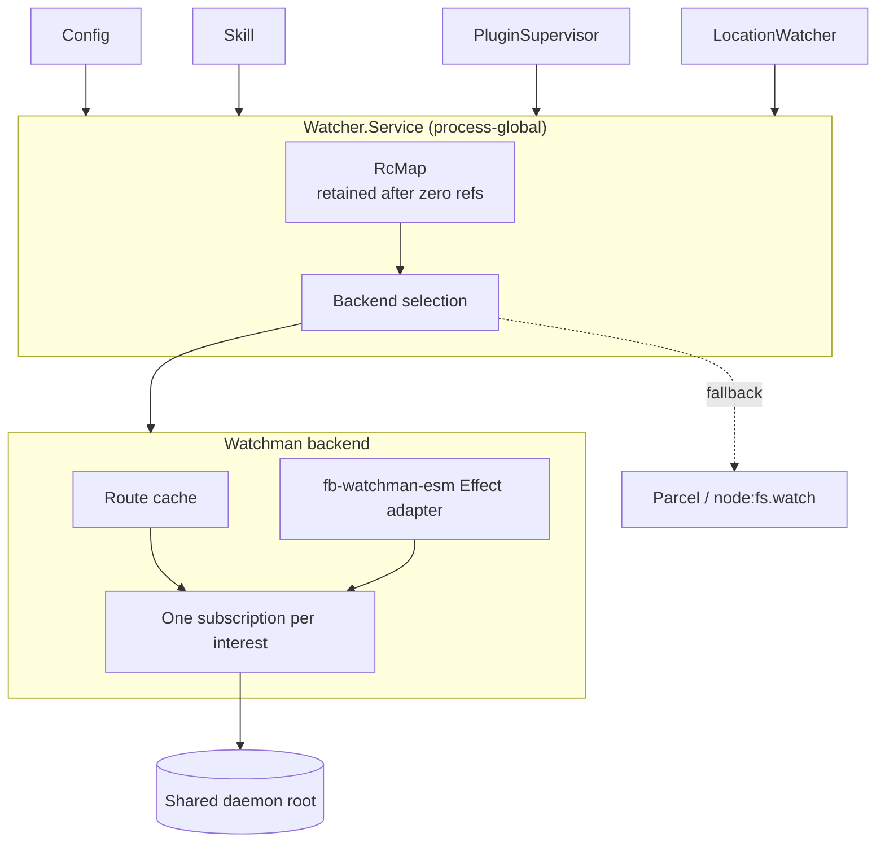
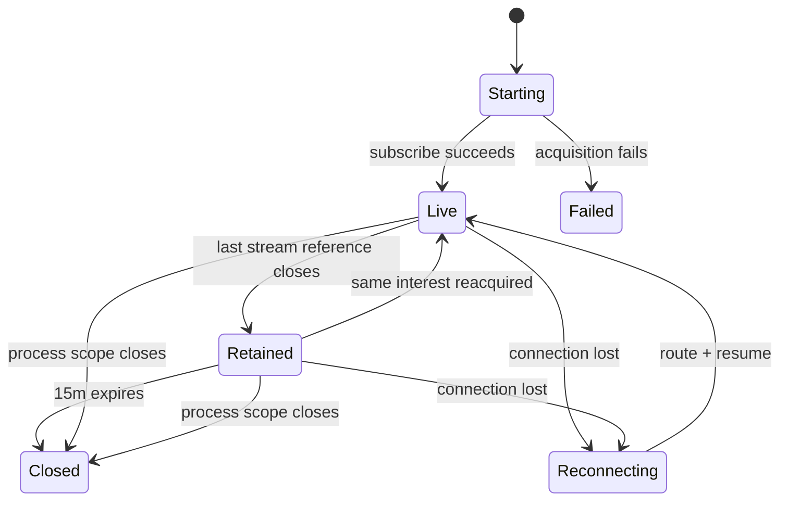

# Simple OpenCode V2 Watchman registry

## Summary

OpenCode V2 should not roll multiple logical interests into combined Watchman subscriptions.

The simpler architecture is:

```text
one Watcher.subscribe interest
  -> one routed Watchman subscription
  -> one shared Watchman daemon root
```

Watchman, not OpenCode, owns the expensive consolidation:

- `watch-project` maps nested project paths onto one project root;
- `relative_root` scopes each subscription to its requested subtree;
- one daemon root owns the recursive inotify crawl;
- many independent subscriptions can reuse that root;
- Watchman settles filesystem changes before evaluating subscription expressions.

OpenCode retains only the machinery it needs:

- the existing process-global `Watcher.Service` and `RcMap`;
- a process-global Watchman connection;
- route resolution and memoization;
- one physical subscription per canonical interest;
- grace retention, reconnect cursors, local correctness filtering, and fallback.

This removes WatchSets, subscription union expressions, containment reduction, cross-subscription fan-in, handoff deduplication, and the proposed LocationWatchRegistry layer. Consumers keep their existing scoped streams and naturally release them with their existing Location service graphs.

## Scope

This design targets OpenCode V2 only. Changes belong in `packages/core`, `packages/server`, `packages/schema`, and `packages/cli`. `packages/opencode` is not changed.

### Goals

1. Replace recursive Parcel/inotify watches with Watchman when explicitly enabled.
2. Share project crawls across OpenCode interests, processes, and other Watchman clients.
3. Stop Skill invalidation from repeatedly destroying/recreating native subscriptions.
4. Keep the existing consumer API and lifecycle wherever possible.
5. Recover without silent staleness.
6. Keep Watchman optional and diagnosable.
7. Avoid aggregation machinery until measurements demonstrate a need.

### Non-goals

- Minimizing Watchman subscription count at the cost of application complexity.
- Creating one combined subscription per project/root/domain.
- Adding a new Location-scoped watch registry.
- Rewriting Skill discovery around WatchSets.
- Replacing exact file watches initially.
- Implementing dynamic TUI-presence grace in the first cut.

## Key observation: roots are expensive, subscriptions are cheap

There are two different resources:

### Daemon root

A Watchman root recursively crawls and tracks a filesystem tree using inotify or the platform backend. Overlapping roots duplicate expensive kernel and crawl work.

`watch-project` exists specifically to consolidate this resource. A nested request returns the shared project root and a `relative_path`:

```text
watch-project(/repo/.opencode/skills)
  -> root: /repo
  -> relative_path: .opencode/skills
```

An editor, OpenCode Config, and multiple OpenCode Skill interests can all reuse `/repo` without adding recursive crawls.

### Subscription

A subscription is a query/filter attached to an existing root and connection. Watchman evaluates its expression after filesystem settling and sends matching results.

Subscriptions consume daemon CPU, so they are not mathematically free. But they do not create duplicate recursive kernel watches. At the observed OpenCode scale, dozens of narrow subscriptions are preferable to application-owned grouping, union-expression rebuilding, cursor handoff, event fan-in, and deduplication.

Policy:

> Optimize daemon roots now. Optimize subscription count only after measuring it as a bottleneck.

## Complexity removed

| Removed concept | Why it is unnecessary |
| --- | --- |
| `WatchSet` public/domain model | Watchman can independently subscribe each existing interest under the same root. |
| Group interests by root | Root sharing happens regardless of subscription count. |
| Target containment reduction | Parent and child subscriptions are cheap filters; preserving exact intent is simpler. |
| Combined `anyof` expressions | No dynamic union rebuild or expression ownership required. |
| Cross-subscription event fan-in | Each existing consumer already receives its own stream. |
| Handoff event deduplication | Subscriptions are stable and independently cursor-tracked. |
| `LocationWatchRegistry` | Existing Location scopes already own consumer streams and live for a 60-minute idle TTL. |
| Owner-specific reconciliation engine | Config, Skill, and PluginSupervisor retain their current domain-specific behavior. |
| Dynamic activity-aware grace initially | A static grace fixes measured churn without Session/EventFeed dependencies. |

## Existing architecture retained

[`Watcher.Service`](/packages/core/src/filesystem/watcher.ts) is already process-global and already behaves like a registry:

1. Canonicalize `(type, resolved target, sorted ignore)`.
2. Acquire one `Native` subscription in an Effect `RcMap`.
3. Fan updates out through PubSub.
4. Treat each running stream scope as a reference.
5. Release the native subscription after the last reference.

The design deepens this service rather than creating another registry.

Current domain lifetimes also remain:

- Config subscriptions are scoped to Config's Location graph.
- Skill subscription fibers are scoped to Skill's Location graph/FiberMap.
- Plugin source subscriptions are scoped to PluginSupervisor.
- LocationWatcher subscriptions are scoped to the Location graph.
- Location graphs already remain cached for 60 minutes after use.

Multiple Locations can subscribe to the same canonical target. The global `RcMap` shares the physical subscription while each Location runs its own stream consumer.

## Simplified architecture



There is no intermediate logical registry and no subscription aggregation layer.

## Interest model

Keep `WatchInput` small. Add only routing intent for directory interests:

```ts
type WatchInput =
  | {
      readonly type: "file"
      readonly path: string
    }
  | {
      readonly type: "directory"
      readonly path: string
      readonly routing: "project" | "exact"
      readonly ignore?: readonly string[]
    }
```

Include patterns are unnecessary for the first implementation. Existing consumers ask for all relevant subtree changes and invalidate their caches conservatively.

`routing` is explicit because the producer knows whether broad project consolidation is desired.

| Producer | Routing |
| --- | --- |
| project Config / `.opencode` / project Skill paths | `project` |
| global XDG config / global Skill paths | `exact` |
| configured external Skill repository | `project` only when discovery identifies a safe repository root; otherwise exact |
| exact files / missing sentinels / VCS metadata | existing file path |

Owner, Location, and consumer identity do not belong in the physical key. Optional diagnostic metadata may be logged at subscription call sites without preventing deduplication.

## Route management

### Project interests

For `routing: "project"`:

```text
["watch-project", absoluteTarget]
```

Watchman atomically reuses a covering root or establishes the appropriate `.watchmanconfig`/VCS root. The result becomes:

```ts
type Route = {
  readonly root: string
  readonly relativeRoot: string
}
```

The subscription command uses the returned root and `relative_root`.

Example:

```text
Skill interest: /repo/.opencode/skills
Config interest: /repo/.opencode

daemon root: /repo
subscriptions:
  opencode-a relative_root=.opencode/skills
  opencode-b relative_root=.opencode
```

Two subscriptions, one recursive crawl.

### Exact/global interests

Global paths must not accidentally make `$HOME` a new project root because a dotfiles repository or `.watchmanconfig` exists above them. For `routing: "exact"`, send `["watch", absoluteTarget]` and use the target itself as the root.

Do not query `watch-list` or adopt a broad existing root in the first implementation. The few global roots are expected to be small, and bounded/predictable behavior is more valuable than another routing policy and cache. Existing-root adoption remains a possible measured optimization.

### Route cache

Memoize route resolution by:

```text
(connection generation, routing intent, canonical target)
```

Concurrent requests share one `Deferred<Route>`. On reconnect, route again because daemon/root state may have changed.

The route cache is the only rollup-like structure OpenCode needs: it coalesces duplicate route work, not subscriptions.

## One interest, one subscription

Every canonical directory `WatchInput` becomes one Watchman subscription:

```text
InterestKey
  -> Route(root, relativeRoot)
  -> generated subscription name
  -> subscribe(root, name, {relative_root, expression, fields, since})
  -> EventHub
```

Identical InterestKeys still share through the existing `RcMap`. Distinct interests remain distinct even if they share a root or overlap.

### Benefits

- no grouped-subscription lifecycle;
- no union expression updates;
- no need to map one event back to multiple logical targets;
- no duplicate suppression across handoffs;
- one cursor per exact interest;
- one subscription can reconnect/fail independently;
- consumer semantics stay obvious;
- Skill can remain unchanged initially.

### Cost

Watchman evaluates each subscription expression after root settling. Large numbers of subscriptions can increase daemon CPU and response work.

Measure:

- subscriptions per root;
- expression evaluation/event latency;
- daemon CPU;
- received versus delivered events;
- root settle duration if available;
- OpenCode reconnect time.

Aggregation becomes a future optimization only if these metrics identify a concrete threshold or pathological root.

## Skill behavior without rollup

Skill can keep its current subscription model initially:

- one recursive interest per source root;
- exact sentinels for missing/symlink paths;
- recursive interests for external SKILL.md parents;
- clear/rebuild on invalidation.

The behavior becomes much cheaper because:

1. all project-related interests route to the same daemon project root;
2. each target is only a relative subscription/filter;
3. route resolution is memoized;
4. physical subscriptions remain alive through grace when Skill clears its stream fibers;
5. recreating the same InterestKey reacquires the retained RcMap entry.

No Skill-specific watch grouping is needed. Adding `.git`/`node_modules` ignores remains a useful independent traffic reduction, not an architectural requirement.

## Subscription retention

The current `RcMap` releases immediately when its final stream reference closes. Add:

```ts
RcMap.make({
  lookup,
  idleTimeToLive: "15 minutes",
})
```

This retains the actual subscription, cursor, PubSub, and local filter during grace.



Effect closes all RcMap entries immediately when its owning process scope closes; the TTL does not delay shutdown.

### Activity-aware grace

Defer dynamic short/long/pinned grace from the initial architecture.

A static 15-minute TTL directly solves the measured Skill churn and keeps the design independent of Session/EventFeed. Once `opencode-session-active` provides stronger signals, activity-aware retention can be added inside `Watcher.Service` if measurements show value.

Possible later policy:

- no active Session and subscriber count zero: short;
- active Session: long/pinned;
- attached clients: very long;
- relevant TUI session presence: pinned.

Do not introduce a Location registry solely to support this future heuristic.

## Expressions and local filtering

Each subscription gets an expression derived only from that interest's ignores. It does not need a combined include/target expression because `relative_root` already scopes the interest.

Use Watchman expressions to reduce traffic and a local matcher for correctness:

- expand braces explicitly;
- handle dotfiles deliberately;
- combine directory-name and descendant matches where needed;
- retain untranslatable ignores in the local matcher;
- preserve directory creation events.

Current event vocabulary remains:

| Watchman result | `Watcher.Update` |
| --- | --- |
| `new && exists` | `create` |
| `exists && type != "d"` | `update` |
| `!new && !exists` | `delete` |
| otherwise | ignore |

## Watchman transport

Use the user's ESM fork:

```text
@superbfowle/fb-watchman-esm 3.0.0
@superbfowle/bser-esm 3.0.0
```

The fork retains the official client's command FIFO, BSER framing, discovery, and unilateral event handling while removing CommonJS and `node-int64`.

Wrap it behind a narrow Effect adapter:

- callback commands become timed/interruptible Effects;
- subscription/log events become typed Effect streams;
- responses are Schema-decoded;
- connection generations are explicit;
- listeners and client close in finalizers;
- registry owns reconnect/subscription restoration.

Until published, pin the fork by git/file dependency for dogfood.

## Reconnect and correctness

Store the latest clock per subscription.

On connection loss:

1. create a new connection generation;
2. rerun that interest's route;
3. compare root/relative root;
4. resubscribe with the previous clock when compatible;
5. process `is_fresh_instance`, cancellation, warning, and cursor rejection explicitly.

| Recovery result | Action |
| --- | --- |
| compatible route + cursor | resume |
| fresh instance | conservative invalidation for this interest |
| route changed | conservative invalidation, continue on new route |
| cursor rejected | establish current cursor, invalidate |
| canceled subscription | reroute/reconnect; invalidate if continuity uncertain |
| recovery exhausted | fail the stream visibly |

Never silently switch a live Watchman stream to Parcel without a conservative handoff.

## Root ownership

Normal lifecycle never sends `watch-del`.

Daemon roots are shared across clients and processes. OpenCode cannot prove exclusive ownership. Grace expiry sends `unsubscribe`; socket close implicitly removes connection subscriptions; Watchman's idle reaper eventually removes inactive roots.

## Fallback

- Watchman unavailable before acquisition: use existing Parcel directory backend.
- Watchman unsupported for exact file class: keep `node:fs.watch`.
- Watchman fails after live acquisition: reconnect or fail visibly; no silent backend change.
- Parcel fallback receives the same 15-minute RcMap retention, so Skill churn improves even without Watchman.

## Module layout

```text
packages/core/src/filesystem/
  watcher.ts                    existing registry/facade + RcMap retention
  watchman/
    client.ts                   Effect adapter over fb-watchman-esm
    schema.ts                   response/PDU schemas
    route.ts                    project/exact routing + Deferred cache
    native.ts                   NativeInterface implementation + reconnect
```

Keep Parcel/file fallback in the existing watcher module initially. Extract only when that code independently becomes hard to navigate.

## Configuration

Backend selection must be available before project Config loads:

```text
OPENCODE_WATCHER_BACKEND=watchman
```

Modes:

- `default`: current backend;
- `watchman`: prefer Watchman, initial acquisition fallback allowed;
- `parcel`: force current directory backend for diagnosis.

Rollout remains opt-in until recovery and performance gates pass.

## Diagnostics

Minimum structured state/logging:

- backend and health state;
- requested target and routing intent;
- resolved root and relative root;
- subscription name/state;
- RcMap reference count/grace expiry;
- subscriptions per root;
- route cache hit/miss;
- connection generation;
- resumed/fresh/canceled/invalidated counts;
- fallback/recovery reason;
- events received, locally filtered, delivered;
- route/subscription latency.

The key evaluation ratio becomes:

```text
many subscriptions : few daemon roots
```

That is success, not a problem, unless daemon CPU metrics prove otherwise.

## Testing

### Existing registry

- identical interests share one native subscription;
- final release enters 15-minute retention;
- reacquisition uses the same subscription;
- expiry unsubscribes;
- process scope shutdown closes immediately;
- Parcel fallback receives the same retention.

### Routing

- project targets share one daemon root but get distinct relative subscriptions;
- global targets always remain exact and bounded;
- concurrent route requests share one Deferred;
- connection generation invalidates route cache;
- no normal path sends `watch-del`.

### Skill

- current external Skill parents create distinct subscriptions on one root;
- Skill clear/reload does not physically unsubscribe unchanged interests;
- no grouped expression/fan-in is created;
- ignored paths do not invalidate Skill.

### Recovery

- each subscription resumes its own cursor;
- fresh/route change invalidates only the affected interest;
- cancellation and warning are visible;
- recovery exhaustion fails visibly.

### Performance

- subscription count scales without root count growth;
- daemon CPU and settle latency measured at representative subscription counts;
- compare independent subscriptions against an experimental grouped subscription only if needed;
- default cannot flip if subscription evaluation cost becomes material.

## Implementation plan

1. **Retention:** add 15-minute TTL and TestClock coverage to current `Watcher`.
2. **Transport:** publish/pin `watchman-esm`; add Effect adapter and typed schemas.
3. **Routing:** implement project/exact route cache and one-subscription-per-interest backend.
4. **Recovery:** cursor, reconnect, fresh/canceled invalidation.
5. **Consumer hints:** add explicit routing to Config and Skill directory subscriptions.
6. **Diagnostics:** subscriptions-per-root, grace reuse, latency, filtering, recovery.
7. **Dogfood:** opt-in; compare churn, roots, subscriptions, daemon CPU, settle/event latency.
8. **Default:** only after acceptance gates.

No Location registry or Skill WatchSet migration is required.

## Acceptance gates

1. Skill clear/reload reuses retained subscriptions.
2. Project-local subscriptions share project roots.
3. Global paths do not create unexpectedly broad roots.
4. Root count stays low as subscription count grows.
5. Representative independent subscription counts do not materially harm daemon CPU/latency.
6. Reconnect/fresh/cancellation cannot silently stale Config or Skill.
7. Initial fallback matches current behavior.
8. No routine `watch-del`.
9. Process shutdown closes resources immediately.
10. Watchman remains optional and startup probe is bounded.

## When to reconsider subscription rollup

Rollup is justified only with evidence such as:

- a root has hundreds/thousands of OpenCode subscriptions;
- Watchman expression evaluation materially affects daemon CPU;
- settle-to-delivery latency grows with subscription count;
- duplicate event payloads dominate OpenCode processing;
- reconnect restoration time becomes unacceptable.

If that happens, optimize one measured domain/root at a time behind the same `Watcher.Service` API. Do not introduce WatchSets preemptively.

## Historical integration and changes

This draft simplifies [`draft0.gpt56t.md`](/.design/watch/draft0.gpt56t.md) after recognizing that Watchman already provides the expensive rollup at the daemon-root layer.

Retained from draft0:

- project vs exact routing;
- `watch-project`/`relative_root` root sharing;
- ESM Watchman fork and Effect adapter;
- route Deferreds;
- retained physical subscriptions;
- local correctness filters;
- cursor recovery and conservative invalidation;
- no routine `watch-del`;
- fallback, diagnostics, and opt-in rollout.

Removed from draft0:

- `WatchSet`;
- `LocationWatchRegistry`;
- target containment reduction;
- grouped root expressions;
- subscription fan-in and handoff deduplication;
- Skill-specific rollup migration;
- activity-aware retention in the first architecture.

The key source supporting this simplification is Watchman's subscription model: subscriptions are independent queries evaluated after the shared root settles. The root, not the subscription, owns recursive filesystem tracking. Performance remains an explicit acceptance gate rather than an assumed guarantee.
