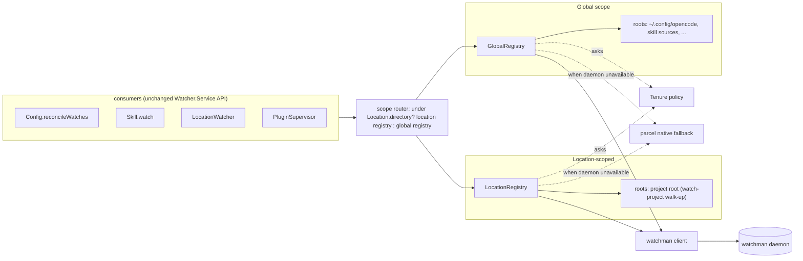
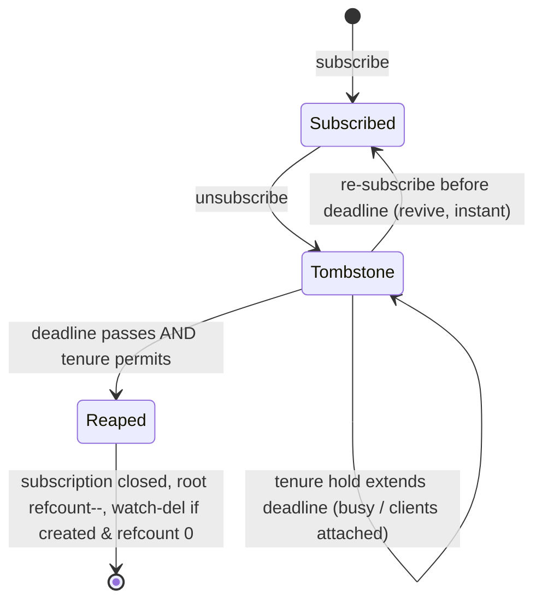

# Watch registry (init0)

## What's up

Round one ([`watchman/draft0`](/watchman/draft0.ds4p.md)) assessed the current watcher: the `Watcher.Native` seam exists, opencode forces parcel/inotify, and the churn is real (83 subscribes/61 stops in one server log; skill invalidation tears down and re-crawls every skill tree; overlapping recursive watches with `ignores=0`; four concurrent servers duplicating everything). The user then directed the next shape of this work:

1. **The registry is a first-class thing.** "Smart routing system, so skills can use the walk-up project root for example for project local skills, without needing their own watches, but having their own sub-watch." Model that idea explicitly.
2. **Use watchman's walk-up.** "I'm surprised there isn't a watch-project walk-up we can already use? we should avoid duplicate work." There is — watchman has it; parcel's backend just never calls it. The registry makes it the normal path.
3. **Root resolution is an awaitable promise**, attached to the project entities that exist (Location).
4. **Global and project contexts have their own registry** of watches "in effect."
5. **Unsubscribe is grace-delayed**, ~15 minutes, before real teardown — unless we know better (see tenure).
6. **Tenure gates the grace**: for now session-active (`busy`, not idle) is the indicator; over time we complexify with client heuristics — short grace if no clients attached, very long grace if clients attached ("clients implies more work likely"). Subscriber count = 0 is accepted as a very good signal; its availability is TBD (it exists but is private today).
7. **Close-intent does not exist** (documented in [`~/a/doc/opencode/sessions.md`](/opencode/sessions.md)): sessions are server-owned; a TUI closing a session sends nothing. Tenure must rely on execution activity and client attachment, not user intent.
8. Watchman remains **opt-in** during rollout.

This wave proposes the registry itself: vocabulary, scoping, resolution, subscription mapping, grace, tenure, teardown, fallback, and consumer migrations.

## What we verified empirically today

Live test: `fb-watchman` 2.0.2 under Bun 1.3.14 against the local watchman 20260708.093114.0 (script at `~/tmp-opencode/fbwatchman-test/test.ts`):

- **Bun compatibility: yes.** fb-watchman connects, speaks BSER over the unix socket, delivers unilateral subscription PDUs. Its `capabilityCheck()` is broken against modern watchman (the server rejects `since`/`term_dirname`/`term_match` as capability names on the version command) — so: never call capabilityCheck; rely on command errors and fall back on failure.
- **watch-project walk-up confirmed**: on `/tmp/wm-proj-*/sub/skills/atproto-lexicon` (with a `.git` at the project root) it returned `{watch: "/tmp/wm-proj-*", relative_path: "sub/skills/atproto-lexicon"}`. Exactly the walk-up sharing we want.
- **Subscribe with `relative_root` + expression + `since` works.** PDU shape: `{subscription, is_fresh_instance, clock, files: [{name, exists, new}]}`. Expression filtering verified: `["not", ["dirname", "node_modules"]]` suppressed the file inside `node_modules`; `["not", ["match", "**/SKILL.md", "wholename"]]` suppressed SKILL.md edits. Note `dirname` does not match the leaf entry itself (the `node_modules` directory entry still appeared).
- **The daemon already watches ~450 roots** on this machine, including `~/src/opencode-watchman`, `~/src/opencode`, and the archive. Editors and other tools are already sharing watchman here. Adopting existing roots is not theoretical: it is the common case.
- **Roots leak.** A crashed earlier test run left `/tmp/wm-proj-DCT6sJ` in watch-list forever; `unsubscribe` does not remove roots; `idle_reap_age` is unset in this daemon's config. Any client that creates roots and never deletes them leaks daemon-side crawls (parcel's watchman backend does exactly this). Our registry must be disciplined: refcounted `watch-del` for roots it created.

## Vocabulary

- **Root** — one watchman watch (or, in fallback mode, one parcel directory subscription). A root is a *crawled tree in the daemon*, shared by every interested subscriber.
- **Sub-watch** — a scoped interest inside a root: `{root, relativePath, expression, ignoreFallback}`. In watchman terms this is a subscription with `relative_root`; it costs no kernel watches and no crawl.
- **Registry** — the owner of roots and sub-watches for one context. Two kinds: **location registry** (per `Location`, the project entity) and **global registry** (everything outside any location: `~/.config/opencode`, `~/.claude/skills`, …). Each registry tracks what it has "in effect."
- **Tombstone** — a sub-watch (or root) after unsubscribe but before real teardown: `{deadline, key, meta}`. Tombstones can be revived instantly (that is the point), and are reaped when the grace period ends, subject to tenure.
- **Tenure** — the policy that decides when grace runs and how long it is. A swappable Effect service; default implementation is session-activity-based today, client-count-aware later.

## Architecture



Consumers keep calling `Watcher.Service.subscribe(WatchInput)` exactly as today — no consumer migration is required for the routing itself. The registry lives beneath the seam. `LocationWatcher`/`Config`/`Skill` already run in Location scope; the scope router is a containment check (`FSUtil.contains(location.directory, path)`).

## Root resolution: the promise

The user asked for "a promise that is easy to await, that we can maybe add, into whatever project entities exist." Concretely:

```ts
export class RootRegistry extends Context.Service<RootRegistry, {
  readonly rootFor: (path: string) => Effect.Effect<Root>
}>() {}
```

- **Single-flight.** Each registry holds `Map<normalizedTarget, Deferred<Root>>`. The first `rootFor(target)` starts resolution; concurrent callers await the same `Deferred`. There is exactly one `watch-project` per target per registry, ever.
- **Cached on the Location entity.** The location registry lives in the same `makeLocationNode` pattern as `LocationWatcher` — one per Location scope, disposed with the location. The global registry is a process-global node. Roots resolved by the location registry are naturally keyed to the project; nothing extra to attach.
- **Resolution algorithm** for a directory `target`:
  1. Normalize; consult a cached `watch-list` (TTL ~5s, shared across registries).
  2. If an existing root is an ancestor of `target` → **adopt**: `Root {root, relativeRoot: relative(root, target), adopted: true}`. Zero new daemon work — and on this machine, the common case (450 roots already).
  3. Else `watch-project target` → `{watch, relative_path}`. The root is the VCS/project root (walk-up); `relativeRoot` = join of `relative_path` and anything below it. No `.git`/`.hg`/`.watchmanconfig` marker means watchman falls back to the directory itself as root — global config and skill dirs naturally become their own roots.
  4. Rejection (daemon down, invalid) → typed failure; the registry routes the subscription to the parcel fallback and marks the backend dead with backoff.
- **Adopted roots are never deleted by us.** Roots we created are tracked (`created: true`) and refcounted for `watch-del` (see teardown).
- Walk-up cost note: `watch-project` on `.opencode/` inside a project resolves to the *project root*, so the daemon crawls the whole project (minus `.git`, which watchman ignores by default; heavier trees should get `.watchmanconfig` `ignore_dirs` — documented, not enforced). This is deliberate: it is the same root editors use, one shared crawl replaces N recursive parcel crawls, and every future sub-watch in the project is free.

## Sub-watches

```ts
type SubWatch = {
  readonly root: string
  readonly relativeRoot: string | undefined
  readonly expression: readonly unknown[] | undefined
  readonly fallbackIgnore: readonly string[]
}
```

- `subscribe(WatchInput)` → `rootFor(path)` → build `SubWatch` → dedupe via `RcMap` keyed by `(root, relativeRoot, expressionHash)` → one watchman `subscribe` with:
  - `since: clock` from `["clock", root]` — future-only delivery, no initial flood.
  - `fields: ["name", "exists", "new"]`.
  - `expression` translated from `ignore` entries: plain names (`node_modules`, `.git`) and brace globs (`**/{node_modules,.git}/**`) become `["not", ["anyof", ["dirname", "node_modules"], ["dirname", ".git"], ...]]`; pattern ignores like `**/SKILL.md` become `["not", ["match", pattern, "wholename"]]`; anything untranslatable stays client-side (drop at event time, like parcel's wrapper does).
  - `relative_root` when the sub-watch is scoped inside the root.
- **Event mapping** to the existing `Update` vocabulary (parcel-shaped): `new && exists → {type:"created"}`, `!new && exists → {type:"updated"}`, `!exists → {type:"deleted"}`; names joined with `relativeRoot` back to absolute paths. Directory entries are dropped (consumers act on files). `is_fresh_instance: true` PDUs are skipped — since `since` is taken at subscribe time, only deltas after that clock matter; a fresh instance means the daemon recrawled and we would otherwise flood with noise.
- File watches (`type: "file"`) stay on `node:fs.watch` for now — one inotify watch each, few in number, unchanged from today. (Registry support for file sub-watches via `["name", path, "wholename"]` expressions is a later optimization.)

The skill case the user cared about falls out of this naturally: `Skill.watchDirectory(~/.claude/skills)` resolves under the global registry to root `~/.claude/skills`; `Skill.watchDirectory(<project>/.opencode/skills)` resolves under the location registry to the *project root* with `relativeRoot: .opencode/skills` — a sub-watch, no new crawl, shared with editors.

## Grace and tenure

"Unsubscribe is not teardown; it is a tombstone."



- Each registry keeps tombstones keyed by the same dedupe key. Re-subscribe before the deadline revives the tombstone without touching the daemon — this is what makes skill-invalidation churn cheap: skill invalidates → clears watches → tombstones everything → next load re-subscribes → instant revival, no re-crawl, no watch churn.
- A **sweeper** runs on interval and at deadlines. For each expired tombstone it asks the tenure policy: if held, extend; if released, close the watchman subscription, decrement the root refcount, and if the root was created by us and the refcount is zero → `["watch-del", root]`. Adopted roots are never del'd; multiple processes may share them. Roots only reach the daemon when needed and leave it when we created them and nothing uses them — the discipline the daemon needs (see leaks above).
- **Tenure policy** (swappable `WatchTenure` service):
  - `hold(sub-watch): Effect<boolean>` — default: false.
  - `grace(sub-watch): Effect<Duration>` — default: **short (≈2m) when the scope is quiet; long (≈15m) when anything is active**.
  - Today's default implementation uses only session activity: the location registry asks "is any session in this location busy (session.active / session.status ≠ idle)?"; the global registry asks the same across locations. Active → hold or long grace; quiet → short grace.
  - Future (the `~/src/opencode-session-active` branch): add the client signal — EventFeed subscriber count. Zero clients → short grace; clients attached → very long grace (they imply more work coming). Subscriber count = 0 is agreed to be a very good signal; today it is private to `event-feed.ts` (`subscribers.size`, a ~5-line accessor away). The tenure service is the seam where those heuristics land without touching the registry.
  - Never tear down while `hold` is true, regardless of deadline.

## Fallback and opt-in

- Backend selection is per-process: probe watchman once (socket reachable via `get-sockname` + `version` handshake). Unreachable → every registry subscription routes to the parcel native (per-directory, today's exact behavior) while still passing through tombstones and tenure — the grace machinery is backend-agnostic and works on parcel too (teardown there also stops a crawl).
- Watchman is opt-in initially: `OPENCODE_WATCHER_BACKEND=watchman` or `watcher.backend: "watchman"` in config (`ConfigWatcher.Info` gains a `backend` field). Default remains today's behavior until dogfooded. The existing `watcher started` log line carries `backend`, so the rollout is observable.
- If watchman dies mid-session: client reconnects with backoff; roots re-resolve (watch-list first); re-subscribe with the last known cursor per sub-watch — if the watch survived, `since` resumes without loss; if it was dropped, the fresh PDU is skipped and consumers re-scan on next activity. Acceptable, logged, never fatal.

## Consumer migrations

None required for routing. Two improvements from the registry become cheap and are separately scoped:

1. **Collapse per-SKILL.md watches** (`skill.ts`): instead of one recursive watch per SKILL.md parent dir, the skill loader sub-watches the skill source root(s) with a `match` expression on `**/SKILL.md` — one sub-watch per source, N files covered. Fewer tombstones, fewer expressions, no behavioral change.
2. **Skill ignores**: skill directory watches gain the standard `node_modules`/`.git` ignores (they are `ignores=0` today), whether on the watchman or fallback path.

## Failure modes

| Failure | Behavior |
| --- | --- |
| watchman absent at boot | probe fails, parcel fallback, one log line |
| daemon dies mid-run | reconnect + re-subscribe with saved cursors; fresh skipped |
| watch-project rejects (bad dir, perms) | typed error → subscription falls back to parcel for that path |
| subscribe timeout | existing `SUBSCRIBE_TIMEOUT_MS` acquire/release semantics apply |
| root we created gets `watch-del`ed by someone else | next PDU is fresh; we skip and keep the subscription |
| grace deadline while busy | tenure holds; sweeper re-checks on next tick |

## Testing

- Unit: expression translation, PDU→Update mapping, tombstone revival, refcount/watch-del discipline, tenure policy selection — against an in-process fake watchman socket (net server serving canned PDUs), like the existing `Watcher.testLayer` pattern.
- Integration gated on `hasWatchman()` (same style as `describeNative` in `command.test.ts`): subscribe on a temp project → touch inside/outside ignore → assert mapped events → unsubscribe → assert watch-del only for created roots and adoption reuse across two registries.
- Existing `watcher.test.ts` lifecycle tests parametrize `NativeInterface`; the registry slots in under the same seam.

## Rollout

1. `watchman-client` + registry + tenure + opt-in env, dogfooded here (watchman 2026.07 present, daemon already warm with 450 roots).
2. Add `watchman` to the nix dev shells.
3. Expose `EventFeed` subscriber count (5 lines) so tenure can use it.
4. `~/src/opencode-session-active` later: richer tenure (per-location client attachment, short/long/very-long grace tiers).
5. Flip default to prefer-watchman-after weeks of clean logs.

## Open questions

1. Should adopted roots ever count toward a "we could del this" pool if we were the last subscriber? (Leaning: never — editors own them.)
2. Global-registry grace: is "quiet across all locations" the right trigger, or per-source? (Leaning: all-locations for now.)
3. Default long-grace constant: 15m agreed as the starting value; configurable later?
4. Should the sweeper tick be wall-clock or tied to registry activity? (Leaning: on-deadline timer + revive-driven recheck.)

## References

- [`watchman/draft0.ds4p.md`](/watchman/draft0.ds4p.md) — assessment, parcel-vs-own-client comparison, verified `WatchmanBackend.cc` findings
- [`~/a/doc/opencode/sessions.md`](/opencode/sessions.md) — why close-intent doesn't exist and what tenure can use instead
- [`packages/core/src/filesystem/watcher.ts`](/packages/core/src/filesystem/watcher.ts) — the seam this sits under
- [`packages/core/src/skill.ts`](/packages/core/src/skill.ts) — the churn loop tombstones defuse
- `~/tmp-opencode/fbwatchman-test/test.ts` — live protocol verification harness
