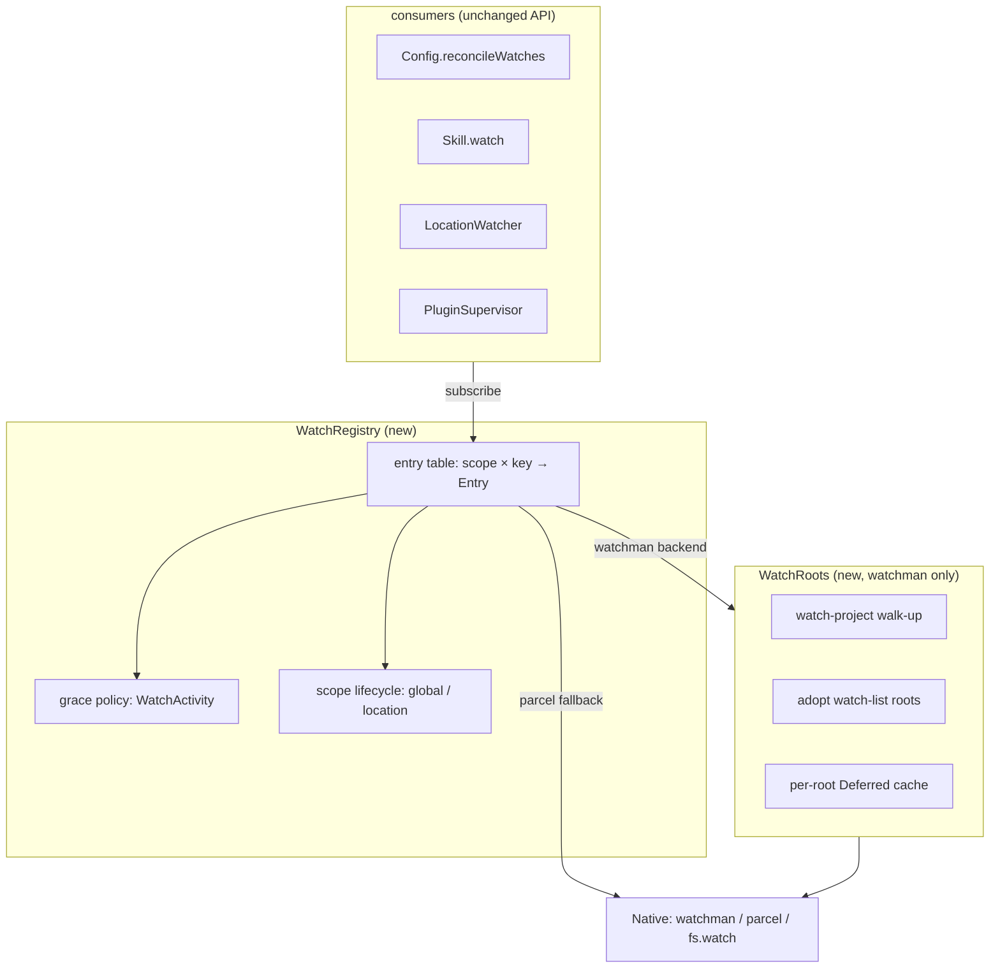

# Watch registry (init0)

## What's up

The watchman draft ([`/design/watchman/draft0.glm52.md`](/design/watchman/draft0.glm52.md)) established: the churn is resubscribe-and-recrawl cycles plus per-process duplication, and the seam is `Watcher.Native`. In review, three threads emerged that need a home:

1. **Grace, not immediacy.** "when we unsubscribe, we have a grace period before actually removing the watch. maybe even for us 15 minutes is fine!" — skill invalidation clears all watches and the next load re-crawls everything; grace turns that loop from O(tree) per change into ~free re-attach.
2. **Scoped registries.** "global and project contexts should have their own registry of watches in effect" — global config/skills live as long as the server; project watches live as long as the location.
3. **Smart routing.** "skills can use the walk-up project root for project-local skills, without needing their own watches, but having their own sub-watch… model this idea as a first-class thing" — subscriptions inside shared watchman roots, not one watch per directory.

Grace policy starts simple and gets smarter: *for now, session active (not idle) is the indicator; over time, heuristics about attached clients (short grace if no clients, very long grace if clients — more work likely).* Subscriber-count-zero is accepted as a very good signal, but its availability today is uncertain (see [`/opencode/sessions.md`](/opencode/sessions.md)).

## Why a registry (measured problems)

From the assessment log (one server, 2026-08-18): 83 `watcher subscribe`, 62 `watcher started`, 61 `watcher stopped`. Root causes:

| Problem | Today | With registry |
| --- | --- | --- |
| Resubscribe churn | skill invalidation → `FiberMap.clear` → every watch closed → next load re-crawls every tree (`skill.ts:104`) | unsubscribes start a grace clock; resubscribes within grace re-attach to a live watch |
| No sharing | each target = its own parcel watch (`["watch", dir]`); overlapping dirs = duplicate kernel watches | watchman roots shared via `watch-project` walk-up + adopted `watch-list` roots; subs are `relative_root` + expression |
| No lifecycle | RcMap refcount is the only lifetime; global and project watches indistinguishable | `scope: "global" \| "location"`; location teardown kills its registry immediately |
| No activity awareness | watches live/die purely on refcount | `WatchActivity` feeds the grace policy (busy sessions, attached clients) |

## Design

### Layers



- `Watcher.Service.subscribe` keeps its contract (Stream of parcel-shaped `Update`s); the registry becomes the body of that layer. Consumers do not change behavior; `Config`/`Skill` additionally pass a `scope`.
- `WatchRoots` only exists on the watchman path; on the parcel fallback each entry maps to one parcel subscription on its exact directory (today's semantics, still grace-protected).
- `Native` interface unchanged; watchman native per draft0.

### Entry model

```ts
type Entry = {
  scope: "global" | "location"
  key: { type: WatchInput["type"]; target: string; ignore: readonly string[] }
  refs: number                        // live subscriber streams
  pubsub: PubSub<Update>              // fan-out (same as today's RcMap value)
  state: "live" | "releasing" | "purged"
  releaseAt?: number                  // grace deadline (releasing only)
  subscription?: Subscription         // native subscription (watchman sub / parcel sub / fs.watch)
}
```

Transitions:

```
live --last ref closes--> releasing(releaseAt = now + grace(policy))
releasing --subscribe arrives--> live (cancel deadline; native sub was never torn down)
releasing --releaseAt passes--> purged (native unsubscribe; entry dropped; watch-del if last sub on a self-created root)
any --scope teardown--> purged (immediate; grace does not apply to eviction)
```

Design decisions embedded here:

- **Re-attach reuses the native subscription.** Grace only delays the *native* teardown; the pubsub and fan-out survive the whole entry life. This is what makes the skill clear/re-crawl loop cheap: invalidate → clear → (within grace) re-watch hits a live entry.
- **Policy is sampled at release time only.** The grace window is fixed when the last ref drops; no mid-grace deadline extension in v1 (see open questions).
- **Purge is best-effort.** A purge that races a re-subscribe can simply let the re-subscribe create a fresh entry (idempotent native subscriptions make the race harmless).

### Grace policy

```ts
grace(policy) = quiet ? short : long
quiet = busySessions === 0 && attachedClients === 0
```

| Signal | Source today | Status |
| --- | --- | --- |
| busy sessions | `Session.Service.active: ReadonlySet<SessionID>` (`session.ts:267`, process-global `SessionExecution`) | **exists**, core-owned, cheap set read |
| session status events | `session.status` (`busy`/`idle`/`retry`) defined in `session-status-event.ts` | **schema only — nothing publishes it yet**; when the runner emits it, it becomes the reactive version of `active` |
| attached clients | `EventFeed.subscribers: Set<Queue>` (`server/src/event-feed.ts`) | **exists but private, and server-owned** — core cannot see it |

Defaults (configurable under the `watcher` config section, next to `ignore`):

| Situation | Grace |
| --- | --- |
| any busy session OR any attached client ("engaged — more work likely") | **15m** (long) |
| fully quiet (no busy sessions, no clients) | **60s** (short) |
| `scope: "global"` entries | long floor regardless (shared, cheap, server-lifetime-ish) |
| location scope teardown (eviction, shutdown) | **0 — immediate**, grace skipped |

### Activity plumbing (dependency direction: server → core)

Core must not import server. Two clean options:

1. **Bus events.** `EventFeed` publishes `client.attached` / `client.detached` into the core `Bus` on subscriber add/remove (a ~5-line change in `event-feed.ts`); a `WatchActivity` service in core folds a counter from the stream. Works because the server already replaces core layers in `routes.ts` (`[Watcher.node, Watcher.configured(...)]` pattern) and everything shares one Bus.
2. **Service replacement.** Core defines `WatchActivity.Interface`; the server provides `WatchActivity.configured(eventFeed)` as another replacement layer.

Recommendation: **option 1 + option 2 fallback semantics** — the Bus events are the transport (also useful to other consumers, e.g. the future session-active workspace); the core service is what the registry reads, defaulting to `attachedClients = unknown` when no provider exists. `unknown` participates conservatively: policy treats it as engaged → long grace. Until the EventFeed change lands, behavior is exactly "grace driven by session active only", which matches the agreed interim plan.

### Scope model

- `scope: "location"` — targets under `Location.Service`'s directory (project config roots, project skills, `.git/HEAD`). V2 is one location per server process, so location-scope entries die with the server naturally; explicit scope still matters for the *registry* semantics (immediate teardown on eviction) and future multi-location servers.
- `scope: "global"` — XDG config dirs, global skill sources (`~/.claude/skills`, `~/.agents/skills`, `~/.config/opencode`…). Server-lifetime entries; long grace floor.
- API: `WatchInput` gains an optional `scope`; consumers that know their source kind pass it (`Config` knows `Global` vs project; `Skill` knows its `Source`), everything else defaults to **inferred**: inside `Location.directory` → `"location"`, else `"global"`. Inference is a fallback, not the contract, because symlinks and nested projects make path-containment lie.

### Root routing (WatchRoots) — the "smart routing system"

First-class resolution of *where a watch lives*:

1. **Adopt first.** Query `watch-list` (cached, 30s TTL, invalidated on our own `watch-del`). If an existing watch root is an ancestor of the target (longest match), subscribe into it with `relative_root`. Editors' and other tools' roots get reused — **zero new kernel watches**. This is the "walk-up project root we can already use" the user suspected: it's `watch-project` on our side and root adoption on the daemon's side.
2. **Else `watch-project <target>`.** Watchman walks up to the VCS/project root (`.git`/`.hg`/`.watchmanconfig`); its `relative_path` becomes our relative_root. The daemon now owns one shared crawl for the whole project — the same one any editor would trigger.
3. **Deferred-per-root.** Root resolution is cached as a `Deferred<RootResolution>` keyed by resolved root — concurrent subscribes await one resolution ("a promise easy to await, added to the project entity"). This is the opencode-native version of the user's project-entity idea: `Location` is a singleton service, and `WatchRoots` is its watcher-facing project entity. A resolution failure (watchman down) fails that Deferred and re-probes on next subscribe.
4. **Never nest roots.** If resolution would create a watch strictly inside an existing root, adopt instead (same as 1). Watchman discourages overlapping watches; this rule makes overlap structurally impossible for us.

Subscriptions inside a root: one per distinct `(root, relative_root, expression)` — the registry key maps onto these. N registry entries can share one root; the native layer refcounts subscriptions per root and issues `watch-del` only for self-created roots when the last subscription purges. Adopted roots are never deleted (they're not ours).

Skill routing becomes: project-local skills → subscription on the project root with `relative_root = .opencode/skill` + `**/SKILL.md`-style expression; global skills → the global config root (or `~/.claude/skills` etc. as their own roots). One watchman subscription per skill *tree*, not per skill directory — this also absorbs the draft0 "collapse per-SKILL.md watches" fix.

### Backend mapping

| Backend | Entry → native | Teardown |
| --- | --- | --- |
| watchman (preferred, opt-in first) | subscription on shared root (draft0 client) | grace → unsubscribe → refcounted watch-del |
| parcel fallback | `subscribe(dir, {ignore})` on exact target | grace → unsubscribe (parcel re-crawls on re-subscribe; grace still spares the common invalidate/re-watch cycle) |
| fs.watch (files) | parent-dir watch on resolved file | same registry lifecycle; uniform bookkeeping |

### API sketch

```ts
// packages/core/src/filesystem/watch-registry.ts
export interface Interface {
  subscribe(input: WatchInput & { scope?: "global" | "location" }): Effect.Effect<Stream.Stream<Update>>
}
export class Service extends Context.Service<Service, Interface>()("@opencode/WatchRegistry") {}

// policy inputs (core-owned service; server provides richer layer)
export class WatchActivity extends Context.Service<WatchActivity, {
  busySessions(): Effect.Effect<number>
  attachedClients(): Effect.Effect<number | undefined> // undefined = unknown → conservative (engaged)
}>() { "@opencode/WatchActivity" }
```

`Watcher.Service`'s layer becomes: registry over native, `RcMap` replaced by the entry table. `Watcher.Test` grows: `emit`, `subscriptions`, plus `advanceGrace(ms)` and a controllable activity layer.

### Testing

- **Grace state machine**: Effect `TestClock` — subscribe → close stream → assert `releasing` → advance past short grace → assert native unsubscribe ran; re-subscribe mid-grace → assert no teardown and same entry.
- **Scope teardown**: location scope close while `releasing` → immediate purge, grace skipped.
- **Activity policy**: busy session present → long window; quiet + attached-clients-unknown → long (conservative); quiet + zero clients → short.
- **Root routing**: fake `watch-list` responses — adoption path (ancestor root exists), walk-up path (`watch-project` returns root+relative_path), nested-root refusal.
- **Integration**: gated on a reachable watchman daemon (`hasWatchman()`, like `command.test.ts`'s `describeNative`): subscribe → touch → event → unsubscribe → grace → `watch-del` visible in `watch-list`.

## Rollout

1. Registry + grace, parcel path only, policy = session-active only (agreed interim). Opt-in flag same as draft0's watchman flag; registry itself is always-on since it's behavior-neutral for refcount>0.
2. Watchman native lands behind the registry (draft0); root sharing realized.
3. EventFeed Bus events / `WatchActivity` provider → two-tier grace (short-quiet / long-engaged).
4. Later: `~/src/opencode-session-active` findings refine client heuristics (per-session focus, archive intent) and slot into `WatchActivity`.

## Open questions

1. **Mid-grace re-engagement**: if activity resumes while an entry is `releasing`, extend the deadline? Recommendation: no for v1 — re-subscription is the re-engagement signal; activity only affects the window at release time.
2. **Unknown-clients conservatism**: should `attachedClients = unknown` mean long grace (rec: yes) or should we add a fast opt-out (`watcher.grace.disabled`)?
3. **Global-scope floor**: is 15m right for global entries, or should they be purge-immune until server exit? (Rec: purge-immune is simpler and honest — global config/skills are watched once per server and tiny; make it explicit in config.)
4. **watch-list cache**: 30s TTL — staleness means a missed adoption opportunity, never a correctness issue (watch-project on an already-watched root is a cheap no-op in watchman). Confirm empirically during rollout.
5. **session.status publication**: schema exists, publisher absent — worth a small task so `WatchActivity` can be event-driven instead of polling `Session.active` on release.

## Cross-references

- [`/design/watchman/draft0.glm52.md`](/design/watchman/draft0.glm52.md) — backend choice, watchman client, event mapping, fallback policy
- [`/opencode/sessions.md`](/opencode/sessions.md) — session lifecycle, user-intent signals, why subscriber-count and session-active are the available grace inputs
- `packages/core/src/filesystem/watcher.ts` — current RcMap layer this replaces
- `packages/core/src/skill.ts:103-160` — the churn loop the grace period targets
- `packages/server/src/event-feed.ts` — where client attach/detach becomes observable
