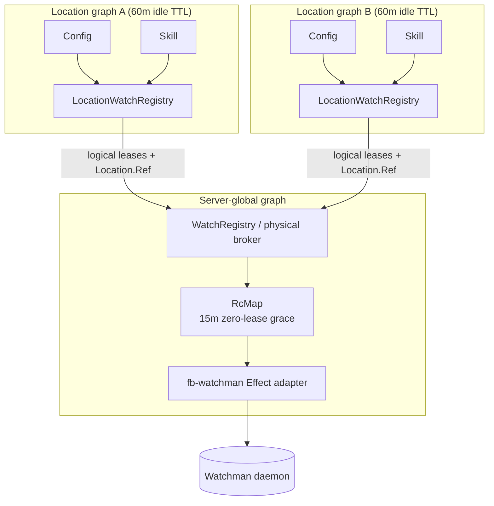

# First-class filesystem watch registry (init0)

## Stage setting

OpenCode currently treats each filesystem interest as an independent `(type, target, ignore)` subscription. A process-global Effect `RcMap` deduplicates exact matches, but directory acquisition is delegated to Parcel's Linux inotify backend. Skill discovery then creates many overlapping recursive interests and tears them all down on each invalidation. Multiple long-lived OpenCode servers independently repeat the same crawls.

The goal is larger than swapping one native backend. We need a **watch registry** that understands:

- logical ownership (Config, Skill, PluginSupervisor, LocationWatcher);
- Location and global lifetimes;
- Watchman's project-root routing and `relative_root` sub-watches;
- physical subscription sharing and reconnect cursors;
- watch sets (one domain interest can span many paths);
- warm retention after logical unsubscribe;
- evolving activity hints (`Session.active` now; attached clients and per-session TUI presence later).

This wave proposes that model. It incorporates the decisions and corrections that emerged after [`draft0`](/.design/watchman/draft0.glm52.md): use [`fb-watchman`](https://npmx.dev/package/fb-watchman), keep the transport cleanly separated, route through `watch-project`, make sub-watches first class, initially opt in, and build grace into the registry rather than Skill.

Research prompt: *design a first-class Effect watch registry whose logical interests are Location-owned but whose physical Watchman subscriptions are process-global, routed atomically through `watch-project`, retained through churn, and able to consume richer activity/presence hints later without coupling Core filesystem code to Server transports.*

## Executive proposal

1. Keep the existing global `Watcher` role, but deepen it into a **physical watch broker**.
2. Add a Location-scoped **logical watch registry** that captures ownership and composes watch sets.
3. Use `watch-project(target)` as the only root-routing operation; consume `{watch, relative_path}` directly.
4. Use `fb-watchman@2.0.2` behind a narrow Effect adapter. No callbacks, EventEmitter values, or untyped protocol objects cross that boundary.
5. Deduplicate identical physical subscriptions with `RcMap`; set `idleTimeToLive: "15 minutes"` so Skill invalidation does not re-acquire or re-crawl.
6. Unsubscribe when a retained subscription expires. **Never routinely call `watch-del`**: daemon roots are shared with unrelated tools and cannot be exclusively owned by OpenCode.
7. Keep distinct semantic sub-watches distinct by default. Collapse a domain's related paths only through an explicit `WatchSet`, starting with Skill.
8. Start opt-in. Parcel/inotify remains the fallback.
9. Let a separate retention-hint seam extend grace. `Session.active` is the initial signal; zero EventFeed subscribers is a strong future signal; per-session TUI presence can later make the hint richer.

## Evidence: what is actually expensive

### Current physical broker

[`watcher.ts`](/packages/core/src/filesystem/watcher.ts) already owns a process-global `RcMap` keyed by normalized `{type, target, ignore}`. Equivalent interests share one native subscription and a PubSub; a stream's scope supplies the reference count. The missing option is retention: Effect `RcMap.make` defaults `idleTimeToLive` to zero, so the final stream release immediately closes the physical resource.

Effect v4 explicitly supports a static or key-derived TTL:

```ts
RcMap.make({
  lookup,
  idleTimeToLive: "15 minutes",
})
```

When a reference count reaches zero, the entry remains acquired until the TTL expires. Reacquisition cancels expiry and reuses it. Closing the broker's owning scope still closes every entry immediately; shutdown never waits for the TTL.

### Existing Location retention

Location services already use a separate `LayerMap` with `idleTimeToLive: "60 minutes"` ([`location-services.ts:122-145`](/packages/core/src/location-services.ts)). A request releases its Location lease, but Config, Skill, PluginSupervisor, and their consumer fibers can remain alive for an hour.

This is not redundant with broker grace:

- Location TTL retains the **semantic graph** after HTTP use.
- Broker TTL retains a **physical native subscription** when one semantic owner deliberately releases/replaces an interest inside that graph.
- Skill currently clears its watch FiberMap on any invalidation, so physical resources hit zero references even while the Location graph remains alive.

### Local evidence

The local server log contained 83 subscribe, 62 start, and 61 stop records. Skill watched source roots and each external SKILL.md parent recursively with `ignores=0`; global and nested skill roots overlapped. Four service processes multiplied those operations. Steady-state per-process inotify counts were small; repeated recursive acquisition and duplicated roots were the stronger signal.

## Domain model

### Vocabulary

| Term | Meaning |
| --- | --- |
| **Interest** | One domain's desired file/tree changes, independent of backend. |
| **Watch set** | Related interests registered and reconciled as one domain unit. |
| **Logical lease** | A scoped consumer claim on an interest or set. |
| **Route** | `watch-project` result mapping a requested target to daemon root + relative root. |
| **Physical subscription** | One Watchman `subscribe` command and its cursor/event hub. |
| **Root** | A daemon-global Watchman crawl, shared across processes and tools. |
| **Broker grace** | Time a zero-reference physical subscription remains warm. |
| **Retention hint** | Activity/presence-derived reason to retain logical or physical resources longer. |

### Interest

The public abstraction describes filesystem semantics, not Watchman expressions:

```ts
type Interest =
  | {
      readonly type: "file"
      readonly path: string
    }
  | {
      readonly type: "tree"
      readonly path: string
      readonly include?: readonly string[]
      readonly ignore?: readonly string[]
    }

type WatchSet = {
  readonly owner: "config" | "skill" | "plugin" | "location-vcs"
  readonly interests: readonly Interest[]
}
```

`owner` is diagnostic and reconciliation metadata, not part of physical deduplication.

### Route

```ts
type Route = {
  readonly requested: string
  readonly root: string
  readonly relativeRoot: string
}
```

The registry obtains it only through:

```text
["watch-project", requested]
  -> { "watch": root, "relative_path": relativeRoot? }
```

No independent `watch-list` scan is needed. Watchman's implementation first reuses a covering root when available, otherwise finds `.watchmanconfig`/VCS root files, otherwise watches the requested directory. This operation is the daemon's atomic routing authority; reimplementing it client-side would add races and produce worse roots.

### Keys

Logical interest key:

```text
(backend identity, type, canonical target, sorted include, sorted ignore)
```

Physical subscription key:

```text
(connection backend, root, relative root, expression fingerprint, event-policy version)
```

Do not include Location, owner, callback identity, generated subscription name, cursor, or connection generation in the physical key. These are metadata/runtime state and would prevent sharing.

Backend identity matters for future hosted workspaces. Two Locations can both name `/workspace/src` while referring to different filesystems; the current path-only key would incorrectly merge them. A global node cannot depend on Location's `Environment`, so the Location registry must pass backend identity/capability with each registration.

## Two-tier Effect ownership



### LocationWatchRegistry (logical)

One instance per canonical `Location.Ref`, built inside `locationServiceNodes`.

Responsibilities:

- capture exact Location ownership (`{directory, workspaceID?}`), not Project ID;
- canonicalize domain interests and watch sets;
- remove contained/duplicate targets within one set;
- keep domain reconciliation policy (Config grows, Skill replaces, plugin sources grow);
- lease global broker subscriptions in its scope;
- route backend updates back to the correct logical consumer;
- expose diagnostics: domain owner, requested paths, route, state, grace;
- accept retention hints without depending on Session or EventFeed directly.

The API should remain stream-shaped for migration:

```ts
interface LocationWatchRegistry {
  readonly subscribe: (interest: Interest) => Effect.Effect<Stream.Stream<Update>>
  readonly subscribeSet: (set: WatchSet) => Effect.Effect<Stream.Stream<Update>>
}
```

A returned stream is still the lease: it must run in a scope. For watch sets, the Location registry owns the internal fan-in and exposes one update stream.

### WatchRegistry (global physical broker)

Evolve the existing `Watcher.Service`; do not add a parallel global registry.

Responsibilities:

- select Watchman or fallback backend;
- route requested targets through the backend;
- acquire, deduplicate, retain, and release physical subscriptions;
- maintain one process-global Watchman connection generation;
- fan out raw updates through PubSub;
- preserve cursors and restore subscriptions after reconnect;
- provide server-wide diagnostics;
- never own Config/Skill invalidation semantics.

The `RcMap` entry is a managed physical subscription:

```text
ManagedSubscription
  key
  generated subscription name
  connection generation
  last clock
  status: starting | live | reconnecting | failed
  event PubSub
  zero-reference expiry
```

## Root registry and routing

The "root registry" is internal state, not a second daemon ownership system.

### Route cache

Cache `requested target -> Route` for the active connection generation. Concurrent callers for the same target await the same in-flight `watch-project` command; this is the promise/deferred the earlier discussion was reaching for.

```text
route(target)
  canonicalize target
  lookup Deferred<Route> by target
  first caller sends watch-project
  all callers await the result
```

Routes are advisory across daemon reconnects. On a new connection generation, rerun `watch-project` for every retained subscription because roots can change when repositories, `.watchmanconfig`, mounts, or daemon config change.

### Sub-watches

If project-local Skill requests `/repo/.opencode/skills`, Watchman may return:

```text
root         = /repo
relativeRoot = .opencode/skills
```

Subscribe against `/repo` with `relative_root: ".opencode/skills"`. Watchman performs one project crawl; Skill receives names relative to only its subtree. Config and other Location services can attach their own sub-subscriptions to the same root without creating kernel crawls.

Do not merge every subtree into one giant project subscription. Separate subscriptions are cheap; a broad expression forwards unrelated monorepo traffic and makes selector updates/cursor handoff harder. Merge only when a domain explicitly registers a `WatchSet` that benefits from one expression.

## Daemon root ownership: corrections to draft0

Routine `watch-del` is wrong.

Watchman roots are daemon-global, not connection-owned. A root may be shared by OpenCode processes, editors, build systems, triggers, and unrelated subscriptions. `watch-project` does not return an exclusive ownership token. Even comparing `watch-list` before/after has a race: another client can adopt the root immediately.

Policy:

- retiring a physical subscription sends `unsubscribe`;
- connection close implicitly removes all subscriptions;
- OpenCode never sends `watch-del` during normal lifecycle;
- `watch-del` is reserved for explicit administrative tooling;
- daemon `idle_reap_age_seconds` retires roots with no subscriptions/triggers (Watchman documents a five-day default).

The local live test made this visible: unsubscribe removed the subscription but left the test root in `watch-list`; explicit `watch-del` removed the root. There were hundreds of existing roots from other tools, underscoring why ownership cannot be inferred.

## `fb-watchman` transport boundary

### Why use it

`fb-watchman@2.0.2` is the official client (Apache-2.0, one dependency: `bser`). It already implements the protocol mechanics that are easy to get subtly wrong:

- BSER framing;
- `WATCHMAN_SOCK` and `watchman --no-pretty get-sockname` discovery;
- one ordered command queue;
- unilateral `subscription`/`log` PDUs interleaved with command responses;
- capability negotiation.

A live Bun 1.3.14 test on this machine succeeded: version, `watch-project`, `clock`, `subscribe` with `relative_root`, unilateral changes, `unsubscribe`, and `watch-del` all worked.

### Why hide it

The package is callback/EventEmitter CommonJS, published in 2022, and carries no built-in Effect semantics. It has no command timeout or cancellation, does not restore subscriptions/cursors, reconnects transport only when another command arrives, writes some discovery failures to stderr, and `end()` is not an awaited shutdown barrier.

Use a narrow adapter:

```text
filesystem/watch/watchman/client.ts
  connect
  command
  subscription PDUs
  connection generation
  close
```

The adapter:

- owns one client per connection generation;
- installs `error`, `end`, `connect`, `subscription`, and `log` listeners before commands;
- wraps callbacks in interruptible, timed Effects;
- schema-decodes every response/PDU;
- converts EventEmitter events into an Effect stream;
- replaces a dead client rather than trusting implicit reconnect;
- removes listeners and ends the client in a finalizer.

The registry, not the transport, restores routes/subscriptions.

## Detailed Parcel backend readout

The earlier draft named four concerns too tersely. Source inspection of `@parcel/watcher@2.5.1` gives a more precise assessment.

### 1. Exact `watch`, not `watch-project`

`WatchmanBackend::watchmanWatch` sends `["watch", dir]`. Every Parcel directory is therefore its own daemon root. Parcel cannot consolidate nested Skill/config directories with an editor's existing project root. This is the decisive limitation.

### 2. No `relative_root`

Parcel subscribes to the exact root above and supplies only `fields`, `since`, and an optional expression. It needs no `relative_root` because each requested directory became a root, but that design prevents root sharing. "No relative_root" is a consequence, not an isolated protocol omission.

### 3. `popen` discovery

When `WATCHMAN_SOCK` is unset, Parcel calls:

```c
popen("watchman --output-encoding=bser get-sockname", "r")
```

`checkAvailable()` connects once during backend selection, and backend startup connects again, so discovery can spawn twice. This is not inherently disqualifying: `fb-watchman` also executes `get-sockname`. The difference is controllability — our adapter can timeout, log, classify, and test discovery failures in TypeScript/Effect.

### 4. No `watch-del` is correct

The prior draft called this a leak. That was wrong. Parcel sends `unsubscribe` and leaves the root. Given daemon-global sharing and idle reaping, that is the safe behavior. Its real weakness is creating too many exact roots, not declining to delete them.

### 5. Failure/reconnect behavior

Parcel's backend has one shared process connection and reader thread. Command errors become generic runtime errors. Availability check catches exceptions and silently chooses a later backend. A socket read error outside a waiting command causes the backend reader to throw and end; there is no subscription restoration or cursor-resume state machine. This makes daemon restart/cancellation behavior opaque to Core consumers even though initial fallback is reasonable.

Conclusion: Parcel's Watchman backend is a useful protocol precedent and a possible emergency escape hatch, but it cannot implement the root registry.

## Expressions and correctness

Watchman expressions are traffic reduction, not the only correctness boundary. Every logical interest also gets a local matcher.

Reasons:

- Parcel glob syntax and Watchman terms are not identical;
- `dirname` matches a named relative directory and descendants but can still report creation of that directory itself (observed in the live test);
- arbitrary nested ignores need `match`/`wholename`/`**`;
- brace patterns need explicit expansion;
- dotfiles require correct `includedotfiles` handling;
- future Watchman versions/capabilities can differ.

Subscription query shape:

```json
{
  "relative_root": ".opencode/skills",
  "since": "c:...",
  "fields": ["name", "exists", "new", "type"],
  "empty_on_fresh_instance": true,
  "expression": ["safe server-side reduction"]
}
```

Event mapping must preserve Parcel's current vocabulary and behavior:

| Watchman entry | `Watcher.Update` |
| --- | --- |
| `new && exists` | `create` |
| `exists && type != "d"` | `update` |
| `!new && !exists` | `delete` |
| otherwise | ignore |

Parcel's values are `create`, `update`, `delete` — not `created`, `updated`, `deleted`. Directory creation currently reports `create`; do not silently drop it.

## Reconnect and continuity

Every PDU's `clock` advances the managed subscription cursor.

Reconnect procedure:

1. mark the old connection generation dead;
2. create a fresh `fb-watchman` client and capability-check;
3. rerun `watch-project(requested)` for every retained subscription;
4. if root + relative root are unchanged, subscribe with last clock;
5. if route changed, continuity is unprovable;
6. handle `is_fresh_instance` and canceled subscriptions explicitly;
7. when continuity is unprovable, emit one conservative invalidation per logical target rather than a complete project snapshot.

`empty_on_fresh_instance: true` avoids flooding all existing files, but fresh must not be ignored: consumers can otherwise remain permanently stale. The registry converts it to conservative rescan/invalidate semantics.

## Grace and retention policy

### Initial invariant

Physical subscriptions use a 15-minute zero-lease broker grace. This directly fixes Skill's stop/start storm and also benefits Parcel fallback. The TTL is independent of Watchman's daemon root retention.

### Why activity cannot simply be the RcMap TTL callback

Effect evaluates `idleTimeToLive(key)` when creating an RcMap entry and stores the resulting duration. It is not a dynamic predicate reevaluated when activity changes. Encoding `Session.active` into a key would fragment physical sharing and make stale keys.

Therefore richer grace belongs in a separate retention layer, not the physical key.

### Proposed retention seam

```ts
type Retention = "short" | "long" | "pinned"

interface WatchRetentionHints {
  readonly forLocation: (location: Location.Ref) => Effect.Effect<Retention>
  readonly server: Effect.Effect<Retention>
}
```

The Location registry uses the strongest current hint when deciding when to release its broker leases. The global broker still applies the 15-minute safety grace after the final logical release.

Initial policy:

| Signal | Hint |
| --- | --- |
| relevant Session ID is in `Session.active` | pinned until execution exits, then long |
| no active Session known | short |

Future policy after `opencode-session-active`:

| Signal | Hint |
| --- | --- |
| EventFeed subscriber count = 0 and no active Session | short |
| clients attached, Session presence unknown | long |
| relevant Session open in a TUI | pinned or very long |

Subscriber zero is a strong signal and is readily exposable: `EventFeed` already has the authoritative private Set; a Server-only accessor requires no public Protocol change. Core WatchRegistry must not depend on Server EventFeed, so Server composition should feed a neutral hint service. See [`sessions.md`](/home/rektide/a/doc/opencode/sessions.md) for the future presence model.

This seam should not block init implementation. Static 15-minute broker grace is correct independently; retention hints can land afterward.

## Skill as the first WatchSet consumer

Current Skill behavior:

1. recursively watch every source root;
2. watch logical symlink/missing paths as files;
3. recursively watch every external discovered SKILL.md parent;
4. clear every watch on one relevant change;
5. reload and recreate all watches;
6. apply no `.git`/`node_modules` ignores.

Proposed reconcile:

1. Resolve all source roots and external SKILL.md parents.
2. Remove a target contained by another target in the same set.
3. Route remaining targets via `watch-project`.
4. Group targets sharing `(backend, root)` into one explicit Skill set.
5. Build an `anyof` expression over exact relative prefixes and relevant discovery files (`*.md`, `**/SKILL.md`), plus topology events needed for missing/symlink paths.
6. Apply `.git`/`node_modules` server reductions and local filters.
7. Reconcile old/new set keys rather than `FiberMap.clear`.
8. Let removed entries fall into broker grace; unchanged entries never release.

This should reduce "one recursive watch per external skill" to roughly one Watchman subscription per distinct project root, while all project-local Skill/config interests share the same daemon crawl.

## File watches

Keep exact file watches on the existing `node:fs.watch(parent)` path in init.

Reasons:

- there are few (`.git/HEAD`, `.hg/branch`, external plugin entrypoints, missing path sentinels);
- Watchman may intentionally treat VCS metadata specially;
- routing `.git/HEAD` through project root expressions needs an explicit compatibility test;
- recursive Skill/config trees are the demonstrated churn source.

The registry model still represents file interests, so migrating safe file classes later does not change consumers.

## Module layout

Use a domain-grouped layout, with the current `watcher.ts` retained as the compatibility facade:

```text
packages/core/src/filesystem/
  watcher.ts                         public re-export/compatibility facade
  watch/
    registry.ts                      global physical broker
    location-registry.ts             Location-owned logical interests/sets
    interest.ts                      schemas, canonical keys, local matching
    retention.ts                     optional activity/presence hint seam
    backend.ts                       backend-neutral interface
    watchman/
      client.ts                      Effect adapter over fb-watchman
      schema.ts                      command/PDU decoders
      backend.ts                     routes, subscriptions, cursors, reconnect
    parcel/
      backend.ts                     current node/Parcel fallback
```

All project-local TypeScript imports use explicit `.ts` extensions.

## Diagnostics

Registry diagnostics should make the replacement measurable:

- logical interest count by Location and owner;
- physical subscription count by backend/root;
- route-sharing ratio (logical interests / daemon roots);
- lease count and grace expiry;
- route and subscription acquire duration;
- reconnect generation and resumed/fresh counts;
- conservative invalidations;
- fallback reason;
- events received, server-filtered estimate if available, locally filtered, delivered;
- Skill set before/after target counts.

Existing logs (`watcher subscribe/started/stopped`) should evolve rather than disappear. A debug read API can expose snapshots later; it should read the global broker and not inject Server EventFeed into Core.

## Testing

### Unit

- interest canonicalization and structural keys;
- contained-target reduction;
- Parcel glob → safe Watchman expression + local matcher;
- event mapping including directory creates;
- route grouping into WatchSets;
- physical subscription dedup across Locations;
- 15-minute grace with TestClock: release, reacquire, expiry, application shutdown;
- retention hint precedence;
- reconnect same-route resume vs route-change conservative invalidation;
- fresh instance and canceled subscription behavior.

### Transport

Fake BSER client adapter tests should cover command/PDU interleaving, timeout, disconnect, and listener cleanup. A live test gated on Watchman availability covers:

- `watch-project` walks from nested path to VCS root;
- `relative_root` isolates subtree events;
- ignores plus local filtering;
- unsubscribe leaves daemon root;
- reconnect resumes by clock.

### Consumer integration

- Config locations share one global-root physical subscription but each receives its own location-aware changes.
- Skill reload does not physically unsubscribe/reacquire unchanged interests.
- two Locations resolving to one project share physical subscriptions without conflating their logical events;
- workspace backend identities never merge path-equal interests.

## Incremental implementation cuts

1. **Retention without Watchman:** add 15-minute `RcMap.idleTimeToLive` and tests to current `Watcher`. This independently removes most Skill native churn.
2. **Transport:** add `fb-watchman` adapter, schemas, live connection test; no consumer changes.
3. **Directory backend:** route existing singleton directory interests with `watch-project`/`relative_root`; opt-in selection and Parcel fallback.
4. **Location registry:** insert the logical facade and owner/location diagnostics; migrate Config and PluginSupervisor.
5. **Skill WatchSet:** collapse/reconcile Skill paths and add local filters.
6. **Reconnect:** cursor restoration, fresh/canceled handling, conservative invalidation.
7. **Retention hints:** integrate `Session.active`; later consume Server subscriber count and `opencode-session-active` presence.
8. **Default decision:** only after dogfood diagnostics; current decision is opt-in first.

Each cut is independently testable and leaves a working fallback.

## Decisions and unresolved edges

### Decided

- `fb-watchman` transport, hidden behind Effect adapter.
- `watch-project` is the root router; no client-side watch-list routing.
- first-class Location logical registry + global physical broker.
- sub-watches through `relative_root`.
- 15-minute physical zero-lease grace.
- no normal `watch-del`.
- explicit WatchSets; no automatic broad-project subscription union.
- Session execution activity is the first richer retention hint.
- subscriber count zero is an excellent next signal once exposed.
- opt-in rollout.

### Still to settle during implementation

- exact public names (`WatchRegistry` vs retaining only `Watcher` externally);
- whether Config's global root and project roots become one WatchSet or singleton interests;
- safe expression vocabulary/capability floor;
- first client-visible diagnostics surface;
- whether remote workspace backends support watching or explicitly return unsupported;
- file classes safe to migrate from `node:fs.watch` after VCS metadata tests.

## Cross-references

- [`draft0`](/.design/watchman/draft0.glm52.md) — initial backend assessment; superseded where this document corrects root deletion, event vocabulary, and fresh-instance handling.
- [`sessions.md`](/home/rektide/a/doc/opencode/sessions.md) — current execution/client signals and handoff for `opencode-session-active`.
- [`specs/v2/event-stream-architecture.md`](/specs/v2/event-stream-architecture.md) — global EventFeed ownership and why Core should receive neutral retention hints rather than depend on Server transport.
- [`packages/core/src/location-services.ts`](/packages/core/src/location-services.ts) — existing 60-minute Location lifecycle.
- [`packages/core/src/skill.ts`](/packages/core/src/skill.ts) — current watch fan-out and invalidation churn.
- [Watchman `watch-project`](https://facebook.github.io/watchman/docs/cmd/watch-project) — authoritative root consolidation semantics.
- [Watchman `subscribe`](https://facebook.github.io/watchman/docs/cmd/subscribe) — connection-scoped subscriptions and cursor resume.
