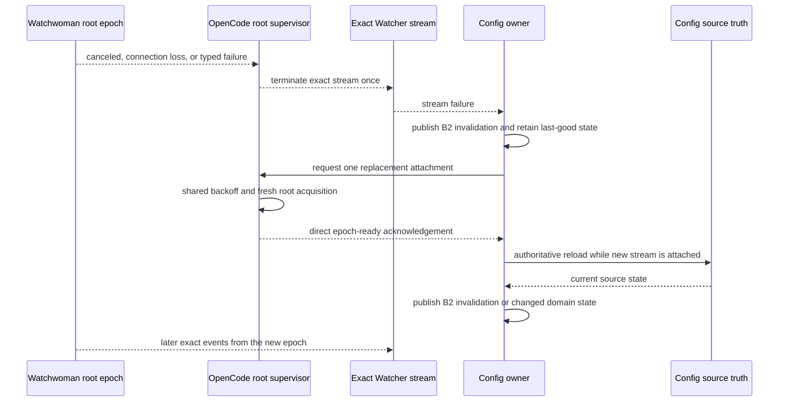
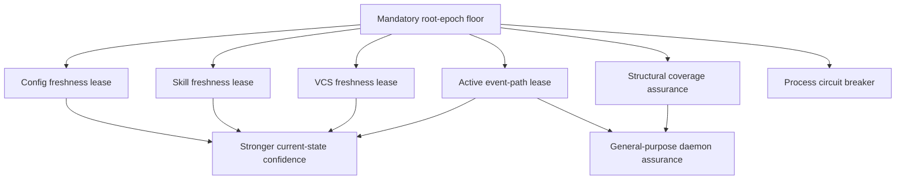

# Filesystem observation assurance

This document explains what it means for OpenCode to trust a filesystem
watcher, where that trust currently fails, and which independent mechanisms can
strengthen it. It is a decision map, not an accepted implementation plan.

The intended reader does not need prior knowledge of Watchman, Watchwoman,
inotify, `notify`, or the earlier review wave. The first half establishes the
problem and the non-negotiable correctness floor. The second half separates
optional assurances that were previously bundled together even though they
answer different questions.

## How to read this document

For the shortest decision route, read:

1. [Executive summary](#executive-summary)
2. [Promises and reality](#promises-and-reality)
3. [Mandatory correctness floor](#mandatory-correctness-floor)
4. [Independent assurance mechanisms](#independent-assurance-mechanisms)
5. [Composable profiles](#composition-not-a-bundle-ladder)
6. [Decision ledger](#decision-ledger)

The intervening sections provide the mechanism and evidence behind those
conclusions. They are reference material, not required sequential reading.

## Executive summary

OpenCode does not need a complete history of filesystem events. Its Config,
Skill, and VCS owners can re-read authoritative source state. That makes a
weaker and more achievable product possible: exact events while observation is
healthy, explicit discontinuity when known, and an authoritative re-read after
recovery.

The current system does not yet provide that weaker product end to end:

- Watchwoman scans before installing native observation, leaving a mutation
  window between the scan and the watch.
- Watchwoman can acknowledge a root after native watcher construction or
  registration failed.
- Runtime `notify::Error` values are logged and discarded.
- Linux queue overflow reaches `notify` as a pathless `Rescan` event, which
  Watchwoman currently ignores because it iterates only event paths.
- Re-watching a damaged root returns the same registered root, so client
  reconnection alone does not repair native observation.
- Watchwoman advertises synchronized-clock and subscription-flush capabilities
  without implementing their synchronization barriers.
- OpenCode resumes an old subscription clock across daemon generations and
  ignores recovery rows in the subscribe response, which can hide changes made
  during daemon downtime.
- OpenCode currently represents readiness, cancellation, and fresh-instance
  transitions as fabricated root-shaped exact updates. Config-local B2
  invalidation is decided but not yet implemented.

Several important foundations are already sound and should be reused:

- Watchwoman owns one native watcher and event channel per root.
- Root numbers already provide epoch identity through Watchwoman clocks.
- Root cancellation and standard `canceled` subscription PDUs already exist.
- Watchwoman repairs lag inside its own subscription broadcast by scanning its
  indexed tree from the last tick.
- OpenCode already has separate exact-event and stream-failure paths.
- Config and Skill already derive current state from source and have recovery
  loops, although their ordering and terminal policy need correction.
- The managed deployment keeps the socket bound across daemon failure and
  restarts Watchwoman, making process replacement a viable final circuit
  breaker.

Every credible design therefore shares a mandatory **root observation epoch**
floor:

1. Install native observation before scanning, buffer concurrent events, merge
   them into the scan, and acknowledge only after a coherent epoch exists.
2. End the affected root epoch on every source loss reported by `notify`, on a
   `Rescan` marker, or on watcher-task death.
3. Remove and fence the failed epoch before clients can re-watch it.
4. Classify policy, size, transient setup, unsupported backend, and shared
   resource failures structurally rather than from prose.
5. Re-establish from a fresh clock and re-read source truth; do not use an old
   cursor as the recovery proof.
6. Carry loss through stream failure and recovery through a direct epoch-ready
   acknowledgement. Under the accepted B2 decision, Config alone turns those
   lifecycle facts into a typed invalidation for its consumers.

Beyond that floor, assurance is not one ladder. Three mechanisms are
orthogonal:

- **Owner audit** bounds the age of domain state, but says nothing about watcher
  health.
- **Active event-path probe** gives recent positive evidence that one path
  traversed the observer, but does not prove every subtree is watched or repair
  earlier loss.
- **Structural coverage accounting** checks that expected native watches exist,
  but does not prove the event queue or consumer pipeline is flowing.

These mechanisms may be combined, selected per owner, or omitted. Process
restart and root recrawl are repair actions, not evidence. A responsive socket,
PID, `clock`, or `status.health=active` is control-plane evidence, not filesystem
observation evidence.

The current synthesis recommends the root-epoch floor plus a low-rate Config
source audit as the first assurance profile. That recommendation is not yet a
decision. It gives Config-mediated state a bounded freshness lease without
widening `Watcher.Update`, writing probes into every root, or pretending the
watcher is healthy when only the source state has been refreshed.

## The problem in plain language

A watcher is not the filesystem. It is a chain of lossy mechanisms that reports
clues about filesystem changes.

Consider a Config owner:

1. It scans several directories and files and builds current configuration.
2. It asks the watcher to report future changes.
3. A file changes.
4. The watcher reports a path.
5. Config re-scans source and updates its derived state.

Three different failures can make Config stale:

- A change occurs between the initial scan and successful watch attachment.
- Observation was attached, but the kernel, native library, daemon, socket, or
  local queue later loses the event.
- Observation reports a problem, but the system does not turn that problem into
  a re-read.

The first is an establishment race. The second is an observation failure. The
third is a recovery-contract failure. Fixing one does not fix the others.

The system can also be stale while every health command returns successfully.
A daemon may accept commands from its socket while a particular native watcher
is dead. A root may exist in an in-memory map while some descendant directories
lack kernel watch descriptors. A counter may advance without waiting for the
kernel event queue. Assurance must name the exact fact that each signal proves.

## The system under discussion

The normal event path has several independently fallible stages:

```mermaid
flowchart LR
  SourceTruth["Filesystem and VCS source truth"]
  KernelObserver["Kernel observer: inotify or platform equivalent"]
  NotifyAdapter["notify 8.2 adapter"]
  WatchwomanRoot["Watchwoman root epoch and indexed tree"]
  Protocol["Watchman-compatible commands and subscription PDUs"]
  RootSupervisor["OpenCode root supervisor"]
  ExactStream["Watcher exact-event stream"]
  StateOwner["Config, Skill, VCS, or exact-file owner"]
  DerivedState["Derived current state"]
  OwnerAudit["Independent owner audit"]
  ActiveProbe["Active path probe"]

  SourceTruth --> KernelObserver --> NotifyAdapter --> WatchwomanRoot
  WatchwomanRoot --> Protocol --> RootSupervisor --> ExactStream --> StateOwner
  StateOwner -->|authoritative read| SourceTruth
  StateOwner --> DerivedState
  OwnerAudit -.->|scheduled authoritative read| SourceTruth
  OwnerAudit -.-> StateOwner
  ActiveProbe -.->|write marker| SourceTruth
  ExactStream -.->|observe marker| ActiveProbe
```



The stages have different responsibilities:

- The kernel and native adapter observe changes. They do not know Config or VCS
  semantics.
- Watchwoman maintains a current indexed view per root and translates native
  events into Watchman-compatible query and subscription results.
- OpenCode supervises daemon connections, roots, and logical subscriptions.
- State owners know what to read and how to derive current domain state.
- An owner audit bypasses the event path and re-derives state directly.
- An active probe deliberately exercises the event path and waits for its own
  marker to return.

The key architectural rule is that watcher output is a reason to re-read, not
durable domain truth. This rule makes current-state repair possible. It does not
make the observer infallible.

## Vocabulary

| Term                          | Meaning                                                                                                                                                                  |
| ----------------------------- | ------------------------------------------------------------------------------------------------------------------------------------------------------------------------ |
| **Exact event**               | A create, update, or delete known to concern one path.                                                                                                                   |
| **Invalidation**              | A statement that current state for a declared extent may be stale and must be re-read. It is not a guessed file event.                                                   |
| **Root**                      | One directory tree registered with Watchwoman. Watchwoman currently allocates one native watcher per root.                                                               |
| **Root observation epoch**    | One period in which one specific Watchwoman native root registration is considered usable. A replacement registration begins a new root epoch.                           |
| **Delivery epoch**            | One period in which an OpenCode subscriber has an attached exact-event path. Socket or local delivery loss can end it without proving that the daemon root epoch failed. |
| **Generation**                | One OpenCode raw client connection, command FIFO, and subscription dispatch table. Several generations may attach to one still-healthy daemon root over time.            |
| **Epoch fence**               | Identity and ordering that prevent events, responses, or cancellation from an ended root or delivery epoch affecting its replacement.                                    |
| **Detected loss**             | A discontinuity reported by the native adapter, daemon, transport, or local delivery path.                                                                               |
| **Hidden loss**               | A change or coverage failure for which no signal reaches the supervising layer.                                                                                          |
| **Current-state convergence** | After an authoritative re-read succeeds, derived state matches the source state at that read boundary.                                                                   |
| **Freshness bound**           | A maximum delay, after source mutation settles and reads succeed, before a scheduled authoritative re-read repairs derived state.                                        |
| **Event-path proof**          | Positive evidence that a particular marker traversed a selected observation path before a deadline.                                                                      |
| **Structural coverage**       | Evidence that the expected native watch registrations exist for the intended tree.                                                                                       |
| **Event history**             | A complete ordered account of every intermediate filesystem transition. This design does not provide it.                                                                 |
| **Last-good state**           | The most recent successfully derived domain state, retained while observation or later scans are degraded.                                                               |

## Promises and reality

### Intended product promises

The accepted direction treats filesystem and VCS state as truth. During healthy
observation, directory updates remain exact paths. On uncertainty, an owner
re-reads current state. Startup source reads do not wait for a daemon to become
available. Backend selection remains explicit rather than silently changing
from Watchman to Parcel after a failure.

The 2026-09-03 human decision keeps **B2**: Config emits a typed invalidation at
`Config.changes`, while `Watcher.Update` remains exact-only. B3, a watcher-level
exact-or-invalidation union, remains deferred
([`vision0.gpt56s.md:883-929`](/.design/watchman/vision0.gpt56s.md#L883-L929)).

That decision narrows the global promise. Config-mediated consumers may receive
typed invalidation. Other owners receive only the continuity behavior they
explicitly implement. A design must not describe generic watcher-wide typed
continuity while retaining B2.

### What already works on the Watchwoman side

Watchwoman is not a blank slate:

- Each root owns a distinct `RecommendedWatcher`, callback channel, blocking
  holder thread, and event task. Root-local native failure therefore has a real
  implementation scope
  ([`watcher.rs:21-113`](file:///home/rektide/src/watchwoman-systemd/crates/watchwoman/src/daemon/watcher.rs#L21-L113)).
- A root number is embedded in its clock and can serve as epoch identity
  ([`root.rs:73-104`](file:///home/rektide/src/watchwoman-systemd/crates/watchwoman/src/daemon/root.rs#L73-L104)).
- Root retirement has a cancellation channel, and subscription push loops emit
  standard `canceled` PDUs when that channel changes
  ([`subscribe.rs:125-150`](file:///home/rektide/src/watchwoman-systemd/crates/watchwoman/src/commands/subscribe.rs#L125-L150)).
- If a subscription receiver lags Watchwoman's internal tick broadcast, its
  push loop falls back from changed-path candidates to an indexed since-scan
  ([`subscribe.rs:90-205`](file:///home/rektide/src/watchwoman-systemd/crates/watchwoman/src/commands/subscribe.rs#L90-L205)).
- If a client session outruns its output budget, Watchwoman poisons and closes
  that session instead of silently dropping arbitrary PDUs
  ([`session.rs:214-285`](file:///home/rektide/src/watchwoman-systemd/crates/watchwoman/src/daemon/session.rs#L214-L285)).

These mechanisms repair loss after an event has entered Watchwoman's indexed
tree or make a client connection visibly fail. They do not repair kernel-to-
daemon loss.

### What already works on the OpenCode side

OpenCode also has useful seams:

- `Watcher.Update` is exact event data, while `Stream<Update, Error>` already has
  a separate failure channel
  ([`watcher.ts:33-65`](/packages/core/src/filesystem/watcher.ts#L33-L65)).
- `WatchInterests` records update and failure separately before exposing the
  aggregate stream
  ([`interests.ts:12-26`](/packages/core/src/filesystem/watcher/interests.ts#L12-L26)).
- Config and Skill respond to a failed interests stream by re-reading source and
  resubscribing, although Config currently re-reads before its replacement
  observation is attached
  ([`config.ts:329-346`](/packages/core/src/config.ts#L329-L346),
  [`skill.ts:204-221`](/packages/core/src/config/plugin/skill.ts#L204-L221)).
- The Watchman backend has one connection and recovery sequence per root intent,
  so unrelated roots need not share a command FIFO or retry schedule
  ([`root.ts:95-195`](/packages/core/src/filesystem/watcher/watchman/root.ts#L95-L195)).
- Submitted-command timeout closes the generation because the transport has no
  request IDs or command cancellation
  ([`client.ts:96-142`](/packages/core/src/filesystem/watcher/watchman/client.ts#L96-L142)).

### Current promise/reality gaps

| Intended or implied promise                                 | Current reality                                                                                                                                                                                                                                                                                                                                                                                                                                                                                                            | Consequence                                                                                                              |
| ----------------------------------------------------------- | -------------------------------------------------------------------------------------------------------------------------------------------------------------------------------------------------------------------------------------------------------------------------------------------------------------------------------------------------------------------------------------------------------------------------------------------------------------------------------------------------------------------------- | ------------------------------------------------------------------------------------------------------------------------ |
| A successful `watch` means native observation is installed. | Watcher construction failure drops the ready sender; recursive `watch()` failure is logged; the caller ignores the rendezvous result and proceeds ([`watcher.rs:40-77`](file:///home/rektide/src/watchwoman-systemd/crates/watchwoman/src/daemon/watcher.rs#L40-L77)).                                                                                                                                                                                                                                                     | A root can acknowledge successfully while deaf.                                                                          |
| Initial state and future events meet without a gap.         | Watchwoman scans and seeds before calling `watcher::spawn` ([`state.rs:236-262`](file:///home/rektide/src/watchwoman-systemd/crates/watchwoman/src/daemon/state.rs#L236-L262)).                                                                                                                                                                                                                                                                                                                                            | A mutation after its directory was scanned but before native attachment can miss both snapshot and stream.               |
| Native runtime failure becomes visible.                     | `notify::Error` is debug-logged and discarded ([`watcher.rs:115-121`](file:///home/rektide/src/watchwoman-systemd/crates/watchwoman/src/daemon/watcher.rs#L115-L121)).                                                                                                                                                                                                                                                                                                                                                     | A known-degraded root remains routable as healthy.                                                                       |
| Linux queue overflow triggers repair.                       | notify 8.2 emits overflow as `Ok(EventKind::Other)` with `Flag::Rescan` and no path; Watchwoman iterates paths and therefore does nothing ([`notify inotify.rs:197-227`](https://github.com/notify-rs/notify/blob/notify-8.2.0/notify/src/inotify.rs#L197-L227)).                                                                                                                                                                                                                                                          | The kernel's explicit loss signal disappears silently.                                                                   |
| Dynamic recursive coverage failures are visible.            | notify reports dynamic add failure only for `MaxFilesWatch`; other add failures are ignored ([`notify inotify.rs:379-397`](https://github.com/notify-rs/notify/blob/notify-8.2.0/notify/src/inotify.rs#L379-L397)).                                                                                                                                                                                                                                                                                                        | Some subtrees can become unwatched without a callback to Watchwoman.                                                     |
| Reconnect and re-watch repair a damaged observer.           | `register_root` returns the existing root when the path is already registered ([`state.rs:199-210`](file:///home/rektide/src/watchwoman-systemd/crates/watchwoman/src/daemon/state.rs#L199-L210)).                                                                                                                                                                                                                                                                                                                         | Client connection replacement can reattach to the same damaged native watcher.                                           |
| Root retirement prevents new attachment to the old root.    | Retirement requests cancellation, sleeps, and removes the root afterward ([`state.rs:269-284`](file:///home/rektide/src/watchwoman-systemd/crates/watchwoman/src/daemon/state.rs#L269-L284)).                                                                                                                                                                                                                                                                                                                              | A fast re-watch can observe and reuse the root being retired.                                                            |
| Subscription establishment does not miss concurrent ticks.  | The initial query runs before the tick receiver and starting fence are captured ([`subscribe.rs:29-45`](file:///home/rektide/src/watchwoman-systemd/crates/watchwoman/src/commands/subscribe.rs#L29-L45)).                                                                                                                                                                                                                                                                                                                 | A mutation in that interval can be absent from both the response and later push loop.                                    |
| Policy and file-cap rejection have stable recovery meaning. | `Blocked` and `TooLarge` become one `RootBlocked` message, and the response envelope contains only prose ([`watch.rs:10-19`](file:///home/rektide/src/watchwoman-systemd/crates/watchwoman/src/commands/watch.rs#L10-L19), [`commands.rs:46-62`](file:///home/rektide/src/watchwoman-systemd/crates/watchwoman/src/commands.rs#L46-L62)).                                                                                                                                                                                  | OpenCode must either guess from text, retry a permanent refusal, or suppress a transient problem.                        |
| An old clock safely resumes after daemon restart.           | Watchwoman maps a foreign-generation clock to tick zero but reports `is_fresh_instance: false`; OpenCode ignores subscribe-response rows and reuses compatible clocks ([`clock.rs:127-153`](file:///home/rektide/src/watchwoman-systemd/crates/watchwoman/src/daemon/clock.rs#L127-L153), [`query/run.rs:96-135`](file:///home/rektide/src/watchwoman-systemd/crates/watchwoman/src/query/run.rs#L96-L135), [`root.ts:197-253`](/packages/core/src/filesystem/watcher/watchman/root.ts#L197-L253)).                        | Full recovery rows can be returned only in the ignored command response, with no effective invalidation.                 |
| Readiness and continuity are not fabricated as file events. | `WatchInterests` and the root supervisor publish `{path: target, type: "update"}` for readiness, route changes, cursor rejection, cancellation, and fresh instance ([`interests.ts:31-57`](/packages/core/src/filesystem/watcher/interests.ts#L31-L57), [`root.ts:197-247`](/packages/core/src/filesystem/watcher/watchman/root.ts#L197-L247), [`root.ts:359-395`](/packages/core/src/filesystem/watcher/watchman/root.ts#L359-L395)).                                                                                     | The exact-event type carries a control-plane convention; indirect Config consumers can reject the marker.                |
| Config-local B2 invalidation protects indirect consumers.   | `Config.changes` remains `Watcher.Update`, and Config republishes raw updates ([`config.ts:290-345`](/packages/core/src/config.ts#L290-L345)).                                                                                                                                                                                                                                                                                                                                                                             | Agent, Command, and Plugin Source can remain stale when their root changed but their exact-path predicates do not match. |
| Advertised synchronization capabilities provide barriers.   | Watchwoman advertises `clock-sync-timeout` and `cmd-flush-subscriptions`; `clock` only bumps an in-memory counter, while `flush-subscriptions` only lists names ([`info.rs:9-55`](file:///home/rektide/src/watchwoman-systemd/crates/watchwoman/src/commands/info.rs#L9-L55), [`clock.rs:9-22`](file:///home/rektide/src/watchwoman-systemd/crates/watchwoman/src/commands/clock.rs#L9-L22), [`subscribe.rs:350-365`](file:///home/rektide/src/watchwoman-systemd/crates/watchwoman/src/commands/subscribe.rs#L350-L365)). | A client can receive false assurance if it trusts the advertised semantics.                                              |

This table is deliberately balanced: Watchwoman's internal subscription lag
repair and session fail-stop are useful, but they protect later stages of the
pipeline. They cannot compensate for a root that was never observed or a
kernel-to-daemon loss that never entered the indexed tree.

## Assurance is not one scalar

The phrase "watcher health" collapses several different properties. They do not
form one simple strongest-to-weakest ordering.

| Property                         | Honest question                                                                                          | Typical evidence                                  | What it does not imply                                        |
| -------------------------------- | -------------------------------------------------------------------------------------------------------- | ------------------------------------------------- | ------------------------------------------------------------- |
| **Control liveness**             | Can a command reach a daemon?                                                                            | Socket, PID, `version`, ordinary `clock` response | Any root is observed.                                         |
| **Admission truth**              | Was this root's native observation established before acknowledgement?                                   | Successful fenced acquisition                     | Continued health or complete descriptor coverage.             |
| **Detected-loss visibility**     | Does every loss reported to the adapter end the applicable root or delivery epoch?                       | Error, `Rescan`, task death, connection closure   | Hidden loss is detected.                                      |
| **Detected-loss convergence**    | After visible loss, does the owner re-read after a fresh delivery epoch?                                 | Epoch fence plus source scan                      | A bound when no loss is reported.                             |
| **Bounded domain freshness**     | After source mutation settles, when will this owner next derive source truth even if events are missing? | Scheduled owner audit                             | The watcher is healthy.                                       |
| **Recent event-path evidence**   | Did one marker traverse this observer path before a deadline?                                            | Cookie-like active probe                          | Every subtree descriptor exists or no event was lost earlier. |
| **Structural coverage evidence** | Do expected native registrations match intended tree coverage?                                           | Descriptor map or structural audit                | Events are draining or consumers are current.                 |
| **Complete event history**       | Was every intermediate transition retained in order?                                                     | Durable journal designed for that product         | Provided by any rescan-based watcher design.                  |

Important non-implications follow:

- A fresh owner audit can produce correct Config state while the watcher remains
  dead.
- A successful root probe proves the selected path worked recently, not that
  every descendant directory is watched.
- A complete descriptor map does not prove that the kernel queue, daemon event
  task, socket writer, or owner queue is draining.
- Root retirement repairs a known-bad observer but is not evidence that the
  observer was bad or that its replacement is still healthy.
- Process restart gives a clean daemon generation but cannot create exhausted
  inotify capacity.

Guarantee wording must be derived from selected mechanisms. It must not be
chosen first and projected onto evidence that cannot support it.

## Constraints and accepted direction

The assurance design inherits these decisions and constraints:

1. **B2 remains selected.** `Watcher.Update` stays exact-only. Config owns the
   typed invalidation consumed by Agent, Command, and Plugin Source. B3 remains
   a future design.
2. **Current state, not history, is the product.** Owners that can authoritatively
   re-read fit the model. Consumers requiring every intermediate transition do
   not.
3. **Exact delivery remains useful.** During a healthy epoch, ordinary
   directory PDUs retain exact create, update, and delete paths.
4. **Backend selection is static.** A selected Watchman directory does not
   silently become Parcel because acquisition or runtime observation failed.
5. **Files remain isolated.** Exact file interests stay on Node and need not
   share daemon failure domains.
6. **Retry has one scheduler.** Root retry timing and backoff belong to the root
   supervisor. Owners may request reacquisition once and park; they do not run
   competing timed retry loops.
7. **Daemon evidence is bounded.** The strongest universal claim is about losses
   detected by or reported to the selected adapter. Stronger temporal claims
   require independent audits or probes.
8. **The current managed deployment matters.** Watchwoman runs under a
   socket-activated user service with `Restart=on-failure`; the socket remains
   bound and queues new connections while the service is replaced
   ([`watchwoman.src.pb:144-190`](file:///home/rektide/src/compfuzor/watchwoman.src.pb#L144-L190)).

## Mandatory correctness floor

The floor below is not an assurance tier to choose. Without it, even the
narrowest detected-loss claim is false.

### F1. Fenced watcher-first acquisition

The current scan-before-watch ordering must reverse. A practical acquisition
sequence is:

1. Allocate an unpublished root epoch.
2. Construct the native watcher and successfully register recursive observation.
3. Route callbacks into an epoch-local buffer with a loss flag that cannot be
   displaced by ordinary event capacity.
4. Run the independent initial scan.
5. Apply buffered events after the scan, or abandon and retry acquisition if
   the buffer reported overflow or source loss.
6. Install the coherent tree, publish the root in daemon lookup, and only then
   acknowledge `watch`.

The implementation should hide `notify` behind one deep internal module. Its
conceptual interface is small:

```rust
pub struct Observation {
    pub epoch: ObservationEpoch,
    pub snapshot: Vec<ScannedEntry>,
    pub events: Receiver<ObservationEvent>,
    lease: ObservationLease,
}

pub enum ObservationEvent {
    Changes(Vec<PathChange>),
    Lost(ObservationFailure),
}

pub fn acquire(spec: ObservationSpec) -> Result<Observation, ObservationFailure>;
```

`ObservationLease` hides the native watcher, callback channels, blocking thread,
batching, and shutdown. No `notify::Event` or `notify::ErrorKind` needs to escape
that module.

The acknowledgement claim must remain precise. It can prove that native
registration returned success and that Watchwoman merged callbacks around its
own initial scan. It cannot prove that `notify` successfully installed every
recursive descriptor when `notify` itself suppresses traversal errors. That
stronger claim requires structural coverage assurance.

### F2. Root observation epochs

One root registration is one observation epoch. Watchwoman's existing
`root_number` is sufficient identity. The epoch state is conceptually:

```text
Acquiring -> Live -> Lost -> Retired
      |                    |
      +------ failure -----+
```

Only `Live` roots are discoverable by normal commands. A loss callback carries
the epoch identity. Retirement removes the map entry only if it still refers to
that epoch, preventing a late callback from deleting a replacement.

OpenCode also has a narrower delivery epoch for each attached logical stream.
A socket failure, admitted-command timeout, malformed PDU, or local output
failure ends delivery continuity even when the daemon's native root may still be
healthy. OpenCode must fence and re-establish that delivery epoch and re-read
source state, but it should not retire the daemon root unless evidence identifies
root observation loss. A raw client generation is transport machinery inside
this distinction, not another name for the daemon root epoch.

### F3. Complete handling of reported loss

The first of these signals ends the affected root epoch exactly once:

- `notify::Error`
- `Event::need_rescan()` or the equivalent `Flag::Rescan`
- unexpected callback/event-channel closure
- watcher task or holder-thread termination while the root remains live
- an internal event mailbox reporting that it cannot preserve exact output

Repeated signals from the same failed epoch coalesce. Exact events from that
epoch are fenced after the loss transition.

Queue overflow is especially important. On Linux, `IN_Q_OVERFLOW` has no path,
but attribution remains root-local because each Watchwoman root owns the
`notify` callback that received it. Pathless does not mean daemon-global.

### F4. Remove before cancellation

The daemon must make a lost root unroutable before cancellation is visible. It
may retain the old `Root` object briefly to flush `canceled` PDUs, but lookup
must no longer return it. The current cancel-sleep-remove sequence has the
opposite ordering.

Cancellation setup also needs a linearization point. The subscription receiver
and tick fence must be captured before the initial query, and the cancellation
receiver must exist before retirement can occur. The current source comments
state that intent, but execute the initial query first.

### F5. Structural failure classification

Operation names are diagnostic; they do not determine recovery. A useful
failure value has independent `code`, `scope`, and `recovery` fields.

| Example code                  | Scope       | Recovery                                | Meaning                                                                                                           |
| ----------------------------- | ----------- | --------------------------------------- | ----------------------------------------------------------------------------------------------------------------- |
| `root_blocked`                | root        | terminal until intent or policy changes | Administrative policy rejected the root before observation.                                                       |
| `root_too_large`              | root        | terminal until intent or policy changes | The configured per-root scan cap was exceeded. Do not repeat the expensive crawl automatically.                   |
| `observer_start_failed`       | root        | retry                                   | Native construction or registration failed for a reason not proven permanent.                                     |
| `observer_unsupported`        | backend     | terminal                                | The selected adapter cannot provide observation on this platform.                                                 |
| `observer_resource_exhausted` | environment | operator/backoff                        | A shared inotify watch or instance pool is exhausted. Root churn and process restart cannot manufacture capacity. |
| `observation_lost`            | root        | retry                                   | A previously live root reported error, rescan, or task death.                                                     |
| `protocol_incompatible`       | backend     | terminal                                | A structurally proven capability or response incompatibility affects the selected adapter.                        |

This split resolves the disagreement over whether "watcher setup failed" is
retryable or terminal. That phrase is too broad to be a policy. Unsupported
observation is terminal, shared resource exhaustion needs an environment
circuit, and an otherwise unclassified setup failure is retryable.

Human-readable `error` remains for compatible diagnostics. An additive
`error_code` or structured `watchwoman_failure` carries policy. OpenCode must
decode the raw daemon response retained by the transport rather than reduce it
to `error.message` ([`client.ts:96-132`](/packages/core/src/filesystem/watcher/watchman/client.ts#L96-L132)).

Unknown or missing codes must never be classified by matching prose. Legacy
handling remains a compatibility decision; the enhanced profile must not emit
an unstructured failure for a case whose policy it promises to classify.

### F6. Fresh recovery, not historical replay

When a root or delivery epoch ends, OpenCode stops treating the prior
subscription clock as a correctness cursor. A replacement delivery epoch gets a
fresh clock immediately before subscription establishment. The owner then
re-reads source state.

This intentionally declines to reconstruct changes made during the outage.
Source state, not event history, repairs the gap. Subscribe response rows and
cross-generation cursor behavior are no longer load-bearing.

Every establishment attempt needs an attempt-qualified subscription name or an
equivalent fence so a late PDU from an old attempt cannot enter the new epoch.

### F7. B2 lifecycle handoff without fake exact events

B2 can use control and failure channels already present without widening
`Watcher.Update`:



The exact stream carries exact events only. Retryable loss terminates that
delivery epoch's stream. A direct, per-subscriber readiness acknowledgement says
that a new delivery epoch is attached; it is control flow, not a shared change
value. Config turns loss and readiness into its own B2 invalidation.

The owner requests replacement once and then waits. The root supervisor owns
retry scheduling and shares one backoff sequence across same-root demand. A
terminal failure is retained as an attributed suppression record until the
desired intent changes or an explicit operator retry occurs; Config must not
re-enter its current `yieldNow` recovery loop forever.

This is a refinement of the earlier B2 mechanism. It keeps B2's type location
but removes the fabricated `{path: root, type: "update"}` transport convention.
If a shared lifecycle stream or typed invalidation value is introduced below
Config, that is B3 under another name and needs a separate acceptance decision.

Owner scope remains explicit:

- Config emits typed invalidation for Agent, Command, and Plugin Source.
- Skill already refreshes after interest-stream failure and can use direct
  epoch readiness to close its reattachment gap.
- A future VCS owner can implement the same owner-local rescan contract without
  changing the generic update type.
- Exact-file owners remain on Node. Their current dead-on-failure loops still
  need recovery or an explicit exclusion from any freshness promise.
- A future exact-sensitive non-Config directory owner needs its own mediation or
  a renewed B3 decision.

### F8. Global and process circuits

Root retirement is the default because native observation is per root. Two
classes require broader treatment:

- Shared inotify exhaustion opens an environment-level acquisition circuit and
  reports degraded observation. Immediate root retry or process restart is a
  furnace because neither creates kernel capacity.
- Broken daemon invariants, event-loop corruption, or repeated inability to
  retire root state may terminate the process. The managed systemd socket
  remains bound and the service restarts after failure.

Process restart is a backstop, not ordinary root recovery. It cold-recreates
every active root and connection. It is mechanically clean but has a much larger
incident cost.

### F9. Capability honesty

Watchwoman must stop advertising synchronization semantics it does not
implement. `clock-sync-timeout` and `cmd-flush-subscriptions` currently invite
clients to rely on false barriers.

A versioned capability such as `watchwoman-observation-v1` can represent the
enhanced contract:

- truthful fenced acquisition
- root epochs and remove-before-cancel retirement
- loss on error, `Rescan`, and task death
- structural policy, size, setup, and resource failures
- fresh root identity and cancellation semantics

The capability is advertised only after deterministic tests establish every
semantic promise. Semver, a Watchman compatibility date, process identity, or
`buildinfo` is not a substitute for behavior negotiation.

## Independent assurance mechanisms

The mandatory floor makes reported loss honest. Optional mechanisms answer
different questions and may be selected independently.

### Reactive evidence

| Evidence           | What it establishes                                                                          | Blind spots                                                                            | Normal cost             |
| ------------------ | -------------------------------------------------------------------------------------------- | -------------------------------------------------------------------------------------- | ----------------------- |
| Acquisition result | Native setup returned success at the epoch boundary.                                         | Continued health and recursively suppressed descriptor failures.                       | None after acquisition. |
| Callback error     | `notify` reported a native or dynamic-watch problem.                                         | Overflow is a separate success-shaped event; some dynamic add failures are suppressed. | None.                   |
| `Rescan` flag      | The kernel/native adapter explicitly reports dropped events, including Linux queue overflow. | Hangs, omitted descriptor installation, and losses never reported by the platform.     | None.                   |
| Watcher-task death | The event task or holder ended unexpectedly.                                                 | A hung but still-live task.                                                            | Negligible supervision. |
| Connection closure | This client cannot trust continuity through the old connection.                              | Whether the daemon's native root remained healthy.                                     | None.                   |
| Session poison     | The daemon could not retain this client's output.                                            | Kernel-to-daemon loss and other clients' queues.                                       | None until overload.    |

Reactive evidence has no time-based detection guarantee for hidden loss. Its
virtue is near-zero steady-state cost and direct causal evidence when present.

### Owner-side source audit

An owner audit periodically derives state directly from authoritative sources,
independent of watcher commands. Config re-runs discovery and decoding; Skill
re-reads declared local sources; VCS re-resolves topology and invokes the
provider's metadata read.

An audit establishes current domain state at the read boundary. It does not
establish watcher health. This distinction matters operationally: successful
audits must not clear an observation-health error unless observation itself has
recovered.

If audit period is `R_owner`, the honest guarantee is:

> After relevant source mutation quiesces and an authoritative audit succeeds,
> this owner's derived state converges no later than `R_owner` plus scan and
> publication latency.

The qualifier about a successful scan matters. Permission, mount, and parse
failure retain last-good state and degraded health; they do not become an empty
snapshot.

Audits are naturally B2-compatible because they terminate at the owner. They
can also run while the daemon is unavailable. Their cost is recurring source
work rather than root-sized filesystem traversal.

### Active event-path probe

An active probe creates a unique marker in a watched location, registers a
waiter before creation, and requires that marker to return through the intended
observation path before a deadline.

Classic Watchman implements this with cookie files. On Linux, ordered inotify
delivery means processing the cookie proves prior queued notifications were
processed before the synchronized query returns
([`cookies.md:21-55`](https://github.com/facebook/watchman/blob/923b0935155590be54c0fc052fdca0201f8ebc4b/website/docs/cookies.md#L21-L55)).
Its implementation serializes waiter registration with file creation, handles
timeout, and aborts/retries cookies across recrawl
([`CookieSync.cpp:80-199`](https://github.com/facebook/watchman/blob/923b0935155590be54c0fc052fdca0201f8ebc4b/watchman/CookieSync.cpp#L80-L199)).

A correct probe can establish recent path liveness. It cannot prove that every
subtree has a native descriptor, that no event was lost before the probe, or
that the path stayed healthy afterward. macOS FSEvents does not provide the
same ordering guarantee even with Watchman's additional flush machinery
([`cookies.md:84-105`](https://github.com/facebook/watchman/blob/923b0935155590be54c0fc052fdca0201f8ebc4b/website/docs/cookies.md#L84-L105)).

Probe costs and constraints include:

- one write/create-delete cycle per selected root and interval
- waiter, timeout, cleanup, and recrawl interaction
- false timeout under severe load
- no writable cookie location on some roots
- linear amplification across retained roots unless restricted to active roots
- synchronization artifacts crossing other raw watchers unless filtered at the
  relevant owner seam

Watchwoman already reserves and suppresses `.watchman-cookie-*`, but that is not
most of the implementation. Correct ordering and waiter semantics are the hard
parts. Copying only a socket ping or `clock` call would be cargo-culting the
surface without the proof.

### Structural coverage accounting

Structural assurance compares intended recursive coverage with actual native
registrations. On Linux this means ownership of the watch-descriptor map or a
backend interface that reports every initial and dynamic registration result.

The current `notify` interface does not expose enough information for this
claim. It filters initial traversal and metadata failures and suppresses some
dynamic add failures. Achieving structural coverage therefore likely requires
an upstream change, a maintained fork, or a more direct native backend.

Structural accounting catches a different class than active probes. A root
probe may pass while one descendant subtree is unwatched; descriptor accounting
can catch that omission. Conversely, complete descriptor accounting does not
prove the event loop drains.

### Periodic daemon recrawl and diff

A daemon can periodically walk the full root and compare source state with its
indexed tree. This detects silent index divergence regardless of event-path
evidence, subject to scan races and configured ignores.

It is much more expensive than an owner audit because it scans the generic root,
not the small domain source extent. A correct recrawl also needs event buffering,
an epoch fence, diff publication, and invalidation ordering. Watchwoman's current
`debug-recrawl` replaces the tree without broadcasting a tick and does not fence
concurrent events
([`debug.rs:39-67`](file:///home/rektide/src/watchwoman-systemd/crates/watchwoman/src/commands/debug.rs#L39-L67),
[`root.rs:416-439`](file:///home/rektide/src/watchwoman-systemd/crates/watchwoman/src/daemon/root.rs#L416-L439)).

Periodic full recrawl is reasonable for a general-purpose daemon assurance
product. It is usually disproportionate when OpenCode only needs Config, Skill,
and VCS current state.

### Signals that are not observation evidence

| Signal                                    | What it proves                                             | Why it is insufficient                                  |
| ----------------------------------------- | ---------------------------------------------------------- | ------------------------------------------------------- |
| Socket, PID, systemd `READY=1`, `version` | The control process can accept or answer commands.         | A root watcher may be absent or degraded.               |
| Current Watchwoman `clock`                | An in-memory root counter advanced.                        | It does not wait for kernel drain.                      |
| Current `flush-subscriptions`             | Subscription names were enumerated.                        | It does not create a barrier or flush delivery.         |
| `status.health=active`                    | The root exists and currently has subscribers or triggers. | It does not inspect native watcher health.              |
| Root directory `stat`                     | The root path exists.                                      | It says nothing about event flow or recursive coverage. |
| `/proc` inotify counts                    | Some descriptors or instances are allocated.               | Counts do not prove intended path coverage or delivery. |
| Join handle still alive                   | The task has not exited.                                   | A live task can be hung.                                |

Classic Watchman's `flush-subscriptions` is stronger than Watchwoman's command:
it uses a synchronization cookie and guarantees same-session subscription PDUs
are emitted before the command response
([`flush-subscriptions.md:8-31`](https://github.com/facebook/watchman/blob/923b0935155590be54c0fc052fdca0201f8ebc4b/website/docs/cmd/flush-subscriptions.md#L8-L31)).
Even that does not prove OpenCode's owner queue has processed the PDU without a
local acknowledgement barrier.

## Repair mechanisms are a separate axis

Evidence says what may be wrong. Repair determines what state is discarded and
rebuilt. These must not be conflated.

### Root retirement and reacquisition

Root retirement is the default incident repair:

- smallest scope matching Watchwoman's per-root native architecture
- reuses existing cancellation, registration, scan, and subscription paths
- yields a new root number and clean native registration
- keeps unrelated roots warm

Its incident cost is one full root crawl and client replay. A cooldown or shared
backoff is required so a persistent error does not create a recrawl furnace.

### In-place or shadow-root recrawl

In-place recovery can keep clients attached, but it is not a call to the current
`seed` function. A correct implementation needs a replacement watcher/tree,
buffered concurrent events, an atomic epoch swap, old-event fencing, clock
transition, and a client-visible discontinuity. It is justified if measured
root retirement and client replay are too expensive or too frequent.

### Owner reread

An owner reread repairs domain state regardless of whether daemon observation
was repaired. It is mandatory after an event gap because root reconstruction
cannot recreate every intermediate event that OpenCode ignored by design.

### Process replacement

Process replacement resets all daemon roots, native descriptors, queues, and
allocator state. The managed socket survives and clients reconnect. It is the
cleanest response to process-wide corruption, but the broadest response to a
root-local issue.

### Environment circuit

Shared inotify exhaustion is neither a root defect nor a process defect. The
system should stop automatic acquisition churn, retain explicit degraded
health, and wait for capacity or operator action. The deployment has already
experienced watch-pool exhaustion and raises per-user limits for many concurrent
OpenCode processes
([`sysctl-fs-inotify.etc.pb:1-25`](file:///home/rektide/src/compfuzor/sysctl-fs-inotify.etc.pb#L1-L25)).

## Independent design axes

The design space is clearer when decisions are recorded independently.

### Assured object

Choose what is being assured: command availability, one root's observation
epoch, one owner's current state, native descriptor coverage, or event history.
The selected object determines where evidence and repair belong.

### Failure set

Name which losses are covered: setup failure, scan/attachment race, callback
error, queue overflow, dynamic subtree registration failure, root replacement,
daemon restart, local queue loss, observer hang, or fully silent backend defect.

### Evidence independence

Evidence produced by the possibly-broken mechanism catches fewer fault classes.
An owner source scan is independent of the watcher. A cookie probe exercises the
watcher and is therefore stronger for path liveness but weaker for historical
state. A status field derived from the root map is highly correlated and proves
little.

### Temporal contract

Possible claims include immediate response to reported loss, response by a
probe deadline, and convergence by an owner audit interval. "Eventually" with
no trigger or bound is not an operational guarantee.

### Detection and repair scope

Detection may be root-local while the underlying cause is environment-global.
Repair should disturb the smallest scope that can actually remove the fault:
subscription, root, selected backend, shared environment, or process.

### Repairability

Config, Skill, and VCS are reparable because they can re-read current sources.
An imperative consumer that requires every intermediate event is not. Assurance
must be declared per owner capability, not inherited from a shared watcher name.

### Availability policy

During degradation an owner may serve last-good state, block reads, or fail.
Current-state owners should normally retain last-good state with visible health;
an empty result must not masquerade as successful source truth.

### Economics

Steady-state and incident costs are separate. Reactive root epochs have almost
no steady cost and a full-crawl incident cost. Audits add recurring domain work.
Probes add recurring writes and timeout state. Process restart has no recurring
cost but cold-rebuilds every active root.

### False-positive policy

Conservative invalidation and root retirement may perform extra reads without
corrupting state. Their backoff, coalescing, and hysteresis must prevent an
event storm or slow probe from becoming a recovery storm.

### Compatibility authority

A capability can promise only behavior controlled by that daemon. Stock
Watchman, enhanced Watchwoman, legacy Watchwoman, Node, and Parcel may need
separate support profiles. Missing capability must not be silently treated as
proof of enhanced behavior.

### Operability

Expose root epoch, last loss, last successful probe, recrawl count, observer
state, and expected/actual coverage separately. Do not compress them into one
"healthy" boolean. Metrics and logs are evidence for operators, never inputs to
correctness policy.

### Local delivery pressure

Assurance also depends on OpenCode's own queues. Current owner queues are
unbounded, so they do not silently drop exact events but can grow. If bounded
delivery is introduced under B2, saturation must terminate the affected exact
stream or be mediated at the owner. A generic invalidation value inserted into
`Watcher.Update` would be B3. A full queue cannot accept its own repair marker
without reserved state.

## Composition, not a bundle ladder

The mandatory floor and optional mechanisms compose as follows:



The arrows mean "can be composed with," not "strictly stronger than." For
example, Config audit and path probing cover different faults. Either can exist
without the other.

### Profile R: detected-loss root epochs

**Selected mechanisms:** mandatory floor only.

**Honest guarantee:** every loss reported to Watchwoman or OpenCode ends the
affected root or delivery epoch; B2 owners re-read after successful
reacquisition.

**Cost:** negligible steady-state assurance work; one root crawl and replay per
detected incident.

**Residual:** hidden observer loss has no staleness bound. Manual refresh or
process restart may be the first repair.

This is credible when watcher failures are rare and indefinite staleness after
an unreported fault is acceptable.

### Profile RC: root epochs plus Config freshness lease

**Selected mechanisms:** Profile R plus a jittered, low-rate Config source audit.

**Honest guarantee:** Config-mediated state converges by its configured audit
bound after source mutation settles and a scan succeeds, even if the watcher
never reports its failure.

**Cost:** recurring Config discovery and decode work, independent of root size.

**Residual:** watcher health remains unknown; Skill, VCS, and direct owners do
not inherit the Config bound.

This is the current synthesis recommendation because B2 already concentrates
Agent, Command, and Plugin Source at the Config seam.

### Profile RD: selected domain freshness leases

**Selected mechanisms:** Profile R plus independent audit periods for every
owner whose freshness is promised, such as Config, Skill, and VCS.

**Honest guarantee:** each participating current-state domain has its own
documented convergence bound.

**Cost:** recurring source reads, owner health state, last-good behavior, and
tests in each domain. The periods need not match.

**Residual:** observer health is still not proved. Unlisted owners have no bound.

This is credible when stale Skill or VCS state is a product correctness problem,
not merely delayed UI freshness.

### Profile RP: recent event-path assurance

**Selected mechanisms:** Profile R plus active probes for selected writable
roots. Profile RC or RD may be added independently.

**Honest guarantee:** the selected path completed a full probe round trip before
the last successful deadline. Timeout ends or degrades the root epoch.

**Cost:** recurring writes, waiter and cleanup state, timeout false positives,
and root recovery. Read-only and incompatible filesystems need an explicit
fallback profile.

**Residual:** a probe is point-in-time and path-specific. It does not establish
complete subtree coverage or repair earlier state without an owner scan.

This is credible when operators need recent positive observation evidence and
can tolerate probe artifacts and implementation complexity.

### Profile RS: structural daemon assurance

**Selected mechanisms:** Profile R plus explicit descriptor accounting, complete
registration errors, and a fenced shadow-tree or equivalent recrawl design.

**Honest guarantee:** intended native coverage can be compared with actual
coverage at an audit boundary; root rebuild preserves epoch ordering.

**Cost:** native backend ownership or a `notify` extension, descriptor state,
temporary recovery memory, and substantially more daemon verification.

**Residual:** descriptor coverage does not prove queue drain or owner freshness.

This is credible if Watchwoman is intended to be a generally trustworthy
Watchman replacement for clients beyond OpenCode.

### Process circuit is not a profile

Every profile may use process replacement as a final circuit breaker. It is an
incident response at broader scope, not a stronger observation guarantee.

## Guarantee catalog

Instead of accepting a whole profile by name, a carrier can select exact
guarantees from this catalog and cite the mechanisms that discharge them.

### G1. Startup source truth

> Initial domain state is derived from source independently of daemon
> availability. Retryable observation acquisition may remain pending without
> blocking that read.

Requires owner/source separation and non-blocking watch acquisition. Does not
require a healthy watcher.

### G2. Truthful root acknowledgement

> Under the enhanced Watchwoman profile, successful `watch` acknowledgement
> means native registration returned success and callbacks were reconciled with
> the initial Watchwoman scan before the root became routable.

Requires F1. Does not claim complete recursive descriptor coverage unless RS is
also selected.

### G3. Exact delivery during a live delivery epoch

> While a delivery epoch remains live, ordinary reported changes are delivered
> as exact create, update, and delete paths after declared filtering.

Requires loss fencing and honest overload behavior. Does not promise exactly
once or every platform-hidden change.

### G4. Detected-loss convergence

> Every continuity loss detected by or reported to Watchwoman or OpenCode ends
> the affected root or delivery epoch. Each participating owner re-reads
> authoritative state after a fresh delivery epoch is attached.

Requires the mandatory floor and owner integration. This is the strongest
universal reactive promise.

### G5. Config freshness lease

> After relevant source mutation quiesces and an authoritative Config audit
> succeeds, Config-mediated derived state converges within `R_config` plus scan
> and publication latency.

Requires Config audit. It does not imply observer health.

### G6. Named owner freshness lease

> Owner `O` converges within `R_O` plus successful scan and publication latency.

Requires an explicit audit and last-good policy for each named owner. This
cannot be inferred from G5.

### G7. Recent event-path evidence

> At the recorded probe time, the selected writable root's marker traversed the
> configured event path before its deadline.

Requires a correct active probe. It is point-in-time evidence, not continuous
health or structural coverage.

### G8. Structural coverage evidence

> At the recorded audit boundary, expected native registrations matched the
> intended root coverage under the selected backend's model.

Requires structural backend support. It does not imply owner freshness.

### Explicit non-guarantees

No profile in this document promises:

- complete or durable event history
- exactly-once events or invalidations
- reconstruction of intermediate states during an outage
- detection of every kernel, platform, native-library, or daemon defect
- freshness for an owner not named by the selected profile
- writable-root probing on every filesystem
- successful source reads during permission, mount, or parse failure

## Operational implications

### Current deployment snapshot

A read-only `watchman status --json` snapshot at
`2026-09-04T00:09:51Z` reported:

| Measure                      |          Value |
| ---------------------------- | -------------: |
| Retained roots               |             66 |
| Roots with subscriptions     |              8 |
| Subscriptions                |             11 |
| Files in active roots        |         62,194 |
| Files in idle roots          |         64,960 |
| Total indexed files          |        127,154 |
| RSS                          |  about 993 MiB |
| Reported allocator footprint | about 3.48 GiB |

This is one workstation snapshot, not a capacity claim. It does show why root
retirement and process replacement have materially different incident costs.
A root-local repair keeps seven other active roots warm. A process replacement
can discard idle retained roots, but all active clients must reconnect and their
roots must be crawled again.

The host currently exposes high inotify ceilings, but the deployment record
documents prior `MaxFilesWatch` exhaustion caused by many processes and
node_modules-heavy roots. Shared resource classification is therefore not
hypothetical.

### Event storms and ignored paths

Watchwoman filters `ignore_dirs` after `notify` has dequeued events. Ignored
node_modules churn can still consume the kernel queue and trigger `Rescan`.
Reactive recovery needs coalescing and backoff so a sustained storm does not
become repeated root recrawls.

### Suspend and resume

Suspend does not necessarily produce a loss marker. Reactive Profile R has no
bound for unreported suspend-window changes. Owner audits repair final state;
active probes can establish path liveness after resume but do not reconstruct
the suspended interval.

### Read-only and network roots

Native observation may work on a read-only root, but cookie-style probes need a
writable location on the observed path. Network filesystems may not produce
local kernel events at all. These roots can use reactive reporting and owner
audits while explicitly lacking G7.

### Root policy and topology changes

A root-terminal policy decision cannot be cached forever without an
invalidation story. Policy reload, desired-plan removal/re-addition, or explicit
operator retry must clear suppression deliberately. Exact roots that disappear
also need stable parent/topology sentinels; a watch on the vanished directory
cannot observe its own recreation.

### Backpressure

Watchwoman's session output budget already chooses connection failure over
silent PDU loss. OpenCode's owner queues are currently unbounded. If they become
bounded, the B2-compatible conservative policy is stream failure and owner
re-read, unless an owner-local mailbox reserves an invalidation state. Silent
drop is never an assurance profile.

## Compatibility and rollout

### Negotiated observation profile

An additive capability is preferable to semver inference:

```json
[
  "version",
  {
    "required": ["relative_root"],
    "optional": ["watchwoman-observation-v1"]
  }
]
```

The v1 capability means the mandatory floor's daemon obligations are present.
It does not imply Config audits, active probes, or structural descriptor
coverage unless separate capabilities explicitly say so.

### Additive error and cancellation fields

Keep Watchman-compatible human-readable fields and add structure:

```json
{
  "error": "watchwoman: root blocked by policy: ...",
  "error_code": "root_blocked"
}
```

```json
{
  "subscription": "opencode-3-7-2",
  "root": "/repo",
  "canceled": true,
  "watchwoman_epoch": "daemon-start:pid:root-number",
  "watchwoman_failure": {
    "code": "observation_lost",
    "scope": "root",
    "recovery": "retry"
  }
}
```

Standard clients ignore additive fields and still understand cancellation. The
OpenCode adapter uses structure when present and never parses prose.

### Legacy and stock daemons

Capability absence means only that the enhanced Watchwoman contract is
unproven. It does not by itself prove a stock Watchman implementation broken.
Support profiles should distinguish:

- enhanced Watchwoman with the negotiated v1 behavior
- legacy Watchwoman with baseline compatibility and narrower guarantees
- stock Watchman with its own documented recrawl and cookie semantics

The deployment can upgrade Watchwoman first, run its semantic tests, and only
then advertise v1. OpenCode may initially allow legacy mode with one explicit
degraded-profile diagnostic, or require v1 when strict Watchwoman assurance is
selected. That is an open rollout decision.

### Correct existing capability claims first

Regardless of v1 rollout, Watchwoman should stop claiming
`clock-sync-timeout` and `cmd-flush-subscriptions` until it implements their
documented barriers. A capability list is part of the interface, not marketing
metadata.

## Verification strategy

Assurance claims need deterministic fault injection at the seam that owns each
mechanism. Ordinary happy-path live writes are insufficient.

### Mandatory daemon gates

1. Native constructor failure returns a structured error, leaves no routable
   root, and never acknowledges `watch`.
2. Recursive native registration failure has the same outcome.
3. A mutation while the initial scan is paused is present after acknowledged
   acquisition because native observation was already installed and buffered.
4. A callback error ends one root epoch and does not disturb a healthy sibling.
5. A pathless `Rescan` marker has the same loss behavior.
6. Event-task or holder-thread death cannot leave a routable live root.
7. The old root is absent from lookup before a subscriber observes
   cancellation.
8. A stale old-epoch callback cannot remove or mutate its replacement.
9. Policy and file-cap failures carry distinct stable codes.
10. Shared resource exhaustion opens the environment circuit without immediate
    root recrawl or process restart.
11. Subscription tick and cancellation receivers are installed before the
    initial query can race them.
12. A failed cancellation write closes the affected session rather than leaving
    it silently attached.

### Mandatory OpenCode gates

1. Daemon absence does not block initial Config or Skill source reads.
2. Runtime root loss terminates exact streams and produces Config's B2
   invalidation without publishing a fabricated exact root event.
3. Same-root replacement demand shares one backoff sequence; unrelated roots
   remain usable.
4. Recovery uses a fresh clock and a fresh establishment identity.
5. Config attaches replacement observation before the recovery reload closes
   the gap.
6. Agent, Command, and Plugin Source handle Config invalidation before exact-path
   filtering.
7. Skill re-reads once on loss and once after reattachment as selected, without
   its own timed retry loop.
8. Terminal root failure is retained and does not enter Config's current
   `yieldNow` loop.
9. A released interest cannot be resurrected by late acknowledgement, PDU,
   retry, or unsubscribe completion.
10. A backend-terminal incompatibility fans out once; a root-local failure does
    not.
11. Watchman selection never invokes Parcel after acquisition or runtime
    failure.
12. Node exact-file interests remain independent of directory-backend failure.

### Profile-specific gates

For each freshness lease, mutate source without delivering an event, advance a
fake clock to immediately before and then through `R_owner`, and prove state
converges only after the scheduled successful scan. Prove failed scans retain
last-good state and degraded health.

For active probes, register the waiter before marker creation, prove the marker
traverses the intended local and daemon path, inject a hang, and prove timeout
ends or degrades the epoch. Measure false timeout under burst load and define
read-only behavior.

For structural assurance, inject initial and dynamic descriptor failures and
prove expected/actual coverage diverges visibly before a successful shadow
epoch replaces it.

### Highest-information experiments

1. **Restart-gap reproduction.** Establish the current OpenCode registry, stop
   Watchwoman, mutate a Config source, restart it, and demonstrate whether the
   current old-cursor path misses effective invalidation.
2. **Bootstrap race.** Pause the independent scan after visiting a path, mutate
   that path before native attachment in current code, then repeat with
   watcher-first buffered acquisition.
3. **Overflow path.** Lower queue capacity in an isolated environment, generate
   churn, capture raw `notify` events, and verify pathless `Rescan` handling.
4. **Dynamic descriptor failure.** Inject both `MaxFilesWatch` and a non-ENOSPC
   subtree-add failure to determine what can be fixed at Watchwoman versus
   requiring `notify` work.
5. **Recovery economics.** Measure affected-root retirement, process restart,
   Config audit, Skill audit, VCS audit, and active-probe tail latency on
   representative roots.
6. **Probe applicability.** Test writable, read-only, bind-mounted, and network
   roots before selecting an event-path lease.
7. **Storm amplification.** Sustain overflow while recovery runs and verify
   coalescing/backoff prevents recrawl livelock.

## Decision ledger

### Decided

- B2 remains the typed-invalidation location for this carrier.
- B3 is not part of this carrier and remains a future option.
- Filesystem and VCS sources, not watcher events, are domain truth.
- Normal live directory events remain exact paths.
- Complete event history and exactly-once delivery are not this product.

### Mechanically settled by current evidence

- Root epoch is the ordinary Watchwoman failure scope because native watchers
  are per root.
- Client reconnection without root retirement is not native repair.
- `notify::Error` handling alone is insufficient; `Rescan` is an independent
  loss signal.
- Process replacement is a final circuit breaker, not default root recovery.
- Current Watchwoman `clock`, `flush-subscriptions`, status, socket, and PID are
  not observation-health evidence.
- A shared-resource error needs an environment circuit rather than immediate
  root or process churn.
- Root-shaped synthetic updates should leave the B2 path; failure and readiness
  control channels can carry epoch transitions without widening
  `Watcher.Update`.

### Still open

1. Whether the carrier promises only G4 detected-loss convergence or also G5
   Config bounded freshness.
2. Which additional owners, if any, receive G6 freshness leases.
3. Whether operational demand justifies G7 active path probes.
4. Whether Watchwoman's product scope justifies G8 structural coverage and
   shadow-epoch work.
5. Whether missing `watchwoman-observation-v1` is allowed with a degraded
   profile or rejected under strict selection.
6. What clears terminal root suppression after daemon policy changes.
7. Whether unreadable entries during an initial scan fail acquisition or narrow
   the root-completeness claim.
8. Whether OpenCode delivery remains unbounded or bounded saturation terminates
   the affected exact stream.
9. The audit and probe periods, chosen from measured cost and acceptable
   staleness rather than intuition.

## Current synthesis

The smallest honest implementation is Profile R, the mandatory root-epoch
floor. It should be built regardless of optional assurance choices.

For this OpenCode deployment, Profile RC is the best current value-to-complexity
candidate:

- Config is the accepted B2 seam.
- One audit covers Config, Agent, Command, and Plugin Source.
- The audit scans domain sources rather than generic Watchwoman roots.
- It bounds important state staleness without claiming observer health.
- It works during daemon outage and on roots where active probes cannot write.
- It does not prevent adding Skill/VCS leases or event-path probes later.

Profile RP should remain an evidence-driven addition. Classic Watchman's cookie
machinery demonstrates that active synchronization can be valuable, but also
that a correct barrier is a subsystem rather than a file touch. Profile RS
belongs to a broader Watchwoman reliability roadmap if general client
compatibility requires it.

The recommended next decision is therefore narrow:

> Does Config need a documented maximum staleness bound after silent observer
> loss, or is detected-loss convergence plus manual/process recovery enough?

That question selects G5. It does not select or reject active probes, structural
coverage, Skill audits, or VCS audits.

## Cross-references

- [`vision0.gpt56s.md`](/.design/watchman/vision0.gpt56s.md) records the human
  B2 decision, source-truth model, strict-selection direction, and fresh-clock
  recovery plan that constrain this document.
- [`carrier1.gpt56s.md`](/.design/watchman/carrier1.gpt56s.md) is the proposed
  remake whose absolute continuity language and B3 assumption this document
  decomposes. Its root supervision, exact delivery, and source ownership remain
  useful; its B3-dependent interfaces are not current direction.
- [`carrier1-review0.gpt56sol.md`](/.design/watchman/carrier1-review0.gpt56sol.md)
  establishes the adapter-visible continuity boundary, daemon contradictions,
  structural error requirement, and residual impossibility of detecting every
  hidden platform loss.
- [`carrier1-review0.gpt56s.md`](/.design/watchman/carrier1-review0.gpt56s.md)
  supplies the immediate-loss, attachment linearization, and cancellation-clock
  findings that the root-epoch floor must preserve under B2.
- [`typed-watcher0.glm53.md`](/.design/watchman/typed-watcher0.glm53.md) remains
  the deferred B3 design. It is useful for distinguishing a real B2 control
  seam from a shared invalidation feed disguised at another layer.
- [`upstream-delta0.glm53h.md`](/.design/watchman/upstream-delta0.glm53h.md)
  records upstream Config watch planning, `entries`, and attached-before-ready
  behavior that should be generalized rather than replaced blindly.
- [`cookie-clash0.gpt56s.md`](/.design/watchman/cookie-clash0.gpt56s.md) explains
  classic Watchman synchronization cookies, their observed application-level
  amplification, and why filtering artifacts is separate from implementing a
  correct active barrier.
- [`watchwoman0.unknown.md`](/.design/watchman/watchwoman0.unknown.md) provides
  earlier source and live measurements for Watchwoman query, clock, and
  cross-generation behavior. Some cancellation observations in that document
  predate the current daemon source and should not override current code.
- [`timeout0.gpt56s.md`](/.design/watchman/timeout0.gpt56s.md) explains why an
  admitted command timeout makes a FIFO generation untrustworthy and why
  command-channel liveness must not be confused with observation assurance.
- [`review-failure-paths0.gpt56s.md`](/.design/watchman/review-failure-paths0.gpt56s.md)
  supplies the pre-ack publication, silent native completion, owner redemand,
  and terminal-retention findings that the B2 delivery-epoch design refines.
- [`fallbacks0.glm53.md`](/.design/watchman/fallbacks0.glm53.md) maps the current
  paths that permanently move failed Watchman interests to Parcel. Assurance
  depends on removing those paths so a selected backend cannot change silently.
- [`watches.glm53.md`](/.design/watchman/watches.glm53.md) defines VCS watching
  as invalidation followed by authoritative metadata re-read. It is the clearest
  future example of a non-Config owner that needs an explicit freshness policy
  while B3 remains deferred.
- [`tools0.gpt56s.md`](/.design/watchman/tools0.gpt56s.md) inventories the
  proposed scripted Watchman protocol harness and deterministic scripted-client
  approach suitable for the verification gates above.
- [`README.md`](/.design/watchman/README.md) remains the maintenance record for
  the currently implemented fallback, cursor, and metrics line. This document
  describes a future assurance contract, not current production guarantees.
