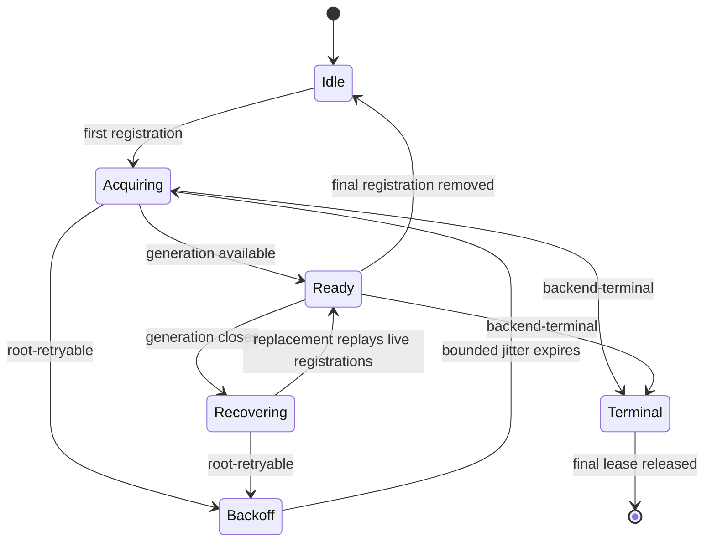

# Watchman clean-slate replacement carrier

## Status and purpose

This is the execution plan for a replacement branch, not another direction
review. The direction is fixed by the 2026-09-03 decision in
[`vision0.gpt56s.md:883-929`](/.design/watchman/vision0.gpt56s.md#L883-L929).
Implementation may refine names and local decomposition, but it must not reopen
backend policy, B2 versus B1/B3, cursor retention, or file routing.

The inherited line has 40 real commits above its declared `43d09b9d75ad` base
before this plan (`d67c5a42c89d` is this document's parent). It tells the
history honestly: process-global ownership was replaced by root ownership,
pre-ack fallback was retained and then rejected, cursors and broad metrics were
added and are now rejected, and several review waves corrected the model. That
history is useful as evidence. It is not a suitable maintained carrier.

The replacement is therefore built from the verified final tree, not by
replaying the 40-commit narrative. Its commits are architectural slices whose
content is already in final form. In particular, no carrier commit introduces
a fallback, cursor, sticky fatal gauge, response-row replay path, or metrics
render mode for a later carrier commit to delete.

## Frozen end state

| Concern | Required final state |
| --- | --- |
| Static selection | Absent or `parcel`: Node files and Parcel directories. `watchman`: Node files and Watchman directories. A Watchman-selected directory never invokes Parcel. |
| Availability | Retry root availability forever with bounded, approximately 30 percent jittered exponential backoff. First acknowledgement is a delivery milestone, never a policy boundary. |
| Root ownership | One supervisor in downstream-only [`root.ts`](/packages/core/src/filesystem/watcher/watchman/root.ts) owns cold acquisition, generation replacement, subscription replay, targeted cancellation recovery, backoff, interruption, and unsubscribe fencing. |
| Failure policy | Explicit `root-retryable`, `subscription-terminal`, and `backend-terminal` dispositions, independent of operation phase. Ambiguous daemon or transport operation failures retry; operation labels remain diagnostics only. |
| Live delivery | A normal unilateral PDU emits exact create/update/delete paths after local ignore filtering. It is never coalesced to the watched root. |
| Continuity loss | Initial-ready, resumed establishment, fresh-instance PDU, canceled PDU, and route change each produce a subtree invalidation. B2 represents it as `{ type: "invalidation", path }` at `Config.changes`; B3 at `Watcher.Update` remains deferred. |
| Establishment | Every establishment obtains a fresh clock immediately before subscribe. Subscribe-response rows are intentionally ignored, response clocks are not stored, and no subscription cursor exists. |
| Initial acknowledgement | Retain the private `WatchInterests.ready` path. Do not add response-row buffering or eager hub attachment merely to remove it; that ordering work belongs with deferred B3. |
| Native inactivity | Unsupported, rejected, and timed-out Parcel/native acquisition is visible as failure, not healthy EOF. An owner can deliberately redemand it. |
| VCS | A VCS-owned `WatchInterests` plan watches the exact target matrix, bypasses broad client ignore policy for those targets, and treats every event as an invalidation followed by metadata re-read. Daemon allowlisting and cross-workspace jj delivery are acceptance gates. |
| Observation | Keep the historical metrics while proving the rewrite, then replace them with compact state-transition observation. Exact output and invalidation output are distinct. |
| Source ownership | Stable, source-owned `WatchInterests.ensure`/`reconcile` remains. It is backend-neutral and independently useful to Parcel. |

The file partition is an invariant, not a fallback. The Node adapter's exact
file behavior at [`watcher.ts:237-253`](/packages/core/src/filesystem/watcher.ts#L237-L253)
has no recursive crawl to amortize, while the current Watchman decorator sends
files directly to it at
[`backend.ts:16-23`](/packages/core/src/filesystem/watcher/watchman/backend.ts#L16-L23).
The replacement names that parameter `files` or `nativeFiles`, never
`fallback`.

## Initial-ack decision

The pre-ack publication defect is resolved by retaining the existing ready
side channel, not by buffering exact rows.

The current generic registry creates the PubSub and waits inside `RcMap.lookup`
for `native.subscribe`
([`watcher.ts:124-160`](/packages/core/src/filesystem/watcher.ts#L124-L160)),
then attaches `Stream.fromPubSub`
([`watcher.ts:179-187`](/packages/core/src/filesystem/watcher.ts#L179-L187)).
A publish from first establishment is therefore unobservable. In contrast,
`WatchInterests` creates its owner queue before acquisition and its private
ready callback writes directly to that queue
([`interests.ts:31-57`](/packages/core/src/filesystem/watcher/interests.ts#L31-L57)).

The final ordering is:

```text
owner creates WatchInterests queue
-> owner starts the physical stream fiber
-> root supervisor registers the interest before acquisition
-> fresh clock + subscribe acknowledgement
-> native.subscribe returns
-> Watcher invokes ready exactly once for this acquisition epoch
-> owner receives watched-root update
-> Config recognizes one of its own watched roots
-> Config emits { type: "invalidation", path: watchedRoot }
-> Agent, Command, and Plugin Source rescan
```

The root must not also publish an initial invalidation into the unattached
PubSub. Subscribe-response rows remain ignored even when the fake daemon
returns them. Later continuity-loss invalidations do use the already-attached
stream. This is the smallest correct B2 implementation and leaves one clean
retirement path: when B3 eventually fixes generic delivery ordering,
`ready` can disappear without changing the tag vocabulary or consumer
switches.

## Failure and delivery contracts

### Failure disposition

The final failure value carries both an operation label for diagnostics and one
of three policy dispositions. No policy branch compares strings such as
`"route"`, `"decode"`, or `"subscribe"`; the current stage union and its
multiple interpreters at
[`schema.ts:60-76`](/packages/core/src/filesystem/watcher/watchman/schema.ts#L60-L76)
and [`root.ts:178-195`](/packages/core/src/filesystem/watcher/watchman/root.ts#L178-L195),
[`root.ts:290-351`](/packages/core/src/filesystem/watcher/watchman/root.ts#L290-L351)
do not survive.

| Disposition | Representative causes | Owner and action |
| --- | --- | --- |
| `root-retryable` | transport creation/unavailability, socket end/error, generation closure, admitted-command timeout, ambiguous daemon callback error | Supervisor closes the generation once, enters bounded jittered backoff, and replays every still-live registration. |
| `subscription-terminal` | invalid local target for the chosen intent, malformed subscription acknowledgement, malformed PDU for one named subscription | Fail and remove that registration; siblings and other roots remain live. |
| `backend-terminal` | missing/invalid transport module, capability or root protocol incompatibility, violated root invariant | Fail the live root visibly and never select Parcel. Terminal state, if retained while leases unwind, exists only for that root and its observation ends with the root. |

Ambiguous operational failures are `root-retryable`. A terminal classification
requires structural evidence; message matching is not evidence. The historical
`state.fatal` at [`root.ts:108-112`](/packages/core/src/filesystem/watcher/watchman/root.ts#L108-L112)
and registry-sticky `fatal` metric at
[`metrics.ts:138-142`](/packages/core/src/filesystem/watcher/watchman/metrics.ts#L138-L142)
and [`metrics.ts:198-200`](/packages/core/src/filesystem/watcher/watchman/metrics.ts#L198-L200)
are replaced by a root-scoped terminal transition whose lifetime is tested.

### Delivery table

| Input or transition | Final output | State retained |
| --- | --- | --- |
| First subscribe response | Ignore rows and response clock; return acknowledgement | No cursor; `ready` emits initial owner invalidation after acquisition returns |
| Re-subscribe response | Ignore rows and response clock | One resumed invalidation; next establishment asks for another fresh clock |
| Normal PDU | Exact mapped paths after local ignores | No PDU clock retained |
| Fresh-instance PDU | Subtree invalidation | No file-row burst and no clock retained |
| Canceled PDU | Immediate subtree invalidation before retry | Registration remains only if still live; successful re-establishment also emits resumed invalidation |
| Route change | Subtree invalidation | New route belongs to the new establishment only |
| Explicit unsubscribe | No invalidation | Registration is removed before best-effort daemon unsubscribe; no recovery path can resurrect it |

Directory create and delete events remain exact live events, including empty
directories. The earlier suggestion to send
`always_include_directories: false` does not survive the corrected finding in
[`review-failure-paths0.gpt56s.md:417-443`](/.design/watchman/review-failure-paths0.gpt56s.md#L417-L443).
Tests must establish the chosen directory behavior instead of assuming Parcel
parity.

## Ownership and carry notation

The commit ladder marks files as follows:

| Mark | Meaning |
| --- | --- |
| **U** | Upstream-owned source hotspot. Re-author against the then-current upstream shape; never transplant a historical whole file. |
| **D** | Downstream-only source file. Textually cheap to carry, though concurrency behavior still needs focused tests. |
| **UT** | Existing upstream-owned test or fixture. Preserve newer upstream assertions and APIs. |
| **DT** | New downstream-focused test. Prefer these for protocol and lifecycle matrices. |
| **M** | Manifest or lockfile integration. Regenerate and inspect rather than copying old lock hunks. |

The known source hotspots are **U**
[`watcher.ts`](/packages/core/src/filesystem/watcher.ts),
[`config.ts`](/packages/core/src/config.ts),
[`skill.ts`](/packages/core/src/config/plugin/skill.ts),
[`routes.ts`](/packages/server/src/routes.ts),
[`options.ts`](/packages/server/src/options.ts), and
[`server-process.ts`](/packages/cli/src/server-process.ts). B2 intentionally
adds **U** Agent, Command, and Plugin Source; the VCS owner intentionally adds
**U** `vcs.ts`. Everything under
[`watcher/watchman/`](/packages/core/src/filesystem/watcher/watchman/) is **D**.

## Upstream freeze and collision correction

The ownership review was correct at its freeze. Against its then-current
upstream, the historical line intersected upstream at `{AGENTS.md, bun.lock}`;
the compose addendum's `98b4d82fcae6` surgery reduces that set to
`{bun.lock}` by retaining only the design-file move. That is the explicit
cleanup checkpoint required before rebuilding.

It is no longer safe to call `{bun.lock}` the live intersection without a
revision qualifier. At this plan's freeze, the shared repository's
`v2@origin` had advanced to `4772b6a3e8c2` with 87 commits after the old
`43d09b9d75ad` base. A raw changed-file intersection with the unclean
historical line is now:

```text
AGENTS.md
bun.lock
packages/cli/src/server-process.ts
packages/core/src/config/plugin/skill.ts
packages/core/src/config.ts
packages/core/src/filesystem/watcher.ts
packages/core/test/config/config.test.ts
packages/core/test/filesystem/watcher.test.ts
packages/core/test/location-layer.test.ts
packages/server/src/routes.ts
```

After the planned excision, `AGENTS.md` disappears but the other nine paths do
not. These are mostly expected upstream evolution, not evidence against the
design. The replacement must preserve upstream's canonical Config discovery
(`473c2925`), routed test watcher (`7aabfd35`), eager config-consumer
subscriptions and source-side debounce (`b45882ec`, `4b6e879b`), plugin graph
changes (`e76e90b7`), server replacement process (`33dd4e3b`), and subsequent
State API changes. This is precisely why the carrier is authored on the
then-current `v2@origin` rather than rebasing old whole-file outcomes.

Before execution, rerun the intersection and semantic collision audit. A
semantic overlap triggers the patch-policy bail-out; a relocated or evolved
upstream seam is adapted in the fresh carrier and recorded.

## Two-pass rebuild method

The requirement to keep metrics through the rewrite and the requirement not to
carry add-then-delete history are reconciled with two separate lines.

### Behavior proof line

Duplicate the clean historical tip and rebase only the duplicate onto the
then-current `v2@origin`, following the duplicate-then-rebase safety precedent.
On that disposable/reference line, implement the decided behavior in the
sequence B2, supervisor, strict selection, fresh-clock invalidation, VCS, then
metrics trim. Keep the current metrics until all deterministic and live gates
pass. This line is a proof artifact and never receives the floating `watchman`
bookmark.

### Final carrier line

Start a separate construction line directly on the same `v2@origin` and
recreate the verified final tree in commits C1-C12 below. Read the proof line
with `jj diff` and `jj file show`; do not use its historical commits as the
substrate. Temporary metrics, cursor code, fallback code, and intermediate
assertions therefore never appear in the carrier DAG. This is the same
recreate-afresh pattern that made the provider-era jj-vcs replacement
self-contained, combined with the patch policy's duplicate-first protection of
the old line.

After every batch, compare the carrier's affected final files to the verified
proof tree. Differences must be attributable to deliberate commit seams,
upstream adoption, or removal of proof-only observation. Unexplained drift
stops promotion.

## Final-state commit ladder

| ID | Commit title | Purpose | Rough changed size |
| --- | --- | --- | ---: |
| C1 | `fix(core): make watcher acquisition failure explicit` | Generic readiness, placement, stream failure, and visible inactive acquisition | 180-260 lines |
| C2 | `refactor(core): reconcile source watch interests` | Backend-neutral source-owned `ensure`/`reconcile` for Config and Skill | 320-500 lines |
| C3 | `fix(core): type config subtree invalidations` | B2 contract and Agent/Command/Plugin Source live-bug fix | 180-300 lines |
| C4 | `fix(core): filter watcher churn consistently` | Shared ignores for both directory backends, isolated from VCS allowlisting | 40-90 lines |
| C5 | `feat(core): watch VCS metadata interests` | VCS-owned exact target matrix and metadata invalidation | 240-400 lines |
| C6 | `feat(core): add Watchman protocol boundary` | Transport, codecs, routing, admitted command deadline, and typed dispositions | 350-520 lines plus lockfile |
| C7 | `feat(core): supervise Watchman roots` | One root lifecycle for first contact and recovery | 550-800 lines including tests |
| C8 | `feat(core): enforce strict Watchman directory selection` | Node-file/Watchman-directory partition with no fallback | 90-170 lines |
| C9 | `fix(core): invalidate Watchman continuity loss` | Fresh-clock establishment, exact PDUs, ignored response rows, all invalidation transitions | 240-400 lines |
| C10 | `feat: expose Watchman backend selection` | Production selector plus the deliberately retained public knobs | 130-220 lines |
| C11 | `refactor(core): narrow Watchman lifecycle observation` | Final transition observer and honest exact/invalidation counts | 160-280 lines |
| C12 | `docs(watchman): document supervised strict backend` | Fold the corpus, final runtime contract, verification record, and supersession map | About 10k folded documentation lines, mostly unchanged evidence |

The sizes are review sizing, not delivery estimates. Tests are included in the
range unless the row says otherwise.

### C1 `fix(core): make watcher acquisition failure explicit`

**Scope.** Establish the smallest generic lifecycle contract needed by every
later owner and backend. Native acquisition no longer returns
`Subscription | undefined`; unsupported, rejected, or timed-out acquisition
fails the physical stream. Runtime callback errors still fail every logical
subscriber sharing the physical key. Private metadata supplies placement and a
once-per-acquisition ready callback. `Watcher.Update` remains the exact Parcel
shape; B3 is not smuggled into this commit.

**Files.** **U** `packages/core/src/filesystem/watcher.ts`; **D**
`packages/core/src/filesystem/watcher/internal.ts`; **UT**
`packages/core/test/filesystem/watcher.test.ts`.

**Historical deletion.** This replaces the inactive `undefined` branch at
[`watcher.ts:149-153`](/packages/core/src/filesystem/watcher.ts#L149-L153)
and the Parcel catch-to-`undefined` path at
[`watcher.ts:283-320`](/packages/core/src/filesystem/watcher.ts#L283-L320).
It keeps the useful placement/readiness/failure seam from `0ec2359f`,
`4d00a833`, `4d338ff1`, and `1c2af67c`, but not their later backend policy.

**Test slice.** Implement M4's active, inactive, and redemand rows; retain
shared-key release, pending-acquisition interruption, and placement-key tests.
Use a controlled Native, not the host Parcel binding.

**Checkpoint.** From `packages/core`: `bun typecheck` and
`bun test test/filesystem/watcher.test.ts`.

### C2 `refactor(core): reconcile source watch interests`

**Scope.** Add owner-local `WatchInterests` with normalized keys,
ensure-before-release reconciliation, owner queues, ready delivery, explicit
physical failure propagation, and a `directoryPlacement: "location" | "exact"`
construction option whose default is `"location"`. Port Config and
ConfigSkillPlugin onto it while
preserving the then-current upstream discovery, eager subscription, debounce,
and State behavior. Config and Skill deliberately redemand a generic inactive
Parcel/native acquisition. They do not loop on a disposition-tagged
backend-terminal failure; Watchman root-retryable failures never escape the
root supervisor later.

**Files.** **D** `packages/core/src/filesystem/watcher/interests.ts`; **D**
`packages/core/src/filesystem/watcher/internal.ts`; **U**
`packages/core/src/config.ts`; **U**
`packages/core/src/config/plugin/skill.ts`; **DT**
`packages/core/test/filesystem/watcher-interests.test.ts`; **UT**
`packages/core/test/config/config.test.ts`; **UT**
`packages/core/test/config/skill.test.ts`.

**Historical deletion.** Fold the durable content of `0ec2359f` and
`4d338ff1`. Do not port wholesale the historical Config and Skill files, which
predate upstream's canonical-path and eager-subscription fixes. No clear-all
Skill watch churn, watch-once stale accumulation, or consumer-authored
Watchman routing survives.

**Test slice.** Unchanged interests retain one physical subscription;
additions start before removals; failed refresh preserves the previous plan;
ready arrives once without blocking the initial scan; a failed physical watch
is redemanded deliberately; missing and symlink sentinels converge; failed
Skill scans keep the last good source snapshot.

**Checkpoint.** From `packages/core`: `bun typecheck` and
`bun test test/filesystem/watcher-interests.test.ts test/config/config.test.ts test/config/skill.test.ts test/plugin/skill.test.ts`.

This slice is independently extractable without Watchman. C5 later depends on
it, but Parcel-only users benefit from stable ownership and visible redemand.

### C3 `fix(core): type config subtree invalidations`

**Scope.** Introduce the B2 Config-local union:

```ts
type Change =
  | Watcher.Update
  | { readonly type: "invalidation"; readonly path: string }
```

Config classifies an update whose path equals one of its own active watched
directory roots as `invalidation`; nested ordinary updates pass through
unchanged. `Config.testLayer` exposes the same contract. Agent, Command, and
Plugin Source switch on the tag: invalidation always makes the relevant
config-root source state unknown and triggers a rescan, while exact updates
keep today's selective path predicates.

The current exact-only contract is at
[`config.ts:35-44`](/packages/core/src/config.ts#L35-L44). Its inherited
consumers currently filter only `update.path` at
[`agent.ts:65-69`](/packages/core/src/config/plugin/agent.ts#L65-L69),
[`command.ts:46-52`](/packages/core/src/config/plugin/command.ts#L46-L52), and
[`source.ts:77-86`](/packages/core/src/config/plugin/source.ts#L77-L86).

**Files.** **U** `packages/core/src/config.ts`; **U**
`packages/core/src/config/plugin/agent.ts`; **U**
`packages/core/src/config/plugin/command.ts`; **U**
`packages/core/src/config/plugin/source.ts`; **UT**
`packages/core/test/config/config.test.ts`; **UT**
`packages/core/test/config/agent.test.ts`; **UT**
`packages/core/test/config/command.test.ts`; **DT**
`packages/core/test/config/plugin-source.test.ts`.

**Historical deletion.** This replaces every fake watched-root event escaping
Config as if it were an exact update. It deliberately does not widen
`Watcher.Update`; the future union in
[`typed-watcher0.glm53.md`](/.design/watchman/typed-watcher0.glm53.md)
uses the same `type: "invalidation"` and `path` fields so these consumer
switches survive B3 unchanged.

**Test slice.** Exact descendant events remain selective. A config-root
invalidation refreshes Agent, Command, and Plugin Source even when Config's
entry list is structurally unchanged. Unrelated exact events still do not
refresh them. These tests are deterministic and repair the live indirect-owner
staleness bug before the Watchman rewrite begins.

**Checkpoint.** From `packages/core`: `bun typecheck` and
`bun test test/config/config.test.ts test/config/agent.test.ts test/config/command.test.ts test/config/plugin-source.test.ts`.

### C4 `fix(core): filter watcher churn consistently`

**Scope.** Retain the independently useful widening from `9d62e280`: `.jj`,
virtual environments, tox, mypy cache, root/deep Watchman cookies, and the
existing generated/vendor trees live in one `Ignore.PATTERNS`. Config and Skill
already consume it from C2. Both Parcel and Watchman apply the same owner intent.

**Files.** **U** `packages/core/src/filesystem/ignore.ts`; **UT**
`packages/core/test/filesystem/ignore.test.ts`; **UT**
`packages/core/test/config/config.test.ts` and
`packages/core/test/config/skill.test.ts` for final owner-input expectations.

**Historical deletion.** Fold `9d62e280` directly, without its documentation
commit or hand-built owner lists. Do not put VCS exceptions into this broad
constant: C5 declares separate exact interests with their own empty or precise
ignore sets.

**Test slice.** Parcel compilation recognizes the new patterns; root-level and
nested cookie forms are covered; normal source paths remain visible. C9 later
proves that Watchman's local matcher consumes this same final vocabulary rather
than adding a second list.

**Checkpoint.** From `packages/core`: `bun typecheck` and
`bun test test/filesystem/ignore.test.ts test/config/config.test.ts test/config/skill.test.ts`.

### C5 `feat(core): watch VCS metadata interests`

**Scope.** Add a VCS-owned helper under the `vcs/` domain and let `vcs.ts`
declare one stable interest plan. It consumes `interests.changes` directly,
debounces a burst, re-reads provider metadata, and republishes the existing VCS
refresh event as an invalidation even when the branch string did not change.
Event payloads are never treated as VCS data.

| VCS | Interest | Adapter and placement |
| --- | --- | --- |
| Git | `<git-store>/HEAD` | Node exact file |
| Git | `<git-store>/packed-refs` | Node exact file |
| Git | `<git-store>/refs/heads` | Directory, forced exact placement |
| Mercurial | `<hg-store>/branch` | Node exact file |
| Jujutsu | `<jj-store>/op_heads/heads` | Directory, forced exact placement; store is the resolved main-repository directory |
| Colocated jj | The applicable Git targets in addition to `op_heads/heads` | Node files plus exact Git refs directory, resolved without a subprocess from `<jj-store>/store/git_target` or the legacy `<jj-store>/store/git` |

File and missing-directory sentinels remain Node-only. Directory targets do
not inherit `Ignore.PATTERNS`; the owner supplies an empty or target-relative
ignore list. The plan does not consult `LocationWatcherPolicy`, so project
`watcher.ignore` values such as `.git`, an absolute store alias, or `.jj`
cannot disable these allowlisted signals. Existing LocationWatcher bus behavior
remains unchanged as an upstream compatibility path, but `vcs.ts` stops
depending on that policy-controlled bus output. Identical exact interests still
share one physical entry in the process-global Watcher registry, so the
compatibility listener does not create a second OS watch for the same file.

**Files.** **D** `packages/core/src/vcs/watcher.ts`; **U**
`packages/core/src/vcs.ts`; **UT** `packages/core/test/vcs.test.ts` and
`packages/core/test/vcs-hg.test.ts`; **DT**
`packages/core/test/vcs-watcher.test.ts`; **UT**
`packages/core/test/filesystem/watcher.test.ts` for LocationWatcher policy
coexistence.

**Historical deletion.** The single HEAD/branch filter in
[`vcs.ts:129-142`](/packages/core/src/vcs.ts#L129-L142) is no longer the owner.
The matrix supersedes HEAD-only behavior and the jj guard described in
[`watches.glm53.md:23-82`](/.design/watchman/watches.glm53.md#L23-L82).
No VCS target is added to a broad project subscription as an ignore exception.

**Test slice.** Assert the complete target matrix, exact placement for both
directory targets, Node dispatch for files, create and delete events under
`op_heads/heads`, no events from excluded churn paths, configured
`watcher.ignore` immunity, and two location contexts sharing one jj store where
an event attributed to workspace B invalidates workspace A's cached VCS info.
The test uses fake stores and `Watcher.Test`; a composed jj-vcs live test is an
additional gate, not a unit-test dependency.

**External gate.** The deployment's watchwoman configuration must allow exactly
`.git/HEAD`, `.git/refs/heads/**`, `.git/packed-refs`, and
`.jj/repo/op_heads/**` while continuing to exclude object, index, log,
working-copy, op-store, and store churn. The responsible repository is an open
ownership item, but the carrier cannot be declared live-verified until this
configuration is installed and tested.

**Checkpoint.** From `packages/core`: `bun typecheck` and
`bun test test/vcs.test.ts test/vcs-hg.test.ts test/vcs-watcher.test.ts test/filesystem/watcher-interests.test.ts test/filesystem/watcher.test.ts`.

### C6 `feat(core): add Watchman protocol boundary`

**Scope.** Add the transport loader, structural raw-client boundary, response
codecs, plain-`watch` routing, generation-local admitted command dispatch, and
the three explicit failure dispositions. The admitted command deadline begins
only after submission; a timeout retires only that generation. Capability and
root-watch response decoding failures are structural backend-terminal failures;
validation of one subscription target or acknowledgement is
subscription-terminal. Callback/transport operation failures are root-retryable
unless the protocol provides an explicit terminal reason.

Project and exact intents both issue `watch <known root>`, never
`watch-project`. No path sends `watch-del`. Daemon unsubscribe remains
best-effort; client registration is authoritative.

**Files.** **D** `packages/core/src/filesystem/watcher/watchman/client.ts`;
**D** `packages/core/src/filesystem/watcher/watchman/schema.ts`; **D**
`packages/core/src/filesystem/watcher/watchman/route.ts`; **M**
`packages/core/package.json` and `bun.lock`; **DT**
`packages/core/test/filesystem/watchman-client.test.ts`.

**Historical deletion.** Fold the transport, plain-watch amendment, admission
gate, timeout evidence, and route isolation from `04d753ad`, `4d00a833`,
`a7b15cf2`, and `6fc4bba4`. Do not carry `WatchmanError.stage`, cursor-related
response fields, a local declaration shim, or a process-global command queue.
The binary override remains because the deployed transport still exposes that
constructor option. Only `commandTimeoutMs` remains a public timing option;
retry scheduling is private and injectable in tests.

**Test slice.** Decode valid and malformed capability/watch/clock/subscribe
responses into the intended disposition; keep admission after caller
interruption; prove an admitted timeout closes one generation; ensure a queued
caller sees generation replacement rather than starting its own response
deadline.

**Checkpoint.** From the repository root run `bun install` once for manifests;
from `packages/core` run `bun typecheck` and
`bun test test/filesystem/watchman-client.test.ts`; then inspect `bun.lock` with
`jj diff --stat` and `jj diff --git -- bun.lock`.

### C7 `feat(core): supervise Watchman roots`

**Scope.** Add one state machine inside downstream-only `root.ts`.
Registrations enter the root map before acquisition. One supervisor fiber owns
the current generation, one shared retry schedule, replay of every live
registration, targeted re-establishment requests, and terminal fan-out.
Registration identity or generation fencing prevents late acknowledgement,
retry, PDU, or best-effort unsubscribe completion from resurrecting a removed
interest.

The supervisor's phases are explicit but not policy inputs:



The carrier version of lifecycle state contains no cursor slot. C9 supplies the
fresh-clock delivery operation; C7's lifecycle tests use the same final
establishment seam without inventing an interim cursor implementation.

**Files.** **D** `packages/core/src/filesystem/watcher/watchman/root.ts`; **DT**
`packages/core/test/filesystem/watchman-root.test.ts`.

**Historical deletion.** Replace `current`, `recoverRoot`, `replacement`,
recursive per-item `reconnect`, the branch-local canceled recovery, and
`state.fatal` at
[`root.ts:178-195`](/packages/core/src/filesystem/watcher/watchman/root.ts#L178-L195),
[`root.ts:299-351`](/packages/core/src/filesystem/watcher/watchman/root.ts#L299-L351),
and [`root.ts:359-437`](/packages/core/src/filesystem/watcher/watchman/root.ts#L359-L437).
Fold the useful root isolation and cancellation content of `04d753ad` and
`4d00a833` into this one implementation. `GenerationClosed.submitted`, first
acknowledgement, and mutable active-state timing are never policy inputs.

**Test slice.** Cover M3's lifecycle rows plus M5 and M6: timing symmetry on
either side of first ack; N cold interests sharing one factory/retry sequence;
an unacknowledged collateral interest following established siblings through
one replacement; root-, target/ack subscription-, and backend-terminal scope;
no sticky ambiguous poison; terminal root lifetime ending with its last lease;
unsubscribe during cold acquisition and recovery; cancellation during
unavailable re-establishment; one root timeout leaving another root live. C9
completes M3 with malformed-PDU subscription scope. Inject a deterministic
backoff sleeper and jitter source. Do not use wall-clock sleeps or random
output.

**Checkpoint.** From `packages/core`: `bun typecheck` and
`bun test test/filesystem/watchman-root.test.ts`.

### C8 `feat(core): enforce strict Watchman directory selection`

**Scope.** Add the private Watchman Native adapter around C7's registry. It
delegates `type: "file"` to the supplied Node-capable native adapter and sends
`type: "directory"` only to Watchman. It contains no catch that can invoke
Parcel, no mixed-backend state, and no promotion bookkeeping. Keep this adapter
directly testable with an injected registry/factory.

This commit precedes C9 as required by the direction decision, but the backend
is not exposed through server/CLI selection until C10. Intermediate carrier
commits are therefore testable without offering a partially completed runtime
mode.

**Files.** **D** `packages/core/src/filesystem/watcher/watchman/backend.ts`;
**DT** `packages/core/test/filesystem/watchman-backend.test.ts`.

**Historical deletion.** Delete the per-interest catch and fallback log at
[`backend.ts:23-31`](/packages/core/src/filesystem/watcher/watchman/backend.ts#L23-L31).
Never import `WatchmanMetrics.fallback`. File delegation survives only as the
intentional type partition.

**Test slice.** A file invokes the Node spy and never the registry; a directory
invokes the registry and never Parcel; initial root unavailability remains
pending under the shared supervisor; interruption releases it; backend-terminal
failure is visible. There is no test parameter that selects a fallback mode.

**Checkpoint.** From `packages/core`: `bun typecheck` and
`bun test test/filesystem/watchman-backend.test.ts test/filesystem/watchman-root.test.ts test/filesystem/watcher.test.ts`.

### C9 `fix(core): invalidate Watchman continuity loss`

**Scope.** Complete establishment and delivery on top of C7-C8. Every initial
or replayed registration runs `clock` then `subscribe`. The response is decoded
only for acknowledgement/warning; fixture rows, response clock, and response
fresh marker are supplied and asserted ignored. Normal PDUs use one exact-row
mapping/filtering path.
Fresh-instance, canceled, resumed, and route-change transitions publish the
watched target for owner mediation. Initial acknowledgement uses only C1-C2's
ready callback.

This is the fresh-clock/cursor-deletion stage in the architectural sequence.
Because this is a final-state carrier, deletion is by omission: C7 did not add
`SubscriptionState.clock`, so C9 adds only fresh establishment and never creates
compatibility, response-clock, or cursor-rejection branches.

**Files.** **D** `packages/core/src/filesystem/watcher/watchman/root.ts`; **D**
`packages/core/src/filesystem/watcher/watchman/schema.ts`; **DT**
`packages/core/test/filesystem/watchman-root.test.ts`; **UT**
`packages/core/test/filesystem/watcher-interests.test.ts`,
`packages/core/test/config/config.test.ts`,
`packages/core/test/config/agent.test.ts`, and
`packages/core/test/config/command.test.ts`; **DT**
`packages/core/test/config/plugin-source.test.ts`; **DT**
`packages/core/test/filesystem/watchman-live.test.ts`.

**Historical deletion.** Do not carry `SubscriptionState.clock`
([`root.ts:31-39`](/packages/core/src/filesystem/watcher/watchman/root.ts#L31-L39)),
route compatibility and cursor-reset handling
([`root.ts:197-270`](/packages/core/src/filesystem/watcher/watchman/root.ts#L197-L270)),
PDU clock assignment
([`root.ts:387-388`](/packages/core/src/filesystem/watcher/watchman/root.ts#L387-L388)),
subscribe-response row replay, or response clock storage. The complete response
fixture exists to prove intentional discard, not to create an exact replay
path.

**Test slice.** Adapt M1 and M2 to the decided contract. A response containing
create/modify/delete rows and `clock: "c:3"` emits no exact rows and cannot make
the next subscribe use `c:3`; the next establishment issues a new `clock`.
Equivalent normal PDU rows emit three exact paths. A response fresh marker does
not add a second signal beyond its initial or resumed establishment
invalidation. Fresh-instance PDU, initial-ready, resumed,
canceled-before-retry, canceled-then-resumed, and route change each produce the
required invalidation. A delayed first acknowledgement after Agent, Command,
and Plugin Source initial scans converges all three. An ignored-only normal PDU
emits neither exact output nor invalidation. Empty directory create/delete
remains observable.

**Live gate.** Start with the daemon absent, establish after it appears,
restart it, write and delete source files during the outage, and prove Config,
Skill, Agent, Command, and Plugin Source converge. Exercise one exact external
root and multiple project roots. The live suite may use bounded test timeouts;
the deterministic unit matrix may not use sleeps for ordering.

**Checkpoint.** From `packages/core`: `bun typecheck`, all Watchman/Watcher and
Config consumer suites, then
`OPENCODE_WATCHMAN_LIVE=1 bun test test/filesystem/watchman-live.test.ts`.

### C10 `feat: expose Watchman backend selection`

**Scope.** Wire the now-complete backend into the generic selector, server
options, route assembly, and CLI environment. A selected Watchman transport
construction failure propagates visibly; the whole-backend catch at
[`watcher.ts:104-115`](/packages/core/src/filesystem/watcher.ts#L104-L115)
does not survive. Absent/`parcel` never imports the transport.

The final public surface is:

| Environment | `ServerOptions` | Decision |
| --- | --- | --- |
| `OPENCODE_WATCHER_BACKEND` | `fs.watcherBackend` | Keep `watchman` or `parcel`; absent means Parcel |
| `OPENCODE_WATCHMAN_COMMAND_TIMEOUT_MS` | `fs.watchman.commandTimeoutMs` | Keep; loaded-host incidents justify it; default remains 60 seconds |
| `OPENCODE_WATCHMAN_BINARY` | `fs.watchman.binary` | Keep while the deployed transport requires its CLI-path constructor option |
| `WATCHMAN_SOCK` | transport-owned | Keep as the transport discovery override; do not duplicate it in ServerOptions yet |
| `OPENCODE_WATCHMAN_RETRY_BASE_MS` / `CAP_MS` | none | Delete publicly; use private deterministic schedule injection in tests |
| `OPENCODE_WATCHER_SUBSCRIBE_TIMEOUT_MS` | none | Delete publicly; Parcel retains an internal acquisition deadline/test seam |
| `OPENCODE_WATCHMAN_METRICS_INTERVAL_MS` / `MODE` | none | Delete; no render scheduler or mode remains |

**Files.** **U** `packages/core/src/filesystem/watcher.ts`; **U**
`packages/server/src/options.ts`; **U** `packages/server/src/routes.ts`; **U**
`packages/cli/src/server-process.ts`; **UT**
`packages/server/test/options.test.ts`; **DT**
`packages/cli/test/server-process-watchman.test.ts`; **UT**
`packages/cli/test/fixture/environment.ts` for ambient-variable scrubbing;
**UT** `packages/core/test/location-layer.test.ts` for the process-global graph
invariant.

**Historical deletion.** Fold the selector from `f63ad64d`, the command timeout
part of `a7b15cf2`, and binary override from `6fc4bba4`. Drop the whole-backend
fallback, public Parcel timeout, public retry tuning, all `84777a2a` metrics
plumbing, and stale option tests. Preserve the process-global Watcher sharing
invariant from `d38bcfe3`, but re-home its assertion to the current graph API
instead of transplanting the old `location-layer.test.ts` block.

**Environment hermeticity.** Extend the existing CLI isolated-process fixture
to scrub every `OPENCODE_WATCHER_*` and `OPENCODE_WATCHMAN_*` variable before a
test applies explicit overrides. For in-process Effect tests, reuse
`packages/core/test/fixture/env.ts`; do not add another generic snapshot helper.
The root/backend unit suites receive options directly and must not read process
environment. `OPENCODE_WATCHMAN_LIVE` remains an explicit opt-in gate and is not
treated as a runtime option.

**Test slice.** Validate absent, Parcel, Watchman, invalid backend, valid and
invalid command timeout, binary override, and ambient-variable isolation. At
the Native boundary, assert every Watchman-selected directory remains Watchman
through delayed first acknowledgement and every file remains Node.

**Checkpoint.** Run Core typecheck and strict-selection suites, then from
`packages/server` run `bun typecheck` and `bun test test/options.test.ts`, and
from `packages/cli` run `bun typecheck` plus the focused startup/options test.
The Core slice includes `bun test test/location-layer.test.ts` for the one
process-global physical Watcher invariant.

### C11 `refactor(core): narrow Watchman lifecycle observation`

**Scope.** On the behavior proof line, this is where the 501-line metrics
module and 244-line renderer test are removed after deterministic and live
verification. In the clean carrier, add only the surviving observation seam:
structured root transitions (`acquiring`, `backoff`, `ready`, `recovering`,
`terminal`, `closed`), subscription transitions (`registered`,
`acknowledged`, `replayed`, `terminal`, `unsubscribed`), command timeout/timing,
and delivery counts split into `exact_updates_out`, `invalidations_out`, and
`ignored_rows`.

Prefer tracing events/spans with an injectable recorder for tests. There is no
periodic console dump, delta-window state, JSON renderer, mode, interval,
registry-sticky channel, cursor display, fallback counter, or fatal gauge. If
an explicit terminal state is observable, its on/off lifetime exactly matches
the live root scope.

**Files.** **D** `packages/core/src/filesystem/watcher/watchman/observation.ts`;
**D** `client.ts` and `root.ts` for event emission; **DT**
`packages/core/test/filesystem/watchman-observation.test.ts`. No server or CLI
file changes.

**Historical deletion.** `3a13e52c` survives only as proved useful command,
generation, transition, and delivery observations. `84777a2a` dies entirely.
The meanings at
[`metrics.ts:12-43`](/packages/core/src/filesystem/watcher/watchman/metrics.ts#L12-L43)
and [`metrics.ts:357-426`](/packages/core/src/filesystem/watcher/watchman/metrics.ts#L357-L426)
do not survive. In particular, `files_in - updates_out` is not called an ignore
drop rate when invalidations also exist.

**Test slice.** Assert the ordered transition sequence for cold retry and
recovery, terminal lifetime ending at root release, and independent exact,
invalidation, and ignored counters. Tests observe behavior through the injected
recorder; they do not parse console JSON.

**Checkpoint.** From `packages/core`: `bun typecheck` and
`bun test test/filesystem/watchman-root.test.ts test/filesystem/watchman-backend.test.ts test/filesystem/watchman-observation.test.ts`, followed by the live suite. Re-run the
loaded-host scenario that justified `commandTimeoutMs` before accepting removal
of any command timing observation.

### C12 `docs(watchman): document supervised strict backend`

**Scope.** Rewrite [`README.md`](/.design/watchman/README.md) as the final
runtime/maintenance record, add this carrier plan, and fold the durable design
and evidence corpus into one trailing docs commit. Mark the pre-decision drafts
and reviews as historical where needed rather than pretending their fallback,
cursor, or metrics recommendations remain current. Record exact final commit
IDs, base, verification counts, live daemon version/configuration, external
allowlist evidence, and known test flakes.

**Files.** `.design/watchman/**` only. The default is to retain the current
corpus in one folded commit because its evidence and links remain useful; it no
longer occupies twenty separate carrier revisions. The old dated bookmarks
remain the authoritative commit-by-commit history.

**Historical deletion.** Collapse all historical docs-only commits into this
one final-state documentation revision. The old process-global design and
root-scoped fallback/cursor design remain cited as superseded evidence, not as
maintained behavior.

**Test slice.** Verify all local links, rerun the full carrier checkpoint below,
and ensure README configuration and metrics tables match C10-C11 exactly.

**Checkpoint.** Run every command under Verification checkpoints, parse the
corpus with `pandoc --from=gfm --to=html`, verify every root-relative target and
line range exists, and attach the live daemon/allowlist results to README.

## Dependency and droppability map

| Commit | Depends on | Extraction or drop property |
| --- | --- | --- |
| C1 | upstream | Generic upstream candidate; no Watchman dependency |
| C2 | C1 | Extractable source-ownership feature usable with Parcel |
| C3 | C2's final root bookkeeping | Extractable Config correctness fix; tag vocabulary already B3-compatible |
| C4 | upstream, with owner wiring in C2 | Independently droppable ignore expansion |
| C5 | C1-C2 | Independently droppable VCS owner usable with Parcel; required by the accepted composite |
| C6 | upstream manifests | Downstream protocol slice; no owner or selector dependency |
| C7 | C6 | Downstream lifecycle slice; no upstream hotspot |
| C8 | C1 and C7 | Strict adapter slice; still private and directly testable |
| C9 | C2-C3 and C7-C8 | Delivery correctness slice; completes the private backend |
| C10 | C8-C9 | Mechanical public selector/assembly slice |
| C11 | C6-C7 and C9 | Independently droppable observation implementation; the final carrier keeps its small accepted form |
| C12 | C1-C11 | Docs-only tip; no runtime change |

Droppable means a reviewer can remove or extract the concern without
untangling unrelated hunks. It does not mean the accepted full composite may
omit C3 or C5; those are required end-state behavior.

## Deterministic test matrix by stage

The M1-M6 names come from
[`review-failure-paths0.gpt56s.md:560-671`](/.design/watchman/review-failure-paths0.gpt56s.md#L560-L671).
Their policy-dependent expectations are replaced by the decided strict/B2
ones below.

| Gate | Carrier stage | Deterministic proof |
| --- | --- | --- |
| M1 batch carrier | C9 | Subscribe response rows, clock, and fresh flag are ignored; its initial or resumed acknowledgement produces exactly the establishment invalidation. A subsequent establishment issues a fresh clock. Equivalent normal PDU rows emit exact create/update/delete paths; a fresh-instance PDU invalidates. |
| M2 pre-ack delivery | C1-C3, C9 | No initial publish is expected from `root.establish`; ready fires exactly once after acquisition returns, Config tags it, and all three indirect owners converge after a delayed first ack. |
| M3 failure disposition | C6-C9 | First root unavailability retries without Parcel; generation closure replays established and unacknowledged collateral interests; backend-terminal is root-scoped; malformed subscribe/PDU is subscription-scoped. |
| M4 Parcel terminal | C1-C2 | Active callback failure fails shared streams; inactive acquisition fails visibly with no false ready; deliberate owner redemand can acquire and produces one ready signal. |
| M5 terminal lease lifetime | C7, C11 | Ambiguous operation error retries and never poisons. An explicitly backend-terminal root remains terminal only while its live root leases unwind; another root remains live; reacquisition after release is fresh; observation lifetime agrees. |
| M6 concurrent acquisition | C7 | N initial registrations share one failed-then-successful retry sequence; N replaying registrations share one replacement; another root is not delayed. |
| Timing symmetry | C7 | The same root-retryable failure immediately before and after first acknowledgement follows the same supervisor transition. |
| Root single-flight | C7 | Cold and recovering registrations have one factory/retry sequence per root intent. |
| Unsubscribe fencing | C7 | Unsubscribe during cold acquisition, backoff, replay, and canceled re-establishment cannot resurrect registration or PDU routing. |
| Cancellation visibility | C9 | Canceled PDU invalidates before retry even when re-establishment is unavailable; successful replay produces its resumed invalidation. |
| Directory semantics | C9 | Empty-directory create and delete are exact live events; ignored-only rows are silent. |
| Static backend partition | C8-C10 | Every file is Node, every Watchman-selected directory is Watchman, and no Parcel spy is invoked on any Watchman directory failure path. |
| Delayed first ack | C3, C9 | Mutate/delete Agent, Command, and Plugin sources after initial scan but before first ack; each final registry equals disk state. |
| Outage convergence | C9 live | Daemon restart plus writes/deletes converges Config, Skill, Agent, Command, and Plugin Source to current state without response-row replay. |
| Root isolation | C6-C7 | An admitted timeout or pending route for root A cannot delay, retire, or terminally mark root B. |
| VCS target allowlist | C5, C9 live | Exact matrix delivers through Parcel and Watchman; create+delete pairs count; object/index/log/op-store churn is silent; project ignore policy cannot disable allowlisted interests. |
| Cross-workspace VCS | C5, composed live gate | A jj operation in workspace B changes `op_heads/heads` and invalidates cached VCS info in a session rooted in workspace A of the same repository. |
| Observation honesty | C11 | Exact paths, subtree invalidations, and ignored rows have independent counts; no cursor/fallback/fatal/render-mode field remains. |
| Environment hermeticity | C10 | Ambient production values for every Watchman knob cannot change defaults in focused CLI/server tests; explicit overrides remain testable. |

Every in-process lifecycle test uses scripted callbacks, Deferred barriers, an
injected sleeper, and a deterministic jitter source. Existing tests that rely
on `Effect.sleep` to guess ordering should be converted while touched. A
bounded timeout around a deterministic barrier is a hang guard, not a scheduler.

## Verification checkpoints

Run from package directories, as required by the maintenance record. The
focused set grows monotonically with the ladder.

```sh
cd packages/core
bun typecheck
bun test test/filesystem/watcher.test.ts \
  test/filesystem/watcher-interests.test.ts \
  test/filesystem/ignore.test.ts

bun test test/config/config.test.ts \
  test/config/skill.test.ts \
  test/config/agent.test.ts \
  test/config/command.test.ts \
  test/config/plugin-source.test.ts \
  test/plugin/skill.test.ts

bun test test/filesystem/watchman-client.test.ts \
  test/filesystem/watchman-root.test.ts \
  test/filesystem/watchman-backend.test.ts \
  test/filesystem/watchman-observation.test.ts

bun test test/vcs.test.ts \
  test/vcs-hg.test.ts \
  test/vcs-watcher.test.ts \
  test/location-layer.test.ts

OPENCODE_WATCHMAN_LIVE=1 bun test test/filesystem/watchman-live.test.ts

cd ../server
bun typecheck
bun test test/options.test.ts

cd ../cli
bun typecheck
bun test test/server-process-watchman.test.ts
```

The named test files are part of the intended carrier shape. The known inherited
`.hg/branch` timeout in combined native runs remains a separate flake unless a
backend-specific reproduction proves otherwise.

Before C11, run the proof line with historical metrics enabled and inspect cold
acquisition, recovery, timeout, and output behavior on the loaded host. After
C11, rerun the same scenario against transition observation. Before C12 and
bookmark promotion, run the complete block above plus these live cases:

```text
delayed daemon start
daemon restart during writes and deletes
many-root cold start and reconnect spread
exact external directory recovery
VCS allowlisted and excluded-path probes
two jj workspaces sharing one op_heads directory
```

The daemon-side allowlist test is not optional and cannot be replaced by a fake
client assertion. A successful subscribe that silently receives no excluded
VCS events is the failure mode the live gate exists to catch.

## Branch mechanics

### 1. Record and quiet the source line

Use `jj` exclusively; this workspace's `.git` is the unrelated beads
repository. Record the full IDs of `v2@origin`, the floating `watchman`
bookmark, all dated Watchman bookmarks, the current real tip, and the empty
working copy. Coordinate the brief bookmark-changing window because another
agent may be updating shared bookmarks. Do not infer state from stale short IDs.

At this document's freeze, local `watchman` and immutable
`watchman-20260903` both point to `fac6e6e5483c`; the B2 decision
`d67c5a42c89d` and this plan are real work above them. Earlier immutable tips
remain `watchman-20260901` at `4bb2c5d8ec36` and `watchman-20260902` at
`be8158a45269`. These IDs are evidence, not execution inputs: re-read the
shared operation state immediately before any bookmark operation.

First fast-forward the floating bookmark over every real source-line commit, as
the work-above-bookmark rule requires. Preserve that complete unmodified tip
with an immutable source snapshot before any surgery. If the ordinary snapshot
name for the execution date already exists, use a clearly suffixed
`watchman-YYYYMMDD-pre-carrier` name; never move or reuse the existing snapshot.

### 2. Excise `98b4d82fcae6` contamination on a duplicate

Duplicate the complete old stack while its source snapshot remains fixed. On
that duplicate only, execute the compose addendum's split-and-abandon procedure
before the upstream rebase:

| Content in `98b4d82fcae6` | Action |
| --- | --- |
| `.design/watch/draft1.gpt56t.md` to `.design/watchman/draft1.gpt56t.md` | Keep as the move-only replacement commit |
| Beads/Dolt tail in `.gitignore` | Drop; store-level exclude owns workspace tooling |
| Upstream `AGENTS.md` deletion | Drop; the replacement inherits current upstream instructions unchanged |

Identify the duplicated `98b4d82fcae6` and its residue by content, not by
assuming which duplicate or split half retains a familiar change ID. Abandon
only the duplicate residue and preserve every duplicated descendant's content
through the automatic rebase. Verify the clean duplicate tip has neither
`AGENTS.md` nor `.gitignore` in the diff from its duplicate of
`cccaa88e239d`, and that the move-only replacement changes only the two design
paths.

`watchman-20260901` and `watchman-20260902` are immutable and remain on the old
line, even though the latter intentionally preserves the contamination. Never
move or rewrite them. `watchman-20260903` and any other dated bookmark already
present at execution are equally immutable. The pre-carrier source snapshot
keeps the complete old tip reachable even if newer source-line docs were above
the latest existing dated bookmark.

Move the floating `watchman` bookmark sideways from the snapshotted source tip
to the clean duplicate tip. It moves again to the final carrier only after all
final gates pass. This preserves the old line rather than rewriting commits
held by dated bookmarks, satisfies the work-above-bookmark rule, and ensures
the floating bookmark never points at a maintained tip contaminated by the
`AGENTS.md`/beads hunks.

### 3. Build the proof duplicate

Duplicate the clean historical line; do not rebase, squash, edit, or abandon
the original source line or any dated snapshot line. Rebase only the proof
duplicate onto the then-current exact
`v2@origin` commit. Resolve only mechanical intersections whose two intents can
be stated. Adopt current upstream structure and re-home the Watchman behavior.
If upstream has landed a competing watcher, source-owner, typed invalidation,
or VCS-owner design, stop under the semantic-collision rule instead of forcing
this plan through.

Implement and verify the behavior sequence on the proof duplicate while its
temporary metrics remain available. Trim them only after the C1-C10 behavior
and live gates pass. Preserve the proof tip with a construction-only reference
until the final carrier parity check is complete; it is not an accepted feature
bookmark.

### 4. Recreate the carrier on current upstream

Create a fresh construction commit directly on the recorded `v2@origin` and
author C1-C12 in order with explicit file lists. Use the verified proof tree as
a reference, not as a parent. Each commit must typecheck and pass its focused
slice before the next begins. Never copy a whole **U** file from the old line;
port the final behavior into the current upstream shape.

The current stack ordering intentionally keeps the Watchman backend private
through C9. Thus C7 supervisor, C8 strict adapter, and C9 fresh-clock delivery
can be reviewed separately without exposing an incomplete configured mode.
C10 is the only production assembly commit.

### 5. Compare and promote

At the final tip:

```sh
jj diff --stat --from v2@origin --to <carrier-tip>
jj diff --name-only --from v2@origin --to <carrier-tip>
jj log --no-graph -r 'v2@origin..<carrier-tip>' \
  -T 'commit_id.short() ++ " " ++ description.first_line() ++ "\n"'
```

Confirm the commit count and titles match C1-C12, every changed file belongs to
the declared inventory, no `AGENTS.md` or beads `.gitignore` hunk appears, and
all final-state Watchman-owned files match the proof tree. Regenerate and
inspect `bun.lock`; it is the unavoidable dependency integration surface, not
a copied conflict resolution.

Only after focused, live, external-daemon, parity, and docs-link checks pass:

```text
create a new immutable snapshot using the actual rebuild date if that name is unused
move only the floating watchman bookmark to C12
leave every old dated bookmark untouched
do not push; the human owns publication
```

## What the new line does not carry

| Historical behavior or artifact | Final disposition |
| --- | --- |
| Process-global Watchman manager/generation/FIFO, demand ledger, notify seconds, root TTL, and `watch-del` | Absent. Root isolation and source ownership survive, not the mechanisms they replaced. |
| Watcher-layer Watchman-to-Parcel construction catch | Deleted. Broken selected transport is backend-terminal and visible. |
| Per-interest Watchman-to-Parcel acquisition catch | Deleted. Retryable acquisition remains Watchman under one root supervisor. |
| Mixed Watchman/Parcel roots and acknowledgement cliff | Impossible by static type/backend selection. |
| Parcel-to-Watchman promotion, reversible bridge, overlap, and handoff machinery | Never implemented. |
| Separate `current`, `recoverRoot`, `replacement`, recursive `reconnect`, and canceled root policy | Replaced by one supervisor. |
| `WatchmanError.stage` as policy, `GenerationClosed.submitted` as policy, and timing-sensitive recovery tests | Replaced by explicit disposition and deterministic scope tests. |
| Generic sticky `state.fatal` and registry-sticky fatal gauge | Deleted. Only structurally backend-terminal root state may live while that root's leases unwind. |
| `SubscriptionState.clock`, compatible-route cursor reuse, cursor rejection/reset, PDU clock storage, response clock storage | Deleted or never introduced. |
| Subscribe-response exact row replay | Intentionally absent. Rows are fixture-supplied and ignored; current-state invalidation is correctness. |
| `always_include_directories: false` proposal | Absent. Exact empty-directory behavior remains tested. |
| Watched-root updates presented as exact events on `Config.changes` | Deleted. Config tags them as `invalidation`. |
| Steady-state PDU coalescing to one watched-root event | Rejected. Live PDUs stay exact. |
| B1 predicate widening and B3 `Watcher.Update` union | B1 rejected; B3 deferred. B2 vocabulary is migration-compatible. |
| File watches routed through Watchman | Rejected. Files remain Node-only. |
| `fallbacks`, cursor, sticky-fatal, and conflated `updates_out` metrics | Deleted. Final observation distinguishes exact and invalidation output. |
| Wide/lines render modes, periodic/final console dumps, interval/mode public options, delta renderer, jq contract | Deleted. OTEL remains a follow-up. |
| Public retry base/cap and Parcel subscribe timeout knobs | Deleted. Deterministic injection remains private to tests. |
| Twenty-plus chronological docs commits | Folded into one trailing corpus/maintenance commit; dated snapshots retain chronology. |
| `AGENTS.md` deletion and beads `.gitignore` additions from `98b4d82fcae6` | Excised before carrier construction. Only the design-file move survives. |

## Historical code-commit fold map

| Historical commit | Content that survives | Carrier home |
| --- | --- | --- |
| `0ec2359fe72f` source watch interests | Stable owner plans, ready replay, normalization | C1-C2 |
| `04d753adef84` root-scoped backend | Transport, route intent, root isolation, exact PDU mapping | C6-C9; fallback/cursor pieces omitted |
| `f63ad64de79d` backend selection | Optional `watchman` or `parcel` selector | C10 |
| `4d00a833ad55` root-owned recovery | Per-root admission, generation isolation, unsubscribe fencing | C6-C7; split paths replaced |
| `4d338ff1268e` source recovery | Deliberate owner redemand and last-good Skill snapshots | C1-C2 |
| `1c2af67c2778` watcher internals | Private metadata and normalized keys | C1-C2 |
| `a7b15cf2ce2e` timeout tuning | Incident-backed command timeout only | C6 and C10; other public knobs omitted |
| `bca61e06becd` reconnect cap | Two-second internal cap | C7 private schedule, not public configuration |
| `6fc4bba444ed` binary override | Transport binary option and useful connection context | C6/C10/C11 |
| `d38bcfe3af2a` watcher sharing test | One process-global physical registry across location graphs | C1/C10, re-authored on current graph APIs |
| `3a13e52cb542` channel metrics | Only proved-useful command, transition, and separated delivery observation | Proof line through C10; final form C11 |
| `84777a2af874` metrics options | Nothing | Not carried |
| `9d62e280938e` ignore widening | Shared cross-backend ignore vocabulary | C4 |

Every documentation commit above those code changes survives, if retained, as
content in C12 rather than as a separate historical refinement step.

## Compose-20260902 relevance audit

Two ideas in the compose report are Watchman-pertinent.

1. The 2026-09-03 `98b4d82fcae6` addendum is directly pertinent and mandatory.
It removes the `AGENTS.md` deletion and beads `.gitignore` additions while
keeping the design move. It also closes the conflict-marker instruction
pollution path for this feature line.

2. Section 1's environment-hermeticity pattern is pertinent to C10. The
current Watchman root/backend tests read explicit constructor options and do
not need global scrubbing, but server startup reads
`OPENCODE_WATCHER_*`/`OPENCODE_WATCHMAN_*` directly at
[`server-process.ts:122-139`](/packages/cli/src/server-process.ts#L122-L139).
The existing CLI `isolatedEnv` spreads ambient `process.env`, so production
Watchman exports can silently alter subprocess defaults. C10 must scrub the
whole knob family before applying test overrides. The existing Core `withEnv`
helper is sufficient for in-process tests; a second general helper would be
churn.

The cache-TTL feature's actual pinned node, TTL source logging, jj-vcs provider
port map, orphaned upstream jj branch, worktree migration, and compose-report
template are not Watchman implementation content. The provider-era observation
is relevant only as current upstream context for C5: author the VCS owner around
the then-current `vcs.ts`, do not port a pre-provider adapter. The general
lesson to freshen before composition is already enforced by this carrier's
baseline procedure. No other compose-20260902 proposal belongs in the Watchman
line.

## Open items this plan does not decide

- Which repository and operator owns the daemon-side watchwoman allowlist. The
  exact allowlist and live acceptance gate are fixed; ownership is not.
- The daemon-side F4 subscribe race in
  [`topic-query0.glm53.md:189-203`](/.design/watchman/topic-query0.glm53.md#L189-L203).
  Fresh-clock invalidation closes client state convergence after acknowledged
  continuity loss, but it does not prove away a daemon event lost inside a
  nominally continuous subscribe boundary. Feed the probe/fix upstream.
- The eventual OTEL successor to the compact transition observer. C11 defines
  honest events and counters, not an exporter.
- Publication of transport declarations and replacement of the dynamic
  structural module check. The current boundary remains until the fork ships
  declarations.
- The B3 migration date. Its triggers remain generic physical reacquisition, a
  second owner requiring native typed invalidation, or preparation of an
  upstream Watcher PR.
- Retirement of `OPENCODE_WATCHMAN_BINARY` after transport/socket discovery no
  longer requires it. The final carrier keeps it for the current deployment.

None of these open items permits fallback, cursor restoration, mixed backends,
or delaying the B2 consumer fix.

## Cross-references

- [`vision0.gpt56s.md`](/.design/watchman/vision0.gpt56s.md) is the governing
  decision record. Its final two addenda fix VCS watching, B2, strict selection,
  supervisor ordering, fresh clocks, cursor deletion, and metrics sequencing.
- [`review-failure-paths0.gpt56s.md`](/.design/watchman/review-failure-paths0.gpt56s.md)
  supplies M1-M6, the pre-ack PubSub proof, inactive Parcel EOF finding, fatal
  lifetime correction, and deterministic barrier requirement mapped here.
- [`review-architecture0.gpt56s.md`](/.design/watchman/review-architecture0.gpt56s.md)
  supplies the one-supervisor boundary and the exact-versus-invalidation
  consumer analysis that makes C3 precede cursor omission.
- [`review-ownership0.gpt56s.md`](/.design/watchman/review-ownership0.gpt56s.md)
  supplies the **U**/**D** carry map, branch lineage warning, historical
  collision result, and downstream code-commit inventory.
- [`review-simplification0.gpt56s.md`](/.design/watchman/review-simplification0.gpt56s.md)
  supplies strict retry-forever policy, deletion inventory, public-knob trim,
  and the compact carrier shape refined here.
- [`watches.glm53.md`](/.design/watchman/watches.glm53.md) defines C5's exact
  Git, Mercurial, and Jujutsu target matrix and the create/delete,
  ignore-allowlist, and cross-workspace gates.
- [`typed-watcher0.glm53.md`](/.design/watchman/typed-watcher0.glm53.md) defines
  deferred B3 and fixes the `invalidation` tag vocabulary used by C3.
- [`files-too0.glm53.md`](/.design/watchman/files-too0.glm53.md) is the evidence
  for the Node-only file partition and against importing daemon failure domains
  into exact file watches.
- [`draft2.gpt56t.md`](/.design/watchman/draft2.gpt56t.md) is the prior carrier
  precedent. Source ownership, root intents, plain `watch`, root admission, and
  client-side unsubscribe survive; pre-ack fallback and cursor recovery do not.
- [`README.md`](/.design/watchman/README.md) records the historical stack,
  verification commands, freshen conflicts, incident-backed command timeout,
  and metrics evidence used before C11.
- [Compose friction 2026-09-02](file:///home/rektide/src/opencode-working/.design/compose-20260902/compose-20260902.glm53.md)
  governs the old-line contamination surgery and motivates C10's ambient-env
  isolation.
- [OpenCode patch policy](file:///home/rektide/a/doc/opencode/patches.md)
  governs current-`v2@origin` baselines, duplicate-before-rebase safety,
  recreate-afresh carriers, work above floating bookmarks, immutable dated
  snapshots, semantic-collision bail-outs, and final verification reporting.
