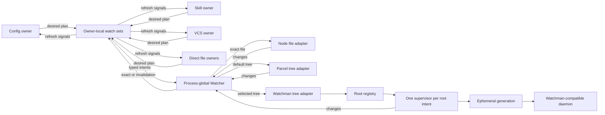
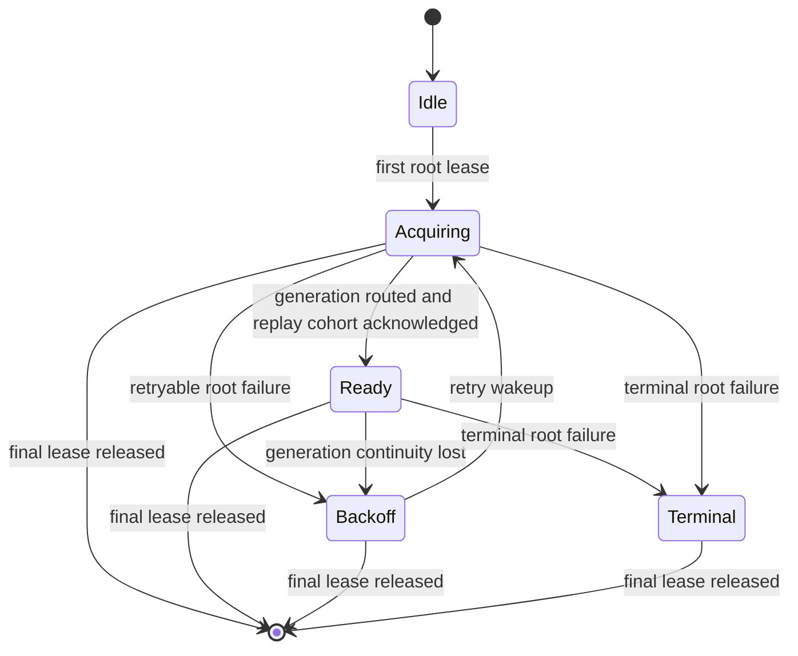

# Watchman remade as continuity-aware filesystem observation

## Status and role

This document describes what the remade project is. It is an architectural
carrier first and a construction guide second. The implementation outline is
deliberately near the end because commit order is not the enduring idea.

The enduring idea is:

> OpenCode state owners declare what can make their state stale. The watcher
> substrate preserves those interests, emits exact changes while observation
> is continuous, emits an explicit invalidation whenever continuity is
> uncertain, and never silently changes the selected backend.

This is not principally a project to connect an OpenCode callback to a
Watchman socket. It is a project to give current-state caches an honest,
supervised observation contract. Watchman is the selected recursive-directory
adapter in one runtime configuration. Node remains the exact-file adapter, and
Parcel remains the default recursive-directory adapter.

[`carrier0.gpt56s.md`](/.design/watchman/carrier0.gpt56s.md) remains the detailed
record of the previous execution plan, historical fold map, and branch
mechanics. This document supersedes it as the intended maintained architecture.
The old implementation line and its dated bookmarks remain evidence; they are
not implementation substrate.

At this document's freeze, local `v2@origin` is
`4772b6a3e8c2eaeb7594503c4584fb225c75bb15`. It contains no competing Watchman
backend, owned-watch module, typed watcher invalidation, or VCS-interest owner.
Execution must resolve and pin the then-current full upstream commit again; the
hash here records provenance rather than creating a floating build base.

## The big picture

OpenCode derives live state from several sources:

- configuration documents and configuration-root topology;
- agents, commands, skills, plugins, and direct entrypoint files;
- VCS metadata such as the active Git worktree, branch refs, and Jujutsu
  operation heads;
- ordinary project files consumed by compatibility listeners and other
  location-scoped modules.

The filesystem and VCS stores are the truth. A watcher event is not the truth.
It is evidence that some owner should reconsider truth it already knows how to
read.

That distinction becomes important as soon as observation can be interrupted.
No watcher can reconstruct a perfect event history across process suspension,
daemon restart, kernel queue loss, target replacement, or a changed watch
route. A system that pretends otherwise accumulates cursors, replay policy,
fallback handoffs, timing cliffs, and untestable combinations. A system that
models uncertainty can say one honest thing instead: the state below this path
is unknown, so read it again.

The remade architecture has three roles:

1. **State owners** know how to scan, parse, cache, and publish domain state.
2. **The watcher substrate** owns durable interests, physical sharing,
   continuity, acquisition ordering, and explicit failure.
3. **Native adapters** translate a platform or daemon into exact changes and
   continuity transitions without taking ownership of domain state.



The central loop is intentionally short: declare interests, observe a typed
change, re-read truth. Complexity belongs behind the watcher and root
interfaces, not in every source owner.

In practical terms, a daemon restart can no longer leave configuration,
skills, agents, commands, plugins, or VCS metadata silently stale. OpenCode can
continue from its initial source read while a daemon is absent, then converge
when observation becomes usable. Operators see the selected backend retry or
fail; they do not discover later that an invisible fallback changed the runtime.

## Why Watchman remains

The retained value of Watchman is not that it emits a different JavaScript
event shape from Parcel. It is daemon-root sharing.

A recursive project tree is expensive to discover, index, and keep attached to
kernel notifications. A long-lived daemon can amortize that work across several
OpenCode processes, sessions, subagents, and unrelated tools that ask for the
same root. Individual OpenCode processes retain only their subscriptions and
domain state instead of each owning another recursive crawl.

That leverage exists for directory trees. It does not exist for one exact file,
which is why the file partition is architectural rather than an adapter
limitation.

Watchman also introduces costs that an in-process Parcel adapter does not:

- external daemon discovery and compatibility;
- socket and command lifecycles that can fail independently of OpenCode;
- root routing and shared-generation recovery;
- an acknowledgement boundary between current-state scans and live delivery;
- operational dependence on daemon root policy and resource health.

The remade project earns those costs by containing them in the Watchman
adapter and root supervisor. It does not spread daemon concepts into source
owners or exact-file watches. Parcel remains the zero-configuration default;
Watchman remains an explicit operational choice for environments where shared
recursive roots repay the additional lifecycle.

## What starting afresh means

The historical line learned useful facts by accumulating mechanisms:
process-global ownership became root ownership; fallback acquired an
acknowledgement cliff; cursor recovery exposed response and retention
ambiguities; broad metrics made those states visible; review then rejected
several of the mechanisms.

That history is valuable because it identifies real failure modes. Replaying it
would be harmful because it would make temporary answers part of the maintained
line again.

Starting afresh from `v2@origin` means all of the following:

- Build one implementation directly on a pinned upstream revision.
- Do not rebase the historical implementation as a proof line.
- Do not port whole upstream-owned files from the old tree.
- Use old source and tests as evidence from which to extract invariants,
  fixtures, and protocol quirks.
- Introduce each module in its intended final shape rather than add and later
  delete fallback, cursor, readiness, or metrics machinery.
- Keep the historical line immutable and move the floating feature bookmark
  only when the replacement passes its final gates.

If temporary legacy metrics are needed for a loaded-host comparison, they
belong in a disposable child of the actual new implementation. A second
independently ported implementation is not an oracle for the first.

## Architectural promotion from carrier0

This document deliberately changes several choices in the previous carrier.
The changes are not incidental refinements; they remove seams that would
otherwise be known migration debt on the first day of the rebuild.

| `carrier0` position | Remade position | Reason |
| --- | --- | --- |
| Config-local B2 invalidation and private `ready` delivery | Watcher-level typed invalidation with ordered stream attachment | Generic recovery and multiple invalidation-native owners satisfy B3's recorded revisit triggers. |
| Source owners redemand failed Node/Parcel watches | One generic physical-watch lifecycle owns retryable Node/Parcel reacquisition | A caller should not know how a physical adapter failed or duplicate retry loops. |
| Hidden placement and readiness symbol metadata | Typed internal watch intent | Placement affects sharing and failure domains and must be visible at its seam. |
| Fresh `clock` for every replayed subscription | One fresh generation clock for the replay cohort; a later registration gets its own clock | Fewer serialized commands and fewer opportunities for one timeout to restart every sibling. |
| Three dispositions combine scope and policy | Failure scope and recovery are independent fields | A root-wide failure is not necessarily terminal, and a backend-terminal failure is not root state. |
| VCS exact placement plus mandatory daemon allowlist | Exact VCS directory roots with a direct delivery gate | An exact root does not contain `.git` or `.jj` as a root-relative component, so broad-root pruning is not on that path. |
| `vcs.branch.updated` reused as coarse metadata invalidation | A separate honest full-metadata update or invalidation | Branch patching cannot represent conflict, label, workspace, or distance changes. |
| Required late observation module | Narrow tracing at the protocol, supervisor, and watcher dispatch seams from their introduction | Diagnostics should describe the actual final lifecycle and must not be retrofitted after exposure. |
| Two implementation lines and final tree parity | One carrier plus executable behavioral contracts | Independently ported trees can agree and still be wrong; convergence scenarios are the oracle. |

The B2 choice in
[`vision0.gpt56s.md`](/.design/watchman/vision0.gpt56s.md#L883-L905) was explicitly
deferred rather than permanent. Its revisit triggers were generic physical-watch
recovery, a second invalidation-native owner, and preparation for an upstreamable
watcher change. This rebuild includes all three. B3 is therefore not scope
creep around the old decision; it is the planned point at which that decision
expires.

## Design axes

The architecture can be understood as a set of explicit choices. These axes
are the compact map for the detailed sections that follow. The selected side is
normative; names and internal decomposition remain implementation freedoms.

| Axis | Selected position | Rejected or avoided position | Architectural consequence |
| --- | --- | --- | --- |
| **Truth** | Filesystem and VCS state are truth; domain owners re-read them. | Treat watcher events or daemon responses as durable domain state. | Watch events trigger refresh but never replace source parsing or metadata queries. |
| **Information** | Exact changes and subtree invalidations are distinct tagged values. | Encode uncertainty as a fake exact update at the watched root. | Selective refresh remains possible during continuity, while recovery can request an honest rescan. |
| **Initial ordering** | Attach each logical subscriber before acquisition; give every new subscriber an initial invalidation once its physical entry is active. | Publish during `RcMap` acquisition or use a private `ready` side channel. | Initial and late-joining owners cannot miss the scan-to-subscription gap, even when sharing an existing physical watch. |
| **Backend selection** | Node handles files; one explicitly selected adapter handles directory trees. | Runtime Watchman-to-Parcel fallback, promotion, overlap, or handoff. | Backend choice is stable for the process and failure cannot silently alter runtime semantics. |
| **Placement** | Project placement shares a recursive root; exact placement gives an external tree its own root. | Infer placement inside a backend or force every target under the current project. | Sharing and failure domains are visible in typed intent data. |
| **Plan ownership** | Each state owner declares a complete desired watch plan; an owner-local watch set reconciles it. | Let consumers choose routes or manually add and remove physical subscriptions. | Domain topology remains local while lifecycle mechanics are implemented once. |
| **Physical sharing** | A process-global Watcher deduplicates normalized physical intents. | One native watch per session, location, or owner. | Equivalent interests share acquisition and resources without sharing domain state. |
| **Generic recovery** | The process-global Watcher owns retryable Node/Parcel physical reacquisition. | Config, Skill, LocationWatcher, and direct-file owners each run redemand loops. | Every direct consumer receives the same continuity behavior and terminal failures do not spin. |
| **Watchman recovery** | One supervisor per root owns daemon acquisition, generation replacement, replay, and backoff. | Per-registration reconnect recursion or a process-global command/recovery manager. | Registrations on one root recover together while unrelated roots remain isolated. |
| **Lifecycle identity** | Owner interests and root registrations are durable; generations are disposable and fenced by epochs. | Let connection objects or subscription names become durable ownership. | Late acknowledgements, PDUs, retries, and unsubscribe completions cannot resurrect released demand. |
| **Failure policy** | `scope`, `recovery`, and diagnostic `operation` are independent facts. | Infer retry or terminal policy from operation-stage strings. | The smallest trustworthy scope is disturbed, and first acknowledgement never creates a policy cliff. |
| **Clocking** | One fresh clock seeds a replacement generation's replay cohort; registrations outside the cohort get their own fresh clock. | Retained per-subscription cursors or one extra clock command for every replayed registration. | Establishment remains cursorless while reducing serialized command and timeout exposure. |
| **Establishment data** | Subscribe responses acknowledge establishment; rows, response clocks, and response fresh markers are ignored. | Replay response rows as an event-history reconstruction. | Post-ack invalidation and current-state reads provide correctness with less retained protocol state. |
| **Live delivery** | Normal directory PDUs emit exact create, update, and delete paths after local filtering. | Coalesce every live PDU into a root invalidation. | Steady-state consumers retain precise and selective behavior. |
| **Overload** | Loss of exact delivery capacity becomes an invalidation. | Drop events silently or let callback queues grow without an explicit policy. | Resource pressure degrades precision, not correctness. |
| **VCS ownership** | The selected VCS provider declares backend-neutral metadata targets; the VCS owner reconciles and interprets them. | Hardcode Git, Mercurial, or jj semantics in the Watchman backend. | Git worktree topology and jj store resolution evolve independently of daemon lifecycle code. |
| **VCS placement** | Metadata files use Node; metadata directories use exact tree roots. | Depend on broad project subscriptions surviving `.git` or `.jj` pruning. | VCS freshness bypasses broad client ignores and does not require a daemon smart-filter release. |
| **VCS publication** | Publish an honest full-metadata update or invalidation; keep `BranchUpdated` branch-specific. | Re-emit a branch-only event when non-branch metadata changed. | Clients refresh labels, conflicts, workspaces, and other metadata without corrupting richer VCS state. |
| **Observation** | Emit narrow tracing at the native, dispatch, generation, and supervisor seams from their introduction. | Maintain a parallel metrics state machine, renderer modes, sticky gauges, or a late instrumentation retrofit. | Diagnostics follow the same ownership boundaries as behavior and never become policy input. |
| **Carrier construction** | Author one final-form implementation directly on a pinned `v2@origin`. | Rebase a historical proof implementation and independently recreate it again. | Executable convergence contracts, not textual parity between two ports, are the oracle. |

These choices reinforce one another. Typed invalidation makes cursorless
recovery and safe overload possible. Static selection makes failure visibility
meaningful. Typed placement enables both project-root sharing and exact VCS
roots. Durable interests plus disposable generations make one root supervisor
possible. Removing any one choice should be treated as an architectural change,
not a local implementation shortcut.

## System promises

The remade system makes a small set of promises that state owners and operators
can rely on.

| Promise | Meaning |
| --- | --- |
| Initial truth is independent of watcher availability | State owners can complete their initial read while a retryable watch acquisition remains pending. |
| Continuous observation is precise | Directory backends retain exact create, update, and delete paths after local ignore filtering; the Node file adapter reports its one exact target as updated. |
| Uncertainty is explicit | Acquisition and continuity transitions emit a tagged invalidation, never a fake exact update. |
| Current state converges | After an unavailable backend becomes usable, every affected owner receives a reason to re-read current truth. |
| Selection is static | A Watchman-selected directory never invokes Parcel because of timing or failure. |
| Files avoid daemon failure domains | Exact files and sentinels remain on the Node adapter under every directory-backend selection. |
| Retry has one owner | No failure is retried independently by the root supervisor, generic watcher, and source owner. |
| Root failures are isolated | One root's timeout, malformed response, or retry schedule cannot retire or delay another root. |
| Release is authoritative | Once an interest is released, late acknowledgement, PDU, retry, or unsubscribe completion cannot resurrect it. |
| Terminal loss is visible | Unsupported or structurally incompatible observation never looks like healthy end-of-stream. |
| Explicit rollback works | An operator can restart with Parcel selected; the runtime never performs that policy change implicitly. |

The contract does not promise a complete historical event log, exactly-once
notifications, or a faithful reconstruction of every intermediate filesystem
state. Those are different products. This substrate serves owners whose truth
can be re-read.

## Shared language

| Term | Meaning |
| --- | --- |
| **State owner** | A module that knows how to derive one domain's current state and owns the decision to refresh it. |
| **Interest** | A durable declaration that a path can make an owner's state stale. |
| **Watch plan** | The complete desired set of interests for one owner at one point in time. |
| **Watch set** | The owner-local module that reconciles a desired plan with live logical subscriptions and aggregates their changes. |
| **Logical subscription** | One caller's scoped attachment to a shared physical watch. |
| **Physical watch** | One shared native observation acquired for a normalized intent key. |
| **Watch intent** | A typed request containing target kind, path, ignores, and directory placement. |
| **Root intent** | The project or exact directory for which one Watchman root supervisor owns a lifecycle. |
| **Registration** | One normalized physical directory subscription retained by a root supervisor; it can serve several equivalent owner interests through the process-global registry. |
| **Lease** | The scope that keeps a physical watch, root, or registration alive. |
| **Generation** | One ephemeral raw client connection, command admission gate, route, and PDU listener set for a root. |
| **Replay cohort** | The registrations present when a replacement generation becomes routable and which can share one fresh clock. |
| **Acquisition epoch** | A period of usable physical observation beginning with acknowledgement and ending when continuity is lost or the lease is released. |
| **Exact change** | A create, update, or delete known to concern one path. |
| **Invalidation** | A statement that current state at or below a path is unknown and must be re-read. |
| **Continuity loss** | Any transition after which exact events alone cannot prove current state. |

The distinction between an interest, a logical subscription, a physical watch,
a registration, and a generation is load-bearing. An interest belongs to a
source owner. Its logical subscription is one lease on a physical watch.
Several equivalent subscriptions can share that physical watch, whose Watchman
adapter owns one root registration. That registration can be replayed onto many
generations. A generation is always replaceable.

## Interfaces and module depth

The interfaces below are conceptual TypeScript, not a commitment to exact
names. They show what callers should and should not need to know.

| Concern | Sole owner |
| --- | --- |
| Desired paths, source ignores, and semantic refresh | State owner or selected VCS provider |
| Desired-plan reconciliation and owner-local failure suppression | Watch set |
| Physical-key normalization, sharing, logical attachment ordering, and generic Node/Parcel reacquisition | Process-global Watcher |
| File versus selected directory adapter dispatch | Watcher composition |
| Watchman root availability, generation replacement, and registration replay | Root supervisor |
| Raw-client command admission and subscription-name dispatch | Generation |
| Watchman response and PDU structure | Protocol codecs |
| Config, Skill, Plugin, or VCS state interpretation | Corresponding state owner |

```ts
type Change =
  | { readonly type: "create" | "update" | "delete"; readonly path: string }
  | { readonly type: "invalidation"; readonly path: string }

type WatchIntent =
  | { readonly kind: "file"; readonly path: string }
  | {
      readonly kind: "tree"
      readonly path: string
      readonly placement: { readonly type: "project"; readonly root: string } | { readonly type: "exact" }
      readonly ignore: readonly string[]
    }

interface Watcher {
  readonly changes: (intent: WatchIntent) => Stream<Change, WatchFailure>
}

interface WatchSet {
  readonly changes: Stream<Change | InterestFailure>
  readonly reconcile: (desired: readonly WatchIntent[]) => Effect<void>
}
```

The important properties are smaller than the sketches:

- `Watcher` exposes a scoped stream, not a manual readiness callback plus an
  unsubscribe promise.
- The native callback seam remains internal. Production adapters and scripted
  test adapters justify it; source owners never see it.
- `WatchSet.reconcile` is the owner interface. `ensure`, key normalization,
  fiber maps, sentinels, and ensure-before-release ordering are implementation.
- A terminal physical stream becomes an attributed watch-set failure rather
  than ending the aggregate change stream and hiding still-live siblings.
- Placement is data at the watcher seam because it changes physical sharing
  and which root owns failure.
- Backend-specific root phases, clocks, subscription names, and retry counters
  do not escape through either interface.

Deleting `Watcher` should force physical sharing, ordered acquisition, and
adapter selection into every owner. Deleting `WatchSet` should force plan
reconciliation and failure tracking into Config, Skill, VCS, and direct-file
owners. Both modules therefore earn their interfaces rather than pass calls
through.

## Source ownership and plan reconciliation

State owners retain domain authority. The watcher substrate must never parse a
configuration file, infer a VCS branch from a filename, mutate a skill registry,
or decide whether two domain snapshots are equivalent.

An owner follows this loop:

1. Start its change observer before or together with its first discovery.
2. Read current source state.
3. Derive the complete desired watch plan from that state and its known
   sentinels.
4. Reconcile additions before releasing obsolete interests.
5. On an exact change, use selective refresh where the domain can do so
   safely.
6. On invalidation, consider the affected subtree unknown and perform the
   corresponding domain rescan.
7. Publish semantic domain changes only after deriving them from source truth.

| Owner | Exact change | Invalidation |
| --- | --- | --- |
| Config discovery | Reload and reconcile from the affected source path | Rediscover the invalidated config extent and reconcile the complete plan |
| Agent, Command, and Plugin Source | Retain current selective path predicates | Treat every relevant descendant as unknown and rebuild that domain source |
| Skill | Refresh the affected source plan according to its existing debounce | Rescan the invalidated skill source extent |
| VCS | Debounce and re-read provider metadata | Debounce and re-read provider metadata |
| Direct file owner | Re-read the exact file | Re-read the exact file because its state is unknown |

`Config.changes` carries the watcher-level union through to its domain owners.
Config does not recognize invalidation by comparing a path with a private set
of roots; the producer's tag is already authoritative.

Config, Skill, and VCS plans evolve. Direct files can appear or disappear;
symlinks can retarget; a config directory can be deleted and recreated; a Git
worktree can point at a different administrative directory; a jj workspace can
resolve to another main repository. Plan reconciliation must preserve the
sentinels needed to observe those transitions.

Failed domain scans retain the last good domain snapshot and the previous
working plan. A newly derived plan is not committed halfway. If one newly
desired interest fails terminally, the failure is visible and that exact input
is not spun in a yield-only redemand loop. It can be attempted again when the
desired input or relevant topology changes.

Reconciliation records demand and starts acquisition fibers; it does not wait
for every physical acknowledgement before allowing the owner to publish its
initial source-derived state. The later acquisition invalidation closes that
scan-to-observation gap.

The owner asks to observe a path. It does not ask for Watchman, Parcel, a root
connection, or a fallback policy.

## Typed continuity

### Exact changes and invalidations are different information

An exact change says that one path changed in one known way. An invalidation
says the system cannot safely identify every changed descendant. They may cause
the same owner to rescan, but they are not interchangeable facts.

The invalidation path is the highest interest target whose current state is
unknown. It is never a guessed descendant and never encoded as
`{ type: "update", path: watchedRoot }`.

This distinction keeps normal operation efficient. A live PDU remains a set of
exact paths, allowing Agent, Command, Plugin Source, and compatibility listeners
to retain selective behavior. Coarse invalidation is reserved for acquisition,
recovery, daemon-declared discontinuity, and overload where exactness cannot be
guaranteed.

### Acquisition ordering is part of the contract

The historical watcher creates its PubSub, awaits native acquisition inside an
`RcMap` lookup, and attaches the logical stream afterward. A callback published
during acquisition can therefore disappear. The private `ready` callback was a
side channel around that ordering defect.

The remade watcher reverses the dependency:

```text
allocate the physical entry and output channel
-> attach the logical subscriber
-> begin native acquisition
-> retain or subsume any pre-ack exact callbacks
-> acknowledge the acquisition epoch
-> enqueue invalidation as the epoch's first observable fact
-> deliver subsequent exact changes
```

The same ordering applies to initial acquisition and generic Node/Parcel
reacquisition. A backend does not need to publish a fake exact update to signal
readiness. `ready` and its symbol metadata do not exist.

A logical subscriber joining a physical entry that is already active also
receives an initial invalidation after its own stream attachment. It must not
wait for another physical acquisition to close its scan-to-subscription gap.
Initial invalidation is therefore a logical-subscription promise as well as a
physical-acquisition transition.

Pre-ack exact callbacks may be delivered after the invalidation or subsumed by
it. They may not appear before the epoch invalidation, and they may not be
silently treated as sufficient proof of continuity. A post-ack rescan provides
the authoritative current state.

### Invalidation is idempotent, not a counting protocol

Consumers must tolerate duplicate invalidations. Independent causes can be
meaningfully distinct: a canceled PDU invalidates immediately, and successful
re-establishment invalidates again because more changes may have occurred while
the backend was unavailable.

Each logical subscriber receives one invalidation when it attaches to an active
physical entry. Every subscriber already attached receives one when that
physical entry reacquires. A route change during Watchman replay is covered by
the replay invalidation rather than requiring a duplicate event. Tests assert
ordering and convergence, not an incidental total count across independent
causes.

### Backpressure cannot become silent staleness

Native callbacks cannot generally wait for a slow consumer. Whatever queueing
strategy the implementation chooses, saturation must not silently discard an
exact event while claiming continuity. If exact delivery cannot be retained,
the safe degradation is one invalidation for the affected interest. Overload is
a form of continuity loss.

The precise queue capacity and coalescing mechanism are implementation choices.
The no-silent-loss rule is architectural.

### The compatibility bus stays honest

The watcher-level union is an in-process contract. Current LocationWatcher
usage observes an exact Git or Mercurial metadata file through Node. An
invalidation for that exact file can conservatively publish the existing
file-level `change` event for the same path because there is no unknown
descendant scope.

A future directory consumer of the filesystem bus may not translate a subtree
invalidation into an exact `change` at the directory path. It must either
consume the watcher union directly, perform its own rescan before publishing
semantic state, or add an explicit invalidation member to the bus schema. B3
must not reintroduce B1 one layer later.

## Static adapter selection and placement

The runtime selects one recursive-directory adapter. Selection is configuration,
not a state transition.

| Runtime selection | File intent | Project tree | Exact tree |
| --- | --- | --- | --- |
| absent or `parcel` | Node | Parcel | Parcel |
| `watchman` | Node | Watchman | Watchman |

Explicitly disabling file watching remains a separate configuration policy. It
means that owners run without live observation; it is not represented as a
native adapter that failed acquisition or ended its stream successfully.

Files remain Node-only because there is no recursive crawl to amortize and
because Watchman-compatible daemons accept directory roots, not file roots.
Routing a file through Watchman would actually create a filtered directory
subscription and import daemon connection, command, timeout, and recovery
failure domains into the cheapest watch primitive. The evidence is summarized
in [`files-too0.glm53.md`](/.design/watchman/files-too0.glm53.md#L126-L180).

The Node adapter may report `update` for creation, replacement, or deletion of
its exact target. That is still exact-path evidence: the file owner re-reads the
one path rather than relying on the event kind as source truth.

Directory placement serves a different purpose from backend selection:

- **Project placement** lets multiple interests under one project share one
  watched root and generation.
- **Exact placement** watches the target directory as its own root. It is used
  for external source roots and small VCS metadata directories whose stores can
  lie outside the current project.

An exact placement is deliberate root multiplication. It is not fallback and
does not create handoff state. Roots are expensive relative to subscriptions,
so project placement remains the normal source-tree path; exact roots are used
where sharing under the project would be incorrect.

When Watchman is selected and unavailable, directory acquisition remains on
the Watchman path. Initial domain reads can still complete, but hot reload is
degraded and visibly retrying. If an operator wants Parcel, the operator changes
configuration and restarts. There is no automatic bridge, overlap period,
promotion, or mixed per-interest backend state.

Absent or Parcel selection does not import or construct the Watchman transport.
A selected transport that cannot be loaded fails visibly at backend
construction rather than being caught and replaced.

## Process-global sharing and owner-local plans

The `Watcher` registry is process-global. Equivalent normalized intents share
one physical watch across locations, sessions, subagents, and state owners.
Its key includes every fact that changes physical behavior: target kind,
resolved target, normalized ignores, and directory placement.

The watch plan is owner-local. Two owners can desire the same intent and share
its physical entry without sharing domain state, debounce policy, or refresh
logic. Releasing one lease does not disturb another.

This division gives both useful kinds of locality:

- physical acquisition, failure, and release are fixed once for every caller;
- source parsing, refresh, and semantic publication remain beside the domain
  that understands them.

No idle TTL or automatic daemon-root pruning belongs in this client. The
physical entry closes when its final client lease closes. The daemon may retain
or garbage-collect its own root according to daemon policy. Production code
never sends `watch-del`.

## The Watchman root module

### One supervisor is the lifecycle authority

One root supervisor owns all mutable lifecycle state for one root intent:

- cold generation acquisition;
- capability and route establishment;
- a generation-local admitted command sequence;
- registration and replay;
- root-wide retry and backoff;
- targeted subscription cancellation recovery;
- terminal fan-out at the correct scope;
- interruption and final release;
- unsubscribe and late-result fencing.

It is not a collection of independent reconnect helpers. A serialized mailbox
or equivalent single-owner loop receives registrations, releases, generation
results, command outcomes, PDUs, and retry wakeups. Effects may run
concurrently, but their results re-enter that owner with generation and
registration tokens. The owner discards stale results.



`Recovering` can be an observation label, but it does not need a second
recovery implementation. Cold acquisition and replacement use the same
supervisor path. The same retryable failure immediately before and after a
first subscription acknowledgement receives the same policy.

### Registrations precede acquisition

A registration enters the supervisor's authoritative map before generation
acquisition begins. Concurrent cold registrations therefore share one factory
and retry sequence. Registrations arriving during backoff join the desired
set; they do not start their own root loops.

Release removes the registration from that map before any best-effort daemon
unsubscribe. A generation epoch and per-registration version fence every
acknowledgement, PDU, retry result, and unsubscribe completion. Once removed, a
registration cannot be replayed or resurrected.

A daemon unsubscribe failure after local removal is diagnostic only. It does
not restore the registration or retire an otherwise healthy generation; ending
the raw client eventually removes every daemon-side subscription in that
generation.

### Generations are disposable

A generation owns one raw client, one command admission gate, one resolved
route, one closure signal, and the subscription-name dispatch table for that
client. It owns no durable source intent.

Route establishment uses plain `watch <known root>`, never `watch-project`.
Project grouping has already been decided by the typed placement intent; daemon
marker discovery must not silently widen it. Exact roots must remain exact.

The command deadline starts only after a command is admitted to the raw client.
A caller waiting behind another command does not consume a response deadline
for a request that has not been submitted. An admitted timeout retires that
generation once. Queued and active registrations then follow the root
supervisor rather than creating independent recovery.

Separate roots have separate supervisors and generations. A blocked or timed
out root cannot create head-of-line blocking for another root.

### Backoff is root policy

Retryable root unavailability uses bounded, jittered exponential backoff and
continues while at least one root lease remains. Delay and jitter sources are
injectable for deterministic tests; retry constants are private runtime policy.

The exact reset point can be chosen with the implementation, but it must be one
root-level generation milestone and not the acknowledgement timing of an
arbitrary first registration. The policy must avoid both a sticky historical
attempt count after a healthy generation and a tight loop around a transport
that accepts and immediately dies.

## Cursorless establishment and delivery

The module is designed for current-state convergence rather than historical
event replay. Per-subscription clocks are therefore not durable state.

When a generation becomes routable:

1. Snapshot the currently live replay cohort.
2. Obtain one fresh clock for the generation root.
3. Subscribe every cohort registration from that clock using its own relative
   root and expression.
4. Treat each subscribe response as acknowledgement and warning metadata.
5. Ignore response rows, response clocks, and response fresh markers.
6. Complete a first physical acquisition, or emit a replay invalidation for a
   registration whose physical stream was already established.

A registration outside that snapshot, including one that arrives while the
cohort is replaying, obtains a new fresh clock immediately before its own
subscribe once the generation is ready. The shared cohort clock is an
optimization for replacement, not a cursor retained across generations.

The post-ack invalidation covers the interval between the clock, subscribe,
daemon-side initial query, and observable acknowledgement. Reading current
state after acknowledgement also closes the Watchwoman subscribe-receiver race
described in
[`topic-query0.glm53.md`](/.design/watchman/topic-query0.glm53.md#L189-L203):
the application read happens after the command has completed, not inside the
daemon's uncertain transition.

Exactly one layer emits each acknowledgement invalidation. On first physical
acquisition, the root completes the Native acquisition and the generic Watcher
marks the entry active and invalidates every already-attached logical
subscriber. A later logical subscriber to that active entry receives its own
initial invalidation from Watcher. On replay inside the same retained physical
watch, generic acquisition does not run again, so the root supervisor enqueues
the registration's replay invalidation for all attached subscribers. These
paths share one observable contract without double-publishing the same cause.

Normal unilateral PDUs retain exact rows. Response rows do not. The distinction
is intentional:

- response rows belong to establishment, where the owner is already required
  to re-read current state;
- live PDU rows belong to a continuous epoch, where exact paths preserve
  efficient selective refresh.

| Input or transition | Output | Retained state |
| --- | --- | --- |
| Initial physical acknowledgement | Invalidation for the interest target | Acquisition epoch only |
| Logical subscriber joins an active physical watch | Initial invalidation for that subscriber | Existing acquisition epoch is shared |
| Watchman replay acknowledgement | Invalidation for the replayed target | New generation and registration epoch |
| Subscribe response rows, clock, or fresh marker | No exact output | Nothing from the response |
| Normal unilateral PDU | Exact create, update, and delete paths after ignores | No PDU cursor |
| Fresh-instance PDU | Invalidation for the target | Existing generation remains if valid |
| Canceled PDU | Immediate invalidation, then targeted re-establishment | Live registration remains desired |
| Successful establishment after cancellation | Another invalidation | New registration epoch |
| Route change during replacement | Covered by replacement invalidation | New route belongs to new generation |
| Generic Node/Parcel reacquisition | Invalidation before later exact changes | New physical acquisition epoch |
| Explicit release | No invalidation | Registration removed before daemon cleanup |
| Output saturation | Invalidation instead of silent exact loss | Interest marked uncertain until delivered |

Directory create and delete events remain exact live events, including empty
directories. Local ignore filtering remains necessary even when safe literal
subtrees are pushed into a Watchman expression. An ignored-only normal PDU is
silent; a canceled or fresh-instance PDU still invalidates even with no usable
file row.

The subscription requests enough row data to preserve those semantics:
`name`, `exists`, `new`, and `type`. It does not disable directory rows with
`always_include_directories: false`; doing so would make an empty-directory
create or delete unobservable.

## Failure model

Failure carries three independent facts:

```ts
type WatchFailure = {
  readonly scope: "subscription" | "root" | "backend"
  readonly recovery: "retry" | "terminal"
  readonly operation:
    | "load"
    | "connect"
    | "capability"
    | "watch"
    | "clock"
    | "subscribe"
    | "pdu"
    | "unsubscribe"
  readonly cause: unknown
}
```

The exact names may change. The independence may not. `operation` explains
where a failure was observed; it does not decide policy.

| Cause | Scope | Recovery | Action |
| --- | --- | --- | --- |
| Missing or structurally invalid transport module | backend | terminal | Fail selected backend construction before creating root state. |
| Retryable Node/Parcel acquisition or callback failure | subscription | retry | Generic Watcher backs off, reacquires the physical entry, then invalidates attached subscribers. |
| Unsupported Node/Parcel platform or binding | backend | terminal | Fail observation visibly unless watching was explicitly disabled. |
| Daemon unavailable, socket end/error, or generation closure | root | retry | Retire generation once, back off, acquire, and replay live registrations. |
| Admitted command timeout or ambiguous daemon callback failure | root | retry | Treat the generation as untrustworthy and follow the same root path. |
| Structurally explicit root rejection or root-specific invariant violation | root | terminal | Fail registrations on that root; another root remains live. |
| Invalid local target or malformed acknowledgement attributable to one registration | subscription | terminal | Remove and fail that registration; preserve siblings. |
| Malformed PDU body after a known subscription name was decoded | subscription | terminal | Fail only the named registration. |
| Malformed PDU envelope that cannot be attributed safely | root | retry | Retire the generation because routing cannot be trusted. |
| Capability or protocol contract incompatibility | backend | terminal | Fail visibly; do not retry every root against a known incompatible adapter. |

Caller interruption and final lease release are not failures. They release the
matching ownership scope without entering this classification or producing an
operational failure report.

A structurally valid PDU carrying an unknown subscription name can be a late
event for a locally released registration. It is observed and ignored, not
treated as an unscoped malformed envelope.

Terminal state is not a process-global poison flag. A root-terminal state may
remain while that root's existing leases unwind so later same-root callers see
a coherent result. It disappears with the final root lease. Backend-terminal
construction belongs above root state. Subscription-terminal suppression
belongs to the owner-local watch set and lasts only while the unchanged desired
interest remains.

Message matching is not structural evidence. If the transport exposes only an
ambiguous error string, the conservative operational choice is retry at the
smallest trustworthy scope, not permanent failure inferred from prose.

## VCS metadata is an adjacent source-owner design

VCS freshness belongs in the same observation system, but it is not a Watchman
backend responsibility. A VCS provider or VCS-owned plan declares which paths
make its metadata stale. The watcher delivers signals. The VCS owner re-reads
metadata and publishes a semantic VCS result.

This separation matters because the VCS work has concerns that do not belong in
`watcher/watchman/`:

- Git administrative topology differs between a main checkout and linked
  worktrees.
- Jujutsu discovery and store resolution come from the separate jj-vcs line,
  not current `v2@origin`.
- Client events must represent complete metadata freshness, not only a branch
  string.
- Missing metadata directories and changing store pointers require plan
  reconciliation.

### Provider-owned watch plans

The preferred seam lets a VCS definition optionally declare metadata interests
from its resolved scope. Git, Mercurial, and Jujutsu then own their filesystem
knowledge beside their adapters. The central VCS owner reconciles the selected
provider's plan and treats every resulting exact change or invalidation as a
request to recompute metadata.

The provider returns backend-neutral target data; it does not subscribe and
does not import the Core Watcher service. Core translates that data into typed
watch intents. This keeps the plugin definition free of a dependency back into
its host and keeps backend selection outside the provider.

This is a real seam rather than speculative abstraction: built-in Git and
Mercurial plus the composed Jujutsu provider need different plans.

### Correct target model

| VCS | Target | Intent | Why |
| --- | --- | --- | --- |
| Git | Worktree-specific `gitDirectory/HEAD` | Exact file, Node | A linked worktree's active HEAD is not the common store's HEAD. |
| Git | `commonDirectory/packed-refs` | Exact file, Node | Packed ref rewrites can change metadata without touching the active HEAD. |
| Git | `commonDirectory/refs/heads` | Exact tree | Local branch create, move, and delete; recursive names can be nested. |
| Mercurial | `store/branch` where store is `.hg` | Exact file, Node | Active branch signal. |
| Jujutsu | Resolved main repository `op_heads/heads` | Exact tree | Repo-wide state-change signal shared by every workspace. |
| Colocated jj | Jujutsu target plus applicable Git targets | Mixed static intents | Raw Git and jj operations can update different summaries. |

These plans carry their own precise ignore policy. They do not inherit broad
source-tree exclusions or project `watcher.ignore` aliases that intentionally
exclude `.git`, `.hg`, or `.jj`. Owner-level admission of a small metadata
target is distinct from widening an ordinary project subscription.

Current upstream stores Git's common directory in `location.vcs.store`, while
the active worktree HEAD lives under the worktree-local Git directory. The
provider plan must retain or rediscover both. A test must switch a secondary
worktree without touching the common HEAD.

The Jujutsu target is conditional on composing the jj-vcs filesystem resolver
described in
[`jj-vcs2.glm53.md`](file:///home/rektide/src/opencode-jj-vcs/design/jj-vcs/jj-vcs2.glm53.md#L34-L45).
The Watchman carrier can provide the generic provider-owned seam and exact-tree
support without pretending current upstream already discovers jj.

### Events are invalidation, not VCS data

File create/delete rows under `op_heads/heads` do not identify a branch,
conflict, workspace, or commit. `packed-refs` content is not parsed from a
watcher callback. Every signal causes a metadata re-read using the provider's
side-effect-safe query discipline.

`VcsEvent.BranchUpdated` remains branch-specific. Re-emitting it with the same
branch is not a full invalidation: the current client patches only the branch
field, and a richer jj-vcs object can lose or retain stale conflict, label,
working-copy, and workspace data. The VCS stack needs a distinct semantic event
that either carries complete current `Vcs.Info` or tells clients to invalidate
and fetch it. The exact transport choice is a VCS interface decision, not a
Watchman protocol choice.

If `BranchUpdated` remains alongside that event, its client reducer must merge
the branch into the existing VCS object rather than replace every non-branch
field. Branch-specific compatibility must not corrupt full-metadata freshness.

The existing `FileSystem.Event.Changed` publication from LocationWatcher may
remain as an external compatibility path. Core VCS freshness no longer depends
on that policy-controlled bus. If both paths retain the same exact HEAD intent,
the process-global watcher registry shares its one physical Node watch; the VCS
owner and compatibility publisher still consume it for different semantic
purposes.

The migration therefore removes the current Core VCS subscription to that bus.
Keeping the external publication is compatibility; keeping two Core refresh
owners would be duplicated policy.

### Exact roots remove the daemon-filter dependency

The two directory targets use exact placement. The daemon root is therefore
`refs/heads` or `op_heads/heads` itself. Watchwoman's current VCS pruning checks
root-relative descendants
([`watcher.rs:190-214`](file:///home/rektide/src/watchwoman-systemd/crates/watchwoman/src/daemon/watcher.rs#L190-L214),
[`watcher.rs:282-294`](file:///home/rektide/src/watchwoman-systemd/crates/watchwoman/src/daemon/watcher.rs#L282-L294));
`.git` and `.jj` are ancestors outside that view.
A review-time query probe against Watchwoman 0.7.0 confirmed exact-root indexing
while the enclosing project root continued to exclude `.git`.

The final acceptance gate must still exercise an actual subscribe and both
create and delete delivery under the deployed root policy. But the remade client
does not block on a daemon-wide VCS carve-out merely to observe an exact root.
The smart-filter design in
[`vcs-config2.glm53h.md`](file:///home/rektide/src/watchwoman-systemd/.design/opencode/vcs-config2.glm53h.md#L152-L178)
remains useful for broad-root daemon consumers and is not a prerequisite for
this exact-root path.

## Observation and operational posture

Observation exists to explain behavior, not control it. No retry, terminal,
fallback, or invalidation decision reads a metric or log state.

Useful structured observations are emitted where their meaning is owned:

| Seam | Observation |
| --- | --- |
| Native watcher entry | acquisition started, acknowledged, lost, retried, terminal, released |
| Root supervisor | acquiring, backoff, ready, generation replaced, root terminal, root closed |
| Registration | registered, acknowledged, replayed, subscription terminal, released |
| Command dispatch | operation, admission wait, submitted duration, timeout, generation |
| Watchman delivery | PDU rows received, exact rows accepted, rows locally ignored, continuity cause |
| Watcher dispatch | exact changes enqueued, invalidations enqueued, overload invalidations |

The dispatch seam, not `root.ts` alone, owns total owner-visible output. Initial
and generic-reacquisition invalidations originate above the Watchman root, so a
root-only `invalidations_out` counter would be incomplete.

An ignored-row observation means a normal PDU row rejected by local source
policy. Subscribe-response rows that the cursorless contract intentionally does
not consume are not counted as ignore-filter drops.

The retained implementation is ordinary tracing spans/events plus the smallest
test observer needed to assert a supported sequence. It has no 501-line metrics
state, periodic renderer, wide/lines modes, delta windows, cursor display,
fallback counter, sticky fatal gauge, or final console dump.

Configuration remains deliberately small:

| Setting | Posture |
| --- | --- |
| Directory backend | Parcel by default; Watchman only when explicitly selected. |
| Admitted command timeout | Public and validated because loaded-host incidents established a need. |
| Watchman binary | Retained while the transport requires its CLI-path constructor option. |
| `WATCHMAN_SOCK` | Transport-owned socket override. |
| Retry base and cap | Private runtime policy with deterministic test injection. |
| Parcel acquisition deadline | Private adapter policy. |
| Metrics interval and mode | Absent. |

Server and CLI options should form a discriminated selection rather than allow
meaningless combinations such as Parcel selected with active Watchman options.
Environment tests scrub every `OPENCODE_WATCHER_*`,
`OPENCODE_WATCHMAN_*`, and `WATCHMAN_SOCK` value before applying explicit test
overrides.

## Resource and isolation model

The process-global registry deduplicates identical physical intents. The root
registry deduplicates identical root intents. Within one root, subscriptions are
cheap relative to the recursive crawl and share one generation. Across roots,
separate generations buy failure and command-queue isolation.

This creates explicit costs:

- one project-placement root per distinct watched project root;
- one exact root for each distinct external or VCS tree target;
- one raw client connection per live root intent in the process;
- one logical registration per distinct target and ignore expression.

Many-root cold start and reconnect spread must be measured under the loaded
host. Jitter prevents synchronized retries; process-global sharing prevents
sessions and subagents from multiplying identical roots. If connection count
becomes material, it is measured architecture work, not permission to restore a
process-global command FIFO that lets one root block all others.

## Verification is part of the architecture

The root supervisor is concurrent protocol code. Examples and ordinary unit
stubs are insufficient. Its contract needs a deterministic actor on the other
side of the raw-client seam.

The scripted harness described in
[`tools0.gpt56s.md`](/.design/watchman/tools0.gpt56s.md#L1798-L1830) queues
expected capability, watch, clock, subscribe, and unsubscribe commands. Named
barriers control submission, acknowledgement, PDU delivery, generation loss,
and retry wakeups. It reports unconsumed steps, extra commands, leaked listeners,
and repeated `end()` calls. There are no sleeps that guess scheduler order and
no production randomness in deterministic tests.

The isolated live fixture owns its daemon process, socket, scratch roots, log,
and cleanup. It does not mutate the user's long-running daemon or existing
watches. It records daemon binary, version, configuration, operating system,
and artifacts for a failed step.

The main proof obligations are outcomes, not implementation states:

| Area | Proof obligation |
| --- | --- |
| Initial ordering | A mutation before first acknowledgement is reflected after the acquisition invalidation and rescan. |
| Shared attachment | A logical subscriber joining an active shared watch receives an initial invalidation without starting another physical acquisition. |
| Exact delivery | Normal PDU create, update, and delete rows emerge as exact paths after ignores. |
| Response discard | Complete response fixtures containing rows, clock, root, and fresh markers produce no exact replay or retained cursor. |
| Outage convergence | Writes and deletes during daemon absence or restart converge Config, Skill, Agent, Command, and Plugin Source after recovery. |
| Shared recovery | N registrations on one root share one generation acquisition, one replay cohort clock, and one retry schedule. |
| Root isolation | A timeout or malformed generation on root A does not delay or retire root B. |
| Subscription isolation | A malformed named acknowledgement or PDU can fail one physical subscription while siblings remain live. |
| Cancellation | Release during acquisition, backoff, replay, and targeted recovery prevents resurrection. |
| Generic recovery | Node/Parcel retryable failure reacquires once under its supervisor and emits invalidation; terminal failure does not spin. |
| Static selection | Watchman-selected trees never invoke Parcel; files never invoke Watchman. |
| Exact VCS roots | Strict-filter daemon mode still delivers create/delete under exact refs and op-heads roots. |
| VCS topology | Missing metadata directories, creation, nested updates, deletion, recreation, and changed store pointers reconcile to the right final plan. |
| Git worktrees | A linked-worktree HEAD switch refreshes that worktree even when common HEAD is unchanged. |
| Jujutsu composition | An operation in workspace B invalidates metadata in workspace A through the shared resolved op-heads target. |
| Rollback | Restarting with Parcel explicitly selected restores ordinary operation after a forced Watchman failure. |

Focused tests run through package test entry points so their HOME, XDG, TMP,
credentials, and environment isolation remain active. Final promotion also runs
the complete affected Core, Server, and CLI suites, repository checks, package
builds, and a packaged startup smoke. A small verification manifest records the
pinned base, carrier commit, commands, versions, pass/fail/skip counts, and live
artifact paths.

The finished package exposes stable `check:watchman` and opt-in
`check:watchman-live` entry points. The document describes their obligations;
the checked-in scripts, not a copied list of test filenames here, are the
executable source of truth.

A claims index can improve navigation. It cannot satisfy a behavioral gate.
Textual parity with another implementation cannot satisfy one either.

## What the remade project does not contain

| Historical mechanism or tempting extension | Disposition |
| --- | --- |
| Watchman-to-Parcel construction or acquisition fallback | Absent. Selection changes only through explicit configuration and restart. |
| Mixed-backend roots, promotion, bridge overlap, or handoff | Absent. Static Node/file plus selected directory routing is not fallback. |
| Config-local B2 root-path classification | Superseded by typed watcher-level invalidation. |
| Private `ready` callback and symbol metadata | Absent after ordered subscriber attachment. |
| Per-owner yield-loop redemand | Absent. Generic physical recovery and terminal suppression have one owner. |
| Per-subscription cursor or PDU clock | Absent. Generations use fresh establishment clocks without retaining resume state. |
| Subscribe-response row replay | Absent. Post-ack invalidation and source re-read establish current truth. |
| Separate cold, reconnect, replacement, and cancellation root loops | Replaced by one root supervisor. |
| Operation-stage strings as policy | Absent. Scope, recovery, and diagnostic operation are separate. |
| Process-global sticky fatal state | Absent. Terminal lifetime follows the affected backend, root, or subscription scope. |
| Process-global Watchman command FIFO | Absent. Generations and admission are root-local. |
| File watches tunneled through Watchman | Absent. Exact files remain Node-only. |
| `watch-project` route discovery | Absent. Typed placement selects a known root and the daemon receives plain `watch`. |
| `watch-del` reconciliation | Absent. Daemon root cleanup is daemon policy. |
| Periodic custom metrics renderer and public metrics knobs | Absent. Narrow structured tracing remains. |
| Daemon smart-filter release as a prerequisite for exact VCS roots | Absent. Exact-root delivery is verified directly. |
| Hardcoded jj store assumptions in the Watchman module | Absent. The jj-vcs provider owns resolution and its watch plan. |
| Rebased historical proof implementation | Absent. The deterministic and live contracts exercise the one carrier. |
| Fixed commit count and titles as an acceptance gate | Absent. Green architectural slices matter; numbering does not. |
| Whole historical documentation corpus in the runtime carrier | Absent by default. Immutable history remains available separately. |

## Carry and maintenance architecture

The code should be shaped into three independently understandable regions.

### Generic watcher foundation

This region contains typed `Change`, typed intent and placement, physical
sharing, ordered acquisition, generic Node/Parcel recovery, and the owner-local
watch set. It touches upstream-owned modules and tests, so it should be
coherent, small at its interfaces, and independently upstreamable.

### Downstream Watchman implementation

Protocol codecs, transport adaptation, generations, root supervision, PDU
mapping, and focused tests live under the Watchman domain. These files are
downstream-owned and carry most behavioral complexity behind the generic
watcher seam.

### Adjacent VCS freshness

The semantic VCS event, provider-owned plans, worktree topology, and jj-vcs
composition form a dependent stack. They use the watcher foundation and exact
tree capability but do not belong inside the Watchman implementation. This
stack can be reviewed, refreshed, or temporarily omitted without changing root
recovery policy.

Server and CLI assembly is a thin final contact point. It selects a complete
adapter and passes a discriminated option value into the process-global watcher
node. It does not implement recovery or catch a broken selected backend.

Freshening follows the same ownership map. Re-author upstream hotspots against
the current shape; carry downstream-only modules textually when their interface
still fits; regenerate manifests and lockfiles; stop on semantic collisions.
Do not use old whole-file outcomes as conflict resolutions.

The maintained documentation set should be similarly small: this architecture,
one runtime and operations guide, one verification record, and a supersession
index. Historical waves and incident evidence remain on immutable feature
references or in a separately droppable archive rather than becoming a
ten-thousand-line prerequisite for reading the runtime.

## Completion picture

The project is complete when an operator can select Watchman and receive this
behavior:

1. OpenCode starts from source truth even if the daemon is initially absent.
2. Every desired root is represented by one supervised lifecycle in the
   process, shared by its live registrations.
3. When the daemon appears, each owner receives an invalidation and converges.
4. During continuous operation, relevant filesystem rows remain exact.
5. When continuity is lost, owners are told that state is unknown rather than
   handed a guessed event history.
6. Recovery keeps the selected backend, preserves live interests, and cannot
   resurrect released ones.
7. Failures stop at the smallest trustworthy scope and remain visible.
8. VCS providers can declare low-noise metadata interests without broad VCS
   churn or Watchman-specific knowledge.
9. Production traces explain root and delivery transitions without maintaining
   a second behavioral state machine for metrics.
10. Parcel remains a tested explicit default and rollback, not an implicit
    response to Watchman failure.

That is the product. The commit stack is only how it is assembled.

## Construction outline

This sequence is intentionally brief and advisory. Actual commit boundaries
should follow the current upstream module shape and keep every revision green.

### 1. Preserve and pin

Create an immutable reference for the complete historical source tip. Resolve
the full current `v2@origin` commit once, create a separate physical jj
workspace at that commit, perform a frozen dependency install, require a clean
diff, and record baseline Core, Server, CLI, check, and build results. Leave the
floating `watchman` bookmark on the old line until final promotion.

### 2. Establish typed watcher continuity

Introduce the `Change` union, typed intent and placement, ordered stream
attachment, explicit native acquisition/runtime failure, and one generic
Node/Parcel recovery owner. Migrate every direct watcher consumer and test
double in the same coherent foundation so no intermediate revision exposes a
new terminal stream to an owner that cannot recover or handle invalidation.

### 3. Establish owned watch plans

Add the watch-set module and migrate Config with Agent, Command, and Plugin
Source atomically. Then migrate Skill and remaining source owners while
preserving eager observer ordering, missing and symlink sentinels, last-good
snapshots, source-side debounce, and current upstream State behavior. Keep the
ignore expansion independently droppable if its file boundary permits.

### 4. Build the protocol boundary and harness

Add the scripted raw-client harness with protocol codecs, transport loading,
plain `watch` routing, generation-local command admission, submitted-command
deadlines, and typed failure facts. Complete response fixtures include fields
the final behavior intentionally ignores. Add exact runtime dependencies at
their first use, regenerate the lockfile from the pinned base, and verify a
second frozen install produces no diff.

### 5. Add the final root supervisor

Introduce the one-owner state machine with its production establishment and
delivery behavior already present: replay cohort clock, fresh clock for later
registrations, response discard, exact PDU mapping, invalidations, retry,
terminal scoping, cancellation recovery, and fencing. Add structured tracing in
this slice. Do not create an interim root implementation that a later commit
must reopen to become real.

### 6. Compose and expose strict selection

Add the strict directory adapter only after the root is complete. Then wire the
discriminated selector through current Core, Server, and CLI assembly. Keep
files on Node, remove every fallback catch, scrub ambient Watchman environment
in tests, exercise explicit Parcel rollback, and run a packaged startup smoke.

### 7. Land VCS freshness as a dependent stack

Add the semantic full-metadata event and client handling before claiming VCS
invalidation. Add provider-owned plans with worktree-local Git HEAD, common
refs, exact-root delivery, and topology reconciliation. Compose and verify the
Jujutsu target only with the jj-vcs resolver that supplies its production
meaning.

### 8. Verify, freshen, and promote

Run deterministic, full-package, isolated-daemon, loaded-host, exact-root VCS,
cross-workspace, build, and rollback gates against the actual carrier. Record
the verification manifest. Fetch upstream again once; if it moved, deliberately
freshen the compact stack and rerun semantic collision and promotion gates.
Write concise current documentation, create the accepted dated snapshot, and
move the floating bookmark exactly once. Publication remains a human action.

## Implementation freedoms

The architecture does not require one exact class layout or commit count.
These decisions can follow evidence during implementation:

- the final names `WatchSet`, `WatchIntent`, `Change`, and `WatchFailure`;
- whether the serialized root owner uses an explicit queue, a reducer around a
  queue, or an equivalent Effect primitive;
- private retry constants and the exact healthy-generation reset milestone;
- queue capacity and the internal mechanism that converts overload to
  invalidation;
- whether the full VCS semantic event carries `Vcs.Info` or triggers a client
  refetch;
- the exact tracing event vocabulary and whether a later OTEL adapter consumes
  it;
- the number of green commits used to reach the completion picture;
- which generic changes are proposed upstream before the full downstream
  backend is composed.

These are not implementation freedoms:

- encoding invalidation as an exact path update;
- publishing before a logical subscriber can observe the acquisition epoch;
- allowing two layers to retry one failure;
- routing a selected Watchman directory to Parcel after failure;
- restoring cursors or response-row replay without changing the current-state
  contract;
- using operation labels as recovery policy;
- letting a late result resurrect a released registration;
- calling a branch-only event a complete VCS invalidation;
- treating documentation navigation or implementation parity as behavioral
  proof.

## Cross-references

- [`carrier0.gpt56s.md`](/.design/watchman/carrier0.gpt56s.md) is the prior
  execution-heavy carrier. Its historical fold map, collision inventory, and
  detailed gates remain evidence; its two-pass line, B2/ready seam,
  per-subscription clock rule, C11 metrics shape, and daemon allowlist blocker
  are superseded here.
- [`vision0.gpt56s.md`](/.design/watchman/vision0.gpt56s.md) records why strict
  selection, cursorless current-state invalidation, exact live PDUs, source
  ownership, and VCS freshness became the accepted direction. Its B2 addendum
  also records the triggers that now promote B3.
- [`typed-watcher0.glm53.md`](/.design/watchman/typed-watcher0.glm53.md) supplies
  the exact-versus-invalidation union, producer inventory, ordering
  prerequisite, migration blast radius, and upstreamable continuity promise
  adopted as the generic foundation here.
- [`review-architecture0.gpt56s.md`](/.design/watchman/review-architecture0.gpt56s.md)
  supplies the single root supervisor, acknowledgement symmetry, explicit
  invalidation requirement, exact live-delivery reasoning, and one-clock replay
  cohort correction.
- [`review-failure-paths0.gpt56s.md`](/.design/watchman/review-failure-paths0.gpt56s.md)
  supplies the pre-ack loss proof, inactive native EOF finding, failure-scope
  matrices, cancellation timing, and deterministic M1-M6 scenarios.
- [`review-ownership0.gpt56s.md`](/.design/watchman/review-ownership0.gpt56s.md)
  maps upstream-owned hotspots, downstream-only Watchman modules, and the
  maintenance cost of carrying structural watcher changes.
- [`review-simplification0.gpt56s.md`](/.design/watchman/review-simplification0.gpt56s.md)
  supplies strict no-fallback policy, deletion inventory, narrow public
  configuration, and the argument against reversible bridging.
- [`files-too0.glm53.md`](/.design/watchman/files-too0.glm53.md) establishes the
  Node-only exact-file partition and explains why importing daemon failure
  domains into file watches buys no recursive-crawl leverage.
- [`watches.glm53.md`](/.design/watchman/watches.glm53.md) establishes the
  low-noise Git, Mercurial, and Jujutsu metadata targets and the rule that an
  event is only a reason to re-read. This document corrects linked-worktree
  HEAD placement and separates jj production meaning from the base carrier.
- [`topic-query0.glm53.md`](/.design/watchman/topic-query0.glm53.md) records
  response-row, cursor-retention, tombstone, directory-row, and daemon
  subscribe-race evidence. The post-ack current-state read is the remade
  answer to those establishment uncertainties.
- [`tools0.gpt56s.md`](/.design/watchman/tools0.gpt56s.md) inventories the
  deterministic protocol harness, isolated live fixture, lineage checks, and
  documentation tooling. Only executable behavior harnesses are prerequisites
  for the rebuild.
- [`timeout0.gpt56s.md`](/.design/watchman/timeout0.gpt56s.md) records the
  loaded-host command stall that justifies admission-aware command deadlines
  and retaining that one public timing control.
- [`watchwoman0.unknown.md`](/.design/watchman/watchwoman0.unknown.md) grounds
  plain-watch routing, root persistence, daemon status, unsubscribe behavior,
  and the current live-test environment.
- [`README.md`](/.design/watchman/README.md) is the maintenance record for the
  historical root-scoped fallback/cursor/metrics implementation. It remains
  useful operational evidence but does not describe the remade runtime.
- [Watchwoman VCS filter design](file:///home/rektide/src/watchwoman-systemd/.design/opencode/vcs-config2.glm53h.md)
  describes smart broad-root VCS carve-outs. Exact-root VCS observation here is
  deliberately correct without waiting for that separate daemon feature.
- [Jujutsu VCS design](file:///home/rektide/src/opencode-jj-vcs/design/jj-vcs/jj-vcs2.glm53.md)
  supplies filesystem-only main-repository resolution, metadata snapshot
  discipline, and the provider behavior required before an op-heads interest
  has production meaning.
