# Watchman cookie collisions across watcher boundaries (`cookie-clash0`)

## Research boundary

This is an offline research dump. No website, registry, fetch, or remote update
was used. Watchman claims were read from the local
`/home/rektide/archive/facebook/watchman` checkout at
`20966cdb78072eddc70f1e9704454f0e39038a64`. Canonical GitHub links below were
constructed from that checkout's remote and commit ID. The installed classic
daemon reports build `54602bcad27e0887fd26f77c6747a38f0d701fc7`; the inspected
cookie, root, query, subscription, and sanity-check files have no diff between
those revisions.

The key distinction throughout is:

- A **cookie** is a temporary filesystem synchronization fence.
- The **view** is Watchman's in-memory index of observed filesystem state.
- A **clock** or **cursor** is an opaque logical position in that view.
- A **recrawl** rebuilds the view after Watchman loses confidence in it.
- An OpenCode **Skill refresh** scans and rebuilds Skill discovery state.

These are related in control flow but are not interchangeable. In particular,
the incident log's `skills rescanned` line is an OpenCode full Skill refresh,
not a Watchman recrawl.

## Findings

1. Classic Watchman names a cookie
   `.watchman-cookie-<hostname>-<daemon-pid>-<root-local-serial>`, touches it in
   one or more cookie directories, waits until its watcher observes every
   touched path, then removes it best-effort. The requesting client and socket
   are not encoded.
2. A root hides paths matching its own cookie directory and process prefix
   before they enter the in-memory view. It intentionally reports another
   process's cookie and generally reports nested-root cookies. Raw filesystem
   watchers such as Parcel/inotify see the physical create/delete regardless.
3. Multiple classic daemons on different sockets are independent. Each daemon
   recognizes only its own host/PID prefix, so a cookie from one daemon can be
   an ordinary file event in another daemon's view.
4. OpenCode currently contains the proven Skill failure path at
   [`skill.ts:203-206`](/packages/core/src/config/plugin/skill.ts): it drops an
   exact-shaped cookie basename before the capacity-one sliding refresh queue.
   This is backend-neutral and stops the event before it can evict a legitimate
   pending Skill event.
5. The containment is intentionally narrow. Config and other Watcher consumers
   still receive cookie-shaped events, the filter has no test or suppression
   metric, and a real directory with an exact cookie-shaped name is a possible
   false positive.
6. The August 30 incident demonstrates application amplification, not daemon
   index corruption: three cookie pathnames under `~/.claude/skills` account
   for 74 full Skill refresh records in under three minutes because physical
   events on a shared subscription fan out to many Location-owned consumers.
7. The classic daemon's default sanity thread is a major cookie producer. Once
   per minute it walks every watched root and issues a synchronized `clock`
   with a 20-second timeout. The filename identifies the daemon that wrote a
   cookie, but it does not prove that the sanity thread requested it.
8. Source composition also suggests that sanity clocks keep orphan roots
   artificially active: normal root resolution refreshes
   `last_cmd_timestamp`, while idle reaping requires that timestamp to age.
   This needs one controlled short-reap experiment before being filed as an
   upstream defect.

## Cookie mechanics

### Name and ownership

[`CookieSync`](https://github.com/facebook/watchman/blob/20966cdb78072eddc70f1e9704454f0e39038a64/watchman/CookieSync.cpp#L18-L30)
builds one prefix per watched root object:

```text
.watchman-cookie-<gethostname()>-<getpid()>-
```

Each call to `sync()` appends a serial from that root's
[`atomic<uint32_t>` counter](https://github.com/facebook/watchman/blob/20966cdb78072eddc70f1e9704454f0e39038a64/watchman/CookieSync.h#L103-L120).
The serial is not daemon-global, socket-global, client-global, or durable.

Consequences:

- Concurrent calls on one root get distinct serials until 32-bit wraparound.
- Different roots in one daemon can use the same serial at the same time, but
  normally write in different directories.
- A daemon restart resets serials. PID reuse can eventually reproduce an old
  basename if an orphaned cookie remains.
- The name identifies the writing host and daemon process while that PID is
  meaningful. It does not identify the command, client, root, socket, or daemon
  boot instance.
- Two live daemons in one PID namespace ordinarily have different PIDs, so
  their prefixes do not collide literally. Their events still collide in the
  broader `.watchman-cookie-*` application namespace.

### Touch, observe, unlink

The lifecycle in
[`CookieSync.cpp:80-147`](https://github.com/facebook/watchman/blob/20966cdb78072eddc70f1e9704454f0e39038a64/watchman/CookieSync.cpp#L80-L147)
is:

1. Lock the current cookie-directory set.
2. Allocate one serial and one shared promise.
3. Touch one file for each cookie directory.
4. Insert every successfully touched path into the pending-cookie map while
   holding the map lock. This prevents a fast watcher callback from outrunning
   registration.
5. Wait until every path has been observed.
6. Return the cookie paths for diagnostics.

When the IO thread recognizes a pending path,
[`notifyCookie`](https://github.com/facebook/watchman/blob/20966cdb78072eddc70f1e9704454f0e39038a64/watchman/CookieSync.cpp#L209-L235)
removes it from the pending map, advances the shared promise, and unlinks the
file best-effort. Recrawl, root teardown, and cookie-directory removal abort or
service waiters; a hard process death can leave the zero-byte file behind.

The fence is based on watcher ordering: events queued before the touch should
be processed before the cookie event. The official local documentation calls
out weaker or unresolved ordering on some backends, especially macOS FSEvents;
see
[`cookies.md`](https://github.com/facebook/watchman/blob/20966cdb78072eddc70f1e9704454f0e39038a64/website/docs/cookies.md#L29-L105).

### Cookie directories and VCS placement

At root construction, Watchman chooses the first existing, not-fully-ignored
entry from the configured `ignore_vcs` list. The source default is `.git`,
`.svn`, `.hg`, then `.jj`; otherwise it uses the watched root itself
([`root/init.cpp:137-190`](https://github.com/facebook/watchman/blob/20966cdb78072eddc70f1e9704454f0e39038a64/watchman/root/init.cpp#L137-L190)).

This placement has two purposes:

- The cookie remains inside the monitored filesystem stream, which is required
  for it to act as a fence.
- A VCS-private directory keeps the temporary file out of ordinary working-tree
  status and project content.

`ignore_vcs` is not a full recursive ignore. Watchman still observes the VCS
directory and its direct children while ignoring deeper content, so a cookie
directly inside `.git` or `.hg` remains observable. If the selected VCS
directory disappears, a non-split watcher falls back to the root and retries
([`InMemoryView.cpp:1054-1083`](https://github.com/facebook/watchman/blob/20966cdb78072eddc70f1e9704454f0e39038a64/watchman/InMemoryView.cpp#L1054-L1083)).
Split watchers can maintain multiple cookie directories and one synchronization
waits for all of them.

VCS placement reduces application exposure only when the application watcher
also ignores that VCS path. It does not make the file private: another daemon,
a recursive raw watcher, or a parent watch can still observe it.

## Which operations create cookies

Cookie production is semantic, not tied to every command:

| Operation                      | Synchronization behavior                                                                                                                                  |
| ------------------------------ | --------------------------------------------------------------------------------------------------------------------------------------------------------- |
| `query` / `find`               | Parsed queries default to a 60-second `sync_timeout`, so ordinary daemon queries synchronize unless the caller sets zero. Client-mode queries force zero. |
| `clock`                        | Instantaneous by default; creates a cookie only when a nonzero `sync_timeout` option is supplied.                                                         |
| `flush-subscriptions`          | Requires `sync_timeout`, synchronizes the root, then forces eligible subscription updates through.                                                        |
| `state-enter` / `state-leave`  | Default to the 60-second query synchronization timeout; zero disables it.                                                                                 |
| Normal subscription evaluation | Explicitly sets `sync_timeout` to zero because dispatch occurs at a settled point.                                                                        |
| Trigger evaluation             | Explicitly sets `sync_timeout` to zero.                                                                                                                   |
| Sanity thread                  | Once per minute, serially issues `clock` with `sync_timeout: 20000` for every root.                                                                       |

The implementation points are
[`query/parse.cpp:150-178`](https://github.com/facebook/watchman/blob/20966cdb78072eddc70f1e9704454f0e39038a64/watchman/query/parse.cpp#L150-L178),
[`query/eval.cpp:461-482`](https://github.com/facebook/watchman/blob/20966cdb78072eddc70f1e9704454f0e39038a64/watchman/query/eval.cpp#L461-L482),
[`cmds/watch.cpp:55-95`](https://github.com/facebook/watchman/blob/20966cdb78072eddc70f1e9704454f0e39038a64/watchman/cmds/watch.cpp#L55-L95), and
[`cmds/subscribe.cpp:323-387`](https://github.com/facebook/watchman/blob/20966cdb78072eddc70f1e9704454f0e39038a64/watchman/cmds/subscribe.cpp#L323-L387).

Cookies are therefore synchronization artifacts from many possible request
paths. Seeing serial `0` or a 20-second timeout-shaped incident is evidence for
the sanity thread, not proof of it.

## Visibility and collision matrix

### Classic Watchman's rule

The root IO thread documents four conceptual cases:

1. The current query's cookie.
2. Another query's cookie on the same watch in the same process.
3. Another process's cookie on the same watch.
4. A nested watch's cookie from the same or another process.

Cases 1 and 2 are intended to be hidden; cases 3 and 4 are intended to be
ordinary reported changes. The check and comment are in
[`root/iothread.cpp:383-420`](https://github.com/facebook/watchman/blob/20966cdb78072eddc70f1e9704454f0e39038a64/watchman/root/iothread.cpp#L383-L420).

The actual predicate is narrower by identity and broader by path than the prose:

```text
path starts with one of this root's cookie directories
AND basename starts with this root's host/PID prefix
```

It does not require the cookie path's parent to equal the cookie directory, and
it does not validate a terminal numeric serial. Matching paths are never added
to the root view, even when no pending waiter owns them.

### Observer matrix

| Producer and observer                                      | Classic Watchman query/subscription                                                                                                      | Raw Parcel/inotify        | Current OpenCode Skill observer                                  |
| ---------------------------------------------------------- | ---------------------------------------------------------------------------------------------------------------------------------------- | ------------------------- | ---------------------------------------------------------------- |
| Same daemon, same root                                     | Exact cookie path hidden before the view                                                                                                 | Create/delete visible     | Exact basename dropped if raw backend exposes it                 |
| Different classic daemon, same root                        | Reported as ordinary file change by the observer daemon                                                                                  | Visible                   | Dropped by exact basename                                        |
| Nested root, different daemon                              | Parent reports nested cookie                                                                                                             | Visible                   | Dropped by exact basename                                        |
| Nested root, same daemon, parent cookie dir is parent root | Implementation hides exact nested path because the path-prefix test also matches descendants; parent directory metadata may still change | Visible                   | Exact cookie dropped; parent-only invalidation is not classified |
| Nested root, same daemon, parent cookie dir is `.git`      | Nested cookie outside parent `.git` prefix is reported, matching the source comment                                                      | Visible                   | Dropped by exact basename                                        |
| Watchwoman producer                                        | No cookie exists                                                                                                                         | No cookie exists          | Nothing to drop                                                  |
| Classic cookie observed through Watchwoman                 | Watchwoman drops every basename beginning `.watchman-cookie-` from query and subscription results                                        | Raw watchers still see it | Dropped if it reaches the Skill observer through another backend |

The important collision is not normally two classic waiters consuming one
pending entry. It is a private synchronization artifact crossing into an
independent observer and being interpreted as domain content.

### Isolated two-daemon result

Two classic daemons were already isolated under
`~/tmp-opencode/cookie-clash-exp`, using sockets `a/sock` and `b/sock`. Both
reported version `20260708.093114.0` and build
`54602bcad27e0887fd26f77c6747a38f0d701fc7`; their PIDs were `688277` and
`688302`. The experiment watched a quiet parent and nested root, captured a
parent clock, issued one synchronized producer clock, then queried the parent
from the captured clock with synchronization enabled.

| Case                                                                          | Parent query result                                        |
| ----------------------------------------------------------------------------- | ---------------------------------------------------------- |
| Daemon A synchronizes its parent root                                         | No files                                                   |
| Daemon B synchronizes the same parent root                                    | B's cookie appears as an `exists:false` tombstone          |
| Daemon A synchronizes its nested root; parent cookie dir is root              | No cookie path; `nested` directory update only             |
| Daemon B synchronizes its nested root                                         | B's nested cookie tombstone plus `nested` directory update |
| Daemon A synchronizes a nested root under a parent whose cookie dir is `.git` | A's nested cookie tombstone plus directory updates         |

This confirms the own/foreign boundary and the same-daemon nested-path nuance.
It also shows why filtering only exact file paths cannot guarantee removal of
every secondary directory invalidation on every backend. OpenCode's Watchman
adapter currently does not publish ordinary directory metadata updates, but
other adapters have their own coalescing behavior.

## Multi-daemon and socket identity

Socket identity is absent from the cookie name. On 2026-08-31 this host had:

- Watchwoman on the default
  `~/.local/state/watchman/rektide-state/sock`, with 20 roots.
- Classic Watchman on
  `~/.local/var/lib/watchman-main/sock`, with 189 roots.
- Both daemons watching `~/.claude/skills`.

Watchwoman itself is not a cookie producer. Its
[`clock`](https://github.com/radiosilence/watchwoman/blob/a1e16cbf35b6bb1e4b429af53d65e738f955c32b/crates/watchwoman/src/commands/clock.rs#L9-L22)
bumps an in-memory clock rather than waiting for kernel drain, and its query
runner suppresses any `.watchman-cookie-` basename for compatibility
([`query/run.rs:118-126`](https://github.com/radiosilence/watchwoman/blob/a1e16cbf35b6bb1e4b429af53d65e738f955c32b/crates/watchwoman/src/query/run.rs#L118-L126)).

The operational ambiguity remains important:

- A cookie pathname tells us the writer's PID, not which socket OpenCode chose.
- It does not identify the client command that asked the daemon to synchronize.
- A default-socket client and an explicitly pinned client may use different
  daemons while watching the same directories.
- Classic Watchman's `debug-root-status` exposes `cookie_prefix`, `cookie_dir`,
  and outstanding `cookie_list`, which is more authoritative than guessing
  from filenames.
- `WATCHMAN_SOCK` should be explicit in supervised OpenCode environments, and
  connection logs should record the selected socket and daemon version.

Removing an obsolete daemon is a useful operational reduction, but it is not a
complete application fix. A single classic daemon still creates cookies that a
Parcel fallback or another raw filesystem consumer can observe.

## August 30 OpenCode amplification

Run `84d0de5c` contains 74 `skills rescanned` records naming classic Watchman
cookies between `05:34:40.724Z` and `05:37:39.519Z`. They resolve to three
physical pathnames under `~/.claude/skills`, all naming daemon PID `1810298`:

| Serial pathname | Refresh log records |
| --------------- | ------------------: |
| `...-1810298-0` |                  34 |
| `...-1810298-3` |                  26 |
| `...-1810298-1` |                  14 |

Serials are root-local and pathnames can be touched or observed more than once,
so this table is not a count of unique synchronization requests. It is a count
of expensive application reactions attributed to each pathname.

The source-proven event path was:

```mermaid
flowchart LR
    Sync[Classic Watchman synchronized operation] --> Cookie[Touch and unlink cookie]
    Cookie --> Raw[Parcel / inotify event]
    Raw --> Shared[Process-global Watcher exact-interest PubSub]
    Shared --> Plans[Location-owned WatchInterests streams]
    Plans --> Queue[Skill capacity-one sliding queue]
    Queue --> Refresh[Full source scan and parse]
    Refresh --> Reload[Skill projection reload]
```



The same pathname appears at nearly identical timestamps with different source
sets. This is consistent with the process-global Watcher sharing one physical
subscription while each Location owns a separate `WatchInterests` stream and
Config Skill plugin. The log does not include a Location ID, so 34 records
cannot be asserted to mean exactly 34 Locations.

Each `refresh(file)` loops over every current source, scans
`{*.md,**/SKILL.md}`, reparses matching content, reconciles watches, logs
`skills rescanned`, and then calls `ctx.skill.reload()`
([`skill.ts:109-200`](/packages/core/src/config/plugin/skill.ts)). The cookie did
not alter a Skill; it merely selected the full-refresh path many times.

This is why the incident is best described as **cookie-triggered Skill refresh
fanout**, not a cookie collision corrupting Watchman's index and not a Watchman
recrawl.

## Current containment

The implemented containment is:

```ts
interests.changes.pipe(
  Stream.filter((update) => !/^\.watchman-cookie-.+-\d+-\d+$/.test(path.basename(update.path))),
  Stream.runForEach((update) => PubSub.publish(changes, update.path).pipe(Effect.asVoid)),
)
```

It sits at
[`packages/core/src/config/plugin/skill.ts:203-206`](/packages/core/src/config/plugin/skill.ts)
and has several desirable properties:

- It is backend-neutral. Watchman, Watchwoman, Parcel, inotify, and Node events
  pass through the same source-domain boundary.
- It matches the full classic filename shape rather than every file beginning
  with `.watchman-cookie-`.
- It uses `path.basename`, so host/PID parsing does not depend on root layout or
  VCS cookie placement.
- It executes before `PubSub.sliding<string>(1)`. A cookie cannot evict a real
  pending Skill change and then disappear only downstream.
- Skill discovery scans Markdown and `SKILL.md`, so a real zero-byte classic
  cookie cannot itself be a Skill.
- It covers own, foreign, nested, stale, and PID-reused classic cookie names.

### Regex risks

| Property                             | Assessment                                                                                                                                               |
| ------------------------------------ | -------------------------------------------------------------------------------------------------------------------------------------------------------- |
| Hostnames containing dots or hyphens | Covered by greedy `.+` and terminal numeric groups                                                                                                       |
| Empty hostname                       | Not matched because `.+` requires at least one character; `gethostname` is expected to return a nonempty host name                                       |
| PID and serial                       | Correctly require decimal digits; classic uses `getpid()` and an unsigned 32-bit serial                                                                  |
| Prefix-like user file                | Preserved unless it also has terminal numeric PID and serial components                                                                                  |
| Exact-shaped user file               | Suppressed; harmless to direct Skill parsing because it is not Markdown                                                                                  |
| Exact-shaped user directory          | Also suppressed because `Watcher.Update` carries no file kind; such a directory could contain a `SKILL.md`, making this the concrete false-positive edge |
| New upstream naming scheme           | Not covered until the shape is updated                                                                                                                   |
| Parent-directory-only event          | Not covered because the basename is no longer the cookie basename                                                                                        |

The false-positive directory case is unlikely but real. It does not justify
broadening the current change before measurement; it does justify a regression
test and keeping the rule explicitly Skill-domain-specific rather than
declaring cookie-shaped paths globally nonexistent.

### What remains exposed

- [`Config.observeChanges`](/packages/core/src/config.ts) debounces but does not
  classify cookie artifacts. A raw event under an exact Config directory can
  still cause a Config rediscovery, even if the resulting snapshot is equal.
- Other future Watcher consumers receive raw updates unless they establish
  their own domain rule.
- The filter does not prevent physical create/unlink churn or daemon work.
- There is no counter, sampled log, or span for suppressed artifacts.
- No committed test mentions `watchman-cookie`; the behavior is currently
  protected only by the inline regex and the prior incident analysis.
- A backend that emits only an ancestor-directory invalidation cannot be
  classified by the current basename rule.

## Sanity checks and root retention

Classic Watchman starts the sanity thread by default unless global
`enable-sanity-check` is false
([`listener.cpp:502-508`](https://github.com/facebook/watchman/blob/20966cdb78072eddc70f1e9704454f0e39038a64/watchman/listener.cpp#L502-L508)).
Every minute, one internal client calls `watch-list` and serially sends each
root a synchronized `clock` with `sync_timeout: 20000`
([`SanityCheck.cpp:154-227`](https://github.com/facebook/watchman/blob/20966cdb78072eddc70f1e9704454f0e39038a64/watchman/SanityCheck.cpp#L154-L227)).

At 189 classic roots, one complete sweep attempts one synchronization per root.
On ordinary inotify roots that means 189 cookie lifecycles, or more when split
watchers use multiple cookie directories. Slow roots also serialize later
checks behind them. This makes the sanity thread a plausible periodic source
for raw-watcher noise even when no external client is actively querying.

There is a second interaction:

1. `resolveRoot` treats every command as activity and stores `now` in
   `last_cmd_timestamp`
   ([`root/resolve.cpp:195-211`](https://github.com/facebook/watchman/blob/20966cdb78072eddc70f1e9704454f0e39038a64/watchman/root/resolve.cpp#L195-L211)).
2. Idle reaping requires `now > last_cmd_timestamp + idle_reap_age`, no triggers,
   and no subscribers
   ([`root/reap.cpp:14-40`](https://github.com/facebook/watchman/blob/20966cdb78072eddc70f1e9704454f0e39038a64/watchman/root/reap.cpp#L14-L40)).
3. The internal sanity `clock` goes through the normal command and root
   resolution path once per minute.

The source therefore strongly suggests that sanity checks continually refresh
the activity timestamp and prevent ordinary five-day idle reaping of orphaned
roots. This should be verified with a short `idle_reap_age_seconds` on an
isolated daemon, sanity enabled and disabled, before making an upstream claim.
If confirmed, root retention and cookie volume reinforce each other: retained
roots create more sanity cookies, and sanity cookies retain roots.

## Attribution limits

The incident cookie names prove that daemon PID `1810298` wrote the files. They
do not prove which operation requested them. The sanity thread is the strongest
hypothesis because:

- it is enabled by default;
- it issues 20-second synchronized clocks;
- it visits every root periodically;
- the incident already involved classic Watchman and Parcel fallback on the
  affected Skill root.

But synchronized queries, `flush-subscriptions`, state commands, and explicit
synchronized clocks use the same filename machinery. The definitive evidence
would be retained daemon telemetry around `sync_to_now` or
`dispatch_command:clock`, including client PID/name and root, correlated with
cookie creation. The available filename alone cannot make that attribution.

## Solution threads

### Keep and harden the application containment

This is the smallest correct near-term direction:

1. Keep the exact Skill filter before the sliding queue.
2. Add a deterministic Config Skill test: emit an exact cookie-shaped update,
   assert no refresh/reload, then emit a normal `SKILL.md` update and assert the
   existing behavior.
3. Add a bounded `watcher.artifact.suppressed` counter or sampled debug event
   with source domain and backend, never path as a metric label.
4. Audit Config separately. If cookie events cause material rediscovery load,
   add the same rule at Config's own domain boundary rather than globally.
5. Log selected Watchman socket, version/build, and root intent when each root
   connection establishes. This resolves multi-daemon ambiguity without
   parsing cookie names.

The Skill filter should not move only into a Watchman subscription expression.
That would miss the proven Parcel/inotify path. An adapter expression can be a
secondary bandwidth optimization, never the sole correctness boundary.

### Reduce amplification independently

Artifact suppression prevents known useless work. Additional improvements can
make unknown events cheaper:

- Cache parsed Skills by stable file identity or `(path, mtime, size)` so a
  conservative full source refresh does not reparse unchanged content.
- Record which source roots overlap each physical event and rescan only those
  sources where missing-directory and symlink semantics remain correct.
- Consider sharing immutable global Skill-source snapshots across Locations,
  while retaining Location-specific composition. This is a larger ownership
  change and should be driven by measured fanout.
- Preserve the capacity-one coalescing queue. It limits bursts within one
  Location even though it cannot coalesce across Location-owned observers.

These are performance threads, not replacements for filtering a known
synchronization artifact.

### Operational containment

- Pin `WATCHMAN_SOCK` for OpenCode and record it at connection time.
- Retire or disable obsolete classic daemons when Watchwoman is the intended
  service, after confirming no other tools depend on the old socket.
- Use `debug-root-status <root>` on classic Watchman to inspect cookie prefix,
  directory, outstanding list, watcher backend, and active query state.
- Consider `enable-sanity-check: false` only in controlled environments that
  already supervise daemon health and accept losing this built-in watcher
  health exercise. It does not stop cookies requested by ordinary synchronized
  commands.

### Classic Watchman upstream directions

1. Separate internal health-check activity from user activity so sanity checks
   do not reset idle-root aging.
2. Make sanity frequency and root selection explicit: active roots only,
   sampling, or an administrator-controlled interval rather than every root
   every minute.
3. Decide whether `.watchman-cookie-*` is a reserved namespace. If yes, suppress
   all such basenames from query/subscription results as Watchwoman does. If no,
   preserve current foreign-cookie semantics and document the application
   burden clearly.
4. Tighten `isCookiePrefix` to require the cookie path's parent to equal a
   configured cookie directory, or update the nested-cookie contract and tests
   to match the current descendant-prefix behavior.
5. Add daemon boot/socket/root identity and requesting client metadata to
   cookie diagnostics. Changing the filename alone does not prevent raw watcher
   exposure, but it makes attribution and stale-file cleanup safer.
6. Expose suppression and synchronization counters through debug status:
   created, observed, timed out, aborted, outstanding, and foreign cookie paths
   reported.

Watchwoman demonstrates one alternative tradeoff: no physical synchronization
fence and broad cookie suppression, in exchange for weaker `clock` semantics
that do not wait for kernel drain. It is not a drop-in proof that classic
Watchman can remove cookies while preserving its query guarantee.

## Shortcuts to avoid

- Do not call a cookie event a recrawl without recrawl evidence.
- Do not treat a cookie as the clock or cursor. The cookie establishes an
  ordering point from which Watchman reads a logical clock.
- Do not infer the requesting client or socket from the daemon PID in the
  filename.
- Do not filter only in Watchman expressions; raw fallbacks are the proven
  exposure path.
- Do not suppress every dotfile or every non-Markdown event. Missing ancestors,
  symlinks, and directory changes are part of Skill discovery correctness.
- Do not put cookies outside the watched filesystem and expect the same fence
  guarantee.
- Do not globally reserve a broad prefix in generic `Watcher` without deciding
  how legitimate cookie-shaped user paths are represented.
- Do not disable sanity checks as the only fix. Foreign commands and raw
  synchronized queries still create cookies, and existing fanout remains.

## Reproducible experiments

### 1. Own, foreign, and nested matrix

Use two isolated classic daemons with separate socket, state, log, and PID paths
under `~/tmp-opencode`. For each row:

1. `watch` the quiet parent and nested roots on the required daemons.
2. Capture an instantaneous parent `clock` from observer A.
3. Issue `clock <producer-root> {"sync_timeout":5000}` on A or B.
4. Query parent A with the captured `since`, `sync_timeout:5000`, and fields
   `name,exists`.
5. Repeat with no VCS directory, then with `.git` in the parent before watch
   creation.

Expected results are recorded in the isolated matrix above.

### 2. Parcel exposure

Subscribe Parcel directly to a quiet root, issue synchronized clocks through a
separate classic daemon, and record raw batches. Questions to answer:

- Does each lifecycle produce create, delete, update, or a coalesced subset?
- Does a VCS ignore remove `.git` cookies from the Parcel stream?
- Do Linux, macOS, and Windows adapters ever emit only a parent directory?
- Can one pathname be delivered more than once to one physical subscription?

The August 30 Linux log already proves exact cookie paths can cross
Parcel/inotify; this experiment characterizes event multiplicity rather than
establishing basic exposure.

### 3. Sanity versus idle reaping

Start identical isolated daemons with a short per-root
`idle_reap_age_seconds`, one with sanity enabled and one disabled. Watch a root,
leave it without subscriptions or triggers, and sample `watch-list` and
`debug-root-status` across several sanity and reap intervals. Also inspect
`last_cmd_timestamp` indirectly through behavior and count synchronized clock
records in the daemon log.

### 4. OpenCode containment

Extend the existing Config Skill fixture with the real Watcher test layer:

1. Finish initial Skill load.
2. Emit `/skill-root/.watchman-cookie-host-123-0`.
3. Assert no `skills rescanned` effect and no Skill reload.
4. Emit `/skill-root/example/SKILL.md` and assert one refresh/reload.
5. Emit prefix-like nonmatches and assert they are preserved.
6. Create a directory with an exact cookie-shaped basename containing
   `SKILL.md` to document the false-positive policy explicitly.

### 5. Attribution

Enable sufficiently detailed classic daemon logging on an isolated root, issue
each synchronizing command class from a distinct client process, and correlate:

- `sync_to_now` client PID/name and root;
- command dispatch metadata;
- cookie path and serial;
- `debug-root-status.cookie_list` while a waiter is intentionally blocked.

This determines what can be made observable without changing the cookie name.

## Open questions

1. Which command created the three incident pathnames? Sanity is likely, but
   the retained logs do not prove it.
2. How many distinct Location observers produced the 74 refresh records? The
   current log lacks a Location identifier.
3. Can Parcel or another supported backend reduce a cookie lifecycle to only a
   parent-directory invalidation, bypassing exact basename suppression?
4. Does sanity activity prevent default idle reaping in a controlled daemon, as
   the source composition implies?
5. Should Config receive the same domain filter, and does its 100 ms debounce
   already make the cost negligible?
6. Is the exact-shaped user-directory false positive acceptable as a reserved
   Skill-domain name, or should filtering also require file-kind evidence that
   the current update type does not carry?
7. Should classic Watchman preserve the documented independence of nested
   same-process watches by fixing the cookie-directory path predicate?
8. What level of strict query synchronization does OpenCode actually need?
   Its subscription bootstrap uses an instantaneous `clock`; the daemon sanity
   cost is independent of that choice.

## Recommendation

Keep the existing pre-queue Skill filter. Add its regression test and a
suppression metric before broadening the architecture. Pin and log socket
identity, audit Config with measurements, and run the sanity-versus-reaper
experiment. Treat broad daemon suppression and the nested-prefix predicate as
upstream policy questions, not prerequisites for the application fix.

## Cross-references

- [`timeout0.gpt56s.md`](/.design/watchman/timeout0.gpt56s.md) reconstructs the
  FIFO timeout incident and first identifies Parcel/inotify as the cookie-to-
  Skill bridge.
- [`draft2.gpt56t.md`](/.design/watchman/draft2.gpt56t.md) records the
  root-scoped backend and the decision to filter synchronization artifacts at
  the Skill source boundary.
- [`watchwoman0.unknown.md`](/.design/watchman/watchwoman0.unknown.md) validates
  that Watchwoman writes no cookies and broadly filters classic cookie names
  from its own results.
- [`README.md`](/.design/watchman/README.md) is the implementation and
  maintenance entry point for this patch stack.
