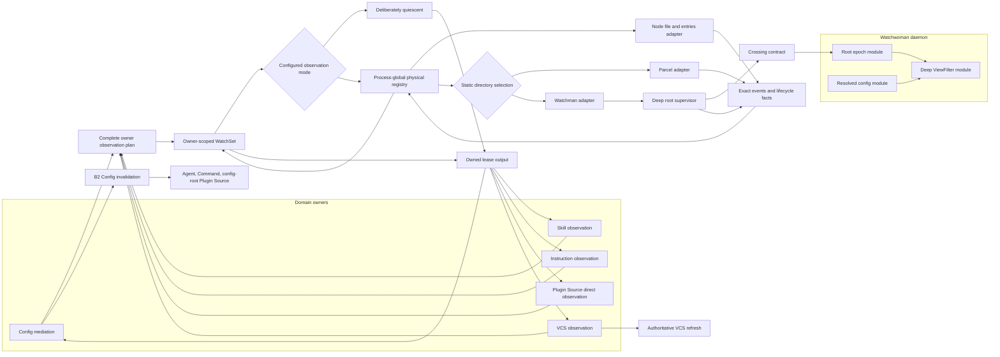

# Owned observation: the actual next direction

## Direction

Build **owned observation**, not another filesystem-backend wrapper.

The current root-scoped Watchman line proved that per-root isolation and
source-owned interests are the right shape, but it still treats establishment,
loss, retry, fallback, and owner recovery as loosely coordinated behaviors. The
next architecture makes them one truthful observation contract:

1. Owners declare complete desired observation plans.
2. An owner-scoped `WatchSet` reconciles each plan without owning domain policy.
3. A process-global physical registry shares watches and supervises Node/Parcel.
4. A deep root supervisor owns every Watchman acquisition and replacement epoch.
5. Exact events remain exact while continuity is proven.
6. Reported continuity loss becomes an owner control fact, followed by a fresh
   attachment and authoritative reread.
7. Backend selection is static and attributed; it never silently changes after
   failure.
8. Watchwoman advertises enhanced semantics only after deterministic daemon
   gates pass.
9. Profile R and the accepted VCS tracer advance independently; the complete
   current-line gate joins their evidence before carrier reconstruction.

Finish and operate that behavior on the current line first. Only then re-author
the compact final behavior on a newly pinned upstream carrier. This follows the
recorded full-current-line decision and avoids transporting the historical
implementation sequence into the carrier
([`nav0-syn0`, lines 83-110](/.design/watchman/nav0-syn0.gpt56sol.md#L83-L110)).

That sequence has three distinct construction roles:

| Line | Role | Discipline |
| --- | --- | --- |
| Current OpenCode Watchman line | Behavior proof bench for B2, supervision, strict selection, fresh attachment, and VCS | Deepen the existing seams only as needed; do not backport current upstream's Config subsystem wholesale. |
| Future OpenCode carrier | Compact final module shape on then-current upstream | Preserve upstream `entries`, `ConfigDiscovery`, `ConfigWatch.plan`, and readiness outcomes; generalize only their executor into `WatchSet`. |
| Fresh Watchwoman line | Daemon epochs, configuration, `ViewFilter`, Linux lifecycle, and protocol honesty | Start from the accepted docs carrier in a dedicated workspace; never replay `systemd-20260903`. |

## Current position

What exists now is useful but not the destination:

- The implemented line has one `RootConnection` per route intent and avoids the
  old process-global FIFO failure domain
  ([`README`, lines 29-60](/.design/watchman/README.md#L29-L60)).
- Upstream now owns Config discovery, a Config-specific desired watch plan,
  `entries` watches, reconciliation, and attach-before-`onReady` behavior. The
  remake must generalize those outcomes rather than route around them
  ([`upstream-delta0`, lines 95-167](/.design/watchman/upstream-delta0.glm53h.md#L95-L167)).
- The client still fabricates ordinary file updates as lifecycle markers,
  discards some recovery rows, splits retry/fallback policy across modules, and
  can turn unsupported observation into healthy-looking stream completion
  ([`contract0`, lines 426-443](/.design/watchman/contract0.glm53max.md#L426-L443)).
- The fresh Watchwoman carrier can acknowledge a root after native construction
  or recursive registration failed
  ([`watcher.rs`, lines 48-77](file:///home/rektide/src/watchwoman-systemd/crates/watchwoman/src/daemon/watcher.rs#L48-L77),
  [`state.rs`, lines 149-170](file:///home/rektide/src/watchwoman-systemd/crates/watchwoman/src/daemon/state.rs#L149-L170),
  [`carrier1-review0`, lines 136-169](/.design/watchman/carrier1-review0.gpt56sol.md#L136-L169)).
  It also has no structured loss envelope or cancellation PDU
  ([`contract0`, lines 228-241](/.design/watchman/contract0.glm53max.md#L228-L241)).
- The accepted `opwatch-vcs-signals` graph now separates Core exact interests,
  Watchwoman broad-root filtering, production lifecycle, and activation. It is
  the first full product tracer, not the foundation itself
  ([`alignment0`, lines 686-726](/.design/watchman/opwatch-vcs-signals-alignment0.gpt56solmax.md#L686-L726)).
- The issue tracker currently represents that VCS tracer but not the larger
  observation-remake spine.

The uncommitted [`contract0.glm53max.md`](/.design/watchman/contract0.glm53max.md)
is the closest thing to the next executable specification. It proposes the wire
vocabulary, epoch identities, B2 tags, ordering, ownership, queue posture, and
shared fixtures, but explicitly leaves three decisions open and currently
contradicts B2 in its O1 wording. It should be reviewed and accepted before
either repository builds a state machine from it.

## Authority ledger

The next direction must not turn later model proposals into accidental human
decisions.

| Direction | Status | Consequence |
| --- | --- | --- |
| B2 invalidation at `Config.changes`; B3 deferred | Recorded human decision | Keep `Watcher.Update` exact-only. Generic watcher invalidation requires a new decision. |
| Build the full corrected current line, then re-author the carrier | Recorded human decision | Do not jump directly to the carrier or port historical commits. |
| Source state is truth; complete event history is not promised | Recorded product boundary | Recovery means authoritative reread after fresh attachment, not outage replay. |
| Static directory-backend selection; files and `entries` on Node | Recorded architecture direction | Build supervision before deleting fallback; never switch backend silently at runtime. |
| Explicit observation disable | Existing public behavior | Preserve it as deliberately quiescent unless a separate removal decision changes the server, CLI, and environment surfaces together. |
| Exact OpenCode VCS interests and broad Watchwoman smart filtering are independent | Accepted direction | Core observation can ship independently; both join at activation. |
| One ordered, staged Watchwoman rule language replaces `ignore_dirs` | Accepted direction | Path, non-following kind, and metadata are v1 facts; content bytes remain P4. |
| G5 bounded Config freshness | Recommended, not accepted | Do not call the destination RC without a human decision and measured owner-complete bound. |
| Watcher-level B3 invalidation | Deferred | Design compatible vocabulary, but stop if implementation moves the tag below Config. |
| Legacy daemon without `watchwoman-observation-v1` | Open compatibility decision | It cannot satisfy Profile R. Require v1 or expose legacy operation only through an explicitly weaker mode; never downgrade silently. |
| Watchman as default | Open product policy | Promotion and default selection remain separate gates. |

Profile R is the recommended minimum honest assurance target, not a recorded
human architecture decision. This document adopts it as the route bearing while
keeping the distinction visible; accepting this direction would be the decision
record the existing corpus lacks.

## Pivotal architecture shifts

### 1. From subscriptions to owner observation plans

Today callers know too much about paths, placement, sentinels, and watcher
lifecycle. The owner should declare what can make its authoritative state stale;
the observation implementation should decide how those interests are maintained.

Generalize the owner-local executor in upstream's existing Config path:

```text
ConfigDiscovery.Sources -> ConfigWatch.plan -> WatchSet.reconcile
```

into an owner-scoped `WatchSet` shared by Config, Skill, VCS, and future owners.
`ConfigDiscovery` and `ConfigWatch.plan` remain Config domain modules; VCS and
Skill likewise retain their own source discovery and topology planning. The
generic seam begins only after an owner has produced a complete normalized plan
whose intents include kind, path, names or ignores, and explicit placement.

Each owner gets an independent `WatchSet` instance or namespace. It owns:

- desired-plan deduplication and diffing;
- leasing and fencing of owner-supplied sentinel intents;
- acquire-additions-before-release-removals replacement;
- per-interest terminal attribution while sibling interests stay live;
- release fencing and owner-scope cleanup.

It does **not** own process-global physical sharing or native retry. Those stay
below it in the process-global `Watcher` registry, keyed by the complete
normalized physical intent. This preserves the useful lifetime split already
present between `WatchInterests` and `Watcher`'s `RcMap`; one owner's reconcile
can never release another owner's shared demand
([`interests.ts`, lines 22-81](/packages/core/src/filesystem/watcher/interests.ts#L22-L81),
[`watcher.ts`, lines 117-188](/packages/core/src/filesystem/watcher.ts#L117-L188)).
The registry is not a return to one process-global transport or FIFO: it shares
only identical physical keys, and each physical/root failure remains scoped to
its own supervisor.

This is a generalization, not a parallel layer. On the final carrier, Config
migrates only after the new module reproduces upstream's new-file,
new-directory, ecosystem-root, and attach-before-ready tests
([`upstream-delta0`, lines 242-280](/.design/watchman/upstream-delta0.glm53h.md#L242-L280)).

### 2. From scattered retries to scoped supervisors

Retry ownership follows the physical failure scope and has exactly one owner:

- The process-global physical-watch supervisor absorbs retryable Node and
  Parcel acquisition or observation loss, with one backoff sequence per
  complete physical key. Unexpected completion while demand remains is loss,
  never healthy EOF.
- The deep Watchman root supervisor absorbs every retryable initial and
  replacement root failure. A Watchman retryable failure never rises into the
  generic physical supervisor and can never trigger a second retry loop.
- Only attributed terminal failure reaches an owner `WatchSet`; unaffected
  interests and owners remain live.

"Absorbs" means sole retry ownership, not hidden loss. Every detected loss
still reaches each attached owner lease as an owner-local control fact before
later exact output; retryable loss simply does not escape as caller retry work
or as terminal failure.

The Watchman root supervisor owns:

- one logical root demand;
- one shared backoff sequence;
- attempt identity and late-result fencing;
- delivery attachment and daemon root epoch identity;
- retryable, terminal, and operator-recoverable dispositions;
- root-local suppression and its named clearing events;
- release that cannot resurrect replacement demand.

`WatchSet` obtains and retains a demand handle before the first acquisition
attempt. The physical registry therefore keeps the relevant physical entry or
Watchman root supervisor alive while the intent remains desired, even when cold
acquisition ends terminally. The suppression record cannot disappear merely
because an establishment effect or exact-event stream unwound. Terminal
attribution does not terminate the owner aggregate or release that demand.

Owners request once and park. They do not run retry loops, re-request on every
failure, or decide whether another backend should take over. This removes the
current Config and Skill redemand loops, the initial-acquisition cliff, and the
cross-adapter retry gap rather than covering them with more catches
([`carrier1-review0`, lines 224-250](/.design/watchman/carrier1-review0.gpt56sol.md#L224-L250),
[`777-818`](/.design/watchman/carrier1-review0.gpt56sol.md#L777-L818)).

### 3. From callbacks and fabricated updates to explicit control facts

An exact file change and an observation lifecycle transition are different
information. Never encode readiness, cancellation, cursor rejection, or fresh
instance as `{ type: "update", path }`.

The substrate may expose typed lifecycle facts to its owner adapter, but under
B2 it does not emit a generic invalidation through `Watcher.Update`. Config's
lifecycle mediation is the only producer of:

```ts
type ConfigChange =
  | { readonly path: string; readonly type: "create" | "update" | "delete" }
  | { readonly type: "invalidation"; readonly path: string }
```

Agent, Command, and Plugin Source switch on `invalidation` before applying path
filters. Skill and VCS own their own invalidate-then-reread behavior. Moving the
shared tag below Config is B3 and requires explicit acceptance
([`contract0`, lines 319-384](/.design/watchman/contract0.glm53max.md#L319-L384)).

The current C0 draft must correct one internal contradiction before acceptance:
O1 describes a stream-native invalidation as the first Watchman epoch fact even
though its B2 section prohibits invalidation below Config. The B2-consistent
form is an exact event stream plus explicit owner-local ready/loss control facts;
Config consumes those facts and mints the invalidation tag. A control fact is
not a disguised `Watcher.Update` member.

### 4. From a Boolean healthy state to scoped observation state

No single `fatal`, `healthy`, or retry count can represent the system. Keep
these states distinct for their complete lifetimes:

| State | Owner | Clears when |
| --- | --- | --- |
| Backend-terminal latch | Selected Watchman adapter | Adapter layer is reconstructed |
| Node/Parcel physical-terminal suppression | Retained process-global physical demand | Physical intent, explicit operator retry, or configured Watcher layer changes it |
| Watchman root-terminal suppression | Retained Watchman root supervisor/demand | Intent, policy generation, explicit operator retry, or adapter reconstruction changes it |
| Node/Parcel physical epoch | Process-global physical-watch supervisor | A fresh native lease replaces the ended epoch |
| Environment circuit | Watchwoman, reflected by client | Capacity or operator action resolves shared exhaustion |
| Watchman root and delivery epochs | Watchwoman and root supervisor | Fresh daemon root and client attachment replace the ended identities |
| Observation health | Observation substrate | Real observation recovers |
| Source freshness | Each named domain owner | Its authoritative read succeeds |

A successful source audit may make domain state fresh while observation remains
degraded. A reconnected socket may make observation live while owner state still
requires reread. Neither gauge clears the other
([`contract0`, lines 445-463](/.design/watchman/contract0.glm53max.md#L445-L463)).

### 5. From optimistic acknowledgement to negotiated root epochs

Watchwoman's successful `watch` acknowledgement must mean native construction
and recursive registration succeeded and buffered callbacks were reconciled
with the initial scan before publication. Every reported loss ends exactly one
root epoch; the root is removed before cancellation is visible; stale callbacks
cannot enter its replacement.

The additive crossing interface carries:

- structural `error_code`, `scope`, and `recovery` facts;
- daemon-minted root epoch identity;
- client-minted attachment and attempt identity;
- cancellation facts on the wire;
- `watchwoman-observation-v1`, advertised only after its daemon gates pass.

Capability absence means legacy semantics are unproven, not necessarily a
protocol error. It can never satisfy Profile R or default promotion. Before
client construction, choose whether selected Watchman rejects a legacy daemon
or permits an explicit, named weaker compatibility mode. The recommendation is
to require v1 for normal strict operation and allow legacy only when a concrete
transition need justifies an opt-in; silent downgrade is forbidden.

Version, PID, socket readiness, `status.health`, and ordinary clocks are not
substitutes for this capability contract
([`contract0`, lines 103-157](/.design/watchman/contract0.glm53max.md#L103-L157),
[`243-302`](/.design/watchman/contract0.glm53max.md#L243-L302)).

### 6. From fallback behavior to static, attributed selection

The current system silently differs before and after Watchman acknowledgement.
The replacement makes selection explicit:

- disabled observation is a first-class, deliberately quiescent arm: no native
  acquisition, acknowledgement, exact event, failure, successful EOF, or retry;
- exact files and `entries` watches remain on Node;
- directory intents use the configured Watchman or Parcel adapter;
- selected Watchman failure is visible and supervised;
- backend incompatibility fans out once at adapter scope;
- root loss remains root-local;
- shared resource exhaustion opens an environment circuit;
- process replacement is the final backstop, not the first retry mechanism.

Preserve `Watcher.Options.enabled`, the server `fs.filewatcher` surface, and the
two existing disable environment aliases unless a separate breaking decision
removes them together. Disabled mode is policy, not a failed backend, and must
never enter either supervisor.

Delete fallback only after the supervisor handles both initial and replacement
acquisition. Otherwise strict selection turns a recoverable startup failure into
permanent loss.

Delete retained-cursor compatibility in the same final-state sequence. Do not
first repair subscribe-response replay only to delete it: fresh attachment plus
authoritative owner reread is the accepted recovery shore. Preserve the current
defect as a regression scenario for that replacement rather than as an interim
feature.

### 7. From VCS path events to authoritative VCS observation

VCS is the first multi-repository product tracer for owner observation:

- Core resolves worktree-local Git `HEAD`, common refs and packed refs,
  secondary-jj main-repository operation heads, Hg branch state, and colocated
  topology.
- Files stay on Node; `refs/heads` and `op_heads/heads` force exact directory
  placement.
- Every event is an invalidation reason. Debounce, reread complete provider
  state, retain last-good on failure, then publish semantic state independently
  of whether the branch name changed.
- The target plan covers every mutable input read by the authoritative metadata
  resolver. Remote symbolic-HEAD or config inputs are either watched or
  explicitly declared non-live; `HEAD`, refs, and packed refs alone cannot
  justify a complete default-branch-freshness claim.
- The recommended public seam is a location-scoped VCS metadata-change event
  that causes consumers to refetch the complete VCS resource. Keep a branch-only
  event only for actual branch changes; never reconstruct complete metadata from
  its partial payload. Settle this before `core-consumers`, not before topology
  and watch-plan work.
- Footer, conflict state, and an already-open move list are separate consumers
  whose convergence must be proved.
- Watchwoman's broad-root `ViewFilter` is an independent daemon capability. It
  uses immutable root generations and one ordered path/kind/metadata rule engine
  to expose selected summaries while pruning VCS churn.

The two routes join only in the retained activation artifact
([`alignment0`, lines 171-268](/.design/watchman/opwatch-vcs-signals-alignment0.gpt56solmax.md#L171-L268)).

### 8. From tests around implementations to proof at interfaces

The architecture depends on transitions that live daemons cannot produce on
demand. Build two deterministic fault harnesses before rewriting supervisors:

- The OpenCode raw-client adapter scripts acknowledgements, rows, cancellation,
  timeout, connection end, late PDU, multiple roots, and generations.
- The Watchwoman native-observation adapter fails construction or recursive
  registration, pauses scan, emits rescan, closes channels, kills tasks,
  overflows delivery, and emits stale callbacks.

Both consume versioned shared fixtures for capabilities, error envelopes,
epochs, ordering, and v1 claims. Tests cross the same module interfaces as
production adapters. Do not expose private state-machine seams merely to test
them
([`contract0`, lines 589-628](/.design/watchman/contract0.glm53max.md#L589-L628)).

## Target module map



The deletion test justifies these modules:

| Module | Small interface | Complexity hidden for callers |
| --- | --- | --- |
| `WatchSet` | Reconcile one complete owner plan inside one owner namespace | Owner-supplied intent leasing, plan diff, acquire-before-release, terminal attribution, sibling isolation |
| Physical watcher registry | Acquire/release one normalized physical demand | Process-global sharing, complete physical keys, pre-attempt attachment, Node/Parcel retry and epochs, retained demand handles |
| Watchman adapter | Selected directory observation plus attributed health | Transport construction, negotiation, backend-terminal latch, environment reflection |
| Root supervisor | Demand/release one root observation | Attempts, epochs, backoff, suppression, attachment fencing, late completion |
| Config mediation | Config changes plus B2 invalidation | Lifecycle-to-domain translation, last-good reread, downstream completion |
| VCS observation | Resolve and hold one VCS observation plan | Git/jj topology, exact placement, debounce, reread, plan replacement |
| Watchwoman `ViewFilter` | Staged `classify` | Ordered rules, fact requests, traversal feasibility, provenance, candidate index |

Do not create public interfaces for internal retry strategies, regex indexes,
or transport callbacks. Those are implementation details of the deep modules.

## Profile R claim matrix

Profile R is a claim about named products, not an adjective for the backend.
The current direct `Watcher.subscribe` sites reduce to `WatchInterests`,
Instruction, configured Plugin Source entrypoints, and LocationWatcher. Their
dispositions must be explicit before claiming arrival.

| Owner/product | Observation route | Authoritative convergence | Disposition |
| --- | --- | --- | --- |
| Config documents and source topology | Config-owned plan through `WatchSet`; Config mints B2 invalidation | Discover, decode, and reconcile the complete Config plan | Included in Profile R |
| Agent and Command definitions | Config-mediated B2 consumers | Scan and reload each registry after switching on invalidation before path filtering | Included; completion is part of the Config claim |
| Plugin Source operations and configured entrypoints | Config mediation for config roots plus an owner lease for direct entrypoint intents | Rescan operations and complete activation from both routes | Included only after its direct observation path migrates |
| Skill registry | Skill-owned plan through `WatchSet` | Rescan sources, reconcile sentinels, reload registry, retain last-good on failure | Included in Profile R |
| Instruction sources | Owner lease over direct Node files | Reread and republish the complete applicable instruction set | Include; current direct subscriptions require migration |
| VCS metadata | VCS-owned topology plan and exact placement | Resolve topology, reread complete provider state, refresh named products | Separate VCS activation; required by the full current-line gate, not bare Profile R |
| Legacy LocationWatcher bus | Current direct Node file subscription | Branch-target event only, not complete VCS state | Supersede with VCS observation; until removed, either migrate it or explicitly exclude this compatibility bus from R |

Exact-file ownership avoids the Watchwoman root failure domain, but not Node
observer loss. Direct owners therefore still require the physical supervisor
and an owner-specific reread or an explicit exclusion. This matrix is the
initial closed claim set; any new direct subscription reopens it
([`nav0-syn0`, lines 153-188](/.design/watchman/nav0-syn0.gpt56sol.md#L153-L188),
[`upstream-delta0`, lines 169-185](/.design/watchman/upstream-delta0.glm53h.md#L169-L185)).

## Execution spine

### 0. Fix position and accept the crossing contract

Before client or daemon observation-state-machine code:

1. Refresh the light position record for OpenCode, upstream, Watchwoman, the
   deployed binary, and Compfuzor. Record exact revisions in each implementation
   or gate artifact; do not turn ordinary drift into a work-blocking exhaustive
   pin.
2. Review `contract0` against those revisions and commit it only after resolving
   its three decision stations.
3. Freeze the Profile R owner matrix, including every direct exact-file owner
   and the LocationWatcher replacement/exclusion disposition.
4. Create the missing observation-remake issue graph. The VCS epic is not a
   substitute for the foundation graph.

Recommended decisions for the three C0 stations plus the outstanding legacy
compatibility station are:

| Station | Recommendation | Architectural reason |
| --- | --- | --- |
| DS-A incomplete initial scan | Reconcile entries proven concurrently gone, but fail acquisition with a root-scoped retryable code when enumeration, permission, or other unreadability leaves an extant entry unobserved | Silent skip makes root acknowledgement stronger than reality; treating an ordinary `NotFound` race as unreadability makes acquisition brittle. |
| DS-B terminal suppression clearing | Clear only on named intent, policy-generation, operator, or adapter-reconstruction events | Timers turn terminal policy into hidden retry. |
| DS-C composite construction | Split structural transport incompatibility from root acquisition: keep Node file/`entries` service, expose import/protocol incompatibility as backend-terminal, and let ordinary daemon/socket unavailability enter supervised root acquisition | The draft currently conflates static construction failure with runtime availability; permanent acquisition errors still need structured classification, and file/directory failure domains stay separate. |
| Legacy daemon without v1 | Require `watchwoman-observation-v1` for Profile R and normal strict use; permit only an explicitly named weaker opt-in if transition evidence justifies it | Capability absence is unproven, not healthy; silent downgrade would make the selected profile unknowable. |

These are recommendations, not retroactive acceptance records.

### 1. Build shared fixtures, both fault harnesses, and the cheap transport probe

Land the fixture manifest, raw-client harness, and native-observation harness
before state-machine implementation. This turns C0 ordering and failure claims
into executable interfaces and prevents client and daemon vocabulary drift.

Independently run and retain the missing exact-root create/delete probe against
the currently deployed daemon. A failure changes the Core transport plan; a
pass removes that uncertainty without coupling Core exact interests to broad
smart filtering.

### 2. Bank only final-state-compatible corrections

Do not implement the historical subscribe-response row-replay fix. Preserve a
test that demonstrates the current dropped-delta defect, then delete cursor
reuse when fresh attachment plus owner invalidation land coherently. The human-
accepted current-line sequence explicitly replaces replay with fresh-clock
recovery and removes the cursor machinery
([`vision0`, lines 907-925](/.design/watchman/vision0.gpt56s.md#L907-L925)).

Remove Watchwoman capability advertisements that have no implementation. Then
land B2 atomically: lifecycle facts, attachment-before-ready, the Config union,
all consumer switches, invalidation-before-failure, and attachment-before-
reread. A partial B2 tag is another fabricated event.

### 3. Run daemon and client floor tracks in parallel

| Watchwoman track | OpenCode track |
| --- | --- |
| Fenced watcher-first root publication | Deepen current `WatchInterests` into owner-scoped reconciliation with retained demand handles; leave upstream Config migration to the carrier |
| Every reported native loss retires the root epoch | Add process-global Node/Parcel physical supervision with one retry owner per key |
| Remove-before-cancel root retirement | Make one Watchman root supervisor own initial and replacement acquisition without generic double-retry |
| Subscription and stale-callback fences | Attempt, attachment, release, and late-PDU fencing |
| Structured failure envelopes and unknown-code policy | Scoped terminal state and visible degradation |
| Environment circuit and process backstop | Static strict selection after supervision works |
| Honest capability advertisement | Fresh attachment followed by every included owner's authoritative reread |

The OpenCode track deletes cursor reuse only with the fresh-attachment and B2
recovery path in place. It must not pause in the existing middle state or in a
new replay implementation that the final state immediately removes.

Neither track alone is Profile R. The daemon can report loss honestly while the
owner stays stale; the client can retry correctly while the daemon reuses a deaf
root.

### 4. Join at Profile R

Profile R arrives only when all daemon and client gates pass together and every
row marked included in the claim matrix proves its authoritative reread after a
fresh attachment. At this point reported loss converges; completely silent loss
remains explicitly unbounded. Legacy no-v1 operation cannot satisfy this gate.

Keep the minimal delivery queues unbounded for now. A bounded queue requires
reserved invalidation state or fail-stop stream termination before exact-live
delivery can still be claimed.

### 5. Deliver the VCS tracer through three parallel lanes

VCS implementation and its focused activation gate can proceed in parallel with
the Profile R tracks. The full current-line composite waits for both:

| Lane | Immediate work | Join condition |
| --- | --- | --- |
| Core exact observation | Run the exact-root probe; compose the jj-vcs resolver; implement `opwatch-vcs-signals-core-observation`, then `core-consumers` | Exact create/delete, authoritative reread, named product convergence |
| Watchwoman broad root | `config-snapshots`, then `daemon-view-filter` | Smart signal/noise matrix and immutable-generation behavior |
| Production | `production-lifecycle`, then `compfuzor-deployment` | Reviewed binary, migrated rule config, socket-preserving service restart |

`opwatch-vcs-signals-activation` retains the exact-root, broad-root, SIGHUP,
cross-workspace, negative-churn, and product evidence. Do not add an artificial
implementation dependency between that focused gate and Profile R. Instead, the
later current-line completion gate depends on both Profile R and VCS activation.
That permits focused VCS deployment without calling it remake promotion; the
deployed daemon must not advertise `watchwoman-observation-v1` or Profile R
until the observation-floor gates pass.

### 6. Take the G5 fork without blocking R

Ask whether indefinite Config-mediated staleness after completely silent loss is
acceptable. The corpus recommends a measured, Config-mediated audit, but no
human acceptance exists.

If accepted, build it after the B2 owner seam exists and measure the complete
reread and downstream-convergence cost. It may proceed in parallel with the
floor tracks, but the result is only Profile RC after Profile R also passes. If
rejected or uneconomic, land honestly at R.

Do not grant Skill or VCS a timed G6 lease by symmetry. Each needs a separate
product decision and owner-complete cost model.

### 7. Complete the current line, then re-author the carrier

After Profile R or accepted RC and the VCS activation record:

1. Bank loaded-host, storm, replacement, rollback, and operational evidence on
   the current line.
2. Resolve the then-current upstream revision again.
3. Re-author the compact final B2 design on that carrier.
4. Preserve upstream `ConfigDiscovery`, `ConfigWatch.plan`, `entries`, and
   readiness outcomes; replace only inline plan execution with `WatchSet`.
5. Re-run semantic, upstream, VCS, deployment, and rollback gates.
6. Promote the carrier separately from deciding whether Watchman is the default.

## Parallel work and missing edges

The current Beads graph exposes three useful starts:

- `opwatch-vcs-signals-config-snapshots`: resolved Watchwoman configuration and
  immutable root generations.
- `opwatch-vcs-signals-production-lifecycle`: signals, activated listener,
  readiness, and generated Linux units on the fresh daemon line.
- `opwatch-vcs-signals-core-observation`: pure topology and observation-plan
  work, provided it does not invent generic B3 invalidation. Its pure Git/Hg
  resolver and plan work can proceed while the exact-root probe runs; transport
  acceptance waits on that result, and jj acceptance still requires the composed
  jj-vcs main-repository resolver.

Before Watchwoman code starts, confirm the dedicated implementation workspace,
fetch again, and create the dated safety bookmark required by the accepted
daemon design. That Gate 2 workspace choice is operationally blocking daemon
edits, not the independent contract review or exact-root probe.

The pure `ViewFilter` kernel can also be developed behind its ticket, but public
filter behavior waits on configuration snapshots. Core consumer work waits on
Core observation. Deployment waits on filter plus lifecycle. Activation waits
on deployment plus consumers.

The accepted design requires `core-observation` to depend on both the OpenCode
owner/exact-placement substrate and the composed jj-vcs resolver for jj
acceptance. Both edges are absent from the retained Beads graph. Add or link
those prerequisites before claiming the ticket is wholly ready; its pure
resolver and plan work remains independent of broad filtering.

Before these become the main program, add a domain-grouped foundation epic, for
example:

```text
opwatch-observation
opwatch-observation-contract
opwatch-observation-owner-matrix
opwatch-observation-fixtures
opwatch-observation-client-harness
opwatch-observation-daemon-harness
opwatch-observation-b2-config
opwatch-observation-client-owner-leases
opwatch-observation-client-physical-supervisor
opwatch-observation-client-watchman-roots
opwatch-observation-daemon-epochs
opwatch-observation-profile-r
opwatch-observation-current-line
opwatch-observation-carrier
```

The graph should express release truth: the contract and closed owner matrix
block their harnesses and client owners; each floor track depends on its harness;
Profile R depends on both tracks plus every included owner disposition; the
complete current-line gate depends on Profile R and VCS activation; carrier
construction depends on that complete gate.

## Explicitly not next

- Do not promote B3 under names such as generic lifecycle invalidation.
- Do not make Core exact VCS observation depend on Watchwoman broad filtering.
- Do not make a Config audit clear observation-health state.
- Do not reconstruct event history from clocks or old response rows.
- Do not delete fallback before scoped supervisors own every initial and
  replacement acquisition path.
- Do not let an owner redemand a failed physical watch, or let generic and
  Watchman supervisors retry the same failure.
- Do not silently fall back after static backend selection.
- Do not treat explicit disable as healthy EOF, failure, acknowledgement, or
  retry demand.
- Do not treat a legacy daemon as Profile R or silently downgrade to it.
- Do not bound queues without reserved repair state or stream termination.
- Do not implement file-content filter predicates; the P4 decision remains
  intentionally non-blocking.
- Do not replay `systemd-20260903` or the old OpenCode commit ladder into the
  final carrier.
- Do not advertise `watchwoman-observation-v1`, Profile R/RC, or default
  Watchman from version presence or process liveness.
- Do not start RP probes, RS descriptor guarantees, RD owner leases, or durable
  history as if they were later milestones on this route.

## Arrival criteria

The next architecture is real only when:

1. The crossing contract and its fixtures are accepted in both repositories.
2. The two deterministic harnesses force every acquisition, loss, overflow,
   cancellation, late-message, and replacement transition.
3. The owner matrix covers every direct watcher call site, and each included
   product proves owner-specific convergence while exclusions remain explicit.
4. On the final carrier, `WatchSet` preserves upstream Config discovery and
   readiness outcomes while removing Config-specific execution duplication.
5. The process-global physical supervisor solely recovers Node/Parcel, the root
   supervisor solely recovers Watchman, and retained demand survives failed
   initial acquisition without owner redemand.
6. Config B2 invalidation is atomic and all consumers reread after fresh
   attachment without changing `Watcher.Update`.
7. Explicit disable is deliberately quiescent, and Profile R requires
   `watchwoman-observation-v1` with no silent legacy downgrade.
8. Watchwoman acknowledges only observed roots, fences epochs, reports every
   known loss structurally, and advertises only tested capabilities.
9. The integrated system passes Profile R with observation health and source
   freshness reported separately.
10. The VCS activation artifact proves exact transport, broad filtering,
   immutable config generations, cross-workspace reread, and live consumer
   convergence.
11. The clean pinned carrier reproduces the same guarantees and passes rollback.

## Cross-references

- [`README.md`](/.design/watchman/README.md) is the corpus index and distinguishes
  the implemented root-scoped line from the unbuilt remake.
- [`nav0-syn0.gpt56sol.md`](/.design/watchman/nav0-syn0.gpt56sol.md) supplies the
  authority-correct route, assurance profiles, no-incoherent-middle rule, and
  current-line-before-carrier decision. This document compresses it into module
  shifts and immediate execution order.
- [`vision0.gpt56s.md`](/.design/watchman/vision0.gpt56s.md) is the direct human
  decision record for B2, full current-line scope, supervisor-before-strict,
  fresh-clock recovery, cursor deletion, and VCS as a first-class requirement.
- [`position0.glm53max.md`](/.design/watchman/position0.glm53max.md) supplies the
  chase-not-pin citation convention; exact revisions belong to implementation
  and behavioral-gate artifacts rather than becoming permanent work blockers.
- [`contract0.glm53max.md`](/.design/watchman/contract0.glm53max.md) is the
  current uncommitted C0 draft. It defines the wire and semantic crossing but
  must correct O1, resolve DS-A, DS-B, and DS-C, and pair with an accepted
  legacy-capability policy before client construction.
- [`assurances0.gpt56sol.md`](/.design/watchman/assurances0.gpt56sol.md) remains
  the assurance atlas; Profile R and RC retain its meanings.
- [`carrier1-review0.gpt56sol.md`](/.design/watchman/carrier1-review0.gpt56sol.md)
  supplies the correctness blockers, ownership corrections, and B3 authority
  guard that the pivotal shifts absorb.
- [`upstream-delta0.glm53h.md`](/.design/watchman/upstream-delta0.glm53h.md)
  establishes that `ConfigWatch`, `entries`, and `onReady` are now upstream
  outcomes to generalize and preserve.
- [`opwatch-vcs-signals-alignment0.gpt56solmax.md`](/.design/watchman/opwatch-vcs-signals-alignment0.gpt56solmax.md)
  records the accepted exact-interest, broad-filter, production, and activation
  lanes plus their retained Beads graph.
- [Watchwoman `vcs-config2-draft0.gpt56solmax.md`](file:///home/rektide/src/watchwoman-systemd/.design/opencode/vcs-config2-draft0.gpt56solmax.md)
  defines the deep staged `ViewFilter`, immutable configuration generations,
  production-lifecycle lane, and deployment migration.
