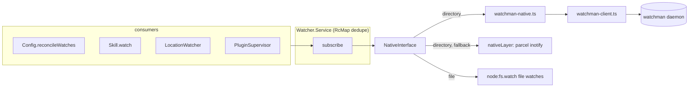

# Watchman-backed filesystem watcher (draft0)

## What's up

The user reports `fs.watch`/inotify activity "happening like crazy" in opencode and wants file watching routed through [Watchman](https://facebook.github.io/watchman/) instead. This wave assesses the current watching architecture with measurements from this machine, then proposes a design for a watchman backend behind the existing watcher seam.

Two vectors to capture up front:

1. **Duplicate, overlapping, churny watches.** Every opencode server process independently crawls and watches the same trees (config roots, skill trees), skill watching fans out to many small recursive watches with **no ignore rules**, and every skill invalidation tears down and re-crawls all of them.
2. **Watchman is the natural consolidation point.** One daemon crawls a tree once and serves every client (all opencode servers, editors, build tools) from the same kernel watches, with cursors and coalescing. Watchman 2026.07 is already installed on this machine.

Research prompt for this wave: *map every filesystem watch opencode creates, measure the churn from local server logs, evaluate @parcel/watcher's built-in watchman backend vs a first-party watchman client behind `Watcher.Native`, and design the integration with fallback and config surface.*

## Assessment

### Architecture today

The seam already exists. `packages/core/src/filesystem/watcher.ts` defines:

- `Watcher.Service` — `subscribe(WatchInput) → Stream<Update>`; an `RcMap` dedupes identical (type, target, ignore) watches per process.
- `Watcher.Native` (`NativeInterface`) — one OS-level watch per subscription; `nativeLayer` uses `node:fs.watch` on the parent directory for file watches and `@parcel/watcher` for recursive directory watches, **forcing `backend: "inotify"` on Linux** (`getBackend()`, watcher.ts:25).
- `Watcher.testLayer` — in-memory `Native` for tests.

Consumers (all in `packages/core/src`):

| Consumer | Watches | Ignores |
| --- | --- | --- |
| `filesystem/location-watcher.ts` | `.git/HEAD`, `.hg/branch` (file) per location | – |
| `config.ts` (reconcileWatches) | each config root (directory, watch-once) + standalone config files | `node_modules`, `.git`, `**/{node_modules,.git}/**` |
| `skill.ts` (watchDirectory) | every skill source dir, plus the **parent dir of every discovered SKILL.md outside the roots** (directory) | **none** |
| `plugin/supervisor.ts` | configured plugin entrypoints outside config roots (file, never torn down) | – |

### Measured on this machine (2026-08-18)

From `~/.local/share/opencode/log/opencode.log` (one local server):

- 83 `watcher subscribe` / 62 `watcher started` / 61 `watcher stopped` — the stop/start churn is real, dominated by `Skill.invalidateFromWatcher` → `FiberMap.clear(watches)` → next load re-watches everything, which re-crawls every skill tree (`skill.ts:104` clears, `skill.ts:220` finalize clears again).
- Skill watching subscribed to 7 separate recursive directories under `~/archive/ngerakines/atproto-skills/skills/<each>` — one per SKILL.md parent — all with `ignores=0`.
- `~/.config/opencode` (3 ignores) and `~/.config/opencode/skills` (0 ignores) were watched **concurrently** — overlapping recursive watches over the same subtree mean duplicate inotify watches for the overlap.
- 4 `opencode2 serve --service` processes were running; steady-state kernel watch counts per process are small (0–4 in `/proc/<pid>/fdinfo`), so the pain is not one process's watch count — it is **per-process duplication of the same crawls, unignored skill trees, and resubscribe storms**, multiplied across servers.

### What we get for free

- `@parcel/watcher@2.5.1` **ships a watchman backend** (`src/watchman/WatchmanBackend.cc`) that opencode currently bypasses by pinning `backend: "inotify"`. Parcel's own backend selection even prefers watchman "if available" when backend is `"default"` — the pinning is what disables it.
- Watchman speaks a simple JSON-lines protocol over a unix socket (`watchman get-sockname` discovery; subscriptions deliver unilateral `{"subscription": name, ...}` PDUs; `since`-cursors guarantee no missed events across recrawls).

## Goals

1. Route directory watches through the watchman daemon when available; keep behavior identical from the `Watcher.Service` consumer's perspective (same `Update` shapes, same stream semantics).
2. Never regress: automatic fallback to today's parcel/inotify path when watchman is absent, unreachable, or misbehaving.
3. Make resubscribes cheap (skill invalidation churn becomes near-free) and share one crawler across all opencode processes and other watchman clients.
4. Keep the whole change behind the `Native` seam — no consumer changes required.

Non-goals: replacing single-file watches (`node:fs.watch` on parent dirs is 1 watch per file, tiny); changing `Watcher.Service` consumer semantics; clustering anything.

## Options considered

### A. Flip parcel's backend to `"watchman"`

`getBackend()` returns `"watchman"` when the daemon is reachable, else today's per-platform value. Smallest possible diff.

Assessment from reading `WatchmanBackend.cc`:

- Pros: zero protocol code; ignore handling partially works (non-glob ignores become `["not", ["anyof", ["dirname", rel]...]]` expressions; glob ignores filtered client-side by `Watcher::isIgnored`).
- Cons: `popen("watchman --output-encoding=bser get-sockname")` at startup; **no `relative_root`** (subscribes with absolute paths inside the watch); never issues `watch-del` (watches leak in the daemon); one watchman subscription per JS subscription with no root-sharing policy of our own; opaque failure modes from C++; no control over fresh-instance handling; still one parcel Watcher per directory so per-process dedup is unchanged.

Verdict: acceptable quick win, but caps the upside and leaves the churn loop expensive (re-subscribe still re-runs parcel's subscribe path through C++).

### B. First-party watchman `Native` (recommended)

Implement `NativeInterface` in TypeScript speaking the watchman JSON protocol over `node:net`. ~250 lines, no new npm dependency, full control over root sharing, expressions, cursors, and teardown.

### C. Both

Land B, but structure selection so A is a one-line env override during rollout debugging. The `Native` seam makes this nearly free; include it only if it costs nothing.

## Design (Option B)

### Components

```
packages/core/src/filesystem/
  watchman-client.ts   # process-global socket connection, JSON-lines protocol
  watchman-native.ts   # NativeInterface implementation (directory watches)
  watcher.ts           # selection: watchman native preferred, parcel fallback
```

Mermaid overview:



### watchman-client.ts

- Discover the socket once: spawn `watchman --no-pretty get-sockname` (JSON), connect via `node:net`, send `["version"]` handshake (requires ≥ 4.x for `relative_root` support).
- One connection per opencode process, shared by all subscriptions. Commands are JSON arrays written as one line; responses and unilateral PDUs (`subscription`, `log`) arrive as newline-delimited JSON. Correlate by order for commands and by `subscription` name for unilateral PDUs.
- Expose an Effect-friendly surface: `command(name, args) → Effect<Response>`, `subscribeStream(name, opts) → Stream<SubscriptionPdu>`; reconnect with backoff; on unrecoverable failure, surface a typed error so `watchman-native` can fall back.

### watchman-native.ts

`subscribe` for `type: "directory"`:

1. **Root selection.** Query `watch-list` once (cache with short TTL). Policy:
   - If an existing watched root is an ancestor of the target, reuse it with `relative_root` = target relative to that root → **zero new kernel watches** (the editor already watching the project covers us).
   - Else issue `watch-project <target>` and honor its `relative_path` response. This walks to the VCS root, which is what any editor on the machine would do anyway; the daemon then owns one shared crawl for the whole project.
   - Concern: watching a project root pulls the whole tree (including `node_modules`) into the daemon's kernel watches unless `.watchmanconfig` sets `ignore_dirs`. Mitigations: (a) after `watch-project`, we can pass `["ignore_dirs", ...]` — actually ignore_dirs is config-file only — so (b) we check `watch-project` response `relative_path` and, when the discovered root is a strict ancestor that is not the target's own project (heuristic: root is target's VCS root and target is not root), still accept it but log the expansion; and (c) document recommending `.watchmanconfig` `ignore_dirs` for big trees. If we decide sharing aggressively is wrong, the bounded alternative is `["watch", target]` (exact root, no walk-up) — see open questions.
2. **Cursor.** `["clock", root]` → `since`. Subscriptions therefore see only future changes (no initial-state flood). If a PDU arrives with `fresh: true` (daemon recrawl), ignore it — our consumers only need deltas going forward; nothing in opencode consumes initial state.
3. **Expression.** Translate `ignore` entries into a watchman expression: plain segments → `["dirname", "node_modules"]`; brace globs expand to their alternates; suffix patterns like `**/{a,b}/**` reduce to dirname terms on `a`, `b`. Untranslatable patterns fall back to a client-side filter (keep the existing wrapper semantics). Subscriptions with distinct ignore sets on the same root are separate watchman subscriptions — watchman dedupes the watch itself, so this is cheap.
4. **Subscribe.** `["subscribe", root, name, { since, expression, relative_root, fields: ["name", "exists", "new"] }]` with a generated unique name. Map entries to parcel-shaped `Update`:

   | watchman | parcel event |
   | --- | --- |
   | `new: true, exists: true` | `{type: "created", path}` |
   | `new: false, exists: true` | `{type: "updated", path}` |
   | `exists: false` | `{type: "deleted", path}` |

   Paths join `relative_root` back to absolute. Directory-create events are dropped (parcel directory watches report files, and consumers only act on file paths).

5. **Teardown.** `["unsubscribe", root, name]`; refcount subscriptions per root and issue `["watch-del", root]` when the last one for a root we created goes away (not for roots we adopted from `watch-list`).

`subscribe` for `type: "file"`: unchanged delegation to the existing `node:fs.watch` path (extract the file branch of `nativeLayer` into a shared helper so both natives use it).

### Selection, fallback, config

- `Watcher.configured` builds a **preferring native**: resolve watchman availability lazily (first directory subscribe) with a short timeout; if the daemon probe or handshake fails, mark it dead for the process and use parcel for that and later subscriptions. Log the chosen backend (the existing `watcher started` log already carries `backend` — it will say `watchman`).
- Config surface: `ConfigWatcher.Info` gains `backend: optional("watchman" | "default")` (schema/config/watcher.ts), plus env override `OPENCODE_WATCHER_BACKEND` mirroring the existing `OPENCODE_FILEWATCHER_DISABLE` plumbing (cli/src/server-process.ts:107). Default: `"default"` = prefer watchman when reachable on Linux/macOS, else today's behavior. Explicit `"watchman"` without a daemon logs an error and still falls back (never hang the server on a broken daemon).
- Windows: never prefer watchman (service-model differences); the seam keeps the windows backend.

### Failure modes

| Failure | Behavior |
| --- | --- |
| watchman binary absent | probe fails fast, parcel path, one log line |
| daemon dies mid-session | client detects socket close; reconnect with backoff; re-issue `watch-list`/`watch-project` + re-subscribe with last known cursor (if the watch survived, `since` resumes without loss; if `watch-del`ed, next PDU is `fresh` and we skip it — acceptable: consumers re-scan on events) |
| subscribe timeout | existing `SUBSCRIBE_TIMEOUT_MS` release logic applies unchanged |
| protocol/version mismatch | handshake gate, fall back |

### Testing

- Unit: expression translation, event mapping, fresh-instance skip, root/refcount teardown — against a fake socket (a `node:net` server in-process serving canned PDUs).
- Integration, gated like `command.test.ts`'s `describeNative` (`Watcher.hasNativeBinding() && !CI`): a `hasWatchman()` gate covering subscribe → touch → unsubscribe against a temp tree, plus watch-del verification via `watch-list`.
- Existing `watcher.test.ts` already parametrizes `NativeInterface`, so the watchman native slots straight into those lifecycle tests.

### Independent fixes worth doing in the same effort (small)

1. **Skill watches get default ignores** (`node_modules`, `.git`) — today `ignores=0`; a skill tree with a vendored `node_modules` is fully watched today even after this design lands via the parcel fallback.
2. **Skill resubscribe churn**: consider an RcMap idle-grace (delay closing watches ~1s) or keeping watches across invalidations, so the clear/re-crawl loop disappears. With watchman, resubscribes are cheap anyway, but the parcel fallback path benefits.
3. **File-watch dedupe**: RcMap keys file watches by file path, so two files in one directory watch that directory twice; keying by parent directory is a two-line change if we care.

## Rollout

1. Land `watchman-client` + `watchman-native` with default **opt-in** (`OPENCODE_WATCHER_BACKEND=watchman` or config) while dogfooding here; watchman 2026.07 is installed on this machine.
2. Flip default to prefer-when-reachable for Linux after a week of logs showing no fallback storms.
3. Add `watchman` to `flake.nix` dev shells so contributors get the daemon.

## Open questions

1. Root policy: aggressive sharing (`watch-project` walk-up, one crawl per project, potentially heavy trees in the daemon) vs bounded (`watch` on the exact dir, no sharing with editors)? See design §step 1.
2. Should skill SKILL.md-parent watches collapse into one subscription per skills root with a `match` expression (`**/SKILL.md`) instead of one recursive watch per skill dir? Cheaper on every backend.
3. Default posture at step 1: opt-in vs prefer-when-reachable immediately?
4. Do we want option C's parcel-watchman escape hatch, or is B-only fine?

## References

- `packages/core/src/filesystem/watcher.ts` — the `Native` seam, RcMap dedupe, forced inotify backend
- `packages/core/src/skill.ts:103-160` — skill invalidate/re-watch churn loop
- `packages/core/src/config.ts:265-296` — config root watches with ignores
- `~/.bun/install/cache/@parcel/watcher@2.5.1/src/watchman/WatchmanBackend.cc` — parcel's watchman backend (precedent, and its gaps)
- [Watchman docs — watch-project, subscriptions, expressions](https://facebook.github.io/watchman/docs)
- Local evidence: `~/.local/share/opencode/log/opencode.log` (`watcher subscribe/started/stopped` lines, 2026-08-18)
