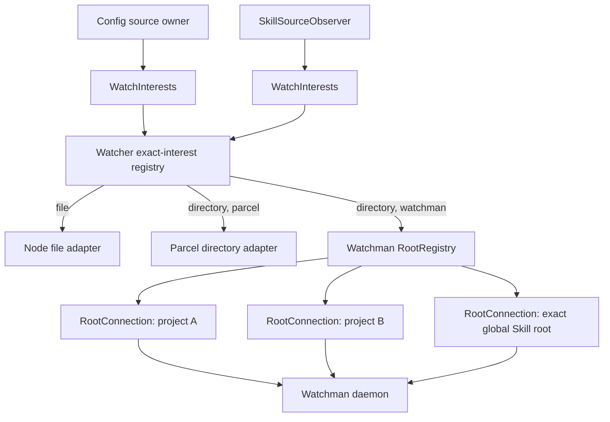

# Root-scoped Watchman with source-owned watch plans

## Decision

Keep Watchman, but replace the current architecture rather than hardening its
process-global connection manager.

The retained value is daemon-root sharing: many overlapping OpenCode interests,
processes, and tools can reuse one recursive crawl. The current implementation
puts every root and subscription behind one client generation and one hidden
FIFO. That ownership is wrong. A slow crawl for one root can retire the client
and cancel unrelated roots across the process.

The replacement has three ownership levels:

1. A source owner keeps a stable set of logical interests and reconciles only
   additions and removals.
2. `Watcher` deduplicates identical physical interests and selects an adapter.
3. The Watchman adapter owns one connection lifecycle per route intent, shared
   by subscriptions that resolve through that intent.

This removes the need for a global watcher TTL, a process-global Watchman
generation, consumer-authored routing flags, and most failure classification.
Failures naturally stop at the root whose socket and FIFO produced them.

## Keep And Delete

| Keep | Delete |
| --- | --- |
| Watchman's shared daemon roots and `relative_root` subscriptions | One process-global `Manager` and `active` generation |
| One logical subscription per exact OpenCode interest | One command FIFO shared by every root |
| Cursor resume and conservative invalidation | Global 15-minute `Watcher.RcMap` TTL |
| Initial Parcel fallback before Watchman acknowledgement | `watchmanNotifySeconds` and demand accounting |
| Unbounded recovery after acknowledgement | Routing decisions in Config and Skill callers |
| Local ignore filtering plus safe expression pushdown | Ledger history and all `watch-del` behavior |
| Opt-in backend selection | Broad readiness instrumentation and metric plumbing |
| Typed response decoding | The local transport typing shim after the typed fork release |

`rec0.gpt56s.md` correctly diagnoses the FIFO cascade, but its admission gate
only contains a coupling the architecture should not create. A gate is still
needed inside each root connection because the protocol is serial. It no longer
needs to coordinate unrelated projects, global config roots, and external Skill
trees.

## Architecture



The source-facing interface contains no Watchman vocabulary. The only
Watchman-aware input is an internal placement attached by `WatchInterests` from
the current `Location`.

## Source-Owned Interests

Add a small location-scoped module under the filesystem domain:

```ts
export type Input =
  | { readonly path: string; readonly type: "file" }
  | { readonly path: string; readonly type: "directory"; readonly ignore?: readonly string[] }

export type Interface = {
  readonly changes: Stream.Stream<Watcher.Update, Error>
  readonly ensure: (inputs: readonly Input[]) => Effect.Effect<void>
  readonly reconcile: (inputs: readonly Input[]) => Effect.Effect<void>
}
```

`ensure` starts missing interests and leaves existing interests untouched.
`reconcile` starts missing interests first, then releases interests absent from
the complete desired set. Both normalize paths and ignores before comparing.

The two operations support a gap-free source refresh without a transaction
framework:

1. Derive primary source directories, symlink sentinels, and missing ancestors.
2. `ensure(primary)` before scanning.
3. Scan and parse the source snapshot. Add resolved external directories to the
   desired set as they are discovered and `ensure` them before reading.
4. Commit the new domain snapshot.
5. `reconcile(desired)` to release stale interests.

Events arriving during the scan enter the owner's existing sliding change
queue and trigger another serialized refresh. A failed or interrupted scan does
not release the previous plan.

Acquisition remains off the initial source-readiness path. `ensure` starts each
new stream fiber and returns; it does not wait for Parcel or Watchman to finish
acquiring. When the native subscription acknowledges, the new interest emits
one source-local dirty signal before forwarding filesystem updates. The first
scan therefore completes promptly, and one coalesced post-ack refresh closes
the scan-to-subscribe window. Existing interests do not emit another dirty
signal during later reconciliations.

This directly fixes the measured clear-and-reacquire churn. `SkillSourceObserver`
must stop calling `FiberMap.clear(watches)` on every refresh. Stable sources keep
stable subscriptions; removed sources close promptly. Retention belongs to the
owner that understands source identity, not to every physical watcher in the
process.

`WatchInterests` attaches internal placement:

```ts
type Placement =
  | { readonly type: "project"; readonly root: string }
  | { readonly type: "exact" }
```

- Files are always exact and remain on the Node adapter.
- A directory contained by `location.project.directory` gets project placement
  with that explicit project root.
- Global and external directories get exact placement.

Config and Skill callers never calculate containment and never import a
Watchman type. When upstream moves Skill acquisition from
`ConfigSkillPlugin` to `SkillSourceObserver`, the architecture moves with the
source owner without changing the interface.

## Generic Watcher Seam

`Watcher` remains the process-global exact-interest registry. Its caller
interface stays `subscribe(input) -> Stream<Update, Error>`. Placement is
internal metadata supplied by `WatchInterests`, not a policy callers choose.

The registry key is:

```ts
type Key = {
  readonly type: "file" | "directory"
  readonly target: string
  readonly ignore: readonly string[]
  readonly placement: Placement
}
```

Identical keys share one native subscription and one update hub. The registry
has no idle TTL. Source owners prevent accidental churn; when all real owners
release an interest, the native subscription closes.

`NativeInterface` receives the normalized key plus `publish` and `fail`:

```ts
type NativeInterface = {
  readonly subscribe: (input: Key & {
    readonly publish: (update: Update) => void
    readonly fail: (error: Error) => void
  }) => Effect.Effect<Subscription | undefined, never, Scope.Scope>
}
```

Parcel and Node ignore placement. Watchman consumes it. This is the sole seam
between generic watching and daemon-specific routing.

## Root-Scoped Watchman

### Root registry

The Watchman adapter owns an `RcMap<RootIntent, RootConnection>`:

```ts
type RootIntent =
  | { readonly type: "project"; readonly project: string }
  | { readonly type: "exact"; readonly target: string }
```

Project interests use the explicit Location project root as their key. Config,
Skill, and future source owners inside one project therefore share one
`RootConnection`. Exact interests share only when their target is identical.

The key is route intent rather than a resolved daemon root. Resolving two
different intents to one daemon root may produce two sockets, but never two
daemon crawls. Avoid aliasing and ownership migration machinery unless socket
count becomes a measured problem.

### Root connection

A `RootConnection` owns:

```ts
type RootConnection = {
  readonly intent: RootIntent
  readonly generation: Ref.Ref<Generation>
  readonly subscriptions: Map<SubscriptionID, SubscriptionState>
}

type Generation = {
  readonly id: number
  readonly client: RawClient
  readonly route: Route
  readonly command: Semaphore.Semaphore
  readonly closed: Deferred.Deferred<void>
}
```

One connection is one failure domain. It performs capability check and route
resolution before publishing a generation. Every subscription under that
intent uses the resolved route and its own `relative_root`, expression, cursor,
and event queue.

### Routing

Project routing resolves once per root generation:

```text
watch-project <explicit Location project root>
```

If Watchman returns `watch` plus `relative_path`, the effective project root is
`watch/relative_path`. For an interest target, the subscription value is:

```text
relative_root = relative_path + relative(explicit project root, target)
```

The joined value is normalized to Watchman's slash-separated relative path.
This keeps `relative_root` relative to the daemon's `watch` root and eliminates
one `watch-project` command per nested Config or Skill target.

Exact routing resolves once with:

```text
watch <exact target>
```

An `enforce_root_files` rejection makes only that `RootIntent` unavailable.
Initial interests on it use Parcel. No other root connection closes.

### Command dispatch

Each generation has one explicit semaphore in front of the raw client:

1. Wait for the semaphore while racing `generation.closed`.
2. After admission, verify the generation is still current.
3. Submit one raw command.
4. Start the response deadline after submission.
5. Release the semaphore after the callback or generation closure.

The raw fork's hidden queue remains empty. A caller closed before submission
retries on the replacement root generation. A submitted command timeout closes
only this root generation because protocol position on that socket is unknown.

There is no separate admission timeout initially. Owner interruption and root
generation closure already bound useful waiting; a queue deadline would be a
new policy rather than a correctness requirement.

### Subscription lifecycle

Initial acquisition:

```text
RootRegistry.get(intent)
-> connect
-> capability check
-> resolve route
-> clock
-> subscribe
-> acknowledge to Watcher
```

Any failure before subscribe acknowledgement is allowed to fall back that
physical interest to Parcel. A root policy failure is cached only for the life
of the retained physical interest, not globally.

After acknowledgement:

```text
socket end/error or active command timeout
-> close generation
-> pause root subscriptions
-> reconnect with capped backoff
-> resolve route again
-> resume each subscription from its cursor
-> conservative update if route changed, cursor was rejected, or instance is fresh
```

An explicit unsubscribe removes only that subscription. When the
`RootConnection` loses its final subscription, its scope closes the socket. It
never sends `watch-del`; daemon root reaping remains Watchman's responsibility.

## Failure Semantics

| Failure | Scope | Action |
| --- | --- | --- |
| Watchman unavailable during initial connect | Interest/root intent | Use Parcel for initial interests |
| Root policy rejection | Root intent | Keep other root connections; use Parcel for this initial interest |
| Queued command sees generation close | Root generation | Retry after replacement; command was never submitted |
| Submitted command times out | Root generation | Close this socket and reconnect this root |
| Socket error/end | Root generation | Close once and reconnect this root |
| Invalid capability/route response | Root intent/backend compatibility | Fail initial acquisition visibly; no reconnect storm |
| Invalid subscription event | Subscription | Fail that subscription visibly; keep siblings |
| Subscription canceled PDU | Subscription | Publish conservative update and resubscribe only it |
| Fresh instance or rejected cursor | Subscription | Publish one conservative update and continue from current clock |
| Explicit unsubscribe during outage | Subscription | Remove it; reconnect must not resurrect it |

No generic `tapError(retire)` exists. The owning module performs the only
retirement action available at its scope.

## Synchronization Cookies

Filter exact `.watchman-cookie-<host>-<pid>-<serial>` basenames in
`SkillSourceObserver` before its sliding change queue. This is source-domain
normalization: a synchronization artifact cannot add or remove a Skill.

Do not put the rule in Watchman expressions or generic `Watcher`. Parcel can
observe cookies created by Watchman for a shared root, and other filesystem
consumers may legitimately need raw events.

This is one source-owner rule inside the larger architecture, not the reason
for the architecture.

## Module Layout

```text
packages/core/src/filesystem/
  watcher.ts                       exact-interest registry and adapter choice
  watcher/
    interests.ts                   Location-scoped ensure/reconcile module
    native.ts                      Parcel and Node adapters
    watchman/
      backend.ts                   NativeInterface adapter and RootRegistry
      root.ts                      RootConnection generations and recovery
      client.ts                    raw-client factory and admitted command dispatch
      route.ts                     RootIntent resolution and relative-root mapping
      schema.ts                    Watchman responses and unilateral PDUs
```

Keep all Watchman types below `watcher/watchman/`. `Watcher` exports only
source-facing input/update types. `Placement` is internal to the filesystem
domain and is never exposed through Server, Protocol, Client, or plugin
interfaces.

The transport dependency remains dynamically imported only when the Watchman
adapter is selected. Publish the fork's existing declaration work, consume it
directly, and remove `fb-watchman-esm.ts`.

## Configuration

Keep one option:

```text
OPENCODE_WATCHER_BACKEND=watchman | parcel
```

Absent means Parcel. `ServerOptions.fs.watcherBackend` carries the same optional
two-value selection for embedded hosts. There is no `default` value to model,
no notify interval, no root TTL, and no per-command deadline configuration.

Watchman remains opt-in until the root-scoped implementation passes focused and
live verification. This is rollout policy, not another runtime mode.

## Tests At The Interfaces

### Watch interests

- unchanged desired inputs retain the same physical subscriptions;
- additions start before removals stop;
- a failed refresh preserves the previous interest set;
- a newly acknowledged interest schedules exactly one post-ack refresh without
  blocking the initial source snapshot;
- symlink targets and missing-ancestor sentinels reconcile correctly;
- one event during a scan schedules a subsequent refresh;
- removed sources unsubscribe immediately after snapshot commit.

### Watcher registry

- identical normalized keys share one adapter subscription;
- different placement roots do not share accidentally;
- stream failure reaches all subscribers to that exact key;
- final release closes the adapter without an idle TTL;
- Parcel and Node ignore placement without behavior change.

### Root connections

- nested Config and Skill interests in one project issue one route command and
  use one raw client;
- a never-answering route for project A does not delay project B;
- queued commands do not start response timers and retry after generation
  replacement;
- one submitted timeout closes exactly one root generation;
- a policy rejection on an exact global root does not close a project root;
- socket restart resumes each subscription cursor;
- route change, fresh instance, and cursor rejection each publish one
  conservative update;
- canceled subscription recovery leaves siblings live;
- unsubscribe during outage prevents resurrection;
- no path emits `watch-del`.

Use an injected `RawClientFactory` as an internal test seam. Tests exercise
`RootRegistry` and `RootConnection`, not a fake `Manager`; the process-global
manager no longer exists.

Commit an opt-in live-daemon suite for project root sharing, exact-policy
fallback, daemon restart, cookie filtering through Parcel, and process restart
against a warm daemon root.

## Carrier

Replace the current historical line with four final-state commits based on the
then-current `v2@origin`. Preserve `watchman-20260829` as the audit snapshot; do
not rewrite or squash it.

1. `refactor(core): reconcile source watch interests`
   - Add `watcher/interests.ts`.
   - Port Config source watching and `SkillSourceObserver` to stable
     ensure/reconcile ownership.
   - Remove global `RcMap` retention and clear/reacquire behavior.
   - No Watchman dependency.
2. `feat(core): add root-scoped Watchman backend`
   - Add the Watchman modules, transport dependency, placement metadata,
     root-scoped admitted dispatch, recovery, cookie filter, and tests.
   - Include the settled no-`watch-del` behavior from the start.
   - No process-global manager, ledger, notify counter, or typing shim.
3. `feat: expose Watchman backend selection`
   - Add only the optional CLI and `ServerOptions` backend selection.
   - Preserve Parcel as the absent/default behavior.
4. `docs(watchman): document root-scoped backend`
   - Carry the design corpus and one maintenance record above the complete code
     stack.

The runtime stack has three commits. The first is independently useful and
upstreamable. The second owns almost all Watchman complexity in a new directory.
The third is small mechanical plumbing. Future upstream source-owner moves
affect commit 1, not the backend state machine.

## Migration From Current Code

1. Land or rebase onto upstream `ConfigSourceWatch` and `SkillSourceObserver`.
2. Introduce `WatchInterests`; port both owners and remove their routing flags.
3. Remove `idleTimeToLive` from the generic watcher.
4. Delete `watchman/client.ts`'s process-global manager and demand accounting.
5. Build `RootRegistry` and `RootConnection` behind the existing native seam.
6. Move route resolution from target-keyed global generation cache to one route
   per root generation.
7. Move admitted command dispatch into each root generation.
8. Port cursor and conservative invalidation tests to root-scoped recovery.
9. Delete notify configuration, ledger history, and the typing shim.
10. Rebuild the carrier from final state and run focused plus live verification.

Do not incrementally patch the current global manager and then preserve those
patches. Its failure scope is the architectural defect. The next implementation
should delete that ownership model.

## Cross-References

- [`timeout0.gpt56s.md`](/.design/watchman/timeout0.gpt56s.md) documents the cold-crawl FIFO
  cascade that root isolation removes.
- [`draft1.gpt56t.md`](/.design/watch/draft1.gpt56t.md) supplies the retained
  one-subscription-per-interest and daemon-root-sharing model.
- [`README.md`](/.design/watchman/README.md) records the current implementation and historical
  line that the four-commit carrier replaces.
- [OpenCode patch policy](file:///home/rektide/a/doc/opencode/patches.md) defines
  the independent final-state carrier and immutable dated-snapshot rules.

# Addendum: watchwoman validation and routing amendment

Generated 2026-08-30T15:30-04:00, after live validation of the watchwoman
daemon (source: [`watchwoman0.unknown.md`](/.design/watchman/watchwoman0.unknown.md), commit
`qruvzyky`; measurements against the socket-activated daemon,
`~/.local/state/watchman/rektide-state/sock`). Where this section conflicts
with the body, this section governs.

## Confirmed theses

| Claim | Verdict | Evidence |
| --- | --- | --- |
| Crawled roots persist in memory; re-watch does not recrawl | Confirmed | `register_root` idempotent; arena `Tree` kept current by kernel events; measured re-watch 2ms |
| `query` serves enumeration from memory, no disk walk | Confirmed | pure iteration under read lock; on a 338,343-file root: expression query 83ms, path generator 67ms, incremental `since` 7ms, full-state 0.71s and output-bound (36MB JSON) |
| No `enforce_root_files` | Confirmed | only `ignore_dirs` honored; any directory watchable via plain `watch` |
| Watchwoman writes cookie files | Refuted | it writes none and filters `.watchman-cookie-*` from results |

Live `watch-list` after validation: `.opencode`, `.config/opencode`, and this
workspace are registered — the former policy-rejected exacts are now real
daemon roots. A watch-list check confirmed no stray `$HOME` root remained from
the incident below.

## Amendment 1: project routing uses plain `watch`, never `watch-project`

Watchwoman's `watch-project` climbs a hardcoded marker list that **includes
`package.json`** — and `$HOME/package.json` exists on this host. Validation
triggered exactly this: a scratch `watch-project` resolved its root to
`$HOME`, crawling 32,040,523 files (29.2GB) for ~12 minutes, uncancellable,
with the CLI timing out at 30s while the daemon kept crawling.

OpenCode already knows the project root explicitly; it does not need the
daemon's climb. Therefore:

- Project intents resolve with `watch <explicit Location project root>`.
- `relative_root` simplifies to `relative(project root, target)` — the
  `watch/relative_path` joining formula in the Routing section is obsolete.
- `cmd-watch-project` is no longer a required capability.
- Exact intents already use plain `watch`; unchanged.

Trade: we lose daemon-side climb convergence with editors in the rare case an
editor's climb would stop at an ancestor marker, and we gain immunity to
marker-list divergence (today `package.json`, tomorrow any addition) producing
catastrophic crawls. Uncancellable multi-minute crawls from a client-supplied
path are a failure mode the architecture must not be able to trigger.

## Amendment 2: `unsubscribe` is best-effort

Live-verified: watchwoman's `unsubscribe` does not stop PDUs on the connection
that issued it, and dead-client subscriptions linger until the next file event.
Consequences:

- Correctness stays client-side: PDUs for names absent from the subscription
  map are already a no-op lookup, and generation-scoped subscription names
  prevent cross-generation resurrection.
- The failure-table row "explicit unsubscribe during outage" relies entirely
  on client-side removal; daemon-side cleanup is eventual.
- Zombie subscriptions may cost the daemon some evaluation until the next
  event; acceptable, noted so nobody chases it as a client bug.

## Amendment 3: stale cursors return full results

Watchwoman never rejects a stale clock; it returns full results with
`is_fresh_instance: false`. There is no cursor-rejection path. Degradation is
graceful by construction: a full dump republishes every file, and the source
owner's capacity-one sliding change queue coalesces that burst into exactly
one refresh. The "cursor rejected" row of the failure table never fires on
this daemon; keep it for watchman compatibility. Do not later "optimize" the
burst — the coalescing is the intended behavior.

## Cookie filter status

Moot on watchwoman (it writes no cookies and filters watchman's own from
results). Keep the Skill-observer filter as a cheap defense against a
co-existing watchman daemon; it is no longer load-bearing.

## Reaping, persistence, and deployment

- Stale roots (no subscriptions, triggers, or commands) reap after **1 hour**
  (`WATCHWOMAN_STALE_IDLE_SECS`), not watchman's 5 days; missing directories
  reap in 60-120s.
- The daemon is in-memory only: a daemon restart re-crawls every root.
- Reconciliation keeps subscriptions alive continuously, so the stale window
  only affects orphaned roots. Because the deployment is self-owned, raise
  `WATCHWOMAN_STALE_IDLE_SECS` in the systemd unit (days, not hours) to widen
  the daemon-side cache across OpenCode restarts and idle periods.

## Scale corrections

This host typically runs 30-60 active projects, not a handful. Socket
accounting: one socket per project intent plus one per resolvable exact
intent (global dirs plus external skill trees) — order 15-40 connections
steady state. Sockets are the cheapest resource in the picture (fds and idle
readers); what scales with project count — daemon roots, crawls, kernel
watches — is identical under any client topology, since roots are keyed by
path and sockets do not create them. Nested projects produce nested roots
under a single-socket design too.

Burst cold boot over N projects fires N parallel root establishments; a warm
daemon answers existing roots near-instantly. Measure N-project cold-boot wall
time in the live suite.

**Design requirement (new):** per-connection jitter (about ±30% of each
backoff interval) on root reconnection, so a daemon restart does not produce a
synchronized herd of reconnects and re-watches.

## Crawl economics

The daemon is the crawl cache: one crawl per root per daemon lifetime, shared
across processes and tools. OpenCode restarts re-subscribe (2ms), not
recrawl. The historical recrawlers were all client-side defeats —
policy-rejected exacts on Parcel (per-process rescans), clear-everything
churn, cascade-to-Parcel migrations — and reconciliation plus root scoping
plus watchwoman remove all three. The residual cost is the Skill observer's
own `fs.scan` glob per trigger; an incremental `(path, mtime, size)`-keyed
parsed-skill cache is the correct future optimization, deferred until
profiling justifies it.

Query-served snapshots are now performance-validated (83ms expression queries
on a 338k-file root). The body's stance stands: deltas-only subscriptions
keep owners backend-neutral. If boot-time globs ever cost, add an optional
snapshot capability at the `Watcher` seam — watchman implements with `query`,
Parcel reports unsupported, owners fall back to glob.

## Upstream status correction

`config-source-watches` (#45968) and `skill-source-observer` (#45984) were
closed unmerged on 2026-08-28 within roughly an hour of opening, no reviews —
a withdrawn stacked series, not a rejection; the files are absent from `v2`.
Commit 1 never depended on them and now plausibly builds the seam itself; the
branches remain reference implementations, and our interests-plus-churn-fix
work could revive the withdrawn direction as an upstream PR once the
withdrawal's reason is understood.

# Addendum: implementation record

Implemented 2026-08-30 as a fresh three-commit runtime stack plus review fixes
over `v2@origin` `e70d667a`:

1. `wqlzpxsk` - `refactor(core): reconcile source watch interests`
2. `vsvwpnto` - `feat(core): add root-scoped Watchman backend`
3. `tsvvwozx` - `feat: expose Watchman backend selection`
4. `kpssqtvw` - `fix(core): enforce root-owned watch recovery`
5. `upypzslu` - `fix(core): recover source watch failures`
6. `xvvluxnk` - `refactor(core): tighten watcher internals`
7. `nsrmtxws` - `feat: make watcher timeouts configurable`

The timeout commit is a user-directed amendment to the body's "no per-command
deadline configuration" rule: heavily loaded hosts need to relax deadlines
instead of churning root generations, so the command deadline defaults to 60
seconds and all watcher deadlines and reconnect backoff are tunable through
`OPENCODE_WATCHMAN_COMMAND_TIMEOUT_MS`, `OPENCODE_WATCHMAN_RETRY_BASE_MS`,
`OPENCODE_WATCHMAN_RETRY_CAP_MS`, `OPENCODE_WATCHER_SUBSCRIBE_TIMEOUT_MS`, and
their `ServerOptions.fs` equivalents.

The implementation follows the watchwoman amendment: project roots use plain
`watch`, reconnect intervals have approximately 30 percent jitter,
unsubscribe correctness is client-side, and no path emits `watch-del`.

Two carrier details differ from the pre-implementation text to stay close to
current upstream:

- Source ownership remains in `Config` and `ConfigSkillPlugin`; the withdrawn
  `ConfigSourceWatch` and `SkillSourceObserver` branches were not revived.
  Both owners use independent `WatchInterests` instances, so this does not
  change the designed ownership or reconciliation behavior.
- The transport fork still lacks published declarations. `client.ts` performs
  one structural check at the dynamic import boundary and exposes the typed
  internal `RawClient` seam; there is no ambient declaration or local
  `fb-watchman-esm.ts` shim.

The focused injected tests cover project-root sharing, cross-root isolation,
root-local command timeout, cursor resume, unsubscribe during outage,
placement-key separation, exact-interest failure propagation, and source-plan
reconciliation. The committed opt-in live suite passed against watchwoman
0.7.0. See [`README.md`](/.design/watchman/README.md) for commands and the maintenance record.
