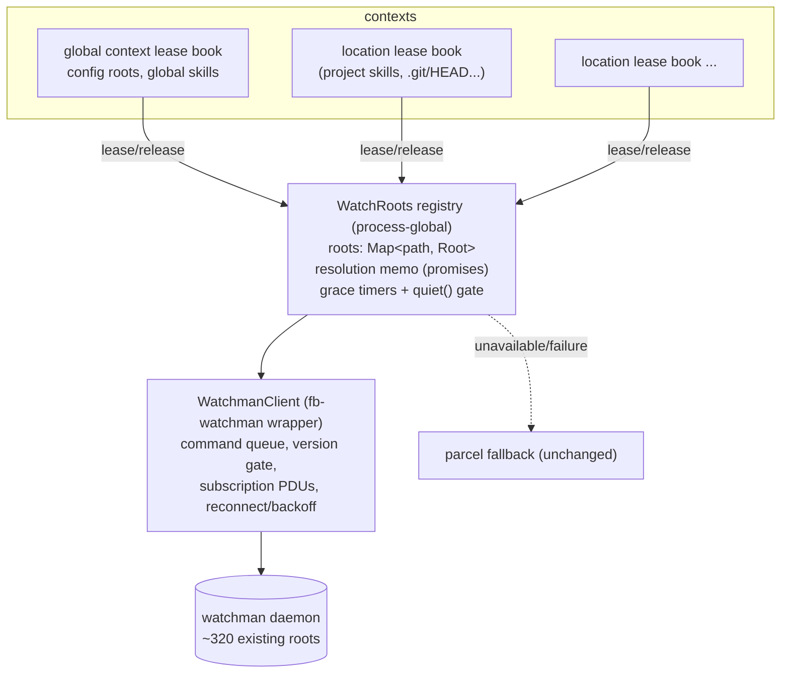

# Watchman watch registry (init0)

## What's up

Wave 2 of the watchman effort. [`draft0.glm52.md`](/.design/watchman/draft0.glm52.md) assessed the watcher landscape: the `Watcher.Native` seam exists but Linux pins `backend: "inotify"`; the churn is duplicate overlapping watches, zero-ignore skill watches, and clear/re-crawl loops, multiplied across concurrent servers. Round-1 direction from the user:

- Use **[`fb-watchman`](https://npmx.dev/package/fb-watchman)** (2.0.2, Apache-2.0, single dep `bser`, 11 kB, ESM+CJS), kept **cleanly separated** from the existing watcher code.
- The four parcel-backend criticisms ("no relative_root, leaks watch-del, popen at startup, opaque failures") must be **verified read-outs with evidence**, not hand-waving.
- The **watch registry is the centerpiece**: a first-class thing. Skills should ride the walked-up project root as *sub-watches* rather than minting their own roots. Root resolution should be an **awaitable promise** that duplicate work coalesces onto — "defer until available".
- **Grace periods** on unsubscribe (≈15 min is fine), gated by session activity now, heuristics later: short grace when no clients attached, very long when clients are (see [`sessions.md`](/opencode/sessions.md); `opencode-session-active` workspace owns the evolving policy).
- Global and project contexts should each have their **own registry of watches, in effect**.
- Rollout stays **opt-in**.

New hard evidence since draft0 — everything below marked **[verified]** was executed live against watchman `20260708.093114.0` on this machine via fb-watchman under Bun (`~/tmp-opencode/fbwatchman-test/test.ts`):

- `watch-project` on a nested dir **walks up to the VCS root**: `watch-project(<root>/sub/skills/atproto-lexicon)` → `{watch: <root>, relative_path: "sub/skills/atproto-lexicon"}`. The walk-up is free — the daemon does it.
- **Subscriptions scoped with `relative_root` report names relative to the relative_root**, and **server-side `expression` filtering works**: with `["not", ["match", "**/SKILL.md", "wholename"]]`, an edit to SKILL.md never arrived; `node_modules/pkg.json` was dropped by `["not", ["dirname", "node_modules"]]` — only the directory-create event for `node_modules` itself passed (its dirname is the relative root). Lesson: `dirname` matches *immediate children only*; deep ignore needs `match` globs.
- **`watch-del` works and is decisive**: `{deleted: true}`; `watch-list` confirms removal. And `watch-list` revealed this machine **already runs ~320 watchman roots** (editor and tooling). Sharing, not duplicating, is the whole game.
- **`capabilityCheck` capability names have drifted**: `required: [since, term_dirname, term_match]` is *rejected* by the 2026.07 server. Gate on the `version` handshake instead; don't depend on capability names.
- **Bun interop gotcha**: fb-watchman is CJS `module.exports = {Client}`; under ESM, `import fb from "fb-watchman"` gives the namespace object — use `fb.Client`. One line, but it goes in the client module.
- fb-watchman **serializes commands itself** (internal FIFO, one outstanding command), frames BSER via `bser.BunserBuf`, emits `subscription`/`log` unilateral events plus `error`/`end`, cancels queued commands on socket end, honors `WATCHMAN_SOCK`, and spawns `watchman get-sockname` otherwise. **Reconnection is our job.**

## Verified read-out: why the parcel watchman backend isn't enough

All citations are `~/.bun/install/cache/@parcel/watcher@2.5.1/src/watchman/WatchmanBackend.cc` unless noted.

**1. `popen` at startup.** `getSockPath()` runs `popen("watchman --output-encoding=bser get-sockname", "r")` (line 49) on every backend creation — a subprocess fork just to learn the socket path. It honors `WATCHMAN_SOCK` first, but the fallback is a shell, on the hot path of `checkAvailable()` which itself connects a throwaway socket (lines 102-110). fb-watchman does the same spawn for discovery, but we do it **once per process**, not per probe, and never on the per-subscribe path.

**2. No `relative_root` — and worse, `watch` instead of `watch-project`.** `watchmanWatch()` issues `["watch", dir]` (line ~93-96: `cmd.push_back("watch")`), and `subscribe()` re-uses the absolute dir (lines 278-287). Consequences, precisely:

- No walk-up: each watched directory becomes its own daemon root. The overlapping watches we measured in logs (`~/.config/opencode` AND `~/.config/opencode/skills` as separate subscriptions) become **two full recursive daemon watches of overlapping trees** — the duplication problem, now daemon-side and *sticky*.
- No sharing with the ~320 roots other tools on this machine already hold: an editor watching a project root does not dedupe a parcel watch of a subdirectory, because the root paths differ.
- Events are re-absolutized as `watcher->mDir + DIR_SEP + name` (line ~135), so nothing downstream can notice the nesting either.

**3. `watch-del` is never sent.** `grep -rn watch-del src/` returns nothing. `unsubscribe()` (lines 326-334) removes only the subscription; the root stays in the daemon forever (until an explicit `watch-del`/`watchman-del-all`, TTL config, or daemon restart). For a long-lived opencode service process that watches location-scoped things that come and go, this leaks a full recursive crawl per abandoned root. The single in-flight `unsubscribe` in our live test was confirmed insufficient: only an explicit `watch-del` shrank `watch-list`.

**4. Opaque failures, no recovery.** The whole protocol runs on one hand-rolled read loop (`start()`, lines 175-230) with signal/condvar juggling: socket errors either surface as a generic `runtime_error` string on the next command, or destroy the backend (`mEndedSignal.notify(); throw;`) with no reconnect. `handleWatcherError` drops the affected watcher. From JS you see a rejected subscribe/unsubscribe promise with a stringly message and no classification; there is no "daemon restarted" story — every watch silently dies until the process itself is restarted.

**5. Bonus findings.** Every `subscribe` first issues a separate `["clock", dir]` command (line 294 calls `clock()`, lines 226-236) — two serialized round-trips per subscription. Ignore translation covers only non-glob ignores that are strict path-prefixes of the watched dir, turned into immediate-children `dirname` terms (lines 296-318); glob ignores are filtered client-side per event (`Watcher.cc:214-231`). And `Backend.cc` *prefers* watchman when backend is `"default"` — meaning the current `"inotify"` pin is the only thing standing between every opencode user and all of the above.

## Protocol facts (all [verified] live)

| Command | Behavior |
| --- | --- |
| `["version"]` | handshake; returns `{version, buildinfo, capabilities?}` |
| `["watch-project", dir]` | walks up to project root (`.watchmanconfig` / VCS root); returns `{watch, relative_path?}` — `relative_path` present iff walk-up occurred |
| `["watch", dir]` | exact root, no walk-up (our bounded fallback) |
| `["clock", root]` | cursor for `since` |
| `["subscribe", root, name, {since, relative_root?, expression?, fields}]` | PDU `{subscription, clock, is_fresh_instance, files:[{name, exists, new, mode?}]}`, names relative to `relative_root` (or root) |
| `["unsubscribe", root, name]` | drops subscription only |
| `["watch-del", root]` | `{deleted: true}`; kills the root for **all** clients — daemon has no per-client refcount |
| `["watch-list"]` | existing roots (adoption candidates) |
| expressions | `["not", ["anyof", ...]]`, `["dirname", name]` (immediate children), `["match", glob, "wholename"]` |

## The registry

### Shape

One process-global registry over one fb-watchman connection, with **per-context lease books** layered on top — that's how "global and project contexts each have their own registry of watches, in effect" lands without duplicating daemon state. The daemon's watches are process-external and unrefcounted per client (`watch-del` is global), so root ownership *must* be coordinated in one place; contexts then own *leases*, not watches.



Module layout, cleanly separated per the user's direction:

```
packages/core/src/filesystem/watchman/
  client.ts        # fb-watchman wrapper: connect-once, Effect surface, reconnect, PDU fanout
  roots.ts         # WatchRoots registry: resolution, leases, subscriptions, grace
  expressions.ts   # ignore[] → watchman expression translation (+ residual client filter)
  native.ts        # NativeInterface implementation delegating to roots
packages/core/src/filesystem/watcher.ts   # selection: watchman-native | parcel; file watches unchanged
```

### Data model

```ts
type Root = {
  readonly path: string                      // daemon root path
  readonly adopted: boolean                  // pre-existing in watch-list, never watch-del it
  readonly resolution: Deferred<ResolvedRoot> // THE awaitable promise (memoized, coalesced)
  subscriptions: Map<SubKey, SubEntry>
  leases: Set<ContextId>                     // non-empty ⇒ in use
  grace: { remaining: Duration } | undefined // set when leases empty; paused unless quiet()
}

type SubEntry = {
  readonly name: string                      // generated, unique per (root, relative, expr)
  readonly relative_root?: string
  readonly expression?: WatchmanExpr
  readonly publish: (u: Update) => void      // wired to the Watcher.Service RcMap PubSub
  cursor?: string                            // last PDU clock, for reconnect resubscribe
}

type ResolvedRoot = { readonly root: string; readonly relative_root?: string }
```

### Root resolution — the awaitable promise

`resolve(target): Effect<ResolvedRoot>` is the "promise that is easy to await" the user asked for. Duplicate concurrent requests coalesce onto one memoized `Deferred` per target — the second subscriber for `…/project/skills` awaits the same in-flight `watch-project` instead of racing it. Resolution algorithm:

1. **Cover check.** If an existing root is an ancestor of `target` (or equals it), return `{root, relative_root: relative(target, root)}` — no daemon traffic at all. This is where the churn win lives: after the first resolve, skill invalidate/re-watch loops never touch watch-project again.
2. **`watch-project(target)`.** The daemon walks up to the project root.
3. **Adoption policy.** Adopt the walked-up root iff any hold:
   - root contains a `.watchmanconfig` (someone curated this root deliberately), or
   - root equals opencode's own VCS discovery for the location (`Git.repo.discover` — opencode already pays for this in `LocationWatcher`), or
   - `depth(target → root) ≤ 3` and root is not a "home-like" path (`$HOME`, `/tmp`, `/`).
   
   Otherwise **`["watch", target]`** — an exact root, no walk-up. This is the guard against the pathological case: `watch-project(~/.config/opencode/skills)` would walk to `$HOME` (no `.git` above it) and watch the entire home tree. Bounded by default, generous when the project shape is known.
4. **Adopt existing roots.** On first resolve, one `watch-list` (cached briefly) marks pre-existing roots `adopted: true` — the ~320 roots from editors. We subscribe relative to them and **never `watch-del` an adopted root**; it isn't ours.

### Subscriptions

Keyed `(root, relative_root, canonical-expression)` — exact-dedupe only. Creation is `clock` + `subscribe` (fb-watchman serializes them on one socket). Event mapping to parcel-shaped `Update`:

| PDU file | Update |
| --- | --- |
| `new && exists` | `{type: "created", path: abs(name)}` |
| `exists && !new` | `{type: "updated", path: abs(name)}` |
| `!exists` | `{type: "deleted", path: abs(name)}` |

`abs = join(root, relative_root ?? "", name)` [verified]. `is_fresh_instance` PDUs are dropped with a log line (daemon recrawled; consumers only need forward deltas — same posture as draft0). Directory events are passed through (consumers filter by overlap today; a follow-up can drop them if noisy).

Ignore translation (`expressions.ts`): each ignore entry becomes `["anyof", ["match", "**/" + seg + "/**", "wholename"], ["dirname", seg]]` terms (the `dirname` arm catches the directory-create event itself, the `match` arm catches deep descendants — exactly the gap the live test exposed), all wrapped in `["not", ["anyof", …]]`. Anything untranslatable keeps a **residual client-side filter** mirroring parcel's wrapper semantics, so behavior can't regress relative to today.

On top of this, **smart routing is a natural consequence, not extra machinery**: project-local skills resolve under the project root's deferred promise and become a `relative_root` sub-watch — their "own sub-watch" on the shared root, per the user's framing. Config roots on the same project ride the same root with different expressions. No consumer changes; `Watcher.subscribe`'s `RcMap` keeps deduping identical Native calls above us.

### Leases and contexts

`ContextId` ∈ {`global`, `location:<dir>`}. `Watcher` already runs one service per location plus global composition — leases attach the requesting context to each root it resolved. When a location layer shuts down, its lease book releases its roots; roots other contexts still lease are untouched. This is also the accounting that decides `watch-del` eligibility.

### Grace teardown, gated by activity

When a root's last lease releases:

- Subscriptions `unsubscribe` immediately (one cheap round-trip each; preserves nothing).
- The root enters **grace**: default **15 minutes**, configurable (`watcher.grace` in config, `OPENCODE_WATCHER_GRACE` env). Re-resolution during grace hits the cover check — instant, no daemon traffic, no recrawl. This is what kills the skill clear/re-crawl storm: the churny path becomes a map lookup.
- The grace clock only counts down while **`quiet()`** returns true. `quiet` is an injected predicate (`Watcher.configured({ quiet })`), keeping watcher → session dependency direction clean: the registry never imports Session; the server composition supplies `quiet = Session.active.isEmpty` now, and the `opencode-session-active` workspace later upgrades it to the client-attachment heuristic tier (short grace with no clients attached, very long with clients — see [`sessions.md`](/opencode/sessions.md)). Default `quiet` when unwired: always quiet.
- Grace expiry + quiet ⇒ `["watch-del", root]` (never for `adopted` roots; never while any subscription still exists).

### Failure and fallback

| Scenario | Behavior |
| --- | --- |
| binary absent / socket unreachable at first use | typed `WatchmanUnavailable`; registry disabled for the process; directory watches fall back to parcel `nativeLayer` (the existing per-platform pin). One log line. |
| daemon dies mid-session | client `end`/`error` → cancelCommands fires (fb-watchman behavior [verified from source]) → backoff reconnect → re-run `version` → roots are *usually still alive* daemon-side (watches outlive client connections) → re-`subscribe` each entry with its stored `cursor` → no loss. If the daemon itself restarted, cursors are invalid: first PDU per root is `is_fresh_instance`, which we drop with a warning (bounded staleness until the next real event; acceptable for config/skills). |
| subscribe/subscribe-timeout | existing `SUBSCRIBE_TIMEOUT_MS` release logic in `Watcher.layer` applies unchanged — registry is below that seam. |
| protocol surprise | `version` gate + residual client-side filtering; anything else falls back for the session. |

### Selection & config

`Watcher.configured` gains backend selection: `watchman` (registry preferred, parcel fallback) | `default` (today's behavior). Sources: `watcher.backend` in `opencode.json` (`ConfigWatcher.Info` in `packages/schema/src/config/watcher.ts`), env `OPENCODE_WATCHER_BACKEND` alongside the existing `OPENCODE_FILEWATCHER_DISABLE` plumbing (`packages/cli/src/server-process.ts:107`), server option `fs.filewatcher` untouched. **Opt-in first** (`watchman` only when explicitly requested), dogfood on this machine (daemon already installed, 2026.07), flip default after clean logs. Windows: registry never preferred; seam unchanged.

### Testing

- **Unit** against a fake daemon: `node:net` server speaking BSER via the `bser` package (already a transitive dep of fb-watchman — no new dev dep), asserting resolution coalescing, adoption policy branches (incl. the `$HOME` walk-up rejection), expression translation, event mapping, fresh-instance skip, lease/grace transitions with a fake clock and fake `quiet()`.
- **Integration**, gated like `command.test.ts`'s `describeNative` (`Watcher.hasNativeBinding() && !CI` → plus `watchman --version` probe): subscribe → touch → unsubscribe → grace → watch-del verified via `watch-list`; walk-up adoption verified via `watch-project` on a temp tree with `.git`.
- The existing `watcher.test.ts` `NativeInterface` parametrization covers lifecycle for free.

## Sequencing

1. `client.ts` + `roots.ts` behind opt-in flag; unit + gated integration tests.
2. Wire `quiet = Session.active.isEmpty` in server composition; grace default 15m.
3. Dogfood opt-in on this machine; watch for fallback logs and PDU storms.
4. Default flip on Linux; add `watchman` to `flake.nix` dev shells.
5. Separately (other waves, noted not to block): skill-watch default ignores; SKILL.md `match`-collapse; `EventFeed.subscriberCount` exposure in the session-active workspace.

## Open questions

1. Adoption policy thresholds — is depth ≤ 3 plus the VCS-root match the right cut, or should any `.git`-rooted walk-up be adopted unconditionally?
2. Should subscriptions also linger through grace (preserving cursors), or is unsubscribe-immediately + re-clock on resubscribe right? Current design: the latter (avoids paying daemon-side filtering for subscribers that don't exist).
3. Do we collapse per-SKILL.md sub-watches into one `["match", "**/SKILL.md"]` subscription per skills root? Semantically narrower events — needs a consumer-semantics check in `skill.ts` before riding this wave.
4. Should the registry expose root state (for a future `/debug` view of leases/grace), or keep it fully internal for now?

## References

- [`draft0.glm52.md`](/.design/watchman/draft0.glm52.md) — wave 1: assessment, options, seam map
- [`sessions.md`](/opencode/sessions.md) — activity-signal research; the `quiet()` tiering plan
- `packages/core/src/filesystem/watcher.ts` — `Native` seam, RcMap, forced inotify pin
- `~/.bun/install/cache/@parcel/watcher@2.5.1/src/watchman/WatchmanBackend.cc` — all parcel read-out citations
- `fb-watchman/index.js` — command FIFO, unilateral tags, cancelCommands-on-end
- [Watchman docs — watch-project, subscriptions, expressions](https://facebook.github.io/watchman/docs)
- Live protocol verification script: `~/tmp-opencode/fbwatchman-test/test.ts`
