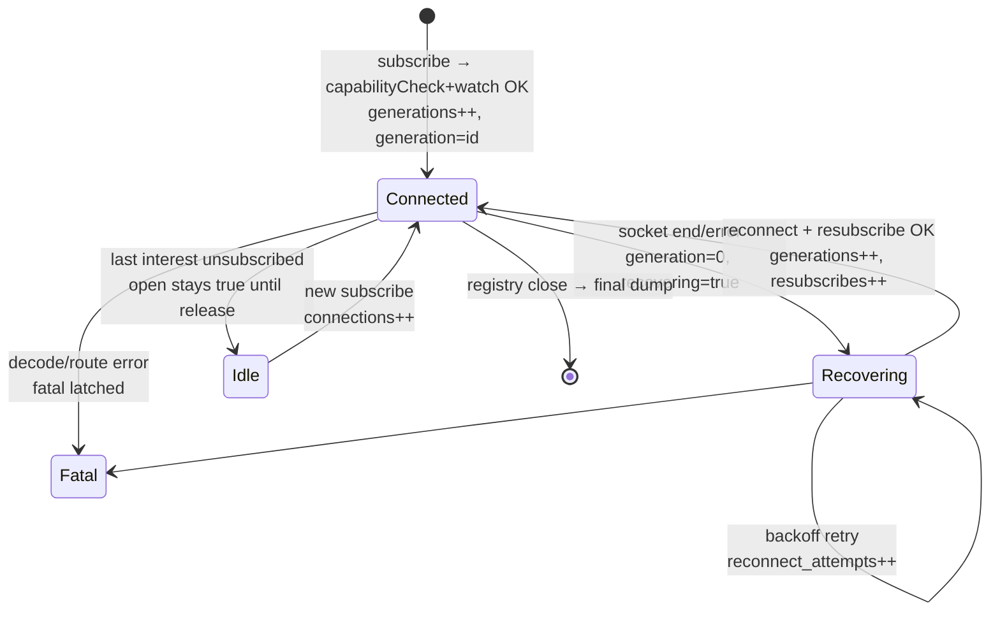

# Watchman channel metrics

Changes `qpqtqors` (core instrumentation), `myqxruxs` (config surface), and
`pmtzpnww` (maintenance record) gave the root-scoped Watchman backend a
wide-event telemetry dump: every 15 minutes, plus once at shutdown, the
server prints one JSON line per dump describing every Watchman channel.
This document explains how to read those lines. The implementation is
deliberately temp-grade — counters and gauges over a `console.log` sink —
until OTEL export exists; see the
[maintenance log follow-ups](/.design/watchman/README.md#follow-ups).

A **channel** is one root intent's Watchman connection: either
`project:<root>` (all watches under one project root) or `exact:<target>`
(an external directory watched directly). One socket, one command
semaphore, one reconnect lifecycle each — the failure domains from
[`draft2.gpt56t.md`](/.design/watchman/draft2.gpt56t.md).

## How to read a dump

A dump is one JSON object (wide mode; see
[Modes](#modes-cadence-and-the-final-dump)). Read it in this order:

**1. The envelope — who and when.**

```json
{ "event": "watchman_metrics", "v": 1, "kind": "interval",
  "ts": "2026-09-01T01:30:38.840Z", "interval_ms": 4000, "uptime_ms": 4049, ... }
```

`kind` is `interval` for the periodic dump or `final` for the shutdown
dump. `v` versions the shape; bump it if fields change meaning.

**2. `totals_delta` first, `totals` second.** Every counter exists twice:

- `cumulative` (in `totals` and per channel) — since process start.
- `delta` (`totals_delta` and per channel) — just the window that ended,
  i.e. since the *previous dump of any kind*.

The delta is the health signal; the cumulative total is the audit trail.
Two gotchas:

- The **first** dump's delta equals its cumulative (everything happened
  "this window" because there was no previous window).
- `delta.command_max_ms` is the max *within the window*, while
  `cumulative.command_max_ms` is the lifetime max — same key, different
  scope. The window value resets to 0 after each dump.

Zero deltas are meaningful: a zero-activity dump is the liveness proof
that the backend and its emission loop are still alive.

**3. The health gauges, channel by channel.** Each entry in `channels`
carries four booleans/ids that summarize its state:

| Gauge | Healthy | Means when unhealthy |
| --- | --- | --- |
| `open` | `true` | `false`: channel's registry entry is gone (all interests unsubscribed, or registry shutting down) |
| `generation` | stable across dumps | `0`: no live daemon generation — mid-reconnect or closed; frequently changing values: churn |
| `recovering` | `false` | `true` while a reconnect sequence runs; persistent across dumps means reconnect is stuck retrying |
| `fatal` | `false` | latched `true`: decode/route error permanently failed this channel; its interests have fallen back to Parcel |

The counters behind them: `generations` counts every daemon client
created (initial connect + every reconnect + every channel re-creation
after idle release), so **`delta.generations > 0` is churn** — with
`delta.command_timeouts > 0` it is the timeout-incident signature from
[`timeout0.gpt56s.md`](/.design/watchman/timeout0.gpt56s.md); with
`delta.reconnect_attempts` growing but never establishing, it is a daemon
outage. `connections` counts channel incarnations (counters survive idle
release, so a re-opened channel keeps its history).



**4. In/out per channel — the message counts.**

- **Out** (`commands_out` + per-label `commands` map): Watchman protocol
  commands submitted — `watch`, `clock`, `subscribe`, `unsubscribe`,
  `capabilityCheck`. Bumped at submission, so a command orphaned by a
  generation close is counted as out but as neither ok nor error.
- **In** (`pdus_in`): decoded subscription PDUs received, split into
  `canceled_pdus` and (within changes PDUs) `fresh_instances`.
- **Derived out** (`updates_out`): what we actually published to watchers
  after filtering — the product of the channel.

`delta.command_ms` / `command_avg_ms` measure submit→response round
trips (daemon queue + socket). Watch window max: a loaded host shows
here first, well before commands time out.

**5. The drop rate — `files_in` vs `updates_out`.** `files_in` counts
file entries inside changes PDUs; `updates_out` counts publishes. The
difference is everything we discarded: ignored paths (the ignore filter),
glob matches, and entries with no `Watcher.Update` mapping (directory
events, ambiguous exists/new transitions). A stable difference is the
filter working. Two alarms:

- `updates_out ≈ files_in` while substantial ignores are configured —
  the filter is not filtering.
- A channel whose `subs[].files_in` dominates every window — that one
  watch is the noisy one; consider tightening its ignore set.

**6. `subs[]` — per-subscription truth.** Live subscriptions only (ended
ones vanish from the array; their counts fold into the channel's
cumulative). `target` is project-relative when the intent allows it.
`clock` is the Watchman cursor of the last processed PDU: **an advancing
clock with plausible `pdus_in` deltas is delivery health**; a frozen
clock with `delta.pdus_in == 0` while you know the tree changed means
delivery stopped — check `canceled_pdus` and the daemon.

### Symptom → field table

| Suspicion | Look at |
| --- | --- |
| Daemon timeouts / generation churn | `delta.command_timeouts`, `delta.generations`, `delta.command_max_ms` |
| Reconnect storm or stuck recovery | `delta.reconnect_attempts`, `recovering`, `delta.established` vs `delta.resubscribes` |
| Channel silently dead | `fatal`, `open`, `generation`, `delta.pdus_in` |
| Events missing | `subs[].clock` frozen, `delta.canceled_pdus`, `delta.fresh_instances` |
| Ignore filter leaking or over-dropping | `files_in` − `updates_out`, per-sub breakdown |
| Parcel fallbacks stealing watches | `totals.fallbacks`, per-channel `acquisition_failures` |
| Leaking subscriptions | `channels[].subscriptions` vs known interests, `subs[]` ids |
| Is the thing even running | a dump arriving with zero deltas |

### jq recipes

Dumps are line-delimited JSON, so pipe the console stream straight
through jq:

```sh
# per-channel window activity
… | jq -c '.channels[] | {id, pdus: .delta.pdus_in, files: .delta.files_in, updates: .delta.updates_out}'

# churn and timeouts per window
… | jq -c '[.channels[] | {id, timeouts: .delta.command_timeouts, gens: .delta.generations, retries: .delta.reconnect_attempts, recovering, fatal}]'

# noisiest live subscription
… | jq -c '.channels[] | .subs[] | {target, files_in, updates_out, clock}'

# ignore-filter drop volume this window
… | jq -c '.totals_delta | {files_in, updates_out, dropped: (.files_in - .updates_out)}'
```

## Field glossary

Counters appear identically in `totals`, `totals_delta`, and each
channel's `cumulative` / `delta`. Registry-only fields live in `totals`.

| Field | Kind | Meaning |
| --- | --- | --- |
| `commands_out` | counter | commands submitted to the daemon |
| `commands` | counter map | same, by label (`watch`, `clock`, `subscribe`, `unsubscribe`, `capabilityCheck`); delta keeps only labels with positive change |
| `command_errors` | counter | command responses that errored (callback or decode); includes shutdown races |
| `command_timeouts` | counter | commands that hit the deadline and retired their generation |
| `command_ms` | counter | summed round-trip millis (rounded); excludes never-answered commands |
| `command_max_ms` | counter | lifetime max; in `delta`, max within the window |
| `command_avg_ms` | derived | `command_ms / commands_out`, only in `cumulative`/`totals` |
| `generations` | counter | daemon clients created: initial, reconnects, re-creations |
| `reconnect_attempts` | counter | recovery-loop attempts, including backoff retries |
| `connections` | counter | channel incarnations (counters survive idle release) |
| `established` | counter | successful subscription establishments |
| `resubscribes` | counter | re-establishments after generation churn (subset of `established`) |
| `unsubscribes` | counter | daemon `unsubscribe` commands actually issued |
| `acquisition_failures` | counter | `registry.subscribe` calls that failed (each also falls back to Parcel) |
| `pdus_in` | counter | subscription PDUs processed (changes + canceled) |
| `canceled_pdus` | counter | daemon canceled a subscription (triggers re-establish + synthetic update) |
| `fresh_instances` | counter | daemon reported lost cursor state (full rescan; one synthetic update each) |
| `files_in` | counter | file entries inside changes PDUs |
| `updates_out` | counter | updates published to watchers: filtered file updates plus synthetic updates from cancel/fresh paths |
| `acquires` | registry | subscribe calls into the registry (demand) |
| `fallbacks` | registry | Parcel fallbacks triggered by failed Watchman acquisitions |
| `channels` / `channels_open` | registry | channels ever created / currently open |
| `open` | gauge | channel entry alive in the registry |
| `generation` | gauge | active generation id, `0` when none |
| `recovering` | gauge | reconnect sequence in flight |
| `fatal` | gauge | channel permanently failed (decode/route) |
| `age_ms` | gauge | since channel first seen |
| `subscriptions` | gauge | live subscriptions in `subs[]` |
| `subs[].clock` | gauge | Watchman cursor of last processed PDU |

## Modes, cadence, and the final dump

- **`wide`** (default): one JSON line per dump, the shape above. A
  two-channel sample with subscriptions is ~3.3 KB; budget is 10 KB.
- **`lines`** (`OPENCODE_WATCHMAN_METRICS_MODE=lines`): a header line
  (`event: "watchman_metrics"`, totals, `channels_count`, no `channels`
  array) followed by one line per channel
  (`event: "watchman_metrics_channel"`, the channel object under
  `"channel"`). Same stream semantics, friendlier to grep and long
  channel lists.
- **Cadence**: `OPENCODE_WATCHMAN_METRICS_INTERVAL_MS` /
  `fs.watchman.metricsIntervalMs`, default 900000 (15 min), `0`
  disables all emission. Metrics are on by default *only* when the
  Watchman backend is selected (`OPENCODE_WATCHER_BACKEND=watchman`);
  that backend is itself opt-in, so opting into Watchman opts into
  telemetry. Direct `makeRegistry` callers (tests) get silence unless
  they pass an interval.
- **Final dump**: a registry finalizer emits one `kind: "final"` dump at
  scope close — borrowed from the epilogue state-machine idea in the
  `opencode-term-v2` workspace (write-once at shutdown), minus the TUI.
  Its delta covers since the last interval dump, so short-lived
  processes still surface their whole life.

The emission sink defaults to `console.log` and is injectable
(`metricsLog`), which is how tests capture dumps without console noise.
That seam is where OTEL export attaches later.

## Worked examples

Both from the live watchwoman 0.7.0 run recorded in
`.test-agent/watchman-metrics/`; scripts re-render them on demand.

**Daemon coalescing, read off `files_in`/`updates_out`.** The smoke wrote
`a.ts` twice, created and deleted `b.ts`, then waited. One changes PDU
arrived: `files_in: 2`, `updates_out: 2` — `a.ts` create (two writes
coalesced to one) and `b.ts` delete. `b.ts` never surfaced as a create
because it never existed at a crawl boundary. Reading tip: `updates_out`
slightly below the number of filesystem operations you *know* you did is
Watchman working as designed, not a bug.

**The shutdown unsubscribe race, read off the final dump.** The final
dump showed `delta.commands.unsubscribe: 1` and
`delta.command_errors: 1`: the best-effort daemon `unsubscribe` was in
flight when scope close retired its generation, so the response errored.
This is expected — daemon unsubscribe is best-effort and never controls
client-side resurrection (see
[`draft2.gpt56t.md`](/.design/watchman/draft2.gpt56t.md)) — and it is
exactly the class of invisible race these counters exist to surface.

## What was instrumented

Counter bump sites, for future archaeology:

| Site | File | Counters |
| --- | --- | --- |
| `admitted()` submission/response/timeout | `watcher/watchman/client.ts` | `commands_out`, `commands`, `command_errors`, `command_timeouts`, `command_ms`/max |
| `makeConnection` channel open/finalize | `watcher/watchman/root.ts` | `connections`, `open` |
| `create` / `close` | `watchman/watchman/root.ts` | `generations`, `generation` |
| `recoverRoot` / `replacement` | `watcher/watchman/root.ts` | `reconnect_attempts`, `recovering` |
| `current` / `recoverRoot` fatal latch | `watcher/watchman/root.ts` | `fatal` |
| `establish` success / `detach` | `watcher/watchman/root.ts` | `established`, `resubscribes`, `unsubscribes` |
| `loop` PDU processing | `watcher/watchman/root.ts` | `pdus_in`, `canceled_pdus`, `fresh_instances`, `files_in`, `updates_out` (channel + sub) |
| `subscribe` enter / error cleanup | `watcher/watchman/root.ts` | sub creation/`end`, `acquisition_failures` |
| `makeRegistry` subscribe | `watcher/watchman/root.ts` | `acquires` |
| Watchman→Parcel fallback | `watcher/watchman/backend.ts` | `fallbacks` |

The emission loop (`Effect.sleep` interval + shutdown finalizer) lives
in `makeRegistry`; the 15-minute default is applied in `backend.make`,
not the registry, so tests opt in explicitly. Generations carry their
channel's metrics handle so `client.ts` counts without new plumbing.

Verification (2026-08-31, details in the
[maintenance log](/.design/watchman/README.md#verification)):
`watchman-metrics.test.ts` 6/6 (commands/PDUs/filtering, deltas,
reconnect accounting, acquisition failure, both render modes, interval +
final emission through an injected sink); `test/filesystem/` 65 pass /
1 skip; live watchwoman suite 1/1; server options tests 9/9; core,
server, and cli typechecks clean.

## Cross-references

- [`README.md`](/.design/watchman/README.md) — maintenance log: stack,
  configuration table, verification records, follow-ups. The metrics
  commits are `qpqtqors`, `myqxruxs`, `pmtzpnww` in its stack table.
- [`draft2.gpt56t.md`](/.design/watchman/draft2.gpt56t.md) — the
  root-scoped architecture the channel/subscription model mirrors, and
  the best-effort-unsubscribe rule the shutdown race exemplifies.
- [`timeout0.gpt56s.md`](/.design/watchman/timeout0.gpt56s.md) — the
  FIFO timeout incident; `command_timeouts` + `generations` deltas are
  its recurrence detector.
- [`watchwoman0.unknown.md`](/.design/watchman/watchwoman0.unknown.md) —
  daemon crawl/coalescing behavior, which explains `files_in` counts
  below filesystem-operation counts.
- [`cookie-clash0.gpt56s.md`](/.design/watchman/cookie-clash0.gpt56s.md)
  — Skill scan interests that create many of the subscriptions visible
  in `subs[]`.
- `.test-agent/watchman-metrics/` — `smoke.ts` (fake daemon) and
  `live-smoke.ts` (real daemon) render sample dumps.
- `opencode-otel` workspace — future OTEL export; the `metricsLog` sink
  and `render` modes are the swap seam.
