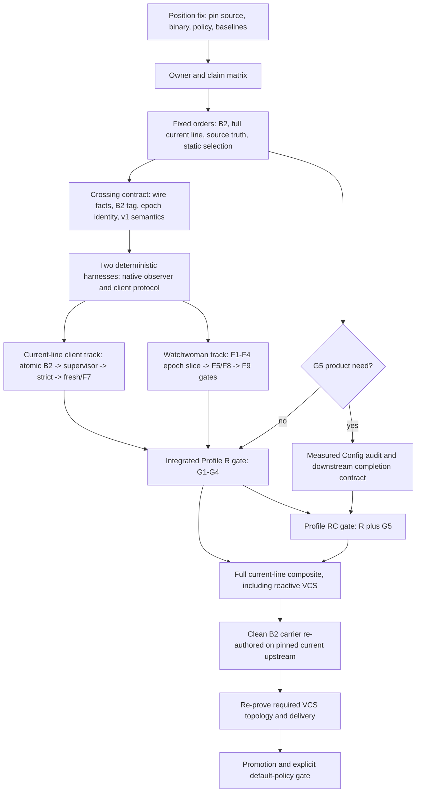

# Watchman assurance navigation synthesis

## Synthesis verdict

The three `nav0` documents are most useful as three layers, not as three
competing complete routes:

- [`nav0.gpt56sol.md`](/.design/watchman/nav0.gpt56sol.md) supplies the best
  assurance spine: named G1-G5 destinations, arrival tests, a claim card,
  explicit stop rules, and a promotion gate.
- [`nav0.glm53.md`](/.design/watchman/nav0.glm53.md) supplies the best chart:
  the two-repository crossing contract, named rocks, false beacons, permanent
  fog, and a station for every open ledger decision.
- [`nav0.glm53fmax.md`](/.design/watchman/nav0.glm53fmax.md) supplies the best
  program layer: current position, upstream movement, clean-carrier
  reconstruction, VCS work, and the rule against incoherent intermediate
  states.

None is authority-correct and executable unchanged. Combined, they yield one
channel with two parallel work tracks and one genuine destination fork:

```text
Profile R  = tested Watchwoman root-epoch floor
             AND tested OpenCode delivery/owner floor

Profile RC = Profile R
             AND an accepted, measured Config freshness lease
```

The route is:

1. Pin the actual source and deployment revisions and enumerate the owners whose
   state is being promised.
2. Freeze the cross-repository contract and build deterministic harnesses on
   both sides.
3. Land one atomic B2 owner slice and the immediate capability-truth correction.
4. Build the daemon root-epoch floor and the current-line client floor in
   parallel.
5. Join them at Profile R only after both suites pass end to end.
6. Decide G5 now. The synthesis recommends **yes**, but no human acceptance is
   recorded. If accepted, its audit may be built in parallel after B2; the name
   RC applies only once R also passes.
7. Complete the already-selected full composite on the current line, including
   required reactive VCS behavior, then re-author the clean B2 carrier against
   current upstream and prove the same guarantees again.
8. Promote the carrier. Choosing Watchman as the default remains a separate
   policy gate; promotion does not silently make that choice.

RD, RP, RS, B3, shadow-root repair, and durable history remain marked branches.
They are not more milestones on the main route.

## Authority before architecture

Recorded human decisions outrank later model proposals. This resolves two of
the largest disagreements among the drafts.

| Status                                     | Decision                                                                                                                        | Navigation consequence                                                                        |
| ------------------------------------------ | ------------------------------------------------------------------------------------------------------------------------------- | --------------------------------------------------------------------------------------------- |
| **Recorded human decision**                | B2: typed invalidation at `Config.changes`; B3 deferred                                                                         | The carrier and current line use owner-local lifecycle mediation. B3 is not a departure gate. |
| **Recorded human decision**                | Full composite on the current line, then a carrier rebuilt from final state                                                     | "Minimal interim" is a supersession proposal, not an equally open route.                      |
| **Recorded product boundary**              | Source state is truth; exact live events remain useful; complete history is out                                                 | Recovery uses fresh attachment plus authoritative reread, not outage reconstruction.          |
| **Recorded architecture direction**        | Static directory-backend selection; exact files on Node; one root retry scheduler                                               | Supervisor precedes fallback deletion; no runtime bridge is designed.                         |
| **Mechanically settled**                   | Root loss, delivery loss, backend incompatibility, environment exhaustion, and process corruption have different scopes         | No single `healthy` state or retry loop may absorb them.                                      |
| **Synthesis recommendation, not accepted** | Select G5 and navigate to RC                                                                                                    | The product decision can be made now; its interval waits for measurement.                     |
| **Still open**                             | G6 owners, G7 probes, G8 structural coverage, legacy-v1 policy, suppression clearing, unreadable entries, queue policy, periods | Each is decided only at its marked station below.                                             |

The B2 and full-current-line decisions are explicit at
[`vision0:883-926`](/.design/watchman/vision0.gpt56s.md#L883-L926). The later
assurance ledger reaffirms B2 and keeps G5 open
([`assurances0:1306-1348`](/.design/watchman/assurances0.gpt56sol.md#L1306-L1348)).
Carrier1's B3 promotion is therefore a proposal requiring correction, not a
later accepted decision
([`carrier1-review0:497-531`](/.design/watchman/carrier1-review0.gpt56sol.md#L497-L531)).

The full-current-line choice deliberately incurs a behavioral double build:
first bank and operate the corrected behavior, then re-author a compact final
carrier. It does **not** require carrying the historical add-then-delete commit
sequence into the carrier. Changing that cost decision requires an explicit new
human record.

## Where the expanded problem spaces go

The wider investigation was not wasted drift. It discovered facts that the
original watcher-client frame could not contain. The navigation error was to
leave all of them looking equally immediate.

| Problem space uncovered                       | Route disposition                          | Why                                                                                         |
| --------------------------------------------- | ------------------------------------------ | ------------------------------------------------------------------------------------------- |
| Native admission truth and root loss          | **Main-route blocker**                     | Without it, even detected-loss wording is false.                                            |
| Client delivery continuity and owner recovery | **Main-route blocker**                     | A daemon signal has no product value unless the right owner rereads after fresh attachment. |
| Silent Config staleness                       | **One real R/RC fork; RC recommended**     | Owner audit is the only mapped mechanism that bounds hidden-loss state age.                 |
| Silent Skill or VCS staleness                 | **Later RD fork**                          | Each owner needs its own extent, completion, last-good policy, period, and cost.            |
| Recent positive event-path evidence           | **RP off-channel**                         | It answers an operator question, not owner freshness.                                       |
| Native descriptor completeness                | **RS off-channel**                         | It is a broader daemon product requiring work below stock `notify`.                         |
| Complete ordered event history                | **Exit to another product**                | No rescan-based route can provide it.                                                       |
| VCS metadata observation                      | **Required dependent feature**             | Reactive invalidation and reread are accepted scope; only a timed G6 lease is optional.     |
| Carrier/upstream movement                     | **Delivery program after assurance floor** | It determines how proven behavior is rebuilt and promoted, not what the assurance means.    |

## Position gate: pin before steering

Every draft treated a known source snapshot as the trailhead, but the source is
moving in both repositories. At synthesis time, the local
`watchwoman-systemd` checkout resolved to `166eeb6dc994`, not the
`4eb1ecb7` source freeze recorded by `assurances0`. Its current code still scans
before `watcher::spawn`, acknowledges failed native setup, and has different
subscription-cancellation behavior
([`state.rs:149-170`](file:///home/rektide/src/watchwoman-systemd/crates/watchwoman/src/daemon/state.rs#L149-L170),
[`watcher.rs:48-77`](file:///home/rektide/src/watchwoman-systemd/crates/watchwoman/src/daemon/watcher.rs#L48-L77),
[`subscribe.rs:87-159`](file:///home/rektide/src/watchwoman-systemd/crates/watchwoman/src/commands/subscribe.rs#L87-L159)).

Before implementation, record one position fix containing:

1. The exact OpenCode current-line commit.
2. The exact `v2@origin` revision from which the final carrier will be built.
3. The exact Watchwoman source commit to modify.
4. The deployed daemon binary provenance and policy revision used by live gates.
5. Baseline deterministic, live, loaded-host, and rollback results.

If source, deployed binary, and cited evidence do not identify the same behavior,
the route starts from an unknown position. No downstream test count repairs that.

## Owner and claim gate

"Config freshness" is too broad until the owner graph is explicit. Current
Config discovery stores directory sources as opaque entries. A scheduled Config
reload can find the same entries and publish no `config.updated`, while an
`agents/foo.md`, command file, or plugin source changed silently. Those consumers
currently reload from path-matched `Config.changes`
([`config.ts:183-190`](/packages/core/src/config.ts#L183-L190),
[`config.ts:314-345`](/packages/core/src/config.ts#L314-L345),
[`agent.ts:54-75`](/packages/core/src/config/plugin/agent.ts#L54-L75),
[`command.ts:35-58`](/packages/core/src/config/plugin/command.ts#L35-L58),
[`source.ts:70-86`](/packages/core/src/config/plugin/source.ts#L70-L86)).

The first claim matrix must therefore name the actual products:

| Owner/product                                       | Authoritative reread                                                 | Base route                                     | Timed lease status                                                   |
| --------------------------------------------------- | -------------------------------------------------------------------- | ---------------------------------------------- | -------------------------------------------------------------------- |
| Config documents and source topology                | Config discovery, decode, and plan reconciliation                    | G1-G4 through B2                               | G5 candidate                                                         |
| Agent definitions under Config directories          | Agent source scan and registry reload                                | Required B2 consumer                           | Included in G5 only if audit invalidation and completion are bounded |
| Command definitions under Config directories        | Command source scan and registry reload                              | Required B2 consumer                           | Same condition as Agent                                              |
| Plugin Source operations and configured entrypoints | Plugin source scan and activation path                               | Required B2 consumer plus direct-file behavior | Same condition as Agent, with its direct sources enumerated          |
| Skill registry                                      | Skill source scan and reload                                         | Required detected-loss owner behavior          | No G6 lease unless selected separately                               |
| VCS metadata                                        | Atomic topology resolution, provider read, and reactive invalidation | Required dependent feature                     | No G6 lease unless selected separately                               |
| Direct exact-file owners                            | Owner-specific reread or explicit exclusion                          | Node path, outside Watchwoman root failure     | No inherited promise                                                 |

Two G5 products are honest:

1. **Narrow G5:** the lease covers Config documents and topology only.
2. **Config-mediated G5:** every successful audit emits a B2 invalidation and
   the bound includes successful completion of every named downstream reload.

Merely renewing a lease because Config's entry list is unchanged proves neither.
The synthesis recommends the second product because it preserves the value
claim that one Config audit covers Agent, Command, and Plugin Source. If there is
no completion acknowledgement or bounded queue contract, narrow the advertised
G5 claim instead of assuming publication equals convergence.

## Course chart



The G5 decision and audit work may run early. The profile name cannot: an audit
without the reactive floor is a useful periodic refresh, not Profile RC.

Daemon-first and client-first are therefore **tracks**, not alternative routes.
Neither reaches R alone. The final carrier is a **delivery vessel**, not a new
assurance tier. It must reproduce the already-proven profile.

## Beacons and arrival proofs

| Beacon                               | Observable arrival                                                                                                                               | Rocks guarded against                                                                                    | Proof                                                                                                         |
| ------------------------------------ | ------------------------------------------------------------------------------------------------------------------------------------------------ | -------------------------------------------------------------------------------------------------------- | ------------------------------------------------------------------------------------------------------------- |
| **P0 Known position**                | Source commits, deployed binary, policy, and baseline results identify one reproducible starting system.                                         | Moving source, stale evidence, testing a different daemon than the one shipped.                          | Recorded full IDs, clean/deliberately dirty status, binary provenance, baseline manifest.                     |
| **C0 Crossing contract**             | Both repositories share stable error codes, scope/recovery facts, epoch identity, additive envelopes, B2 tag vocabulary, and exact v1 semantics. | Two-Crew Drift, Prose Trap, B3 Drift, capability marketing.                                              | Shared fixtures/spec reviewed before either state machine depends on it.                                      |
| **G1 Startup source truth**          | Initial owner state completes while Watchwoman is absent or pending.                                                                             | Product readiness coupled to daemon availability; empty state on read failure.                           | Daemon-absent owner tests with last-good/degraded behavior.                                                   |
| **G2 Truthful root acknowledgement** | Acknowledged enhanced-Watchwoman roots have successful native registration and a scan reconciled with buffered callbacks.                        | Deaf Ack, Blind Window, subscription establishment race, stale root publication.                         | Native constructor/registration failure and paused-scan mutation tests.                                       |
| **G3 Exact live delivery**           | Normal reported events stay exact during a live delivery epoch; inability to preserve them ends that epoch.                                      | Vanishing Overflow, Late Ghost, bounded queue silently dropping, fabricated control events.              | Exact row, `Rescan`, callback death, stale callback, and overload gates.                                      |
| **G4 Profile R**                     | Every reported loss ends the correct root or delivery epoch; participating owners reread only after fresh attachment.                            | Reconnection Sandbar, Cancel Window, Cursor Half-Life, Redemand Whirlpool, scope-wide collateral damage. | All twelve daemon gates and all twelve OpenCode gates pass together.                                          |
| **G5 Profile RC, if accepted**       | Suppressed events still converge every named Config-mediated product by the recorded bound after successful reads.                               | Permanent fog, Audit Mirage, Empty Snapshot, publication mistaken for downstream completion.             | Fake-clock suppressed-event tests for every named owner, plus failed-read last-good tests.                    |
| **Carrier landfall**                 | The clean B2 carrier on current upstream reproduces its selected R or RC profile and the reactive VCS requirement.                               | 30-Commit Wake, Moving Seabed, B3 silently reintroduced, textual parity mistaken for behavior.           | Re-run semantic suites, upstream scenarios, VCS gates, loaded-host tests, and rollback on the actual carrier. |

## Terrain vocabulary

The drafts used "rock" differently. This synthesis fixes the terms:

- A **rock** is any condition that can wreck an advertised guarantee. It may be
  removable or permanently avoided.
- An **obstruction** is an unmet dependency that currently blocks a leg.
- An **imposition** is an accepted or external constraint around which the route
  must be drawn.
- **Fog** is a failure class with no reactive evidence.
- A **false beacon** is a real signal that proves a narrower fact than its name
  tempts us to infer.

### Rock chart

| Rock                                                  | Threatened leg                          | Course around it                                                                                                        |
| ----------------------------------------------------- | --------------------------------------- | ----------------------------------------------------------------------------------------------------------------------- |
| **Two-Crew Drift**                                    | Crossing contract                       | Freeze additive wire vocabulary, unknown-code behavior, B2 tags, and v1 semantics first.                                |
| **Deaf Ack / Blind Window**                           | Daemon root acquisition                 | Implement F1-F4 as one fenced epoch slice; callback loss during scan aborts acknowledgement.                            |
| **Subscription Gap**                                  | Daemon subscription establishment       | Install tick and cancellation receivers and capture the fence before the initial query.                                 |
| **Vanishing Overflow / Notify Fog**                   | Root continuity and G2 wording          | Treat pathless `Rescan` as root loss; keep structural claims out unless RS changes the backend.                         |
| **Reconnection Sandbar / Cancel Window / Late Ghost** | Root and delivery replacement           | Remove before cancel, use root and attempt identities, and fence every late callback, PDU, retry, and release.          |
| **Prose Trap / Marketing Beacon**                     | Failure policy and negotiation          | Use structured facts; remove false capabilities now; advertise v1 only after daemon gates.                              |
| **Acquisition Cliff / Silent EOF**                    | Client supervision and strict selection | Make failure visible, build one supervisor for first and later acquisition, then delete fallback.                       |
| **Fabricated Event Reef / B3 Drift**                  | B2 owner handoff                        | Land producer, Config union, all consumers, ordering, and failure semantics atomically; keep generic updates exact.     |
| **Cursor Half-Life**                                  | Recovery                                | Use fresh establishment plus owner reread; do not half-retain clocks while dropping response rows.                      |
| **Redemand Whirlpool / Terminal Cache**               | Retry and terminal state                | Owners request once and park; define suppression owner and clearing conditions before strict selection.                 |
| **Recrawl Furnace / Capacity Bar**                    | Incident recovery                       | Coalesce and back off root repair; shared exhaustion opens an environment circuit, not root/process churn.              |
| **Audit Mirage / Empty Snapshot**                     | G5                                      | Keep observation health separate; failed reads retain last-good state and do not renew leases.                          |
| **Moving Seabed / 30-Commit Wake**                    | Carrier construction                    | Re-pin current upstream, preserve its tests, re-author final behavior, and do not port historical refinement machinery. |

### Impositions

The route must preserve these boundaries:

1. B2 is the current encoding. B3 needs a new human decision.
2. Source truth can restore current state, not event history.
3. Exact directory events remain exact while the epoch is live.
4. Watchman directory selection is static; Parcel is explicit selection and rollback.
5. Exact files remain Node-backed, although named direct owners still need a recovery contract or exclusion.
6. Protocol changes remain additive for compatible clients.
7. Inotify capacity is shared and finite.
8. The systemd socket can survive daemon replacement, but process restart is a broad repair, not evidence.
9. Upstream OpenCode is independent and actively changing the owner/watcher seam.
10. The recorded scope builds the full current line before the clean carrier.

### Permanent fog and false beacons

Hidden kernel loss, suppressed descriptor installation failure, an unreported
suspend window, and a live-but-hung task remain fog. Profile R does not see
through it. Owner audits can bound domain state age; probes can show one path
worked recently; neither proves general observer health.

These signals are false beacons for observation assurance:

| Signal                                       | What it actually proves                                         |
| -------------------------------------------- | --------------------------------------------------------------- |
| Socket, PID, systemd readiness, version      | A control process can answer or was started.                    |
| Ordinary Watchwoman `clock`                  | An in-memory counter advanced.                                  |
| Current `flush-subscriptions`                | Subscription names were listed.                                 |
| `status.health=active`                       | A root has subscribers or triggers.                             |
| Root `stat`                                  | The path exists.                                                |
| Aggregate inotify counts                     | Some descriptors exist somewhere.                               |
| A live join handle                           | A task has not exited.                                          |
| Zero transport errors or a successful repair | No observed error occurred; neither proves no event was missed. |

## Executable passage

### Leg 0: Freeze claims and the crossing contract

Produce the position record and owner matrix first. Then fix:

- the F5 `code / scope / recovery` vocabulary and unknown-code policy;
- additive `error_code`, `watchwoman_failure`, and epoch fields;
- the exact semantic contents of `watchwoman-observation-v1`;
- the B2 `{ type: "invalidation", path }` vocabulary without moving it below Config;
- attachment, readiness, invalidation-before-failure, and release ordering;
- which owner holds backend-terminal state and which owner holds the environment circuit;
- separate observation-health and source-freshness state.

Decide three floor-shaping ledger items here rather than discovering them during
strict selection:

1. **Unreadable initial entries:** fail G2 acquisition by default, or explicitly
   narrow the root-completeness claim.
2. **Terminal clearing:** root policy/cap suppressions clear only on named events
   such as intent change, policy generation change, or explicit operator retry;
   backend-terminal state clears at adapter-layer reconstruction.
3. **Composite construction failure:** state whether an unavailable selected
   Watchman transport aborts the whole Watcher layer or preserves Node exact-file
   service while directory observation is terminally unavailable.

The minimal current delivery policy stays unbounded. If bounded queues are
selected now, the contract must include per-logical-subscriber reserved
invalidation state or stream termination before G3 can be claimed.

### Leg 1: Build both deterministic harnesses

The OpenCode scripted raw-client harness controls command submission,
acknowledgement, PDU delivery, timeout, connection end, retry, and late messages.
It must precede the root-supervisor rewrite
([`tools0:1798-1830`](/.design/watchman/tools0.gpt56s.md#L1798-L1830)).

Watchwoman needs a different harness: an injectable native-observation adapter
that can fail construction and recursive registration, pause an initial scan,
emit `Rescan`, close callback channels, kill holder/event tasks, overflow its
buffer, and deliver stale-epoch callbacks. A real-binary launcher cannot prove
those transitions deterministically.

The crossing contract supplies shared fixtures, but each seam owns its own fault
actor. Build F1-F4 together or not at all: watcher-first acquisition already
needs epoch identity, undisplaceable loss state, and abort-on-loss behavior.

### Leg 2: Land the first coherent corrections

Two small corrections are worth banking before the full tracks:

1. Remove Watchwoman's false synchronization capability advertisements. This
   reduces a false claim immediately; it does not advertise v1.
2. Land B2 as one atomic seam revision: lifecycle producer/control facts,
   attachment-before-ready, Config's tagged union, all Agent/Command/Plugin
   Source switches before path filtering, invalidation-before-failure, and
   attachment-before-reload.

Do not split "consumer B2 now" from "honest F7 producer later." A tag with no
reliable lifecycle source repairs only selected fabricated markers, not the
contract. Every revision exposed to users must land on one coherent shore.

### Leg 3: Run the two floor tracks in parallel

| Watchwoman root-observation track                                                                                                                                   | OpenCode current-line delivery track                                                                                        |
| ------------------------------------------------------------------------------------------------------------------------------------------------------------------- | --------------------------------------------------------------------------------------------------------------------------- |
| F1-F4 as one epoch slice: watcher-first buffer/scan/merge, root state, every reported-loss signal, remove-before-cancel, subscription fence, stale-callback fencing | Contract tests and atomic B2 slice first                                                                                    |
| F5 structural failure envelopes and stable policy                                                                                                                   | Adapter-lifetime terminal latch above roots; root-local and backend-wide scopes remain distinct                             |
| F8 environment circuit and process backstop                                                                                                                         | One root supervisor for cold acquisition and replacement; explicit failure dispositions and one scheduler                   |
| F9 honest capabilities; daemon semantic suite                                                                                                                       | Strict selection only after the supervisor; delete both fallback paths and sticky fatal behavior                            |
| Advertise v1 only after all twelve daemon gates pass                                                                                                                | Fresh-clock recovery, attempt fencing, direct epoch-ready control, owner reread, terminal retention, then metrics/knob trim |

Client work may improve delivery against the current daemon, but it cannot claim
root repair while that daemon may acknowledge or reuse a deaf root. Daemon work
may make loss honest, but it cannot claim owner convergence until OpenCode
consumes it. Both partial tracks remain below Profile R.

Required reactive VCS support follows the owner substrate: atomic topology
resolution, complete declared inputs, exact file/tree placement, allowlist and
delivery gates, and authoritative provider reread. This earns event-driven G4
participation. It does not earn a G6 time bound.

### Leg 4: Join at Profile R

Join only after:

1. The pinned Watchwoman daemon passes all mandatory daemon gates and advertises
   the exact tested v1 contract.
2. OpenCode negotiates that contract and passes all mandatory client gates.
3. Each participating owner is named in the claim matrix and proves post-fresh-
   attachment reread.
4. Root-local failure leaves siblings live, backend incompatibility fans out
   once, environment exhaustion stops churn, and process replacement remains a
   final circuit.
5. Release, timeout, cancellation, and late-message races cannot resurrect or
   mutate replacement demand.

A legacy daemon may run only under a named weaker profile and diagnostic. It
cannot discharge G2 or G4 and cannot be called Profile R. The synthesis
recommends requiring v1 for any assured or default-Watchman deployment while
leaving explicit legacy compatibility opt-in.

### Leg 5: Take the G5 fork

Ask the product question at departure, not after Profile R:

> Is indefinite Config-mediated staleness after completely silent observer loss
> acceptable?

The synthesis recommends **no**, selecting G5, because the audit bypasses the
possibly broken watcher, works during daemon outage, and can cover behaviorally
important state at a source extent much smaller than a generic root. This remains
a recommendation until accepted.

If accepted, implement the selected narrow or mediated G5 product after the B2
seam and in parallel with the floor tracks. Measure Config and downstream reload
cost, choose `R_config` from tolerated exposure and measured load, inject a
suppressed event, and advance fake time through the bound. A successful Config
scan that neither invalidates nor observes named downstream completion does not
renew their leases.

The possible landfalls are:

| Decision                                                       | Honest destination                                          |
| -------------------------------------------------------------- | ----------------------------------------------------------- |
| G5 rejected                                                    | Profile R: detected-loss convergence, hidden loss unbounded |
| G5 accepted but audit period or downstream contract unfinished | Profile R plus an unclaimed periodic refresh mechanism      |
| G5 accepted, measured, and all named owner gates pass          | Profile RC                                                  |

### Leg 6: Complete the current line, then rebuild the carrier

The recorded scope is full current-line implementation followed by a clean
carrier. Follow it unless a new human decision explicitly supersedes it.

On the current line, finish the supervisor, strict selection, fresh recovery,
owner handoff, reactive VCS stack, observability trim, and selected R/RC gates.
Bank operational evidence.

Then re-resolve `v2@origin` and re-author final behavior rather than replaying
the historical commit sequence. Revise carrier1 to B2 and its audit corrections;
do not treat met B3 revisit triggers as acceptance. Generalize upstream's
source-derived `ConfigWatch`, `entries` intent, and attach-before-`onReady`
outcomes rather than bypassing them
([`upstream-delta0:213-296`](/.design/watchman/upstream-delta0.glm53h.md#L213-L296)).

Reactive VCS behavior is part of the accepted composite and must be reproduced
before carrier promotion. A VCS G6 lease remains a separate RD decision.

This is how the route uses Flash-Max's double-build warning without silently
reversing the human scope decision: behavior is proven twice, but temporary
architecture and history are not carried twice.

### Leg 7: Promote and decide default policy

Promotion requires the selected profile to pass on the actual carrier, not only
the current line. Re-run deterministic, live, loaded-host, exact-root VCS,
cross-workspace, storm, process-replacement, package, and explicit Parcel
rollback gates. Record source and binary provenance again after the final
freshen.

Expose root epoch, delivery attachment, last loss, terminal suppression,
environment circuit, last successful audit, lease expiry, and source-read
degradation separately. Existing counters remain diagnostics; they never decide
correctness policy.

The carrier may be promoted while Watchman remains opt-in. Making Watchman the
default additionally requires accepted resource envelopes, an explicit
legacy/v1 policy, the chosen R or RC user-facing wording, and a restart-time
Parcel rollback drill. Runtime migration remains out of scope.

## No incoherent middle

| Middle                                             | Coherent shores                                                | Current route                             |
| -------------------------------------------------- | -------------------------------------------------------------- | ----------------------------------------- |
| Root-shaped exact updates used as lifecycle hints  | Owner-local B2, or accepted watcher-level B3                   | B2                                        |
| Retained clocks with discarded recovery rows       | Full replay/history semantics, or fresh attachment plus reread | Fresh attachment plus reread              |
| Strict selection with one-shot initial acquisition | Keep fallback, or install supervisor before deleting it        | Supervisor then strict selection          |
| Config audit reported as watcher health            | Separate freshness and observation states                      | Separate forever                          |
| v1 advertised before behavior exists               | No claim, or tested capability                                 | Remove false claims, test, then advertise |
| Full interim work accidentally ported as history   | Reuse historical stack, or re-author final behavior            | Re-author after proving current line      |

If a proposed commit cannot name which shore it leaves running, it is not a
route leg.

## Decision stations

| Decision                          | Station                                                         | Synthesis bearing                                                                   |
| --------------------------------- | --------------------------------------------------------------- | ----------------------------------------------------------------------------------- |
| G4 only or G5 Config bound        | Ask at departure; prove at Leg 5                                | G5 recommended, pending human acceptance                                            |
| Which owners receive G6           | After owner matrix and R/RC evidence                            | None by symmetry; VCS functionality alone is not G6                                 |
| G7 active probes                  | RP branch after operator demand and filesystem experiments      | Off main route                                                                      |
| G8 structural coverage            | RS branch after deciding Watchwoman is a general daemon product | Off main route; stock `notify` is insufficient                                      |
| Missing v1 behavior               | Before Profile R integration and default policy                 | Require v1 for R/default; legacy only under named weaker opt-in, pending acceptance |
| Terminal suppression clearing     | Leg 0 contract, before supervisor terminal state                | Intent/policy generation/operator/layer events must be explicit                     |
| Unreadable initial entries        | Leg 0 contract, before G2 wording                               | Fail acquisition by default or narrow the claim explicitly                          |
| Bounded versus unbounded delivery | Leg 0/G3 contract                                               | Keep unbounded minimal policy unless reserved invalidation or fail-stop is designed |
| Audit and probe periods           | After measured cost and accepted exposure                       | No intuitive round numbers                                                          |

B3 and interim depth are not rows in this open ledger. B3 is deferred. Full
current-line scope is recorded. Either can be reopened only by an explicit new
human decision.

## Switch and stop rules

| Encounter                                                           | Rule                                                                                         |
| ------------------------------------------------------------------- | -------------------------------------------------------------------------------------------- |
| Source/deployed revisions cannot be matched                         | Stop; establish a reproducible position before interpreting tests.                           |
| Watchwoman cannot expose a reported native loss                     | No v1 and no Profile R; fix or exclude that daemon.                                          |
| A promised owner cannot authoritatively reread or report completion | Narrow the owner claim or leave the R family for that owner.                                 |
| Product requires intermediate ordered history                       | Exit to a durable journal design.                                                            |
| Lifecycle typing must move below Config                             | Stop and request explicit B3 acceptance.                                                     |
| G5 is rejected or audit economics fail                              | Land honestly at R; do not publish a lease.                                                  |
| Config audit cannot bound named downstream completion               | Narrow G5 to Config documents or add acknowledgements; publication alone is insufficient.    |
| General structural coverage becomes required                        | Enter RS and change/fork the native backend; a path probe is not a substitute.               |
| Probe roots are read-only, remote, or weakly ordered                | Omit RP and use owner audits where possible.                                                 |
| Root retirement proves too expensive                                | Measure and design fenced shadow replacement; current `debug-recrawl` is not enough.         |
| Shared capacity is exhausted                                        | Open the environment circuit and stop root/process churn.                                    |
| A bounded queue lacks reserved repair state                         | Fail the affected stream or remain unbounded; do not keep G3 after silent drop.              |
| Upstream changes the owner/watcher seam during carrier construction | Pause, re-pin, refresh collision analysis, and preserve upstream outcomes before continuing. |
| The team wants minimal interim instead                              | Record explicit supersession of the full-current-line decision before changing the program.  |

## Cross-draft synthesis

### Common themes

All three drafts correctly converge on these points:

- `assurances0` is a map, not a route.
- Profile R is the minimum honest floor.
- Daemon and client work are parallel and neither is sufficient alone.
- Exact events stay exact; continuity loss causes current-state reread.
- B2 is current and B3 cannot arrive disguised under another name.
- Fresh establishment replaces old-cursor correctness.
- A Config audit bounds state freshness, not watcher health.
- RP, RS, RD, and event history are independent branches.
- Capability claims follow semantic tests, not versions or liveness signals.

### Tensions resolved

| Tension                                       | Source positions                                                                                   | Resolution                                                                                                                |
| --------------------------------------------- | -------------------------------------------------------------------------------------------------- | ------------------------------------------------------------------------------------------------------------------------- |
| Is G5 chosen?                                 | Sol chooses RC; GLM and Flash-Max retain a fork.                                                   | Recommend G5, but preserve its open authority. Decide need now; claim RC only after R plus measured owner-complete audit. |
| Contract or harness first?                    | Sol starts with claim card/harness; GLM starts with crossing contract; Flash-Max delays harnesses. | Position and claim card, crossing contract, then two deterministic harnesses before structural state machines.            |
| Can audit work land before R?                 | Sol serializes it; Flash-Max banks it early.                                                       | Yes after B2, but it remains a G5 component until integrated R exists.                                                    |
| Current line or direct carrier?               | GLM follows current line; Flash-Max reopens interim depth; carrier1 favors direct final form.      | Recorded full current line wins unless explicitly superseded; re-author compact carrier afterward.                        |
| Is B3 a departure decision?                   | Sol and GLM keep it deferred; Flash-Max makes it C0.                                               | No. Current authority says B2 for this carrier.                                                                           |
| Is the v1 line a daemon or integrated gate?   | Drafts blur advertisement and Profile R.                                                           | Advertise v1 after daemon gates; claim R only after client owner gates also pass.                                         |
| Is VCS optional RD work?                      | Sol/GLM put VCS near RD; Flash-Max puts it in carrier scope.                                       | Reactive VCS support is required; only a timed VCS audit and G6 claim is optional.                                        |
| Does one Config audit cover mediated domains? | All three assume so.                                                                               | Only if it invalidates and bounds successful downstream completion; otherwise narrow G5.                                  |
| Is the carrier a beacon?                      | Sol calls it a vessel; Flash-Max calls it a destination.                                           | It is a delivery landfall that must reproduce an assurance beacon, not a new guarantee.                                   |

### Relative assessment

| Draft                                                      | Particular strength                                                                                                              | Relative weakness                                                                                                                                                                       | Retained role                                                           |
| ---------------------------------------------------------- | -------------------------------------------------------------------------------------------------------------------------------- | --------------------------------------------------------------------------------------------------------------------------------------------------------------------------------------- | ----------------------------------------------------------------------- |
| [`nav0.gpt56sol.md`](/.design/watchman/nav0.gpt56sol.md)   | Best G1-G5 assurance spine, observable arrival tests, claim card, Config audit state transitions, promotion gate, and stop rules | Prematurely closes G5, serializes audit behind R, omits crossing contract and current-line-to-carrier/VCS program, and understates other floor-blocking open decisions                  | Main assurance structure, corrected for authority and owner completion  |
| [`nav0.glm53.md`](/.design/watchman/nav0.glm53.md)         | Best crossing contract, named hazards, false beacons, permanent fog, and placement of all nine decisions                         | Mechanism beacons obscure G1-G3, no explicit harness or carrier/default program, and correlated watcher metrics are given too much weight in the G5 decision                            | Navigation vocabulary, contract, ledger, and hazard chart               |
| [`nav0.glm53fmax.md`](/.design/watchman/nav0.glm53fmax.md) | Best position account, upstream/carrier/VCS program, experiment mapping, and no-incoherent-middle rule                           | Reopens B3 and full-current-line decisions, orders harnesses and F1-F4 too late/apart, conflates reactive VCS with G6 freshness, and mixes assurance properties with delivery artifacts | Migration appendix and dependent VCS program after authority correction |

The combined characterization is simple: Sol says **what must be true**, GLM
says **what can wreck the passage and where choices belong**, and Flash-Max says
**how the two repositories and final carrier move**. The synthesis keeps those
layers separate while joining them into one route.

## Cross-references

- [`assurances0.gpt56sol.md`](/.design/watchman/assurances0.gpt56sol.md) remains
  the source atlas for F1-F9, G1-G8, profile semantics, evidence limits, and the
  open ledger. This synthesis does not broaden its guarantees.
- [`vision0.gpt56s.md`](/.design/watchman/vision0.gpt56s.md) is the authority for
  B2, full current-line scope, strict selection, fresh-clock recovery, exact
  live PDUs, and required reactive VCS behavior.
- [`carrier1-review0.gpt56sol.md`](/.design/watchman/carrier1-review0.gpt56sol.md)
  establishes the daemon contradiction, missing lifecycle owners, B3 authority
  correction, owner ordering, VCS topology requirements, and last-good gaps the
  final carrier must absorb.
- [`upstream-delta0.glm53h.md`](/.design/watchman/upstream-delta0.glm53h.md)
  identifies the moving upstream seams: `ConfigWatch`, `entries`, public
  `onReady`, and the tests whose outcomes the carrier must preserve.
- [`fallbacks0.glm53.md`](/.design/watchman/fallbacks0.glm53.md) defines the
  acquisition cliff and why supervisor-before-strict ordering is load-bearing.
- [`topic-query0.glm53.md`](/.design/watchman/topic-query0.glm53.md) supplies the
  half-cursor counterexample and daemon subscription race retired by the fresh
  current-state shore.
- [`typed-watcher0.glm53.md`](/.design/watchman/typed-watcher0.glm53.md) remains
  the B3 branch design, not current implementation authority.
- [`watches.glm53.md`](/.design/watchman/watches.glm53.md) defines required VCS
  event targets and invalidate-then-reread behavior; it does not itself define a
  G6 lease.
- [`tools0.gpt56s.md`](/.design/watchman/tools0.gpt56s.md) defines the OpenCode
  scripted protocol harness. The native Watchwoman fault harness remains a
  separate required tool.
- [`README.md`](/.design/watchman/README.md) remains the maintenance record for
  the implemented fallback/cursor/metrics line. The synthesis describes the
  route away from it, not its current guarantees.
