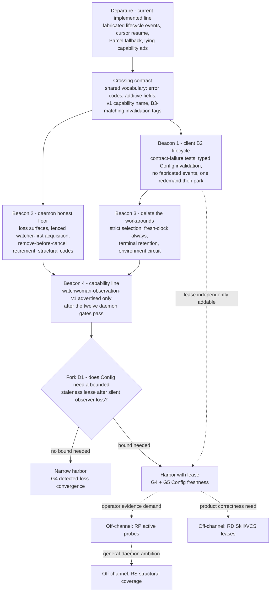

# Assurance route — beacons, rocks, and impositions

## Departure fix: where we are and what went wrong with the map

The working question was narrow: **when can OpenCode trust what the watcher
tells it, and what must the system do when it cannot?** Under the retained B2
decision, that concretely meant fixing indirect Config consumers that can stay
stale, and replacing the convention of laundering readiness and cancellation
through fabricated root-shaped exact events.

[`assurances0.gpt56sol.md`](/.design/watchman/assurances0.gpt56sol.md) then did
enormous useful cartography: a mandatory floor (F1–F9), orthogonal assurance
mechanisms, profiles R/RC/RD/RP/RS, a guarantee catalog G1–G8, and nine open
ledger questions. But it stopped at proximate recommendations — "build Profile
R regardless, RC is the best value, next decide G5" — without charting a
navigable route across that space. A map with no channel markings is a thing
you can drown next to.

This document is the route. It commits to:

1. **An ordered set of beacons** — observable positions, each with a
   verification gate that proves the sighting, not a property you hope holds.
2. **Named rocks** — the specific hazards on each leg, several of which are
   false beacons that look like safe water.
3. **Impositions** — externally fixed constraints and the steering invariants
   that keep you off the rocks on every leg.
4. **Fork rules** — where each of the nine open ledger decisions actually gets
   decided, and what evidence steers it.

## The harbor

The destination this route can honestly reach:

- **G4 detected-loss convergence, end to end.** Every loss reported to
  Watchwoman or OpenCode ends the affected root or delivery epoch; participating
  owners re-read authoritative state after a fresh epoch attaches. Claimed via a
  negotiated `watchwoman-observation-v1` capability, not assumed.
- **B2 lifecycle without fabrication.** `Watcher.Update` carries exact events
  only; loss and readiness ride control channels; Config alone emits typed
  invalidation for Agent, Command, and Plugin Source.
- **Strict selection and honest terminals.** No silent Watchman→Parcel
  movement, no cursor machinery, no infinite recovery loops, terminal failures
  retained with a deliberate clearing story.
- **The G5 question decided by evidence**, which lands you at the narrow harbor
  (R) or the harbor with a Config freshness lease (RC).

Explicitly not harbors, on any heading: complete event history, exactly-once
delivery, reconstruction of intermediate states during an outage.

## The charted route

Two crews sail this channel: the OpenCode carrier (Beacons 1, 3) and the
Watchwoman daemon (Beacon 2). They can run in either order after the crossing
contract, because Beacon 1 steers by signals today's daemon already emits
(`canceled` PDUs, connection closure, admitted-command timeouts), while Beacon
2 makes the daemon's own loss signals real. Beacon 4 is the crossing back:
only there do the two crews' claims get joined.

## Crossing contract (before either crew sails)

One small spec, fixed first, because it is the narrow point where both crews
must agree or collide later:

- the F5 error-code vocabulary (`root_blocked`, `root_too_large`,
  `observer_start_failed`, `observer_unsupported`, `observer_resource_exhausted`,
  `observation_lost`, `protocol_incompatible`)
- the additive envelope fields (`error_code`, `watchwoman_failure`,
  `watchwoman_epoch` on cancellation)
- the `watchwoman-observation-v1` capability name and its exact promised
  semantics
- the B2 invalidation tag names — imposed to match the future B3 union member
  so the eventual layer shift is a move, not a rework
  ([`vision0.gpt56s.md:896-899`](/.design/watchman/vision0.gpt56s.md#L896-L899))

Rocks on this leg: **Two-Crew Drift** (each side inventing vocabulary), and
**B3 Drift** (a shared invalidation field smuggled below Config — that is B3
renamed and needs its own acceptance decision). The seed of this spec is the
F5 table and compatibility section of
[`assurances0.gpt56sol.md`](/.design/watchman/assurances0.gpt56sol.md).

## Beacon 1 — client B2 lifecycle

**Sighting.** Contract-failure tests exist and pass against the current daemon:
loss terminates exact streams, Config emits its typed invalidation, consumers
switch on the tag before exact-path filtering, the live indirect-owner
staleness bug is gone, and no code publishes `{path: root, type: "update"}`
for readiness, route changes, cursor rejection, cancellation, or fresh
instance. An owner requests replacement observation once and parks; the root
supervisor alone schedules retry with shared per-root backoff.

**Steering.** Follow the confirmed carrier sequence from
[`vision0.gpt56s.md:909-926`](/.design/watchman/vision0.gpt56s.md#L909-L926):
contract-failure tests and the B2 typed consumer fix first, then the root
supervisor and explicit failure dispositions in `root.ts`.

**Rocks on this leg.**
- **Fabricated Event Reef** — consumers and tests that *match* the fake
  root-shaped updates; they must migrate to control channels before the
  convention is deleted, or they break on its removal.
- **Redemand Whirlpool** — Config's current `yieldNow` recovery loop; the
  owner-side fix is request-once-and-park, with terminal retention rather
  than looping.
- **Late Ghost** — a released interest resurrected by a late acknowledgement,
  PDU, retry, or unsubscribe completion (OpenCode gate 9 in the assurance map).
- **Reconnection Sandbar** — until Beacon 2 lands, client reconnection must
  not be treated as repair; the daemon will happily hand back the same damaged
  root. Keep the honesty narrow: claim only delivery-epoch convergence here.

**Gate.** The twelve OpenCode gates in the assurance map's verification
section, especially gates 1, 2, 4, 6, 8, and 9.

## Beacon 2 — daemon honest floor

**Sighting.** `watch` acknowledgement means native registration returned
success and buffered callbacks were reconciled with the initial scan (F1);
`notify::Error`, a pathless `Rescan` marker, or watcher-task death ends exactly
one root epoch (F3); a lost root is unroutable before cancellation is visible
(F4); failure responses carry stable structural codes (F5); the daemon no
longer advertises `clock-sync-timeout` or `cmd-flush-subscriptions` (F9).

**Steering.** Hide `notify` behind one deep internal module (the `Observation`
seam from F1) so no `notify::Event` or `ErrorKind` escapes. Run the
restart-gap, bootstrap-race, and overflow experiments early on this leg —
they are the chart-verification soundings that confirm the rocks below are
where the map says.

**Rocks on this leg.**
- **Deaf Ack** and **Blind Window** — the current construction-failure drop
  and scan-before-watch ordering; watcher-first buffered acquisition with a
  loss flag that ordinary event capacity cannot displace.
- **Vanishing Overflow** — the pathless `Rescan` marker currently ignored
  because Watchwoman iterates only event paths; attribution stays root-local.
- **Cancel Window** — the current cancel-sleep-remove ordering lets a fast
  re-watch reuse the retiring root; remove before cancel, with the
  subscription tick and cancellation receivers installed before the initial
  query can race them.
- **Prose Trap** — `Blocked` and `TooLarge` collapsed into one `RootBlocked`
  message; OpenCode must never classify by matching prose, and unknown codes
  degrade rather than guess.
- **Late Ghost** (daemon side) — a stale-epoch callback deleting or mutating
  its replacement (daemon gate 8).
- **Marketing Beacon** — deleting the false capability ads may break clients
  that wrongly rely on them; check OpenCode's own usage first.

**Obstruction, not rock.** **Notify Fog**: notify 8.2 suppresses dynamic
add failures other than `MaxFilesWatch` and filters traversal errors. This
cannot be cleared on this leg; it is permanent fog (below). Do not attempt
structural coverage here — that is the RS channel and requires upstream or a
fork.

**Gate.** The twelve daemon gates, plus the three early experiments. Advertise
nothing new yet.

## Beacon 3 — delete the workarounds

**Sighting.** Both Watchman→Parcel fallback sites are deleted
([`fallbacks0.glm53.md`](/.design/watchman/fallbacks0.glm53.md)); the cursor
machinery (`SubscriptionState.clock`, compatibility and cursor-rejection
branches, cursor metrics) is deleted behind fresh-clock-always recovery; a
terminal root failure is retained as an attributed suppression record cleared
only by intent change, policy reload, or operator retry; shared inotify
exhaustion opens an environment circuit instead of churn.

**Steering.** Order matters within this leg, as the confirmed sequence
already records: failure dispositions (Beacon 1's supervisor work) must exist
*before* the fallback sites die, or permanent refusals become either infinite
retries or silently unwatched roots. Strict selection precedes fresh-clock so
that when the cursor machinery is deleted, nothing still leans on it.

**Rocks on this leg.**
- **Recrawl Furnace** — reactive loss handling without coalescing and backoff
  turns a sustained node_modules-driven overflow into repeated full-root
  crawls; run the storm-amplification sounding before enabling broadly.
- **Capacity Bar** — process restart and root retry cannot manufacture inotify
  capacity; this deployment has documented prior exhaustion. The environment
  circuit is the only honest response.
- **Terminal Cache** — a root-terminal decision cached forever with no
  clearing path is an unbounded staleness bug wearing a stability costume;
  decide the clearing policy (ledger item 6) *before* landing this beacon.
  Vanished roots additionally need parent/topology sentinels, since a watch
  on a deleted directory cannot observe its own recreation.
- **Backpressure Bar** — if owner queues become bounded, saturation must
  terminate the affected exact stream (B2-compatible), never silently drop;
  a full queue cannot accept its own repair marker without reserved state
  (ledger item 8 decides this here).

**Gate.** OpenCode gates 3, 7, 8, 10, and 11; the storm-amplification and
recovery-economics experiments.

## Beacon 4 — capability line

**Sighting.** Watchwoman advertises `watchwoman-observation-v1` only after its
twelve gates pass deterministically; OpenCode negotiates it and uses structure
when present; legacy Watchwoman and stock Watchman get an explicit support
profile decision.

**Rocks on this leg.**
- **Marketing Beacon** — the single cautionary tale already in the fleet:
  `clock-sync-timeout` and `cmd-flush-subscriptions` are advertised today and
  implement no barrier. v1 means behavior, proven by gates; semver,
  buildinfo, and compatibility dates are not behavior negotiation.
- **Missing-Capability Inference** — absence of v1 means *unproven*, not
  *broken*; stock Watchman has its own real cookie and recrawl semantics and
  must not be misclassified. Ledger item 5 (degraded-allowed vs strict
  rejection under strict selection) is decided at this beacon, not earlier.

**Gate.** Negotiation fixtures against enhanced, legacy, and stock daemons;
the rollout order is Watchwoman first, gates second, advertisement third.

## Fork D1 — the freshness lease

The narrow question the assurance map ends on: does Config need a documented
maximum staleness bound after silent observer loss, or is detected-loss
convergence plus manual or process recovery enough?

**Steerage.** Decide it after Beacon 4, using instruments rather than
intuition: the restart-gap reproduction (does the old-cursor path actually
miss effective invalidation today), the metrics `files_in` vs `updates_out`
gap and `Rescan` counters from live operation, and measured Config audit cost
on representative roots. A yes lands the jittered low-rate Config audit
(Profile RC, guarantee G5) — one audit covers Config, Agent, Command, and
Plugin Source, works during daemon outage, and makes no observer-health
claim. A no rests on the narrow harbor. The lease is independently addable at
any point after Beacon 1, but deciding it early means deciding it blind.

**Rocks on this leg.**
- **Audit Mirage** — a successful audit refreshes domain state while the
  watcher stays dead; a fresh audit must never clear an observation-health
  error. State freshness and observer health are separate gauges, forever.
- **Empty Snapshot** — a failed audit (permission, mount, parse) retains
  last-good state with visible degraded health; an empty result must never
  masquerade as successful source truth. G5's guarantee carries its
  successful-scan qualifier for this reason.
- **Intuition Tuning** — the audit period comes from measured cost and
  acceptable staleness (ledger item 9), not from a round number.

## The rock chart

Consolidated, with the legs each rock threatens and the sounding that warns
you are near it.

| Rock | Threatens | Sounding — how you know / what keeps you off |
| --- | --- | --- |
| **Deaf Ack** | Beacon 2 | Root acknowledged after construction or registration failure; watcher-first fenced acquisition, ack only after coherent epoch |
| **Blind Window** | Beacon 2 | Mutation between scan and watch attachment missed by both; buffer concurrent events into the scan |
| **Vanishing Overflow** | Beacon 2 | Pathless `Rescan` ignored because paths are iterated; treat it as root-local loss |
| **Prose Trap** | Contract, Beacon 2 | `Blocked`/`TooLarge` collapsed to prose; OpenCode guessing text; structural codes, unknown codes degrade |
| **Reconnection Sandbar** | Beacon 1 | Client reconnect treated as repair; `register_root` returns the damaged root; daemon-side retirement is the actual repair |
| **Cancel Window** | Beacon 2 | Fast re-watch reuses a retiring root; remove from lookup before cancellation is visible |
| **Late Ghost** | Beacons 1, 2 | Stale-epoch callbacks or late PDUs mutating replacements or resurrecting released interests; epoch fences everywhere |
| **Fabricated Event Reef** | Beacon 1 | Lifecycle facts encoded as exact root-shaped updates; migrate consumers to control channels before deletion |
| **B3 Drift** | Contract, Beacon 1 | Any generic invalidation below Config; that is B3 renamed and needs its own decision |
| **Redemand Whirlpool** | Beacon 1 | Owner loops forever on retry; request once, park, supervisor owns scheduling |
| **Recrawl Furnace** | Beacon 3 | Sustained overflow plus naive retry becomes repeated full crawls; coalesce, backoff, hysteresis |
| **Capacity Bar** | Beacon 3 | Inotify exhaustion answered with restart or root churn; environment circuit, operator action |
| **Terminal Cache** | Beacon 3 | Terminal suppression with no clearing path; deliberate clearing policy plus sentinels for vanished roots |
| **Notify Fog** | Beacon 2 (as fog) | Suppressed dynamic-add and traversal failures in notify 8.2; only RS clears it; chart, don't fight |
| **Audit Mirage** | Fork D1 | Fresh domain state read as watcher health; separate the gauges permanently |
| **Empty Snapshot** | Fork D1 | Failed scan published as empty truth; last-good plus degraded health |
| **Marketing Beacon** | Beacons 2, 4 | Capabilities advertised without implemented barriers; gates before advertisement, always |
| **Two-Crew Drift** | Contract | Client and daemon vocabularies diverge; fix the crossing contract first |

## False beacons

Signals that read as safe water and are not observation evidence. None of
these may steer an assurance claim on any leg; they answer control-plane
questions only.

| False beacon | What it actually proves |
| --- | --- |
| Socket, PID, systemd `READY=1`, `version` | The control process can answer commands |
| Watchwoman `clock` response | An in-memory counter advanced |
| `flush-subscriptions` (Watchwoman's) | Subscription names were enumerated |
| `status.health=active` | The root exists with subscribers or triggers |
| Root directory `stat` | The path exists |
| `/proc` inotify counts | Some descriptors are allocated somewhere |
| Live join handle | The task has not exited — a live task can be hung |

## Permanent fog

Charted regions where no reactive signal exists on any heading: unreported
suspend/resume windows, suppressed descriptor failures inside notify, hung
but living tasks, platform defects that never report. The mandatory floor
does not part this fog — nothing reactive does. The only instruments with
reach into it are the owner audit (bounds *state* staleness, says nothing
about the observer) and the active probe (proves one *path* recently, says
nothing about coverage or the past). This is precisely why Fork D1 exists:
the fog is the argument for the lease, and the lease's cost is the argument
against. Do not buy instruments you have not decided you need; do not promise
through fog you have not charted.

## Off-channel marks

Charted but deliberately off this route, each with its entry conditions:

- **RP — active probes.** A cookie subsystem, not a file touch: waiter
  registration before marker creation, timeout, recrawl interaction, and the
  application-level amplification history recorded in
  [`cookie-clash0.gpt56s.md`](/.design/watchman/cookie-clash0.gpt56s.md).
  Read-only and network roots are excluded outright. Enter only on operator
  demand for positive recent evidence (ledger item 3).
- **RS — structural coverage.** Requires descriptor accounting notify 8.2
  does not expose: an upstream change, a maintained fork, or a native
  backend. Enter only if Watchwoman's product scope becomes a general-purpose
  daemon for clients beyond OpenCode (ledger item 4).
- **RD — per-owner leases.** Skill and VCS freshness leases beyond Config.
  [`watches.glm53.md`](/.design/watchman/watches.glm53.md) is the pattern —
  invalidation then authoritative re-read. Enter on product correctness need,
  not symmetry with Config (ledger item 2).

## Obstructions and impositions

**Obstructions** — dependencies you must go around, not through:

- **notify 8.2's interface** bounds what Beacon 2 can see; the RS channel is
  the only way around, at upstream or fork cost.
- **Watchman protocol compatibility** bounds every field change to additive;
  standard clients must keep working, so the crossing contract is envelopes,
  not replacements.
- **Upstream OpenCode movement** means freshen discipline on the patch stack
  throughout, and the carrier is rebuilt from final state
  ([`vision0.gpt56s.md:923-926`](/.design/watchman/vision0.gpt56s.md#L923-L926)),
  not carried as 30+ commits of refinement history.
- **Deployment coupling**: Watchwoman ships via the compfuzor-managed
  socket-activated service, so Beacon 2's rollout sequencing and Beacon 4's
  advertisement are release operations, not just code.

**Impositions** — accepted constraints that shape every leg:

1. **B2 is the encoding**, decided 2026-09-03. Typed invalidation at
   `Config.changes` only; `Watcher.Update` stays exact-only; tag names must
   match the future B3 member.
2. **Source truth, not history.** Watcher output is a reason to re-read.
   Events are not domain truth, and no leg may quietly start treating them
   as such.
3. **Files stay on Node.** Exact-file interests do not share the daemon's
   failure domain — but their current dead-on-failure loops still need
   recovery or explicit exclusion from any promise.
4. **The systemd socket stays bound** across daemon failure
   (`Restart=on-failure`), making process replacement the viable final
   circuit breaker — at a known cost (the 66-root, ~127k-file, ~1 GiB RSS
   snapshot cold-rebuilds).
5. **Host inotify ceilings are shared environment**, with documented prior
   exhaustion; capacity facts outrank restart instincts.
6. **Evidence independence**: a possibly-broken mechanism never proves
   itself; metrics and logs inform operators, never correctness policy.
7. **Repair scope matches fault scope** — delivery epoch, root epoch,
   backend, environment, or process; never a broader hammer for a narrower
   fault, never a narrower patch for a broader fault.

## Where each open decision gets decided

The assurance map's nine open ledger items, positioned on this route so none
of them floats:

| Ledger item | Decided at |
| --- | --- |
| 1. G4 only vs G5 Config bound | Fork D1 |
| 2. Which owners get G6 leases | Off-channel RD entry |
| 3. G7 active probes justified | Off-channel RP entry |
| 4. G8 structural coverage justified | Off-channel RS entry |
| 5. Missing v1: degraded or rejected | Beacon 4 |
| 6. What clears terminal suppression | Beacon 3, before landing |
| 7. Unreadable entries: fail or narrow claim | Beacon 2 |
| 8. Bounded or unbounded owner delivery | Beacon 3, with backpressure policy |
| 9. Audit and probe periods | Fork D1 aftermath, from measurement |

## What this chart does not do

It does not re-argue the assurance taxonomy, the profiles, or the guarantee
catalog — those are the map's job
([`assurances0.gpt56sol.md`](/.design/watchman/assurances0.gpt56sol.md)).
It does not promise anything through the fog, and it does not schedule work:
beacons are ordered by dependency and evidence, not by time. If a beacon's
sighting cannot be verified by its gate, you are not at the beacon, whatever
the code says.

## Cross-references

- [`assurances0.gpt56sol.md`](/.design/watchman/assurances0.gpt56sol.md) is
  the map this route navigates: the F1–F9 floor, the mechanism and profile
  taxonomy, G1–G8, and the verification gates cited at every beacon.
- [`vision0.gpt56s.md`](/.design/watchman/vision0.gpt56s.md) records the B2
  decision, the confirmed carrier sequence that Beacon 1 and Beacon 3 steer
  by, and the rebuild-from-final-state constraint.
- [`fallbacks0.glm53.md`](/.design/watchman/fallbacks0.glm53.md) charts the
  fallback sites Beacon 3 deletes.
- [`watches.glm53.md`](/.design/watchman/watches.glm53.md) is the
  invalidate-then-reread pattern any RD owner inherits.
- [`typed-watcher0.glm53.md`](/.design/watchman/typed-watcher0.glm53.md) is
  the deferred B3 end-state; the crossing contract's tag-vocabulary rule
  exists so that channel stays open.
- [`cookie-clash0.gpt56s.md`](/.design/watchman/cookie-clash0.gpt56s.md) is
  the amplification history that keeps RP off-channel.
- [`timeout0.gpt56s.md`](/.design/watchman/timeout0.gpt56s.md) is the FIFO
  timeout incident behind the admitted-command and failure-domain design
  Beacon 1 builds on.
- [`README.md`](/.design/watchman/README.md) is the maintenance log of the
  implemented line this route departs from.
