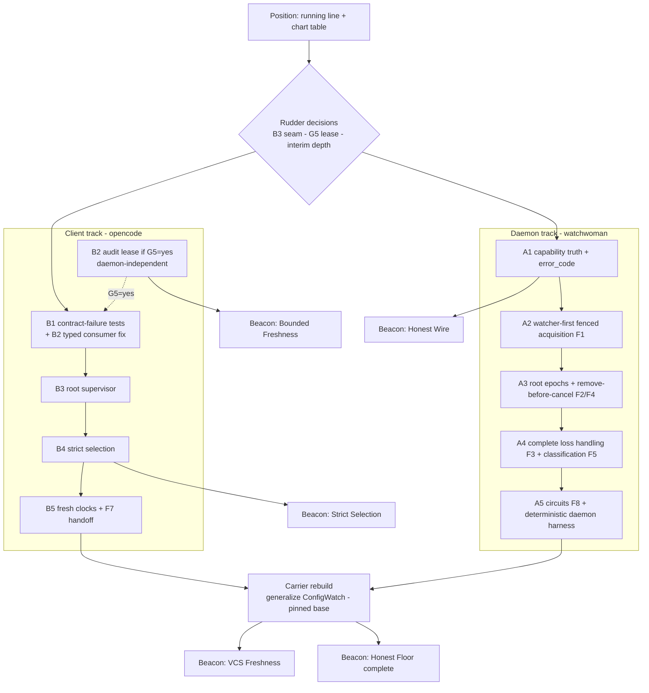

# Watchman remake navigation chart

## Sailing orders

We set out to answer one question: **can OpenCode's file watching be remade
into something trustworthy, and what will the remake honestly promise?** The
pursuit of an honest answer widened the chart. Answering it truthfully required
mapping problem spaces we had not set out to explore — daemon honesty
(acknowledging deaf roots, discarded loss signals, lying capabilities), epoch
fencing, structural failure classification, freshness leases, active probes,
coverage accounting. The solution spaces then narrowed to a shortlist: the
mandatory root-epoch floor (F1–F9), three optional mechanisms (owner audits,
path probes, coverage accounting), and the profiles they compose into
(R/RC/RD/RP/RS) with a guarantee catalog (G1–G8).

What the corpus has now are maps and a general heading: "build the floor
regardless", "Profile RC is the best value-to-complexity candidate", "the next
decision is G5". Those are proximate recommendations, not passages. Nothing
says in what order to sail, which work is independent of which, which rocks
each approach must dodge, what "arrived" means at each destination, or where
the human decisions sit that select between routes.

The order for this document: name the beacons, name the rocks and impositions,
mark the rudder decisions, and chart viable routes from the implemented line to
the destinations. This document adds no new mechanism decisions. It navigates
the existing corpus; every claim here traces to a source document.

## Position fix

Three fixes, taken together, are the current position.

**The running ship** — the implemented root-scoped Watchman stack
([`README.md`](/.design/watchman/README.md)): 25+ commits freshened onto
`43d09b9d`, verified, in service. Known waterline damage:

- the acquisition cliff
  ([`fallbacks0.glm53.md`](/.design/watchman/fallbacks0.glm53.md)): initial
  establishment is single-shot while the identical error classes after
  acknowledgement retry forever — one transient flap permanently converts an
  interest (or a whole concurrent herd) to Parcel, with no migration back,
  fatal-poison caching, and cross-interest timeout blast radius;
- resume discards the daemon-computed subscribe-response rows, so downtime
  changes can vanish without a signal
  ([`topic-query0.glm53.md`](/.design/watchman/topic-query0.glm53.md));
- readiness, cancellation, and fresh-instance transitions surface as
  fabricated root-shaped exact updates that Config's indirect consumers
  reject;
- initial-acquisition fallback to Parcel contradicts the accepted
  strict-selection direction.

**The chart table** — the design corpus:
[`vision0.gpt56s.md`](/.design/watchman/vision0.gpt56s.md) holds the direction
history and the human B2 decision (Config-local typed invalidation; B3
deferred, triggers met, **not accepted** — SD1 in
[`carrier1-review0.gpt56sol.md`](/.design/watchman/carrier1-review0.gpt56sol.md)).
[`carrier1.gpt56s.md`](/.design/watchman/carrier1.gpt56s.md) is the clean
rebuild proposal — blocked pending a B2/B3 seam decision plus corrections
CB1–7 and amendments AA1–5.
[`assurances0.gpt56sol.md`](/.design/watchman/assurances0.gpt56sol.md) is the
assurance map: floor, mechanisms, profiles, catalog, nine open decisions.

**The waters** — the environment the voyage sails in:

- watchwoman 0.7.0 + notify 8.2.0: can acknowledge a deaf root, discards
  `notify::Error`, ignores pathless `Rescan`, exposes prose-only errors,
  advertises unimplemented synchronization capabilities, and hides structural
  coverage failures inside `notify`;
- upstream `v2@origin` is actively investing in the same seams (`entries`
  watch kind, public `onReady`, source-derived `ConfigWatch`) — the seabed
  moves
  ([`upstream-delta0.glm53h.md`](/.design/watchman/upstream-delta0.glm53h.md));
- the managed deployment keeps the systemd socket bound and restarts the
  daemon on failure, making process replacement a viable last circuit breaker;
- a 30+-commit historical line and bookmark debt sit in our wake.

## How the question widened

| Started as | Widened into | Narrowed to |
| --- | --- | --- |
| Rebuild the watcher client (carrier1) | Daemon honesty: ack-when-deaf, discarded loss, re-watch reusing damaged roots | Mandatory root-epoch floor F1–F5, F4 + an honest wire |
| Trust the watcher | Freshness under hidden loss: suspend/resume, silent queue overflow | Owner audits as freshness leases (G5/G6); probes (G7) optional |
| Simplify recovery | Failure semantics: prose-only errors, shared resource exhaustion | Structural classification (F5); environment/process circuits (F8) |
| Keep the patch carryable | Upstream convergence: `ConfigWatch`, `entries`, `onReady` landed upstream | Generalize what upstream built; do not bypass it |

The widening was not drift. Each new problem space was forced by a review
finding that the previous frame could not contain: no client-side invalidation
design can compensate for a loss the daemon never reports
(carrier1-review CB1). The floor exists because of that finding.

## Beacons

Destinations worth heading toward, nearest-first by dependency (not by
distance). Each names its arrival proof — a beacon without an arrival proof is
a mirage.

### Beacon: Honest Floor (G4)

Every loss detected by or reported to the adapter ends the affected root or
delivery epoch; owners re-read authoritative state after a fresh attachment;
nothing fabricated crosses the exact stream. Spans both repos: daemon half
(F1–F5, F8) and client half (F2 delivery epochs, F6 fresh recovery, F7 B2
lifecycle handoff).

**Arrival proof:** the mandatory daemon gates 1–12 and OpenCode gates 1–12 in
[`assurances0.gpt56sol.md`](/.design/watchman/assurances0.gpt56sol.md)
(verification strategy) pass under fault injection.

**Hazards on approach:** the Deaf Acknowledge rock (the daemon half is
prerequisite — client floor work alone buys wording, not truth); hidden loss
(the promise is scoped to adapter-visible loss; do not let prose re-inflate
it); the recrawl furnace (loss handling without backoff/cooldown turns
recovery into a livelock).

### Beacon: Honest Wire (F9 + F5 wire shape)

The daemon advertises only semantics it implements; failures carry stable
machine-readable codes; `watchwoman-observation-v1` is advertised only after
deterministic tests prove each promise; the client decodes structure and never
matches prose. Capability truth is the cheapest beacon on the chart —
unadvertising `clock-sync-timeout` and `cmd-flush-subscriptions` costs one
line and immediately stops inviting clients to trust false barriers.

**Arrival proof:** advertisement corrected; additive `error_code` /
`watchwoman_failure` fields on the wire; v1 (if pursued) gated behind a daemon
test suite; legacy/enhanced/stock support profiles written down
(compatibility and rollout in assurances0).

**Hazards on approach:** the False Capabilities rock (any probe or barrier
design built on the advertised-but-unimplemented commands is cargo cult); the
Prose Envelope rock (without structural codes, terminal-vs-retry policy
degenerates to message matching, and retrying `root_too_large` recreates the
furnace the root policy exists to prevent).

### Beacon: Strict Selection (H1–H3)

`watchman` means watchman: no fallback sites, no mixed backends, no fatal
poison, no acquisition cliff — and one root supervisor owning cold acquisition,
replacement, replay, and backoff, with structural failure dispositions
(scope/recovery independent of operation labels).

**Arrival proof:** both fallback sites deleted **and** the supervisor landed
(never before — see the Churn Shore rock); the vision0 gate matrix green
(timing symmetry, single-flight, root isolation, unsubscribe fencing, explicit
Parcel rollback).

**Hazards on approach:** the Acquisition Cliff on the running line (the hole
exists today); Silent EOF (unsupported backends end streams as healthy-looking
empties — the typed Native failure contract, CB4, is part of this beacon);
the B2/B3 strait (the supervisor's interface shape depends on the seam
decision).

### Beacon: Bounded Freshness (G5, optionally G6)

Config — and any other owner explicitly named — converges to source truth
within a documented bound after source mutation quiesces, **even when the
watcher silently dies**. This is the only mechanism on the chart that bounds
hidden loss, and it is independent of the daemon: it works against today's
deaf-ack watchwoman.

**Arrival proof:** the profile-specific gates in assurances0 — mutate source
without delivering an event, advance a fake clock through `R_owner`, prove
convergence only after a successful scheduled scan; prove failed scans retain
last-good state and degraded health.

**Hazards on approach:** the False Comfort rock (a freshness lease is not
observation health — successful audits must never clear a degraded-observation
error); G6 scope creep (each named owner adds recurring cost; select per
owner, not by default); periods chosen by intuition instead of the measured
economics.

### Beacon: The Carrier

The destination the voyage set out for: one final-form implementation on a
pinned upstream — owner-local watch plans generalized from upstream's
`ConfigWatch`, the invalidation seam in its decided shape (Config-local B2, or
B3 if explicitly accepted), ordered subscriber attachment, one supervisor per
root, cursorless fresh-clock establishment, exact live PDUs, narrow tracing
from birth, the VCS freshness stack, and a small config surface.

**Arrival proof:** carrier1's proof obligations green against the actual
carrier; verification manifest recorded; floating bookmark moved exactly once
at promotion.

**Hazards on approach:** the Moving Seabed (upstream invests in the same
seams — generalize, don't displace; re-pin at execution); the 30-Commit Wake
(resist carrying the historical line forward; author final form); the
double-build trap (see the interim-depth rudder decision below).

### Beacon: VCS Freshness

jj/git/hg metadata watching as invalidation-native interests: exact-file
targets on Node, exact-tree targets (`refs/heads`, `op_heads/heads`) with
exact placement, cross-workspace jj awareness. A dependent stack — it needs
the carrier's foundation, not the whole carrier.

**Arrival proof:** allowlisted targets deliver through the deployed daemon
root policy; create+delete pairs both counted (op_heads compaction); excluded
VCS churn delivers nothing; a linked-worktree HEAD switch refreshes that
worktree; a jj operation in workspace B invalidates workspace A.

**Hazards on approach:** the Vanished Exact Root imposition (a watch on a
deleted directory cannot observe its own recreation — parent/topology
sentinels and the atomic VCS observation resolver, AA3, are part of the
stack); the Coverage Gap (AA4 — every mutable input read by cached
`provider.info()` must be covered by the plan or documented non-live); the
EG1 evidence gap (the exact-root delivery claim still needs a cited live
probe artifact).

### Distant light, not this voyage: Trustworthy Daemon (G8/RS)

Structural coverage accounting and shadow-epoch recrawls would make watchwoman
a generally trustworthy Watchman replacement for clients beyond OpenCode.
`notify`'s structural silence makes this a fork/upstream/direct-backend
project. Keep the light sighted; do not steer for it unless watchwoman's
product scope decision (open decision #4) turns that way.

## Rocks and impositions

A **rock** is fixable within our two-repo control. An **imposition** is a
constraint to draft around: platform nature, a human decision, upstream's
independence, or a library interface. Impositions define the channel depth;
routes are drafted around them, not through them.

### Daemon waters (watchwoman 0.7.0 + notify 8.2.0)

- **Deaf Acknowledge** (rock). Scan-before-watch window; watcher-construction
  failure dropped; `watch()` failure still acknowledged; `notify::Error`
  discarded; pathless `Rescan` ignored; re-watch returns the same damaged
  root; cancel-sleep-remove retirement race. *Sinks:* every client guarantee
  phrased stronger than "detected by or reported to the adapter". *Avoidance:*
  daemon floor legs (Route A); until then, scope all wording to
  adapter-visible loss and mark the daemon contract a promotion prerequisite.
- **False Capabilities** (rock). `clock-sync-timeout` and
  `cmd-flush-subscriptions` advertised, not implemented. *Sinks:* any
  synchronization or probe design that trusts the advertisement. *Avoidance:*
  implement or unadvertise before any G7 work; capability negotiation only
  after deterministic proofs.
- **Prose Envelope** (rock). `Blocked` and `TooLarge` merged into one
  human-readable string; no stable code on the wire. *Sinks:* structural
  terminal-vs-retry classification (CB2). *Avoidance:* additive
  `error_code`; decode the raw transport response, never `error.message`.
- **Recrawl Furnace** (rock). Root retirement is a full crawl; storms plus
  unretired retry = livelock. *Avoidance:* shared single-flight backoff,
  cooldowns, coalesced loss signals; environment circuit for
  `observer_resource_exhausted`.
- **Shared Exhaustion** (imposition of the kernel). Inotify capacity is
  finite; the deployment has prior `MaxFilesWatch` incidents. Neither root
  churn nor process restart manufactures capacity. *Avoidance:* the F8
  environment circuit — stop, retain degraded health, wait for capacity or an
  operator.

### Library waters (notify 8.2.0)

- **Structural Silence** (imposition while on notify 8.2). Dynamic add
  failures are suppressed except `MaxFilesWatch`; traversal errors are
  filtered. *Sinks:* any descriptor-coverage claim (G8) and any acknowledgement
  claim stronger than "registration returned success and callbacks were merged
  around the scan". *Avoidance:* keep F1's acknowledgement wording precise;
  treat RS as off-voyage.

### Protocol waters (the wire and the cursor)

- **Cursor Half-Life** (rock). The decided shore is fresh-clock-always
  (F6); the opposite shore is full response replay. The current line
  between them — reuse compatible clocks across generations, discard the
  response rows the daemon computed — hides downtime changes. *Avoidance:*
  pick a shore; the decided one is fresh clocks. Retire the README follow-up
  "publish response `files` on resume" unless cursor mode is deliberately
  retained.
- **Fabricated Exact Events** (rock). `{path: root, type: "update"}` as a
  control convention; indirect Config consumers reject it. Banned by F7 and
  by vision0's incoherent-middle finding. *Avoidance:* direct per-subscriber
  readiness acknowledgement plus the stream-failure channel; typed
  invalidation only at the decided seam.

### Client waters (opencode)

- **Acquisition Cliff** (rock, present damage). Single-shot initial
  establish vs retry-forever after ack; permanent per-interest Parcel; fatal
  poison; herd conversion; cross-interest timeout blast radius. *Avoidance:*
  the root supervisor; strict selection only lands with it.
- **Silent EOF** (rock). Unsupported Node/Parcel acquisition resolves
  `undefined`; the stream ends successfully; owners do not redemand on normal
  EOF. *Sinks:* "terminal loss is visible". *Avoidance:* the typed Native
  failure contract (CB4) — acquisition failure is typed failure, never
  healthy-looking end-of-stream.
- **B2/B3 Strait** (imposition — a human decision). B2 is decided; B3 is
  deferred with its revisit triggers met but **not accepted** (SD1).
  carrier1's interface as written sails B3. *Sinks:* building the
  watcher-level union without acceptance silently revisits a human decision;
  exposing invalidations to exact-path-only consumers is silent staleness
  (SD2). *Avoidance:* revise the carrier to the B2 shape (Config-local typed
  invalidation, F7 handoff, direct epoch-ready ack) **or** obtain explicit B3
  acceptance; either way Config plus Agent/Command/Plugin Source land in the
  same revision as the seam.
- **Terminal Suppression That Never Clears** (rock). A retained
  root-terminal failure (blocked, capped) needs an invalidation story: policy
  reload, intent change, or operator retry must clear it deliberately.
  *Avoidance:* attributed suppression records with explicit clearing
  conditions; never an unqualified `yieldNow` loop (OpenCode gate 8).
- **Queue Honesty** (choice, on a ledger). Owner queues are unbounded today.
  If bounded later, a full queue cannot accept its own repair invalidation
  without reserved state (CB7). *Avoidance:* keep the unbounded minimal
  policy, or implement per-logical-subscriber mailboxes with a reserved
  invalidation state; no generic invalidation value inserted into
  `Watcher.Update` (that is B3 under another name).

### Upstream waters (v2@origin)

- **Moving Seabed** (imposition — upstream's independence). `entries`,
  `onReady`, and source-derived `ConfigWatch` landed the day carrier1 froze;
  each construction pause invites a freshen. *Avoidance:* generalize
  `ConfigWatch` into the generic watch set rather than bypassing it; replace
  `onReady` with the invalidation contract while preserving its pinned
  outcomes; shape generic-foundation slices for early upstream proposal;
  re-pin at execution.
- **30-Commit Wake** (rock — our discipline). Carrying the historical
  refinement line forward preserves temporary answers as permanent
  machinery. *Avoidance:* author the replacement carrier in final form; keep
  the old line immutable as evidence; move the floating bookmark once.

### Open sea (platform nature)

- **Hidden Loss** (imposition of nature). Suspend/resume and unreported
  kernel loss exist; no design detects everything. *Avoidance:* wording
  discipline (adapter-visible loss only) and freshness leases — the only
  bound on hidden loss.
- **Probe Artifacts** (imposition of physics and load). Cookie-style probes
  need writable roots, can time out under load, and their markers leak into
  other raw watchers (cookie-clash amplification). *Avoidance:* restrict to
  active writable roots; correct waiter-before-creation ordering or do not
  build; RP stays evidence-driven.
- **Vanished Exact Roots** (imposition of topology). A watch on a deleted
  directory cannot observe its recreation; store pointers can change under a
  cached scope. *Avoidance:* parent/topology sentinels outside the
  replaceable store; atomic VCS observation resolution (AA3).

## Rudder decisions

These select between routes. Each is cheap to decide and expensive to defer.

| # | Decision | State | What it selects |
| --- | --- | --- | --- |
| 1 | G5: does Config get a documented staleness bound? | Open (assurances0 open #1) | Whether the audit-lease legs sail, and where they dock |
| 2 | G6: which other owners get leases | Open (#2) | Scope of per-owner audit work (Skill, VCS) |
| 3 | B3 acceptance | Deferred; triggers met; **not accepted** (SD1) | The carrier's seam shape: Config-local B2 (F7) vs watcher-level union ([`typed-watcher0.glm53.md`](/.design/watchman/typed-watcher0.glm53.md)) |
| 4 | Supported-daemon policy without v1 | Open (#5) | Legacy degraded mode (one explicit diagnostic) vs strict rejection |
| 5 | Watchwoman product scope (G8) | Open (#4) | Whether the distant light is ever lit |
| 6 | Terminal suppression clearing | Open (#6) | What clears a retained root-terminal failure |
| 7 | Delivery boundedness | Open (#8) | Unbounded minimal policy vs per-subscriber reserved mailboxes |
| 8 | Interim depth | **Unwritten** — see below | How much correction lands on the running line vs straight into the carrier |
| 9 | Probe adoption (G7) | Open (#3) | Whether any RP leg sails at all |

**Decision 8 needs naming because the corpus disagrees with itself.** The
vision0 B2 addendum's confirmed sequence lands supervisor, strict selection,
and fresh-clock on the current line, then authors the replacement carrier from
that final state. carrier1 says author one final-form implementation directly
and use the old line only as evidence. These are different amounts of building
twice. The supervisor is the most expensive thing to build twice and the
current line's cursor/fallback architecture is slated for deletion either way.
The rudder options:

- **Minimal interim** (carrier1-shaped): land only corrections that survive
  into any future — contract-failure tests, the B2 typed consumer fix
  (repairs a live staleness bug), daemon-side capability truth and
  `error_code` (independent repo, survives everything) — and put structural
  work (supervisor, strict selection, fresh clocks) directly into the
  carrier.
- **Full interim** (vision0-shaped): run the confirmed six-step sequence on
  the current line first, bank the improvements in service, rebuild after.

Either is viable; the fleet should simply not do both by accident.

## Routes

### Route A — Daemon-first ("The Honest Passage")

Legs in watchwoman (Rust), independently of the client:

1. **A1 Capability truth** — unadvertise the two unimplemented
   synchronizations; add additive `error_code` / structured failure fields;
   decode them client-side (one small client commit rides along). Cheapest
   leg on the chart; unblocks Honest Wire immediately.
2. **A2 Watcher-first fenced acquisition (F1)** — native observation before
   scan, epoch-local buffer, merge, acknowledge only after a coherent epoch.
3. **A3 Root epochs and retirement (F2, F4)** — `Acquiring → Live → Lost →
   Retired` on `root_number` identity; lookup removal before cancellation is
   visible; fenced replacement.
4. **A4 Complete loss handling (F3) + classification (F5)** — end the epoch
   once on error, `Rescan`, task death, mailbox failure; structural
   `code/scope/recovery`; no prose classification anywhere.
5. **A5 Circuits (F8) + the deterministic daemon harness** — environment
   circuit for shared exhaustion; process circuit as backstop; the fault
   injection tests that make every guarantee above provable.

**Rocks dodged:** Deaf Acknowledge, False Capabilities, Prose Envelope,
Recrawl Furnace (with the harness enforcing backoff/coalescing gates).

**Leaves unresolved:** the running client keeps its cliff, fabricated
updates, and dropped resume rows while A sails. Route A alone is not a
passage — pair it with at least B1.

### Route B — Client-first ("The Shallow-Water Run")

Legs in opencode (TypeScript), workable against today's daemon:

1. **B1 Contract-failure tests + the B2 typed consumer fix** — the vision0
   step-1 test battery (response rows/clock, pre-ack publication, delayed
   first ack, indirect owners, cancellation while unavailable, inactive
   Parcel EOF) plus Config's typed invalidation at `Config.changes` with
   Agent/Command/Plugin Source switching on the tag. Repairs the live
   indirect-owner staleness bug and pins the seam for everything after.
2. **B2 Audit lease (if G5 = yes)** — jittered low-rate Config source audit;
   daemon-independent; bounds hidden loss today. Must never be reported as
   observation health.
3. **B3 Root supervisor** — one lifecycle owner for cold acquisition,
   replacement, replay, backoff; registrations precede acquisition; release
   fencing.
4. **B4 Strict selection** — delete both fallback sites and mixed-backend
   metrics only after B3 exists.
5. **B5 Fresh clocks + F7 handoff** — delete cursor machinery; direct
   per-subscriber epoch-ready acknowledgement; stream failure ends delivery
   epochs; owners re-read after fresh attachment.

**Rocks dodged:** Acquisition Cliff (B3/B4), Fabricated Exact Events (B1/B5),
Moving Seabed (B1 tests double as upstream-convergence seeds), Cursor
Half-Life (B5 picks the decided shore).

**Leaves unresolved:** Deaf Acknowledge sits under the waterline until the
daemon track sails; the audit lease bounds staleness but says nothing about
watcher health.

### Route C — The Carrier Run

The confirmed terminus, sailed with the chart revised:

0. **C0 Decisions** — B3 accept/decline (rudder 3); G5 yes/no (rudder 1);
   interim depth (rudder 8); supported-daemon policy (rudder 4).
0.5. **C0.5 Revise the carrier chart** — carrier1 corrected for the decided
   seam, CB1–7, AA1–5, and the upstream-delta adaptations (`entries` in the
   intent model, `onReady` replaced while preserving pinned outcomes,
   `ConfigWatch` generalized into the watch set, updated carry inventory).
1. **C1 Pin and preserve** — resolve current `v2@origin`, immutable snapshot
   of the old tip, frozen install, baseline results.
2. **C2 Foundation** — typed `Change` union in the decided shape, typed
   intents with `entries`, ordered attachment, typed Native failure, generic
   Node/Parcel recovery.
3. **C3 Watch set** — generalize upstream's `ConfigDiscovery → ConfigWatch →
   FiberMap reconcile`; migrate Config and indirect consumers atomically with
   the seam (SD2).
4. **C4 Protocol harness** — scripted raw-client actor, codecs, admission,
   deadlines, typed failure facts; complete response fixtures including
   fields the contract ignores.
5. **C5 Root supervisor in final form** — replay cohort clock, fresh clocks,
   response discard, exact PDU mapping, invalidations, terminal scoping,
   tracing from birth. No interim root implementation.
6. **C6 Strict selection** — discriminated selector through Core/Server/CLI;
   every fallback catch removed; explicit rollback verified.
7. **C7 VCS stack** — semantic full-metadata event, provider-owned plans,
   exact roots, topology reconciliation, jj composition behind its resolver.
8. **C8 Verify, freshen, promote** — deterministic + live + loaded-host +
   rollback gates against the actual carrier; one fetch; manifest; bookmark
   moved once.

**Parallel prerequisite track:** the daemon floor legs (Route A) sail in the
other repo. Promotion is blocked until the supported-daemon contract passes
or rudder 4 selects an explicit legacy profile with its diagnostic.

**Rocks dodged:** 30-Commit Wake (by construction), Acquisition Cliff (the
supervisor is born, not patched), B2/B3 Strait (C0 decides before C2),
Moving Seabed (re-pin leg + early-upstream shaping of C2/C3).

**Risks:** the longest single build on the chart; harness discipline is
load-bearing; upstream may move mid-build (the freshen leg exists for this).

### Recommended passage

Decisions are cheap; sail them first. C0's four rudder calls unblock
everything and none requires code.

Then run two tracks in parallel, because they are independent repos and
independent failure domains:

- **Client:** B1 immediately — it is small, fixes a live staleness bug, and
  every later leg reuses its tests. Add B2 when G5 is answered yes; it banks
  the only hidden-loss bound on the chart and survives every future
  architecture.
- **Daemon:** A1 immediately (nearly free), then A2–A5 at whatever pace the
  Rust side sustains.

While those run, revise the carrier chart (C0.5) so the structural work has a
current map. When the daemon floor is far enough along to state its contract
(or rudder 4 picks legacy mode), execute C1–C8, absorbing B3–B5 into the
carrier rather than building them twice — unless rudder 8 selects full interim
depth, in which case B3–B5 land on the running line first and the carrier
authors from their final state.

The short version: **A1 + B1 now; A2–A5 and B2 as the parallel tracks; the
carrier as the convergence; VCS as its dependent stack.**

## No leg ends in an incoherent middle

The corpus repeatedly finds the same wreck: a half-state between two coherent
shores. The route rule is that every leg must land on a shore — a state whose
behavior is fully described by one contract:

| Middle | Shores | Wreck found by |
| --- | --- | --- |
| Fabricated root-shaped updates as "invalidation-lite" | Exact-only stream + owner-local invalidation (B2/F7) — or — watcher-level union (B3, if accepted) | vision0 four-review synthesis; assurances0 F7 |
| Half-kept cursors (reuse clock, ignore rows) | Fresh clock every establishment (decided) — or — full response replay | topic-query0; vision0 response-delivery finding |
| Strict selection without the supervisor | Supervisor + strict selection together | vision0 review consensus |
| Audits reported as observation health | Lease = freshness bound; observation health is separate state | assurances0 owner-audit section |
| Capability advertised without behavior | Implement it — or — unadvertise it | assurances0 F9 |

If a proposed leg's endpoint cannot name which shore it lands on, it is not a
leg; it is the middle.

## Route × rock chart

Rows are routes/tracks; the most consequential rocks as columns. ● = dodged
by the route; ◐ = dodged only if paired or decided; ○ = unaffected; ✕ = the
route hits this rock unless something else clears it first.

| Route | Deaf Ack | False Caps | Prose Env | Cliff | Fab. Events | Cursor Half-Life | Moving Seabed | 30-Cmt Wake | Hidden Loss |
| --- | --- | --- | --- | --- | --- | --- | --- | --- | --- |
| A: daemon-first | ● | ● | ● | ○ | ○ | ○ | ○ | ○ | ◐ wording only |
| B: client-first | ✕ | ○ | ◐ (decode-side) | ● | ● | ● | ◐ | ○ | ◐ B2 lease bounds it |
| C: carrier run | ◐ needs A or rudder 4 | ◐ via A1 | ◐ via A1 | ● | ● decided at C0 | ● | ● re-pin leg | ● | ◐ wording + lease |

## Soundings

Depth-soundings to take before or while sailing specific legs — the
highest-information experiments from assurances0, mapped:

| Sounding | Informs | When |
| --- | --- | --- |
| Restart-gap reproduction (stop daemon, mutate, restart, observe) | B1/B5, F6 | Before B5; validates the fresh-clock shore |
| Bootstrap race (pause scan, mutate before native attach) | A2 (F1) | Before/with A2 |
| Overflow path (lower queue capacity, capture `Rescan`) | A4 (F3) | With A4 |
| Dynamic descriptor failure (`MaxFilesWatch` + non-ENOSPC add failure) | What is fixable at watchwoman vs notify | Before any G8 thought; informs rudder 5 |
| Recovery economics (retirement vs restart vs audit vs probe latency) | G5 period; retirement cooldown | Before B2 period choice |
| Probe applicability (writable, read-only, bind-mount, network roots) | Rudder 9 (G7) | Only if a probe leg is considered |
| Storm amplification (sustained overflow during recovery) | Furnace avoidance gates | With A4/A5 harness |

Existing instruments: the channel metrics dumps
([`metrics0.glm53.md`](/.design/watchman/metrics0.glm53.md)) as the
before/after instrument on the running line; upstream's
`benchmark-location-memory.ts` for loaded-host measurement; the scripted
protocol harness ([`tools0.gpt56s.md`](/.design/watchman/tools0.gpt56s.md))
as the C4 prerequisite. Plus one evidence debt: the EG1 exact-root live
probe artifact, owed by the VCS beacon.

## Lights not on this voyage

Explicitly out of scope for every route above; naming them prevents
accidental steering:

- complete or durable event history; exactly-once delivery; reconstruction
  of intermediate states during outages;
- `watch-del` reconciliation; Parcel↔Watchman promotion, bridging, or
  handoff; file watches tunneled through Watchman;
- a metrics renderer surviving into the carrier (narrow tracing replaces
  it; OTEL export is a later swap at the injectable seam);
- watcher-wide typed continuity (that is B3 — sails only with explicit
  acceptance);
- structural coverage (G8/RS) unless the watchwoman product-scope decision
  turns toward the distant light.

## Cross-references

- [`assurances0.gpt56sol.md`](/.design/watchman/assurances0.gpt56sol.md) —
  the problem-space map this chart navigates: floor F1–F9, mechanisms,
  profiles R/RC/RD/RP/RS, guarantee catalog G1–G8, verification gates
  (borrowed here as arrival proofs), and the open decisions (rudder 1–7, 9).
- [`vision0.gpt56s.md`](/.design/watchman/vision0.gpt56s.md) — direction
  history, hypotheses H1–H6, the B2 decision addendum, the confirmed
  sequence (one side of the interim-depth rudder), and the incoherent-middle
  findings.
- [`carrier1.gpt56s.md`](/.design/watchman/carrier1.gpt56s.md) — the Carrier
  beacon's architecture and construction outline (Route C's skeleton); its
  B3-dependent interface is what C0 must re-decide.
- [`carrier1-review0.gpt56sol.md`](/.design/watchman/carrier1-review0.gpt56sol.md)
  — CB1–7 and AA1–5 (the carrier chart's required corrections), SD1–3 (the
  B2/B3 strait and ordering constraints), and the supported-daemon contract
  that links Route A to Route C.
- [`upstream-delta0.glm53h.md`](/.design/watchman/upstream-delta0.glm53h.md)
  — the Moving Seabed: what upstream landed, the required adaptations, and
  the generalize-don't-bypass strategy Route C adopts.
- [`fallbacks0.glm53.md`](/.design/watchman/fallbacks0.glm53.md) — precise
  soundings of the Acquisition Cliff on the running line; the position-fix
  evidence for the client track's urgency.
- [`topic-query0.glm53.md`](/.design/watchman/topic-query0.glm53.md) — the
  Cursor Half-Life evidence: discarded resume rows, tombstone GC, and the
  subscribe race the fresh-clock shore retires.
- [`watches.glm53.md`](/.design/watchman/watches.glm53.md) — the VCS beacon's
  target matrix and the invalidation-native consumption pattern.
- [`typed-watcher0.glm53.md`](/.design/watchman/typed-watcher0.glm53.md) —
  the B3 shore of the seam decision, held ready behind rudder 3.
- [`cookie-clash0.gpt56s.md`](/.design/watchman/cookie-clash0.gpt56s.md) —
  the Probe Artifacts imposition and why copying cookie surfaces without
  their ordering semantics is cargo cult.
- [`tools0.gpt56s.md`](/.design/watchman/tools0.gpt56s.md) — the harness and
  fixture inventory that C4 and the daemon gates stand on.
- [`README.md`](/.design/watchman/README.md) — the running ship's maintenance
  record: implemented behavior, verification history, freshen procedure, and
  the remake-status banner this chart supersedes as navigation (not as
  implementation record).
