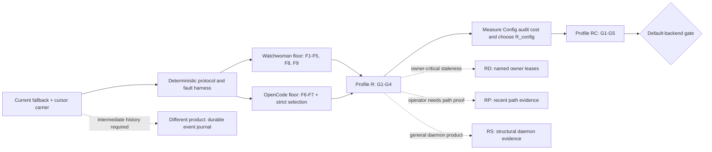

# Navigation from watcher transport to filesystem assurance

## Purpose

[`assurances0.gpt56sol.md`](/.design/watchman/assurances0.gpt56sol.md) is a
hazard atlas. It correctly separates several meanings of "watcher health," but
that expansion makes it hard to see which destination matters, what must be
built first, and which attractive mechanisms lead somewhere else.

This document chooses a course. It does not replace the evidence or mechanism
detail in `assurances0`.

**Recommended voyage:** build **Profile R** as the non-negotiable transport and
recovery floor, then land directly at **Profile RC** by adding an independent
Config audit. Do not put RD, RP, RS, B3, runtime backend bridging, or event
history on that critical route. Open those branches only when their named fork
condition occurs.

The immediate product claim is therefore:

> Startup derives Config from source without waiting for Watchwoman. During a
> live delivery epoch, reported changes remain exact. Every loss reported to
> Watchwoman or OpenCode ends the affected epoch, a fresh attachment precedes
> owner recovery, and Config publishes typed B2 invalidation and re-reads
> source. An independent Config audit bounds otherwise silent staleness by
> `R_config + scan + publication latency`, provided the source read succeeds.

`R_config` must become a measured, documented number before RC is claimed.
Until then, the implementation may contain an audit but has no freshness lease.

This is current-state convergence, not a promise to retain every filesystem
transition. That product boundary is already decided
([`assurances0:355-376`](/.design/watchman/assurances0.gpt56sol.md#L355-L376)).

## Keep the chart elements separate

| Element                 | Existing work                                                                                   | What it is not                               |
| ----------------------- | ----------------------------------------------------------------------------------------------- | -------------------------------------------- |
| **Destination**         | G1-G5 and Profile RC                                                                            | A daemon feature list or a `healthy` boolean |
| **Vessel**              | The source-owner, physical-watch, root-supervisor, and generation seams preserved from carrier1 | Proof that the underlying observer works     |
| **Engine**              | Watchwoman for selected directories; Node for exact files                                       | A domain source of truth                     |
| **Instruments**         | Epoch logs, structured failures, metrics, probes, audits                                        | Interchangeable evidence of the same fact    |
| **Correction maneuver** | Root retirement, owner reread, environment circuit, process replacement                         | Evidence that a fault happened               |
| **Chart extension**     | VCS topology and allowlisted metadata watches                                                   | Part of Config's assurance critical path     |

The original consolidation question was how to share expensive directory roots
without leaving refresh-on-signal owners silently stale. The later question is
not "how healthy is Watchwoman?" It is: **what end-to-end claim may a named owner
make, under which failures, by what deadline?**

## Route at a glance



The daemon and client floors can be developed in parallel. Neither alone earns
Profile R. RC follows R because an audit can repair Config state while a broken
reactive path still lies about detected loss; that would produce fresh Config
by accident, not a trustworthy carrier.

## Main-route beacons

The existing G identifiers are useful destination beacons. Each beacon below
has an externally testable arrival condition. Mechanism completion is not
arrival.

| Beacon                               | Arrival condition                                                                                                                                                                                            | Rocks it marks                                                                                                                                               | Required sounding                                                                                                                                                    |
| ------------------------------------ | ------------------------------------------------------------------------------------------------------------------------------------------------------------------------------------------------------------ | ------------------------------------------------------------------------------------------------------------------------------------------------------------ | -------------------------------------------------------------------------------------------------------------------------------------------------------------------- |
| **G1 Startup source truth**          | Config and Skill produce their initial source-derived state while the daemon is absent and observation remains pending or visibly unavailable.                                                               | Daemon readiness blocking product state; a failed read becoming an empty successful snapshot.                                                                | Start with no daemon, assert source state is available, then attach observation without replacing good state.                                                        |
| **G2 Truthful root acknowledgement** | Enhanced Watchwoman acknowledges `watch` only after native registration succeeded and callbacks around its independent scan were reconciled into one unpublished epoch.                                      | Scan-before-watch gap; constructor or recursive registration failure acknowledged as success; publication before coherence.                                  | Inject both setup failures and pause the scan around a mutation; no failed root is routable and the mutation is in the acknowledged view.                            |
| **G3 Exact live delivery**           | During a live delivery epoch, ordinary reported create/update/delete changes retain exact paths after declared filtering. Any inability to preserve exact output ends the epoch.                             | Stale callbacks entering a replacement; pathless overflow ignored; a full bounded queue silently dropping rows; lifecycle facts fabricated as file updates.  | Deliver normal rows, overflow, callback failure, and late old-epoch rows; exact rows survive only before the epoch-ending signal.                                    |
| **G4 Detected-loss convergence**     | Every adapter-, daemon-, transport-, or local-delivery loss the system can see ends the right epoch once. A fresh attachment is acknowledged before each participating owner re-reads.                       | Logged-and-discarded `notify::Error`; ignored `Rescan`; dead task; damaged-root reuse; cancel-before-remove race; old-clock recovery; competing retry loops. | Inject every reported-loss shape and prove root-local blast radius, fresh identity, one retry owner, B2 invalidation, and post-attachment reread.                    |
| **G5 Config freshness lease**        | A deliberately suppressed event still leads Config-mediated state to converge no later than the accepted `R_config` plus successful scan and publication latency.                                            | Fully hidden loss, suspend without a marker, a live-but-hung observer, control-plane green lights, audit failure misreported as success.                     | Suppress delivery, advance a fake clock through the bound, and prove convergence only on successful audit; failed audit retains last-good state and degraded health. |
| **Default-worthy operation**         | The deployed daemon negotiates the tested contract, Watchman selection never becomes Parcel at runtime, incident cost stays within accepted limits, and rollback is an explicit restart-time backend choice. | Semver inference; false capability claims; acquisition cliff; recrawl furnace; root-local failures causing process-wide churn.                               | Integrated fault campaign, live restart/overflow trials, resource measurements, and an explicit Parcel rollback drill.                                               |

G1-G4 are Profile R
([`assurances0:913-928`](/.design/watchman/assurances0.gpt56sol.md#L913-L928)).
G5 is the only additional beacon on the recommended voyage
([`assurances0:930-944`](/.design/watchman/assurances0.gpt56sol.md#L930-L944)).

## Terrain

### Rocks: limits no implementation can wish away

| Rock                                                                                                             | Consequence for navigation                                                                                                        |
| ---------------------------------------------------------------------------------------------------------------- | --------------------------------------------------------------------------------------------------------------------------------- |
| **Hidden loss exists.** Kernel, platform, `notify`, and daemon defects can omit a change without reporting loss. | Profile R cannot have a time bound. RC uses independent source reads; no reactive mechanism may be worded as universal detection. |
| **A source reread recovers state, not history.**                                                                 | If a consumer needs each intermediate transition or exactly-once order, leave this route and design a durable journal.            |
| **Authoritative reads can fail.**                                                                                | A lease is conditional on a successful read. Retain last-good state and separate source degradation from observation degradation. |
| **`notify` hides some descriptor failures.**                                                                     | G2 cannot be inflated into G8. General structural coverage requires a `notify` change, maintained fork, or direct native backend. |
| **Probes are path-, time-, platform-, and writability-specific.**                                                | A probe cannot substitute for owner freshness or subtree coverage and is not part of RC.                                          |
| **Watch roots and inotify capacity cost real resources.**                                                        | Repair uses the smallest trustworthy scope; shared exhaustion opens an environment circuit instead of a retry or restart furnace. |
| **The Watchman transport has a serialized uncorrelated FIFO.**                                                   | An admitted timeout retires that generation. Continuing it cannot be made safe by a better retry policy.                          |

These limits define honest language, not missing implementation work
([`assurances0:323-353`](/.design/watchman/assurances0.gpt56sol.md#L323-L353),
[`assurances0:1071-1081`](/.design/watchman/assurances0.gpt56sol.md#L1071-L1081)).

### Obstructions: defects on the present route

| Obstruction                                                                                                | Course correction                                                                                                                                |
| ---------------------------------------------------------------------------------------------------------- | ------------------------------------------------------------------------------------------------------------------------------------------------ |
| Watchwoman scans before attachment and can acknowledge failed native setup.                                | F1 watcher-first buffered acquisition; publish only a coherent root.                                                                             |
| Watchwoman runs a subscription's initial query before installing its tick receiver and fence.              | Install tick and cancellation receivers and capture the starting fence before the initial query can race them.                                   |
| Runtime error, pathless `Rescan`, task death, or mailbox loss can leave a root routable.                   | F2-F4 epoch state, complete loss handling, old-epoch fencing, and remove-before-cancel.                                                          |
| Policy refusal, size cap, transient setup, incompatibility, and resource exhaustion collapse into prose.   | F5 structured `code / scope / recovery`; never parse messages into policy.                                                                       |
| Re-watch can return the same damaged native root.                                                          | Retire the root observation epoch, not merely the client generation.                                                                             |
| The client retains old clocks and discards subscribe-response recovery rows.                               | F6 fresh establishment plus owner reread; make response history non-load-bearing.                                                                |
| Readiness and discontinuity are fake root-shaped exact updates.                                            | F7 direct readiness/failure control and Config-local B2 invalidation. B3 remains deferred.                                                       |
| Initial acquisition may silently choose Parcel while equivalent post-ack failure retries Watchman forever. | Delete both Watchman-to-Parcel catches; backend selection remains static.                                                                        |
| Current capabilities claim barriers Watchwoman does not implement.                                         | Withdraw false claims; advertise `watchwoman-observation-v1` only after its semantic gates pass.                                                 |
| Some exact-file owners die on stream failure.                                                              | Give each promised owner local recovery or explicitly exclude it from any freshness claim.                                                       |
| A normal full queue cannot accept the invalidation intended to repair it.                                  | Keep exact delivery unbounded for now, or terminate the affected stream; a future bounded mailbox needs reserved owner-local invalidation state. |

The current promise/reality table supplies the source evidence for these
obstructions
([`assurances0:300-316`](/.design/watchman/assurances0.gpt56sol.md#L300-L316)).

### Impositions: accepted boundaries for this voyage

1. B2 stays at `Config.changes`; `Watcher.Update` remains exact-only.
2. Filesystem and VCS source state is truth; event history is not the product.
3. Ordinary live directory events remain exact paths.
4. A Watchman-selected directory never silently changes to Parcel.
5. Exact file interests remain on Node and outside daemon root failure domains.
6. One root supervisor owns timed retry; owners request attachment once and wait.
7. Profile R covers detected or reported loss only.

Changing item 1 is the B3 architecture fork, not an incidental refactor. The
human direction record explicitly defers it
([`vision0:883-929`](/.design/watchman/vision0.gpt56s.md#L883-L929)).

## The viable main voyage

### Leg 0: Write the claim card

Before changing transport code, freeze this tuple for the first release:

| Axis              | Selected value                                                                                                                                    |
| ----------------- | ------------------------------------------------------------------------------------------------------------------------------------------------- |
| Assured object    | Config-mediated current state                                                                                                                     |
| Failure set       | All setup and runtime losses reported to Watchwoman/OpenCode, plus silent loss bounded by Config audit                                            |
| Temporal contract | Immediate epoch termination on detected loss; Config convergence by accepted `R_config + scan + publication` after quiescence and successful read |
| Evidence          | Deterministic fault injection for R; independent Config source audit for G5                                                                       |
| Repair scope      | Delivery, root, backend, environment, or process according to structured scope; owner reread after every gap                                      |
| Degradation       | Retain last-good Config, expose observation and source-read degradation separately                                                                |
| Compatibility     | Enhanced Watchwoman v1; legacy behavior must be explicitly degraded or rejected                                                                   |

**Exit:** every phrase in the advertised guarantee maps to a test and an owner.
No unnamed owner inherits Config's lease.

### Leg 1: Build the deterministic helm

Create the scripted protocol actor proposed in
[`tools0.gpt56s.md:1798-1830`](/.design/watchman/tools0.gpt56s.md#L1798-L1830)
before rewriting recovery. It must hold and release command acknowledgements,
PDUs, connection loss, cancellation, timeout, retry, and generation endings
without sleeps or random jitter.

Preserve the useful current tests for root sharing, timeout isolation, release
during outage, and add-before-remove interest reconciliation. Replace tests
whose expected mechanism is now rejected: retained-cursor resume and fabricated
ready updates.

**Exit:** every transition needed by Legs 2 and 3 can be driven by a test-owned
barrier, including two roots and late messages from an old attempt.

### Leg 2: Make a Watchwoman root an honest epoch

Establish the daemon-side obligations of F1-F5, F8, and F9. Put native
observation acquisition and loss behind one daemon-internal module:

1. Acquire the native watcher into an unpublished epoch.
2. Register recursively and fail acknowledgement on setup failure.
3. Buffer callbacks while the independent scan runs.
4. Treat buffer loss, `notify::Error`, `need_rescan`, and task death as epoch loss.
5. Merge the scan and buffered changes, then publish the root and acknowledge.
6. On later loss, atomically remove the epoch from lookup before cancellation.
7. Install subscription tick and cancellation receivers and capture the starting fence before running the initial query.
8. Fence every callback and retirement action by root number.
9. Emit structured failure code, scope, and recovery policy.
10. Stop claiming false synchronization capabilities; gate the new behavior with one versioned capability.

Root retirement remains the normal repair. Add shadow-root reconstruction only
if integrated recovery measurements show retirement cost is unacceptable; current
`debug-recrawl` is not a coherent substitute
([`assurances0:748-771`](/.design/watchman/assurances0.gpt56sol.md#L748-L771)).

**Exit:** mandatory daemon gates 1-12 pass
([`assurances0:1224-1243`](/.design/watchman/assurances0.gpt56sol.md#L1224-L1243)).
No failed or retiring epoch is discoverable as live.

### Leg 3: Make OpenCode recovery owner-correct

Implement F6-F7 and strict selection without promoting B3:

1. Delete construction-time and per-interest Watchman-to-Parcel fallback.
2. Replace old-clock resume with fresh-clock establishment and attempt-qualified subscription identity.
3. End an exact stream on delivery uncertainty; do not manufacture an exact path.
4. Share reacquisition and backoff at the root supervisor.
5. Give each logical owner a direct attached/ready acknowledgement.
6. Have Config publish B2 invalidation before terminal failure can strand indirect consumers.
7. Attach replacement observation before Config's recovery reload.
8. Retain terminal suppression and last-good state; do not spin the current `yieldNow` loop.
9. Keep Node exact-file behavior independent and state which direct owners are outside the guarantee.

The seam is already close: Native separates `publish` from `fail`, and
`WatchInterests` distinguishes updates from failures. Deepen those paths rather
than creating another retry owner
([`assurances0:278-298`](/.design/watchman/assurances0.gpt56sol.md#L278-L298)).

**Exit:** mandatory OpenCode gates 1-12 pass
([`assurances0:1245-1267`](/.design/watchman/assurances0.gpt56sol.md#L1245-L1267)).
Agent, Command, and Plugin Source consume B2 invalidation before path filtering.

### Leg 4: Establish Profile R end to end

Run the integrated daemon and client through bootstrap mutation, callback error,
overflow, daemon restart, malformed PDU, session poison, root cancellation,
backend incompatibility, shared resource exhaustion, owner release during
outage, and process replacement.

Observe root epoch and delivery epoch separately. A responsive socket,
`status.health=active`, ordinary `clock`, root `stat`, reconnect counter, or
successful repair is not an arrival signal
([`assurances0:729-746`](/.design/watchman/assurances0.gpt56sol.md#L729-L746)).

**Exit:** G1-G4 can each be demonstrated at its owning seam. A deliberately
hidden event is still allowed to leave state stale; that test records Profile
R's boundary rather than a failure.

### Leg 5: Turn Profile R into RC

Add one independent, jittered Config audit that invokes Config's authoritative
discovery and decode path without consulting watcher status. Keep it under the
owner's existing reload serialization so event and audit refreshes cannot
publish competing snapshots.

The audit has four outcomes:

| Outcome                                                | State transition                                                                                |
| ------------------------------------------------------ | ----------------------------------------------------------------------------------------------- |
| Successful read, same derived state                    | Renew the Config freshness lease; do not clear an unrelated observer error.                     |
| Successful read, changed derived state                 | Publish Config/domain change and renew the lease.                                               |
| Operational read failure                               | Retain last-good state, mark source freshness degraded, and do not renew the lease.             |
| Malformed individual source under accepted skip policy | Apply that source's documented omission policy; do not relabel a whole-scan failure as success. |

Measure representative Config discovery/decode latency, concurrent-process load,
and recovery publication latency. Choose `R_config` from acceptable stale-state
exposure and measured cost, not from the daemon heartbeat interval. The lease
formula and successful-read qualifier are defined at
[`assurances0:634-658`](/.design/watchman/assurances0.gpt56sol.md#L634-L658).

**Exit:** with event delivery suppressed, fake time proves repair through the
selected bound. Failed scans preserve last-good state and visible degradation.
The bound and audit cost are recorded.

### Leg 6: Cross the default gate

Upgrade the daemon first, run its semantic suite, and advertise
`watchwoman-observation-v1` only then. Decide whether OpenCode rejects missing v1
or runs one named legacy profile; capability absence must never silently inherit
R or RC.

Qualify with explicit Watchman selection. If comparative evidence is useful,
run separate Watchman and Parcel processes against the same scripted workload
and compare owner snapshots; do not build a live dual-backend migration system.

Make Watchman the default only when:

1. G1-G5 gates pass end to end.
2. `R_config` and last-good behavior are documented.
3. Both Watchman-to-Parcel fallback sites are gone.
4. Root-local, backend-wide, environment-wide, and process-wide failures have tested distinct blast radii.
5. Cold root acquisition, root retirement, restart spread, audit load, and storm recovery fit accepted resource limits.
6. Operational output exposes epoch, loss, suppression, audit, and degradation facts separately.
7. Rollback is an explicit Parcel selection followed by restart, with no persisted-state migration required.

## Branches, not more milestones

| Branch                              | Take it only when                                                                                                                                                                  | Destination                                                                                                                             | Do not use it as                                                         |
| ----------------------------------- | ---------------------------------------------------------------------------------------------------------------------------------------------------------------------------------- | --------------------------------------------------------------------------------------------------------------------------------------- | ------------------------------------------------------------------------ |
| **RD: selected-domain leases**      | Stale state in a named non-Config owner is a product correctness problem and that owner can specify source extent, successful-read boundary, last-good policy, and recurring cost. | G6 for that owner. Skill is the first plausible candidate; VCS waits for atomic topology resolution and complete cached-input coverage. | A blanket promise for every watcher consumer.                            |
| **RP: active path assurance**       | Operators need recent positive evidence for selected writable roots and platform ordering makes the marker meaningful.                                                             | G7 at a recorded path and instant.                                                                                                      | Proof of Config freshness, historical completeness, or subtree coverage. |
| **RS: structural daemon assurance** | Watchwoman is being made trustworthy for general clients, not only OpenCode's reparable owners.                                                                                    | G8 plus coherent shadow reconstruction.                                                                                                 | A prerequisite for RC or a feature stock `notify` can already support.   |
| **B3: watcher-level invalidation**  | A second generic non-Config owner needs native invalidation, generic physical-watch recovery lands, or upstreaming begins, and the human explicitly accepts the migration.         | Shared exact-or-invalidation watcher contract.                                                                                          | A side effect of implementing B2 control flow.                           |
| **Durable journal**                 | A consumer requires complete ordered intermediate transitions or exactly-once processing.                                                                                          | A different event-history product.                                                                                                      | An extension of owner reread, cursor resume, or RC.                      |
| **Shadow-root repair**              | Measured root retirement and replay cost is too high or too frequent.                                                                                                              | Lower-incident-cost epoch replacement.                                                                                                  | Evidence of loss, or a call to current `debug-recrawl`.                  |

Profiles compose but do not rank on one line. RC can have fresher Config than RP
while RP has stronger recent path evidence. RS can prove descriptor coverage
while saying nothing about owner freshness. The profile graph in
[`assurances0:879-999`](/.design/watchman/assurances0.gpt56sol.md#L879-L999)
should be read as forkable routes, not upgrades everyone must take.

## Fork and stop rules

| Encounter                                                         | Navigation rule                                                                                                         |
| ----------------------------------------------------------------- | ----------------------------------------------------------------------------------------------------------------------- |
| A consumer cannot reconstruct correct state from source.          | Stop applying the R family to that consumer; decide whether it needs a journal or a different authority.                |
| Watchwoman cannot make reported native loss visible.              | Do not advertise v1 or claim Profile R. Fix or exclude that daemon.                                                     |
| Lifecycle typing must escape Config.                              | Stop and request the B3 decision; do not smuggle a shared invalidation through another name.                            |
| Config audit economics are unacceptable.                          | Remain honestly at R or narrow/rework the Config source extent; do not publish a blank G5 bound.                        |
| A named owner cannot define a successful read or last-good state. | Exclude it from RD until it can.                                                                                        |
| A root is read-only, remote, or weakly ordered.                   | Omit RP for that root; use owner audits where possible.                                                                 |
| Probe false timeouts induce repeated retirement.                  | Disable or retune probing; never let evidence collection become a recrawl furnace.                                      |
| Stock `notify` cannot expose required structural facts.           | Switch to an extension, fork, or direct native backend if G8 remains required.                                          |
| Shared inotify capacity is exhausted.                             | Open the environment circuit and stop automatic root/process churn.                                                     |
| Source reread fails.                                              | Retain last-good state and degradation; convergence has not completed.                                                  |
| A bounded queue has no reserved repair state.                     | Fail the affected stream or remain unbounded; never silently drop and keep G3.                                          |
| Missing v1 capability is encountered.                             | Select strict rejection or an explicit legacy profile; do not infer behavior from version, PID, socket, or daemon name. |

## Soundings and current position

The current implementation is a useful trailhead. During this document's
authoring, the focused root, metrics, and interests suites passed 17 tests, and
the opt-in live Watchwoman happy-path suite passed its single test:

```sh
cd packages/core
bun test test/filesystem/watchman-root.test.ts \
  test/filesystem/watchman-metrics.test.ts \
  test/filesystem/watcher-interests.test.ts
OPENCODE_WATCHMAN_LIVE=1 bun test test/filesystem/watchman-live.test.ts
```

Those tests establish sharing, timeout isolation, reconnect mechanics,
non-resurrection, and ordinary live delivery. They do not establish G2,
end-to-end G4, or G5. One current test positively pins old-cursor resume. Another
pins a fabricated readiness update. Both expectations change on the main route.

The smallest useful evidence packs are:

| Pack                                                                                 | Blocks which beacon               |
| ------------------------------------------------------------------------------------ | --------------------------------- |
| Daemon acquisition race and setup-failure injection                                  | G2                                |
| Root loss, `Rescan`, task death, retirement ordering, and stale-callback fencing     | G3-G4                             |
| Structured refusal, incompatibility, and shared-resource cases                       | G4 and default operation          |
| Fresh client establishment, B2 consumers, terminal suppression, and release fencing  | G4                                |
| Suppressed-event fake-clock audit and failed-read last-good cases                    | G5                                |
| Live restart, overflow, descriptor failure, suspend, storm, and recovery-cost trials | Default gate and branch decisions |

Metrics should report state transitions and age, not manufacture assurance. At
minimum retain distinct facts for root epoch, delivery attachment, last detected
loss, retry/suppression state, last successful Config audit, Config lease expiry,
and source-read degradation. Existing command/PDU counters remain useful
diagnostics, but a zero error counter is not evidence that no event was missed.

## Decisions this route closes

- Build Profile R regardless of optional assurances.
- Navigate to RC rather than stopping at R; Config is behaviorally important,
  already owns B2 mediation, and its source extent is smaller than a daemon root.
- Keep exact live events and use owner reread for gaps.
- Use fresh establishment rather than historical replay as recovery correctness.
- Keep Watchman selection static and use Parcel only as an explicit restart-time rollback.
- Keep B3 deferred.
- Keep RP and RS off the OpenCode Config critical path.
- Treat process replacement as a circuit breaker, not an assurance profile.

## Decisions deliberately left at marked forks

- The measured value of `R_config`.
- Whether Skill or VCS merits a G6 lease after RC is proven.
- Whether missing v1 is rejected or admitted under a named legacy profile.
- What clears terminal root suppression after a policy change.
- Whether unreadable initial-scan entries fail G2 acquisition or narrow its claim.
- Whether a future bounded OpenCode queue uses reserved owner-local invalidation or stream failure.
- Whether general Watchwoman users justify RP or RS.

These decisions now have a place and a trigger. None needs to block the
R-to-RC voyage except `R_config` and the legacy-capability policy at rollout.

## Cross-references

- [`assurances0.gpt56sol.md`](/.design/watchman/assurances0.gpt56sol.md) is the
  source hazard atlas: mandatory F1-F9 floor, G1-G8 catalog, profile semantics,
  evidence limits, and open decision ledger.
- [`vision0.gpt56s.md`](/.design/watchman/vision0.gpt56s.md) records the human
  decisions that constrain the course: B2 now, B3 deferred, strict selection,
  fresh-clock recovery, and exact live PDUs.
- [`carrier1-review0.gpt56sol.md`](/.design/watchman/carrier1-review0.gpt56sol.md)
  identifies the source-supported carrier parts and the blockers that prevent
  its absolute continuity language from being implemented honestly.
- [`topic-query0.glm53.md`](/.design/watchman/topic-query0.glm53.md) is the
  concrete old-cursor counterexample. Its small response-row fix belongs to the
  historical carrier; the main route instead removes replay from the assurance
  claim and always re-reads owners after a gap.
- [`fallbacks0.glm53.md`](/.design/watchman/fallbacks0.glm53.md) maps the current
  acquisition cliff and explains why deleting fallback is part of static
  selection rather than an availability regression.
- [`typed-watcher0.glm53.md`](/.design/watchman/typed-watcher0.glm53.md) defines
  the B3 branch and its revisit triggers. It is intentionally not on this route.
- [`upstream-delta0.glm53h.md`](/.design/watchman/upstream-delta0.glm53h.md)
  identifies newer upstream foundations the rewrite should generalize rather
  than duplicate: source-derived Config plans, entry watches, and public
  readiness acknowledgement.
- [`watches.glm53.md`](/.design/watchman/watches.glm53.md) defines the VCS
  invalidation-and-reread branch. It becomes RD work only if VCS receives a
  named lease; its allowlist and topology work do not block Config's RC route.
- [`metrics0.glm53.md`](/.design/watchman/metrics0.glm53.md) documents the
  existing transport instruments. They remain useful diagnostics but cannot
  stand in for epoch gates or the Config freshness lease.
- [`tools0.gpt56s.md`](/.design/watchman/tools0.gpt56s.md) specifies the
  deterministic protocol harness needed before the recovery rewrite.
- [`README.md`](/.design/watchman/README.md) remains the maintenance record for
  the implemented fallback, cursor, and metrics carrier. Passing its current
  tests identifies the trailhead, not arrival at Profile R.
