# Observation reconvergence from evidence to implementation

## What is happening

The observation work no longer has one undifferentiated "remake" in front of
it. It has three different products at three different evidence levels:

1. A **current-line Core VCS observer** now has a conflict-free composition and
   its first implementation commit.
2. A **fresh Watchwoman line** has real strict-configuration code and harness
   support, but that configuration is intentionally not connected to runtime
   roots yet.
3. The broader **Profile R observation floor** remains an architecture and
   assurance program. Neither of the first two products proves it.

The shortest route is therefore not another synthesis, another raw-daemon
probe, or immediate clean-carrier reconstruction. It is to finish the existing
Core six-commit ladder from commit 2, advance the independent Watchwoman runtime
and deployment lane, complete the Profile R floor on its own contract, and join
their evidence only at the gates that actually require it.

> **Reconverged bearing:** preserve the first real current-line composition,
> finish each independently useful lane at its own authority boundary, and do
> not call their eventual union complete until deployment, owner convergence,
> and Profile R have each been proved.

This document is an orientation and continuation record. It does not supersede
the corrected Core implementation contract, accept the uncommitted C0 draft,
choose G5, close a ticket, or promote a carrier.

## Status vocabulary

The labels below are intentionally stronger than ordinary planning prose:

| Label | Meaning |
| --- | --- |
| **RECORDED AUTHORITY** | A human decision or accepted direction controls implementation until explicitly changed. |
| **IMPLEMENTED** | Code exists in a named commit. |
| **GREEN, RECORDED** | The implementation record reports passing checks; this synthesis did not rerun them. |
| **PROVEN, NARROW** | A retained probe establishes exactly the stated premise and no surrounding product behavior. |
| **SPECIFIED** | An implementation contract is detailed enough to execute, but code or acceptance evidence is absent. |
| **DORMANT** | Code exists but is deliberately not selected by the runtime path. |
| **OPEN** | Required work has no completion evidence. |
| **UNDECIDED** | Available designs do not substitute for human acceptance. |
| **EVIDENCE ONLY** | Historical code or process history may inform reconstruction but is not a replay source or product branch. |

## Executive verdict

1. **The Core line has crossed into implementation.** Composition commit
   `07df76de3ea85bdd3d6a0632a7bd4a002284ed5d` is a conflict-free two-parent
   current-line carrier. Commit `dd090d2327c623be5fde2c35080381482d79311f`
   implements the owner watcher lifecycle unit. This is the first real
   reconvergence of the accepted Watchman and refreshed jj-vcs lines.
2. **The Core ticket is not close to a product claim merely because commit 1 is
   green.** Provider observation, shared jj topology, the complete metadata
   event, the VCS owner, and production-path tests are commits 2 through 6 and
   remain untouched. `core-consumers` is deliberately later and separate.
3. **There is no concrete blocker to Core commit 2.** The joint contract is
   [`vcs-observation-spec0`](/.design/watchman/vcs-observation-spec0.gpt56solmax.md)
   plus its normative
   [`completion audit`](/.design/watchman/vcs-observation-completion0.gpt56solmax.md).
   The three corrections are not optional review notes: prepare the plan before
   reading metadata, derive health from a per-interest quorum, and discover
   colocated Git from the canonical main workspace.
4. **Watchwoman has a real but dormant foundation.** The line through
   `93ea6028` implements strict schemas, typed composition, validation, compiled
   root admission, immutable filter inputs, and a controllable integration
   harness. Runtime file loading, SIGHUP publication, root snapshots,
   `ViewFilter`, production lifecycle, deployment, and activation are not
   implemented by that fact.
5. **The exact-interest and broad-root lanes are independent until
   activation.** Core exact VCS roots do not depend on Watchwoman smart
   filtering. The final VCS activation artifact still needs both routes, the
   deployed configuration, and user-visible semantic convergence.
6. **Profile R remains unbuilt.** Core commit 1 is useful substrate evidence,
   not the full OpenCode owner floor; Watchwoman config code is not a truthful
   root epoch; raw exact-root delivery is not continuity assurance.
7. **B2 remains authoritative and G5 remains undecided.** `Watcher.Update`
   stays exact-only. Config owns its consumer-facing invalidation. A bounded
   Config audit cannot be called Profile RC unless a human chooses G5 and the
   complete owner cost and convergence bound are measured.
8. **The clean carrier remains last.** Finish and prove the current OpenCode
   line first. The new Core composition is an implementation carrier for that
   proof, not the final reconstruction on a newly resolved upstream tip.

## Evidence ledger

| Surface | Current status | Strongest evidence | What the evidence does not establish |
| --- | --- | --- | --- |
| B2 type boundary | **RECORDED AUTHORITY** | Human-recorded decision in [`vision0`](/.design/watchman/vision0.gpt56s.md#L883-L929): Config-local typed invalidation, `Watcher.Update` exact-only, B3 deferred. | It does not forbid owner-private lifecycle control or VCS deciding to reread its own source. It does forbid presenting a generic watcher invalidation union as already accepted. |
| Delivery sequence | **RECORDED AUTHORITY** | Complete the corrected current line before re-authoring the carrier; source state, not outage event history, is truth. | A current-line composition is not itself the future carrier. |
| Corrected VCS design | **SPECIFIED** | `ed74a4d1` plus normative correction `46ef938b` closes provider ownership, targets, prepared candidate plans, strict reads, health quorum, publication, tests, and composition order. | The original spec alone is insufficient. Its pre-correction first-ready and colocated-Git rules must not be implemented. |
| Core source composition | **IMPLEMENTED** | Two-parent commit `07df76de3ea8` composes jj-vcs `5b072651df01` with the accepted Watchman/docs line through `46ef938b8290` without unresolved conflicts. | Conflict-free means the source tree composes. It does not mean all adjacent semantics or product acceptance are finished. |
| Core commit 1 | **IMPLEMENTED; GREEN, RECORDED** | `dd090d2327c6` adds owner lifecycle signals, explicit placement, acquire-before-release reconciliation behavior, continuity attribution, and focused tests. The implementation record at `e94de21be4ab` reports the targeted checks green. | No provider `observe`, VCS topology plan, strict metadata owner, complete metadata event, consumer migration, deployed daemon test, or ticket completion. |
| Core commits 2 through 6 | **OPEN** | The implementation record preserves the ordered roadmap and reports no concrete blocker to commit 2. | No code or passing acceptance exists for these units yet. |
| Exact-root Watchwoman transport | **PROVEN, NARROW** | The corrected specification records repeated raw-daemon create and delete delivery for exact `refs/heads` and `op_heads/heads` roots ([evidence](/.design/watchman/vcs-observation-completion0.gpt56solmax.md#L395-L423)). | It bypasses OpenCode factory selection, routing, physical sharing, lifecycle callbacks, VCS reread, deployed policy, and products. |
| Secondary colocated jj topology | **PROVEN, NARROW** | A real jj 0.40 layout proves the secondary has no `.git`, points to the main `.jj/repo`, and requires canonical-main Git discovery ([evidence](/.design/watchman/vcs-observation-completion0.gpt56solmax.md#L329-L393)). | It does not prove the provider contract, live observation, cross-location publication, or UI convergence. |
| Watchwoman configuration foundation | **IMPLEMENTED; DORMANT** | Fresh code through `93ea6028` provides harness controls and pure strict configuration, root-policy compilation, and immutable filter inputs. | The daemon does not load or publish it at runtime, reload it, snapshot it into roots, or filter traversal with it. |
| Watchwoman configuration snapshots | **OPEN** | Detailed specification and a real foundation exist; the tracked work is in progress. | No runtime reload, last-good generation, root registry integration, or old/new-root SIGHUP behavior is proved. |
| Watchwoman `ViewFilter` | **SPECIFIED; OPEN** | The ordered path/kind/metadata engine and smart/strict/off behavior are designed in the daemon corpus and accepted lane alignment. | No crawl, event, recrawl, query, or negative-churn conformance code is present on the fresh line. |
| Watchwoman production lifecycle | **SPECIFIED; OPEN** | `9ccabc2b` specifies signal ownership, listener adoption, readiness, teardown, harness behavior, and generated units. | That commit is documentation only. It is not deployable lifecycle code. |
| Historical `systemd` line | **EVIDENCE ONLY** | `4eb1ecb7` contains real Linux policy, lifecycle behavior, and incident corrections. | It is not a code-replay source. Reconstruction must be behavior-first on the fresh line. |
| Managed deployment | **OPEN** | Compfuzor currently expresses the classic socket/service pairing and legacy selected revision/configuration. | It does not select the fresh filter/lifecycle line or prove activation. |
| VCS activation | **OPEN** | The accepted alignment defines exact-root, broad-root, snapshot, cross-workspace, negative-churn, and product gates. | A parsed config, a daemon version, or one green Core unit is not activation. |
| Profile R | **SPECIFIED; OPEN** | The assurance atlas defines the mandatory F1-F9 floor and detected-loss convergence claims. | Neither lane currently proves watcher-first acquisition, complete reported-loss handling, fresh attachment, or every included owner's reread. |
| G5 / Profile RC | **UNDECIDED** | Pro and con decision documents exist; the route recommends a measured Config audit. | Recommendation is not acceptance, and a successful audit does not prove observation health. |
| Future clean carrier | **BLOCKED BY CURRENT-LINE COMPLETION** | Human direction and the navigation synthesis require current behavior and evidence first. | The present two-parent Core composition is not permission to skip directly to reconstruction. |

## What the first real Core reconvergence contains

### Composition boundary

The composition at `07df76de3ea8` is materially different from placing two
documents beside each other. Its parents are the refreshed jj-vcs semantic line
and the corrected Watchman observation line. The resulting source resolves the
overlap in favor of the newer Project/VCS/provider shapes while preserving the
Watchman-owned watcher lifecycle, routing, and placement seams needed by the
observer ladder. The inspected composition delta touched the expected Config,
Watcher, Watchman backend, and focused test surfaces rather than importing a
second parallel VCS stack.

That is the right meaning of **first real reconvergence implementation**:

- both semantic source lines are ancestors of one executable tree;
- the composition is retained by dated bookmark `vcs-core-20260904`;
- subsequent implementation is a linear ladder on that tree; and
- the live bookmark `vcs-core` advances with the implementation record.

It is not the future carrier promised by the route. That later carrier must be
re-authored on the then-current upstream only after the complete current line
has behavioral evidence.

### Commit 1 contribution

Commit `dd090d2327c6` implements the owner watcher lifecycle unit that the
remaining observer needs:

- `WatchInterests.Input` can preserve explicit physical placement rather than
  silently project-place every directory;
- owner output distinguishes ready, exact change, continuity invalidation, and
  terminal failure signals;
- the old exact-only `changes` projection remains available, so this commit
  does not widen public `Watcher.Update`;
- reconciliation acquires additions before releasing obsolete owner demand;
- private watcher metadata carries typed continuity reasons and attribution;
- one physical continuity fact fans out to its attached logical owners without
  killing healthy siblings; and
- focused tests cover broadcast delivery, invalidation-before-failure, sibling
  survival, cursor compatibility/rejection, and route replacement behavior.

The implementation record reports the focused suites and Core typecheck green.
This synthesis inspected the clean commit and record but deliberately did not
rerun or mutate that workspace. The evidence weight is therefore **green,
recorded**, not an independent second verification campaign.

### What commit 1 deliberately does not contain

There is still no provider observation API, prepared read, reusable jj topology
module, complete VCS event, VCS observation owner, debounce/publication worker,
strict-read last-good state, candidate-plan union, per-interest VCS health
quorum, production-path exact-root test, or product consumer convergence.

The ticket remains incomplete. Calling commit 1 "VCS observation" without the
word "substrate" would overstate the implementation.

### Failed-attempt lesson

An earlier GLM attempt exhausted its quota in an empty integrated workspace. It
produced no implementation commit and no competing technical result. It is
process history, not another architecture branch, failed composition, or
negative evidence about the design.

The successful line shows the useful recovery discipline:

1. compose both complete source lines first;
2. resolve semantic ownership at the carrier boundary;
3. establish a green cross-line baseline;
4. implement one reviewable ladder unit; and
5. leave a candid record that separates the landed unit from untouched work.

Do not turn the quota failure into motivation for a new design wave. Do not
turn the successful commit into motivation to collapse commits 2 through 6.

## Authority boundary at commit 1

The accepted B2 decision and the implementation use the word "invalidation" at
different interfaces. This is the one tension most likely to cause accidental
scope expansion.

| Interface | Accepted interpretation |
| --- | --- |
| `Watcher.Update` | Exact create/update/delete only. Widening it is B3 and remains deferred. |
| `WatchInterests.Signal` in Core commit 1 | Owner-private lifecycle/control output. Its `invalidation` member means the attached owner must distrust continuity; it is not a `Watcher.Update`. |
| VCS observation | Converts both exact events and lifecycle facts into a private reason to re-resolve and reread complete VCS state. |
| `Config.changes` | Config alone mints the consumer-facing B2 invalidation used by Agent, Command, and Config-mediated Plugin Source. |
| Skill and other direct owners | Need their own explicit reread contract or an exclusion. They do not inherit a generic B3 promise. |

This interpretation is consistent with the corrected VCS specification, which
explicitly keeps lifecycle control internal to the owner path
([specification](/.design/watchman/vcs-observation-spec0.gpt56solmax.md#L126-L138)).
It is in tension with the uncommitted C0 draft's broader sentence that the
substrate never emits "invalidation values." Before C0 is accepted or commit 1
is generalized into the Profile R foundation, resolve the vocabulary in one of
two B2-safe ways:

1. reserve `invalidation` for a domain-owner action and call the substrate fact
   `continuity`; or
2. state explicitly that an owner-private lifecycle signal is not the generic
   watcher update or Config consumer tag prohibited by B2.

This is a **contract and naming ruling before generalization**, not a concrete
blocker to VCS commit 2. The VCS contract already requires owner-private
continuity handling. It becomes a blocker if implementation exposes the member
through `Watcher.Update`, treats it as a generic cross-owner promise, or claims
that Config B2 has landed.

## Reconverged dependency map

```mermaid
flowchart LR
  HumanAuthority["Recorded authority<br/>B2, current line first"]
  CorrectedContract["Corrected VCS contract<br/>ed74a4d1 + 46ef938b"]

  subgraph CoreLane["OpenCode exact-interest lane"]
    CoreComposition["Two-parent composition<br/>07df76de"]
    CoreLifecycle["Commit 1 owner lifecycle<br/>dd090d23"]
    CoreProvider["Commit 2 provider observe"]
    CoreTopology["Commit 3 shared jj topology"]
    CoreEvent["Commit 4 complete VCS event"]
    CoreObserver["Commit 5 VCS owner"]
    CoreProof["Commit 6 deterministic and live proof"]
    CoreConsumers["Separate core-consumers"]
    CoreComposition --> CoreLifecycle --> CoreProvider --> CoreTopology
    CoreTopology --> CoreEvent --> CoreObserver --> CoreProof --> CoreConsumers
  end

  subgraph DaemonLane["Watchwoman broad-root and production lanes"]
    ConfigFoundation["Dormant config foundation<br/>93ea6028"]
    ConfigRuntime["Runtime config snapshots"]
    ViewFilter["Ordered ViewFilter"]
    LifecycleSpec["Lifecycle spec<br/>9ccabc2b"]
    LifecycleCode["Fresh lifecycle implementation"]
    Deployment["Compfuzor deployment"]
    ConfigFoundation --> ConfigRuntime --> ViewFilter --> Deployment
    LifecycleSpec --> LifecycleCode --> Deployment
  end

  subgraph AssuranceLane["Observation assurance lane"]
    CrossingContract["Accepted C0 and owner matrix"]
    FaultHarnesses["Client and daemon fault harnesses"]
    ClientFloor["OpenCode owner floor"]
    DaemonFloor["Watchwoman root-epoch floor"]
    ProfileR["Integrated Profile R"]
    CrossingContract --> FaultHarnesses
    FaultHarnesses --> ClientFloor --> ProfileR
    FaultHarnesses --> DaemonFloor --> ProfileR
  end

  HumanAuthority --> CorrectedContract --> CoreComposition
  HumanAuthority --> CrossingContract
  CoreConsumers --> VcsActivation["Deployed VCS activation"]
  Deployment --> VcsActivation
  ViewFilter --> VcsActivation
  ProfileR --> CurrentLine["Complete current-line evidence"]
  VcsActivation --> CurrentLine
  CurrentLine --> CleanCarrier["Re-author clean carrier"]
  ProfileR -. "G5 accepted and measured" .-> ProfileRC["Profile RC"]
  ProfileRC --> CurrentLine
```



The diagram has two important non-edges:

- `ViewFilter` does not block `CoreProvider` or any other Core implementation
  commit. Forced exact placement removes that implementation dependency.
- Core commit 1 does not feed directly into `ProfileR`. It is reusable evidence
  and likely substrate, but the C0 contract, closed owner matrix, both harnesses,
  daemon epochs, and every included owner still control that claim.

## Shortest authoritative implementation path

### 1. Continue Core at commit 2

Do not recompose the clean, recorded carrier unless an input line is
intentionally changed. Do not run another raw exact-root premise probe before
writing provider code. Start at the clean `vcs-core` record tip and preserve
`vcs-core-20260904` at the composition.

The remaining ladder is already ordered:

| Order | Commit | Required outcome | Status |
| --- | --- | --- | --- |
| 1 | `refactor(core): expose owned watcher lifecycle` | Owner signals, placement, reconciliation, continuity attribution, focused tests. | **IMPLEMENTED; GREEN, RECORDED** at `dd090d2327c6`. |
| 2 | `feat(plugin): let VCS providers describe observation` | Effect and Promise `observe` contracts return a prepared plan whose later strict `read` closes over the same topology. Preserve receiver and give the inner read its own live abort context. | **NEXT; OPEN; NO CONCRETE BLOCKER**. |
| 3 | `refactor(core): share Jujutsu repository topology` | Reuse one filesystem topology result; resolve secondary workspaces to canonical main; when colocated, discover Git from canonical main and require physical target agreement. | **OPEN**. |
| 4 | `feat(schema): publish complete VCS metadata updates` | Add the complete semantic event and generated surfaces while retaining branch-only compatibility for actual branch changes. | **OPEN**. |
| 5 | `feat(core): observe topology-correct VCS metadata` | Own committed plus candidate plans, acquire candidate additions first, strict-read and retain last-good, debounce all exact/lifecycle reasons, derive per-interest health quorum, and serialize semantic publication. | **OPEN**. |
| 6 | `test(core): prove exact VCS root delivery` | Run deterministic placement, sentinel, candidate, health, ordering, and shared-root cases plus the isolated production-path exact-root test through OpenCode. | **OPEN**. |

For commits 2 through 6, the normative contract is the pair, never one file in
isolation:

- [`vcs-observation-spec0`](/.design/watchman/vcs-observation-spec0.gpt56solmax.md)
  owns scope, target matrix, event choice, module boundaries, composition, and
  the six commits.
- [`vcs-observation-completion0`](/.design/watchman/vcs-observation-completion0.gpt56solmax.md)
  overrides the provider result shape, failed-candidate ownership, health
  aggregation, and secondary-colocated Git origin.

After commit 6, keep `opwatch-vcs-signals-core-observation` open until every
ticket criterion is actually met and recorded. Then execute the separate
`core-consumers` work: complete metadata refetch/replacement, footer labels,
conflict presentation, and already-open copy/worktree views. A complete event
that no live product consumes is not product convergence.

### 2. Advance Watchwoman independently

Continue the fresh daemon from its implemented foundation, not from historical
`systemd` commits:

1. Complete runtime config snapshots: startup load, atomic last-good SIGHUP,
   registry publication, immutable root generations, and immediate identity-safe
   retirement only for roots newly denied by root policy.
2. Implement the ordered `ViewFilter` against that snapshot boundary: path,
   non-following kind, and metadata facts; smart/strict/off profiles; one
   authority across crawl, live ingest, move-in, tombstone, recrawl, and query.
3. Implement the production lifecycle specification fresh: SIGTERM/SIGINT
   shutdown, distinct SIGHUP reload, inherited listener validation, readiness,
   teardown, and generated unit behavior.
4. Compose the filter and lifecycle implementations into one reviewed daemon
   revision before changing Compfuzor.
5. Deploy the exact revision and migrated ordered rules, then retain exact-root,
   broad-root, SIGHUP old/new-root, negative-churn, restart, and rollback
   evidence.

The config foundation's dormancy is a feature of its slice, not a defect to hide.
It prevented strict schemas from accidentally changing production behavior
before reload and root-snapshot semantics existed.

### 3. Build Profile R as its own floor

Do not infer Profile R from the VCS tracer. Resolve and accept the C0 crossing
contract, close the owner matrix, then build the deterministic raw-client and
native-observation harnesses before the client and daemon state machines they
must force.

The floor still requires:

- watcher-first fenced root acquisition;
- one truthful root epoch per native registration;
- complete handling of every reported error, rescan, queue loss, and task death;
- remove-before-cancel and stale-callback fencing;
- structural failure classification and one retry owner per failure scope;
- fresh attachment and authoritative owner reread instead of old-cursor replay;
- atomic Config B2 mediation without widening `Watcher.Update`;
- explicit legacy-daemon policy and honest capability advertisement; and
- a closed disposition for Config, Agent, Command, Plugin Source, Skill,
  Instruction, VCS, and the legacy LocationWatcher compatibility bus.

Core commit 1 may be deepened or adapted into this floor after the C0 naming
ruling. It is not retroactive evidence that all of those properties exist.

### 4. Join only at the named gates

The VCS activation gate joins Core consumers to deployed exact and broad-root
behavior. Profile R independently joins the complete OpenCode owner floor to the
truthful daemon root floor. The full current-line gate depends on both.

Only after that full gate should the project:

1. retain loaded-host, storm, replacement, rollback, and operational evidence;
2. resolve the then-current upstream revision;
3. re-author the compact B2 final architecture;
4. preserve upstream Config discovery, `ConfigWatch.plan`, `entries`, and
   readiness outcomes while generalizing only plan execution; and
5. promote the carrier separately from any decision to make Watchman default.

### 5. Keep G5 off the critical path

G5 asks whether Config-mediated state gets a bounded freshness lease against
completely silent observer loss. It does not ask whether reported loss should
converge; that is mandatory Profile R work.

If G5 is accepted, implement and measure the Config audit after its B2 owner seam
exists. Call the result Profile RC only when Profile R also passes. If it is
rejected or its cost is unacceptable, land honestly at Profile R. Do not grant
Skill or VCS a timed lease by analogy, and do not let an audit clear observation
health.

## Claims permitted now

- A conflict-free, two-parent current-line Core composition exists.
- It is the first real code-bearing reconvergence of the accepted Watchman and
  refreshed jj-vcs lines.
- The owner watcher lifecycle unit exists and has recorded green verification.
- The corrected Core design is implementation-ready as a pair of documents.
- Raw Watchwoman exact roots delivered create and delete in the retained probe.
- A real secondary colocated jj layout requires canonical-main Git discovery.
- The Watchwoman config foundation is implemented and intentionally dormant.
- Production lifecycle, Profile R, VCS activation, and the final carrier remain
  unimplemented.

## Claims prohibited now

- "Core VCS observation is implemented."
- "The Core ticket is complete."
- "Commit 1 implements Config B2 or accepts generic B3."
- "Exact-root probes prove OpenCode routing, continuity, reread, or products."
- "Watchwoman loads, reloads, or snapshots the new config at runtime."
- "The production lifecycle spec is deployed behavior."
- "The historical `systemd` line can be replayed onto the fresh carrier."
- "The VCS exact-interest lane depends on broad-root smart filtering."
- "The VCS activation gate is Profile R."
- "A passing audit proves watcher health."
- "G5 or Watchman-as-default has been accepted."
- "The current two-parent implementation line is the clean final carrier."

## Unresolved tensions

| Tension | Current authority | Required resolution point | Does it block Core commit 2? |
| --- | --- | --- | --- |
| Internal `WatchInterests.Signal.invalidation` versus C0's prohibition on invalidation below Config | B2 fixes the public/type boundary: `Watcher.Update` exact-only and Config-owned consumer invalidation. The VCS spec permits owner-private lifecycle invalidation. | Clarify or rename the control fact before C0 acceptance or general foundation reuse. | **No**, while it remains private and owner-local. |
| C0 DS-A incomplete scan, DS-B suppression clearing, DS-C construction/availability split | Recommendations exist in [`direction0`](/.design/watchman/direction0.gpt56solmax.md#L478-L505), not acceptance. | Before Profile R client/daemon state-machine construction. | **No**. |
| Legacy daemon without `watchwoman-observation-v1` | It cannot satisfy Profile R; silent downgrade is forbidden. | Before strict client selection and activation policy. | **No** for pure provider work; **yes** for Profile R activation. |
| Profile R owner matrix, especially direct Plugin Source, Instruction, and LocationWatcher | The matrix is proposed but not accepted/closed. | Before claiming or testing integrated R. | **No**. |
| G5 bounded Config freshness | Recommended, contested, no human decision. | After the B2 seam exists; before claiming RC. | **No**. |
| Complete VCS event versus branch compatibility | Corrected Core spec selects complete `vcs.updated`, with `BranchUpdated` only when the branch actually changes. | Implement in commits 4 and 5; consumer consequences belong to `core-consumers`. | **No**. |
| Default smart filter versus legacy deployed strict policy | New daemon design selects smart by specification; migration must make production selection explicit. | Compfuzor deployment and rollback review. | **No**. |
| Watchman default backend | Separate product gate requiring loaded-host evidence and rollback. | After current-line behavior and operational evidence. | **No**. |
| P4 content rules | Intentionally non-blocking and not selected. | Only after a separate product need and semantics decision. | **No**. |

## Minimal reading set

### To implement the next Core commit

Read only these four items:

1. This orientation for status and authority boundaries.
2. The external [Core implementation record](file:///home/rektide/src/opencode-watchman-vcs-core/.design/watchman/vcs-observation-implementation0.gpt56solmax.md)
   for the exact parent, composition resolutions, landed contribution, green
   commands, and continuation file map.
3. [`vcs-observation-spec0`](/.design/watchman/vcs-observation-spec0.gpt56solmax.md#L169-L254)
   for the provider-owned interface and original ladder.
4. [`vcs-observation-completion0`](/.design/watchman/vcs-observation-completion0.gpt56solmax.md#L189-L359)
   for the mandatory prepared-plan, health, and canonical-main corrections.

Do not reread the entire historical Watchman corpus before commit 2. The record
and corrected contract already carry forward the relevant decisions.

### To continue the daemon lane

Read this orientation, the external
[config-foundation implementation record](file:///home/rektide/src/watchwoman-systemd-vcs-config/.design/opencode/config-foundation-implementation0.gpt56solmax.md),
the current config-snapshot specification it cites, and the external
[production-lifecycle specification](file:///home/rektide/src/watchwoman-systemd-production-lifecycle/.design/opencode/production-lifecycle-spec0.gpt56solmax.md).
Use the historical `systemd` line only to identify behavior and incident tests.

### To make assurance or product claims

Read [`assurances0`](/.design/watchman/assurances0.gpt56sol.md), the accepted
[`VCS lane alignment`](/.design/watchman/opwatch-vcs-signals-alignment0.gpt56solmax.md),
and the eventual activation records. Implementation records alone do not define
Profile R or deployment truth.

## Continuation prompt

The next code-producing agent can start with this prompt:

```text
Continue opwatch-vcs-signals-core-observation in
/home/rektide/src/opencode-watchman-vcs-core from the clean record tip
e94de21be4abf712a75f5acf7778c65b0f5d847e. Preserve dated bookmark
vcs-core-20260904 at composition 07df76de3ea85bdd3d6a0632a7bd4a002284ed5d.
Commit 1, dd090d2327c623be5fde2c35080381482d79311f, is implemented and green.

Read .design/watchman/vcs-observation-implementation0.gpt56solmax.md, then use
vcs-observation-spec0.gpt56solmax.md together with the normative
vcs-observation-completion0.gpt56solmax.md. Implement only ladder commit 2:
"feat(plugin): let VCS providers describe observation". The Effect and Promise
provider contracts must return a prepared observation plan before the strict
metadata read; the read must close over the same resolved topology, preserve
the Promise receiver, and receive its own live AbortSignal. Ordinary missing or
dangling built-in topology must retain lexical bootstrap interests rather than
fail preparation into an unobservable state.

Keep Watcher.Update exact-only. Treat commit 1 lifecycle output as private
owner control, not generic B3 and not Config B2. Do not implement commits 3-6,
core-consumers, Watchwoman filtering, deployment, Beads edits, or carrier
reconstruction in this commit. Run the focused provider/plugin tests and
package-local Core typecheck required by the implementation record, commit only
the cohesive files with the prescribed title, advance vcs-core to that commit,
leave the dated bookmark fixed, and update the implementation record in a
separate documentation commit with exact verification and remaining roadmap.
```

## Cross-references

- [`direction0.gpt56solmax.md`](/.design/watchman/direction0.gpt56solmax.md)
  supplies the durable owned-observation architecture, Profile R execution
  spine, and current-line-before-carrier rule. This orientation updates its
  implementation position: Core composition and ladder commit 1 are no longer
  future work, while its broader floor remains open.
- [`assurances0.gpt56sol.md`](/.design/watchman/assurances0.gpt56sol.md) defines
  what Profile R can honestly promise and why probes, owner audits, and
  structural coverage are independent evidence. It prevents the narrow Core and
  exact-root results from being promoted into continuity claims.
- [`vcs-observation-spec0.gpt56solmax.md`](/.design/watchman/vcs-observation-spec0.gpt56solmax.md)
  and
  [`vcs-observation-completion0.gpt56solmax.md`](/.design/watchman/vcs-observation-completion0.gpt56solmax.md)
  jointly form the corrected implementation contract. The latter supersedes
  three unsafe seams in the former; neither should be used alone.
- The external [Core implementation record](file:///home/rektide/src/opencode-watchman-vcs-core/.design/watchman/vcs-observation-implementation0.gpt56solmax.md)
  is the source of truth for composition resolutions, commit 1 code and tests,
  failed-attempt lessons, bookmarks, and the remaining ladder. This orientation
  interprets that boundary across the larger observation program rather than
  duplicating its file-level roadmap.
- [`opwatch-vcs-signals-alignment0.gpt56solmax.md`](/.design/watchman/opwatch-vcs-signals-alignment0.gpt56solmax.md)
  is scope authority for independent exact-interest and broad-root lanes, late
  activation, and separate Core consumer work. Its original "missing probe"
  wording is superseded only for the narrow raw-daemon premise by the later
  retained probe; its production and product gates remain open.
- The external [Watchwoman config implementation record](file:///home/rektide/src/watchwoman-systemd-vcs-config/.design/opencode/config-foundation-implementation0.gpt56solmax.md)
  distinguishes real strict-schema and harness code from runtime activation.
  It is why the daemon lane is described as implemented but dormant rather than
  either unstarted or deployed.
- The external [Watchwoman production lifecycle specification](file:///home/rektide/src/watchwoman-systemd-production-lifecycle/.design/opencode/production-lifecycle-spec0.gpt56solmax.md)
  is the behavior-first reconstruction contract for Linux signals, listener
  adoption, readiness, teardown, and generated units. It prevents the
  historical `systemd` code line from becoming a replay plan.
- [`carrier1-review0.gpt56sol.md`](/.design/watchman/carrier1-review0.gpt56sol.md)
  is prior critical evidence for daemon honesty gaps, ownership boundaries, and
  the B3 authority guard. Later probes close only its exact-root evidence gap,
  not its correctness blockers.
- [`tools0.gpt56s.md`](/.design/watchman/tools0.gpt56s.md) records which checks
  are durable tools, one-shot recipes, or merely observed probes. It supports
  retaining evidence at promotion gates instead of repeating ad hoc inspection
  as implementation work.
- [Rekon's reconstruction guide](file:///home/rektide/src/rekon/code/reconstruction/README.md)
  explains why the future carrier should preserve documentation history while
  re-authoring final behavior rather than replaying historical code commits.
- [The local OpenCode patch-stack guide](file:///home/rektide/a/doc/opencode/patches.md)
  defines the accepted-feature, freshening, and `working` composition policy.
  The current Core implementation must become a proved feature line before it
  is treated as accepted-stack input.
- [The jj-vcs architecture comparison](file:///home/rektide/src/opencode-jj-vcs/design/jj-vcs/jj-vcs2.glm53.md)
  and [user-impact guide](file:///home/rektide/src/opencode-jj-vcs/design/jj-vcs/jj-vcs-user-impact.glm53.md)
  explain the canonical repository identity, secondary-workspace topology, and
  product surfaces that make complete VCS observation more than branch refresh.
- [Compfuzor's Watchwoman playbook](file:///home/rektide/src/compfuzor/watchwoman.src.pb)
  owns the selected source revision, socket/service pairing, generated config,
  and restart behavior. It is the deployment authority that a source-tree test
  cannot replace.
