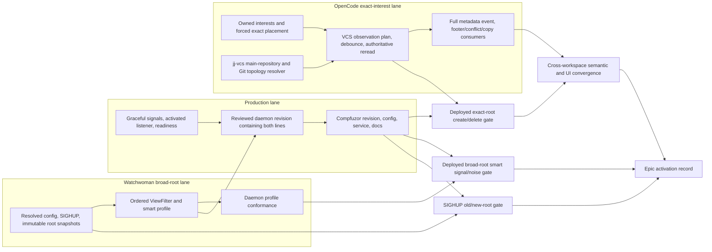
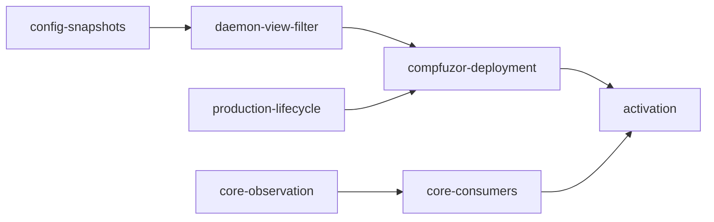

# OpenCode VCS signals epic alignment

## Current situation and direction

The open `opwatch-vcs-signals` epic still describes the first formulation of
the work: add exception globs to a hardcoded VCS blocklist, make SIGHUP
eventually update held roots, add a few subscriptions in `vcs.ts`, and place the
allowlist in Compfuzor. The design has moved since those tickets were written.

The current direction is broader in the daemon and narrower in the OpenCode
delivery path:

- Watchwoman is designing one ordered, traversal-aware `ViewFilter`, with
  `smart`, `strict`, and `off` VCS profiles, machine and root rules, staged
  path/type/metadata facts, and one immutable filter snapshot per registered
  root.
- OpenCode's metadata directories are intended to use forced **exact**
  placement. Exact `refs/heads` and `op_heads/heads` roots do not traverse an
  enclosing `.git` or `.jj` component, so their delivery does not require the
  daemon's broad-project `smart` carve-outs.
- Jujutsu topology resolution remains client-owned. A secondary workspace's
  `.jj/repo` is a pointer; OpenCode must resolve the main repository and watch
  its operation heads. The daemon must not infer that topology.
- The production daemon is still sourced by Compfuzor from the historical
  `systemd@rektide` line. The fresh Watchwoman carrier intentionally lacks the
  Linux socket-activation, readiness, graceful-signal, and unit-generation
  implementation needed to replace it.
- A successful parse, SIGHUP, or version check is not activation evidence. The
  final gate must observe positive signals, negative churn, root-snapshot
  behavior, and the user-facing metadata refresh through the binaries and
  configuration actually selected.

This pass was requested to turn those facts into one tracer path across the
epic, all four original children, the daemon work, Core, and Compfuzor. The body
records the recommendation as written; the accepted graph and subsequent rule
direction are recorded in the addendum.

### Deployment snapshot inspected

At this pass, `/usr/local/bin/watchwoman` resolved to the archive checkout's
release binary and reported `watchwoman 0.7.0`. The generated machine config
currently contains `root_policy`, warning/cap values, and legacy `ignore_dirs`,
but no `filter` object; deployment must migrate those names to ordered rules
([deployed `watchwoman.json`](file:///opt/watchwoman-git/etc/watchwoman.json)).
The generated service has no VCS startup pin and receives
`WATCHWOMAN_CONFIG_FILE` through its environment file
([deployed `watchwoman.service`](file:///opt/watchwoman-git/etc/watchwoman.service#L22-L32)).
The service was inactive while `watchman.socket` remained active, which is a
normal socket-activated idle state, not evidence that a new filter is deployed.
These observations orient the work; the final activation manifest must capture
them again rather than citing this inspection as a gate.

## Recommendation in one page

Retain the epic as the integration umbrella, but rename and amend it around
**reactive VCS observation**, not a daemon allowlist. Represent two independent
lanes and join them at one explicit activation ticket:

1. The **OpenCode exact-interest lane** owns topology, exact placement,
   debounced invalidation, authoritative reread, semantic publication, and
   product consumers. It can proceed without the Watchwoman smart-filter
   feature.
2. The **Watchwoman broad-root lane** owns the ordered engine, smart profile,
   traversal/event parity, coherent configuration generations, and immutable
   root snapshots. It is useful to broad queries, subscriptions, and triggers,
   but it is not Core's routing mechanism.
3. The **production lane** combines the fresh filter implementation with the
   independently reconstructed Linux lifecycle, then changes Compfuzor's pinned
   revision and managed config. Updating JSON alone cannot deploy the fresh
   code.
4. The **activation gate** depends on all three lanes. It separately proves
   exact-root delivery and broad-root smart filtering before proving the
   cross-workspace OpenCode outcome.

The highest-value graph correction is to remove
`opwatch-vcs-signals-core-subscriptions ->
opwatch-vcs-signals-daemon-allowlist`. Forced exact placement makes that edge
false. Keep a final live-gate edge instead.

## Canonical vocabulary and authority

| Term | Canonical meaning | Owner |
| --- | --- | --- |
| VCS metadata target | A path whose change makes cached VCS state stale. It is an invalidation source, never the metadata itself. | Selected VCS provider or Core VCS observation resolver |
| Exact metadata root | A directory target registered as its own daemon root, such as `refs/heads` or `op_heads/heads`. | OpenCode Watcher intent/placement layer |
| Broad project root | The ordinary source-tree root through which `.git/...` or `.jj/...` is a root-relative descendant. | Watchwoman root registration plus `ViewFilter` |
| Smart profile | Built-in ordered rules that expose selected summaries through broad-root VCS denies. It is not a user-authored glob allowlist. | Watchwoman code, selected by resolved daemon configuration |
| Effective filter program | Machine rules, root rules, cookie contribution, selected VCS profile, then implicit allow. | Watchwoman resolved configuration and `ViewFilter` |
| Root snapshot | The immutable compiled rule program captured when one root registration is published. | Watchwoman root lifecycle |
| Reload | Atomic replacement of the resolved configuration used for future registrations, plus immediate retirement of roots newly denied by root policy. | Watchwoman SIGHUP/configuration lifecycle |
| Refresh or re-registration | `watch-del` followed by `watch`, GC retirement followed by a later watch, or daemon restart followed by a watch. Repeating `watch` against an existing root is not refresh. | Client/operator plus Watchwoman root lifecycle |
| VCS invalidation | A semantic instruction to reread current provider metadata. It is broader than `BranchUpdated`. | Core VCS service and public event contract |
| Deployment activation | Behavioral evidence from the selected binary, startup arguments, machine config, root snapshot, backend, and consumer. | Composite gate, recorded with artifacts |

This vocabulary prevents four authorities from collapsing into one:

- Providers know which metadata inputs matter.
- Core knows how to place and reconcile those interests and how to publish
  fresh domain state.
- Watchwoman knows how a registered root is filtered and traversed.
- Compfuzor knows which binary, startup contract, and machine policy run in
  production.

## Conflicts to resolve in the tickets

| Existing claim | Conflict | Replacement |
| --- | --- | --- |
| The daemon child should add path-relative exception globs. | The accepted daemon direction is a generic ordered, staged engine with explicit matcher semantics and traversal feasibility, not a second VCS-only schema ([daemon design](file:///home/rektide/src/watchwoman-systemd/.design/opencode/vcs-config2-draft0.gpt56solmax.md)). | Rename the child around the ordered view filter and describe `smart` as one built-in contribution. |
| Unset config must be byte-identical to "today." | There are three different baselines: the fresh carrier is shallow and does not special-case `.jj`; the deployed old line is strict; the target default is smart ([reality audit](file:///home/rektide/src/watchwoman-systemd/.design/opencode/vcs-config2-reality0.gpt56solmax.md#L66-L88)). | Name every baseline. Omitted `filter` selects smart in the new contract; preserving deployed strict behavior requires an explicit `strict` pin. |
| SIGHUP makes held roots converge lazily. | The new filter is immutable for a root's lifetime. Repeated `watch` and `debug-recrawl` retain it; only root recreation adopts a new filter ([snapshot contract](file:///home/rektide/src/watchwoman-systemd/.design/opencode/vcs-config2-draft0.gpt56solmax.md)). | Rename the child to resolved-config reload and immutable root snapshots. Do not promise mutation or convergence of a held root. |
| Stale reaping, restart, and "re-watch" are equivalent convergence events. | GC and restart remove the old root; a later registration is new. A repeated watch returns the old root. | Spell out `watch-del` plus `watch`, GC retirement plus later `watch`, and restart plus later `watch`. |
| Core depends on daemon broad-root allowlisting. | File targets stay on Node, and forced-exact directory targets register their own roots. The VCS component filter is outside both paths. | Remove the dependency. Retain a deployed exact-root gate because root policy, caps, target existence, and watcher health still apply. |
| Exact placement bypasses all daemon policy. | It bypasses only ancestor-sensitive VCS component rules. Root admission, ordered machine/root rules, scan caps, target existence, and native watcher health still govern the exact root. | State and test the narrower claim and record effective user rules in the gate artifact. |
| C5 can reuse `BranchUpdated` for every metadata event. | Current Core only publishes when `branch.current` changes ([`vcs.ts:119-142`](/packages/core/src/vcs.ts#L119-L142)); the client reducer patches only the branch ([`data.ts:1211-1220`](/packages/client/src/solid/data.ts#L1211-L1220)). This cannot refresh jj labels, conflicts, workspace membership, or unchanged-branch metadata. | Add a full-metadata result or invalidate-and-refetch event. Keep `BranchUpdated` only as branch-specific compatibility. |
| `<vcs.store>/HEAD` is the Git target. | Current project state retains Git's common directory, while linked worktrees have a separate worktree-local administrative directory. | Observe worktree-specific `gitDirectory/HEAD`; observe refs and packed refs in `commonDirectory`. Re-resolve topology when pointer sentinels change. |
| The jj path can be evaluated under each workspace root. | A secondary workspace's `.jj/repo` is a pointer to the main repository ([probe-backed target note](/.design/watchman/watches.glm53.md#L64-L82)); this workspace demonstrates that shape in [`.jj/repo`](file:///home/rektide/src/watchwoman-systemd/.jj/repo). | Resolve the pointer in Core and register the resolved main-repository target. Broad-root smart tests separately register the main containing root. |
| Allow `.jj/repo/op_heads/**`. | That is broader than the selected summary and includes an unneeded ancestor domain. | Canonicalize the built-in to `RootSubtree .jj/repo/op_heads/heads`; ancestors are traverse-only and all sibling `op_heads` content remains denied. |
| "All other VCS paths stay invisible" is an engine-wide guarantee. | `strict`, `off`, earlier machine/root rules, separately registered nested roots, and metadata-interior roots deliberately produce different results. | Qualify the claim as neutral `smart` behavior through a broad project root. Test exact roots separately. |
| Managed config contains the allowlist and code does not. | The selected profile's semantics are versioned built-in code; config chooses a mode and can add higher-priority rules. Core's exact target plan is also code-owned. | Say that managed config owns production selection and overrides, while code owns profile and provider semantics. |

## Two delivery lanes

### OpenCode exact-interest lane

The current substrate does not yet provide the intended VCS behavior:

- [`WatchInterests.make`](/packages/core/src/filesystem/watcher/interests.ts)
  automatically project-places any directory contained by the current project
  ([lines 31-47](/packages/core/src/filesystem/watcher/interests.ts#L31-L47)). A
  normal checkout's `.git/refs/heads` would therefore still ride the broad
  project root unless the VCS owner can explicitly request exact placement.
- The Watchman backend sends file interests to Node and translates exact
  directory placement into `{ type: "exact", target }`
  ([`backend.ts:17-23`](/packages/core/src/filesystem/watcher/watchman/backend.ts#L17-L23)).
- Exact routing issues `watch <target>` and uses an empty `relative_root`
  ([`route.ts:19-39`](/packages/core/src/filesystem/watcher/watchman/route.ts#L19-L39)).
- Current VCS observation listens to policy-controlled
  `FileSystem.Event.Changed` and only recognizes Git `HEAD` or Hg `branch`
  ([`vcs.ts:129-142`](/packages/core/src/vcs.ts#L129-L142)).

The Core ticket therefore needs more than additional path predicates. The
target end state is a VCS-owned or provider-owned observation plan that Core
translates into backend-neutral intents:

| VCS input | Resolved target | Physical path |
| --- | --- | --- |
| Git active branch | Worktree-local `gitDirectory/HEAD` | Exact file on Node |
| Git local refs | `commonDirectory/refs/heads` | Forced-exact directory |
| Git packed refs | `commonDirectory/packed-refs` | Exact file on Node |
| Mercurial branch | `.hg/branch` | Exact file on Node |
| Jujutsu repository state | Resolved main repository `op_heads/heads` | Forced-exact directory |
| Colocated jj | Jujutsu target plus applicable worktree/common Git targets | Mixed Node files and forced-exact directories |

Every metadata event is a debounceable reason to resolve/read current state.
The event payload is not branch, workspace, conflict, or commit data. Topology
sentinels, including worktree `.git`, workspace `.jj/repo`, applicable
`store/git_target`, and stable parents for missing directory targets, cause the
plan to be resolved and reconciled before metadata is read. Acquire the new plan
before releasing the old one.

The jj-vcs line already demonstrates filesystem-only resolution: it reads a
directory or pointer at `.jj/repo`, resolves the real main repository, and
stores that resolved repository path in `vcs.store`
([`project.ts:290-345`](file:///home/rektide/src/opencode-jj-vcs/packages/core/src/project.ts#L290-L345)).
That line is an explicit composition prerequisite; current
`opencode-watchman` does not itself contain jj discovery.

### Watchwoman broad-root lane

The ordered `ViewFilter` solves a different problem. It lets a broad root's
queries, subscriptions, and triggers see selected metadata while still pruning
hot stores. Under a neutral smart profile it contributes:

```text
allow RootExact   .git/HEAD
allow RootSubtree .git/refs/heads
allow RootExact   .git/packed-refs
allow RootExact   .hg/branch
allow RootSubtree .jj/repo/op_heads/heads
deny  Component   .git
deny  Component   .hg
deny  Component   .svn
deny  Component   .jj
```

The engine must preserve its complete order: machine rules, root rules, cookie
profile, VCS profile, then implicit allow
([daemon rule priority](file:///home/rektide/src/watchwoman-systemd/.design/opencode/vcs-config2-draft0.gpt56solmax.md)).
Pass-through ancestors such as `.git`, `.git/refs`, and `.jj/repo/op_heads` are
enumerated only when needed and never enter the tracked tree. Crawl, event
ingest, move-in reconciliation, subtree tombstoning, recrawl, and query
authority must agree through the root's one filter.

This lane cannot resolve out-of-root metadata. Through a secondary jj workspace
root, the smart rules match no operation heads. Its broad-root gate must
separately register the main workspace/repository-containing root; the Core
exact lane instead registers the resolved `op_heads/heads` target itself.

### Why they join late

With forced exact placement, `.git` and `.jj` are ancestors outside the daemon
root. Source inspection predicts that the current component-based pruning is
irrelevant to those exact targets. Later review correctly narrowed this to an
unproven expectation: no retained probe yet demonstrates both create and delete
delivery under the deployed root policy
([exact-root evidence review](/.design/watchman/carrier1-review0.gpt56sol.md#L438-L457)).

Therefore:

- Core implementation is not blocked by the broad smart filter.
- Core live activation is still blocked by an exact-root behavioral probe.
- The daemon smart filter has its own broad-root behavioral probe.
- The epic closes only after one composite record proves both routes and the
  user-facing reread.

This replaces carrier0 C5's too-strong external dependency on a broad daemon
allowlist ([C5 external gate](/.design/watchman/carrier0.gpt56s.md#L509-L514))
without weakening its correct demand for real daemon evidence.

## Dependency and tracer path



The pure classifier and Core owner can be developed in parallel. Public daemon
filter behavior should still land as one coherent slice: config controls,
strict/off alternatives, immutable snapshot, crawl/events/recrawl, and query
authority must not be exposed in mutually inconsistent revisions.

## Ticket resteering

At review time the graph had only two blocking edges: `daemon-allowlist` blocked
Core and Compfuzor, while `sighup-lazy-reload` was not connected to either. That graph
both overstates the daemon dependency for exact interests and understates the
configuration/lifecycle dependency for a production smart-filter rollout.

| Current issue | Disposition | Proposed responsibility |
| --- | --- | --- |
| `opwatch-vcs-signals` | Retain ID; rename and amend | Integration epic for reactive VCS observation through exact and broad-root routes, production selection, and one recorded activation gate. Suggested title: `Reactive VCS observation across Core and Watchwoman`. |
| `opwatch-vcs-signals-daemon-allowlist` | Rename to `opwatch-vcs-signals-daemon-view-filter` and amend; do not implement the old schema | Ordered staged `ViewFilter`, unified machine/root rules, path/type/metadata predicates, smart/strict/off profiles, traversal and event reconciliation, ingest authority, and profile conformance. Suggested title: `Daemon: ship ordered smart VCS view filtering`. |
| `opwatch-vcs-signals-sighup-lazy-reload` | Rename to `opwatch-vcs-signals-config-snapshots` rather than duplicate; supersede only if preserving the old ID is required | Resolved config, last-good SIGHUP, publication fencing, immutable root snapshots, and explicit refresh semantics. Suggested title: `Daemon: reload config for immutable root generations`. |
| `opwatch-vcs-signals-core-subscriptions` | Rename to `opwatch-vcs-signals-core-observation`, remove daemon block edge, amend, and split product consumption | Provider/VCS-owned topology plus exact metadata interests, semantic invalidation, and authoritative reread. Add `opwatch-vcs-signals-core-consumers` for footer/conflict/open-copy-list behavior so transport and product acceptance are independently visible. |
| `opwatch-vcs-signals-compfuzor-policy` | Rename to `opwatch-vcs-signals-compfuzor-deployment`, amend, and split activation | Deploy a revision containing filter plus Linux lifecycle, migrate legacy ignores to ordered rules, select production mode, preserve root safety, regenerate service/config, and restart correctly. Move behavioral proof into a new dependent activation child. |
| No current issue | Add `opwatch-vcs-signals-production-lifecycle` or link an existing external issue | Reconstruct graceful SIGTERM/SIGINT, SIGHUP distinction, systemd listener adoption, `sd_notify`, and supervised unit behavior on the fresh Watchwoman line. Do not hide this inside Compfuzor or `ViewFilter`. |
| No current issue | Add `opwatch-vcs-signals-activation` | Own the isolated and deployed behavioral artifact and become the only final blocker for epic closure. |

### Recommended dependency edits

Use dependency edges to represent release truth, not convenient coding order:

```text
daemon-view-filter depends on config-snapshots for its public runtime slice
compfuzor-deployment depends on daemon-view-filter
compfuzor-deployment depends on watchwoman-production-lifecycle
core-observation depends on the OpenCode owner/exact-placement substrate
core-observation depends on the composed jj-vcs resolver for jj acceptance
core-product-consumers depends on core-observation
activation depends on compfuzor-deployment
activation depends on core-product-consumers
epic closes only when activation closes
```

Delete this edge:

```text
core-subscriptions depends on daemon-allowlist
```

The exact-root probe replaces that implementation dependency with a gate
dependency at the join.

## Ticket-by-ticket acceptance changes

### Epic: `opwatch-vcs-signals`

Replace the current absolute allowlist acceptance with these outcomes:

- Under a neutral smart program and a broad project root, `.git/HEAD`,
  `.git/refs/heads/**`, `.git/packed-refs`, `.hg/branch`, and
  `.jj/repo/op_heads/heads/**` are tracked; traverse-only ancestors and all
  specified churn domains remain absent and event-silent.
- Under forced exact placement, `refs/heads` and `op_heads/heads` deliver create
  and delete events even under a neutral `strict` daemon profile. File targets
  remain Node-owned.
- An operation in jj workspace B causes a session in workspace A of the same
  repository to reread and publish current VCS metadata through their shared
  resolved main-repository target.
- Footer label, conflict state, and an already-open copy/worktree list converge
  without reopening. If conflict rendering is not part of the intended product
  slice, remove it from the epic description rather than calling unrendered
  state delivered.
- Production selection lives in Compfuzor; built-in profile semantics and
  provider target semantics remain code-owned and tested.
- A retained activation artifact names binary/revision, daemon version,
  startup arguments, effective config, roots, operations, observed events,
  negative windows, OS/backend, and result.

### Daemon: `opwatch-vcs-signals-daemon-allowlist`

Replace exception-glob acceptance with the daemon design's real boundary:

- One `ViewFilter::classify` operation returns `track`, `descend`, and
  provenance for non-lossy structural paths after requesting only the kind or
  metadata facts needed by surviving path candidates.
- Strict machine/root schema validation, source precedence, fixed effective
  rule priority, basename/suffix/extension/regex matchers, smart/strict/off
  profiles, and cookie composition are covered by pure tests. Legacy
  `ignore_dirs` is rejected rather than interpreted separately.
- Initial crawl, live create/remove/rename/type transitions, populated
  directory move-in, subtree tombstoning, and `debug-recrawl` use the same
  snapshotted filter. Query code adds no second VCS or cookie authority.
- Smart tracks only the canonical matrix through a broad root; `.git/objects`,
  `.git/index`, `.git/logs`, `.jj/repo/store`, `.jj/repo/index`,
  `.jj/repo/op_store`, and `.jj/working_copy` are not enumerated or emitted.
- Strict and off controls exist before smart becomes the default. Omitted new
  filter config means smart by specification, not byte identity with either
  historical baseline.
- Root-only scope, nested repositories, metadata-interior roots, and the
  inability to resolve secondary jj topology are explicit tests/documentation,
  not hidden exceptions.

The current carrier's `walk` and `should_ignore` are distinct shallow
implementations and omit `.jj` from `IGNORE_VCS`
([`watcher.rs:160-239`](file:///home/rektide/src/watchwoman-systemd/crates/watchwoman/src/daemon/watcher.rs#L160-L239)).
Acceptance must be written against the target contract, not this carrier as
"today's strict behavior."

### Config lifecycle: `opwatch-vcs-signals-sighup-lazy-reload`

The current title encodes behavior the design rejects. Preferred replacement
acceptance:

- Startup resolves one complete configuration or fails closed. A bad SIGHUP
  retains the complete last-good generation.
- A successful SIGHUP atomically installs a new resolved generation and
  reapplies the process's immutable startup overrides.
- New root registrations use the new generation. An existing admitted root,
  repeated `watch`, and `debug-recrawl` retain the root's original filter and
  compiled user-rule program.
- `watch-del` plus `watch`, stale-GC retirement plus a later `watch`, and daemon
  restart plus a later `watch` create a new root and adopt the then-current
  generation.
- Root-policy tightening remains exceptional: newly denied roots and matching
  in-flight registrations become undiscoverable immediately, cancellation is
  identity-safe, and a replacement cannot be removed by stale cleanup.
- No path-level reload proactively prunes, mutates, retires, or emits churn for
  an admitted held root.

Drop "the journal names roots still running a stale snapshot" from mandatory
acceptance unless the operations owner explicitly chooses generation
observability. The
design says public generation reporting is useful but not required
([daemon snapshot design](file:///home/rektide/src/watchwoman-systemd/.design/opencode/vcs-config2-draft0.gpt56solmax.md)).
If retained, split it as observation rather than making correctness depend on a
log scan.

### Core: `opwatch-vcs-signals-core-subscriptions`

Rename this around VCS observation, because subscriptions are only one
mechanism. Acceptance should require:

- Provider-owned or VCS-owned target resolution covers worktree-local Git
  `HEAD`, common refs/packed refs, Hg branch, resolved jj operation heads, and
  colocated Git targets.
- Metadata files use Node. Both metadata directories are forced exact even when
  lexically contained by the project. No target is added as an exception to a
  broad project watch, `Ignore.PATTERNS`, or `LocationWatcherPolicy`.
- Topology sentinels cover linked-worktree `.git`, secondary-workspace
  `.jj/repo`, backing-store pointers, missing target parents, deletion,
  recreation, and retargeting. A new complete plan is acquired before the old
  plan is released.
- Create, update, delete, initial-ready, and continuity invalidations debounce
  into authoritative provider rereads. Safe jj metadata reads do not generate
  operation-head feedback.
- Every successful reread publishes a full metadata result or refetch
  invalidation independently of branch equality. Whole-refresh failure retains
  last-good metadata and the prior usable plan while exposing degraded health.
- `BranchUpdated`, if retained, is emitted only for a real branch change and
  cannot truncate richer VCS state in the client reducer.
- Deterministic tests assert the physical subscription plan and placement.
  Isolated live tests assert exact-root create/delete delivery and one physical
  shared op-heads target across two location contexts.

Split the user-facing consequences into a dependent child. The open `/move`
dialog currently fetches worktrees at creation and only on an explicit refresh
action ([`dialog-move-session.tsx:78-94`](/packages/tui/src/component/dialog-move-session.tsx#L78-L94),
[`368-372`](/packages/tui/src/component/dialog-move-session.tsx#L368-L372)).
No path from a branch-only event refreshes that resource. The consumer child
should accept:

- a terminal jj commit/bookmark move updates footer label and conflict state;
- `jj workspace add/forget` updates an already-open move dialog;
- a peer workspace operation updates every live location sharing the resolved
  repository target; and
- event ordering cannot replace full VCS info with a branch-only object.

### Compfuzor: `opwatch-vcs-signals-compfuzor-policy`

The current child is not merely a JSON edit. Compfuzor pins
`GIT_VERSION: systemd@rektide`
([`watchwoman.src.pb:40-47`](file:///home/rektide/src/compfuzor/watchwoman.src.pb#L40-L47)),
while the revised daemon implementation starts from a fresh carrier that lacks
the old Linux lifecycle ([reality audit lines 68-84](file:///home/rektide/src/watchwoman-systemd/.design/opencode/vcs-config2-reality0.gpt56solmax.md#L68-L84)).
Acceptance should require:

- `GIT_VERSION` selects a reviewed revision containing both the ordered filter
  slice and the independently reconstructed production lifecycle.
- Managed `watchwoman.json` explicitly selects the intended production VCS
  mode. Recommended final state is `filter.mode.vcs: smart` with no redundant
  custom allow rules.
- Legacy `IGNORE_DIRS`, machine `ignore_dirs`, and root `ignore_dirs` are
  migrated to explicit ordered `Component` or `RootSubtree` denies according to
  intended scope. No compatibility floor remains in code or generated config.
- Root denies, 100k warning, 2M scan cap, config environment delivery, socket
  ownership, `Type=notify`, and bounded service-only restart semantics remain
  unchanged ([policy source](file:///home/rektide/src/compfuzor/watchwoman.src.pb#L192-L240),
  [service source](file:///home/rektide/src/compfuzor/watchwoman.src.pb#L144-L190)).
- The playbook is syntax-checked and applied with the local connector; generated
  JSON passes `jq`, the generated unit and environment match source, and only
  `watchwoman.service` is restarted while `watchman.socket` stays active.
- The production root is recreated after deployment. SIGHUP alone is
  insufficient for a binary change and intentionally does not mutate held
  filters.

Prefer config-owned `smart` selection over an `ExecStart --vcs-filter=smart`
pin so a later SIGHUP can change the mode for new roots. If operations instead
wants an immutable startup pin, record that as a deliberate precedence choice;
do not set the same value in both places and imply they have equal authority.

Split the activation proof out of this ticket. `jq` plus successful reload only
proves syntax and process handling, not event delivery.

### New activation ticket

This ticket should own one reproducible orchestrator and one result manifest.
Its gate has four layers.

**Daemon broad-root conformance**

- With neutral machine and root rules, smart exposes exactly the
  canonical matrix through a broad root; pass-through ancestors are absent.
- Git branch switch, loose branch create/move/delete, packed-ref rewrite, Hg
  branch change when Hg is available, and jj operation-head create/remove are
  observed.
- Object, index, log, jj store/index/op-store/working-copy churn is silent.
- A neutral strict control subscribes successfully but remains silent for the
  selected broad-root paths. A bounded off control visibly expands the view.

**Exact-root transport conformance**

- Under strict, direct subscriptions rooted at `refs/heads` and
  `op_heads/heads` receive both creates and deletes. This proves the placement
  correction rather than accidentally passing through smart broad-root rules.
- The effective root policy admits those exact descendants, the target exists
  or its sentinel converges, no earlier machine/root rule suppresses the
  exercised names, and no file-count or native-watcher failure is hidden.
- File interests are observed through Node and are not counted as daemon proof.

**Configuration lifecycle conformance**

- A successful SIGHUP changes a newly registered root but leaves an existing
  admitted root on its old filter.
- Repeating `watch` preserves the old root. `watch-del` plus `watch` adopts the
  new generation. Invalid reload changes neither generation.
- Root-policy tightening still detaches and cancels a now-denied root.

**Product tracer**

- Create a main and secondary jj workspace that resolve to one main repository
  target. Run state-changing commands from each side and show one location's
  event causes the other location's authoritative metadata reread.
- Prove footer label, conflict state, and already-open move-list behavior rather
  than stopping at a raw Watchman PDU.
- Run the client metadata/status/diff read discipline and show it does not
  produce an invalidation loop.
- Exercise colocated jj with both a jj operation and raw Git ref activity.

The artifact must retain the daemon binary path, source revision, `--version`,
OS/native backend, startup argv, config bytes/hash, root-local config, watched
roots, subscription expressions, command transcript, positive events, bounded
negative observation windows, logs, and final assertions. A capability string
or mode label is advisory only.

The isolated orchestrator should own its socket and scratch roots so it can run
strict/off controls without changing the user's daemon. After Compfuzor applies
the same reviewed revision and config, run a narrow production smoke and record
that provenance too. The existing tools design already names this fixture and
artifact responsibility
([`tools0.gpt56s.md:1927-1946`](/.design/watchman/tools0.gpt56s.md#L1927-L1946)).

## Recommended execution order

1. Amend the issue graph and vocabulary before implementation. Record the two
   lanes and remove the false Core-to-smart-filter block.
2. Run and retain the missing exact-root create/delete probe against the current
   deployed daemon. A failure changes the Core transport plan; a pass unblocks
   it without claiming broad smart behavior.
3. Build the Core exact-interest owner and the pure Watchwoman classifier in
   parallel. Compose jj acceptance only after the filesystem resolver is
   present in the same OpenCode line.
4. Complete Watchwoman config snapshots, safety substrate, classifier adapters,
   profiles, and query authority as one externally coherent daemon slice.
5. Reconstruct and verify the Linux lifecycle on that fresh daemon line. Do not
   replay the historical implementation or hide this work in Compfuzor.
6. Land the Core semantic event and product consumers; run deterministic and
   isolated live tests.
7. Update Compfuzor's revision, config, generated environment/unit, and docs.
   Restart only the service while the socket remains active, forcing fresh root
   registration.
8. Run the composite activation ticket, retain its artifacts, and close the epic
   only from observed outcomes.

## Unresolved decisions

| Decision | Recommendation | Why it remains explicit |
| --- | --- | --- |
| Keep broad smart filtering in this epic or move it to a Watchwoman epic | Keep it as a parallel lane in this integration epic, but make the exact Core path independently shippable. | The user asked to align the current daemon work with the outcome; removing the false dependency is enough without discarding a useful daemon capability. |
| Production VCS selector | Put explicit `smart` in managed config and omit the CLI pin. | This preserves one mutable policy authority and gives SIGHUP useful future-root semantics. Operations may deliberately choose an immutable pin instead. |
| Full VCS semantic event shape | Prefer invalidate-and-refetch unless carrying complete `Vcs.Info` materially reduces races. | Either can satisfy freshness; `BranchUpdated` cannot. Public Schema/SDK consequences differ. |
| VCS plan API | Prefer an atomic observation resolver returning resolved scope plus targets. | Deriving a new plan from stale immutable `Location` cannot handle pointer retargeting safely. |
| Mutable inputs covered by Git observation | Enumerate every cached `info()` input or explicitly label uncovered inputs non-live. | HEAD/refs/packed refs alone may not cover remote symbolic HEAD and config-derived defaults. |
| `/move` freshness ownership | Put the reactive refetch in a product-consumer child, not the raw watch owner. | The current dialog has its own resource lifecycle and manual refresh; receiving op-heads is insufficient. |
| Conflict indicator scope | Either add the renderer to the product child or remove it from epic claims. | Current jj metadata can carry `conflicted`, but "computed" is not "user-visible." |
| Hg live gate | Run when available and record a visible skip otherwise; keep deterministic filesystem coverage mandatory. | The canonical matrix includes Hg even though the original four-path wording often omitted it. |
| Production lifecycle ticket home | Prefer the Watchwoman tracker when one exists, with a blocking link from this epic; otherwise add an explicit child here. | The fresh carrier has no beads database and the dependency must not disappear into prose. |
| Existing-root generation logs | Keep optional until an operator use is accepted. | Correctness is established by identity/snapshot tests and behavioral probes, not journal parsing. |

## Resteered epic acceptance

The epic can use this concise closure statement:

> OpenCode owns a topology-correct exact VCS observation plan and turns every
> covered metadata signal into an authoritative semantic refresh. Watchwoman's
> ordered broad-root smart profile exposes the same canonical summaries while
> pruning specified churn, with immutable per-root configuration generations.
> Compfuzor deploys a reviewed daemon revision and explicit effective policy.
> A retained behavioral artifact proves exact-root create/delete delivery,
> broad-root smart signal/noise behavior, SIGHUP old/new-root semantics, and a
> cross-workspace jj operation updating the intended live OpenCode consumers.

This statement is stronger than "the allowlist is in JSON" and narrower than
an impossible promise that every VCS path is always hidden under every profile
and root shape.

## Cross-references

- [`watches.glm53.md`](/.design/watchman/watches.glm53.md) is the original
  probe-backed signal/noise matrix and establishes that op-head events are
  invalidations, including create/remove compaction pairs and cross-workspace
  behavior. This alignment narrows its `.jj/repo/op_heads/**` shorthand to the
  selected `heads` subtree.
- [`carrier0.gpt56s.md` C5](/.design/watchman/carrier0.gpt56s.md#L461-L517)
  supplies VCS ownership, exact placement, ignore immunity, and the external
  gate. This alignment separates its valid behavioral gate from its obsolete
  broad-filter implementation dependency.
- [`carrier1.gpt56s.md:872-981`](/.design/watchman/carrier1.gpt56s.md#L872-L981)
  is prior art for provider-owned plans, worktree/common Git topology, a full
  semantic event, and the exact-root correction. Its B3 carrier direction is
  not imported here; the current B2 authority remains separate.
- [`carrier1-review0.gpt56sol.md`](/.design/watchman/carrier1-review0.gpt56sol.md)
  identifies the missing topology sentinels, branch-only publication defect,
  incomplete mutable-input coverage, last-good requirement, and absent
  reproducible exact-root probe that the revised Core and activation acceptance
  absorb.
- [`nav0-syn0.gpt56sol.md:389-392`](/.design/watchman/nav0-syn0.gpt56sol.md#L389-L392)
  keeps reactive VCS support in the accepted composite while distinguishing it
  from an optional time-bounded VCS audit.
- [`files-too0.glm53.md:182-194`](/.design/watchman/files-too0.glm53.md#L182-L194)
  records why files remain Node-owned and why directory placement, readiness,
  failure, and missing-target semantics must be tested independently.
- [`assurances0.gpt56sol.md:634-658`](/.design/watchman/assurances0.gpt56sol.md#L634-L658)
  distinguishes authoritative owner rereads from watcher-health evidence. The
  VCS invalidation path uses the former and does not claim a time-bounded audit.
- [Watchwoman `vcs-config2-draft0.gpt56solmax.md`](file:///home/rektide/src/watchwoman-systemd/.design/opencode/vcs-config2-draft0.gpt56solmax.md)
  is the daemon contract for the generic rule engine, root-only smart scope,
  immutable snapshots, startup controls, production-lifecycle split, and
  behavioral activation.
- [Watchwoman `vcs-config2-reality0.gpt56solmax.md`](file:///home/rektide/src/watchwoman-systemd/.design/opencode/vcs-config2-reality0.gpt56solmax.md)
  prevents the tickets from treating the fresh carrier, historical deployed
  line, and target smart behavior as one baseline.
- [Watchwoman `vcs.glm53f.md`](file:///home/rektide/src/watchwoman-systemd/.design/opencode/vcs.glm53f.md#L62-L165)
  details the selected signals, excluded churn, event shapes, and silent-success
  failure mode; its bespoke configuration proposal is superseded by the ordered
  engine.
- [Watchwoman `vcs-review.glm53h.md`](file:///home/rektide/src/watchwoman-systemd/.design/opencode/vcs-review.glm53h.md#L150-L202)
  supplies measured smart-profile cost and the concrete secondary-workspace
  result: no in-root filter can observe an out-of-root main repository.
- [`gentle-restart.unknown.md`](file:///home/rektide/src/watchwoman-systemd/design/gentle-restart/gentle-restart.unknown.md#L86-L162)
  explains why policy reload and binary/service restart are different
  operations and why a service-only restart must leave the socket active.
- [`compfuzor/watchwoman.src.pb`](file:///home/rektide/src/compfuzor/watchwoman.src.pb)
  is the actual production authority for daemon revision, config environment,
  socket/service units, current legacy ignore inputs, generated JSON, and
  operator runbook. Deployment must migrate those inputs to ordered rules;
  updating Watchwoman's built-in unit renderer alone does not change it.

# Addendum: Accepted ticket graph

On 2026-09-04 the user accepted the resteer. The earlier issue IDs remain in the
body above as a record of the proposal that was reviewed; the live Beads graph
now uses these retained IDs and responsibilities:

| Issue | Accepted responsibility |
| --- | --- |
| `opwatch-vcs-signals` | Integration epic for exact observation, broad filtering, production deployment, and retained activation evidence |
| `opwatch-vcs-signals-config-snapshots` | Strict resolved configuration, last-good reload, publication fencing, and immutable root generations |
| `opwatch-vcs-signals-daemon-view-filter` | Generic ordered and fact-aware filtering, with smart VCS behavior as one built-in profile |
| `opwatch-vcs-signals-core-observation` | Provider topology, forced exact interests, invalidation, and authoritative metadata rereads |
| `opwatch-vcs-signals-core-consumers` | Footer, conflict, and already-open move-list convergence |
| `opwatch-vcs-signals-production-lifecycle` | Graceful signals, socket activation, readiness, and generated Linux units |
| `opwatch-vcs-signals-compfuzor-deployment` | Reviewed revision, unified-rule config migration, generated service, and root recreation |
| `opwatch-vcs-signals-activation` | Isolated and deployed end-to-end evidence; terminal child for epic closure |

The accepted blocking graph is:



There is deliberately no `core-observation -> daemon-view-filter` edge. Beads
reported no dependency cycles after the rewrite.

The user also chose path, file type, and metadata as the v1 classifier inputs.
Legacy `ignore_dirs` becomes ordinary ordered rules rather than a separate
floor. Each rule has a cheap path predicate plus optional kind and non-following
metadata constraints. Compatible structural and bounded-regex predicates may
share a compiled candidate pass before later facts are requested; candidate
selection never replaces ordered evaluation. Basename, suffix, and extension
matching are first-class. A non-blocking P4 decision,
`opwatch-vcs-signals-content-rules`, records the uncertain possibility of
bounded file-content predicates; it is not an epic child or a v1 dependency.
