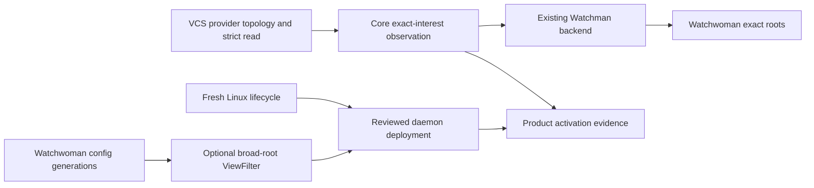

# Watchman rebuild assessment: what happened and suggested direction

## Why this assessment exists

The current question is not which large design is most polished. It is whether
the work still corresponds to a wanted product outcome.

The repository contains a real, implemented root-scoped Watchman feature. Work
then expanded across four adjacent concerns:

1. correcting that feature's failure and recovery semantics;
2. designing a broader OpenCode observation assurance floor;
3. adding reactive Git, Mercurial, and Jujutsu metadata observation; and
4. rebuilding Watchwoman configuration, filtering, and Linux lifecycle on a
   fresh carrier.

A separate project, Watchment, explored a much larger Linux filesystem state
engine during the same period. Similar terminology and concurrent work across
multiple jj workspaces made these lines look more unified than they are.

This document reconstructs the causal chain, states what code exists, and
proposes a conservative direction. It is a draft assessment. It does not erase
the recorded B2/full-composite decision, close a ticket, accept B3 or G5, or
promote any implementation workspace.

## Executive verdict

| Line | Verdict | Reason |
| --- | --- | --- |
| Root-scoped Watchman feature in this repository | **Keep** | It fixed an observed process-global failure domain and has a substantial tested implementation record. |
| Narrow failure/recovery corrections | **Continue after reconfirming scope** | Subscribe-response loss, timing-dependent fallback, silent completion, and split failure ownership are source-backed defects. |
| `opencode-watchman-vcs-core` composition | **Park intact; salvage selectively** | It contains a real composition and one useful owner-lifecycle refactor, but no VCS observer and no completed remake. |
| Reactive VCS observation | **Conditional product lane** | The corrected design is coherent, but it should continue only if live VCS convergence remains a wanted user outcome. |
| Watchwoman config foundation | **Keep dormant; review before continuing** | Real green code exists, but runtime wiring is absent and the parent design has unresolved correctness and compatibility questions. |
| Watchwoman broad `ViewFilter` | **Independent, conditional daemon feature** | Core exact interests do not require it. Continue only for broad-root query/subscription behavior, not as an assumed Core prerequisite. |
| Watchwoman production lifecycle | **Conditional deployment prerequisite** | Needed to replace the deployed historical daemon with the fresh carrier; not needed to reason about the current OpenCode feature. |
| Profile R, clean carrier, B3, and G5 | **Park** | They are broader assurance and reconstruction programs with open decisions; they are not required for narrow recovery or VCS delivery. |
| Watchment engine and `engine1-syn` | **Park as separate research** | Watchment is a future multi-source service, not this feature, its plugin, or the current Watchwoman reconstruction. |

The shortest honest direction is therefore:

> Preserve the working root-scoped feature, repair only evidence-backed defects
> on a deliberate line, and require a fresh product decision before resuming
> reactive VCS, broad daemon filtering, Profile R, or clean-carrier work.

## What happened

### 1. The original feature was real and incident-driven

The first implementation used one process-global Watchman connection. A slow
root could occupy its serialized command path and turn one cold crawl into a
fleet-wide outage. The accepted replacement moved to one `RootConnection` per
route intent and owner-scoped `WatchInterests`. The implementation record lists
the root-scoped backend, recovery fixes, configuration, metrics, and subsequent
hardening commits
([maintenance, lines 41-71](/.design/watchman/maintenance.glm53.md#L41-L71)).

The resulting runtime is concrete:

- exact files stay on `node:fs.watch`;
- opted-in directories use Watchman;
- root intents have separate clients, semaphores, routes, subscriptions, and
  reconnect state; and
- location graphs share one process-global physical watcher registry
  ([maintenance, lines 79-102](/.design/watchman/maintenance.glm53.md#L79-L102)).

This was not a speculative remake. It was the feature branch.

### 2. Review found a legitimate correction kernel

The current feature has defects that do not require a new product vision to
justify work:

| Defect | Evidence | Consequence |
| --- | --- | --- |
| Pre-ack versus post-ack acquisition cliff | [`fallbacks0`, lines 57-71](/.design/watchman/fallbacks0.glm53.md#L57-L71) | The same transient failure can select permanent Parcel before acknowledgement but retry forever afterward. |
| Subscribe response discarded | [`topic-query0`, lines 104-119](/.design/watchman/topic-query0.glm53.md#L104-L119) | Changes during disconnect, daemon restart, or clock-to-subscribe windows can be computed and transmitted by the daemon but never reach owners. |
| Failure policy split across stages | [`review-failure-paths0`, lines 76-106](/.design/watchman/review-failure-paths0.gpt56s.md#L76-L106) | Timing and operation labels decide retry, fallback, poison, or silent completion; tests do not pin the complete matrix. |
| Silent unsupported Parcel completion | [`review-failure-paths0`, lines 110-127](/.design/watchman/review-failure-paths0.gpt56s.md#L110-L127) | Desired observation can end without readiness or owner recovery. |
| Fabricated path updates carry lifecycle meaning | [`direction0`, lines 230-256](/.design/watchman/direction0.gpt56solmax.md#L230-L256) | Owners cannot distinguish an exact file change from readiness or continuity loss. |

The simplification review derived a small policy from those findings: static
backend selection, no Watchman-to-Parcel migration after selection, and one
root acquisition state machine whose retry decisions do not depend on whether
an acknowledgement happened first
([`review-simplification0`, lines 56-87](/.design/watchman/review-simplification0.gpt56s.md#L56-L87),
[`98-153`](/.design/watchman/review-simplification0.gpt56s.md#L98-L153)).

That correction kernel is the strongest reason to continue work. It does not by
itself require a generic observation framework, a public watcher invalidation
union, reactive VCS, a new daemon rule language, or a new filesystem engine.

### 3. A historical human decision expanded the current-line scope

The corpus records a 2026-09-03 user decision to keep invalidation typed at the
Config boundary as B2, defer B3, complete the corrected current line, and only
then rebuild a clean carrier
([`vision0`, lines 883-926](/.design/watchman/vision0.gpt56s.md#L883-L926)).

That decision explains why later documents are larger than a narrow bug-fix
plan. It should be treated as historical authority, not silently forgotten. It
also should not be treated as irrevocable when the user is explicitly
reassessing whether the expansion was wanted.

The later `carrier1` design overreached by treating B3 revisit triggers as if
they were acceptance. Its source-grounded review corrected that reading: B2 was
accepted, B3 was deferred, and trigger conditions require a new decision rather
than performing one automatically
([`carrier1-review0`, lines 495-515](/.design/watchman/carrier1-review0.gpt56sol.md#L495-L515)).

This is the first clear scope-warning sign. The corpus's own review caught it
before the generic B3 interface landed.

### 4. Reactive VCS began as a narrower feature and became entangled

The first VCS formulation was approximately:

- add allowlist exceptions to Watchwoman's hardcoded VCS pruning;
- add SIGHUP behavior;
- subscribe to metadata paths in Core; and
- deploy the allowlist through Compfuzor.

The alignment review found a more important fact: exact metadata roots bypass
ancestor-sensitive `.git` and `.jj` component filtering. Core can force exact
placement for `refs/heads` and `op_heads/heads`, keep metadata files on Node,
and own Jujutsu topology resolution. Therefore Core exact observation does not
depend on Watchwoman's broad-root smart filter
([`alignment0`, lines 56-84](/.design/watchman/opwatch-vcs-signals-alignment0.gpt56solmax.md#L56-L84),
[`106-131`](/.design/watchman/opwatch-vcs-signals-alignment0.gpt56solmax.md#L106-L131)).

The accepted alignment split the work into independent lanes:

This separation was a correction to the entanglement, not evidence that every
lane must now be built.

### 5. Implementation started in two small places

The later work did not implement the full remake.

#### OpenCode Core composition

`opencode-watchman-vcs-core` composed this Watchman line with the independent
jj-vcs line, then added one owner-lifecycle refactor. In the current rewritten
DAG, the relevant revisions are:

| Artifact | Current commit | Stable change ID |
| --- | --- | --- |
| Watchman plus jj-vcs composition | `3de29e039ce65754c63656ee58d8f66803849064` | `yqxluonyokzv...` |
| Owner-lifecycle code | `1a5b9d5edfe2303317fbb9a19bb01d33e3b18043` | `pmoxnwovtwqw...` |
| Implementation record | `856611de21925937b04b5f8743b7395d0505e2db` | `xxlptsqmwtnw...` |

The older hashes written into the record are hidden predecessors with
tree-identical current revisions. Continue from the current record tip or
stable change IDs, not the stale literal hashes.

The code is interesting but narrow. It adds:

- placement-aware normalized owner keys;
- retained desired demand independent of a running fiber;
- owner-private `ready`, `change`, `invalidation`, and `failure` signals;
- acquire-additions-before-release-removals reconciliation;
- terminal suppression without ending sibling observation; and
- explicit continuity attribution.

It does **not** add provider `observe`, VCS topology plans, complete VCS events,
the VCS observation module, product consumers, daemon behavior, or deployment
([implementation record, lines 85-118](file:///home/rektide/src/opencode-watchman-vcs-core/.design/watchman/vcs-observation-implementation0.gpt56solmax.md#L85-L118)).

An independent rerun during this assessment also saw one timing-sensitive
sibling-delivery assertion fail once and pass in isolation and repetition. The
test uses a fixed five-millisecond delay
([`watchman-root.test.ts`, lines 346-380](file:///home/rektide/src/opencode-watchman-vcs-core/packages/core/test/filesystem/watchman-root.test.ts#L346-L380)).
Treat the implementation as useful WIP, not a deterministic green foundation,
until that boundary is repaired.

#### Watchwoman configuration foundation

`watchwoman-systemd-vcs-config` contains harness controls and a pure strict
configuration module. The implementation record correctly says the module is
dormant: runtime loading, registry publication, SIGHUP, scanner budgets,
`ViewFilter`, and compatibility behavior have not landed
([daemon implementation record, lines 36-49](file:///home/rektide/src/watchwoman-systemd-vcs-config/.design/opencode/config-foundation-implementation0.gpt56solmax.md#L36-L49)).

The code is real and test-backed, but it is only the first two slices. Keeping
it costs little. Activating or extending it should wait for the design review
below.

### 6. The newest synthesis was an attempt to untangle this state

`observation-reconvergence0` distinguishes three products:

1. a partially implemented Core VCS observer line;
2. a dormant Watchwoman configuration foundation; and
3. an unbuilt Profile R observation program.

It says to finish independently useful lanes and join only at gates that need
their union
([reconvergence, lines 59-87](file:///home/rektide/src/opencode-watchman-observation-synthesis/.design/watchman/observation-reconvergence0.gpt56solmax.md#L59-L87)).

That status accounting is useful. Its instruction to continue the full Core
ladder is still conditional on reactive VCS remaining wanted. Orientation does
not create product intent.

### 7. Watchment was a separate contemporaneous line

`engine1-syn.glm53x.md` lives in `/home/rektide/src/watchment`, not in
Watchwoman or this feature branch. It extends Watchment's standing architecture
with an eBPF evidence plane while explicitly saying the prior `engine0-syn`
architecture remains governing
([engine re-synthesis, lines 57-78](file:///home/rektide/src/watchment/.design/engine1-syn.glm53x.md#L57-L78)).

It looked promising because its evidence boundary is disciplined, but it still
records privileged runtime probes, correlator measurements, and Watchman gap
projection as open
([lines 147-165](file:///home/rektide/src/watchment/.design/engine1-syn.glm53x.md#L147-L165)).
The source design also lacks a defined bridge between eBPF device/inode
identities and opaque fanotify FIDs, and its optional-evidence story is unclear
about whether evidence loss changes source state strength.

Watchment may later consume lessons from Watchwoman. It is not a reason to
continue the current OpenCode or Watchwoman rebuilds.

## What is worth keeping

### Keep the feature branch as the reference line

This repository remains the best answer to "what already runs?" Its
root-scoped failure isolation, physical sharing, source-owned interests,
transport implementation, tests, and metrics are evidence that later designs
must explain rather than replace by assertion.

Do not make `vcs-core` the successor by inertia. It is a conditional composition
branch. Do not make a clean upstream carrier the successor before the current
behavior and intended correction are settled.

### Keep the evidence-backed correction kernel

The following outcomes remain justified even if reactive VCS, Profile R, and
Watchment are all stopped:

1. Subscribe response clocks and rows are decoded and cannot disappear before
   owner attachment.
2. Initial acquisition and later recovery use one failure classification and
   one retry owner per root.
3. Selected Watchman does not silently become Parcel according to timing.
4. Unexpected completion while demand remains is visible loss, not healthy EOF.
5. Exact file changes remain distinct from owner-private lifecycle control.
6. Last-good owner state survives observation failure until an authoritative
   reread succeeds.
7. Deterministic tests force pre-ack rows, delayed acknowledgement, reconnect
   rows, cancellation, sibling isolation, and inactive Parcel completion.

This is a coherent stabilization program. It is smaller than Profile R because
it does not claim every owner, silent-loss bounds, a cross-daemon epoch
protocol, or a clean carrier.

### Salvage the Core lifecycle commit only through review

The `vcs-core` owner-lifecycle commit is the most reusable later code. Review it
as a candidate correction to `WatchInterests`, not as proof that the VCS ticket
or generic observation remake should continue.

The review should answer:

- Does owner-private lifecycle control preserve the recorded B2 boundary?
- Can the commit be based on the feature line without importing unrelated
  jj-vcs composition?
- Does terminal suppression have a concrete clearing event?
- Can all signal-order tests use deterministic synchronization rather than
  fixed sleeps?
- Does the interface reduce caller knowledge compared with a smaller direct
  correction?

If the answer is no, park it with the VCS branch. The original feature remains
intact.

## What should be parked

### Full Profile R and clean-carrier reconstruction

Profile R is a useful assurance vocabulary, not a current implementation
requirement. It asks for truthful root epochs, complete reported-loss handling,
fresh attachment, owner rereads, and a closed owner matrix. Those claims may be
worth building, but they are broader than the observed recovery defects and the
exact VCS feature.

The clean carrier should remain downstream. Re-authoring unsettled behavior on
new upstream creates a second debugging axis and turns patch maintenance into
architecture work before the architecture is accepted.

### B3 and G5

B3 moves invalidation into `Watcher.Update`; the recorded decision deferred it.
G5 adds bounded Config freshness against silent observer loss; no human
acceptance exists. Neither should enter the stabilization or VCS critical path.

### Broad daemon filtering as a hidden Core dependency

Watchwoman's broad `ViewFilter` may be a worthwhile daemon product for broad
queries, subscriptions, and triggers. It is not how Core should route exact VCS
metadata interests. Resume it only under an explicit daemon goal.

### Watchment engine work

Keep the Watchment research in its own repository. If revisited, treat
`engine0-syn.gpt56s.md` as the governing architecture and `engine1-syn` as a
conditional evidence-plane addendum until privileged measurements and identity
bridges exist.

## Corrections required before daemon continuation

The newest Watchwoman design pair is promising but not implementation-ready.
These findings should be closed before more runtime code is based on it:

| Finding | Current contradiction | Required correction |
| --- | --- | --- |
| Authoritative kind | `Need(Kind)` may decide from a directory-entry hint, after which the scanner may read metadata without reclassification ([classifier, lines 527-542](file:///home/rektide/src/watchwoman-systemd/.design/opencode/vcs-config2-draft0.gpt56solmax.md#L527-L542), [scanner, lines 857-880](file:///home/rektide/src/watchwoman-systemd/.design/opencode/vcs-config2-draft0.gpt56solmax.md#L857-L880)). | Whenever metadata is read for publication, feed `EntryFacts::Metadata` back through classification so its authoritative kind controls the decision. |
| Single-flight completion | The spec promises followers the same `Failed` or `Deleted` result but tells all waiters to restart lookup ([snapshot spec, lines 876-922](file:///home/rektide/src/watchwoman-systemd/.design/opencode/config-snapshots-spec0.gpt56solmax.md#L876-L922)). | Return `Failed` and `Deleted`; retry only `ConfigChanged`. |
| Regex cache limit | The design says DFA cache overflow rejects configuration, but `dfa_size_limit` is runtime cache capacity that resets or falls back, not a build-time rejection ([`rust-lang/regex` 1.13.1, `builders.rs`, lines 1268-1311](https://github.com/rust-lang/regex/blob/1.13.1/src/builders.rs#L1268-L1311)). | Describe it as a runtime memory/performance ceiling, or select a compiler whose bounded construction can actually fail as specified. |
| Scan work bound | Unanchored allows may force global descent while the cap counts only tracked entries. | Add a visited-entry/directory budget, restrict broad root rules, or explicitly accept the production risk. |
| Persisted trigger ordering | Carrier registration restores and starts persisted triggers; the replacement publication algorithm omits them. | Define whether trigger effects start before or after watcher readiness and root publication, and prevent provisional roots from firing external work. |
| Root config compatibility | The new root schema accepts only `filter.rules` and rejects every other `.watchmanconfig` key, while upstream Watchman defines legitimate local keys such as `settle`, `ignore_vcs`, `gc_age_seconds`, and `fsevents_latency` ([`facebook/watchman` configuration table, lines 35-61](https://github.com/facebook/watchman/blob/923b0935155590be54c0fc052fdca0201f8ebc4b/website/docs/config.md#L35-L61)). | Decide whether the product is wire-only compatible. If not, keep the shared root envelope permissive or put strict Watchwoman fields under an owned namespace. Removing `ignore_dirs` does not by itself decide every unrelated key. |
| Authority metadata | The broad design remains `status: draft` and says acceptance is open, while the child spec calls it accepted and blocker-free. | Reconcile status and findings, then create one canonical accepted pointer only after human review. |

The existing strict-schema code is dormant, so these corrections can still be
made without migrating runtime behavior.

## Suggested direction

### Step 1: freeze expansion, preserve every line

Do not delete or collapse the feature, `vcs-core`, daemon config, lifecycle, or
Watchment workspaces. Do not continue them merely because a continuation prompt
exists. Record current revisions and let each branch remain independently
reviewable.

### Step 2: re-establish the immediate product outcome

Choose one primary outcome before more code:

| Outcome | Correct line | Work that does not block it |
| --- | --- | --- |
| Reliable opt-in Watchman backend in OpenCode | This feature branch plus the narrow correction kernel | Reactive VCS, broad `ViewFilter`, fresh daemon lifecycle, Profile R, Watchment |
| Reactive VCS metadata and UI convergence | `vcs-core` after lifecycle review, then the corrected VCS specification | Broad-root smart filtering and full Profile R |
| Broad Watchwoman queries see selected VCS summaries | `watchwoman-systemd-vcs-config`, corrected snapshot spec, then `ViewFilter` | Core exact VCS observation |
| Replace the deployed historical daemon with the fresh carrier | Completed config/filter plus production lifecycle and Compfuzor deployment | OpenCode product consumers until final activation |
| New multi-source filesystem state service | Watchment | Every current OpenCode/Watchwoman feature decision except reusable evidence lessons |

The recommended default while intent is uncertain is the first row.

### Step 3: prove the correction kernel on the current feature

Begin with tests that reproduce the existing defects at the feature's public
seams. Then decide whether the smallest implementation is a direct root-scoped
repair or the reviewed owner-lifecycle commit from `vcs-core`.

Do not start with a new public type, a clean carrier, or daemon protocol
extension. Let the failing tests demonstrate which additional seam is real.

### Step 4: make VCS opt-in as a project decision

If reactive VCS remains wanted, keep the accepted exact-interest versus
broad-root separation. Continue from the current `vcs-core` record only after
the first commit's deterministic test boundary and B2 compatibility are
reviewed. The VCS implementation contract is the original specification plus
its normative completion addendum, never the original alone.

If reactive VCS is not currently wanted, leave `vcs-core` parked. Its one
generic commit can be revisited during feature stabilization without carrying
the provider, schema, consumer, and deployment ladder with it.

### Step 5: treat daemon work as its own product decision

Keep the green dormant config foundation. Before continuing:

1. resolve the seven design findings above;
2. decide the `.watchmanconfig` compatibility boundary;
3. confirm broad-root smart filtering is wanted independently of Core; and
4. confirm a fresh production daemon replacement is wanted before implementing
   built-in unit management and deployment work.

The production lifecycle specification can remain ready but blocked. It should
not manufacture urgency for the filter or Core lanes.

### Step 6: defer assurance expansion until the narrow product is stable

Revisit Profile R after current-line recovery behavior is deterministic and an
owner set is explicitly chosen. Revisit B3 only through a new human decision.
Revisit G5 only after the B2 Config seam exists and a measured silent-loss bound
is worth its standing cost. Revisit Watchment only as a separate project.

## Claims supported now

- The root-scoped Watchman feature is implemented and has substantial recorded
  test and live-daemon evidence.
- The feature has concrete failure and recovery defects worth correcting.
- The `vcs-core` branch has a real content composition and one generic lifecycle
  refactor.
- Core VCS observation is not implemented.
- The Watchwoman strict configuration foundation is implemented but dormant.
- Watchwoman runtime generations, `ViewFilter`, and fresh Linux lifecycle are
  not implemented.
- Core exact VCS interests do not depend on broad-root smart filtering.
- Profile R, B3, G5, clean-carrier promotion, and Watchment's engine are not
  current implementation facts.

## Questions for human decision

1. Is the immediate product still reliable opt-in Watchman observation, or is
   reactive VCS a current requirement?
2. Does the historical full-composite-current-line decision still stand after
   seeing the scope expansion, or should it be narrowed to the correction
   kernel?
3. Should `vcs-core` remain the VCS integration branch, or should its lifecycle
   commit be reviewed for a feature-line transplant while the composition is
   parked?
4. Is broad Watchwoman smart filtering independently wanted by daemon users?
5. Is Watchwoman promising only wire compatibility, or compatibility with
   ordinary shared `.watchmanconfig` documents?
6. Is replacing the deployed historical daemon with the fresh carrier a current
   goal, or can lifecycle/config reconstruction wait?
7. Should Profile R remain a later assurance target, or be archived as design
   research until another incident or consumer demands it?

## Minimal reading set

To decide the next implementation line, read only:

1. [`maintenance.glm53.md`](/.design/watchman/maintenance.glm53.md) for what
   already runs;
2. [`review-failure-paths0.gpt56s.md`](/.design/watchman/review-failure-paths0.gpt56s.md)
   and
   [`review-simplification0.gpt56s.md`](/.design/watchman/review-simplification0.gpt56s.md)
   for the evidence-backed correction kernel;
3. [`vision0.gpt56s.md`, lines 883-926](/.design/watchman/vision0.gpt56s.md#L883-L926)
   for the historical human decision that any new direction must explicitly
   retain or supersede; and
4. this assessment for the current disposition and decision questions.

Read the VCS specification pair only if reactive VCS is selected. Read the
daemon snapshot/filter specifications only if broad filtering or fresh daemon
deployment is selected. Read the Profile R and Watchment corpora only if those
larger programs are explicitly reopened.

## Cross-references

- [`maintenance.glm53.md`](/.design/watchman/maintenance.glm53.md) is the
  implementation source of record. This assessment treats it as the baseline,
  not as a superseded prototype.
- [`review-failure-paths0.gpt56s.md`](/.design/watchman/review-failure-paths0.gpt56s.md)
  establishes the response-loss, fallback, completion, and test gaps that form
  the narrow correction kernel.
- [`review-simplification0.gpt56s.md`](/.design/watchman/review-simplification0.gpt56s.md)
  supplies the smallest static-selection and single-supervisor direction that
  survives even if the larger programs are parked.
- [`vision0.gpt56s.md`](/.design/watchman/vision0.gpt56s.md) records the B2 and
  full-composite decisions. This draft requests reconfirmation rather than
  pretending they were never made.
- [`carrier1-review0.gpt56sol.md`](/.design/watchman/carrier1-review0.gpt56sol.md)
  demonstrates where later architecture exceeded recorded authority and why
  B3 remains a separate decision.
- [`opwatch-vcs-signals-alignment0.gpt56solmax.md`](/.design/watchman/opwatch-vcs-signals-alignment0.gpt56solmax.md)
  is the accepted correction that separates Core exact interests from daemon
  broad-root filtering and joins them only at activation.
- [`observation-reconvergence0.gpt56solmax.md`](file:///home/rektide/src/opencode-watchman-observation-synthesis/.design/watchman/observation-reconvergence0.gpt56solmax.md)
  is the newest status synthesis. It accurately separates implemented,
  dormant, and specified work; this assessment adds the missing question of
  whether each product lane should continue at all.
- [`vcs-observation-implementation0.gpt56solmax.md`](file:///home/rektide/src/opencode-watchman-vcs-core/.design/watchman/vcs-observation-implementation0.gpt56solmax.md)
  records what `vcs-core` actually contains and what remains untouched.
- [`config-foundation-implementation0.gpt56solmax.md`](file:///home/rektide/src/watchwoman-systemd-vcs-config/.design/opencode/config-foundation-implementation0.gpt56solmax.md)
  records the real but dormant daemon foundation and its remaining work.
- [`vcs-config2-draft0.gpt56solmax.md`](file:///home/rektide/src/watchwoman-systemd/.design/opencode/vcs-config2-draft0.gpt56solmax.md)
  and
  [`config-snapshots-spec0.gpt56solmax.md`](file:///home/rektide/src/watchwoman-systemd/.design/opencode/config-snapshots-spec0.gpt56solmax.md)
  are provisional daemon authorities requiring the corrections identified
  above before acceptance.
- [`engine0-syn.gpt56s.md`](file:///home/rektide/src/watchment/.design/engine0-syn.gpt56s.md)
  is the stronger governing Watchment architecture;
  [`engine1-syn.glm53x.md`](file:///home/rektide/src/watchment/.design/engine1-syn.glm53x.md)
  is its evidence-plane addendum, not an OpenCode or Watchwoman continuation.
