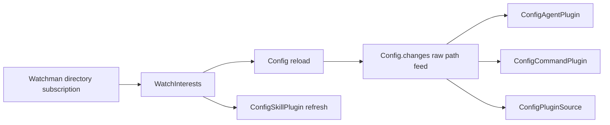
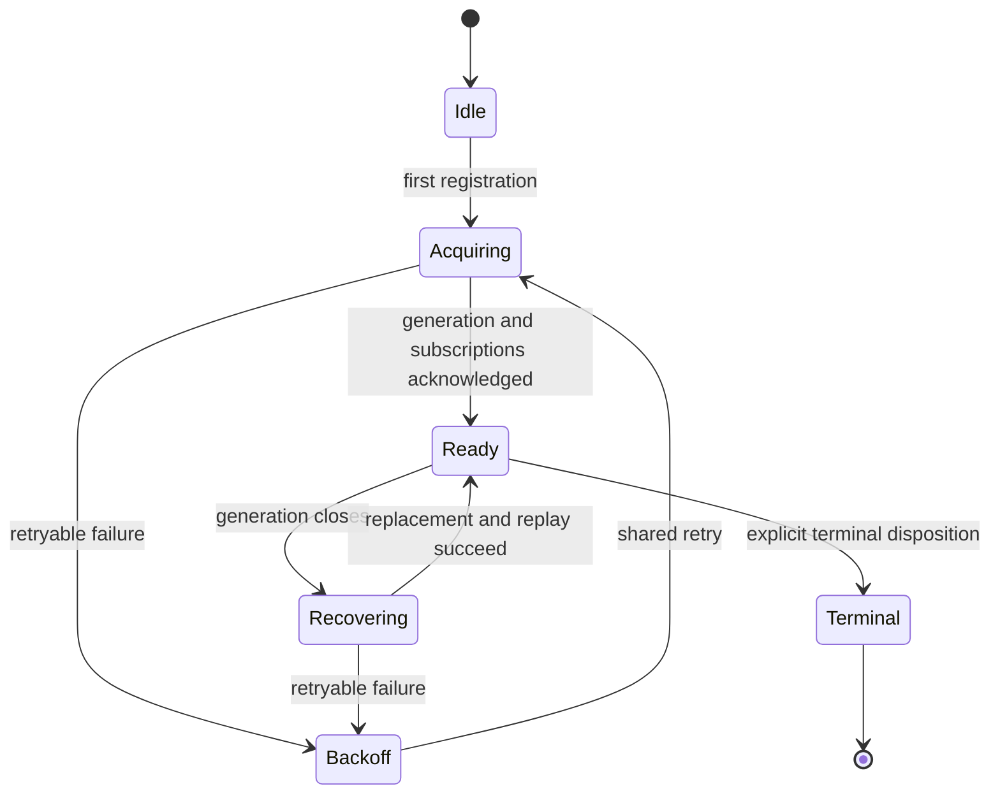

# Watchman architecture consolidation review

## Review status and method

This is a completed architecture review of the current workspace, not an
accepted replacement design and not a synthesis of other model reviews. It
combines two passes by the authoring model:

1. A code-level architecture review of acquisition, recovery, fallback, and
   resume delivery.
2. An adversarial follow-up testing a more radical cursorless invalidation
   model against every current directory consumer and downstream contract.

Facts marked **verified** were checked against the cited source. Watchwoman
since-query and tombstone claims additionally rely on the cited probe-verified
reference. Proposed architecture and implementation sizes are judgments. No
runtime test was executed for this review.

The governing assumptions are early-alpha rules: breaking changes are allowed,
legacy compatibility is not a goal, and deletion is preferable to preserving
accidental modes. Carryability against upstream OpenCode remains a first-class
constraint.

## Bottom line

The current system has too many simultaneous policy paths. Construction-time
fallback, per-interest fallback, one-shot initial acquisition, unbounded
post-ack recovery, canceled-subscription recovery, sticky fatal state, and
source-owner recovery all make overlapping decisions.

The highest-yield target architecture is:

1. Backend selection is strict. `watchman` means Watchman for directories and
   never silently becomes Parcel. Files remain deliberately on Node.
2. One supervisor per root intent owns cold acquisition, generation recovery,
   backoff, and subscription replay.
3. Failure disposition is explicit and independent of whether an error occurred
   before or after the first acknowledgement.
4. Delivery has one policy, but the exact event contract remains an explicit
   fork rather than a false consensus.
5. Reversible Parcel bridging is not built.

The delivery fork is real:

| Model | Strength | Blocking issue |
| --- | --- | --- |
| Exact response-row replay with cursors | Preserves today's exact changed-path contract and current downstream filters | More protocol state; tombstone GC still leaves a narrow all-deletion residual |
| Fresh-clock, cursorless coarse invalidation | Simpler recovery; current-state scans make rows and tombstones unnecessary | Config republishes exact paths to Agent, Command, and Plugin Source, which reject a watched-root dirty path |

Cursorless invalidation is conditionally sound for final-state caches. It is
not correct in the current consumer graph. Response rows and conservative
target invalidation currently serve different contracts and must not be treated
as interchangeable.

## Verified current architecture

### Policy is split across layers

| Policy site | Verified behavior | Reference |
| --- | --- | --- |
| Generic layer construction | A Watchman backend construction error substitutes the inherited native watcher process-wide | [`Watcher.layer`, `watcher.ts:97-115`](/packages/core/src/filesystem/watcher.ts#L97-L115) |
| Watchman adapter acquisition | Every error escaping a directory's initial `registry.subscribe` becomes Parcel for that physical interest | [`backend.make`, `backend.ts:16-32`](/packages/core/src/filesystem/watcher/watchman/backend.ts#L16-L32) |
| Initial root acquisition | `current -> create -> establish` gets one attempt | [`root.ts:178-195`, `399-435`](/packages/core/src/filesystem/watcher/watchman/root.ts#L178-L195) |
| Established root recovery | `recoverRoot -> replacement -> reconnect` retries recursively with capped jittered backoff | [`root.ts:290-351`](/packages/core/src/filesystem/watcher/watchman/root.ts#L290-L351) |
| Canceled subscription | A separate `current -> establish -> catch/reconnect` branch recovers one subscription | [`root.ts:377-385`](/packages/core/src/filesystem/watcher/watchman/root.ts#L377-L385) |
| Fatal classification | `decode` and `route` stages set `state.fatal`; no clearing site exists | [`root.ts:108-112`, `178-192`, `299-315`](/packages/core/src/filesystem/watcher/watchman/root.ts#L108-L112) |
| Source-owner recovery | Watch failures terminate `WatchInterests.changes`; Config and Skill independently reload and recursively observe again | [`interests.ts:18-20`, `49-77`](/packages/core/src/filesystem/watcher/interests.ts#L18-L20), [`config.ts:329-345`](/packages/core/src/config.ts#L329-L345), [`skill.ts:208-220`](/packages/core/src/config/plugin/skill.ts#L208-L220) |

The result is a temporal acquisition cliff. The same transport or command
failure falls permanently to Parcel before acknowledgement and retries forever
after acknowledgement. Different interests under one root can remain on
different adapters, and no promotion mechanism reconciles them later.

### Subscribe response state is discarded

Watchwoman returns `clock`, `is_fresh_instance`, `root`, and `files` in the
subscribe command response
([`subscribe.rs:71-87`](file:///home/rektide/src/watchwoman-systemd/crates/watchwoman/src/commands/subscribe.rs#L71-L87)).
The client schema keeps only `subscribe`, `version`, and `warning`
([`schema.ts:23-26`](/packages/core/src/filesystem/watcher/watchman/schema.ts#L23-L26)).

On compatible recovery, `establish` submits the prior `item.clock`, decodes the
minimal response, stores the requested clock again, and publishes no response
rows ([`root.ts:204-269`](/packages/core/src/filesystem/watcher/watchman/root.ts#L204-L269)).
The daemon's initial since-query is therefore computed, transported, parsed by
the raw transport, stripped by the schema, and never reaches consumers.

This is a verified correctness gap for exact-path recovery. It also means an
immediate second disconnect resumes from the old request clock rather than the
response's current clock.

### The direct and indirect consumer graph differs

Current production directory subscriptions do enter through `WatchInterests`.
Its production owners are Config and `ConfigSkillPlugin`:



The second edge from Config is load-bearing. `Config.Interface.changes`
explicitly promises raw filesystem updates under config roots
([`config.ts:35-44`](/packages/core/src/config.ts#L35-L44)). Agent, Command, and
Plugin Source filter this stream by whether the exact changed path is contained
under a domain-specific child directory:

- Agent filters `{agent,agents,mode,modes}`
  ([`agent.ts:65-73`, `125-132`](/packages/core/src/config/plugin/agent.ts#L65-L73)).
- Command filters `{command,commands}`
  ([`command.ts:46-57`, `104-114`](/packages/core/src/config/plugin/command.ts#L46-L57)).
- Plugin Source filters known plugin directories
  ([`source.ts:77-87`, `171-176`](/packages/core/src/config/plugin/source.ts#L77-L87)).

`FSUtil.contains(childDirectory, watchedRoot)` is false
([`fs-util.ts:271-273`](/packages/util/src/fs-util.ts#L271-L273)). Config's own
reload does not parse Agent, Command, or Plugin source contents; a directory
entry is represented only by its path
([`config.ts:183-190`](/packages/core/src/config.ts#L183-L190)). If Config's
entries remain structurally equal, it emits no `config.updated`
([`config.ts:313-325`](/packages/core/src/config.ts#L313-L325)).

This graph is the central constraint on coarse invalidation.

## Recommended architecture

### 1. Make backend selection strict

**Verified basis.** `Watcher.layer` and `backend.make` both retain the inherited
native adapter as fallback. `backend.make` also receives file watches only to
delegate them back to that adapter
([`backend.ts:7-31`](/packages/core/src/filesystem/watcher/watchman/backend.ts#L7-L31)).
All Watchman-to-Parcel policy was introduced by this downstream line; it is not
an inherited upstream requirement.

**Proposal.** Dispatch files to Node and directories to the configured
directory adapter at the generic watcher seam. Remove the fallback argument and
catch-all from `backend.make`. A broken transport fails visibly. A temporarily
unavailable daemon remains in the Watchman supervisor's acquisition policy.

**Behavior deleted.** Process-wide construction fallback, catch-all
per-interest fallback, permanent mixed-backend roots, fallback metrics, and the
need for Parcel-to-Watchman promotion all disappear.

**Likely size.** Approximately 50-100 changed lines across `watcher.ts`,
`backend.ts`, metrics, and focused tests.

**Tests.** Assert file watches remain Node, Watchman directory failure never
invokes Parcel, a transport load error is visible, and a pending Watchman
acquisition remains interruptible.

**Carry risk.** Medium. `backend.ts` is downstream-only, but explicit type
dispatch touches upstream-owned `watcher.ts`. The net patch should shrink
because fallback plumbing and mixed-mode observation are removed.

### 2. Give each root one lifecycle supervisor

**Verified basis.** Initial acquisition, root replacement, per-subscription
reconnect, and canceled-subscription re-establishment are separate functions
with separate policy branches. `state.recovering` shares root creation after an
outage, but every subscription independently notices closure and enters its own
recursive `reconnect` path
([`root.ts:319-370`](/packages/core/src/filesystem/watcher/watchman/root.ts#L319-L370)).

**Proposal.** One scoped supervisor owns a root intent. Subscriptions register
before acquisition and await an item-level first acknowledgement. The
supervisor alone acquires generations, applies backoff, replays all still-live
subscriptions, and accepts a request to re-establish one canceled subscription
on the current generation. Unsubscribe removes registration immediately.



**Behavior deleted.** `current`, `recoverRoot`, `replacement`, recursive
per-item `reconnect`, the acquisition cliff, and the canceled branch's separate
root-selection policy disappear. Acknowledgement remains a delivery milestone,
not a retry-policy boundary.

**Likely size.** A 150-250-line internal rewrite in `root.ts`, likely with a
smaller net state machine after old paths are removed.

**Tests.** Cover transient failures before first acknowledgement, identical
disposition before and after acknowledgement, one shared recovery sequence for
N subscriptions, cancellation during root recovery, unsubscribe during cold
acquisition, and no resurrection after unsubscribe.

**Carry risk.** Low textual risk because `root.ts` and its tests are
downstream-only. Behavioral risk is medium because interruption and
subscription replay ordering change.

### 3. Classify failures by disposition, not operation stage

**Verified basis.** `WatchmanError.stage` is both an operation label and a
policy input ([`schema.ts:60-75`](/packages/core/src/filesystem/watcher/watchman/schema.ts#L60-L75)).
`current`, `recoverable`, and `recoverRoot` interpret those strings separately.
Any callback error from `watch` has stage `route` and becomes sticky fatal,
including a transient daemon error. The metrics test currently pins that
behavior ([`watchman-metrics.test.ts:167-186`](/packages/core/test/filesystem/watchman-metrics.test.ts#L167-L186)).

**Proposal.** Separate operation metadata from a tagged disposition. The
minimum useful model is root-retryable transport or generation loss,
subscription-terminal invalid intent, and backend-terminal protocol mismatch.
One classifier feeds the root supervisor. Delete sticky `state.fatal`, or scope
terminal state to the live retained root connection and an explicitly terminal
kind.

**Behavior deleted.** Three string-stage policy checks, route-stage lifetime
poisoning, timing-sensitive subscribe classification, and repeated owner-level
attempts against a known poisoned root disappear.

**Likely size.** Approximately 60-120 lines across `schema.ts`, `client.ts`,
`route.ts`, `root.ts`, and tests.

**Tests.** Use a table of structured failures: transient `watch` error retries,
schema mismatch terminates without a reconnect storm, invalid target fails only
its subscription, and generation closure always retries at root scope.

**Carry risk.** Low. The affected Watchman modules are downstream-only. The
principal uncertainty is whether the transport preserves enough daemon error
structure to avoid message matching.

### 4. Keep the delivery choice explicit

The root supervisor and strict selector do not require an immediate choice
between response-row replay and cursorless invalidation. The two coherent
designs are recorded separately below.

#### Option A: exact response-row replay

Decode a shared file-row shape in subscribe responses and unilateral PDUs. Use
one delivery function for response clock updates, local ignore filtering,
create/update/delete path publication, fresh-instance handling, and metrics.
Set `always_include_directories: false`. Emit a conservative target update on
resume as an additional signal, not a substitute for exact paths.

This is the smallest correction compatible with today's Config contract.
It closes ordinary same-generation and daemon-restart gaps. It preserves the
generic `Watcher.Update` path contract and the direct live test at
[`watchman-live.test.ts:13-35`](/packages/core/test/filesystem/watchman-live.test.ts#L13-L35).

Its residual is explicit. Watchwoman tombstone GC can remove all deletion rows
after a long same-generation disconnect
([`since-queries/README.md:67-93`](file:///home/rektide/src/watchwoman-systemd/.test-agent/since-queries/README.md#L67-L93)).
A target dirty update refreshes Config and Skill directly, but it does not pass
Agent, Command, or Plugin Source's exact-path filters. Response-row replay is
therefore strongly corrective, not mathematically lossless for every indirect
consumer.

#### Option B: cursorless coarse invalidation

Take a fresh clock for establishment, subscribe from that clock, intentionally
ignore command-response rows, and emit one target-level dirty update after a
successful re-establishment. State owners rescan the current filesystem. There
is no per-subscription cursor to retain, reject, advance, expose in metrics, or
resume after a daemon restart.

This is conditionally correct for current-state caches. The post-ack scan covers
the outage and clock-to-ack interval. Changes after acknowledgement either enter
the scan or produce a live PDU that schedules another scan. Intermediate event
history that leaves the same final state is deliberately discarded.

It is blocked today by Config's raw exact-path feed. Before this option is
correct, Config must expose first-class subtree invalidation and Agent, Command,
and Plugin Source must treat it as "an unknown descendant changed." Merely
publishing `{ path: watchedRoot, type: "update" }` is insufficient.

Optionally coalescing each live PDU to one target invalidation widens that
contract change from recovery to steady state. It also makes all source domains
under a config root rescan for every relevant PDU, replacing today's selective
path filters with broad invalidation.

**Review judgment.** Option A is the safe near-term correction. Option B may be
the simpler total architecture, but only as a coordinated Config contract
change. Landing cursor deletion before that change is a correctness regression.

### 5. Keep reversible Parcel bridging out of scope

A temporary Parcel subscription that later swaps to Watchman would require an
adapter-changing exact-interest entry, duplicate-delivery and handoff rules,
cancellation fencing, and another reconciliation loop in upstream-owned
`watcher.ts`. It creates more simultaneous behavior than it removes. Strict
static selection makes the bridge unnecessary and is more carryable.

### 6. Move generic physical-watch recovery only after Watchman policy settles

The generic watcher currently represents acquisition failure as
`Subscription | undefined`, runtime failure through an imperative `fail`
callback and `Deferred`, and readiness through private metadata
([`watcher.ts:45-55`, `124-187`](/packages/core/src/filesystem/watcher.ts#L45-L55)).
`WatchInterests` propagates runtime failure to source owners, which independently
reload and resubscribe.

A later cleanup can let the generic exact-interest entry supervise typed,
retryable Node or Parcel failures while Watchman consumes root-retryable failures
internally. Exactly one layer must retry any given failure. This would delete
the duplicated Config and Skill recursive observer loops, but it touches
upstream-owned watcher and owner modules and should not precede the root-local
rewrite.

## Adversarial review of cursorless invalidation

### What the model gets right

For Config's own documents and topology, and for `ConfigSkillPlugin`, the
current source-owner ordering supports state invalidation:

- Config starts its observer before initial `ensure/discover/reconcile`
  ([`config.ts:329-346`, `384-387`](/packages/core/src/config.ts#L329-L346)).
- Skill starts its observer before initial refresh
  ([`skill.ts:204-222`](/packages/core/src/config/plugin/skill.ts#L204-L222)).
- `WatchInterests.ready` already emits one target dirty update after initial
  physical acknowledgement
  ([`interests.ts:36-47`](/packages/core/src/filesystem/watcher/interests.ts#L36-L47)).
- Config serializes reloads; Skill uses a capacity-one sliding queue and a
  serialized refresh.

Under these conditions, cursor replay and tombstones are unnecessary for final
state convergence. A fresh clock keeps initial result sets small; a post-ack
scan supplies the actual truth.

### Exact-path downstream consumers are the blocker

Consider an agent file changed while Watchman is disconnected:

```text
watched target: /repo/.opencode
changed file:   /repo/.opencode/agents/reviewer.md
resume signal:  { path: /repo/.opencode, type: update }
```

Config republishes the root signal, then reloads. Its entry list is unchanged,
so it emits no `config.updated`. `ConfigAgentPlugin` tests whether the root path
is inside `/repo/.opencode/agents`; it is not. The agent state remains stale.
The same counterexample applies to Command and auto-discovered Plugin sources.

This is not hypothetical API purity. Existing tests inject exact paths to prove
those registries rebuild
([`agent.test.ts:430-465`](/packages/core/test/config/agent.test.ts#L430-L465),
[`command.test.ts:175-205`](/packages/core/test/config/command.test.ts#L175-L205)).
No current test exercises a watched-root invalidation after a daemon outage.

### Initial readiness is a separate delivery path

During first acquisition, `input.publish` writes to the exact-interest PubSub
while `native.subscribe` is still inside `RcMap.lookup`. `Stream.fromPubSub` is
attached only after lookup returns
([`watcher.ts:124-160`, `179-187`](/packages/core/src/filesystem/watcher.ts#L124-L160)).
An initial dirty publish inside `root.establish` can therefore be dropped. The
private `ready` callback writes directly to the owner's change queue and must
remain for first acknowledgement.

A root-level post-success publish is valid for re-establishment because the
consumer stream is already active. The implementation must distinguish initial
acknowledgement from replay rather than applying one unconditional establish
tap.

### Cancellation cannot be reduced to post-success notification

The current canceled-PDU handler publishes conservative dirty state before it
detaches and attempts re-establishment
([`root.ts:377-385`](/packages/core/src/filesystem/watcher/watchman/root.ts#L377-L385)).
This allows source owners to observe deletion or topology change even if the
target cannot immediately be watched again.

Moving the only signal after successful re-establishment delays reconciliation
through a daemon outage and can eliminate it for a deleted exact root. Keeping
the pre-cancel signal and adding a post-success signal produces two updates.
Fresh-instance PDUs can add another signal. "Exactly one" is therefore not a
sufficient lifecycle rule; initial-ready, canceled-before-retry,
resumed-success, and fresh-instance transitions need explicit semantics.

### Live-PDU coalescing changes the public meaning of an update

`Watcher.Update` is a Parcel event shape and the live Watchman test expects the
changed file path. Coalescing a PDU to the subscription target intentionally
changes directory watching from event delivery to invalidation delivery.

That can be a good design, but it must be named in the type or contract. An
ancestor target path is not safely distinguishable from an ordinary update to
that directory. A first-class invalidation variant avoids forcing consumers to
infer broadness from path shape.

### Ignore filtering remains necessary

Watchman expression pushdown omits glob ignores
([`root.ts:453-464`](/packages/core/src/filesystem/watcher/watchman/root.ts#L453-L464)).
Local filtering handles those globs and exact ignored subtrees
([`root.ts:466-490`](/packages/core/src/filesystem/watcher/watchman/root.ts#L466-L490)).
The shared ignore list includes cookie, log, temporary, and nested-directory
patterns ([`ignore.ts:37-56`](/packages/core/src/filesystem/ignore.ts#L37-L56)).

PDU coalescing may delete create/update/delete mapping, but it cannot safely
reduce the decision to `files.length > 0`. It still needs enough row data to
identify non-ignored paths. `fields: ["name"]` is unsafe because the verified
daemon shortcut hides deletions; `name` plus `exists` is the minimum safe live
shape. Canceled and fresh-instance PDUs need explicit invalidation even when no
ordinary file row survives filtering.

### Fresh clock per subscription adds generation churn surface

Compatible cursor resume currently skips `clock`; fresh-clock recovery changes
every replay from one serialized command to two
([`root.ts:204-235`](/packages/core/src/filesystem/watcher/watchman/root.ts#L204-L235)).
Any submitted command timeout closes the shared root generation
([`client.ts:121-142`](/packages/core/src/filesystem/watcher/watchman/client.ts#L121-L142)).
For N subscriptions, N extra clock commands create N extra opportunities to
restart every sibling's recovery.

Cursorless correctness does not require a distinct clock for every retained
subscription on one replacement generation. One generation clock can seed the
replay batch; a newly added subscription on an already-live generation still
needs a fresh clock. This is both simpler and less failure-prone than a strict
clock-before-each-subscribe rule.

### Metrics must change meaning

Cursor deletion removes `SubMetrics.clock`, `atClock`, and rendered
`subs[].clock`
([`metrics.ts:33-43`, `78-110`, `270-280`](/packages/core/src/filesystem/watcher/watchman/metrics.ts#L33-L43)).

If N relevant file rows become one target invalidation, `updates_out` no longer
counts file updates after ignore filtering. The documented
`files_in - updates_out` ignore drop rate becomes false because batching and
filtering are conflated
([`metrics.ts:94-102`, `223-229`](/packages/core/src/filesystem/watcher/watchman/metrics.ts#L94-L102),
[`metrics0.glm53.md:116-151`](/.design/watchman/metrics0.glm53.md#L116-L151)).
The coarse model needs an `invalidations_out` or "PDUs with relevant files"
counter rather than silently retaining the current interpretation.

## Delivery decision matrix

| Concern | Exact response-row replay | Cursorless invalidation |
| --- | --- | --- |
| Current Config exact-path filters | Preserved | Broken until Config contract changes |
| Same-generation outage | Exact rows plus conservative signal | One current-state scan |
| Daemon restart | Full response can be large; exact paths preserved | Fresh clock suppresses historical output; one scan |
| Tombstone GC after long gap | Can miss all-deletion rows; target signal is insufficient for indirect exact-path consumers | Absence in current-state scan is authoritative if broad invalidation reaches every owner |
| Event history | Preserved as daemon state-diff rows | Intentionally discarded |
| Subscription state | Per-item cursor and response clock | No cursor; establishment clock only |
| Live PDU paths | Exact changed paths | Optional one target invalidation after local filtering |
| Metrics | Existing path-output model remains meaningful | Cursor and output metrics require redesign |
| Carry footprint | Mostly downstream-only Watchman files | Adds edits to Config, Agent, Command, and Plugin Source |
| Near-term correctness | Best fit | Not correct as currently wired |

## Deletion inventory relative to response-row replay

### Code

The cursorless base would delete or avoid:

- `SubscriptionState.clock`
  ([`root.ts:31-39`](/packages/core/src/filesystem/watcher/watchman/root.ts#L31-L39)).
- Route/cursor compatibility selection and stale-cursor retry
  ([`root.ts:204-249`](/packages/core/src/filesystem/watcher/watchman/root.ts#L204-L249)).
- Both `item.clock` and `SubMetrics.atClock` update sites
  ([`root.ts:250-253`, `387-388`](/packages/core/src/filesystem/watcher/watchman/root.ts#L250-L253)).
- Per-subscription cursor gauges and rendering in `metrics.ts`.
- The proposed expansion of `SubscribeResponse`; the current minimal schema
  remains intentionally sufficient for acknowledgement and warning.
- Response-file publication and response-clock accounting proposed by the
  exact replay path.

If live PDUs also become target invalidations, the change can additionally
delete `publishFiles`'s create/update/delete mapping and stop requesting `new`
and `type`. It cannot delete local path/glob filtering, file names, or deletion
visibility.

The cursorless total system adds compensating code outside Watchman: a typed
Config subtree invalidation and broad handling in Agent, Command, and Plugin
Source. That upstream-owned expansion is the price of the backend deletion.

### Tests

The cursor-resume test
([`watchman-root.test.ts:148-182`](/packages/core/test/filesystem/watchman-root.test.ts#L148-L182))
becomes a fresh-clock and post-ack invalidation test. It must assert response
rows are intentionally ignored and that a second recovery uses a new or shared
generation clock rather than a PDU cursor.

Clock assertions in
[`watchman-metrics.test.ts:75-103`, `136-163`](/packages/core/test/filesystem/watchman-metrics.test.ts#L75-L103)
disappear. If live coalescing lands, per-file metric and live-path expectations
also change. The cancellation test
([`watchman-root.test.ts:272-307`](/packages/core/test/filesystem/watchman-root.test.ts#L272-L307))
must separately pin pre-retry cancellation and post-recovery behavior instead
of asserting an undifferentiated update count.

Cursorless invalidation requires tests not present today:

- An agent file changed during outage converges after one root invalidation.
- A command file changed during outage converges after one root invalidation.
- An auto-discovered plugin changed during outage reactivates after one root
  invalidation.
- Initial readiness reaches the owner even though the native PubSub subscriber
  is attached after acquisition.
- A canceled exact root that cannot re-establish still triggers source
  reconciliation.
- An ignored-only PDU emits no live invalidation.
- N files in one PDU produce one invalidation and honest metrics.

### Documentation

Cursorless invalidation supersedes, rather than lightly amends, accepted
semantics:

- The accepted design names cursor resume as retained architecture and recovery
  behavior
  ([`draft2.gpt56t.md:47-58`, `303-313`](/.design/watchman/draft2.gpt56t.md#L47-L58)).
- Its failure table and verification plan include cursor rejection and cursor
  resume
  ([`draft2.gpt56t.md:319-332`, `411-425`](/.design/watchman/draft2.gpt56t.md#L319-L332)).
- Amendment 3 declares full-result replay to be the intended degradation
  ([`draft2.gpt56t.md:552-560`](/.design/watchman/draft2.gpt56t.md#L552-L560)).
- The maintenance log describes cursor recovery and live cursor metrics
  ([`README.md:34-50`, `60-83`, `113-123`](/.design/watchman/README.md#L34-L50)).
- The since-query assessment's response-row recommendation and tombstone
  residual become historical rationale rather than implementation guidance.
- The fallback and Parcel comparisons must stop describing cursor resume as the
  recovery differentiator.
- The metrics guide must remove cursor recipes and redefine output counters.

Any accepted cursorless design must explicitly state that Watchman-served
directories are invalidation subscriptions, not exact filesystem event
streams. Without that contract change, documentation and implementation would
disagree.

## Carryability assessment

| Change | Upstream carry risk | Reason |
| --- | --- | --- |
| Response decoding and delivery | Very low | Confined to downstream-only Watchman schema, root, and tests |
| Root supervisor | Low textual, medium behavioral | Large rewrite in downstream-only files |
| Typed Watchman failures | Low | Downstream-only protocol and lifecycle modules |
| Strict directory selection | Medium | Simplifies downstream backend but changes upstream-owned `watcher.ts` |
| Cursorless backend internals | Very low | Deletes state in downstream-only files |
| First-class Config invalidation | High | Touches upstream-owned Config, Agent, Command, Plugin Source, and tests |
| Generic physical-watch recovery | High | Changes upstream watcher and source-owner contracts |
| Reversible Parcel bridge | Highest | Requires adapter handoff in the upstream exact-interest registry |

This is why exact response-row replay is the better immediate carrier even if a
future cursorless total architecture is conceptually smaller. The latter moves
complexity out of downstream-only Watchman files and into four upstream-owned
consumer modules.

## Recommended sequence

1. Correct response delivery in downstream-only code: decode response rows and
   response clock, share filtering/delivery, disable directory rows, and retain
   a clearly scoped conservative resume signal.
2. Rewrite root acquisition and recovery around one supervisor while
   introducing explicit failure dispositions.
3. Make Watchman selection strict and delete both fallback sites.
4. Decide the directory event contract explicitly. Keep exact response replay,
   or first land a typed Config subtree invalidation through Agent, Command, and
   Plugin Source and only then delete cursors and response rows.
5. Redefine metrics after the delivery contract settles, not before.
6. Rebuild a small final-state carrier rather than preserving the historical
   sequence of fallback and recovery refinements.

## Verification matrix

The final architecture should prove:

- The same retryable error receives the same disposition immediately before
  and after first acknowledgement.
- N interests on one root share one cold acquisition and one recovery sequence.
- Selecting Watchman never invokes Parcel for a directory.
- File interests remain Node watches.
- Unsubscribe during cold acquisition or recovery never resurrects an interest.
- One root's command timeout does not close another root.
- Initial acknowledgement produces one owner-visible dirty replay.
- Cancellation produces an owner-visible dirty signal even when
  re-establishment cannot yet succeed.
- Exact replay mode delivers create, update, and delete response rows and stores
  the response clock.
- Cursorless mode, if chosen, converges Config, Skill, Agent, Command, and Plugin
  Source through one explicit subtree invalidation.
- Ignored-only PDUs do not trigger source scans.
- Metrics distinguish received rows, ignored rows, exact updates, and coarse
  invalidations without deriving false drop rates.

## Cross-references

- [`vision0.gpt56s.md`](/.design/watchman/vision0.gpt56s.md) is the provisional
  consolidation vision. This review independently supplies the code-level
  architecture findings and adversarial consumer audit needed to evaluate its
  open delivery-contract decision.
- [`fallbacks0.glm53.md`](/.design/watchman/fallbacks0.glm53.md) maps the two
  fallback sites, acquisition cliff, sticky fatal state, and mixed-backend
  outcomes that strict selection and a root supervisor would delete.
- [`topic-query0.glm53.md`](/.design/watchman/topic-query0.glm53.md) establishes
  the dropped subscribe-response delta and tombstone-GC edge. This review
  preserves its exact-row correction while showing why target invalidation is
  insufficient for Config's indirect exact-path consumers.
- [`draft2.gpt56t.md`](/.design/watchman/draft2.gpt56t.md) is the accepted
  architecture whose initial fallback and cursor-resume decisions this review
  deliberately reopens.
- [`README.md`](/.design/watchman/README.md) records the implemented stack,
  runtime semantics, metrics, and historical verification baseline.
