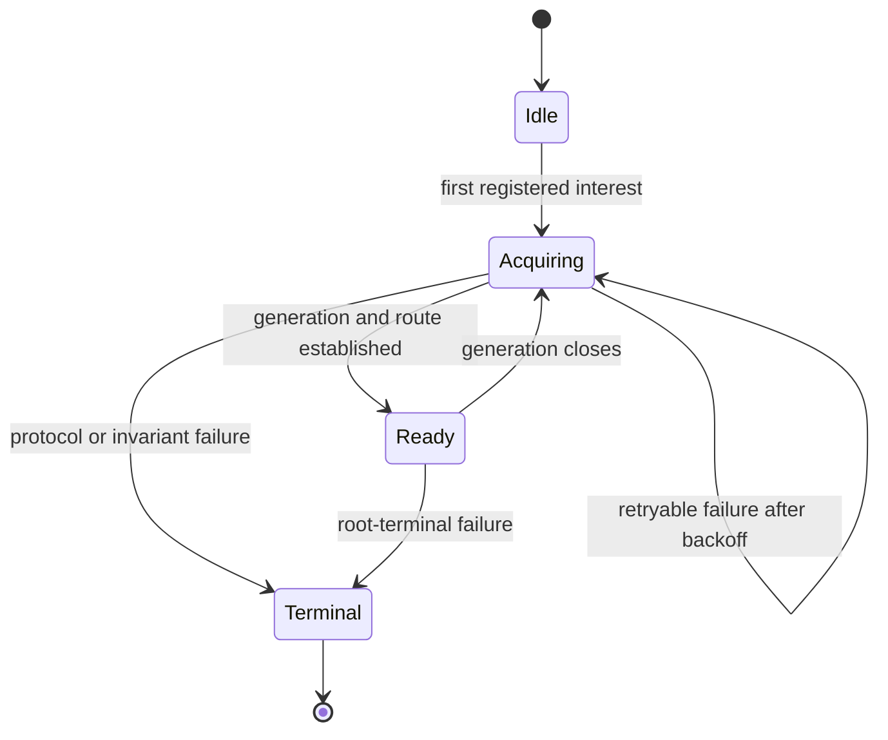

# Radical Watchman simplification review

## Situation

The current early-alpha backend carries several policies at once: Parcel is the
default, Watchman is opt-in, initial Watchman errors can permanently select
Parcel per interest, established Watchman subscriptions retry indefinitely,
some errors poison a root, cursor resume tries to preserve exact events, and a
large temporary metrics surface observes all of those states. The result is
hard to explain and expensive to carry over upstream OpenCode.

The governing question for this review is: *what is the smallest policy seam
that removes timing-dependent outcomes and mixed directory backends without
building another migration manager?*

## Decision

Adopt **strict Watchman selection with retry-forever asynchronous
availability**:

| Selection | Exact files | Directories | Availability policy |
| --- | --- | --- | --- |
| absent or `parcel` | Node | Parcel | inherited Parcel behavior |
| `watchman` | Node | Watchman | remain Watchman; retry availability failures with bounded, jittered backoff |

Strict selection means a configured Watchman directory interest never invokes
Parcel. Retry-forever means daemon unavailability leaves acquisition pending in
the owner-started stream fiber rather than failing over. Exact file watches
remain deliberately on `node:fs.watch`; this stable type partition is not a
runtime fallback.

This recommendation deliberately rejects reversible Parcel bridging. It also
supersedes the accepted design's pre-acknowledgement Parcel fallback. Users who
want no daemon dependency already have the static Parcel selection.

## Policy comparison

| Policy | Initial outage | Later outage | Mixed backend risk | New machinery | Assessment |
| --- | --- | --- | --- | --- | --- |
| Watchman-required, fail-fast | fail interest or service | fail interest or service | none | little | Smallest code, but ordinary daemon restarts become owner-level failure churn |
| Bounded bridge to Parcel | start Parcel after a deadline | migrate to Parcel, then possibly back | high unless every interest crosses a coordinated barrier | root/process supervisor for two adapters, overlap rules, fencing, reconciliation | Reject for alpha |
| Retry forever | acquisition remains pending | root reconnects and re-establishes | none | reuse and centralize existing recovery | **Recommended** |

"Watchman-required" is defined here as fail-fast so it remains distinct from
the recommendation. Both fail-fast and retry-forever can honor strict backend
selection; retry-forever preserves the useful daemon-restart resilience already
implemented after acknowledgement.

A bridge that actually prevents mixed behavior cannot live in the catch at
[`backend.ts:23-31`](/packages/core/src/filesystem/watcher/watchman/backend.ts#L23-L31).
It must own every logical interest on the root, acquire one Parcel subscription
per interest, fence removals during handoff, define overlap and duplicate
delivery, emit a cutover invalidation, and migrate the entire set back together.
A process-global bridge avoids some bookkeeping by letting one bad root
downgrade every project, which discards the root isolation this backend was
built to provide.

## Small state machine

Keep one unexported state machine inside `makeConnection`:



`Acquiring` deliberately covers both first contact and recovery. The state
machine has no `Parcel` state and no acknowledgement-dependent policy branch.
One internal operation should own the complete transition:

```ts
attach(item, resumed): Effect<Established, WatchmanFatal, Scope>
```

`attach` awaits or starts the one shared root acquisition, establishes the
subscription, retries generation loss, and emits the required recovery signal.
Initial subscription, socket closure, and canceled-subscription recovery all
call the same operation. Acknowledgement is a delivery milestone, not a policy
boundary.

This replaces the implicit optional-state product at
[`root.ts:108-112`](/packages/core/src/filesystem/watcher/watchman/root.ts#L108-L112),
the one-shot `current()` path at
[`root.ts:178-195`](/packages/core/src/filesystem/watcher/watchman/root.ts#L178-L195),
and the separate `recoverRoot`/`replacement`/`reconnect` path at
[`root.ts:290-351`](/packages/core/src/filesystem/watcher/watchman/root.ts#L290-L351).
The unguarded initial call at
[`root.ts:399-436`](/packages/core/src/filesystem/watcher/watchman/root.ts#L399-L436)
then cannot diverge from established recovery.

Failure disposition should be tagged and phase-independent:

| Disposition | Examples | Action |
| --- | --- | --- |
| root-retryable | transport loss, generation closure, admitted-command timeout | close generation, back off, retry once per root |
| subscription-terminal | invalid local target or rejected subscription shape | fail that interest visibly |
| backend-terminal | decoded protocol incompatibility or violated root invariant | stop the root visibly; never select Parcel |

The current predicate inspects both error stage and mutable generation state
([`root.ts:290-297`](/packages/core/src/filesystem/watcher/watchman/root.ts#L290-L297)).
In particular, the timeout path should close the generation and produce an
explicit generation-loss error rather than make retry depend on when
`state.active` was cleared
([`client.ts:121-127`](/packages/core/src/filesystem/watcher/watchman/client.ts#L121-L127)).
When transport errors are too ambiguous to classify, retrying with bounded
backoff is safer than silently changing adapters or caching a permanent poison.

## Why pending acquisition is acceptable

`WatchInterests.ensure` obtains a stream and starts it in an owner fiber without
waiting for physical acknowledgement
([`interests.ts:31-61`](/packages/core/src/filesystem/watcher/interests.ts#L31-L61)).
The initial source scan therefore continues while Watchman is unavailable. When
acquisition eventually succeeds, the existing `ready` callback queues a dirty
replay
([`interests.ts:36-55`](/packages/core/src/filesystem/watcher/interests.ts#L36-L55)).
Generic watcher tests already pin interruption of pending native acquisition
([`watcher.test.ts:61-82`](/packages/core/test/filesystem/watcher.test.ts#L61-L82)).

The operational cost is explicit: hot reload is unavailable while the selected
daemon is unavailable. That is preferable to silently running some interests
on a backend the user did not select.

## Resume delivery

Strict selection and the root state-machine rewrite are independent of the
event-delivery decision. The immediate safe repair is still exact-path resume:

1. Extend `SubscribeResponse` to decode response rows and the response clock
   when supplied.
2. Share one row-delivery implementation between subscribe responses and live
   PDUs.
3. Preserve local ignore filtering.
4. Request `always_include_directories: false`.
5. Emit one conservative target invalidation after every successful
   re-establishment, including an empty response.

The response rows close the exact-event outage gap identified in
[`topic-query0.glm53.md:104-140`](/.design/watchman/topic-query0.glm53.md#L104-L140).
The conservative update separately makes the reconnect itself observable when
the response is empty or daemon tombstone retention has erased deletions. These
signals serve different contracts under current code.

## Exact-path limitation

The earlier radical idea was to delete cursor replay, take a fresh clock on
every establishment, ignore response rows, and emit only one target-level
invalidation. **That deletion is conditional and is not immediately correct.**

`Config.Interface.changes()` promises raw filesystem updates so domain owners
can select the source paths they parse
([`config.ts:35-44`](/packages/core/src/config.ts#L35-L44)). Three current
consumers filter by `update.path`:

| Consumer | Exact-path dependency |
| --- | --- |
| Config Agent | `isAgentSource(entries, update.path)` at [`agent.ts:65-69`](/packages/core/src/config/plugin/agent.ts#L65-L69) |
| Config Command | `isCommandSource(entries, update.path)` at [`command.ts:46-52`](/packages/core/src/config/plugin/command.ts#L46-L52) |
| Plugin Source | `isPluginSource(entries, update.path)` at [`source.ts:77-86`](/packages/core/src/config/plugin/source.ts#L77-L86) |

An update whose path is merely the watched config root does not match a nested
agent, command, or plugin source. The consumers therefore do not reload. Plugin
Source's separate absolute entrypoint watches
([`source.ts:49-66`](/packages/core/src/config/plugin/source.ts#L49-L66)) are
exact file watches on Node and do not repair missed directory events from the
Config feed.

Two designs are coherent:

| Event contract | Watchman behavior | Required consumer work |
| --- | --- | --- |
| Preserve current raw-path feed | deliver response rows and cursor state exactly; also emit a conservative recovery signal | no inherited consumer change |
| Promote coarse invalidation | emit a tagged root/unknown-descendant invalidation and stop relying on response deltas | change Config plus Agent, Command, and Plugin Source to treat broad invalidation as reload-worthy |

The second design may eventually be the simpler total system. Only after it is
implemented and tested may the carrier delete `SubscriptionState.clock`, route
compatibility, response-file replay, cursor-rejection handling, and the cursor
metrics. Until then, exact response rows are correctness, not optional detail.

This limitation also exposes a pre-existing weakness: target updates currently
emitted for route changes, canceled subscriptions, and fresh instances do not
by themselves satisfy these exact-path consumers.

## Exact code seams

1. In [`watcher.ts:104-115`](/packages/core/src/filesystem/watcher.ts#L104-L115),
   remove the construction-time catch that substitutes the inherited adapter.
   A broken selected transport should fail visibly.
2. In [`backend.ts:7-34`](/packages/core/src/filesystem/watcher/watchman/backend.ts#L7-L34),
   retain delegation only for `type: "file"`; rename its role from `fallback`
   to `files` or `nativeFiles`, and delete directory fallback.
3. In [`root.ts`](/packages/core/src/filesystem/watcher/watchman/root.ts), replace
   `current`, `recoverRoot`, `replacement`, `reconnect`, and branch-local
   catches with the one root supervisor and `attach` operation.
4. In [`client.ts`](/packages/core/src/filesystem/watcher/watchman/client.ts),
   make timeout and generation-loss errors carry explicit retry disposition.
5. In [`schema.ts:23-47`](/packages/core/src/filesystem/watcher/watchman/schema.ts#L23-L47),
   share the file-row schema between `SubscribeResponse` and
   `SubscriptionChanges`; retain response clock when the daemon supplies it.
6. In [`root.ts:197-270`](/packages/core/src/filesystem/watcher/watchman/root.ts#L197-L270),
   route response rows and live rows through one exact-path publisher and add
   one post-re-establishment conservative update.
7. Do not move recovery orchestration into generic `watcher.ts`; the
   downstream-only Watchman root module is the lower-conflict seam.

## Deletion list

Delete as part of strict selection and lifecycle unification:

- The layer-construction Watchman-to-Parcel catch.
- The per-interest Watchman-to-Parcel catch.
- `WatchmanMetrics.fallback()` and the `fallbacks` counter.
- Per-interest terminal backend choice and mixed-backend documentation.
- Sticky fatal state whose lifetime is extended by a Parcel-backed interest.
- Acknowledgement-dependent recovery classification.
- Separate initial-acquisition and established-recovery policy paths.
- Logs that say a Watchman-selected directory is "using parcel watcher".

Delete only after a coarse Config invalidation contract lands:

- `SubscriptionState.clock` as behavioral state.
- Compatible-route cursor reuse and cursor-rejection retry branches.
- Subscribe-response row publication.
- Cursor and exact-row metrics.
- Tests whose contract is exact resume delivery.

Keep:

- Source-owned `WatchInterests` reconciliation and readiness.
- Root-scoped clients and command admission.
- One admitted-command deadline.
- Jittered root recovery.
- Exact Node file watches.
- Parcel as the absent/default static directory selection.
- Exact response-row recovery until the Config contract changes.

## Metrics and option trim

The final radical carrier should not retain a 501-line metrics implementation,
a 244-line metrics test, two render modes, periodic dump scheduling, and public
CLI/server options merely to observe states the redesign deletes. The target is
a small set of structured transition events: acquisition waiting, retry,
recovered, root terminal, subscription terminal, and exact rows delivered.

Sequence matters. Keep existing observation while validating the replacement
state machine, then remove or reduce it before declaring the new carrier final.
The final-state recommendation is:

- delete [`metrics.ts`](/packages/core/src/filesystem/watcher/watchman/metrics.ts)
  and
  [`watchman-metrics.test.ts`](/packages/core/test/filesystem/watchman-metrics.test.ts)
  unless live evidence shows a retained counter pays for itself;
- delete public `metricsIntervalMs` and `metricsMode` plumbing;
- keep retry timing injectable for focused tests but remove public
  `retryBaseMs`/`retryCapMs` knobs until measured operations require them;
- restore Parcel's subscribe deadline to an internal constant rather than
  carrying a Watchman-adjacent public option;
- retain command timeout configurability only because loaded-host incidents
  established a concrete need;
- retain the binary override only while the deployed transport needs it.

This is a carrier trim, not permission to blind the lifecycle rewrite before it
is verified.

## Migration sequence

1. Correct response-row and clock delivery while preserving current exact-path
   semantics.
2. Replace split initial/recovery logic with the root supervisor and explicit
   error dispositions.
3. Remove both runtime fallback sites and all fallback state/metrics.
4. Decide whether Config should gain first-class coarse invalidation.
5. If coarse invalidation is accepted, change Config Agent, Command, and Plugin
   Source together, then delete cursor and response-row machinery.
6. Observe the new lifecycle under daemon restart and many-root cold start.
7. Remove temporary metrics and unearned public knobs.
8. Build a compact replacement carrier directly on current `v2@origin`, while
   preserving the old line and dated bookmarks.

## Verification targets

- The same transient failure receives the same disposition before and after
  first acknowledgement.
- N initial interests on one root share one acquisition and retry sequence.
- No Watchman-selected directory interest invokes Parcel.
- File interests remain on Node.
- Canceling an interest during initial acquisition or recovery prevents its
  resurrection.
- A reconnect response publishes exact create, update, and delete paths and
  stores its returned clock.
- An empty reconnect response still emits one conservative update.
- Agent, Command, and Plugin Source reload after an outage changes their nested
  source files.
- One root's command timeout does not delay or retire another root.
- Pending acquisition remains interruptible and does not block initial source
  scans.
- Daemon restart plus outage writes and deletions converges every source owner
  to current filesystem state.

## Carrier assessment

The strict selector and root supervisor are highly carryable because almost all
behavior lives in the downstream-only
[`watchman/`](/packages/core/src/filesystem/watcher/watchman/) directory. The
essential upstream-owned contact is one backend-selection hunk in
[`watcher.ts`](/packages/core/src/filesystem/watcher.ts). Reversible bridging
would invert that advantage by putting migration state into the generic
registry.

The current line's server and CLI metrics knobs enlarge conflict surface without
owning correctness. Trimming those options and keeping diagnostics optional
reduces intersections with upstream assembly. The source-owned interest work
should remain independently droppable because it benefits Parcel as well as
Watchman.

A final replacement stack should contain a small number of final-state commits:

1. Source-owned interest reconciliation.
2. Generic placement, readiness, and visible-failure seam changes.
3. Strict root-scoped Watchman backend and focused tests.
4. Backend selector plumbing.
5. Optional diagnostics, only if retained by evidence.
6. Consolidated design and maintenance documentation.

Preserve old dated bookmarks and the audit line. Rebuild the maintained feature
from final state rather than carrying every historical refinement and its later
deletion. This follows the independent-feature and freshen policy in
[`patches.md:384-417`](file:///home/rektide/a/doc/opencode/patches.md#L384-L417).

## Limitations

- **Exact-path correctness is unresolved by target-only invalidation.** Cursor
  deletion is conditional on changing Config and all three inherited consumers
  cited above. The immediately safe design retains exact response rows.
- This review is based on static code and existing design evidence. It does not
  include an implementation or a new live-daemon experiment.
- Transport callback errors may not expose enough structure for perfect
  retry-versus-terminal classification. Ambiguous availability errors should
  retry with bounded backoff and visible transition logs.
- Strict transport selection means a missing or invalid transport package can
  fail Watcher construction. That failure must remain clear and actionable.
- Retry-forever preserves server and initial scan progress, but hot reload stays
  unavailable until Watchman acknowledges.
- Files remain on Node, so "strict Watchman" applies to directory interests,
  not every filesystem primitive in the process.
- Removing periodic metrics too early would make the lifecycle rewrite harder
  to validate. Metrics deletion belongs after focused and live verification.
- A backend-terminal incompatibility still needs a clear owner-facing outcome;
  it must not become either a silent Parcel fallback or an unlogged retry loop.

## Cross-references

- [`vision0.gpt56s.md`](/.design/watchman/vision0.gpt56s.md) is the broader
  consolidation freeze frame. It independently identifies strict selection,
  one root supervisor, the exact-path caveat, sequencing, and replacement
  carrier shape that constrain this radical review.
- [`fallbacks0.glm53.md`](/.design/watchman/fallbacks0.glm53.md) maps the two
  fallback sites, acquisition cliff, sticky fatal state, and permanent
  mixed-backend outcomes that strict selection deletes.
- [`topic-query0.glm53.md`](/.design/watchman/topic-query0.glm53.md) establishes
  that reconnect response rows are currently dropped and documents tombstone
  retention. Its conservative-invalidation suggestion is necessary but not
  sufficient under Config's exact-path consumer contract.
- [`draft2.gpt56t.md`](/.design/watchman/draft2.gpt56t.md) is the accepted
  architecture being narrowed, especially its pre-ack Parcel fallback and
  cursor-resume assumptions.
- [`README.md`](/.design/watchman/README.md) records the current implementation,
  verification history, and previous freshen conflict surface.
