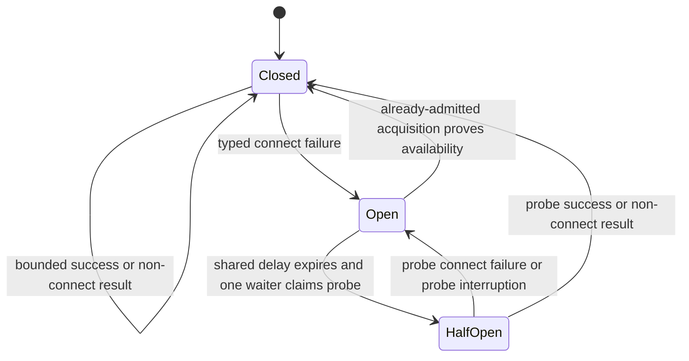

# Shared Watchman acquisition admission and circuit

## Purpose

Add one process-local acquisition coordinator to each Watchman registry. The
coordinator bounds expensive acquisition across distinct roots and turns typed
backend-connect failures into one shared retry schedule with one half-open
probe. It complements rather than replaces the root supervisor: each root still
owns demand, active generation, root-local retry, subscriptions, and release.

This work is limited to the selected Watchman adapter. It does not add
cross-process admission, daemon-side resource policy, automatic pruning,
Parcel fallback, Profile R, B3, VCS observation, daemon changes, or fresh-clock
recovery.

## Current source

`makeRegistry` creates one `RcMap` for all root intents but passes only the raw
factory, options, and metrics into each root connection
([`root.ts:65-93`](/packages/core/src/filesystem/watcher/watchman/root.ts#L65-L93)).
Every connection therefore creates clients independently and starts with an
immediate attempt. Its 100 ms through 2 s jittered retry is also independent
([`root.ts:280-299`](/packages/core/src/filesystem/watcher/watchman/root.ts#L280-L299)).

The per-root connection semaphore only single-flights acquisition for one root
([`root.ts:301-327`](/packages/core/src/filesystem/watcher/watchman/root.ts#L301-L327)).
The generation semaphore serializes commands only after a client exists
([`client.ts:57-65`](/packages/core/src/filesystem/watcher/watchman/client.ts#L57-L65),
[`client.ts:96-143`](/packages/core/src/filesystem/watcher/watchman/client.ts#L96-L143)).
Neither mechanism bounds aggregate client construction, capability checks, or
watch resolution.

Static backend policy is already correct: selected Watchman directories use the
root registry, exact files use Node, and no Watchman-to-Parcel failure edge
remains ([`backend.ts:7-25`](/packages/core/src/filesystem/watcher/watchman/backend.ts#L7-L25)).
The unified root supervisor already covers first and replacement acquisition
([`root.ts:280-336`](/packages/core/src/filesystem/watcher/watchman/root.ts#L280-L336)).

## Deep interface and ownership

Create one unexported coordinator in `makeRegistry` and pass it to every
`makeConnection`. Its interface is one operation:

```ts
acquire<A>(work: Effect<A, WatchmanError>): Effect<A, WatchmanError>
```

The operation admits the complete expensive root-acquisition effect: raw client
construction, capability negotiation, and `watch` route resolution. Callers do
not manipulate circuit state, probes, permits, or retry timing.

Ownership remains deliberately split:

| State | Owner | Clearing rule |
| --- | --- | --- |
| Admission permits and availability circuit | One Watchman registry | Registry scope closes |
| Active generation, per-root single flight, fatal decode latch, local backoff | One root connection | Existing root lifecycle |
| Generation command permit and command timeout | One generation | Generation closes |
| Subscription queue, cursor, stop signal | One subscription | Subscription release |

The coordinator is shared only by roots created from the same `makeRegistry`
call. Normal `Watcher.layer` composition makes that registry process-global for
that layer, but this design makes no cross-process protection claim.

## Invariants

1. At most `maxConcurrentAcquisitions` complete root-acquisition effects are in
   flight in one registry, including factory construction, capability check,
   and route resolution.
2. Waiting for the shared circuit or admission permit is interruptible and
   occurs before any generation command starts. It consumes none of the
   admitted command timeout.
3. The first typed `WatchmanError` with `stage === "connect"` opens the shared
   circuit. Already-admitted work stays bounded by the same permit limit.
4. While open, no root starts acquisition. After the one shared delay, exactly
   one waiting root becomes the half-open probe.
5. A failed connect probe reopens the circuit at the next capped exponential
   delay. A successful probe closes it. A non-connect result also closes it,
   because route or structural failure is not evidence of backend
   unavailability, and then follows root-local disposition.
6. Probe success wakes all retained waiters, but every waiter must still obtain
   an admission permit. Recovery cannot bypass the aggregate bound.
7. Route/watch policy failures, subscription-local errors, generation closure,
   and decode failures never open the shared availability circuit. Ambiguous
   non-connect failures remain root-local; no error prose selects policy.
8. Per-root jittered exponential retry remains for non-connect acquisition
   failures. Connect retry is consumed by the registry circuit and therefore
   has one schedule rather than one schedule per root.
9. Interruption removes a circuit or admission waiter. Interrupting the active
   probe reopens the circuit without manufacturing an acquisition. Final root
   demand release still interrupts the root-owned acquisition fiber, so no late
   gate, permit, callback, or probe result can recreate that root.
10. Static selection is unchanged: Watchman directories never invoke Parcel;
    exact files remain on Node; explicit Parcel and explicit disable remain
    unchanged.

## State machine



`Open` owns one interruptible delay gate and a retry index. `HalfOpen` owns one
probe identity and one change gate. Waiters observe gates but are not retained
as coordinator demand records. State transitions wake the old state's waiters;
they re-evaluate state atomically before admission.

An acquisition already admitted under `Closed` may complete after a sibling
opens the circuit. A full successful acquisition is current positive evidence
and may close the circuit. Stale failures cannot reopen a newer closed epoch;
the coordinator associates ordinary admissions and probes with state identity.

## Failure classification

| Failure | Shared circuit | Root behavior |
| --- | --- | --- |
| Factory throws, wrapped as `stage: connect` | Open/reopen | Park behind shared schedule |
| Capability transport/callback error, `stage: connect` | Open/reopen | Park behind shared schedule |
| Capability response decode failure, `stage: decode` | Never opens; closes half-open | Existing root fatal result |
| `watch` command rejection or route decode/policy error | Never opens; closes half-open | Existing root-local retry/fatal classification |
| Subscription route or subscribe failure | Never reaches coordinator | Existing subscription/root behavior |
| Generation closure or command timeout | Never opens unless already typed `connect` during capability | Existing generation/root recovery |

This is intentionally conservative under the current unstructured daemon
errors. F5's future `code/scope/recovery` vocabulary can refine classification,
but today only the typed client-local connect stage is backend-availability
evidence. Unknown and ambiguous errors are not promoted by message matching.

## Cancellation

- Admission uses Effect's interruptible semaphore wait and releases permits on
  every exit.
- Circuit waits are plain interruptible `Deferred.await` operations.
- A probe finalizer detects whether it still owns `HalfOpen`; interruption moves
  that state back to `Open` and wakes peers after the shared delay.
- The coordinator never forks acquisition work. Root scope remains the owner of
  the acquisition fiber, preserving final-demand cancellation.
- The open-state timer may outlive the root whose failure opened it, but it only
  completes a registry-local gate. It cannot construct a client or recreate an
  `RcMap` root.

## Configuration

Add `watchman.maxConcurrentAcquisitions`, a positive integer with default `4`.
Four permits cap cold-start and recovery work while allowing unrelated roots to
make progress when one route is slow. The setting is justified because one
fixed value cannot fit small local sessions and many-project servers, and the
bound itself is an operational contract rather than test-only machinery.

Do not add circuit-specific timing knobs. The shared circuit reuses existing
`retryBaseMs` and `retryCapMs` (defaults 100 ms and 2 s). Shared delays are
deterministic capped exponential delays; jitter remains on independent
root-local retries, where de-synchronizing unrelated root policy failures is
useful. Tests set the existing timing values and advance `TestClock`.

## Diagnostics

Extend the existing registry metrics event with one compact `acquisition`
object:

```ts
{
  limit,
  in_flight,
  admission_waiting,
  circuit_waiting,
  circuit_state,
  connect_failures,
  circuit_opens,
  half_open_probes,
  circuit_recoveries
}
```

The first four values and state are gauges; the rest are cumulative counters.
Emit structured logs only on circuit transitions (`open`, `half_open`,
`closed`) with retry index/delay where applicable. Do not restore any fallback
metric or log: there is still no fallback behavior.

## Recovery flow / un-back-off

### Client release and reset

After the full half-open acquisition succeeds (factory, capability check, and
watch/root resolution), closing the circuit completes the shared change gate.
Every retained root waiter re-evaluates `Closed`, but must still pass the
registry semaphore and its post-permit stale-state check
([`acquisition.ts:86-129`](/packages/core/src/filesystem/watcher/watchman/acquisition.ts#L86-L129),
[`acquisition.ts:131-196`](/packages/core/src/filesystem/watcher/watchman/acquisition.ts#L131-L196)).
The release is therefore at most four concurrent acquisitions by default (or
the configured positive limit), with immediate replacement as each permit
returns. There is no starts-per-second spacing or gradual ramp.

Shared backoff resets immediately when a probe, or an already-admitted sibling,
proves backend availability. A non-connect result also closes the availability
circuit rather than poisoning it. `Closed` retains no retry index, so the next
typed connect failure starts again at the base delay; there is no decay window
or retained failure score. Per-root non-connect backoff is separate: its retry
index survives circuit waits, but a successful root acquisition returns from
that recursive sequence; the next generation loss starts that root again at
attempt zero
([`root.ts:296-352`](/packages/core/src/filesystem/watcher/watchman/root.ts#L296-L352)).

### Daemon source facts

Inspected and built the local `watchwoman-systemd` working-copy revision
`780cb9190490`; it is an empty working commit over `46319f6ff529`, so both name
the same source tree used for the probe.

- The accept loop permits 256 active Unix connections and drops newly accepted
  streams above that limit. It spawns one task per admitted connection
  ([`server.rs:24-29`](file:///home/rektide/src/watchwoman-systemd/crates/watchwoman/src/daemon/server.rs#L24-L29),
  [`server.rs:70-101`](file:///home/rektide/src/watchwoman-systemd/crates/watchwoman/src/daemon/server.rs#L70-L101)).
- Commands are serial within one session because the reader awaits each
  dispatch before reading the next PDU. Across sessions, one global semaphore
  allows 32 blocking dispatches; waiting sessions are accepted but parked on
  that semaphore
  ([`server.rs:127-198`](file:///home/rektide/src/watchwoman-systemd/crates/watchwoman/src/daemon/server.rs#L127-L198)).
- `watch` registration performs metadata validation and a synchronous recursive
  initial scan inside the blocking dispatch, seeds the tree, inserts the root,
  then starts the native watcher
  ([`state.rs:199-262`](file:///home/rektide/src/watchwoman-systemd/crates/watchwoman/src/daemon/state.rs#L199-L262)).
  The crawl is depth-first filesystem work with an optional configured
  per-root entry cap; allow-all policy has no cap by default
  ([`watcher.rs:160-260`](file:///home/rektide/src/watchwoman-systemd/crates/watchwoman/src/daemon/watcher.rs#L160-L260),
  [`policy.rs:115-166`](file:///home/rektide/src/watchwoman-systemd/crates/watchwoman/src/daemon/policy.rs#L115-L166)).
- Native watcher construction uses another `spawn_blocking` task and blocks the
  registration response on a rendezvous until `notify::watch` returns. The
  runtime does not configure a Watchwoman-specific blocking-thread limit
  ([`watcher.rs:21-77`](file:///home/rektide/src/watchwoman-systemd/crates/watchwoman/src/daemon/watcher.rs#L21-L77),
  [`daemon.rs:33-40`](file:///home/rektide/src/watchwoman-systemd/crates/watchwoman/src/daemon.rs#L33-L40)).
- Root lookup uses `DashMap`, but registration's lookup-scan-insert sequence has
  no same-path single-flight gate. Concurrent first watches for one path can
  duplicate crawl and watcher setup before one insertion replaces the other;
  distinct cold roots can consume all 32 dispatch slots. This is an inference
  from [`state.rs:201-210`](file:///home/rektide/src/watchwoman-systemd/crates/watchwoman/src/daemon/state.rs#L201-L210)
  and
  [`state.rs:236-260`](file:///home/rektide/src/watchwoman-systemd/crates/watchwoman/src/daemon/state.rs#L236-L260).
- Outbound session buffering is bounded at 256 queued PDUs and 64 MiB by
  default (plus one exempt head PDU); overflow poisons and closes the session
  ([`session.rs:50-75`](file:///home/rektide/src/watchwoman-systemd/crates/watchwoman/src/daemon/session.rs#L50-L75),
  [`session.rs:238-310`](file:///home/rektide/src/watchwoman-systemd/crates/watchwoman/src/daemon/session.rs#L238-L310)).
  Root notify events and watcher commands still use unbounded channels
  ([`watcher.rs:29-30`](file:///home/rektide/src/watchwoman-systemd/crates/watchwoman/src/daemon/watcher.rs#L29-L30),
  [`state.rs:222-225`](file:///home/rektide/src/watchwoman-systemd/crates/watchwoman/src/daemon/state.rs#L222-L225));
  root tick fan-out uses a 256-entry broadcast ring whose lag path repairs by a
  full since-scan
  ([`root.rs:139-150`](file:///home/rektide/src/watchwoman-systemd/crates/watchwoman/src/daemon/root.rs#L139-L150),
  [`subscribe.rs:134-193`](file:///home/rektide/src/watchwoman-systemd/crates/watchwoman/src/commands/subscribe.rs#L134-L193)).

### Bounded live observation and inference

`.test-agent/watchman-recovery/probe.ts` built the source binary, created 16
isolated 200-file roots, attempted one client during 258 ms of delayed daemon
availability, then performed one complete probe before releasing the other
roots through four workers. The unavailable probe observed 19 refused connects;
its complete acquisition took 36.25 ms. The first four retained roots started
0.20-0.51 ms after probe success, each later root started immediately after a
worker completed, high-water concurrency was exactly four, and all 16 roots
appeared in `watch-list` after 312.06 ms. This was one bounded functional probe,
not a saturation benchmark; the retained output is
`.test-agent/watchman-recovery/result.json`.

For one normal OpenCode registry, four is below the daemon's 32-dispatch limit,
so this evidence does not justify an additional client rate limiter. It also
does not prove unlimited safety: there is no smoothing, cold crawls can be much
larger than the probe, and fast cheap completions can produce a high starts/sec
rate. More importantly, each OpenCode process owns an independent circuit and
four permits. `P` recovering processes can therefore offer up to `4P`
acquisitions and `P` half-open probes concurrently, while persistent root
clients also count toward the daemon's 256 active-connection ceiling. A
per-process ramp limiter would still multiply across processes. If measurements
show daemon saturation, the stronger next control is daemon-side cold-root
admission plus same-root single-flight (and then a measured global rate policy),
not another unmeasured client knob.

## Deterministic test matrix

Tests exercise the public `makeRegistry(...).subscribe(...)` seam in
`watchman-root.test.ts`; metrics shape stays in `watchman-metrics.test.ts`.

| Scenario | Deterministic control | Required assertion |
| --- | --- | --- |
| More roots than permits | Capability callbacks held by per-client `Deferred` barriers | Factory/capability/watch in-flight high-water mark never exceeds configured N |
| Many roots, connect outage | Factory attempt barriers plus `TestClock.adjust` | Initial work is bounded; each open interval admits exactly one half-open probe, not one retry per root |
| Probe succeeds with many waiters | Hold post-probe capability callbacks | Waiters resume only through admission; high-water mark remains N |
| Root watch policy failure | First client's `watch` callback returns an error; second is healthy | Second root establishes without advancing shared clock; circuit remains closed |
| Structural capability decode failure | First capability response is malformed; second is healthy | Failure remains typed/root-local; second root is not parked by a circuit |
| Cancel while admission-queued | Hold all permits, interrupt queued root, then release | Canceled root never constructs a client |
| Cancel while circuit-open | Throw once, interrupt final demand, advance multiple intervals | No later probe/acquisition occurs for the canceled root |
| Metrics | Read registry event at barriers and transitions | Gauges/state/counters reflect admission, open, half-open, and recovery without fallback fields |

No fixed sleep is a proof gate. `Deferred`, fiber interruption/join, callback
controls, scheduler yield, and `TestClock` establish every ordering.

## Verification

Run from `packages/core`:

```sh
bun test test/filesystem/watchman-root.test.ts
bun test test/filesystem/watchman-metrics.test.ts
bun test test/filesystem/watchman-root.test.ts \
  test/filesystem/watcher.test.ts \
  test/filesystem/watcher-interests.test.ts \
  test/filesystem/watchman-metrics.test.ts
bun typecheck
```

Use the repository formatter/linter only if a relevant package command exists;
do not run the repository-root test command.

## Commit ladder

1. `docs(watchman): specify shared acquisition coordination` - this document
   only.
2. `test(core): pin shared Watchman acquisition pressure` - failing registry
   tests for admission, one probe schedule, bounded recovery, classification,
   and cancellation.
3. `feat(core): coordinate Watchman root acquisition` - coordinator module,
   registry integration, and positive-integer configuration.
4. `feat(core): report shared Watchman acquisition state` - compact metrics and
   transition logging plus metrics tests.
5. `fix(core): harden Watchman acquisition races` - only if self-review finds
   interruption, stale-transition, aggregate-rate, or poisoning defects.

## Cross-references

- [`static-selection-handoff0.unknown.md`](/.design/watchman/static-selection-handoff0.unknown.md)
  fixes the current scope: preserve the root supervisor and strict backend
  selection, and do not pull broader observation programs forward.
- [`review-simplification0.gpt56s.md`](/.design/watchman/review-simplification0.gpt56s.md)
  defines the root-level state machine and phase-independent local failure
  dispositions that this registry-level coordinator must not replace.
- [`contract0.glm53max.md`](/.design/watchman/contract0.glm53max.md) supplies the
  future F5 vocabulary and state-ownership distinctions. Its DS-B/DS-C choices
  remain undecided and are not implemented here; this circuit is a transient
  client-side backend-availability mechanism, not terminal suppression or a
  daemon environment-capacity circuit.
