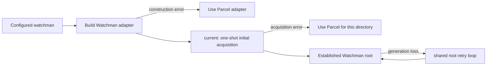
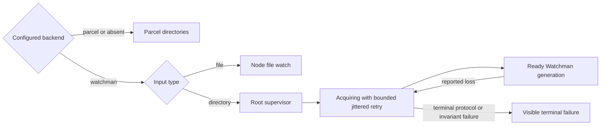

# Watchman static-selection handoff

## Mission

Finish the root-scoped Watchman control architecture by making configured
directory-backend selection static:

> When `watchman` is selected, directory interests remain on Watchman through
> acquisition and recovery. They never silently migrate to Parcel because of
> timing or failure. Files remain deliberately on Node. Parcel remains an
> explicit alternative selected before startup.

This is the immediate work. It is not a greenfield watcher rewrite, the VCS
feature, Profile R, a Watchwoman filter project, or the future clean carrier.

## The call

The repository already contains most of the controller structure needed for
this change. Complete that structure rather than parking static selection or
starting another architecture wave.

The accepted order is recorded in
[`vision0.gpt56s.md`, lines 907-923](/.design/watchman/vision0.gpt56s.md#L907-L923):

1. Contract-failure tests.
2. One root supervisor for initial and replacement acquisition.
3. Strict backend selection and deletion of both Watchman-to-Parcel fallbacks.
4. Fresh-clock recovery with explicit invalidation.
5. Metrics and option trimming.
6. A clean carrier rebuilt from the proven final behavior.

This handoff focuses on steps 1 through 3. Do not pull later work forward.

## Current workspace

- Repository: `/home/rektide/src/opencode-watchman`
- Corpus index: [`.design/watchman/README.md`](/.design/watchman/README.md)
- Implemented-line record:
  [`maintenance.glm53.md`](/.design/watchman/maintenance.glm53.md)
- Working copy contains an unrelated uncommitted
  `.design/watchman/contract0.glm53max.md`; do not modify or commit it with this
  work.
- The sibling `vcs-core` workspace contains one optional owner-lifecycle commit,
  `1a5b9d5e`. It is not on this line and is not a prerequisite for static
  selection.

## What is already built

The controllers are services and closures rather than classes named
`Controller`.

| Layer | Existing responsibility | Source |
| --- | --- | --- |
| Owner-local plan controller | `WatchInterests` owns an owner's desired inputs, starts additions before removals, and owns watch fibers. | [`watcher/interests.ts`](/packages/core/src/filesystem/watcher/interests.ts#L22-L81) |
| Process-global physical registry | `Watcher` structurally deduplicates physical interests with `RcMap` and releases them after the last consumer. | [`watcher.ts`](/packages/core/src/filesystem/watcher.ts#L117-L192) |
| Root-intent registry | One `RcMap` entry owns each project or exact Watchman route intent. | [`watchman/root.ts`](/packages/core/src/filesystem/watcher/watchman/root.ts#L65-L93) |
| Root connection controller | `makeConnection` owns active/fatal/recovering state, generation identity, command serialization, subscriptions, and teardown. | [`watchman/root.ts`](/packages/core/src/filesystem/watcher/watchman/root.ts#L95-L176) |
| Shared post-ack recovery | `replacement`, `recoverRoot`, and `reconnect` share one retry sequence across subscriptions on a root. | [`watchman/root.ts`](/packages/core/src/filesystem/watcher/watchman/root.ts#L290-L351) |
| Explicit configuration | The public options already distinguish `watchman` from `parcel`. | [`watcher.ts`](/packages/core/src/filesystem/watcher.ts#L68-L84) |

The architecture therefore does not need a new process-global migration
controller. It needs the existing root controller to own first acquisition as
well as recovery.

## The exact unfinished seam

Initial acquisition and established recovery currently take different paths:



The two fallback sites are:

1. Whole-adapter construction fallback in
   [`watcher.ts`, lines 104-115](/packages/core/src/filesystem/watcher.ts#L104-L115).
2. Per-directory initial-acquisition fallback in
   [`watchman/backend.ts`, lines 17-31](/packages/core/src/filesystem/watcher/watchman/backend.ts#L17-L31).

The split inside the root controller is:

- `current()` performs one-shot first acquisition at
  [`root.ts`, lines 178-195](/packages/core/src/filesystem/watcher/watchman/root.ts#L178-L195).
- `recoverRoot()` / `replacement()` / `reconnect()` retry only after an
  established generation is lost at
  [`root.ts`, lines 290-351](/packages/core/src/filesystem/watcher/watchman/root.ts#L290-L351).

This acknowledgement-dependent split creates the acquisition cliff. The same
root failure can select Parcel before the first acknowledgement but retry
Watchman forever afterward.

## Target state



There is deliberately no edge from the Watchman root supervisor to Parcel.
Rollback means selecting `parcel` and restarting.

## Policy to pin in tests

| Selected mode and event | Required result |
| --- | --- |
| `parcel`, directory | Use Parcel. |
| `watchman`, file | Use Node; this is a static type partition, not fallback. |
| `watchman`, transient initial daemon unavailability | Keep acquisition pending and retry with bounded jitter. Never call Parcel. |
| `watchman`, transient established-generation loss | Reuse the same root acquisition loop. Never call Parcel. |
| `watchman`, multiple interests on one root | Run one root retry sequence and reattach every retained interest. |
| `watchman`, subscription-local invalid target | Fail that interest visibly without changing adapters. |
| `watchman`, terminal protocol/invariant failure | End the affected scope visibly without changing adapters. |
| Owner removes demand during acquisition or outage | Stop retry demand and never resurrect the removed subscription. |
| Explicit observation disable | Preserve the existing deliberately quiescent behavior. |

Exact terminal scopes should be pinned by tests rather than inferred from the
current mutable `fatal` state.

## Implementation sequence

### 1. Pin strict-selection behavior

Suggested commit: `test(core): pin strict Watchman selection`

Add deterministic tests before deleting either catch:

- A selected Watchman directory never invokes the injected Parcel native on an
  initial connection, command, route, subscribe, or timeout failure.
- Initial unavailability remains pending and retries.
- Two interests sharing a root observe one acquisition attempt sequence.
- Removing the last interest interrupts pending acquisition and prevents late
  resurrection.
- A selected Watchman file still invokes Node.
- Explicit `parcel` selection still invokes Parcel.
- Terminal errors end visibly rather than hanging or switching adapters.

Extend the existing suites rather than creating a new test framework:

- `packages/core/test/filesystem/watcher.test.ts`
- `packages/core/test/filesystem/watchman-root.test.ts`
- `packages/core/test/filesystem/watcher-interests.test.ts`
- `packages/core/test/filesystem/watchman-metrics.test.ts`

The current tests already cover pending-acquisition interruption, final-consumer
release, one post-ack retry sequence per root, and removal during outage. Reuse
their `Deferred`-based synchronization; do not add fixed sleeps as proof gates.

### 2. Unify root acquisition

Suggested commit: `refactor(core): unify Watchman root acquisition`

Refactor `makeConnection` so first acquisition and replacement acquisition call
one operation and share one in-flight result per root intent.

Required properties:

- `Acquiring` covers both first contact and recovery.
- Retry classification does not depend on whether a subscription acknowledged.
- One root owns backoff, retries, active generation, and terminal disposition.
- Retained demand keeps acquisition alive.
- Releasing the last demand interrupts or makes late completion inert.
- A terminal result is visible and has explicit clearing semantics.
- Subscription-local failures do not poison sibling interests unnecessarily.

The simplification review's small-state-machine section is the primary design
reference:
[`review-simplification0.gpt56s.md`, lines 98-153](/.design/watchman/review-simplification0.gpt56s.md#L98-L153).

The smallest likely move is to make the existing `replacement()` machinery
serve initial acquisition too, then remove duplicated one-shot policy from
`current()`. Treat that as a hypothesis to prove with the tests, not a required
function-level design.

### 3. Enforce static selection

Suggested commit: `fix(core): enforce static Watchman selection`

After the supervisor tests are green:

1. Remove whole-adapter fallback from `watcher.ts`.
2. Remove per-directory acquisition fallback from `watchman/backend.ts`.
3. Retain the `input.type === "file"` Node branch.
4. Remove fallback-only metrics and warning text.
5. Ensure transport-load and terminal protocol failures are visible rather than
   represented as Parcel availability.
6. Add a direct assertion that Parcel was never called for every selected
   Watchman-directory failure case.

Do not delete fallback first. Without shared initial acquisition, strict
selection converts ordinary startup unavailability into a visible failure
instead of the intended pending/retrying state.

## Verification

Run from `packages/core`:

```sh
bun typecheck
bun test test/filesystem/watchman-root.test.ts \
  test/filesystem/watcher.test.ts \
  test/filesystem/watcher-interests.test.ts \
  test/filesystem/watchman-metrics.test.ts
```

When a compatible daemon is available:

```sh
OPENCODE_WATCHMAN_LIVE=1 bun test test/filesystem/watchman-live.test.ts
```

Do not run the repository-root `test` script; it deliberately exits with an
error.

## Definition of done

- No selected Watchman directory can reach Parcel through construction,
  initial acquisition, timeout, reconnect, cancellation, or terminal failure.
- Initial and replacement acquisition share one root-owned retry state machine.
- Multiple interests on a root share one acquisition/recovery sequence.
- Files remain on Node under every directory-backend selection.
- Explicit Parcel selection and explicit observation disable still work.
- Last-demand release cannot resurrect an acquisition or subscription.
- Failure disposition is visible and independent of acknowledgement timing.
- Fallback-only metrics and logs are gone.
- Focused tests and Core typecheck pass.

## Minimum reading set

Read only these before coding:

1. The accepted sequence in
   [`vision0.gpt56s.md`, lines 883-929](/.design/watchman/vision0.gpt56s.md#L883-L929).
2. The strict-selection policy and root state machine in
   [`review-simplification0.gpt56s.md`, lines 50-169](/.design/watchman/review-simplification0.gpt56s.md#L50-L169).
3. The verified failure matrix in
   [`review-failure-paths0.gpt56s.md`](/.design/watchman/review-failure-paths0.gpt56s.md).
4. The implemented runtime record in
   [`maintenance.glm53.md`](/.design/watchman/maintenance.glm53.md).
5. The four source files linked under "What is already built" and "The exact
   unfinished seam" above.

Use
[`rebuild-assessment0.gpt56solxh.md`](/.design/watchman/rebuild-assessment0.gpt56solxh.md)
to keep optional programs separated. Do not read its recommendation to park
Profile R, VCS, B3, G5, and the clean carrier as a recommendation to park static
selection. Its own narrow correction kernel includes static selection and one
root acquisition state machine.

The maintenance follow-up suggesting direct publication of subscribe-response
rows predates the accepted fresh-clock direction. Preserve that scenario as a
regression test; do not implement row replay as the destination.

## Guardrails for the next agent

- Do not start another design or corpus-review wave.
- Do not build a Watchman/Parcel migration bridge.
- Do not import VCS, `ViewFilter`, Profile R, G5, or clean-carrier requirements.
- Do not promote B3; B2 remains the recorded boundary.
- Do not transplant the `vcs-core` lifecycle commit unless a concrete test
  proves it is needed for static selection.
- Do not modify or commit the existing uncommitted `contract0` file.
- Do not delete fallback before initial and replacement acquisition share one
  supervisor.
- Commit tests, controller unification, and fallback deletion separately.

## Suggested skills

- `tdd`: drive the failure matrix from deterministic tests before refactoring.
- `effect`: preserve Effect v4 scope, interruption, `RcMap`, `Deferred`, and
  fiber semantics.
- `diagnosing-bugs`: use only if a failure case cannot be reproduced
  deterministically.
- `implement`: use after the tests and policy above are accepted as the task
  specification.

# Addendum: Maybe someday

The deeper architecture remains valuable, but it is not needed to finish static
selection. Keep these ideas as named reopening points rather than implicit
requirements on the current work.

## Owner-facing lifecycle

The sibling `vcs-core` commit `1a5b9d5e` extends `WatchInterests` with explicit
`ready`, `change`, `invalidation`, and `failure` signals plus terminal
suppression. This is useful when owners need lifecycle truth instead of
fabricated root-path updates.

Reopen it when static selection is stable and the fresh-clock/invalidation step
begins, or when a second owner demonstrably needs lifecycle facts. Review its
B2 compatibility, terminal clearing, and deterministic test synchronization
before transplanting it.

## Generic `WatchSet`

The proposed `WatchSet` generalizes owner-local `WatchInterests` into a reusable
complete-plan reconciler for Config, Skill, VCS, and future owners. It would
retain demand handles, attribute terminal failures, isolate siblings, and keep
domain policy with owners.

Reopen it only when more than one owner needs the same complete-plan and
lifecycle contract. Static selection can be completed with the controllers
already present.

## B3 watcher-level invalidation

B2 keeps typed invalidation at `Config.changes`; exact watcher updates remain
exact. B3 would add invalidation to the shared `Watcher.Update` union.

Reopen B3 only through a new human decision when one of the recorded triggers
occurs: generic physical recovery lands, a second non-Config owner needs native
invalidation, or an upstream watcher API is being prepared.

## Profile R and assurance leases

Profile R names a larger guarantee: truthful root epochs, complete reported-loss
handling, owner convergence, and deterministic cross-repository proof. G5 adds
a bounded Config freshness lease for silent observer loss. G6-G8 explore more
owner leases, active probes, and structural daemon audits.

Reopen this program only after static selection and current-line recovery are
deterministic, a concrete owner set is chosen, and product demand justifies the
cross-repository assurance cost.

## Reactive VCS observation

The corrected VCS design separates Core exact interests from optional
Watchwoman broad-root filtering. The `vcs-core` composition and one lifecycle
commit exist, but provider observation and product consumers do not.

Reopen this lane only when live Git, Mercurial, and Jujutsu UI convergence is an
explicit product requirement. Continue from the specification plus its
normative completion audit, never the original specification alone.

## Watchwoman truthful roots, config, and filtering

Watchwoman has dormant strict-config code and designs for immutable generations,
ordered `ViewFilter`, and fresh Linux lifecycle. Newer daemon direction correctly
puts watcher-first acquisition, atomic tree/clock publication, and visible loss
ahead of config/filter activation.

Reopen each as its own daemon product decision:

- Truthful root lifecycle when Watchwoman itself must make stronger observation
  claims.
- Config generations when runtime policy reload is required.
- `ViewFilter` when broad-root daemon clients need selected VCS visibility.
- Fresh production lifecycle when replacing the deployed historical daemon is
  an active deployment goal.

Core exact Watchman selection does not require broad-root filtering.

## Clean carrier

The final carrier should be re-authored from behavior proven on the current
line, not assembled from the historical patch sequence. Preserve upstream
`ConfigWatch.plan`, `entries`, and readiness outcomes; do not treat the proposed
`WatchSet` module shape as accepted authority.

Reopen carrier construction only after the current-line behavior selected for
retention is complete and green.

## Watchment

Watchment is separate multi-source filesystem-state research. Its concepts may
eventually inform observation systems, but it is not this feature, its plugin,
or a prerequisite for static selection.

## Reopening map

| Trigger | Reopen |
| --- | --- |
| Static selection is green and recovery needs explicit owner facts | Owner lifecycle signals and the fresh-clock step |
| A second owner needs complete-plan lifecycle semantics | Generic `WatchSet` |
| A second non-Config owner needs typed invalidation | Human B3 decision |
| Live VCS convergence is selected as a product outcome | Core VCS lane |
| Broad-root daemon consumers need selected metadata | Watchwoman `ViewFilter` lane |
| The historical daemon must be replaced | Fresh lifecycle and Compfuzor deployment |
| Product reliability requires cross-repository assurance claims | Profile R, then measured G5/G6-G8 decisions |
| A reusable multi-source filesystem service is independently wanted | Watchment project |
