# Watchman resilience through deadline and failure-boundary separation (`timeout0`)

## What's up

The GLM timeout wave correctly identified a severe Watchman failure mode: all
commands share one serialized client connection, and each caller's ten-second
timer starts before its command reaches the wire. One slow cold-root crawl can
therefore expire a cohort of queued callers, retire the shared generation, and
push many interests to Parcel at once.

The same run also returned hundreds of model-readiness 503s, but the draft
overstates the connection between those observations. Config-skill watcher
streams are forked through `FiberMap.run`; native Watchman acquisition is not
directly awaited by plugin activation. Watchman churn can compete with plugin
loading and cookie events can trigger later full skill rescans, but current
source and logs do not prove that a slow Watchman acknowledgement held the
`PluginSupervisor` ready latch.

That diagnosis needs three corrections before it becomes an implementation
plan:

1. A command that has reached Watchman's FIFO cannot simply time out locally and
   leave the generation live. The protocol has no request IDs or cancellation;
   the command remains at the head until its response arrives. A liveness probe
   on the same connection cannot overtake it, and an `N`-timeout threshold counts
   queued victims of one slow command as independent failures.
2. The observed 20-second `clock` calls and cookie files do not come from
   OpenCode's `clock` command. OpenCode sends `['clock', root]` with no
   `sync_timeout`. Watchman's once-per-minute internal sanity thread sends
   `sync_timeout: 20000` for every root. The incident's cookie-triggered skill
   reloads are directly correlated with the Parcel/inotify fallback, while
   Watchman itself removes its own cookies from its view.
3. Watcher acquisition is started during config-skill activation but runs in a
   child fiber. The initial skill scan and the rest of sequential plugin loading
   remain on the readiness path; Watchman's direct role in the model 503s is an
   open causal question, not a confirmed fact.

The design should keep three deadlines separate. The Watchman client currently
conflates admission and execution; product readiness is an adjacent deadline
that needs its own evidence:

| Deadline | What it protects | Expiry meaning | Correct action |
| --- | --- | --- | --- |
| Product readiness | A model request should not wait forever for plugin state | The requested projection is not ready | Return explicit initializing status; do not alter watcher transport |
| Command admission | A caller should not wait forever behind the local FIFO | The process-local Watchman path is overloaded | Fall back or retry that interest; no command was sent, so do not retire |
| Command response | A submitted request should not occupy the protocol head forever | Protocol synchronization is now unknown | Retire/quarantine that generation; do not restart the daemon |

The concrete Watchman work is admission-aware timing, path-local error handling,
collateral retry, and backend-neutral cookie suppression. The catalog path
first needs per-plugin timing and a controlled backend comparison; it should not
be redesigned around a blocking watcher acknowledgement that source inspection
shows is already forked.

## Incident boundary

This wave does not replace the systemd/version-election diagnosis. It narrows a
second failure path that occurred on one stable server:

| Evidence from run `84d0de5c` | Observation |
| --- | --- |
| Server | New build, systemd endpoint `49374`, ready at `05:32:46Z` |
| Registration displacement | None logged for the run |
| Watchman connections | Generations 1, 2, 4, and 5 connected; generation 3 timed out during capability check |
| Model failures | 496 `/api/model` 503 responses, `05:33:12Z` through `05:39:26Z` |
| Acquisition fallout | 40 `watchman acquisition failed; using parcel watcher` warnings |
| First cold root | `~/.config/opencode`: 9.46-second full crawl, 9.55-second `watch` command |
| First retirement | `command timed out: watch-project` at `05:33:15Z` |
| Cookie reloads in this run | 74 `skills rescanned` lines naming `.watchman-cookie-*` |

The sampled 01:30-02:00 local journal has nine timeout retirements across two
OpenCode server runs: five `watch-project`, two `subscribe`, one `watch`, and one
capability check. This is generation churn while the daemon remains alive and
answers healthchecks, not evidence that systemd restarted Watchman during the
captured interval.

The causal boundary is therefore:

- Mixed-version registration replacement explains interrupted whole-server
  provider/model requests in other windows.
- Watchman queueing explains generation churn, burst fallback, and subsequent
  cookie-driven rescan load on an otherwise ready, undisplaced server.
- The same run's sustained model 503s prove that location plugin activation
  missed its readiness deadline, but do not yet prove Watchman was the direct
  blocker.
- Watchman did not create the port/version election.
- Watchman's historical poison, crash, and restart incidents remain real but
  are not needed to explain run `84d0de5c`.

## Causal model

```mermaid
flowchart LR
    ModelRequest[Model list request] --> Readiness[PluginSupervisor flush, 5s]
    Readiness --> Activation[Location plugin activation]
    Activation --> SkillRefresh[Config-skill initial refresh]
    SkillRefresh --> SkillScan[Skill source scan and parse]
    SkillScan --> PluginWork[Remaining sequential plugin work]
    PluginWork -->|deadline first| Model503[Model catalog 503]
    SkillRefresh -. forks .-> WatchAcquire[Asynchronous watcher acquisition]
    WatchAcquire --> CallerTimers[10s timers start per caller]
    CallerTimers --> ClientFifo[One fb-watchman-esm FIFO]
    ColdRoot[Cold root crawl] --> ClientFifo
    ClientFifo --> QueueExpiry[Queued callers expire before dispatch]
    QueueExpiry --> Retire[Retire shared generation]
    Retire --> Cancel[Current and queued callbacks fail]
    Cancel --> Parcel[Many interests fall back to Parcel]
    Parcel --> RawCookies[Raw inotify sees Watchman sanity cookies]
    RawCookies --> FullRescan[Skill refresh clears and rebuilds watches]
    FullRescan --> SkillScan
    FullRescan --> WatchAcquire
    WatchAcquire -. concurrent load, unquantified .-> PluginWork
```



The first cookie rescan in run `84d0de5c` occurred after the initial model 503
and after `.claude/skills` logged a Watchman acquisition failure followed by
`backend=inotify`. Cookie reload is an amplifier, not the initiating event. The
solid arrows above are source-proven waits or event flow; the dotted load edge
is the remaining hypothesis that needs measurement.

## Review of the GLM wave

[`timeout0.glm53.md`](timeout0.glm53.md) is strong forensic work. It found the
right shared-generation blast radius, the hidden FIFO, the blanket
`establish.tapError(retire)`, the first-acquisition-only fallback boundary, the
route-cache churn, the five-second model gate, and the logging gap. Its proposed
directions become clearer when divided into retained, revised, and deferred
parts.

| GLM direction | Assessment | This design |
| --- | --- | --- |
| Bound acquisition pressure | Retain | Put admission in front of the raw FIFO and measure queue wait separately from execution |
| Give route creation a different budget | Retain with correction | Stage budgets matter only after local admission, when the raw command is submitted |
| Do not retire on daemon policy responses | Retain | A completed error response preserves protocol synchronization and is path-local |
| Fail one timed-out command and keep the generation | Reject as stated | An outstanding FIFO command is not cancellable; quarantine or retire when the active command's response deadline expires |
| Retire after `N` consecutive timeouts | Reject | A burst of queue-resident callers makes `N` a count of collateral victims, not independent liveness evidence |
| Align OpenCode with the daemon's 20-second clock budget | Reject | The 20-second calls are the daemon sanity thread; OpenCode's clock is instantaneous and has no sync option |
| Filter `.watchman-cookie-*` in Watchman expressions | Revise | The proven path is Parcel/inotify; filter at the config-skill consumer or another backend-neutral boundary |
| Cache policy rejections | Defer | The retained Parcel entry already suppresses reacquisition for its RcMap lifetime; a marker can appear later, making a negative cache stale |
| Retry before first fallback | Narrow | Retry collateral generation closure; keep immediate fallback for path policy rejection and unavailable daemon |
| Make retirement observable | Retain | Record admission, execution, generation, and fallback as separate signals |
| Coordinate with plugin readiness | Correct the premise, then measure | Watch establishment is already forked; instrument plugin activation before changing readiness semantics |

## Source corrections

### Watcher acquisition is already forked

`ConfigSkillPlugin.watch` obtains a lazy update stream from
[`Watcher.subscribe`](/packages/core/src/filesystem/watcher.ts), then passes its
consumer to `FiberMap.run` with `startImmediately`. `Watcher.subscribe` returns a
`Stream.unwrap`; the native `RcMap.get` and Watchman acquisition occur when that
stream fiber runs. Effect's inspected `FiberMap.run` implementation calls
`runForkWith(...)` and immediately returns the child `Fiber`.

Consequently, initial plugin activation does not join the Watchman command or
the Parcel subscription promise. It does still synchronously scan and parse
every configured skill source after starting those child fibers, while
`Plugin.activate` loads all plugin definitions sequentially. Watchman activity
can overlap and contend with that work, and cookie events later invoke another
full `refresh`, but "the command took ten seconds, therefore plugin flush waited
ten seconds" is not a valid source-level inference.

This distinction changes the readiness recommendation. Add timing around
`Plugin.load`, config-skill source scans, and the ready latch, then run the same
cold Locations with Watchman, Parcel, and watching disabled. A never-answering
fake Watchman client should also be able to prove whether any hidden join remains.

### The timeout includes queue residence

`client.command(...)` immediately appends to the fork's `commands` array, but
[`sendNextCommand`](https://www.npmjs.com/package/@superbfowle/fb-watchman-esm)
sends only when `currentCommand` is empty. OpenCode wraps the call in
`Effect.timeoutOrElse` at
[`client.ts:75-104`](/packages/core/src/filesystem/watchman/client.ts). The
Effect timer therefore starts when the command is appended, not when
`socket.write` dispatches it. It ends when the callback responds; schema decode
runs afterward and is not part of this timeout.

This produces false execution timeouts. If eight calls enter together behind a
9.5-second cold crawl, all eight have spent almost their full budget before the
second command can run. Increasing the flat timeout merely moves the cliff.

### An active-command timeout is not path-local

The fork matches each non-unilateral response to `currentCommand`, clears it,
then sends the next command. There is no request identifier and no remove-one
operation. `end()` is the only available operation that cancels the current and
queued callbacks.

Keeping the generation after a timeout creates two bad choices:

- Continue accepting work: new commands remain behind the timed-out protocol
  head and start another timeout wave.
- Stop accepting work but wait for drain: a genuinely stuck head can quarantine
  the only connection forever, and same-connection liveness probes cannot run.

Retirement is therefore correct for a command whose execution deadline expires.
What is wrong today is starting that deadline during queue residence and making
all collateral generation closures permanent Parcel fallbacks.

### A daemon error response is path-local

The fork receives Watchman's `{ error: ... }` response in the expected FIFO
slot and invokes that command's callback. The stream remains synchronized. A
`RootResolveError` or `CommandValidationError` under `enforce_root_files` says
that one requested root is not allowed; it says nothing about sibling paths or
the socket.

Today [`native.ts:63-130`](/packages/core/src/filesystem/watchman/native.ts)
retires the generation for every failure that escapes route/clock/subscribe
establishment, including decode and policy failures. That blanket is the direct
policy-poison bug. The
`.watch` marker added under `~/.config/opencode` shortly after the earlier
rejection also demonstrates why a long-lived negative policy cache would be
wrong without invalidation.

### The 20-second clock is not OpenCode's clock

OpenCode sends `['clock', route.root]` at
[`native.ts:69-71`](/packages/core/src/filesystem/watchman/native.ts). Watchman
documents that a clock without `sync_timeout` returns the current logical clock
without cookie synchronization. The inspected daemon's
[`SanityCheck.cpp`](https://github.com/facebook/watchman/blob/20966cdb78072eddc70f1e9704454f0e39038a64/watchman/SanityCheck.cpp#L154-L226)
runs once per minute, enumerates every root, and sends each one a clock with
`sync_timeout: 20000`.

Those sanity calls can add daemon and filesystem load, but they are not a
20-second server budget that OpenCode should mirror. Adding `sync_timeout` to
OpenCode would create more cookie work and stronger synchronization than the
subscription bootstrap currently asks for.

### The cookie path is backend-crossing

Watchman intentionally removes its own cookie-prefix paths before they enter
the root view; see
[`root/iothread.cpp:383-419`](https://github.com/facebook/watchman/blob/20966cdb78072eddc70f1e9704454f0e39038a64/watchman/root/iothread.cpp#L383-L419).
The source does permit cookies from another daemon or nested watch to look like
ordinary filesystem changes, but that is not needed for this incident.

The direct sequence for `.claude/skills` is:

```text
05:34:25.482  Watchman acquisition failed; using parcel watcher
05:34:25.495  watcher started backend=inotify
05:34:40.724  skills rescanned file=.../.watchman-cookie-...-1810298-0
```

Parcel correctly reports raw filesystem activity, including a cookie created
by watchman-main synchronization. The daemon PID and once-per-minute sanity
implementation make the sanity thread the strongest attribution, but the cookie
name alone does not encode the initiating client. A Watchman subscription
expression cannot fix that path. The domain consumer should ignore known
synchronization artifacts regardless of backend.

## Recommended design

### 1. Measure readiness without assuming a watcher join

Keep the model 503 investigation adjacent to, but distinct from, Watchman
transport hardening. Add timing around:

- ready-latch close, activation start, activation completion, and latch open;
- every `Plugin.load`, identified by bounded plugin ID;
- config-skill refresh split into source resolution, filesystem scan, parse,
  watcher-fiber start, and skill transform;
- concurrent Watchman admission depth, execution, retirement, and fallback.

Then run the same cold Location set with `watchman`, `parcel`, and watching
disabled. A deterministic test should give the Watchman client a command that
never answers and assert that config-skill's initial transform and
`PluginSupervisor.flush` still complete when all ordinary scan/plugin work is
fast. If that test fails, it identifies a hidden join worth fixing. If it
passes, the 503 root lies in synchronous plugin work or indirect resource
contention, not watcher acknowledgement.

Do not prescribe a post-ack refresh or move work between scopes in this timeout
wave. The current watcher is already a scoped child fiber, and changing its
scan-to-subscribe ordering introduces a separate missed-event correctness
problem. Measure that race independently if it becomes a target.

### 2. Filter synchronization artifacts at the domain boundary

Before a config-skill watcher publishes into the sliding `changes` PubSub, drop
paths whose basename matches Watchman's full cookie shape
`.watchman-cookie-<host>-<pid>-<serial>`. Put this in `ConfigSkillPlugin`, not
only in a Watchman expression:

- It covers Watchman, Parcel, inotify, and node fallback.
- A synchronization cookie can never add, remove, or change a skill.
- It avoids changing the generic Watcher contract for unrelated consumers.
- It stops one cookie event from clearing every skill watch and reloading the
  entire skill registry in every affected Location.
- Filtering before the capacity-one sliding PubSub prevents a cookie from
  evicting a legitimate pending skill event before downstream filtering.

Match the terminal numeric PID and serial fields rather than suppressing every
user-created name with the prefix. Do not broaden this first fix into
speculative filtering of `.watchmanconfig` or every non-Markdown path. Directory
creation, symlink changes, and missing source ancestors still matter to
discovery.

### 3. Put an admission gate before the raw FIFO

Add a command gate to each `Generation`. Every command follows two stages:

1. Await the gate with an optional admission deadline. No raw command has been
   submitted yet.
2. Once admitted, verify the generation is still open, submit exactly one raw
   command, and start the command-class response deadline.

This keeps the fork's internal queue empty except for the one active command.
Queue wait no longer consumes the response budget. If admission expires, fail
that interest without retiring the generation because no raw command was
submitted. If the active command's response deadline expires, retire the
generation because FIFO synchronization is unknown.

The raw interface exposes `command(callback)`, not a dispatch notification. For
an active generation with an idle raw client, submission normally reaches
`socket.write` synchronously, but the adapter cannot prove the exact wire time.
The minimal design is therefore local-queue-excluding and submission-aware. A
literal dispatch-anchored deadline requires a small hook in
`fb-watchman-esm.sendNextCommand`.

Waiters must race gate acquisition with `generation.closed`. After retirement,
they should receive a typed collateral closure without touching the ended raw
client. The existing manager lock only serializes generation creation; it does
not currently provide this command admission boundary.

Use named response budgets by stage rather than one flat constant:

| Stage | Relevant work | Policy |
| --- | --- | --- |
| Capability | One handshake before a generation is published | Short transport/protocol deadline |
| Route (`watch`, `watch-project`) | May include a cold recursive crawl | Dedicated cold-root deadline based on measured crawl latency |
| Clock | Instantaneous logical clock; no `sync_timeout` | Short protocol deadline |
| Subscribe | Initial query and subscription acknowledgement | Separate subscription deadline |
| Unsubscribe | Best-effort lifecycle cleanup | Bounded cleanup deadline; never block shutdown indefinitely |

The exact route and subscribe durations remain configuration decisions. The
important invariant is that they start after local admission at raw submission
and are not reused as queue deadlines.

### 4. Retire only for generation-level conditions

Replace the blanket `establish.tapError(retire)` with an explicit taxonomy:

| Condition | Protocol state | Scope | Action |
| --- | --- | --- | --- |
| Classified root-policy response | Synchronized | Requested path | Initial acquisition may fall back; reconnect must fail visibly or perform an explicit handoff; keep generation |
| Unsupported response/schema | Response consumed | Backend compatibility | Fail visibly; disable or alert as appropriate, without reconnect churn |
| Admission deadline | Command not sent | Requested interest | Retry or fall back; keep generation |
| Socket `error`/`end` | Unusable | Generation | Retire once |
| Active-command response deadline | Unknown response position | Generation | Retire once |
| Capability failure during create | Generation never became usable | Candidate generation | Close candidate; report connect failure |
| Subscription cancellation PDU | Subscription identified | Subscription/root | Re-establish that subscription first; do not automatically poison siblings |

`retire` must be idempotent, but idempotence should suppress duplicate work and
duplicate metrics as well as duplicate `client.end()` calls.

### 5. Retry collateral closure, not every failure

Initial acquisition currently catches every expected `WatchmanError` and
returns a Parcel subscription for that retained watcher entry. Narrow that
boundary:

- A policy rejection for this path falls back immediately.
- An unavailable daemon at first connection falls back immediately.
- The command that genuinely exceeded its response deadline may fall back for
  that interest.
- A sibling that was never submitted and only observed `GenerationClosed` retries
  against `manager.current()` with backoff before considering fallback.

This removes the forty-interest collapse without adding live Parcel-to-Watchman
promotion. Existing Parcel entries can remain on Parcel until their settled
RcMap lifecycle ends; promotion is a separate feature with a more complex
dual-subscription handoff.

Classify policy responses narrowly. The observed `enforce_root_files`
`RootResolveError`/`CommandValidationError` is path-local, but not every daemon
validation error necessarily is. If policy changes after a subscription has
already acknowledged, do not retry forever and do not silently switch backend
across an event gap. Terminate that subscription visibly unless an explicit
conservative Parcel handoff is designed.

### 6. Make the boundaries observable

Record separate bounded-cardinality signals for:

- command admission wait by stage;
- submitted-command response latency by stage;
- admission expiry versus active-command response timeout;
- generation creation and retirement cause;
- path-local policy rejection;
- collateral generation closure and retry;
- fallback backend and reason;
- plugin activation and config-skill scan timing, correlated with but distinct
  from background watcher activity;
- synchronization artifacts suppressed before refresh.

Root paths and subscription names belong in debug logs or sampled spans, not
metric labels. Retirement logging must use the server's configured runtime and
logger context; the current `Effect.runFork` inside a synchronous callback is
why important causes appeared in the journal but mostly not in the shared log.

Also pin `WATCHMAN_SOCK` in the supervised OpenCode environment and log the
selected socket plus daemon version when a generation connects. The incident
did use watchman-main, but implicit `watchman get-sockname` discovery is an
avoidable ambiguity on a host that can run more than one compatible daemon.

## Shortcuts to avoid

- Do not only raise `COMMAND_TIMEOUT`. Queue residence will still consume the
  budget and create another synchronized cliff.
- Do not keep a FIFO generation live after an active-command timeout unless the
  client gains a real quarantine/drain mechanism or protocol cancellation.
- Do not count `N` caller timeouts as `N` liveness failures while callers share
  one queue.
- Do not add `sync_timeout` to OpenCode's clock to match the daemon sanity
  thread. It changes semantics and creates more cookies.
- Do not make Watchman a required systemd dependency or restart it because one
  OpenCode command exceeded its deadline.
- Do not globally negative-cache policy rejection without an invalidation
  story. Root markers and daemon policy can change while OpenCode lives.
- Do not raise or weaken the model readiness latch as a Watchman fix until a
  controlled backend comparison identifies what actually keeps it closed.

## Implementation slices

1. Filter cookie artifacts before config-skill refresh and add the readiness
   and Watchman boundary timings needed for a controlled replay.
2. Introduce typed Watchman failure kinds and remove blanket retirement from
   `establish`.
3. Add the per-generation admission gate, closed-generation race, and
   admission-separated stage response deadlines.
4. Retry collateral generation closure during initial acquisition while
   preserving immediate path-local fallback.
5. Pin/log the supervised socket and run the backend-controlled readiness
   comparison before proposing catalog changes.

The first slice removes a proven rescan amplifier and makes the unresolved
catalog relationship measurable. The second and third slices should land
together or in immediately adjacent commits: error classification without correct
admission timing still leaves false generation timeouts, while admission timing
without classification still lets policy rejection poison the generation.

## Verification

### Deterministic tests

The existing `RawClient` and `Manager` seams support a scripted client. Extend
the manager construction seam as needed and assert:

1. One route command executes for longer than the old ten-second budget while
   several siblings wait. Sibling execution timers do not start while queued,
   and all eventually succeed when the route budget permits.
2. Admission expiry occurs before `RawClient.command` is called and does not
   invoke `client.end()`.
3. A submitted command that never calls back retires exactly one generation.
4. Waiters on that generation receive collateral closure, do not call the old
   client, and can retry on generation 2.
5. A daemon `RootResolveError` falls back one path while a sibling command
   succeeds on the same generation.
6. A Watchman command that never acknowledges does not delay the initial skill
   transform or `PluginSupervisor.flush`; no assertion is made about a later
   synthetic refresh.
7. A `.watchman-cookie-*` event from a Parcel test backend causes no skill
   refresh or reload.
8. A normal Markdown event still causes the existing refresh/reload behavior.

Use a fake clock for admission/execution tests. Wall-clock sleeps would recreate
the timing flakiness this design is intended to remove.

### Live checks

- Boot the same cold Location set with Watchman, Parcel, and watching disabled;
  compare plugin-load, skill-scan, location-boot, and ready-latch timings before
  assigning causality for `/api/model` 503s.
- Reproduce an `enforce_root_files` rejection. The rejected interest uses
  Parcel and a valid sibling remains on the same Watchman generation.
- Stop and restart watchman-main with active subscriptions. OpenCode remains
  ready, retained subscriptions reconnect, and model availability does not
  regress.
- Let the daemon sanity thread run while a skill directory is on Parcel.
  Cookie files produce no skill reload.
- Compare queue-wait and execution histograms. A slow root should appear once
  as execution latency, not once per waiting caller as a timeout.

## Open decisions

1. What measured deadline should cold `watch`/`watch-project` execution use?
   Decide from daemon crawl histograms, not the model endpoint's deadline.
2. Should command admission have a finite deadline, or is scoped cancellation
   sufficient now that admission and execution are separately observable?
3. Should the admission gate live entirely in the adapter or be upstreamed as
   a dispatch hook in `fb-watchman-esm`? The adapter gate is the smaller first
   change.
4. Should a subscription-canceled PDU retry only that subscription or all
   subscriptions sharing its root? It should not default to generation-wide
   retirement without a daemon contract requiring it.
5. Should cookie suppression stay config-skill-specific or become a documented
   Watcher normalization rule after other consumers are audited?

## Cross-references

- [`timeout0.glm53.md`](timeout0.glm53.md) - the forensic inventory reviewed
  here; strongest on the shared-generation blast radius and deadline census.
- [`README.md`](README.md) - retained backend history, current configuration,
  recovery behavior, and focused test commands.
- [`../watch/draft1.gpt56t.md`](../watch/draft1.gpt56t.md) - prior transport
  model and the generation-scoped route/subscription invariants this design
  preserves.
- [`cleanup0.gpt56t.md`](cleanup0.gpt56t.md) - daemon ownership and root-GC
  contract; explains why timeout handling must never reach for `watch-del`.
- [`otel0.glm53.md`](otel0.glm53.md) - trace and metric pipeline design; this
  wave supplies the admission/execution/fallback distinctions it should expose.
- [Systemd service design](file:///home/rektide/src/opencode-systemd/.design/systemd/systemd.gpt56t.md) -
  separates the coincident one-server catalog failure from mixed-version
  election and requires Watchman to remain an independently supervised,
  non-fatal dependency.
